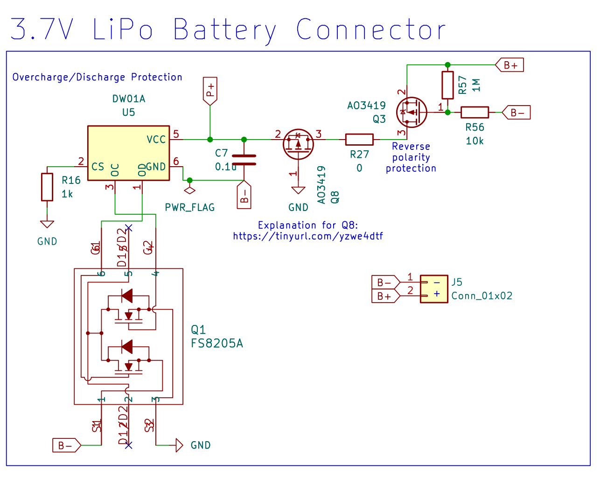
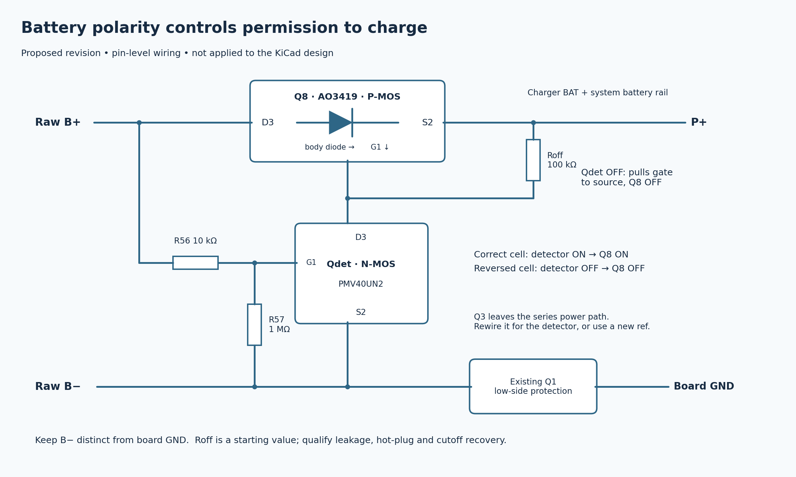
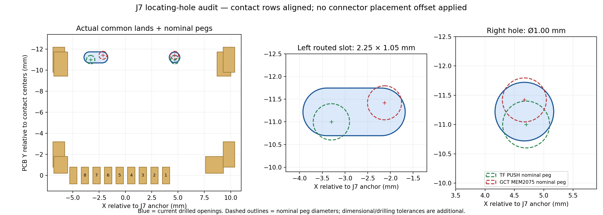
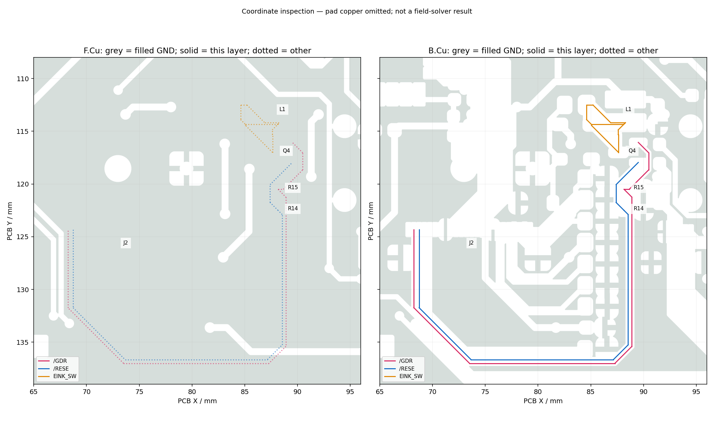
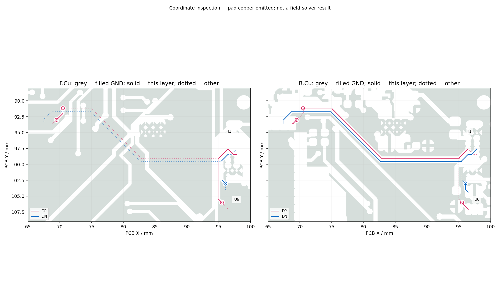

# Silkscreen — design review and assembly decision

**Authoritative review, 2026-09-17.** This document replaces the older review and the separate September 16 audit/follow-up reports. All conclusions and release actions live here. [HARDWARE.md](docs/HARDWARE.md) is the connection and firmware reference; the [audit folder](docs/audit-2026-09-16/) contains measurements, source records, images and scripts, not another verdict.

## 1. Decision

**Work out the items below before an unconditional “yes, assemble this PCBA.”** The design is a credible prototype: the netlist and PCB agree, the saved manufacturing files match the current board, and most circuit blocks are coherent. The deciding issues are component qualification, a battery fault path and SD-socket mechanics. Vias, dense routing and repeated cosmetic DRC warnings are not the deciding issues.

| Action | Finding and consequence | Required disposition |
|---|---|---|
| **Battery reverse-insertion — DECIDED: "Fix 4"** | With USB powering the charger, Q8 (gate hard to GND) is enhanced by the charger-driven P+ and Q3's body diode completes a path into a reversed cell. Behavioral simulation of the as-built nets shows the **full ≈0.25 A programmed charge current flowing continuously through the reversed cell** plus ≈2 mA through U5's CS ESD diode (U5's own supply clamps near −0.1 V through R16). | Gate the TP4056 **CE** pin from a cell-polarity detector **referenced to raw B−** (BSS138 + AO3419 + four resistors, all existing BOM lines, ≈3.4 µA idle). Simulated safe in every case, including flat-cell recovery, hot-swap and latched-connector insertion. **To be wired into the schematic; bench-verify per §13 with a current-limited emulator.** See §4. |
| **Replace Q4 — APPLIED** | The previously ordered BSS138 is outside the panel supplier's switch-resistance requirement and lacks a low-drive guarantee. | Source now specifies genuine **Infineon IRLML6346TRPBF / C67276** (same SOT-23 G/S/D pads). Q5/Q6 stay BSS138. Ensure the factory BOM carries C67276. Bench-verify panel-driven switching per §13. See §7. |
| **Resolve J7 fit — APPLIED** | The first assembled order was cancelled because the dual-source land ignored the TF PUSH's Ø0.80 mm pegs at 8.0 mm; the interim 1.05 mm slot was still ≈0.1 mm short for both candidates. | Library and board now carry NPTH **slots 1.50 mm tall** sized to the union of both parts' pegs, with the GCT body keepout marked on Dwgs.User. Owner confirmed seating against both parts' 3D models. Remaining: vias inside the GCT keepout matter only for a hand-fitted MEM2075. See §6. |
| **Close D2 substitution — ACCEPTED** | The original BOM specified reverse-mount C2827254, which needs a board cutout. | Normal-emitting red 1206 **C28310439 / YLED1206R** accepted for D2 (≈1.3–1.6 mA with R59). Carry it in the next upload BOM. |
| **Reduce full-scale frontlight current — APPLIED** | R37 = 13.3 Ω gave 15.04 mA nominal / 15.65 mA upper against the panel's ≤15 mA limit. | Source now **R37 = 15 Ω** (13.33 mA nominal, 13.87 mA upper). This sets the brightness ceiling only; dimming is by ADIM. See §8. |
| **Qualify the first article** | U3's shared 500 mA budget, heat, e-paper drive, frontlight transitions and USB input loading lack physical measurements. | Complete the acceptance plan in §13 before a repeat production order. **R6 stays 4.7 kΩ (≈0.25 A, 0.5 C for a 500 mAh cell) for the first batch**; change to 10 kΩ only if U3 runs hot while charging a low cell (U11 sits ≈12 mm from U3). Self-powered USB detach is accepted as a firmware responsibility; no VBUS-sense hardware planned. |

The owner reports that the actual FT01C frontlight matches the schematic. **Keep that wiring for the checked sample.** The conflicting supplier drawing remains a procurement warning, not evidence that the checked sample is wrong. The failure condition for a genuinely differently wired panel is documented in §8.

**Status (2026-09-17, decisions folded in):** Q4, R37 and J7 are applied in the source and D2 is accepted; the battery fix (§4, "Fix 4") is decided and awaits schematic wiring; R6 stays 4.7 kΩ pending the thermal check. **Controlled prototype:** ready to re-order once Fix 4 is wired and the upload BOM carries C67276 and C28310439. **Repeatable product:** still gated on the §13 first-article measurements, above all the battery-fault bench check with a current-limited emulator. This review does not demonstrate that existing boards will fail.

## 2. Scope, evidence and completeness

The engineering checks started from the KiCad schematic/PCB/project, component connections, manufacturer documents, PDFs directly under `docs`, and current local manufacturing records. Existing generated Markdown was used afterward to find contradictions. The layout PDF predates the current board, so critical copper conclusions use fresh `pcbnew` geometry and copper exports. Schematic illustrations are crops of the supplied PDF, corroborated against the fresh netlist.

| Verification | Result |
|---|---|
| Schematic references / nets | **173 / 126** |
| Block coverage | **18 blocks; each of the 173 references assigned exactly once** |
| KiCad PCB connectivity / schematic parity | **0 unconnected items / 0 mismatches** |
| Saved order population | **155 fitted, 8 DNP, 10 mounting-hole/test-pad references** |
| Passive nominal values | All fitted resistor/capacitor/inductor values match the schematic; no unexplained exclusions or duplicate order references |
| Fabrication Toolkit CPL replay | **All 157 entries match** X/Y, rotation and side; a CPL entry is not an instruction to fit a DNP part |
| Local manufacturing ZIP | **11 Gerbers match parsed geometry; 2 drill files match except timestamps** |
| Source preservation | Six persistent hashed design/production inputs unchanged; saved order worksheet matches its original extraction. The transient autosave matched the PCB at audit start and is now absent. |

Gerber comparison resolves apertures, drawing primitives, regions and polarity; it is not a complete factory CAM/DFM check. The 177 PCB footprint objects include graphical objects. Review identity is anchored by [source-manifest.json](docs/audit-2026-09-16/source-manifest.json), with final checks in [source-preservation.json](docs/audit-2026-09-16/source-preservation.json).

**Factory-state limit:** the matched order export dates from September 14 and the local ZIP from September 16. Matching local files does not prove which revision, CAM edits, rotation edits or substitutions JLC has accepted.

### Every schematic block

The full reference allocation is [block-coverage.csv](docs/audit-2026-09-16/block-coverage.csv); exact ordered parts and individual notes are [component-review.csv](docs/audit-2026-09-16/component-review.csv).

| Block | Main references | Result / detail |
|---|---|---|
| USB connector, shield, CC | J1, F1, R1–R3, C1 | Independent 5.1 kΩ Rd resistors and shield RC coherent; power/inrush qualification §3 |
| USB ESD | U6, CR1 | Exact U6 vendor pinout verified; CR1 operating-voltage margin §3 |
| Charger and USB indicator | U11, R6, R59, D2, C2/C3 | Charger topology coherent; LED substitution, current tolerance and disabled NTC §3 |
| Battery connector/protection/polarity | J5, U5, Q1/Q3/Q8, R16/R27/R56/R57, C7 | **USB-present reverse-battery fault concern**, sensing/filter issues §4 |
| Power mux | U2, R38/R51, C4/C25/C26 | Priority selection coherent; tolerance/hot-plug qualification §3 |
| 3.3 V regulation | U3, C6/C21 | Correct pinout/capacitor connections; shared current and thermal margin §3 |
| Battery ADC | R10/R12, C8 | P+/2, slow/high-impedance measurement; calibration §9 |
| USB status ADC | R17/R67/R70/R71, C23 | Normal states distinct; degraded states/top-code handling §9 |
| Processor, reset, boot, UART | U4, R7/R13/R63/R64, C5/C22/C32/C33, SW6/SW11, TP1/TP2 | Basic connections coherent; strap/boot/recovery limitations §5 |
| SDMMC and power gating | J7, U1, Q7, bus resistors/pullups, R40/R77/R78, C36/C37 | Electrical mapping and off-state coherent; **mechanical gate** §6 |
| E-paper interface and charge pump | J2, Q4, L1, D4–D6, R5/R14/R15/R29–R34, rail capacitors | **Q4 substitution** and waveform/layout qualification §7 |
| Frontlight boost, selection and ADC | J3, U10/U12, Q5/Q6, L2, R37/R39/R41/R49/R50/R75, C9/C12/C24/C31, TP3–TP5 | Current margin, >40 µs enable pulse and color-transition qualification §8 |
| Touch and pin-swap links | J4, U7, R42–R46/R52/R58/R66 | Default mapping coherent; link exclusivity, interrupt/wake limitations §10 |
| Button ladders and alternate wake link | SW1–SW5/SW7–SW9, ladder resistors, R72–R74, C27/C28 | Single-key levels coherent; combinations/wake limitations §9 |
| Power/wake button | SW10, R62/R76, C29 | Approximately 3.0 V pressed; GPIO18 suitable for RTC-domain wake §9 |
| Optional RTC | U13, C30 | VBAT-only topology supported; DNP, ±5 ppm, no backup/wake function §10 |
| Expansion and shared ESD | J6, U8/U9, D3/D8, CR2/CR3, R47/R48/R65/R68/R69 | Exact ESD pinouts verified; exposed supply/strap constraints §10 |
| Mounting | H1–H5 | No assembly parts required; enclosure/antenna interaction remains physical qualification §11 |

“Coherent” means no additional schematic defect was identified in the reviewed role. It is not a claim that unpowered analysis replaces functional, environmental or ESD testing.

## 3. USB input, charging, mux and regulator

### USB source and protection

J1 routes USB D− to GPIO19 and D+ to GPIO20. Each CC has its own 5.1 kΩ pull-down; the shield's 1 MΩ / 1 nF connection is intentional, not an omitted signal-ground connection. The connector is through-hole: verify that JLC's job includes its soldering, along with J5, J6 and the buttons.

There is no USB-PD/BC1.2 controller, CC-current measurement or automatic charge-current reduction. A healthy 5 V adapter is the normal intended source, but an arbitrary 500 mA USB host is not guaranteed to run the maximum workload while charging. An illustrative 350 mA 3V3 load + 250 mA charging + 56 mA frontlight input totals **656 mA** before small ancillary loads. This is a workload example, not a measured consumption figure.

**Self-powered USB needs a disconnect policy.** The MCU remains powered from the battery after USB removal, and there is no dedicated VBUS-sense GPIO. Espressif's USB-OTG/TinyUSB self-powered configuration expects VBUS monitoring; USB_STAT is an analog status mixture, not a direct substitute for its digital `vbus_monitor_io`. Firmware may implement a qualified software detection/disconnect path, but must not equate ST with physical USB presence in every condition. Verify detach/reattach with a powered-down host and battery operation; add direct divided/comparator VBUS sensing on a revision if the intended USB stack requires it. This is a product/firmware qualification gap, not a claim that native USB programming cannot work. **Decision (2026-09-17):** accepted as a firmware responsibility — the board does not enumerate while battery-powered, and with a healthy source the mux runs it from the host anyway; firmware must tear down USB on detach; no VBUS-sense hardware is planned. [Espressif self-powered device guidance](https://docs.espressif.com/projects/esp-idf/en/v5.5/esp32s3/api-reference/peripherals/usb_device.html#self-powered-device).

F1's Littelfuse 0805L100WR **1 A hold** rating is temperature-dependent: the manufacturer's derating table gives about **0.65 A at 60°C and 0.55 A at 70°C**. A warm enclosure can therefore matter even when room-temperature current is below 1 A. A PTC does not negotiate USB current. Check hot resistance/drop and trip behavior under the actual workload. [Littelfuse 0805L datasheet](https://www.littelfuse.com/assetdocs/littelfuse_ptc_0805l_datasheet.pdf?assetguid=3b1fa5dc-24aa-4363-b543-edb057c2fffa).

C2 = 10 µF and C25 = 1 µF are directly on the fused VBUS input: **11 µF nominal before downstream coupling**. This does not demonstrate the conservative 10 µF USB input-capacitance budget. Typical MLCC bias loss is not a guaranteed inrush limit. Also, TPS2116's soft-start applies when its output is below approximately 1 V; a battery-powered system already above that does not necessarily receive the same ramp on hot-plug. Measure VBUS droop/inrush with and without a battery. This is a compliance/robustness concern, not proof of enumeration failure. [TI USB inrush explanation](https://www.ti.com/document-viewer/lit/html/SSZTB15/GUID-9C081873-D60C-462A-ABFB-9A4E87F564F0), [TPS2116](https://www.ti.com/lit/ds/symlink/tps2116.pdf).

**Resolved 2026-09-17: CR1 becomes SMF6.5CA in SOD-123FL (6.5 V standoff by family definition — official and clone parts agree; see §12); CR2/CR3 keep the SD05C-class part. The finding below describes the earlier order.** CR1 is the ordered TECH PUBLIC SD05C, with **5.0 V working standoff** on a rail that can reach 5.25 V in an ordinary USB operating case. Leakage is not guaranteed by its 5.0 V specification at 5.25 V. Prefer an appropriately characterized ≥5.5 V working-voltage part, considering clamping too, or explicitly qualify the existing selection. This does not imply immediate breakdown at 5.25 V. Its surge-clamp specification also does not guarantee that a 6 V absolute-maximum IC survives every surge. CR2/CR3 on 3.3 V / ≤4.2 V have normal-DC margin, but are not precision rail limiters. [Exact SD05C sheet](https://datasheet.lcsc.com/datasheet/pdf/f9b7b3e2c9eb25bcff59f2b72aceabee.pdf?productCode=C907858).

### Charger and D2

U11's actual TOPPOWER TP4056 C16581 sheet gives `ICHG ≈ 1100/RPROG`, or **234 mA** for R6 = 4.7 kΩ, but its low-current example table is inconsistent (250 mA at 5 kΩ). Treat this as an intended approximately 0.25 A setting and measure the lot; the source annotation's exact 255 mA is not established. TEMP is grounded, disabling cell-temperature monitoring. Select the cell and charging-temperature range accordingly. UVLO rising is specified over approximately 3.5–3.9 V, with a separate input-to-battery headroom condition: **4.0 V is not an exact universal charging on/off threshold.** [Ordered charger sheet](https://datasheet.lcsc.com/datasheet/pdf/d328ee101cbb1f3719611cd61db479c2.pdf?productCode=C16581).

**Decision (2026-09-17): R6 stays 4.7 kΩ for the first batch** — 0.5 C for a 500 mAh cell, ≈2.5–3 h to full. The illustrative >500 mA USB overlap only stacks a millisecond Wi-Fi TX burst, full-brightness frontlight and the CC phase of a low cell on a strict 500 mA port, and its consequence is benign: VBUS sags, the TPS2116 hands the load to the battery (the ST+CHRG state) and charging continues at what the port allows. The real reason to lower it is heat: U11 sits ≈12 mm from U3 on the shared pour and dissipates ≈0.5 W at 0.25 A into a low cell. If the §13 thermal check shows U3 hot while charging a low cell with the frontlight on, change R6 to 10 kΩ (≈110–120 mA, ≈4.5–5 h); 12 kΩ (≈92–100 mA, ≈5.5–6 h) holds the worst-case stack at ≈500 mA. None of this interacts with the §4 fix, which gates *whether* the charger runs, not how much it sources.

The healthy-USB system load is on the mux output, separate from BAT, which helps normal charge termination. When the mux selects the battery despite a marginal USB source, system current and charger termination behavior must be considered together.

**D2 indicates USB power, not charging state.** C28310439 / YLED1206R is the **accepted** conventional-emitting red 1206 substitution for the existing pads. Its anode goes to USB_VBUS and cathode to R59. At 5 V and R59 = 2 kΩ, expect roughly **1.3–1.6 mA**, not the annotation's 2.5 mA. Optical brightness at this low current is not guaranteed by a 10 mA optical test. Carry it in the next upload BOM and confirm placement polarity. [Replacement LED sheet](https://datasheet.lcsc.com/datasheet/pdf/8e04df73a20896aea76d4672dc480ed1.pdf?productCode=C28310439).

### Mux and U3

U2's VIN1 is USB, VIN2 is P+, and **MODE is tied to USB_VBUS/VIN1** for priority behavior. With USB absent, MODE and PR1 are low, selecting the available battery path. R38/R51 = 300 kΩ/100 kΩ gives **4.0 V nominal**, approximately **3.625–4.385 V** with the specified ±8% reference and ±1% resistors. A normal 5 V source clears this. Lowering R38 is not a universal improvement: the threshold spread is wider than a narrow LDO-headroom guard band. Retain the nominal choice pending measured system requirements. ST is a selection/status output, not a USB-present comparator; it can also be low when channels are disabled or in thermal shutdown. [TPS2116](https://www.ti.com/lit/ds/symlink/tps2116.pdf).

U3 TLV75533PDBVR is **500 mA total**, shared by ESP32, SD, panel and touch. Espressif recommends a supply capable of at least 500 mA for the module alone. This does not prove simultaneous load exceeds U3's rating, but there is no established worst-case margin. The frontlight takes **LDO_IN**, so its main power bypasses U3. [ESP32-S3-WROOM module](https://www.espressif.com/sites/default/files/documentation/esp32-s3-wroom-1_wroom-1u_datasheet_en.pdf).

| Sustained 3V3 current | U3 loss at 5 V input |
|---:|---:|
| 150 mA | 0.255 W |
| 250 mA | 0.425 W |
| 350 mA | 0.595 W |
| 500 mA | 0.850 W |

TI lists DBV thermal benchmarks of **100.8°C/W on its EVM and 231.1°C/W in the JEDEC configuration**. Neither is this board's measured thermal resistance. At 250 mA they illustrate rises of roughly 43°C and 98°C. Do not use the better exposed-pad DYD package numbers for DBV. The 3.3 V version's 500 mA dropout maximum is 215 mV through 85°C, 238 mV through 125°C; battery operation below the necessary input headroom ceases to be regulated even before protection cutoff. [TLV755P](https://www.ti.com/lit/ds/symlink/tlv755p.pdf).

C4/C6 connections and close placement are good. Exact effective capacitance of the ordered CCTC 22 µF parts under bias/temperature was not established. Source-transition hold-up also depends on this: `0.4 A × 8 µs / 22 µF ≈ 145 mV` is a simple sensitivity example, not a prediction including all capacitors and converter response.

### U3 temperature scenarios: normal heat versus insufficient margin

**Generating heat is normal; U3 overheating has not been demonstrated.** A loss of 0.2–0.4 W alone is not a reason to reject an LDO. The relevant quantities are sustained load, local ambient temperature and the actual PCB's ability to remove heat. Short Wi-Fi/SD current peaks do not produce the full steady-state temperature rise; neither have the application's sustained current or duty cycle been measured. Espressif's approximately 355 mA Wi-Fi TX figure is explicitly a **peak** specification, not continuous reader consumption. [Module current table](https://www.espressif.com/sites/default/files/documentation/esp32-s3-wroom-1_wroom-1u_datasheet_en.pdf).

At **25°C local ambient**, nominal 3.3 V output, and constant current, `Tj ≈ 25 + (Vin − 3.3) × I3V3 × RθJA`. Each pair below is **TI EVM / TI JEDEC**, using 100.8 / 231.1°C/W for the DBV package. They are reference-board scenarios, **not guaranteed lower/upper bounds for this PCB**. The EVM uses a thermally optimized layout; this board cannot automatically claim its result. These are internal junction temperatures, not board or case-surface temperatures.

| Sustained total 3V3 current | Full battery, 4.2 V | USB, 5.0 V | High USB case, 5.5 V |
|---:|---:|---:|---:|
| 150 mA | 39 / 56°C | 51 / 84°C | 58 / 101°C |
| 250 mA | 48 / 77°C | 68 / 123°C | 80 / 152°C |
| 350 mA | 57 / 98°C | 85 / 163°C | 103 / 203°C* |
| 500 mA | 70 / 129°C | 111 / 221°C* | 136 / 279°C* |

**125°C is the recommended maximum junction temperature.** Thermal shutdown is typically about **165°C**; starred values are mathematical extrapolations beyond shutdown, not sustainable regulated operating temperatures. The 500 mA row is a stress case at the LDO's output rating, not an estimate of this reader's typical consumption. At 40°C local ambient add approximately 15°C to these calculations. Charger, frontlight, MCU and enclosure heating can change the local thermal conditions and are not solved by this single-device model. Input path losses were neglected; full component tolerances were not included. [TI thermal limits and benchmarks](https://www.ti.com/lit/ds/symlink/tlv755p.pdf).

The full-cell case is hotter for U3 than a partly discharged battery. At 3.7 V and 250 mA, the same scenarios give only **35 / 48°C**. Near 3.4 V, dropout/load transients become the concern instead. The high USB column uses **5.5 V**, which USB-IF permits at VBUS; the earlier 5.25 V example is not the universal USB upper limit. [USB-IF voltage update](https://compliance.usb.org/index.asp?UpdateFile=Electrical).

**Practical disposition:** a sustained load around 150 mA gives ordinary, potentially acceptable warmth in these scenarios; a sustained 250–350 mA from USB deserves measurement because the less favorable reference scenario approaches/exceeds 125°C. Brief peaks alone do not establish that problem. There is no thermal-only respin recommendation without the actual load/temperature result. Slower charging lowers U11's heat and input demand but leaves U3's own loss essentially unchanged at fixed VIN/load. R6 = 10 kΩ is an optional roughly 110–130 mA charge setting, not an applied source change. Compare U3 temperature with charging inactive/active under the same workload.

**Owner's workload clarification (2026-09-17):** SD and Wi-Fi use are transient, continuous screen refreshing is outside intended use, and the ESP32 rarely runs at full power. Accept that as the intended duty cycle; the high continuous-current rows above are stress scenarios, not a prediction of normal operation. Retain the present LDO pending a realistic firmware/enclosure test. Thermal qualification is not an independently demonstrated design defect. Check the longest supported sync/update activity and normal operation while charging; transient 3V3 droop remains a separate electrical check even if average heat is modest.

#### How a thermocouple result informs the design

Attach a small, fine-wire thermocouple (approximately 36–40 AWG) to the package's top center with minimal adhesive and avoid shorts/large probe heat sinking. Log local ambient and package temperature until they settle, preferably in the intended enclosure. Estimate U3 power from its input/output voltage and **3V3 current**, excluding battery charging and the main frontlight load. TI recommends `Tj ≈ Ttop + ΨJT × PD`; DBV ΨJT is 23.3 / 28.4°C/W in its two reference configurations. This is an estimate, not a substitute for the recommended operating limits; do not apply the junction-to-case thermal resistance as if all heat flowed through the package top. [TI measurement guidance](https://www.ti.com/lit/pdf/spra953), [TLV755P junction-temperature estimation](https://www.ti.com/lit/ds/symlink/tlv755p.pdf).

For example, **75°C package top at 25°C ambient, with 0.25 W dissipation**, implies approximately **81–82°C junction**. Extrapolating the same temperature rise to a 45°C environment gives about **101–102°C**; verify in the enclosure because power, airflow and nearby heating can change. A working design target around 100–110°C maximum estimated junction provides margin below the 125°C recommended limit; it is a proposed engineering target, not TI's formal limit or an enclosure touch-temperature criterion.

| Result | Design response |
|---|---|
| Stable 3V3 and adequate junction-temperature margin at intended worst use/ambient | Keep the LDO; normal warmth needs no fix. |
| Margin becomes poor mainly when charging | Reduce charging current and retest the surrounding temperature; U3's own conversion loss is unchanged at fixed load/input. |
| U3 itself is too hot at the permitted workload | Improve connected copper/ground heat paths, or use a thermally enhanced regulator package on a revision. An exposed-pad package requires its intended footprint/ground connection. |
| Sustained power loss is intrinsically too large | Use a suitable switching supply on a revision, with battery-range, transient, quiescent-current and EMI requirements checked. |

A **5 V shunt zener is not the thermal remedy**: it does not reduce the normal 5-to-3.3 V loss, needs controlled current for clamping, and adds dissipation/load when it conducts. A series dropper only relocates heat and consumes voltage headroom; altering the USB branch also requires checking mux selection thresholds. Neither is a justified automatic modification based on a warm package.

Reproducible values and assumptions: [thermal-scenarios.json](docs/audit-2026-09-16/thermal-scenarios.json), generated by `thermal_scenarios.py` in the same folder.

## 4. Battery protection: a newly identified fault path

### Why the reverse-insertion claim is unsafe with USB present

The actual netlist, not the “reverse polarity protection” label, gives:

- **Q3:** source B+, drain toward R27/Q8, gate pulled mainly toward B− through 10 kΩ R56, with 1 MΩ R57 to B+.
- **Q8:** source P+, drain toward R27/Q3, **gate permanently at board GND**.
- **U5:** VCC = P+, GND = B−.
- **Q1:** low-side battery protection between B− and board GND.

An AO3419 P-channel MOSFET's body diode conducts **drain to source**. USB can make the charger raise P+ and enhance Q8 even when the cell is reversed. Q3's channel may be off, but its body diode faces from the common-drain path **into B+**. Therefore “Q3 is off” does not establish isolation from the charger. [AO3419](https://www.aosmd.com/res/data_sheets/AO3419.pdf).

One conditional voltage calculation exposes the problem. If Q8 is on, neglect its small drop; if Q3's diode conducts, `B+ ≈ P+ − Vf`. For a reversed cell, `B− = B+ + Vcell`. Consequently:

```text
U5 supply = VCC − GND = P+ − B− ≈ Vf − Vcell
Example: 0.7 V − 4.2 V = −3.5 V
```

This is **not a simulated steady state or a predicted fault current**. Internal clamps, the charger, Q1 and parasitics will change the resulting voltages/currents. It demonstrates that the claimed benign blocked state is unsupported and that U5 can be forced toward a strongly reversed supply. Opening Q1 does not disconnect U5's ground pin from B−. Charger-present reverse-polarity protection requires deliberate design; the same general pitfall is discussed in [Analog Devices AN-171](https://www.analog.com/en/resources/app-notes/an-171.html).



**Disposition:** remove the “bare cell safe/full reverse protection” claim. Rework and validate the topology before a replaceable-cell product. Do not simply flip a transistor or add one resistor without checking normal charge/discharge, hot-plug, protection cutoff and recovery. A restricted engineering prototype can use a permanently verified correct-polarity harness. Fault characterization should use current-limited simulators with monitored IC voltages, **not deliberate reversal of a real LiPo**.

### Does USB operation make the existing fault harmless?

**No, although the system may still run from USB.** The actual source has two parallel USB-fed branches: USB_VBUS → U2/TPS2116 VIN1 → LDO_IN → U3, and USB_VBUS → U11/TP4056 → P+ → battery/protection circuitry. Selecting USB in the mux does not disconnect the charger branch. Normal USB supply can therefore sustain the MCU/LDO while U5 or the battery-path devices are stressed. If the fault pulls down VBUS or violates a mux input rating, continued system operation is not guaranteed either. [TPS2116 datasheet](https://www.ti.com/lit/ds/symlink/tps2116.pdf).

The evidence establishes a potentially damaging, unqualified electrical condition, **not certain instantaneous chip destruction or a measured time-to-failure**. U5's reversed supply is the most direct IC concern; its published limits do not authorize several volts of reverse supply. Internal junction conduction can begin before noticeable heating. Depending on the actual parasitic paths and current, the result could be recovery, latent damage, prompt IC failure, or subsequent heating of other battery-path parts. No safe user reaction time has been established. If reverse-supply junctions complete a local battery loop through U5 and Q8/Q3, the cell can also supply fault current; the approximately 0.25 A programmed charger current is not a proven upper bound on every fault current. This is a conditional mechanism, not a simulated clamp model.

The trigger is overlap of USB power and reversed battery insertion, in **either insertion order**. It is not limited to a user trying USB after the board fails to start. For the owner's current controlled prototype, verifying the cable polarity before connection remains a reasonable way to use the existing board; the analysis does not establish an everyday fault with a correctly connected cell. A field-replaceable battery requires a different error-tolerance decision.

### Decided fix (2026-09-17): charge-enable gated by a B−-referenced cell-polarity detector ("Fix 4")

**Chosen for the next spin.** Rather than re-engineering the power switch, the fix removes the *aggressor*: the TP4056 only sources into P+ while its CE pin is high, and with CE low the BAT pin is isolated (< 2 µA in disable/sleep mode; the internal pass PMOS body diode is reverse-biased for VCC > BAT — C16581 sheet). CE is therefore driven high only while a correctly oriented cell is present.

| Part (all existing BOM lines) | Connection |
|---|---|
| Q_det — BSS138 (C7420339) | gate ← **B+** via R_a; **source → raw B−**; drain → node X |
| R_a — 100 kΩ (C25803) | B+ → Q_det gate |
| R_b — 1 MΩ (C22935) | Q_det gate → **B−** (no cell ⇒ Vgs = 0 ⇒ off) |
| R_c — 1 MΩ | X → 3V3 |
| Q_pass — AO3419 (C88053) | source → 3V3; gate → X; drain → **U11 pin 8 (CE)** |
| R_d — 1 MΩ | CE → GND (default: charger disabled) |
| — | **Remove the CE → USB_VBUS tie.** Q3, Q8, R27, R56, R57, U5, Q1 unchanged. |

Correct cell → Q_det on → X ≈ B− → Q_pass on → CE = 3V3 → charging. Reversed or absent → X = 3V3 → Q_pass off → CE low → charger off. CE only ever sees 3V3 or GND, never raw battery. Added idle drain is R_a+R_b across the cell, **≈3.4 µA at 3.7 V** (the existing R56/R57 already draw ≈3.7 µA). 3V3 is present whenever USB is — the only time charging is possible. Neither transistor needs a low-threshold part: Q_det only sinks the 1 MΩ pull-up (gate = B− + 0.91·V_cell, 2.18 V at the 2.4 V DW01A cut-off against a 1.5 V worst-case Vth — simulated at that corner), and Q_pass drives a logic pin at Vgs ≈ −3.3 V.

**The one non-obvious rule: the detector must sense B+ relative to B−, not system GND.** A cell at or below the DW01A cut-off has Q1 open and floats as a whole; a GND-referenced detector then reads ≈0 V, never enables CE, the charger never starts and Q1 never closes — a flat cell could never be recovered.

**Behavioral simulation (LTspice, as-built nets, generic VDMOS/diode models; not a device qualification).** The deck models Q3/Q8/R27/R56/R57 as netlisted, U5 with its GND→VCC substrate diode and CS ESD diodes (CS to GND through R16), Q1 as two body-diode NMOS, C7/C3/BAT_MONIT, the TP4056 as a CE-gated current source with no VCC→BAT conduction, and the TPS2116 as a blocking mux. Cells connect through a switch so every case starts from a defined state.

| Scenario | As-built | **Fix 4** |
|---|---|---|
| Discharge 3.7 V / charge 3.7 V | normal | normal, CE = 3.3 V |
| Charge a 2.5 V over-discharged cell (Q1 open) | 0.25 A | **0.25 A** (also at worst-case BSS138 Vth = 1.5 V) |
| **Reversed cell + USB** | **0.25 A sustained through the cell**, ≈2 mA in U5's CS ESD diode | CE off, charger 0, cell ≈8 µA, U5 supply +0.6 V |
| Reversed insert while P+ still charged (hot-swap; latched empty connector) | same 0.25 A | self-recovers to the µA state; U5 dips to ≈−0.14 V for µs while C3 (≈90 µJ) discharges |
| Reversed, no USB | µA | µA |

Findings that changed the picture: (1) the as-built hazard is a **sustained, charger-limited 0.25 A through the reversed cell** (charger → Q8 → Q3 body diode → cell → Q1 → GND) plus ESD-diode abuse — not the −3.5 V on U5 estimated above, because U5's CS pin clamps its GND pin through R16; the result is the same whether the unpowered DW01A drives or floats the FS8205A gates. (2) Alternatives rejected by the same deck: a GND-referenced CE-gate (flat-cell deadlock, above); tying Q8's gate to B− (still 0.25 A — the low side drags B− toward GND, so Q8 stays enhanced); the Q8-detector proposal below with a GND-referenced detector (same deadlock). A B−-referenced detector that also drives Q8's gate ("Fix 5") is equally safe and keeps U5 from ever going negative, but costs a second FET and ≈3.7 µA of Roff bias; not chosen. (3) An empty connector remains energized while USB is present (as built today); inserting a reversed cell into that state un-latches cleanly.

**Bench verification before relying on it (§13 step 9):** correct/reversed/flat-cell insertion with USB absent and present, removal followed by immediate reversed reinsertion, using a current-limited emulator — never a real reversed LiPo. Capture CE, P+, U5 VCC−GND and connector current. Decks and results: [run_revpol.py](docs/audit-2026-09-16/run_revpol.py), [run_revpol2.py](docs/audit-2026-09-16/run_revpol2.py), [revpol-results.json](docs/audit-2026-09-16/revpol-results.json), [revpol-results2.json](docs/audit-2026-09-16/revpol-results2.json).

### Superseded alternative: battery-polarity-controlled Q8 (not chosen — standby cost; kept for reference)

**Proposal, not applied to the schematic, PCB, or factory order.** Keep one AO3419 as the series power switch, and use a small N-channel MOSFET to control it from the voltage **across the raw cell terminals**. Q8's gate must no longer be permanently grounded. This is a topology to evaluate, with a defensible DC blocking mechanism; **the owner rejects the initial +42 µA standby penalty, so the illustrated 100 kΩ bias is a simulation baseline, not an accepted production recommendation.** A lower-consumption implementation and fault qualification remain necessary.

The intuition is: **a correctly connected cell turns on the detector, which turns on the power switch. A reversed cell turns the detector off, allowing a resistor to turn the power switch off even when USB is present.** The on-state power channel supports both charging and discharge. The remaining PMOS body diode faces from B+ toward P+, blocking the charger-to-reversed-cell direction when the channel is off.



| Connection | Proposed wiring |
|---|---|
| Q8 AO3419 power switch | **Drain pin 3 → raw B+; source pin 2 → P+; gate pin 1 → detector drain.** R27 may remain as a suitably rated service jumper in the power path. |
| Original Q3 | Remove its PMOS from the series path. Its reference/location may be repurposed for the detector, with different wiring; **this is not a drop-in transistor substitution**. |
| Detector Qdet | N-channel candidate **Nexperia PMV40UN2**: drain pin 3 → Q8 gate; source pin 2 → **B−**; gate pin 1 → R56. |
| R56, 10 kΩ | Raw B+ → detector gate. |
| R57, 1 MΩ | Detector gate → raw B−. |
| New Roff, initially 100 kΩ | Q8 gate → Q8 source/P+. This establishes the off state when the detector is off. |
| Existing low-side protection | Preserve Q1 between B− and board GND, controlled by U5. **Do not short B− to GND or move the detector's reference to GND.** |

PMV40UN2 is a candidate with guaranteed 1.8 V gate-drive resistance and ±12 V gate tolerance; its gate can therefore withstand the nominal ±4.2 V cell-polarity test. Its role is to sink tens of microamps of gate-bias current, not supply the board. Hot leakage and switching behavior still need qualification. [Nexperia datasheet](https://assets.nexperia.com/documents/data-sheet/PMV40UN2.pdf).

For Q8, a 4.2 V charger rail against a −4.2 V reversed battery terminal produces approximately 8.4 V drain-source stress with a conducting low-side return, within AO3419's 20 V rating before transients. At an actual gate drive of at least 2.5 V, its 25 °C maximum resistance specification is 140 mΩ: 500 mA gives 70 mV and 35 mW for this one FET. Hot resistance is higher. Removing the second series PMOS reduces conduction loss; these values exclude Q1, wiring and R27. The AO3419's 1.8 V resistance row is **typical-only**, not a maximum guarantee. [AOS datasheet](https://www.aosmd.com/res/data_sheets/AO3419.pdf).

| State | Expected behavior and limits |
|---|---|
| Correct cell, battery operation | Detector on, Q8 on; its body diode provides an initial supply path during startup. |
| Correct cell, USB charging | Detector remains on from positive raw-cell voltage; Q8 permits charging in the opposite direction. |
| Reversed cell, USB absent or present | Detector gate-source voltage is negative. Roff brings Q8 gate to its source; Q8's channel and reverse-biased body diode block the sustained power path. Small bias/leakage currents remain. |
| No battery, USB present | **Do not assume B+ is unpowered.** An already-on Q8 can feed B+ from the charger and keep the detector on. This circuit detects applied polarity, not battery presence. |
| Protected pack presenting 0 V | Automatic recovery is **not guaranteed**. A cold off-state detector has no positive cell voltage to enable charging. Normal recovery from the onboard DW01 cutoff with a still-positive raw cell is a different case and must be tested separately. |

**Standby cost:** with the initial values, nominal bias is approximately 27–46 µA across a 2.5–4.2 V cell, excluding device leakage and rail drops. At 4.2 V this is about **42 µA more than the existing divider**, or **30 mAh per 30 days** if that current persisted continuously. The extra bias can continue after Q1 disconnects the system, so it matters for depleted-cell storage. Increasing Roff reduces consumption but slows turn-off and increases sensitivity to detector/board leakage; do not make that change without testing. At 100 kΩ, just 5 µA pulling the gate down produces 0.5 V gate-source bias, comparable to the AO3419's minimum 25 °C threshold. The detector's 25 °C leakage limit is not a hot-temperature guarantee.

The following are **bias calculations, not approved resistor substitutions**, at 4.2 V with R56 = 10 kΩ. Total includes Roff and the detector divider, assumes negligible on-state detector voltage, and excludes leakage. The existing divider alone draws 4.158 µA.

| Roff | Detector R57 | Proposed total bias | Increase over existing divider |
|---|---|---|---|
| 100 kΩ | 1 MΩ | 46.16 µA | 42.00 µA |
| 470 kΩ | 1 MΩ | 13.09 µA | 8.94 µA |
| 1 MΩ | 1 MΩ | 8.36 µA | 4.20 µA |
| 1 MΩ | 10 MΩ | 4.62 µA | 0.46 µA |

Thus the 42 µA increase is not fundamental. However, PMV40UN2's specified room-temperature off leakage can be as large as 1 µA at its stated test voltage: that current through 1 MΩ would create 1 V of unintended PMOS gate bias. This is a conservative margin check, **not a claim that the detector actually leaks 1 µA in this circuit's reversed-gate, approximately 4 V condition**. The present part selection and generic simulations do not guarantee the lower-current rows. A low-leakage small-signal detector or an active gate pull-up could improve that tradeoff; select and qualify it for the intended temperature range, board leakage and insertion transients. Set a low incremental standby budget (for example, ≤1–5 µA) before settling the implementation rather than accepting +42 µA for this e-reader.

**Evidence and qualification:** eight LTspice DC cases were run with explicitly generic MOSFET approximations. They demonstrate bidirectional normal operation, a reversed-cell off state with USB present, a blocked 0 V startup case, and the energized-empty-connector state described above. They do **not** model the actual TP4056/DW01/FS8205, device leakage/corners or hot-plug behavior. Files: [netlist](docs/audit-2026-09-16/reverse-polarity-concept.cir), [runner/diagram generator](docs/audit-2026-09-16/reverse_polarity_concept.py), [results and bias calculations](docs/audit-2026-09-16/reverse-polarity-concept.json). Simulation raw files stay outside the repo.

Before releasing this change, exercise correct/reversed insertion with USB both absent and active, removal followed by immediate reversed reinsertion, contact bounce, low-side cutoff/recovery, and the intended temperature range. Use a suitable current-limited battery emulator; capture P+, U5 VCC−GND, Q8 gate-source voltage and connector current. Check MOSFET pulse energy/operating area and all IC voltage limits, not merely the final off state. In particular, the already-energized connector and charger output capacitance can produce an insertion pulse before the detector turns Q8 off. Charger-connected reverse protection is also the subject of [ADI AN-171](https://www.analog.com/en/resources/app-notes/an-171.html); the circuit proposed here is our analysis, **not a claimed reproduction or validation of ADI's tested circuits**.

### Normal-operation observations

The exact TECH PUBLIC six-pin FS8205A pinout agrees with Q1: S1 pin 1 → B−, S2 pin 3 → GND, gates 6/4 → OD/OC. Pins 2/5 are internally common drains; leaving their PCB pads externally unconnected is not an open discharge path. Vendor package identity still matters. [Manufacturer drawing mirror](https://images.100y.com.tw/pdf_file/41-FS8205A.pdf).

The ordered PUOLOP DW01A C351410 senses **P+ after the two PMOSs**, rather than directly across the physical cell. Load-dependent PMOS drop and transients affect its apparent cell voltage. Its reference circuit has a **100 Ω VCC filter resistor**, absent here; C7 alone is not that filter. Review the sensing point and filtering in the redesign. Adding the resistor alone does not repair the reverse-battery problem. [Exact DW01A sheet](https://datasheet.lcsc.com/datasheet/pdf/0d2b2b5e8d1207bf276387cb4ff3a495.pdf?productCode=C351410).

R56+R57 draws about **4.16 µA at 4.2 V** across the cell even after low-side cutoff. R27's nominal 0 Ω still has finite current/thermal/drop ratings. J5 pin 1 is B−, pin 2 B+; connector style does not guarantee cable polarity. The approximately 2.5 V protection cutoff is a last-resort cell protection point, not the normal endpoint of a 3.3 V ESP32 system. Firmware must stop earlier based on usable rail headroom and the cell specification.

## 5. MCU, reset, boot and supply decoupling

The ordered module is **ESP32-S3-WROOM-1-N16R8**. GPIO35/36/37 are left unused, consistent with octal PSRAM. USB, ADC and display/SD assignments agree with the netlist. EN has 10 kΩ/1 µF startup timing, with SW11 reset through 100 Ω. GPIO0 has its pull-up and accessible SW6 pads, but **SW6 is unselected in the order**. UART RX/TX are on TP1/TP2; no UART DTR/RTS automatic boot circuit is provided.

Expansion GPIO3/45/46 are boot straps. Attached accessories must respect reset levels; setting software pulls afterward cannot repair a wrong sampled strap. GPIO46 is input-only. GPIO39–42 overlap JTAG roles, so firmware must configure them for SCL, COLOR_SEL, TP_INT and PWM_LED. Do not assume a debug configuration is harmless to connected peripherals. [ESP32-S3 datasheet](https://www.espressif.com/sites/default/files/documentation/esp32-s3_datasheet_en.pdf), [Espressif schematic checklist](https://docs.espressif.com/projects/esp-hardware-design-guidelines/en/latest/esp32s3/schematic-checklist.html).

C32 is approximately **4.61 mm** from the module supply pad; C33 and the module's internal bypassing also serve local transients. **C22 is 51.84 mm from that pad**, near the display area: its source annotation does not make it MCU-local. This is a placement/documentation correction, not a claim that the module has no decoupling. Confirm 3V3 at the module under Wi-Fi/SD/display overlap.

## 6. SDMMC: sound power logic, unresolved socket mechanics

### Electrical checks

The original, TF PUSH and GCT contact numbering agrees: **1 DAT2, 2 DAT3, 3 CMD, 4 VDD, 5 CLK, 6 GND, 7 DAT0, 8 DAT1**. Shield/detect arrangement does not provide an independent firmware card-detect signal here.

All six lines have 33 Ω series resistors. CMD/DAT pull-ups return to switched **SD_VDD**; CLK has no pull-up. DAT0/DAT1 are protected by **U9**, the other four signals by U1. They are not missing ESD protection. The exact TECH PUBLIC array pinout is now verified (§10).

Q7 source = 3V3, drain = SD_VDD; R40 pulls its gate high and R78 is the series control resistor:

- `SD_ACTIVATE LOW`: on.
- `HIGH`: off.
- **High impedance with internal pulls disabled:** off through external R40; no actively latched high GPIO is required during sleep.

Flush/unmount, stop the SD host, then remove active drives/internal pull-ups from all bus pins before power-off. An unpowered card can otherwise be back-powered through signals. R77 and nominal C36+C37 give **0.11 s** no-card discharge time constant; the card adds capacitance. Measure SD_VDD before assuming a short off interval is a true power cycle. The actual card-side routes after the resistors are approximately 5.95–7.94 mm with no main-path vias; longer protection branches still deserve high-speed testing.

### J7 peg fit — resolved (2026-09-17)

Root cause: the dual-source land was built from the TF PUSH DXF as "fully SMD, no pegs", ignoring the datasheet's **2 × Ø0.80 mm pegs at 8.00 mm**; the first assembled order was cancelled over it. The owner's interim fix (left slot 2.25 × 1.05 mm, right hole Ø1.00) was still ≈0.1 mm short in Y for both candidates.

| Feature (footprint-local mm, contacts at Y = 0) | Now in the library and on the board |
|---|---|
| Left locating hole | NPTH **slot 2.25 × 1.50**, center (−2.73, 11.20) — union of the TF peg (−3.30, 11.00, Ø0.80) and GCT peg (−2.13, 11.42, Ø0.75) plus ≈0.15 mm clearance |
| Right locating hole | NPTH **slot 1.05 × 1.50**, center (4.70, 11.20) — TF (4.70, 11.00) and GCT (4.67, 11.42) share X and differ 0.42 mm in Y |
| GCT body keepout | 10.20 × 4.05 marked on **Dwgs.User**, center (−0.68, 5.53) (X −5.78…4.42, Y 3.50…7.55) |

The owner confirmed seating against **both parts' 3D models** and updated the placed footprint; the library `.kicad_mod` carries the same geometry and a corrected description, so a library update cannot reintroduce the round holes. Physical first-article confirmation of TF PUSH seating and fillets remains in §13.

GCT's keepout still contains three vias and component-side traces. That matters only if an MEM2075 is hand-fitted; it is irrelevant to the TF PUSH factory build. Reroute before a GCT build, not before this one.



The GCT model reference into Downloads is nonportable. [SHOU HAN sheet](https://datasheet.lcsc.com/datasheet/pdf/dc83ceb7bc09989eab2815b685da60e4.pdf?productCode=C393941), [GCT drawing](https://gct.co/files/drawings/mem2075.pdf), [measured comparison](docs/audit-2026-09-16/sd-mechanical-comparison.json).

## 7. E-paper: Q4 replacement and switching qualification

J2 pin 5 is **VSH2**, not VGH. Digital mapping, boost rectifier directions and negative charge-pump polarity agree with the panel topology. Preserve the explicitly **50 V** capacitors, including C11/C13–C17 at 4.7 µF and C18–C20 at 1 µF in the order. Effective capacitance under bias is a separate qualification.

EPD_RST has its pull-up; EPD_CS has no discrete pull-up. Firmware should establish an inactive CS before clock activity and maintain defined panel control levels in sleep. A CS pull-up is an optional next-revision improvement, not an identified wiring defect. The 40 V charge-pump diodes have plausible normal rail-voltage margin, but hot leakage and switching overshoot remain part of the rail test; the flying node's diode clamp must be considered before incorrectly adding both rail magnitudes as a diode's reverse stress.

Q4 gate is GDR, source is RESE/R14, drain is EINK_SW. The panel reference requires **VDS ≥30 V, VGS(th) ≤1.5 V, RDS(on) ≤0.4 Ω**. The ordered hongjiacheng BSS138 C7420339 has **3 Ω maximum at 4.5 V**, only 1.2 Ω typical, and no 2.5/3.3 V resistance guarantee. It is outside that selection criterion. Low average display current does not qualify its switching role. [Panel reference p11](https://www.good-display.com/companyfile/1946.html), [exact BSS138 sheet](https://datasheet.lcsc.com/datasheet/pdf/e82111e7bf6514856f73f1b91d3645f8.pdf?productCode=C7420339).

### Replacement comparison

All parts below are 30 V N-channel. Resistance is maximum at 25°C; charge/capacitance are typical. Charge tests use different drain voltages/currents, and capacitance tests different drain biases; the figures compare approximate drive burden, **not exact switching-time ratios**.

| Part | RDS(on) at 2.5 V | Qg at 4.5 V | Ciss | Assessment |
|---|---:|---:|---:|---|
| Vishay Si1308EDL, panel reference | 185 mΩ | 1.4 nC | 105 pF | Reference drive burden; **SC-70**, not a normal SOT-23 substitute |
| **Infineon IRLML6346TRPBF / C67276** | **80 mΩ** | **2.9 nC** | **270 pF** | Preferred existing-footprint candidate |
| Diodes DMN3150L-7 / C156268 | 115 mΩ | 3.7 nC | 305 pF | Reasonable alternate |
| AOS AO3400A / C20917 | 48 mΩ | 6.0 nC | 630 pF | Basic cost candidate; heavier unknown-driver load |
| Nexperia PMV40UN2 | 53 mΩ; 78 mΩ at 1.8 V | 7.0 nC | 635 pF | Stronger low-drive guarantee, higher charge |
| Diodes DMN3200U-7 | 110 mΩ; 200 mΩ at 1.5 V | Not tabulated | 290 pF | Worth characterization; 471/104 ns published turn-off delay/fall less attractive for unknown GDR drive |

Primary sheets: [Si1308EDL](https://www.vishay.com/docs/63399/si1308edl.pdf), [IRLML6346](https://www.infineon.com/assets/row/public/documents/24/49/infineon-irlml6346-datasheet-en.pdf), [DMN3150L](https://www.diodes.com/datasheet/download/DMN3150L.pdf), [AO3400A](https://www.aosmd.com/res/data_sheets/AO3400A.pdf), [PMV40UN2](https://assets.nexperia.com/documents/data-sheet/PMV40UN2.pdf), [DMN3200U](https://www.diodes.com/datasheet/download/DMN3200U.pdf). [Exact JLC Infineon listing](https://jlcpcb.com/partdetail/InfineonTechnologies-IRLML6346TRPBF/C67276).

**Applied 2026-09-17: the source now specifies IRLML6346TRPBF (C67276) for Q4;** carry C67276 in the factory BOM so a clone or BSS138 is not substituted. IRLML6346's G1/S2/D3 functions and 1.90 mm lead pitch agree with the current SOT-23 pads. Its threshold test current differs from some alternatives; threshold alone is not an on-resistance guarantee. Specify the genuine manufacturer part rather than silently approving every clone with a related name. Q5/Q6 only select approximately 15 mA branches and do not inherit Q4's rejection.

R14 raises the source: `VGS = VGDR − ISW × 3 Ω`. If GDR reaches 3.3 V, illustrative 100/200/300 mA pulses leave **3.0/2.7/2.4 V VGS**. The local SSD1677 sheet does not sufficiently specify loaded GDR drive/RESE trip behavior to prove this substitution solely by calculation. R15 = 10 kΩ also draws 0.33 mA at a 3.3 V gate level.

L1 = 22 µH, R14 = 3 Ω and R15 = 10 kΩ differ from the reference's 47 µH / 2.2 Ω / 1 MΩ. That is a **qualification requirement**, not proof the values are wrong. Earlier absolute claims that 22 µH guarantees particular peak currents or that 47 µH is categorically wrong were unsupported. R14's 0.1 W corresponds to **183 mA RMS** at full continuous rating; permissible pulse current depends on duty, pulse capability and derating.

### Critical e-paper layout

EINK_SW's branch-inclusive copper length is **16.53 mm, no vias**. Q4 source to R14's sense pad is about **5.73 mm routed**. R14's positive sense pickup branches at the resistor pad, which is good, but the return to J2 RESE is **42.74 mm**; GDR to Q4 is **52.22 mm routed**. These are much longer than straight-line distances. Opposite-layer ground covers about 98% of these control routes in the geometric screening, which helps but does not prove quiet sensing. Shortening GDR/RESE and improving the local current-return geometry would be worthwhile on a revision.

Scope Q4 **gate-to-source**, drain-to-source and R14 voltage with appropriate low-inductance probing during startup, full/partial updates and low battery. Check rail buildup and overshoot before declaring this block qualified. PREVGH/PREVGL are filtered rails; their longer routing is a different concern from the high-dV/dt EINK_SW node.



## 8. Frontlight: sample mapping, current and dynamic behavior

### Physical sample versus supplier drawing

| Pin | PCB and owner-confirmed sample | FL01C specification | Conflicting FT01C drawing |
|---|---|---|---|
| 1 | C+ | C+ | W− |
| 2 | C− | C− | W+ |
| 3/4 | NC | NC | NC |
| 5 | W+ | W+ | C− |
| 6 | W− | W− | C+ |

Keep current wiring for the owner's checked sample. The presumed FT drawing error is an owner-reported hardware/document discrepancy; this review did not obtain a manufacturer erratum or independently measure the sample. Record its FPC/revision and check later lots. [FL specification](https://www.good-display.com/companyfile/1946.html), [FT drawing](https://www.good-display.com/companyfile/1997.html).

If a physical part actually follows the conflicting column, PCB pins 1/5 apply boost positive to both cathodes; Q6 or Q5 pulls the selected anode low. The LEDs are **reverse-biased**, not merely color-swapped. With little normal sense current, U10 can boost toward approximately 25 V OVP and latch after three OVP events. LED reverse breakdown/damage can precede that. R37 and the TVS devices do not guarantee safe LED reverse voltage.

### Common-value R37

With TPS923610's 195–206 mV full-scale reference:

| R37 | Nominal mA | Upper mA from reference + initial R tolerance |
|---|---:|---:|
| Current 13.3 Ω, 1% | 15.04 | 15.65 |
| 14.3 Ω, 1% | 13.99 | 14.55 |
| **15 Ω, 1%** | **13.33** | **13.87** |
| 15 Ω, 5% | 13.33 | 14.46 |
| 16 Ω, 1% | 12.50 | 13.01 |
| 18 Ω, 1% | 11.11 | 11.56 |
| 22 Ω, 1% | 9.09 | 9.46 |

**Applied 2026-09-17: R37 = 15 Ω in the source.** 15 Ω is a normal E12/E24 value; a commodity 1% 0603 is sufficient. C22810 / UNI-ROYAL 0603WAF150JT5E is 0.1 W, ±100 ppm/°C, but listed Extended rather than Basic. C128059 / Yageo RC0603FR-0715RL is another candidate. Check current factory availability when substituting. Worst-sign 60°C drift raises the 15 Ω/1% upper estimate to **13.96 mA**; worst resistor dissipation is only about **2.86 mW**. These figures exclude transition spikes and aging. [TI driver](https://www.ti.com/lit/ds/symlink/tps923610.pdf), [C22810](https://jlcpcb.com/partdetail/23537-0603WAF150JT5E/C22810), [C128059](https://www.lcsc.com/product-detail/C128059.html).

### Startup and color changes require deliberate firmware

TPS923610 requires an initial **ADIM high pulse longer than 40 µs** to enable. At 20 kHz/50% duty, each high pulse is only 25 µs: do not assume that starting directly at the desired dimming duty enables the driver. Provide an explicit enable pulse with margin, then apply dimming. Low longer than approximately 2.5 ms shuts it down and resets latched protection. Its internal ADIM pull-down is approximately 600 kΩ; high-impedance reset is not by itself an asserted enable. Firmware that enables an internal GPIO pull-up must be considered separately. [TI timing and dimming sections](https://www.ti.com/lit/ds/symlink/tps923610.pdf).

TI recommends **10–200 kHz** for the ADIM dimming carrier. The current schematic's **10–25 kHz** note is within that range; the old Markdown warning about a sub-10 kHz source note is stale. A low-frequency warm/cool selection signal is a separate control, not a replacement for the ADIM carrier. Shutdown also **does not isolate VOUT from VIN**: L2 and the internal high-side body diode leave a path, so LED_MONIT need not read zero with ADIM low. The exact idle voltage depends on leakage/load and diode current, rather than a guaranteed fixed 0.7 V drop. The target series string's forward voltage exceeds the supply, but arbitrary lower-voltage strings do not inherit that off-state behavior. [TI shutdown and analog-dimming sections](https://www.ti.com/lit/ds/symlink/tps923610.pdf).

ADIM PWM is filtered into an analog current command. **The PWM low interval is not a guaranteed zero-current switching window.** U12 gives opposite static logic levels to Q5/Q6, but propagation delay and gate charge can cause brief overlap or a both-off interval. Thus the old “exactly one string can ever conduct” claim was too strong. The shared resistor controls total steady current; it does not prove harmless transient current sharing.

C9 stores energy at the previous string's forward voltage. Switching to a lower-VF string can produce a discharge pulse before the control loop settles. Setting ADIM low does not instantly discharge that capacitor. Earlier guaranteed 1.25 kHz color blending / 7–15 µs settling guidance was not backed by board waveforms and included an obsolete C9 value. **Begin with fixed warm/cool selection. Qualify blending by measuring each branch current and output voltage** at full and low brightness and the largest string-VF difference. Determine any necessary blanking/dwell/discharge strategy from those results. R49/R50's 1 MΩ bleeders also allow microamp-level bypass current; “off” is not mathematically zero.

### Inductor, protection and layout

The matched order selects **TDK VLS252010HBX-4R7M-1 / C88528**; the source note/upload still selects HBU-4R7M / C413592. Freeze the actual identity. TDK's HBX is 4.7 µH with 1.4 A inductance-drop and 1.09 A temperature-rise current ratings, reasonable for this low-power normal load. The small-load converter can operate discontinuously, so a simple average-current plus half-ripple estimate is **not a guaranteed peak**. Startup, minimum inductance and fault current must be checked; U10's maximum current limit exceeds the inductor's rating. [TDK characteristics](https://product.tdk.com/en/search/inductor/inductor/smd/info?part_no=VLS252010HBX-4R7M-1).

TPS923610 has **25 V typical OVP**, not the 30.5 V threshold of another family variant; the 24.25–25.5 V specified range has a TJ ≤85°C condition. C9's 50 V rating is retained. D3 SMAJ26A's approximately 42.1 V surge clamp is not a guarantee of U10 absolute-maximum protection. The normal open-load response is internal OVP. D8's actual 24 V bidirectional array pinout is now verified.

The LED layout is a strength: **TPS_SW_NODE = 2.49 mm, zero vias**; U10 VOUT to C9+ **1.91 mm**, GND to C9− **2.31 mm**, VIN to C12+ **3.29 mm**, FB to R37 **1.62 mm** pad-center distances. U12 to C24+ is 1.81 mm. The much longer `LED_SW` route is boosted **DC output**, despite its name, not the transistor switching node. R37's single effective ground spoke deserves attention during waveform testing, but the local boost geometry does not justify a blanket reroute.

## 9. Analog status, buttons and sleep

All five analog functions use ADC1-capable pins. Calculations below assume exactly 3.3 V and ideal zero-volt status assertions; they are **not calibrated firmware thresholds**.

| USB_STAT condition | Nominal V |
|---|---:|
| Battery selected, neither charger status asserted | 1.980 |
| USB selected, charging | 1.185 |
| USB selected, charged | 0.595 |
| USB selected, neither charger status asserted | 3.300 |
| Battery selected while charger asserts CHRG | 0.956 |
| Battery selected while charger asserts STDBY | 0.531 |

The last two are degraded-source/transition cases, not normal healthy-5 V operation. ST indicates mux status; it is not proof of physical USB absence, and low also covers disabled/thermal states. CHRG and STDBY simultaneously low is not a normal steady charger state. The 0.531/0.595 V pair is too close to promise separation after ADC, output-low, leakage and rail errors. Merge uncertain cases into a degraded/unknown band and debounce. Do not invent an exact no-battery oscillation voltage from the ideal ladder.

The idle 3.3 V input can saturate the ESP32-S3 calibrated ADC range. Firmware should recognize a calibrated upper band/top-coded reading; a hard requirement to measure **more than 3.10 V** can misclassify idle. Verify thresholds on the real device and over source voltage. [ESP32-S3 electrical characteristics](https://www.espressif.com/sites/default/files/documentation/esp32-s3_datasheet_en.pdf).

The battery-only ideal assumes U11's inactive CHRG/STDBY outputs do not materially load the ladder when its VCC is zero. The exact charger sheet does not provide a sufficient unpowered-pin leakage specification to bound this calculation. Measure the unplugged state and any back-power/leakage on the actual lot; a generic open-drain label is not a quantitative guarantee. C23 is **2.2 nF**, giving an ideal battery-state RC of about **132 µs**; subsequent software debounce and USB-disconnect timing must be chosen deliberately.

- **BAT_MONIT:** P+/2 through 1 MΩ/1 MΩ, approximately 0.5 s RC. It includes battery-path drop and high source impedance; calibrate leakage/ADC errors. It is not direct Kelvin cell measurement or a fast brownout detector.
- **LED_MONIT:** 120 kΩ/(1 MΩ+120 kΩ) = 0.10714 ratio, approximately 10.7 ms RC. Useful monitoring, not fast overvoltage protection.
- **BUTTON_ADC_1:** single-key ideals 0.033 / 1.185 / 2.200 / 2.800 V.
- **BUTTON_ADC_2:** 0.033 / 1.800 / 2.533 / 2.877 V. ±1% resistor and assumed ±1.5% regulated-rail corners remain separate, before ADC/contact errors. Below regulation the rail dependence must be considered.
- Multiple keys form parallel combinations and may alias other keys. Define supported combinations; this is not an independently readable eight-bit keypad.
- **SW10:** R62/R76 yield approximately 3.0 V pressed; GPIO18 supports RTC-domain wake. The analog ladders do not provide reliable per-key digital wake for every voltage. Use the dedicated wake button or a deliberately implemented low-power ADC strategy.
- R36/R73 are fitted for normal SW7; R72/R74 are DNP. **Fitting both R73 and R74 shorts the rails through the alternate link arrangement.** Preserve the population policy.

Bottom switch anchors are spaced **12 / 13 / 12 mm**. Their common actuator offset preserves mirror symmetry; no remaining asymmetric placement defect was found. TS365ZJ's 5 mm signal pitch, 7 mm bracket pitch and 2.5 mm row spacing agree with the holes (1.0 mm signal, 1.3 mm bracket). Enclosure actuator/height tolerances still require physical fit.

## 10. Touch, RTC, expansion and exact substitute pinouts

### Touch and I²C

Default J4 pins are **GND, 3V3, RST, INT, SDA, SCL**. R42/R44/R46/R52 are fitted; R43/R45/R58/R66 stay DNP. These are mutually exclusive wiring options, not spare jumpers to fit together. Confirm an alternate panel's entire mapping before changing them.

GPIO41 carries external TP_INT. It is **not an RTC-domain GPIO**, so it cannot provide ordinary EXT0/EXT1 deep-sleep wake on ESP32-S3. Light-sleep GPIO wake is a separate option. Do not confuse an external I²C touch-controller interrupt with the ESP32's internal touch wake hardware. If deep-sleep wake from panel touch is required, revise the pin assignment or architecture. [Espressif sleep modes](https://docs.espressif.com/projects/esp-idf/en/stable/esp32s3/api-reference/system/sleep_modes.html).

There is no explicit discrete TP_INT pull-up here. If the actual touch controller uses an open-drain interrupt, verify its module pull-up or configure a suitable MCU pull-up and sleep behavior. This is controller-dependent, not evidence that every touch module will fail.

The I²C 2.2 kΩ pull-ups require about **1.32 mA** sink current at VOL = 0.4 V. A simple RC estimate gives about **161 pF** for a 300 ns rise-time target. Panel FFC, header accessories and their parallel pull-ups change the load. Measure at 400 kHz; use 100 kHz if necessary. GPIO assignments and series links are otherwise coherent.

### RTC

U13 **DS3231MZ is DNP in the saved order**. Its VCC-grounded, VBAT-to-3V3 operation is explicitly supported by the manufacturer. A valid I²C address access starts the initially inhibited oscillator in this mode; firmware must initialize and inspect status/OSF rather than assume valid time at first power-up. RST is unconnected, as appropriate for this mode; INT/SQW is also unconnected. Thus it provides **no RTC interrupt wake**, and there is **no independent time backup** if 3V3 disappears. Accuracy is **±5 ppm**, approximately 2.6 minutes/year, not ±2 ppm. Its decoupler is **C30 = 0.1 µF**, not C22. [DS3231M, including Figure 5](https://www.analog.com/media/en/technical-documentation/data-sheets/DS3231M.pdf).

### Expansion and ESD replacements

J6 is not a generic low-voltage GPIO header. Its pins include LED_SW, switched LED cathodes and P+ beside logic. External supply injection can back-power rails; there is no general accessory power isolation. GPIO3/45/46 require boot-strap care. The full pin table is in [HARDWARE.md](docs/HARDWARE.md).

The previous review's unresolved exact-vendor pin drawings are now **closed**:

| Ordered component | Verified manufacturer drawing | Result |
|---|---|---|
| TECH PUBLIC TPD4E1U06DBVR, C19829453, U1/U6/U7/U8/U9 | Signal pins **1/3/4/6**, GND **2**, NC **5**; independent shunt channels | Current PCB assignments compatible; not pass-through pairs |
| MDD 74LVC1G04GV, C53185133, U12 | NC **1**, A **2**, GND **3**, Y **4**, VCC **5** | Pinout and inversion role compatible at 3.3 V |
| TECH PUBLIC PESD2IVN-UX, C42370512, D8 | Signals **1/2**, common **3**; 24 V bidirectional protection | Current cathode-to-ground use compatible |

The TECH PUBLIC TPD sheet specifies 5.5 V standoff and a substantially higher transient clamp; it is not a precision 3.3 V limiter. Pin compatibility does not establish identical dynamic clamp, lifetime or system ESD qualification to TI/Nexperia parts. Sources and retrieved PDF hashes are in [complete-review-sources.json](docs/audit-2026-09-16/complete-review-sources.json): [TPD array](https://jlcpcb.com/partdetail/TECHPUBLIC-TPD4E1U06DBVR/C19829453), [MDD inverter](https://jlcpcb.com/partdetail/MDD_MicrodiodeSemiconductor-74LVC1G04GV/C53185133), [24 V array](https://jlcpcb.com/partdetail/TECHPUBLIC-PESD2IVNUX/C42370512).

## 11. Remaining critical layout and fabrication checks

### USB: small real skew, imperfect return path

Branch-inclusive net totals of 45.38/42.17 mm are **not** the differential connector-to-MCU skew. A pad/track/via graph gives these approximate centerline paths:

| Path | Length | Main-path vias |
|---|---:|---:|
| J1 A6 → U4 D+ | 33.061 mm | 2 |
| J1 A7 → U4 D− | 33.718 mm | 0 |
| J1 B6 → U4 D+ | 34.763 mm | 2 |
| J1 B7 → U4 D− | 35.420 mm | 0 |

Either orientation has approximately **0.657 mm mismatch**. That is not a compelling 12 Mbps USB failure argument. The real layout qualifications are return continuity, unequal layer transitions and the branched ESD routing. Some ESD routes extend about 8 mm toward U6 rather than providing a direct connector-to-protection-to-PHY sequence. Ground gaps near X76/Y92 and X81/Y97 interrupt the opposite-layer reference. Perpendicular crossings reduce coupling but do not restore a missing return plane.

Opposite-layer ground-zone projection covers about 64%/71% of branch-inclusive DP/DN geometry. This deliberately excludes ground tracks/pads and same-layer ground, so it is **not a measured impedance, a quality score or proof of failure**. The source lacks optional USB series-damping footprints recommended in Espressif's guidance. Test both orientations, representative cables/hosts and sustained traffic; improve flow-through ESD/return geometry on a revision if needed. [Espressif checklist](https://docs.espressif.com/projects/esp-hardware-design-guidelines/en/latest/esp32s3/schematic-checklist.html).



### Power, ground, RF and mechanics

- **U3 local capacitors:** VIN–C4+ 2.88 mm, OUT–C6+ 2.27 mm, OUT–C21+ 2.75 mm. Good local placement; more bulk elsewhere is not an automatic substitute for thermal/current qualification.
- **Ground connections:** U3, U2, Q1 and R37 have only one effective thermal spoke at some pads. They are connected, but these are priority locations for low-impedance return and heat-spreading improvements. The board has 48 GND vias; total via count alone does not prove a local return is good.
- **Charger:** BAT–C3+ 2.35 mm and exposed-pad thermal vias are useful. VCC–C2+ is about 9.16 mm; a closer small input bypass is a reasonable next-revision improvement, not by itself a demonstrated charger failure.
- **DW01A:** VCC–C7+ 4.66 mm, ground–C7− 2.17 mm. Improve filtering/sense placement as part of the battery redesign.
- **SD supply:** J7 VDD–C37+ 3.63 mm and –C36+ 2.11 mm. Local decoupling is present. Remote U9 branches need functional qualification, not an assertion that DAT0/1 are unprotected.
- **Trace widths:** common 0.25 mm power / 0.20 mm logic-switch routes are not automatically inadequate at the intended low power. Measure the complete path's drop and heating, including pads, spokes, vias, fuse and battery devices. A copper pour added in an unused area does not necessarily improve the dominant bottleneck.
- **Antenna:** the physical board cutout exists. No missing cutout finding remains. Check panel/battery/housing/metal placement and RF performance in the final stack. [Espressif layout guidance](https://docs.espressif.com/projects/esp-hardware-design-guidelines/en/latest/esp32s3/pcb-layout-design.html).
- **Mounting:** H1–H5 pads connect to GND. Metal standoffs/housing can therefore make electrical chassis connections; include them in final-stack RF/EMC and clearance checks.
- **Models are illustrative:** MJTP models versus ordered TS365ZJ, Bourns-named L1 footprint versus TDK, and the custom SD socket need drawing-based fit checks. A plausible 3D render is not tolerance approval.

### DRC and ERC disposition

The retained DRC JSON contains **87 entries: 14 clearance, 24 thermal-spoke, 49 silk-related**. Clearance entries are largely repeated/excluded reports of J1's native 0.15 mm gaps versus a 0.20 mm Power rule, and J3's 0.20 mm gaps versus a 0.25 mm SW rule. These do not mean the footprints are shorted. Existing exclusions/cosmetic reports are not the release hold.

The ERC CLI count is 83 while its JSON has 37 visible warning entries and no error entries; these outputs include bookkeeping/exclusions and are not 83 independent confirmed design faults. Some project checks, including footprint/library comparisons and mask bridges, are ignored. Thus “0 unconnected” establishes useful connectivity evidence, not mechanical fit, thermal adequacy or full mask manufacturability.

## 12. Source, order and old-document contradictions

This table is the remaining reconciliation list. Circuit/order files were deliberately preserved during review.

| Item | Reviewed truth / required follow-up |
|---|---|
| Battery protection language | Unconditional bare-cell/reverse-insertion claims removed; §4 "Fix 4" (CE gated by a B−-referenced detector) is the decided remedy — wire into the schematic, then bench-verify. |
| Q4 / R37 | **Applied:** source now IRLML6346TRPBF (C67276) and 15 Ω. The factory BOM must carry C67276. |
| D2 | **Accepted:** C28310439 (normal-emitting). Update the upload BOM. Indicator is USB-present, ≈1.3–1.6 mA with R59. |
| L2 | **Decided 2026-09-17: 4.7 µH → 10 µH, TDK VLS252012HBX-100M-1 `C88532`** (same 2520 land, 1.2 mm). The TPS923610 runs forced-continuous at 1.1 MHz at every load and TI characterizes it only with 10 µH / 1 µF; with 4.7 µH the 0.6 A p-p ripple dominates losses. Model with TDK's measured Rac: ≈6–7 mA less battery current at every brightness (−10 % at full, −25…35 % dimmed), a third less output ripple, no flicker either way (analog dimming). Details and bench check in `fabrication/BOM.md`. **Update the schematic Value/MPN.** Fallback if 4.7 µH is kept: HBX-4R7M-1 `C88528` (as built on both earlier orders), not HBU. |
| CR1 | **Decided 2026-09-17: SMF6.5CA in SOD-123FL** (prime: Littelfuse SMF6.5CA; JLC: hongjiacheng `C19077501`, Preferred, 1.75 M stock). The SMFxx ladder is standardized, so official and clone parts share the spec: 6.5 V standoff, V_BR 7.22–7.98 V, ≤11.2 V clamp @ 17.9 A (10/1000 µs), bidirectional — 1 V clear of USB-C's 5.5 V maximum, unlike "05"-named parts whose clones are 5.0 V / V_BR ≥ 6 V. Closes the §3 VBUS standoff finding. **Requires CR1's footprint changed SOD-323 → `Diode_SMD:D_SMF`** (fits in place). CR2/CR3 (3V3, P+ ≤ 4.2 V) stay on the SOD-323 5.0 V part. |
| U13 / SW6 | **Standard-build policy (2026-09-17):** U13 (DS3231MZ+, C722467) is populated; SW6 (APEM MJTP1243 boot button) is DNP. The source DNP set is exactly TP3/TP4/TP5, R43/R45/R58/R66/R72/R74 and SW6 — ten references, flagged DNP in both schematic and board so the Toolkit CPL agrees. Upload BOM: `production/bom_JLC_upload_v4_optimized.csv` (crawled/verified 2026-09-17; v3 is the brand-conservative variant) — see `fabrication/BOM.md` for the swap rationale and cost model. |
| DNP links | Preserve R43/R45/R58/R66/R72/R74. Do not populate mutually exclusive links together. |
| TP4056 note | ≈0.25 A intended; R6 = 4.7 kΩ kept for the first batch (10 kΩ if U3 runs hot, §3). Exact 255 mA and exact 4.0 V on/off statements remain unsupported for the ordered lot. |
| USB_STAT annotations | Do not require an ADC reading >3.10 V for idle, guarantee close degraded-state separation, or assign an exact no-battery oscillation voltage. |
| LED control text | Actual net is PWM_LED, not obsolete LED_ACTIVATE. Include >40 µs enable and real color-transition qualification. |
| ADIM carrier / off voltage | Use TI's 10–200 kHz recommendation; shutdown leaves an input-to-output diode path, so LED_MONIT off is not zero. |
| Frontlight behavior | Remove “both strings can never conduct,” instantaneous PWM blanking and unmeasured fixed-frequency/settling guarantees. |
| FT01C drawing | Owner's sample matches source; retain conflicting drawing and reverse-bias failure warning for later lots. |
| Capacitor descriptions | C22 is near the panel, not MCU-local or RTC decoupling; RTC decoupler is C30. Actual C9 is 1 µF, not the old blending table's 4.7 µF. |
| SD GPIO table | GPIO6 DAT0 is through **R25**; GPIO7 CLK through **R24**. Earlier documentation swapped those references. |
| SD mechanics/library | **Resolved:** 1.50 mm-tall NPTH slots in library and board, owner-confirmed against both 3D models; GCT keepout marked (vias inside it matter only for a GCT hand build). Downloads model path and original Würth datasheet link are stale. |
| RTC | ±5 ppm, DNP, documented VBAT-only operation; no independent backup or interrupt wake. |
| Touch wake | GPIO41 is not an ordinary deep-sleep RTC wake input. |
| Substitute metadata | Schematic names/links often describe TI, Onsemi or unrelated MOSFETs; retain actual TECH PUBLIC/MDD/PUOLOP/TOPPOWER manufacturer sheets with the frozen order. Exact ESD/inverter pinout uncertainty is now closed. |
| Assembly counts | 173 references = **155 fit +8 DNP +10 holes/test pads**; older “163 placed” sourcing totals are historical. |
| Project compatibility claims | A 24-pin connector is not permission to attach any panel; cell voltage/chemistry, polarity, pinout and firmware support remain constrained. |

All explicitly 50 V capacitors were retained in the matched order. No unexplained passive omission or nominal-value downgrade was found. Pricing/sourcing tables under `fabrication` are historical references, **not the current release BOM or proof of accepted JLC substitutions**.

## 13. First-article acceptance plan

The measurements below close the uncertainty that static inspection cannot. Use the exact component lots, panel, cell specification and enclosure intended for operation.

1. **Freeze factory identity.** Save the accepted Gerber/drill ZIP, BOM, CPL and email substitutions together. Confirm Q4 = C67276, R37 = 15 Ω, D2 = C28310439, L2, J7 slot seating, the §4 Fix 4 parts (Q2/Q9/R79–R82), U13 fitted, and the ten standard-build DNP references (TP3–TP5, R43/R45/R58/R66/R72/R74, SW6). Verify THT soldering scope and component pin-1/polarity in the assembly preview.
2. **Inspect unpowered.** Check rail-to-ground resistance, battery cable polarity, Q1/Q3/Q8 orientation, fine-pitch bridges and J7 seating/fillets. Inspect without assuming model graphics equal the ordered package.
3. **Start with current-limited supplies.** USB-only, panel/frontlight initially disconnected; measure VBUS, P+, LDO_IN and 3V3. Verify EN, native USB boot/recovery and UART access. Then use a correctly polarized battery simulator. Treat the reverse-battery path as unresolved; do not reverse a real LiPo.
4. **Exercise power transitions and source limits.** USB insert/remove over the intended battery range, with/without battery, realistic cable resistance and specified source current. Measure inrush, mux threshold and rail minima. Protect test data during deliberate power-loss work.
5. **Thermal and load overlap.** Wi-Fi transmit + SD write + display refresh + touch + full frontlight + charging. Record U3/U11 temperature, module 3V3, F1 drop/temperature and battery-path drop at the intended ambient/enclosure. Establish a supported operating envelope.
6. **E-paper waveforms.** With the selected Q4, measure VGS/VDS, RESE/R14, PREVGH/PREVGL/VSH2 during startup/full/partial updates and low battery. Check peak/RMS sense-resistor load, ring/overshoot, complete rail buildup and heat.
7. **Frontlight.** Verify the actual FPC mapping before energizing. Give the proper ADIM enable pulse; start with fixed color and reduced current. Measure steady and transient branch current through warm/cool changes and brightness levels, output overshoot, shutdown and OVP recovery. Do not enable continuous blending until its waveforms are acceptable.
8. **SD.** Several cards, insertion/ejection, sustained reads/writes with checksums, Wi-Fi/display overlap, conservative then intended clock rate. Measure SD_VDD discharge and confirm no signal-pin back-power during off/sleep.
9. **Charging/protection.** Measure charge current, termination, low-cell recovery, cutoff and recovery with actual parts. Verify the §4 Fix 4 detector with a current-limited emulator: correct, reversed and flat-cell insertion with USB absent and present; hot-swap to reversed; latched empty connector then reversed insert; capture CE, P+, U5 VCC−GND and connector current. Confirm the selected cell's charge/temperature limits and normal shutdown above loss of MCU headroom.
10. **Firmware inputs/sleep.** Calibrate status/button/voltage ADCs; test supported button combinations, top-coded ADC values, unknown/degraded status, wake/reset/boot and deep-sleep current. Verify touch interrupt behavior and the intended RTC population.
11. **USB, RF and physical assembly.** Both plug orientations and representative hosts/cables; sustained transfer; battery-powered detach/reattach and powered-down-host behavior; radio range with final panel/battery/housing; FPC contact orientation, strain relief, socket seating and actuator access.

Acceptance requires U4's supply to stay inside its **3.0–3.6 V operating range**, no unexplained resets or repeatable USB/storage errors, component voltages/currents/temperatures within applicable limits with margin, frontlight current within the selected panel specification, and connectors seated without mechanical stress. Surface temperature alone is not junction temperature. These are qualification targets, **not results already obtained**.

## 14. Evidence and limits

- [Source identities](docs/audit-2026-09-16/source-manifest.json), [preservation check](docs/audit-2026-09-16/source-preservation.json).
- [Every component](docs/audit-2026-09-16/component-review.csv), [block coverage](docs/audit-2026-09-16/block-coverage.csv), [BOM verification](docs/audit-2026-09-16/bom-verification.json).
- [Netlist](docs/audit-2026-09-16/netlist.xml), [component connections](docs/audit-2026-09-16/component-connectivity.txt), [board geometry](docs/audit-2026-09-16/board.json).
- [Electrical calculations](docs/audit-2026-09-16/electrical-calculations.json), [complete block/layout calculations](docs/audit-2026-09-16/complete-block-review.json), [SD comparison](docs/audit-2026-09-16/sd-mechanical-comparison.json).
- [CPL verification](docs/audit-2026-09-16/production-verification.json), [Gerber/drill comparison](docs/audit-2026-09-16/gerber-geometry-comparison.json), [DRC](docs/audit-2026-09-16/drc.json), [ERC](docs/audit-2026-09-16/erc.json).
- [Current top copper](docs/audit-2026-09-16/current-top-copper.pdf), [bottom copper](docs/audit-2026-09-16/current-bottom-copper.pdf), [whole-board plot](docs/audit-2026-09-16/whole-board.png), [LED loop](docs/audit-2026-09-16/led-loop.png), [power path](docs/audit-2026-09-16/power-path.png), [SD routing/ground](docs/audit-2026-09-16/sd-ground-paths.png).
- Battery-path behavioral simulation (§4): [run_revpol.py](docs/audit-2026-09-16/run_revpol.py), [run_revpol2.py](docs/audit-2026-09-16/run_revpol2.py), [revpol-results.json](docs/audit-2026-09-16/revpol-results.json), [revpol-results2.json](docs/audit-2026-09-16/revpol-results2.json) — LTspice batch, generic models.
- [Initial datasheets](docs/audit-2026-09-16/datasheet-sources.json), [replacement research](docs/audit-2026-09-16/followup-sources.json), [exact-vendor follow-up sources](docs/audit-2026-09-16/complete-review-sources.json). Vendor caches are outside the repository; URLs/hashes preserve provenance.

Scripts beside the evidence document extraction and calculations. Coordinate plots simplify shapes and show both copper layers from the top; use KiCad/current copper exports for exact appearance. Route lengths approximate pad traversal; ground projection is geometric screening, not an electromagnetic field solver. This was an unpowered review: no real-board thermal, switching, EMC/ESD, reliability or enclosure certification was performed. Complete MLCC bias curves and some panel-driver guarantees remain unavailable. **No other confirmed schematic connectivity error was found in the exhaustive block pass, but these limits prevent a guarantee that no other design defect exists.**
