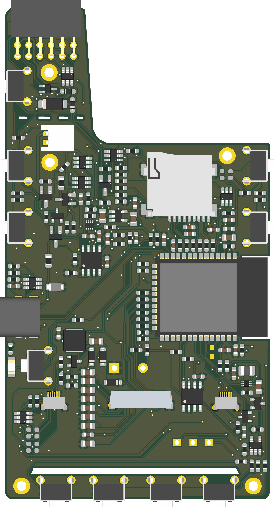
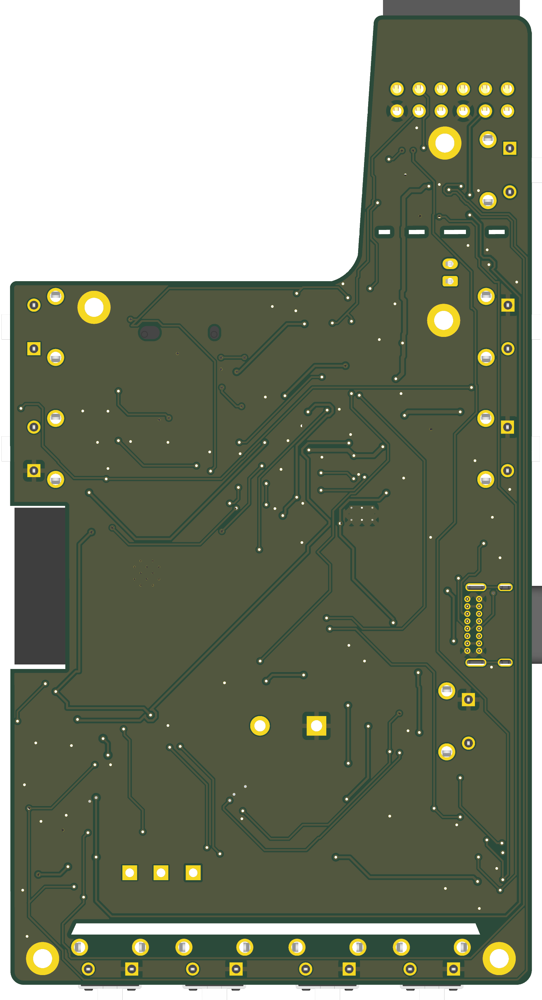

# Silkscreen

**An open-source, open-hardware e-reader base board.**
Designed for compatible SPI e-paper panels, custom enclosures and firmware.

Successor to [de-link](https://de-link.me). Designed in **KiCad 9.0.6**.

Silkscreen is a 2-layer ESP32-S3 base board for e-ink development, with a 24-pin display
interface, optional touch/frontlight, microSD and single-cell Li-ion/LiPo power.
Check the selected panel's pinout and drive requirements, battery specification and enclosure fit.

**Before assembly:** read **[DESIGN_REVIEW.md](DESIGN_REVIEW.md)**. This is the single source
for the current assembly decision, applied corrections and first-article tests. The USB-present
reverse-battery fault path ("Fix 4"), the Q4 replacement and the slotted microSD land are all
applied in the source; what remains before a repeatable product is the first-article bench
verification in DESIGN_REVIEW.md §13. The latest pre-order audit is in
[`docs/audit-2026-09-18/`](docs/audit-2026-09-18/PREORDER_CONFIRMATION_AUDIT.md).


| Back (all components) | Front (silkscreen art) |
|:---:|:---:|
|  |  |

Published plots: **[schematic PDF](docs/silkscreen_pcb_schematic.pdf)** (single A2 sheet) ·
**[PCB layout PDF](docs/silkscreen_pcb_layout.pdf)** (2 pages, all layers). Both are plotted from the current
source; the images above are renders of the same files, not the release record.

---

## At a glance

| | |
|---|---|
| **MCU** | ESP32-S3-WROOM-1 (**N16R8**, 16 MB flash / 8 MB octal PSRAM), native USB — no UART bridge |
| **Display** | 24-pin 0.5 mm ZIF for SPI e-paper; primary target 4.26" GDEQ426T82 family; panel-driven charge pump generates the ±15–22 V rails |
| **Frontlight** | TPS923610 constant-current boost, warm/cool selection through one GPIO + inverter; blending requires qualification |
| **Touch** | Optional I²C capacitive touch (for `-FT01C`-class panels) with a 0 Ω pin-swap mux |
| **Power** | USB-C in → TP4056 charger → DW01A + FS8205A cell protection → TPS2116 priority mux → TLV75533P 3V3 LDO |
| **Battery** | Specified single-cell 4.2 V-charge Li-ion/LiPo; verify cable polarity and observe the review's protection limitations |
| **Storage** | push-push microSD in 4-bit SDMMC, power-gated |
| **Input** | 8 buttons on two ADC resistor ladders + power (`SW10`) + reset (`SW11`); a BOOT button footprint (`SW6`) is left unpopulated because USB-Serial-JTAG makes it unnecessary |
| **RTC** | DS3231MZ (±5 ppm), VBAT-only mode; populated in the standard build, optional |
| **Board** | 2-layer, 60 × 111 mm, 1 oz Cu; 179 references = 162 fitted + 10 DNP + 7 bare-copper (holes `H1`–`H5`, test pads `TP1`/`TP2`) |

Connection/GPIO reference: **[docs/HARDWARE.md](docs/HARDWARE.md)**.
All engineering conclusions and release actions: **[DESIGN_REVIEW.md](DESIGN_REVIEW.md)**.

---

## Repository layout

```
silkscreen_pcb.kicad_pro / .kicad_sch / .kicad_pcb   KiCad 9 project
sym-lib-table / fp-lib-table                          project-local library tables (${KIPRJMOD}-relative, resolve after a plain clone)
KiCad/9.0/3rdparty/                                   vendored symbols/footprints/3D models actually used by the design
docs/HARDWARE.md                                      hardware documentation
docs/images/                                          schematic block crops, full sheet, board renders
docs/silkscreen_pcb_schematic.pdf / _layout.pdf  schematic and PCB plots
docs/audit-2026-09-16/, audit-2026-09-18/             review evidence and the pre-order audit
DESIGN_REVIEW.md                                      schematic + layout review
fabrication/                                          part_fields.csv + apply script, BOM.md / hand-build BOM, how-to
production/                                           JLC upload BOMs (v3/v4); Toolkit output (zip, CPL, BOM) is regenerated locally
simulations/                                          LTspice work
LICENSE / NOTICE                                      CERN-OHL-S v2
```

A plain `git clone` opens without missing libraries: every project library path is relative, all in-repo 3D
models resolve, and everything else comes from KiCad's standard libraries (KiCad 9.0.x).

## Building the board

The project and reviewed exports use **KiCad 9.0.6**. Keep a backup before saving with a
newer major version; newer file formats may not reopen in KiCad 9.

### Fabrication (bare board)

The active assembly workflow is **JLCPCB**. Generate a Gerber + drill set, or use the
Fabrication Toolkit workflow below:

```bash
kicad-cli pcb export gerbers -o fabrication/gerbers/ \
  --layers F.Cu,B.Cu,F.Mask,B.Mask,F.SilkS,B.SilkS,F.Paste,B.Paste,Edge.Cuts \
  --no-protel-ext --subtract-soldermask silkscreen_pcb.kicad_pcb
kicad-cli pcb export drill -o fabrication/gerbers/ --format excellon \
  --drill-origin absolute --excellon-units mm --excellon-separate-th silkscreen_pcb.kicad_pcb
```

Zip `fabrication/gerbers/` and upload. Board is 2-layer, 1.6 mm, 1 oz copper; outline on `Edge.Cuts`.

### Assembly

```bash
kicad-cli pcb export pos -o fabrication/assembly/cpl.csv --format csv --units mm --side both silkscreen_pcb.kicad_pcb
```

- **JLCPCB:** use the KiCad **Fabrication Toolkit** plugin for the final placement export;
  it applies JLC's part-rotation database and reads the `LCSC` field from the footprints (set by
  `fabrication/apply_part_fields.py`, see fabrication/README.md). Keep the upload BOM separate from the
  factory's matched/accepted BOM and save approved substitutions. The raw CLI centroid above is a
  cross-check, not a replacement for the reviewed Toolkit CPL.
- Regenerate the Toolkit set after **every** schematic/PCB save; a stale set silently misses new parts.

See **[Ordering from JLCPCB](#ordering-from-jlcpcb-step-by-step)** below for the upload flow and **[fabrication/README.md](fabrication/README.md)** for the release-file workflow.

## Ordering from JLCPCB, step by step

> **Building your own configuration?** Start at **[silkscreenreader.com](https://silkscreenreader.com)** and use its
> *Build one* configurator. It walks you through the panel variant (plain / touch / frontlight / both), the optional
> blocks and the buttons, and shows the running cost against a fully loaded board. It is the intended way to choose a
> configuration and, as the site's board-file export and ordering tutorials come online, to get files for it. (The site
> still describes those as arriving with the closed beta; until then use the manual method below.)

### 1. The files in `production/`

| File | Use it for | Notes |
|---|---|---|
| `Silkscreen_Reader_PCB_1.0.zip` | **Gerbers + drills**: the bare-board upload | Fabrication Toolkit output. Never edit; regenerate after any PCB save |
| `positions.csv` | **Pick-and-place (CPL)**: the assembly upload | 162 rows, all on the bottom side, rotations already corrected by the Toolkit |
| `bom.csv` | **Factory BOM**: the assembly upload | Toolkit output, built from each footprint's `LCSC` field; equals `fabrication/part_fields.csv` |
| `bom_JLC_upload_v4_optimized.csv` | The same BOM in JLC's upload format, **cost-optimised** (26 Extended part types) | Default alternative to `bom.csv`; regenerate from `part_fields.csv` if you change parts |
| `bom_JLC_upload_v3.csv` | The same, **brand-conservative** variant (28 Extended types) | Slightly dearer, more name-brand parts |
| `designators.csv`, `netlist.ipc` | Toolkit by-products (per-designator count; IPC-356 netlist) | Not uploaded to JLC; keep them with the release |
| `bom_JLC_upload-JLCPCB Assembly Order.xls`, `bom-JLCPCB*`, `bom_JLC_upload-JLCPCB` | **Historical**: the September 2026 orders (25 and 30 boards), made before the reverse-battery gate and the L1/R14/C9/R27 changes | Reference only, kept locally (not in git). Do not upload |
| `backups/` | The Toolkit's timestamped copy of every run | Local only, not tracked |

Use `bom.csv` and `positions.csv` **together**: they come from the same run. The two `bom_JLC_upload_v*` files are
alternatives to `bom.csv` (same parts, JLC column names). Pick one BOM, not all three.

### 2. Order the bare board

1. Sign in at [jlcpcb.com](https://jlcpcb.com), choose **Order now**, then **Add Gerber file** and upload `Silkscreen_Reader_PCB_1.0.zip`.
2. Confirm what the viewer detects: **2 layers, about 60 x 111 mm**. Set thickness **1.6 mm** and copper **1 oz**. Surface
   finish and mask colour are your choice; nothing in the design requires a particular one. Minimum quantity is **5**.
3. In the Gerber viewer check the outline, the microSD and USB-C edge areas and the four narrow perforation slots. Those
   0.5 mm `Edge.Cuts` polygons are below JLC's 1.0 mm routed-slot minimum; earlier orders were accepted with them, but
   read any DFM message about them.

### 3. Add assembly (PCBA)

1. Switch on **PCB Assembly** and choose **Standard**.
2. Set **Assembly side: Bottom**. Every component in `positions.csv` is on the back copper layer.
3. Leave **Tooling holes** on *Added by JLCPCB* and set **Confirm Parts Placement** to *Yes* for the first run, so you
   approve the preview in step 5.
4. Click **Next**, **Add BOM file** (`bom.csv` or a `bom_JLC_upload_v*` file), then **Add CPL file** (`positions.csv`), and
   **Process BOM & CPL**.

### 4. Review the BOM match

- Every line needs a match on its `LCSC` code (**Part No.**). A line exported as an MPN, or flagged *out of stock* / *not
  found*, is the one to fix; look the part up in [`fabrication/BOM.md`](fabrication/BOM.md), which lists approved alternates.
- The fitted parts should be selected. The DNP references (`TP3-TP5`, `R43 R45 R58 R66 R72 R74`, `SW6`) are absent from
  both files, so they are never offered. If you deliberately leave a block off (next section), remove its parts from the BOM
  **and** the CPL, or untick them in this list.
- The raw `bom.csv` also lists the bare UART pads **`TP1, TP2`** with no part number (they are copper-only and intentionally not assembled). Leave that line unselected, or use `bom_JLC_upload_v4_optimized.csv`, which does not include it. They are not in `positions.csv`.
- Watch stock on **TPS923610DRLR** (about 189 pcs at last check).

### 5. Placement preview (do not skip on the first order)

The preview draws each part on the board, and JLC's DFM has corrected several before. Check **polarity and rotation** of
`U2`, `U5`, `D8`, `D2` (LED pad 1 is the anode) and `J4`, and the origin offsets on `U4` and `J7`. Use the preview's rotate
and move tools to fix anything wrong, and record the correction with the release files. A matched part code does not
verify orientation.

### 6. Through-hole and hand-fitted parts

Standard assembly places SMT parts only. Plan to hand-solder **J1** (USB-C shell tabs), **J5** (2-pin JST battery), **J6**
(expansion header, if fitted) and the through-hole switches. Confirm J7's locating pegs against the approved placement.

### 7. Approve, order, and record

Read the price summary (bare board, setup, Extended-part fees, parts, assembly). Save the approval e-mail, the accepted
BOM and CPL and any substitutions with the release files. **Regenerate the whole Toolkit set after every schematic or PCB
save**: a stale `positions.csv` silently misses new parts.

## Which parts are optional? (configurations)

The files in `production/` describe the **full standard build**: every block fitted except the DNP options. The
[silkscreenreader.com](https://silkscreenreader.com) configurator treats the board as a **core** that is always fitted plus
add-on groups you can leave off. The table maps those groups to reference designators. To build a reduced configuration by
hand, delete the listed references from the BOM **and** the CPL and leave the pads empty. The easiest, least error-prone
route is the configurator on the site.

| Group | References | Fit it when | Works without it? |
|---|---|---|---|
| **Core** (always) | Everything not listed below: ESP32-S3 `U4`, USB-C `J1`/`U6` and protection, charger `U11`, cell protection `U5`/`Q1`/`Q3`/`Q8`, power mux `U2`, LDO `U3`, battery monitor, microSD `J7`/`Q7`/`U1`/`U9`, the 24-pin display connector `J2` with its charge pump and boost (`L1`, `Q4`, `D4`-`D6`, `R14`, ...), power switch `SW10`, reset `SW11`, LED `D2`, and the shared parts `R47`/`R48` (I²C pull-ups) and `C12` (LDO-input capacitor) | Always | This is the minimum working board: about **$29.55** of parts at quantity 1 in the site's model |
| **Touch** | `J4`, `U7`, jumpers `R42 R44 R46 R52` | The panel has a touch layer (`-T01C`, `-FT01C`) | Yes: omit the whole block on a non-touch panel |
| **Frontlight** | `J3`, `U10`, `U12`, `L2`, `Q5`, `Q6`, `C9`, `C24`, `R37 R39 R41 R49 R50 R75` (`TP3`-`TP5` stay DNP) | The panel has a frontlight (`-FL01C`, `-FT01C`), or you want to drive an external light | Yes: omit for a plain or touch-only panel |
| **Expansion header** | `J6`, `U8` | You want spare GPIO, I²C and the external-light output | Yes |
| **Real-time clock** | `U13`, `C30` | You want accurate time | Yes: the reader runs without it, and it can be added later by hand |
| **Side page-turn keys** | `SW1` (right-down), `SW4` (right-up), `SW7` (left-up), `SW5` (left-down) | Your case has side keys | Yes: fit any subset |
| **Bottom-row keys** | `SW2 SW3 SW8 SW9` | Your case has bottom keys | Yes: fit any subset; with touch you can drop most keys |

Notes:

- **The panel choice drives touch and frontlight.** The four 4.26" GoodDisplay variants are `GDEQ0426T82` (plain), `-T01C`
  (touch), `-FL01C` (frontlight) and `-FT01C` (touch + frontlight). Fit the touch parts only for a touch variant and the
  frontlight parts only for a light variant.
- **Fit only one of the two touch pin-order options.** The default build fits `R42 R44 R46 R52`. The alternate wiring
  (`R43 R45 R58 R66`, DNP here) is for panels with the swapped pin order. Confirm the panel's pinout first.
- Leaving a ladder switch off needs nothing else changed; the ladder resistors stay in the BOM.
- `SW6` (boot button) and `TP3`-`TP5` are DNP in every standard build.
- Prices in the site's model exclude the panel, battery and case. JLC per-board totals are in [`fabrication/BOM.md`](fabrication/BOM.md).

## Bill of materials

**[fabrication/BOM.md](fabrication/BOM.md)** is the current, netlist-derived sourcing reference: the
optimized JLC build, the brand-conservative variant and the hand-build (DigiKey) list, with prices and
swap rationale. The factory BOM itself is the Toolkit's `bom.csv`; both come from
[`fabrication/part_fields.csv`](fabrication/part_fields.csv), which maps every reference to its prime
MPN and its LCSC code. Accepted factory changes must still be frozen in the release records.

## Documentation

- **[DESIGN_REVIEW.md](DESIGN_REVIEW.md)** — authoritative 18-block review, assembly decision,
  critical layout measurements, component recommendations and acceptance plan.
- **[docs/HARDWARE.md](docs/HARDWARE.md)** — GPIO/connector maps, population and operating reference.

---

## License

Hardware licensed under the **CERN Open Hardware Licence Version 2 – Strongly Reciprocal
(CERN-OHL-S-2.0)** — see [LICENSE](LICENSE).

> Copyright © 2026 idc LLC.
> This source describes Open Hardware and is licensed under the CERN-OHL-S v2.
> You may redistribute and modify this source and make products using it under the terms of the
> CERN-OHL-S v2 (https://ohwr.org/cern_ohl_s_v2.txt). This source is distributed WITHOUT ANY
> EXPRESS OR IMPLIED WARRANTY, INCLUDING OF MERCHANTABILITY, SATISFACTORY QUALITY AND FITNESS FOR
> A PARTICULAR PURPOSE. Please see the CERN-OHL-S v2 for applicable conditions.

`SPDX-License-Identifier: CERN-OHL-S-2.0`

Third-party component library files (from SnapEDA / Ultra Librarian / SamacSys) retain their own
terms and are not covered by the project license — see
[fabrication/THIRD_PARTY.md](fabrication/THIRD_PARTY.md).

Predecessor project: [de-link.me](https://de-link.me).
