# Silkscreen — Hardware Design Documentation

**An open-source, open-hardware e-reader base board.**
Display agnostic · case agnostic · firmware agnostic · battery agnostic.

Successor to [de-link](https://de-link.me).

---

> ### ⚠️ About this document
>
> **This documentation was written *after* the board was designed. It was not used to design it.**
>
> Silkscreen was designed by its author working from datasheets, reference designs and
> hands-on iteration. This document is a **post-hoc explanation and review aid**, produced
> by tracing the finished schematic net-by-net and checking each block against the
> manufacturers' datasheets. Its purpose is to (a) make the board understandable to
> newcomers, and (b) support review and incremental tweaking — whether you are building it,
> modifying it, or writing firmware for it.
>
> Nothing here should be read as "the design rationale that produced the board." Where this
> document explains *why* something is the way it is, that is a reconstruction — informed by
> the designer's own schematic annotations and by what the circuit demonstrably does, but a
> reconstruction nonetheless.
>
> **Open issues, component qualification, proposed changes and the assembly decision live in a
> separate document: [`DESIGN_REVIEW.md`](../DESIGN_REVIEW.md).** This file describes the board
> *as it is* and flags — inline, where it matters for understanding or firmware — the places
> where the review found something that needs attention (reverse-battery path, the `Q4`
> switching device, the microSD socket fit, frontlight current margin). It does not repeat the
> review's analysis; it points to it.
>
> Connection facts were re-checked against the KiCad netlist on **2026-09-21**; designed in
> **KiCad 9.0.6**. The ordered module is **ESP32-S3-WROOM-1-N16R8**.
> 184 references, 134 nets, single A2 sheet.
>
> **Rev 1.0.** The revision label — on both title blocks and in the name of the release zip — changes only when a new board is fabricated; until then every change is folded into Rev 1.0. The design content is current to **2026-09-21**; the title-block date (2026-09-12) is simply when Rev 1.0 was opened.
>
> **Current full plots (2026-09-21):** [`silkscreen_pcb_schematic.pdf`](silkscreen_pcb_schematic.pdf)
> (schematic, one A2 sheet) and [`silkscreen_pcb_layout.pdf`](silkscreen_pcb_layout.pdf) (PCB layout: front view, then the back as you see it) are
> plotted from the current source. The per-block images in `images/` were regenerated from the schematic plot
> on the same date; if a block ever looks out of date, re-crop it from the PDF rather than trusting the picture.

---

## Table of contents

1. [What Silkscreen is](#1-what-silkscreen-is)
2. [System overview](#2-system-overview)
3. [Power chain](#3-power-chain)
   - 3.1 [USB-C input & protection](#31-usb-c-input--protection)
   - 3.2 [Battery charger](#32-battery-charger)
   - 3.3 [Cell protection & reverse polarity](#33-cell-protection--reverse-polarity)
   - 3.4 [Power-path mux](#34-power-path-mux)
   - 3.5 [3.3 V regulation](#35-33-v-regulation)
   - 3.6 [Battery monitoring](#36-battery-monitoring)
   - 3.7 [USB / charge status](#37-usb--charge-status)
4. [The processor](#4-the-processor)
5. [Storage — 4-bit SDMMC](#5-storage--4-bit-sdmmc)
6. [Display interface](#6-display-interface)
   - 6.1 [24-pin e-paper connector](#61-24-pin-e-paper-connector)
   - 6.2 [Charge pump](#62-charge-pump)
7. [Frontlight driver](#7-frontlight-driver)
8. [Touch interface](#8-touch-interface)
9. [Human input](#9-human-input)
   - 9.1 [Button ladders](#91-button-ladders)
     - 9.1.1 [Front-mounted bottom buttons (optional)](#911-front-mounted-bottom-buttons-optional-hand-fitted)
   - 9.2 [Power button](#92-power-button)
   - 9.3 [Boot & reset](#93-boot--reset)
10. [Real-time clock](#10-real-time-clock)
11. [Expansion header](#11-expansion-header)
12. [Test points & mounting](#12-test-points--mounting)
13. [Complete GPIO map](#13-complete-gpio-map)
    - 13.1 [Firmware contract — things the board needs firmware to do](#131-firmware-contract--things-the-board-needs-firmware-to-do)
14. [Design themes](#14-design-themes)
15. [What changed from de-link](#15-what-changed-from-de-link)
16. [Design notes & conventions](#16-design-notes--conventions)

---

## 1. What Silkscreen is

Silkscreen is a **base board for e-ink development**. The goal is that one PCB should support
essentially any 24-pin SPI e-paper panel, any battery, any enclosure, any button layout and
any firmware — so that the interesting work (the display, the case, the software) is not
gated on redesigning power and interface electronics every time.

**Primary target:** 4.26" `GDEQ0426T82` family
- `GDEQ0426T82` — plain
- `GDEQ0426T82-T01C` — with capacitive touch
- `GDEQ0426T82-FL01C` — with bonded frontlight
- `GDEQ0426T82-FT01C` — with bonded frontlight **and** capacitive touch

`GDEQ0426T82` is the base part number; the suffix selects the option set — `-T01C` touch,
`-FL01C` front light, `-FT01C` both. Order by the full suffixed number, because the suffix is
what decides which optional blocks you fit.

**Also supports:** most 24-pin SPI e-paper panels, larger or smaller, given a suitable enclosure.
A 24-pin connector alone does not establish compatibility — check the panel's pinout, drive
requirements and voltage rails.

### The four "agnostic" goals, and how the hardware delivers them

| Goal | Mechanism |
|---|---|
| **Display agnostic** | Standard 24-pin 0.5 mm ZIF (`J2`) carrying SPI + the full HV rail set. The panel's own controller drives the charge pump, so the board adapts to the panel rather than the reverse. |
| **Case agnostic** | Six `MountingHole_Pad`s; the buttons are grouped onto resistor ladders that cost only one pin per group, so a build can fit one edge, the other, both or neither — including the optional front-mounted bottom buttons of §9.1.1 — without changing the pin budget. |
| **Firmware agnostic** | Nothing on the board requires a specific software stack. Every peripheral is a standard interface (SDMMC, SPI, I²C, ADC, native USB) with no board-specific handshake. |
| **Battery agnostic** | On-board DW01A + FS8205A protection for a single 4.2 V-charge Li-ion/LiPo cell; a pack with its own protection also works — the two cascade. **Reverse-insertion tolerance is *not* established when USB is present** — verify cable polarity and see [DESIGN_REVIEW.md](../DESIGN_REVIEW.md) §4 before relying on it. |

### Optional-by-design

Several blocks are populated only if the chosen panel needs them:

- **Frontlight** (`U10` boost and its support parts; `J3` only for a panel with a bonded light) — for a `-FL01C` / `-FT01C` panel, or to drive an external light through `J6`
- **Touch** (`J4` + `U7`) — only for `-T01C` / `-FT01C` panels
- **RTC** (`U13`, or `U14` as the alternate footprint) — always useful, but not required to boot (`U13` is populated in the standard build; omit it if you don't need it)
- **Expansion header** (`J6` + `U8`/`CR2`/`CR3`/`F2`) — omit the connector and its own protection parts together

The full part list for each group is in the README, [Choosing a configuration](../README.md#choosing-a-configuration).

---

## 2. System overview


The whole design is a single A2 sheet. It divides into four domains:

| Stage | Path |
|---|---|
| Input | USB-C → PPTC fuse → `USB_VBUS` |
| Charging | `USB_VBUS` → TP4056 → `P+` (protected cell) |
| Source select | TPS2116 picks `USB_VBUS` or `P+` → `LDO_IN` |
| Regulation | `LDO_IN` → TLV75533P → `3V3` (everything digital) |
| Frontlight | `LDO_IN` → TPS923610 boost → up to 24.5 V (bypasses the LDO) |
| Panel HV | `3V3` → charge pump driven by the panel → ±15–22 V |

The processor sits on `3V3` and reaches the outside world through native USB (no UART bridge),
4-bit SDMMC to the microSD, SPI to the e-paper ZIF, I²C to the RTC and touch panel, and five
ADC channels for the buttons, battery, USB status and frontlight monitor.


**Voltage domains:**

| Domain | Range | Feeds |
|---|---|---|
| `USB_VBUS` | ~4.4–5.5 V | charger, mux input 1 |
| `P+` / `LDO_IN` | 3.0–5 V | mux output → LDO, frontlight boost |
| `3V3` | 3.3 V | everything digital |
| *(local)* `LED_SW` | up to 24.5 V | frontlight LEDs only |
| *(local)* panel HV | ±15–22 V | e-paper gate/source rails only |

---

## 3. Power chain

### 3.1 USB-C input & protection

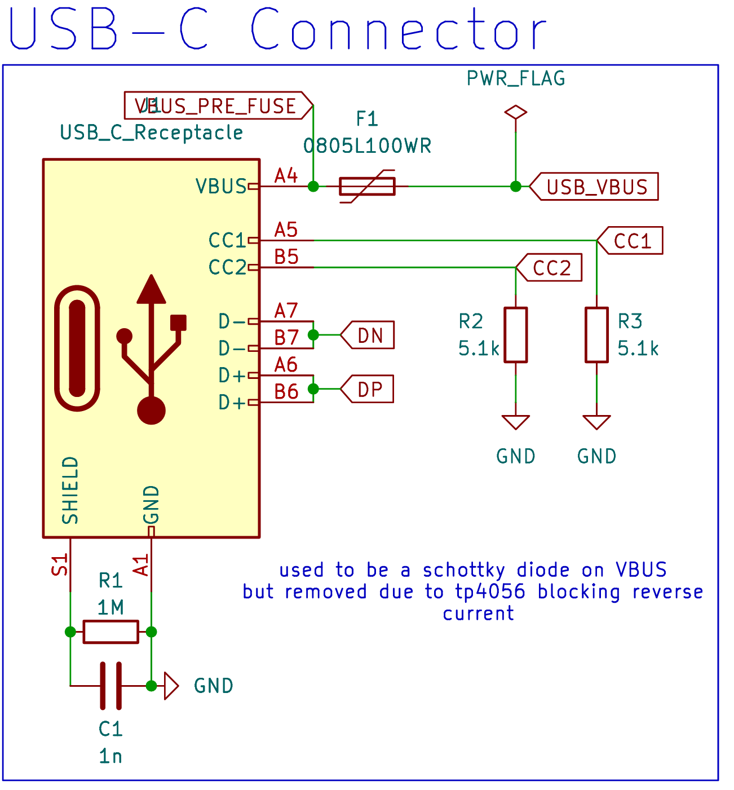

`J1` is a USB 2.0 Type-C receptacle (through-hole). The ordered GCT `USB4085-GF-A` has **16
contacts**, not 14 — a USB 2.0 C receptacle keeps both SBU positions even though nothing on this
board uses them. Both VBUS pins and both GND pins are
paralleled, and D+/D− from both sides are tied together — standard for a USB 2.0 sink in a
reversible connector.

**`R2` / `R3` = 5.1 kΩ from CC1 / CC2 to ground.** This is what makes the board a
USB-C *sink*. A source detects those pull-downs and enables VBUS. Two separate 5.1 k
resistors (not one shared) is correct — it lets the source determine cable orientation.

> **This board has no USB-PD controller**, so it never sends or receives a PD contract request
> over CC — only the fixed `Rd` pull-downs above. A spec-compliant source therefore has no
> mechanism to raise VBUS above the 5 V default: PD voltage changes are negotiated, not imposed,
> and a source that never receives a request has nothing to act on. A genuinely sustained fault
> above 5 V requires a **non-compliant or malfunctioning source**, not anything a normal PD
> charger or cable does by design — this has reportedly held up across prior boards with a
> similar CC arrangement. `F1`/`CR1` below are still under-margined *if* that narrower fault
> category occurs (see [DESIGN_REVIEW.md](../DESIGN_REVIEW.md) §3), which is judged an
> acceptable residual risk for this board rather than something worth a design change.

**Input protection chain:** `VBUS_PRE → F1 → USB_VBUS`

- **`F1` `0805L100WR`** — resettable PPTC, **1.0 A hold / ~1.95 A trip at 25 °C**. The hold
  current is temperature-dependent: the Littelfuse derating table gives roughly **0.65 A at
  60 °C**, so a warm enclosure matters even when room-temperature current is below 1 A. A PTC
  does not negotiate USB current. See [DESIGN_REVIEW.md](../DESIGN_REVIEW.md) §3.

> **`D1` (the former series Schottky) has been removed.** The design review found it redundant:
> the TPS2116 specifies ~1 nA reverse leakage out of an unselected input **at 25 °C** (the same
> `I_REV` spec is 0.05 µA at 85 °C and 0.15 µA at 105 °C — still small enough that the
> conclusion holds), and the TP4056
> datasheet states outright that *"No blocking diode is required due to the internal PMOSFET
> architecture."* Both paths off `USB_VBUS` already block. `D1` also dropped 0.3–0.6 V and, at
> the ~1 A `F1` passes, would have exceeded its own SOD-123 rating. With it gone, `F1` feeds
> `USB_VBUS` directly and `R38` was raised to 300 k (§3.4), recovering that headroom.

**Shield handling:** `R1` (1 MΩ) ∥ `C1` (1 nF) from shell to GND. The classic arrangement —
DC-isolates chassis from signal ground (breaking ground loops) while giving high-frequency
noise a low-impedance path.

**Power LED:** `D2` + `R59` (2 kΩ) across `USB_VBUS`. At 5 V this is **~1.3–1.6 mA** —
deliberately dim. **`D2` indicates USB power present, *not* charging state**; it lights whenever
USB is attached, so it never costs battery runtime. It is a conventional outward-emitting red
1206 (the ordered part and its accepted factory substitution are tracked in
[DESIGN_REVIEW.md](../DESIGN_REVIEW.md) §3 / the BOM).

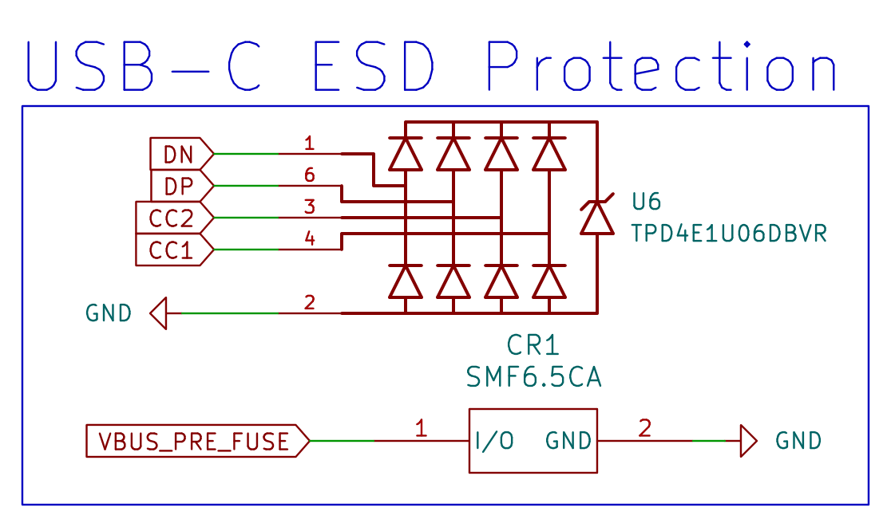

**`U6` `TPD4E1U06`-class array** clamps D+, D−, CC1 and CC2 — a 4-channel, ultra-low-capacitance
(~0.7 pF) TVS array. Low capacitance matters here: anything heavier would distort USB
full-speed edges. **`CR1`** clamps the VBUS rail itself. **`CR1` is `SMF6.5CA`** (6.5 V standoff,
`V_BR` 7.22–7.98 V, bidirectional — changed 2026-09-17 from an earlier SD05C-class/5.0 V part,
see [DESIGN_REVIEW.md](../DESIGN_REVIEW.md) §12), a full volt clear of the 5.5 V a USB-C source
may legally sit at.

> **`CR1`'s breakdown voltage can't clamp a fast hot-plug ringing transient** the way it clamps
> a genuine over-voltage fault — a stiff 5 V source hitting cable inductance and `USB_VBUS`'s
> ~11 µF of bare ceramic can ring for tens of microseconds before `CR1` even reaches 7.22 V,
> and a worst-case linear model puts that peak as high as ~6–7.4 V, above `TPS2116`'s 6 V
> absolute maximum. This is a narrower, faster phenomenon than the sustained-fault question
> above — the TP4056 datasheet names it directly (the TP4056 is not a TI part), recommending
> 1–1.5 Ω of series damping
> ahead of the bulk capacitor for exactly this reason — but it needs a fairly stiff/fast source
> and a low-inductance cable at the same time, most real chargers have some soft-start, and
> field experience on prior boards with a similar front end hasn't shown a problem. Treated as
> a first-article scope check (probe `USB_VBUS` at hot-plug with a short, thick A-to-C cable),
> not something worth spending design time on pre-emptively.

---

### 3.2 Battery charger

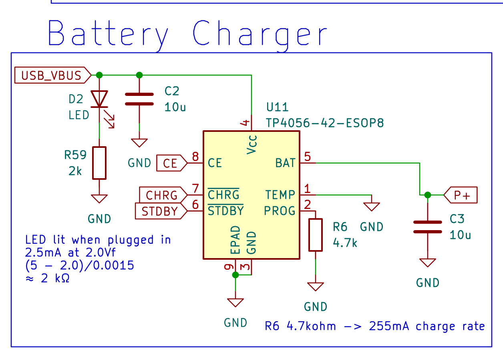

**`U11` `TP4056`-class (ESOP-8)** — a standalone linear Li-ion charger, 4.2 V float.

| Pin | Connection | Meaning |
|---|---|---|
| `VCC` (4) | `USB_VBUS` | charge only from USB |
| `BAT` (5) | `P+` | charges the protected cell |
| `PROG` (2) | `R6` = 4.7 kΩ | **I ≈ 0.25 A** (see below) |
| `TEMP` (1) | GND | NTC thermistor disabled (datasheet-sanctioned) |
| `CE` (8) | **Fix 4 detector output** (`Q2` drain, `R82` to GND) — see §3.3 below | high only when a correctly-oriented cell is present |
| `EPAD` (9) | GND | thermal path |

**Charge current ≈ 0.25 A.** `R6` = 4.7 kΩ sets the constant-current phase from
`I ≈ (1100–1200)/R_PROG`, i.e. **about 0.23–0.25 A** (the TP4056 datasheet formula, `I = 1100/R_PROG`,
gives **234 mA**) depending on which datasheet constant you trust. This is **lot-dependent — measure
it** rather than treating any single figure as established.
Dissipation stays modest — `(5 V − 3.0 V) × 0.25 A ≈ 500 mW` worst case in an ESOP-8 with thermal
vias. `R6` is the knob: a small 300–500 mAh cell wants it higher (`R6` = 12 kΩ ≈ 100 mA) to stay
near 0.25C. **`TEMP` grounded disables cell-temperature monitoring**, so choose the cell and its
charge-temperature range accordingly.

**`CE` is driven by the Fix 4 cell-polarity detector** (`Q2` drain, with `R82` to GND — see §3.3), not tied
to `VCC`. Charging is therefore automatic whenever USB is present **and a correctly oriented cell is
detected**; there is still no GPIO on `CE`, so firmware cannot inhibit charging.

The `CHRG` and `STDBY` open-drain status outputs feed the status ladder ([§3.7](#37-usb--charge-status)).

---

### 3.3 Cell protection & reverse polarity

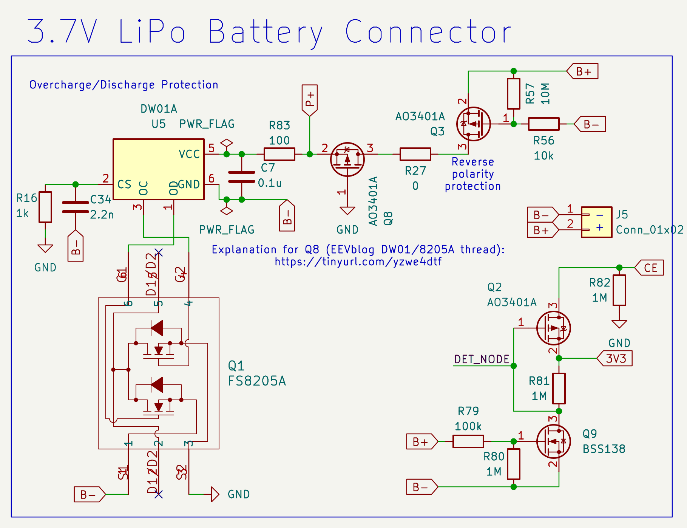

**`U5` DW01A + `Q1` FS8205A** — the standard 1-cell protection pair.

The DW01A monitors cell voltage and current and drives two N-channel MOSFETs inside the
FS8205A (a common-drain dual):

| Condition | Threshold (typical) | Action |
|---|---|---|
| Over-charge | 4.30 V | `OC` opens the charge FET |
| Over-discharge | 2.40 V | `OD` opens the discharge FET |
| Over-current | `V_OIP` 120 / **150** / 180 mV across R_DS(on) | `OD` opens the **discharge FET only** — the charge FET stays on, so the pack can still be charged out of the fault |
| Short circuit | `V_SIP` 1.00–1.35 V across R_DS(on), much shorter delay | `OD` opens the discharge FET |

The FETs are back-to-back so that blocking one direction still permits the other through the
opposite body diode — an over-discharged cell can still be charged, and an over-charged cell
can still be discharged.

**Three details that are easy to get wrong, and are right here (all verified in the netlist):**

1. **`R16` (1 kΩ) from `CS` to the pack-negative side.** The DW01A senses current as the
   voltage across *both* FETs' R_DS(on); its `GND` sits at `B−`. The 1 k also provides
   latch-up protection when a charger meets an over-discharged pack.
2. **`R83` (100 Ω) + `C7` (0.1 µF) — the datasheet's VCC filter.** `R83` sits in the *side
   branch* that feeds only `U5` pin 5 from `P+`; it is not in the load path, so it costs nothing
   (the DW01A draws about 3 µA, which is 0.3 mV across 100 Ω). `C7` goes from pin 5 to `B−` — not
   to system ground, because the DW01A's ground reference *is* `B−`. Together they are a 16 kHz
   low-pass (τ = 10 µs) that keeps load steps and charger ripple out of the voltage comparators,
   and `R83` limits the current into pin 5 when a pack is hot-plugged or a charger is connected
   backwards. Added 2026-09-21 — earlier revisions had `C7` straight across `P+`/`B−` with no
   resistor.
3. **`C34` (2.2 nF) from `CS` to `B−`.** With `R16` it is a 2.2 µs filter on the current-sense
   pin, so the inrush spike when a cell is first connected (the board's bulk capacitors charging
   through the FETs) is not read as a short circuit and latched. It delays a real short-circuit
   trip by a couple of microseconds, which is small next to the FET turn-off itself. `CS` is
   never pulled to GND by this part: `C34` returns to `B−`, the same node `U5` measures from.

**Reverse-polarity intent: `Q3` + `Q8` (AO3401A P-channel).** As built (per netlist): `Q3`
source = `B+`, drain toward `R27`/`Q8`, gate pulled toward `B−` through `R56` (10 kΩ) with
`R57` (10 MΩ — raised from 1 MΩ on 2026-09-21 to cut standing drain) to `B+`; **`Q8` source = `P+`, drain toward `R27`/`Q3`, gate permanently at board
GND.** The design intent is that a correctly polarized cell enhances the series PMOS path and a
reversed cell does not. The `Q8` arrangement comes from the EEVblog forum thread
["Pain and suffering getting the DW01 and 8205A protection circuit work right"](https://www.eevblog.com/forum/projects/pain-and-suffering-getting-the-dw01-and-8205a-protection-circuit-work-right/)
— that is where the short link printed beside `Q8` on the schematic goes.

> ### ⚠️ Reverse insertion is **not** safe with USB present
>
> The design review identified a fault path that the "reverse-polarity protection" label does
> not cover. **With USB powering the charger, `Q8` can turn on even with a reversed cell**;
> `Q3`'s body diode then leaves a path toward `B+`, and `U5` (VCC = `P+`, GND = `B−`) can be
> driven with a strongly **reversed supply**. "`Q3` is off" does not establish isolation from
> the charger, because a P-channel body diode conducts drain-to-source. Selecting USB in the
> mux does *not* disconnect the charger branch, so normal USB operation does not make this
> harmless.
>
> **Practical guidance:** for a controlled prototype, **verify battery-cable polarity before
> connecting, and disconnect USB during any battery work.** Do not describe the board as
> providing bare-cell / USB-present reverse-insertion protection. **Applied 2026-09-17 ("Fix
> 4"):** the TP4056 `CE` pin is driven high only by a cell-polarity detector referenced to raw
> `B−` (`Q9` BSS138 + `Q2` AO3401A + `R79`–`R82`, ≈10 µA idle — see below), so the charger — the
> only thing that energizes the fault path — never runs into a reversed cell. This is wired into
> the current schematic/PCB, not a future plan. Analysis, simulation and the wiring table are in
> [DESIGN_REVIEW.md](../DESIGN_REVIEW.md) §4. **Do not test this by reversing a real LiPo** — use
> a current-limited emulator.
>
> **One known limitation, accepted as-is:** Fix 4 can only enable the charger while a correctly
> oriented cell shows above roughly 1–1.8 V at `J5`. A pack whose own protection IC has already
> latched into over-discharge lockout (0 V at its terminals) or a bare cell drained past that
> point cannot be revived by the on-board charger — it needs an external charger first. This is
> judged an acceptable edge case for this board rather than something worth a hardware or
> firmware mitigation; if firmware ever needs a rescue path, the node to drive is `Q2`'s gate
> (`/DET_NODE`).

`J5` is a 2-pin battery connector: **pin 1 = `B−`, pin 2 = `B+`.** A matching connector housing
does not guarantee cable polarity — check it electrically. Two resistor networks sit **outside**
the protection FETs, where the DW01A can never disconnect them, so they keep draining the cell
after an over-discharge cutoff: the `R56`+`R57` gate divider (~0.4 µA now that `R57` is 10 MΩ; it
was ~4 µA at 1 MΩ) and the Fix 4 detector's `R79` (100 k) + `R80` (1 M) across the raw cell
(~3.8 µA). That is **≈4 µA of resistors**, or ≈7 µA once the DW01A's own supply current is
included. It is a safe number (years from 2.4 V to flat on a normal pack).

---

### 3.4 Power-path mux

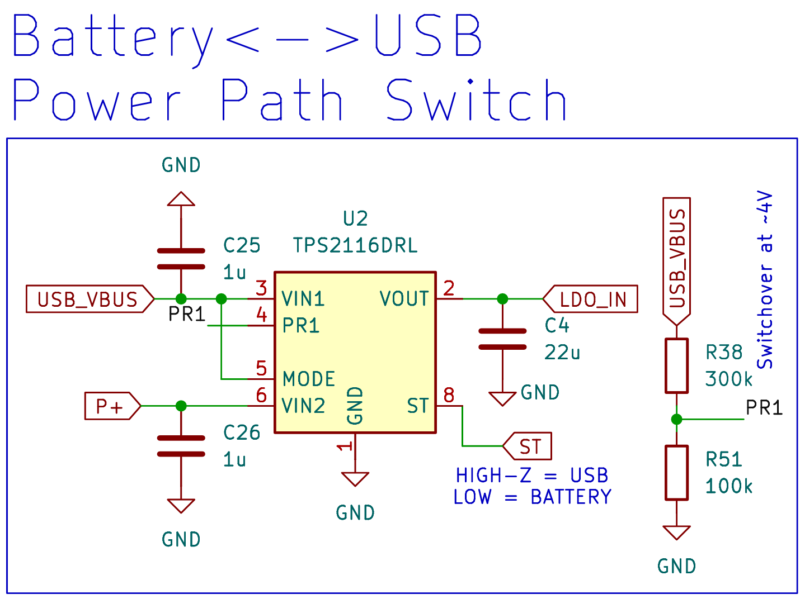

**`U2` `TPS2116DRL`** — a 2:1 priority power multiplexer choosing between USB and battery.

| Pin | Connection |
|---|---|
| `VIN1` (3) | `USB_VBUS` |
| `VIN2` (6) | `P+` (protected cell) |
| `VOUT` (2, 7) | `LDO_IN` |
| `MODE` (5) | `USB_VBUS` → **priority mode** |
| `PR1` (4) | `R38`/`R51` divider from `USB_VBUS` |
| `ST` (8) | status → ladder |

**Priority mode with a threshold divider.** `R38` = 300 k, `R51` = 100 k, `V_REF` = 1.00 V:

```
V_switchover = 1.00 V × (300k + 100k) / 100k = 4.00 V   (≈3.63–4.39 V worst case)
```

Above ~4.0 V on USB, the board runs from USB and the battery is untouched; below it, the mux
hands over to the cell. **Break-before-make** switching (~8 µs) prevents the two sources
shorting; `C4` (22 µF) on the output holds the rail up across the gap. The device also blocks
reverse current at ~42 mV, so a charged battery cannot back-feed a collapsed USB rail.

Lowering `R38` is *not* a free improvement — the threshold spread is already wider than a narrow
LDO-headroom guard band. `ST` is a selection/status output, **not a USB-present comparator**: it
can also read low when a channel is disabled or in thermal shutdown (see §3.7).

**Why a mux rather than diode-OR?** A diode-OR wastes a forward drop continuously and cannot
express priority. The TPS2116's ~40 mΩ FET path costs almost nothing, and priority means the
battery genuinely rests while USB is present.

---

### 3.5 3.3 V regulation

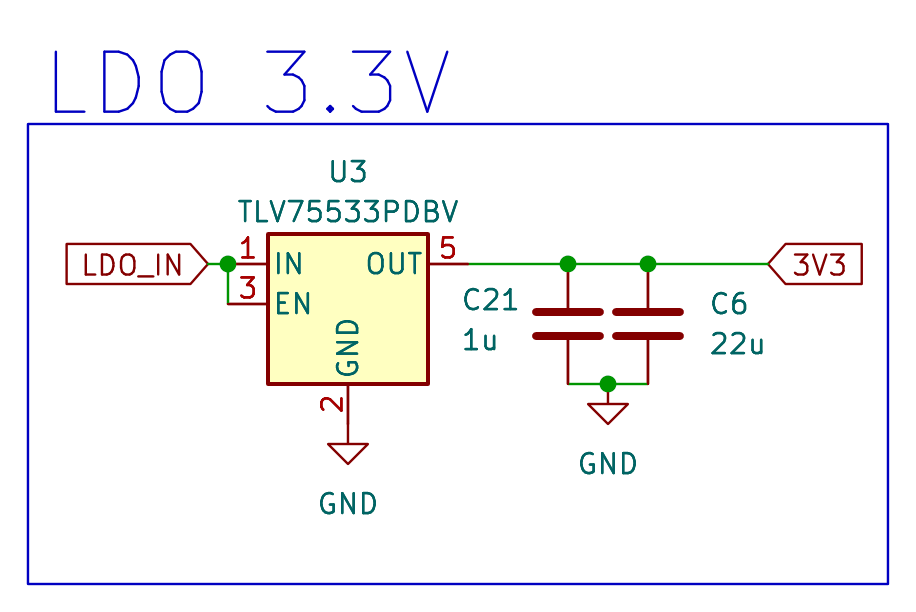

**`U3` `TLV75533PDBVR`** — 500 mA LDO, fixed 3.3 V, ~25 µA quiescent. *(Replaces the original
AP2112K-3.3 for battery-life reasons. The TLV75533P's pins 1/5 (OUT/IN) are swapped vs the
AP2112K, so the footprint pin-map and `VIN`/`VOUT` routing were adjusted to suit.)*

`EN` is tied to `VIN`, so the rail is **always live** whenever any source is present. There is
no hardware off switch — "off" means ESP32 deep sleep. This is a deliberate simplification
consistent with an e-paper device: the display holds its image with zero power, so "off" and
"asleep" look identical to the user.

Decoupling is generous: `C4` 22 µF in, and on the output `C6` 22 µF, `C32` 22 µF, `C10`
4.7 µF, plus 1 µF and 0.1 µF locals. (`C37`, formerly on this rail, is now 1 µF on the switched
`SD_VDD` rail — see [§5](#5-storage--4-bit-sdmmc).)

**The frontlight boost does *not* run from 3V3** — it is fed from `LDO_IN`, upstream of the LDO.
Boosting to ~20 V from a rail an LDO has already dropped would be a pointless double conversion,
and it would put ~130 mA through a small SOT-23-5. The designer's schematic note says exactly
this: *"Powered via LDO_IN source instead of 3V3 to reduce stress on LDO output power."*

> **U3 shares a 500 mA budget** between the ESP32, SD card, panel logic and touch. That is the
> module's own recommended-supply figure for the MCU alone, so there is no established worst-case
> margin, and the LDO's dropout/thermal behaviour **on USB** at high sustained load is the
> qualification item. **The thermal worst case is USB, not battery**: on USB the LDO drops
> ≈1.55 V, and the SOT-23-5 (DBV) package's ≈231 °C/W puts the junction past 125 °C at roughly
> **280 mA** at room temperature and ≈240 mA in a warm case — so treat ~250 mA continuous as the
> USB ceiling. On battery it drops 0.2–0.9 V and dissipates ≤0.18 W at 200 mA, which is a
> non-issue. Point the thermocouple at the USB case. The review's owner-stated duty cycle
> (transient SD/Wi-Fi, no continuous refresh) makes this likely fine, but it is measured, not
> assumed — see
> [DESIGN_REVIEW.md](../DESIGN_REVIEW.md) §3 for the full thermal treatment and the thermocouple
> plan.
>
> **Headroom to the ESP32-S3's 3.0 V minimum is also unmeasured, not just heat.** Chain math
> (mux `RON` + LDO dropout at 500 mA) leaves only a few hundred millivolts of margin at a
> battery voltage — around 3.3 V — that neither the on-board protection nor a healthy cell
> would consider "empty." What likely keeps this from mattering in practice is firmware: it
> already treats battery voltages near 3.3 V as effectively 0 % and should be shutting the device
> down well before this region. **Do not expect the bulk capacitance to cover a Wi-Fi TX burst**
> — 40 µF effective holds a 355 mA pulse for about 5.6 µs before the rail has sagged 50 mV, while
> a Wi-Fi frame lasts hundreds of microseconds to milliseconds. The capacitors smooth the
> microsecond edges; the LDO supplies the whole burst. That firmware behaviour is not
> hardware-verified here (see [DESIGN_REVIEW.md](../DESIGN_REVIEW.md) §3), so it's still worth a
> bench check — sweep a bench supply 4.2→3.3 V while pulsing Wi-Fi TX and watch for brown-out
> resets — but it is not treated as a build-blocking concern.

---

### 3.6 Battery monitoring

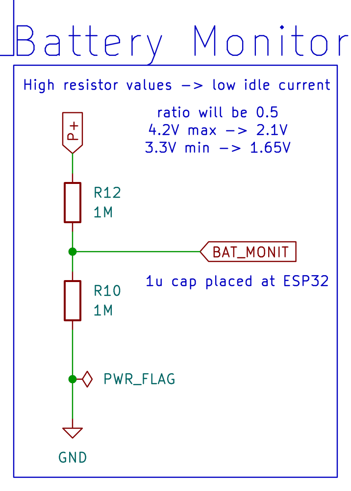

`R12` / `R10` (1 M / 1 M) divide `P+` by two into `IO8` (`BAT_MONIT`), with `C8` (1 µF) as a
reservoir.

- 4.2 V (full) → 2.10 V
- 3.0 V (empty) → 1.50 V

Both sit comfortably inside ADC1's range.

**Why 1 MΩ resistors?** Idle current. 2 MΩ total draws ~2 µA — significant when the whole
board sleeps in the tens of µA. The trade-off is ~500 kΩ source impedance, well above the
ESP32 ADC's ~10 kΩ preference, which is what `C8` compensates for: it holds charge during the
sampling window (RC ≈ 0.5 s). The designer's note reads *"High resistor values → low idle
current."*

**It measures `P+`, not `B+`** — downstream of the protection and reverse-polarity FETs. That
is the right choice: the divider current flows *through* the protection (so the DW01A can cut
it at over-discharge), and a reversed cell cannot drive the ADC pin positive through this path.
The cost is a load-dependent offset. The resistance `BAT_MONIT` actually sees is the FS8205A
pair, `Q3`, `R27`, `Q8` and the traces — **≈0.24–0.27 Ω typical, ≈0.35 Ω worst case** — so the
offset is about **12–14 mV at 50 mA and 120–135 mV at 500 mA** (up to ≈175 mV). That is roughly
twice the ~7 mV / ~73 mV an earlier draft quoted, which had wrongly counted `U2` (the divider
taps `P+`, upstream of the mux). Sample when the radio is quiet. This is a slow monitor, not a
fast brownout detector.

---

### 3.7 USB / charge status

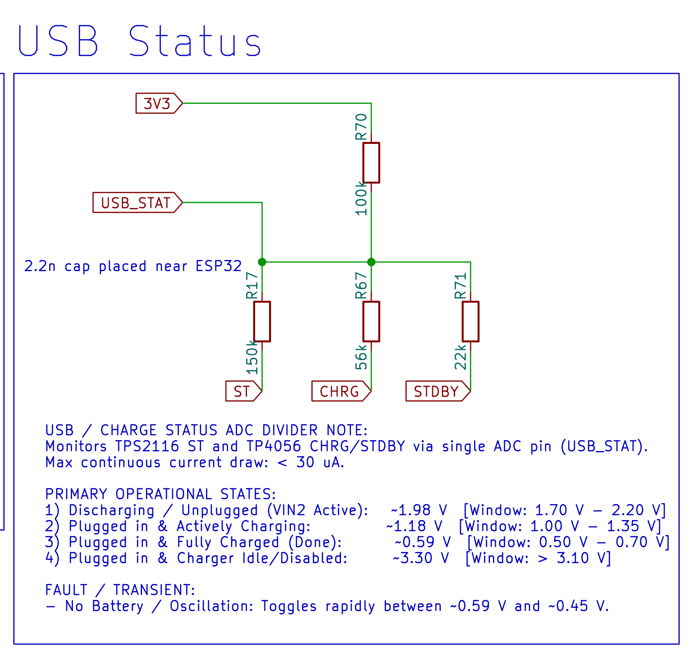

Three open-drain status signals are encoded onto **one ADC pin** (`IO9`, `USB_STAT`) through a
resistor ladder — a neat piece of pin economy. Each asserted signal pulls its resistor to ground
against the 1 MΩ pull-up (`R70`); `C23` = 0.1 µF filters it and holds the node steady while the
ADC samples.

**The ladder was rescaled ×10 on 2026-09-21 to save sleep current** — `R70` 100 k → 1 M, `R17`
150 k → 2 M, `R67` 56 k → 510 k, `R71` 22 k → 200 k, `C23` 2.2 nF → 0.1 µF, all JLC Basic parts.
On battery the ladder now draws **1.1 µA instead of 13.2 µA**. The price is speed: the node is
high-impedance (up to 667 kΩ) and takes **about half a second to settle** after a state change,
which is irrelevant for "is it charging?" but means firmware must not poll it quickly or turn on
the pin's internal pull-up/pull-down (≈45 kΩ, which would swamp a 1 MΩ ladder).

| State | Asserted | `USB_STAT` (ideal) |
|---|---|---:|
| Charger idle / no charge (USB healthy, or no USB fault to report) | none | **3.30 V** |
| On battery (unplugged, or USB too weak to charge) | ST | **2.20 V** |
| Charging | CHRG | **1.11 V** |
| Charging, weak USB (mux has fallen back to the battery) | ST + CHRG | **0.95 V** |
| Charge complete | STDBY | **0.55 V** |
| Charge complete, weak USB (mux on the battery) | ST + STDBY | **0.51 V** |

The four normal states are **2.20 / 1.11 / 0.55 / 3.30 V**. The two weak-USB rows (0.95 V and
0.51 V) are the same charge states seen while a sagging source has pushed the power-path mux onto
the battery; with the decode windows in [§13.1](#131-firmware-contract--things-the-board-needs-firmware-to-do)
they still resolve to the right charge state.

**`ST` reports which input the mux picked, not whether a cable is attached** — it asserts
whenever the mux is on the battery. So `ST`+`CHRG` is not a contradiction: it means **"USB is
attached and charging, but too weak to run the load, so the load is on the battery"** — a
genuine "weak charger/cable" diagnostic. With `D1` removed, a compliant source keeps `USB_VBUS`
above the switchover even at 1 A, so this state appears only with a marginal source.

**There is no steady "no battery fitted" level.** With **no cell at plug-in**, the Fix 4 charge-
enable gate never releases, the charger stays off and `USB_STAT` reads a steady **3.3 V** — the
same as charger idle. The TP4056's no-battery blink only appears if the **cell is unplugged while
USB is already present**: the charger then cycles between charge and termination and the node
alternates between about **0.55 V and 0.41 V** every 1–4 s. Because 0.55 V is also the
"charge complete" level, only time separates them — detect it by the *alternation*, not the
level, and require a stable reading for several seconds before reporting "charged".

> **Firmware cautions (from the review, §9):**
> - The two lowest states (~0.51 V and ~0.55 V) are **too close to separate reliably** after
>   ADC error, output-low voltage, leakage and rail tolerance. Merge uncertain readings into a
>   single **degraded/unknown band** and debounce, rather than trusting an exact level.
> - **Idle 3.3 V can top-code** the ESP32-S3 calibrated ADC range — do not require a reading
>   *above* ~3.10 V to recognize idle, or you will misclassify it.
> - `ST` low is **not** proof of physical USB absence (it also covers disabled/thermal states),
>   and `CHRG`+`STDBY` simultaneously low is not a normal steady charger state. Calibrate on the
>   real device over source voltage. Do not invent an exact "no-battery oscillation" voltage from
>   the ideal ladder.

---

## 4. The processor

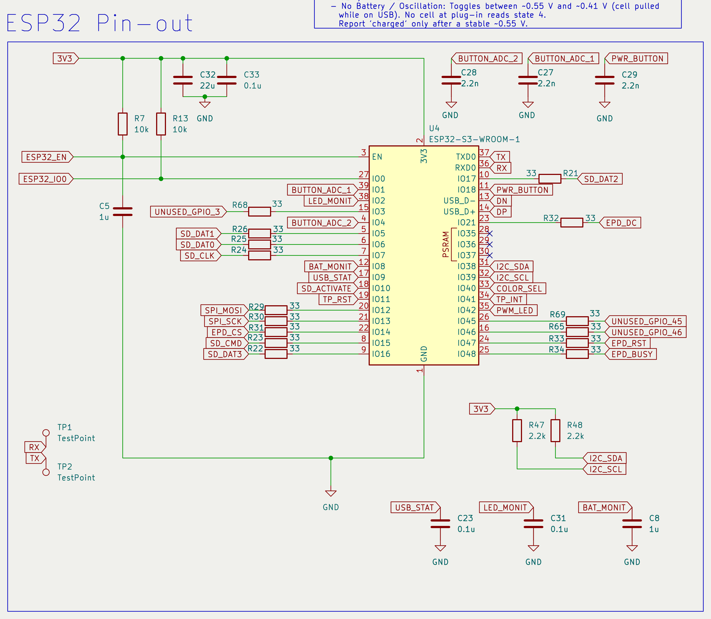

**`U4` ESP32-S3-WROOM-1-N16R8** — dual-core Xtensa LX7, Wi-Fi + BLE, with **16 MB flash + 8 MB
octal PSRAM**. PSRAM matters here: a 4.26" panel at 800×480 needs meaningful framebuffer space,
and e-reader firmware wants room for page rendering and font caches.

**Native USB.** `IO19`/`IO20` connect directly to the USB-C connector's D−/D+ — the S3 has a
USB OTG peripheral, so there is **no CH340/CP2102 bridge**. That removes a part, its power draw
and its driver headaches, and it enables USB Mass Storage (exposing the SD card to a host) and
native DFU. `EN` has 10 kΩ / 1 µF (`R7`/`C5`) startup timing, with `SW11` reset through 100 Ω
(`R63`). There is **no UART DTR/RTS auto-reset circuit** — UART RX/TX come out on `TP1`/`TP2`.

> **Self-powered USB needs a disconnect policy.** After USB removal the MCU stays powered from
> the battery, and there is **no dedicated VBUS-sense GPIO**. Espressif's self-powered
> USB-OTG/TinyUSB configuration expects VBUS monitoring; `USB_STAT` is an analog status mixture,
> not a drop-in digital `vbus_monitor_io`. Firmware may implement a qualified software
> detect/disconnect path but must not equate `ST` with physical USB presence. See
> [DESIGN_REVIEW.md](../DESIGN_REVIEW.md) §3.

### Strapping and JTAG-overlapped pins

Boot straps `IO0`, `IO3`, `IO45`, `IO46` must be at valid levels at reset; attached accessories
on the expansion header must respect this (setting a software pull afterward cannot repair a
wrong sampled strap). `IO46` is a **normal bidirectional pin** — the ESP32-S3 has no input-only
pins (those were `GPIO34`–`GPIO39` on the original ESP32) — but it *is* a strapping pin with an
internal pull-down, and it must read **LOW at reset**. **`IO39`–`IO42` overlap JTAG roles**, so firmware
must configure them for their board functions (`I2C_SCL`, `COLOR_SEL`, `TP_INT`, `PWM_LED`);
do not assume a debug configuration is harmless to the connected peripherals.

### `IO35`/`IO36`/`IO37` — the PSRAM pins

`IO37`/`IO36`/`IO35` are consumed internally by the PSRAM bus on **octal-PSRAM** parts (the
`R8` variants, including the `N16R8` fitted here) and **must not be connected or probed**. On
every other S3 variant they are ordinary free GPIO. They are **not broken out** on this board —
IO35–37 have no pads or vias. (The `TP3`–`TP5` designators serve the frontlight driver, not
these pins — see [§12](#12-test-points--mounting).) If a future revision exposes IO35–37 for
non-octal builds, keep the stubs short so an `R8` build cannot load a DDR PSRAM line.


## 5. Storage — 4-bit SDMMC

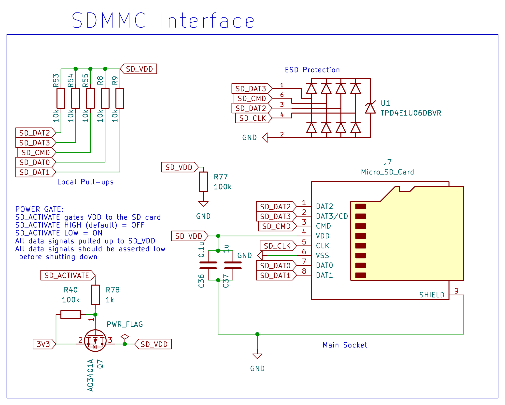

`J7` is a **push-push** microSD socket wired for **4-bit SDMMC**, not SPI. That is a deliberate
performance choice: 4-bit at ~40 MHz is roughly 8× the throughput of 1-bit SPI, which matters
when loading page images or large fonts.

**Contact pinout (identical across the original, TF PUSH and GCT parts):**
`1 DAT2, 2 DAT3, 3 CMD, 4 SD_VDD, 5 CLK, 6 GND, 7 DAT0, 8 DAT1`. Shield/detect pins are
grounded — there is **no independent firmware card-detect signal**.

**Bus conditioning (verified against the netlist):**

| Function | Parts |
|---|---|
| Series termination, all 6 lines | `R21`–`R26` = 33 Ω |
| Pull-ups on DAT0–3 + CMD (to `SD_VDD`) | `R8`, `R9`, `R53`, `R54`, `R55` = 10 kΩ |
| ESD on **CLK, CMD, DAT2, DAT3** | `U1` TPD4E1U06 |
| ESD on **DAT0, DAT1** | `U9` TPD4E1U06 (its spare channel covers expansion `IO46`) |

**33 Ω series resistors** damp reflections — the ESP32's ~30–40 Ω output impedance plus 33 Ω
brings the source close to the ~60 Ω trace impedance (slightly over-damped, good for EMC).
**Pull-ups on data and command, none on clock** — per the SD spec, DAT/CMD are bidirectional
and idle high while CLK is always driven. The pull-ups return to switched **`SD_VDD`**, not
`3V3` (see below). CLK has no pull-up.

### Power gating

The card's `VDD` is **switched** — `Q7` (AO3401A P-FET) with `R40` (100 k) holding the gate off
by default, driven from `IO10` (`SD_ACTIVATE`) through `R78` (1 k). There is no gate slow-down, so `Q7` turns
on in microseconds into `C36`/`C37` (≈1.1 µF) plus the card's own capacitance — faster than the SD spec's
suggested VDD ramp, and a brief dip on 3V3 of a few hundred mV is possible; if the first article shows card
init glitches, add 47–100 nF from `Q7`'s gate to 3V3 (τ ≈ 50–100 µs with `R78`). Polarity, stated plainly on
the schematic: **`SD_ACTIVATE` LOW = ON, HIGH (or high-impedance with internal pulls disabled)
= OFF** through `R40`. No actively latched high GPIO is required during sleep — the 100 k pull-up
wins uncontested, and `IO10` (not a strapping pin, no power-up glitch, no reset pull) comes out
of reset with the card unpowered until firmware asks for it.

**Why gate it?** An idle-but-powered SD card draws 0.2–2 mA depending on brand — up to ~20× the
board's sleep budget, with no reliable "sleep" command in SD mode. Cutting power is the only
deterministic fix.

**Everything on the card's rail is switched with it.** All five pull-ups and both decoupling
caps (`C36`, `C37`) connect to `SD_VDD`. If the pull-ups stayed on the always-on rail they would
inject current into the card's I/O pins while its supply was at 0 V, phantom-powering it through
its ESD structures. `R77` (100 k) bleeds the rail down when gated off (RC ≈ 0.11 s no-card;
the card adds capacitance). SD cards need `VDD` below ~0.5 V for a true reset, so the schematic
requires **all data signals driven low before power-off**; verify `SD_VDD` actually reaches a
low level before assuming a short off interval is a real power cycle.

**The battery normally sits in front of the card slot.** In the usual layout the cell occupies
the board's cut-out directly in front of `J7`, so you lift or slide the battery aside to insert
or remove a card. That is intended, not an oversight: the card is not meant to be swapped often,
and keeping the cell there is what makes the bay and the slot both fit on a 60 mm-wide board.

> ### Socket footprint — an open mechanical item
>
> `J7` uses a project-local **dual-source** land
> (`microSD_dualsource:microSD_PushPush_TFPUSH-MEM2075`) intended to accept either the SHOU HAN
> **TF PUSH** (LCSC `C393941`, for JLC-assembled builds) or the GCT **MEM2075** (DigiKey, for
> hand builds). The electrical contacts match, but the **mechanical fit is not yet resolved**:
> the two parts' locating pegs and keepouts differ, and the first assembled build was halted
> over peg-vs-hole fit. The current board uses a slot + round-hole compromise; the saved library
> footprint still differs from the board and the GCT keepout is not fully clear. **Confirm the
> actual socket's pegs/feet against the board before ordering assembly.** Full measurements and
> disposition are in [DESIGN_REVIEW.md](../DESIGN_REVIEW.md) §6.

---

## 6. Display interface

### 6.1 24-pin e-paper connector

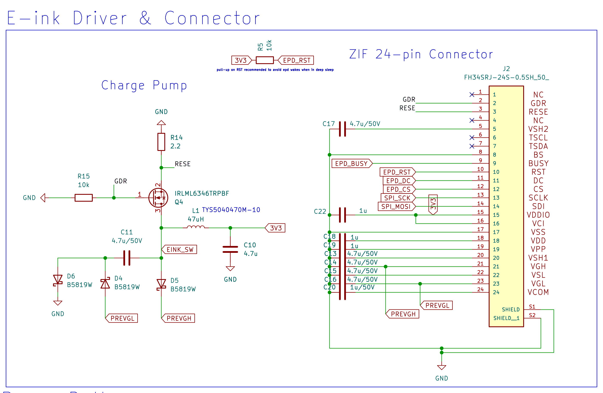

`J2` is a 24-pin, 0.5 mm-pitch ZIF (`FH34SRJ-24S-0.5SH`) — the de-facto standard for this
panel class, which is what makes the board display-agnostic.

| Pin | Signal | Connection |
|---|---|---|
| 1, 4 | NC | — |
| 2 | `GDR` | gate driver → `Q4` gate |
| 3 | `RESE` | current sense → `R14` / `Q4` source |
| 5 | `VSH2` | `C17` 4.7 µF/50 V |
| 6, 7 | `TSCL`, `TSDA` | NC (touch uses `J4`) |
| 8 | `BS` | **GND** → 4-wire SPI mode |
| 9 | `BUSY` | `IO48` |
| 10 | `RST` | `IO47`, + `R5` 10 k pull-up |
| 11 | `DC` | `IO21` |
| 12 | `CS` | `IO14` |
| 13 | `SCLK` | `IO13` |
| 14 | `SDI` | `IO12` |
| 15, 16 | `VDDIO`, `VCI` | 3V3 |
| 17 | `VSS` | GND |
| 18–24 | `VDD`,`VPP`,`VSH1`,`VGH`,`VSL`,`VGL`,`VCOM` | decoupling / charge-pump rails |

All SPI and control lines carry 33 Ω series resistors (`R29`–`R34`), matching the SD bus.

**`BS` tied to GND** selects 4-wire SPI (separate D/C pin), letting the panel use a normal
hardware SPI peripheral. **`R5` (10 k) pull-up on `RST`** — the annotation explains it:
*"pull-up on RST recommended to avoid epd wakes when in deep sleep."* Without it a floating
reset can let the panel self-wake and silently drain the battery. **`CS` has no discrete
pull-up** — firmware should establish an inactive `CS` before clock activity and hold defined
panel control levels in sleep (a `CS` pull-up is an optional next-revision improvement, not a
wiring defect).

**Every panel rail is decoupled**, with the HV rails explicitly rated **50 V**: `C13`–`C17`
(4.7 µF/50 V), `C18`–`C20` (1 µF). **Keep the 50 V rating** on any substitution — effective
capacitance under bias is a separate qualification. (Pin 5 is `VSH2`, not `VGH`; the RTC
decoupler is `C30`, not `C22` — see [§10](#10-real-time-clock).)

### 6.2 Charge pump

The e-paper panel needs roughly **±22 V** gate rails and ±15 V source rails, generated on-board.
`L1` and `Q4` form a boost stage whose switch node (`EINK_SW`) feeds two rectifier legs: `D5`
produces the positive rail (`PREVGH` → `VGH`), while `C11` with `D6`/`D4` forms an inverting
charge pump for the negative rail (`PREVGL` → `VGL`). `D4`–`D6` are B5819W (40 V Schottky).

**The panel drives its own supply.** `GDR` (panel pin 2) switches `Q4`'s gate; `RESE` (pin 3)
is the panel's current-sense return through `R14` (2.2 Ω). The panel's internal controller decides
switching frequency and peak current — the board only supplies the passive power train. This is
architecturally important: the HV rails automatically match whatever panel is fitted, which is a
large part of how one board supports many displays. `R15` (**1 MΩ**) pulls `Q4`'s gate down so the
pump stays off when the panel is unpowered or high-Z. **Changed from 10 kΩ:** 1 MΩ is the value
in Good Display's reference circuit for this panel (`GDEQ0426T82` datasheet §8.2, `R1` = 1 M),
and it stops the pull-down fighting the panel's `GDR` driver.

**`R14`: changed 2026-09-18, 3 Ω → 2.2 Ω.** Now Yageo `RC0603FR-072R2L` as the prime part, ordered at JLC as
`C22939` — a UNI-ROYAL `0603WAF220KT5E`, JLC **Basic**, so it carries no Extended-part fee. (The Yageo part's
own code `C112307` was used until 2026-09-20, when its JLC stock collapsed to a dozen pieces; the original 3 Ω
part was HKR `RCA033RFLF`, `C22356394`.) Matches the SSD1677 reference design's sense resistor exactly, now that `L1` (below)
is also at the reference inductance — the pair lands on the actual reference operating point
instead of partway there. Modeled safe against every component rating (peak current +36%,
per-pulse energy +86% vs the old 3 Ω, still far under the new `L1`'s Isat and `Q4`'s current
rating), but this **has not been bench-verified** — scope `GDR`/`RESE` and confirm `VGH`/`VGL`/
`VSH` settle within SSD1677 spec (Table 11-1) on the first boards.

A **larger** sense resistor terminates each pulse at a **lower** peak current — less ripple,
lower EMI, gentler duty on `Q4`/`L1` — at the cost of less energy per cycle, so the rails come up
more slowly; a **smaller** resistor is the opposite tradeoff. If a future display shows slow
refreshes or sagging gate rails, this is the resistor to lower further; if it shows overshoot or
ringing, raise it.

**`L1`: changed 2026-09-18, 22 µH → 47 µH.** Now **Laird `TYS5040470M-10`** (prime, DigiKey-direct,
active, 5.00×5.00×4.20 mm, shielded — confirmed against Laird's own datasheet, "magnetic shielded
structure" — Isat 1.1 A, DCR 272 mΩ max, rated current 1 A, ~$0.41/$0.34/$0.28 at qty 1/10/100),
with **Sunltech `SLW5040S470MST` / LCSC `C206267`** as the JLC-build part — 5.0×5.0×4.0 mm,
shielded, Isat 1.3 A, DCR 650 mΩ, ~$0.046/pc at qty 10 dropping to $0.024/pc past qty 10k. Both
parts are shielded and the same physical size, so there's no shielding or footprint asymmetry
between the two builds. *(A Bourns part was considered first and is semi-shielded despite its
DigiKey listing initially reading as shielded — caught before it was finalized and replaced with
the Laird part above.)*

**Why:** the Solomon Systech SSD1677 datasheet (§13, Table 13-1) specifies 47 µH / 2.2 Ω for this
exact boost stage — the board had been running at 22 µH / 3 Ω (roughly a quarter of the reference
design's energy per switching pulse) since the first commit, with no reported panel problem, but
once a same-height, reasonably-priced 47 µH part turned up on both sourcing channels the owner
decided to just match the reference design rather than carry the open qualification question
indefinitely.

**Footprint and placement (applied and re-checked 2026-09-18).** `L1`'s land grew from 3.0×3.0 mm to
`Inductor_SMD:L_APV_ANR5040` (1.4×4.2 mm pads at ±1.85 mm — 2.3 mm gap, 5.1 mm span), and the neighbours
(`C10`, `R63`, `Q4`, `D5`) were shifted to make room. Both parts solder correctly to that land: it matches
Laird's own terminal dimensions and sits within Bourns'/Sunltech's published recommended patterns (about
1.5 mm pads, 2.1 mm gap). An earlier candidate footprint generated for a Cenker part had a 1.1 mm gap — a full
millimetre tighter — and was rejected as a bridging risk. Copper clearance from the new pads to the nearest
different-net copper is ≥0.87 mm, and there are no vias under the part.

The move did **not** shrink the boost loop: `EINK_SW` copper is now 15.4 mm (was 16.5 mm,
no vias), but the `C10`→`L1`→`Q4`→`R14` pad-centre loop area is **roughly 20–27 mm²** — the exact figure
depends on how the four pad centres are joined, and an earlier **≈33 mm² (+36 %)** quoted here is not
reproducible — against ≈24 mm² before, because the inductor body is bigger. That is a modest EMI/ripple penalty, not a functional problem, and only a bench check
of the rails (below) can say whether it matters. On first power-up of the panel, 47 µH with `C14`'s 4.7 µF can
ring toward roughly 0.8–1.0 A if 3V3 steps in under ~50 µs — near the 1.1 A Isat of the Laird part, so check the
3V3 ramp time and the `GDR`/`RESE` waveforms together.

> **`Q4` = Infineon IRLML6346TRPBF (JLC `C67276`).** The first build specified a **BSS138**, which
> does not meet the panel supplier's switch-device criterion (`R_DS(on)` ≤ 0.4 Ω with a low
> gate-drive guarantee; the BSS138 is 3 Ω max at 4.5 V). The IRLML6346 (80 mΩ at 2.5 V) sits on
> the same SOT-23 pads; make sure the factory BOM carries `C67276`. Verify panel-driven switching
> on the bench. `Q5`/`Q6` only select the ~15 mA frontlight branches and stay BSS138. See
> [DESIGN_REVIEW.md](../DESIGN_REVIEW.md) §7.

---

## 7. Frontlight driver

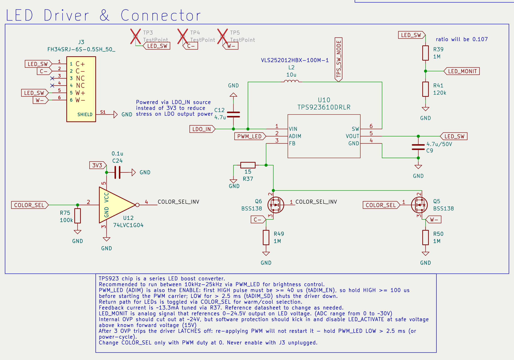

Optional block, for panels with a bonded frontlight (or an external light strip).

**`U10` `TPS923610DRLR`** — a synchronous boost LED driver, up to 24.5 V. It boosts `LDO_IN` to
the string's forward voltage on `LED_SW`, which feeds the anodes of both LED strings; each
string's cathode returns through its own N-FET (`Q5` warm, `Q6` cool) to the shared sense
resistor `R37`.

**Constant-current, not constant-voltage.** `U10` regulates `FB` to a ~195–206 mV reference
across `R37`:

```
I_LED = ~200 mV / 15 Ω ≈ 13.3 mA   (nominal 13.3, up to ~13.9 mA with reference + R tolerance)
```

**Target load:** the GDEQ bonded frontlights are **V_f ≈ 15 V, I_f ≤ 15 mA** per channel.
`R37` = 15 Ω sets a ~13.3 mA ceiling at full `ADIM` duty (≈13.9 mA worst case) — deliberately under the panel's
maximum; the first build's 13.3 Ω sat right at the limit. The boost runs at ~15 V out from a
3–5 V input, well inside the 24.5 V ceiling. Brightness is dimmed from that ceiling by `ADIM`.

### Warm / cool selection

Both LED strings share **one boost and one sense resistor**; colour is selected by which
string's return path is closed:

- `COLOR_SEL` (`IO40`) → `Q5` gate (warm)
- `COLOR_SEL` → `U12` (74LVC1G04 inverter) → `COLOR_SEL_INV` → `Q6` gate (cool)

Because `U12` inverts, the **static** case is one string on and one off — using an inverter
rather than two GPIOs makes "both strings driven on" impossible in steady state and frees a pin.
The shared `R37` sets total steady current regardless of which string conducts, so a firmware
fault cannot double the *steady* load.

> **What the inverter does *not* guarantee.** On a colour transition, propagation delay and gate
> charge can produce a brief **overlap** or a brief **both-off** interval — the "exactly one
> string ever conducts at every instant" claim is too strong. This matters only transiently, but
> qualify it if you drive fast colour blending. (Review §8.)

`R49`/`R50` (1 M) bleed the two cathode nets so neither floats when its FET is off (so "off" is
microamp-leaky, not mathematically zero). `R75` (100 k) holds `COLOR_SEL` low at boot so the
inverter never sits at mid-rail (which would draw shoot-through).

### Colour-temperature blending

Intermediate CCT is produced by **time-multiplexing `COLOR_SEL`** — the duty cycle becomes the
warm/cool mix. Because total current is set by the shared sense resistor, CCT and brightness are
close to orthogonal (`COLOR_SEL` duty → colour, `ADIM` duty → brightness), the main coupling
being a 10–20 % efficacy difference between warm and cool dies.

The binding constraint on blend frequency is `C9` re-slew: on a colour switch the boost must move
`LED_SW` to the new string's forward voltage, and it can only *discharge* `C9` (= **4.7 µF/50 V**
nameplate since 2026-09-18, was 1 µF) through the LED current, so `t ≈ C9 × ΔV_f / I_LED`.

> **Blending is a qualification item, not a solved recipe.** Earlier fixed blend-frequency /
> settling-time tables assumed an obsolete `C9` value and were not backed by board waveforms.
> **Start with fixed warm/cool selection.** Before enabling blending, measure ΔV_f between the
> two strings and each branch's current and output voltage at full and low brightness, and derive
> any needed blanking/dwell from those results. If ΔV_f turns out large, prefer reducing `C9`
> over slowing `COLOR_SEL` into the flicker-visible region. (Review §8.)
>
> **`C9` was raised from 1 µF to 4.7 µF on 2026-09-18, which slows this re-slew.** The old
> 1 µF/50 V/X7R/0805 part derates to roughly 0.6–0.8 µF effective at the 15–24 V the LED rail runs at —
> below TI's own recommended COUT minimum (1 µF effective) for the TPS923610 — so the value moved to
> 4.7 µF/50 V (Samsung `CL21A475KBQNNNE` prime / Samwha `CS2012X5R475K500NRE`, LCSC `C513770`, the same
> part as `C11`/`C13`–`C17`), still inside TI's stated 1–4.7 µF window. TI's architecture keeps that from
> being a *PWM-dimming* flicker risk: the ADIM PWM signal chops the IC's internal reference, which is
> low-pass-filtered *before* it reaches the current-control loop, so there is no PWM-edge current transient
> at the LED string for a bigger `C9` to smear (TI datasheet §7.3.8). The cost is this blend re-slew:
> with a derated effective capacitance of roughly 1–2 µF at operating bias, a 1 V string difference at
> 13.3 mA settles in about 100–150 µs (up to ~350 µs at the full 4.7 µF nameplate) versus ~75 µs before —
> almost certainly imperceptible for a colour-temperature blend, but still an estimate, not a waveform,
> and blending remains unvalidated. **Check blend timing on the bench at the populated value.**

### Brightness and enable

`PWM_LED` (`IO42`) drives `ADIM`. Despite being a PWM input this is **analog** dimming: the part
chops its internal reference at the PWM duty and low-pass filters it, so `V_FB = duty × V_ref`
and the LED current is genuinely DC — **no visible flicker**, which matters for a reading light.
TI's recommended carrier is **10–200 kHz**.

> **Two timing facts firmware must honor (review §8):**
> - **`ADIM` is also the enable, and enabling needs an initial HIGH pulse longer than ~40 µs.**
>   At 20 kHz/50 % each high pulse is only 25 µs — *insufficient to enable*. Give an explicit
>   enable pulse with margin first, *then* apply the dimming waveform.
> - **`ADIM` held low longer than ~2.5 ms shuts the part down** (into a ~130 nA state) and resets
>   latched protection.

### Monitoring, protection and connector

`R39`/`R41` (1 M / 120 k) divide `LED_SW` into `LED_MONIT` (`IO2`) with `C31` (100 nF), letting
firmware watch the boost output and apply a software over-voltage limit. `D3` (SMAJ26A) clamps
transients at the connector and `D8` (PESD2IVN-UX) protects the return lines. `U10`'s own OVP is
~25 V typical.

> **Firmware note — off-state is not zero.** A boost always has a DC path from input to output
> through the inductor and the high-side FET's body diode, so with `U10` disabled `LED_SW` sits
> at roughly `LDO_IN` minus **a diode drop** (not a fixed 0.7 V; the exact idle voltage depends
> on leakage/load). `LED_MONIT` therefore reads a small non-zero voltage tracking the battery
> when the frontlight is off — the healthy off state, not a fault. The LED string sees far below
> its ~15 V forward voltage, so nothing lights.

**`J3`** is a 6-pin ZIF. **Owner-confirmed sample mapping:**
`1 C+, 2 C−, 3 NC, 4 NC, 5 W+, 6 W−` — both positive pins to `LED_SW` (common anode), `C−`/`W−`
the switched returns.

> **Procurement warning.** A supplier FT01C drawing shows a **different, reversed** mapping. The
> owner's physical sample matches the schematic above — **keep this wiring for the checked
> sample** — but a genuinely differently-wired panel would reverse-bias the LEDs (not merely
> swap colours), which the TVS parts do not make safe. Record the FPC revision and re-check later
> lots. (Review §8.)

---

## 8. Touch interface

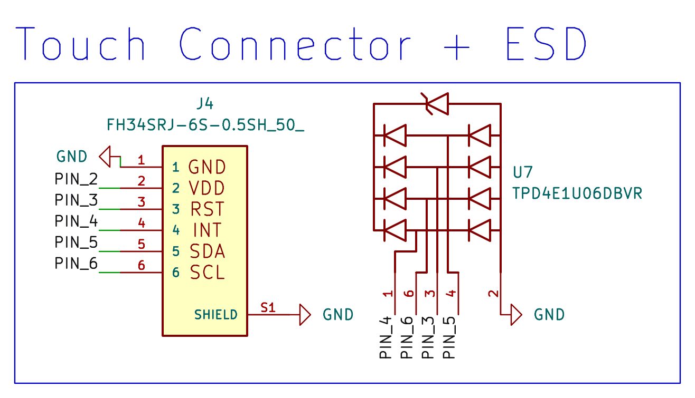

Optional block for `-FT01C`-class panels with bonded capacitive touch.

`J4` is a 6-pin 0.5 mm ZIF. **Default pins: `1 GND, 2 3V3, 3 RST, 4 INT, 5 SDA, 6 SCL`** — a
standard I²C touch-controller interface. `TP_RST` (`IO11`) and `TP_INT` (`IO41`) are dedicated;
SDA/SCL join the shared I²C bus (pull-ups `R47`/`R48` = 2.2 kΩ, sized for fast-mode with the
extra FFC/header capacitance). `U7` (TPD4E1U06) provides ESD protection on the four signal lines.

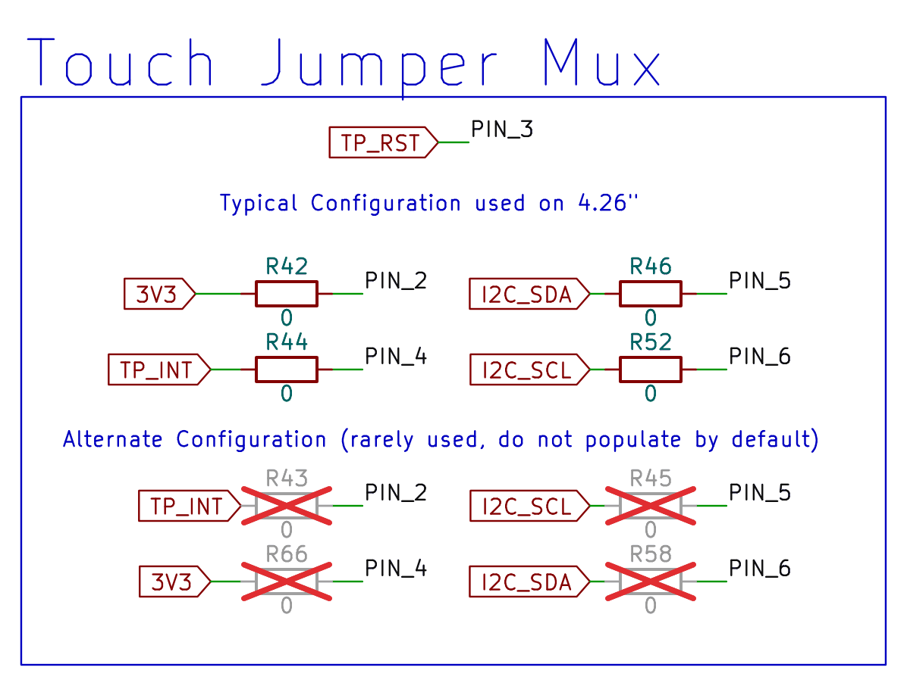

**The jumper mux.** Touch panels are inconsistent about pin order, so a re-map is built from
0 Ω resistors — swapping **VDD and INT** between connector pins 2 and 4:

| Config | Fitted | Not fitted (DNP) |
|---|---|---|
| **Default** | `R42` (3V3→PIN_2), `R44` (TP_INT→PIN_4) | `R43`, `R66` |
| **Alternate** | `R43` (TP_INT→PIN_2), `R66` (3V3→PIN_4) | `R42`, `R44` |

Also `R46`/`R52` (default SDA/SCL) vs `R45`/`R58` (swapped). **Choose exactly one option in each
pair** — these are mutually exclusive wiring choices, not spare jumpers to fit together. Confirm
the whole mapping against the specific panel before changing them.

> **`TP_INT` on `IO41` is *not* an RTC-domain wake pin.** It cannot provide ordinary EXT0/EXT1
> deep-sleep wake on the ESP32-S3 (light-sleep GPIO wake is a separate option). Do not confuse an
> external I²C touch-controller interrupt with the ESP32's internal touch-wake hardware; if
> deep-sleep wake from panel touch is required, revise the pin assignment. There is also no
> discrete `TP_INT` pull-up here — if the controller's INT is open-drain, provide a pull-up or
> configure an MCU pull. (Review §10.)

---

## 9. Human input

### 9.1 Button ladders

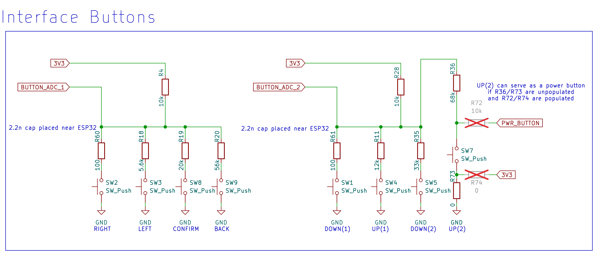

Eight buttons are read on **two ADC pins** using resistor ladders. Each button connects its own
resistor from the ADC node to ground; a 10 kΩ pull-up holds the node at 3.3 V when idle.

**Ladder 1 — `BUTTON_ADC_1` (`IO1`), pull-up `R4` 10 kΩ — the four bottom-edge buttons:**

| Button | Function | Resistor | Voltage |
|---|---|---|---:|
| `SW2` | RIGHT | `R60` 100 Ω | 0.03 V |
| `SW3` | LEFT | `R18` 5.6 kΩ | 1.19 V |
| `SW8` | OK | `R19` 20 kΩ | 2.20 V |
| `SW9` | BACK | `R20` 56 kΩ | 2.80 V |
| — | idle | — | 3.30 V |

Bottom row, as the user faces the screen: **BACK · OK · LEFT · RIGHT** (the board silkscreen
prints `OK`).

**Ladder 2 — `BUTTON_ADC_2` (`IO4`), pull-up `R28` 10 kΩ — the four side buttons:**

| Button | Function | Side | Resistor | Voltage |
|---|---|---|---|---:|
| `SW1` | DOWN(1) | right | `R61` 100 Ω | 0.03 V |
| `SW4` | UP(1) | right | `R11` 12 kΩ | 1.80 V |
| `SW5` | DOWN(2) | left | `R35` 33 kΩ | 2.53 V |
| `SW7` | UP(2) | left | `R36` 68 kΩ | 2.88 V |
| — | idle | — | — | 3.30 V |

The `(1)` pair is the **right** edge and `(2)` the **left**, so page-turns work one-handed from
either side. Grouping both sides onto one ADC pin lets a build populate one side, the other, or
both without electrical change.

**Why ladders?** Pin economy — 8 buttons on 2 pins. On a board that already commits pins to
SDMMC (6), SPI (6), I²C (2) and USB (2), that is the difference between fitting and not.

These are **single-press** inputs: both ladders idle high, and multiple keys form parallel
combinations that can alias other keys (the 100 Ω buttons dominate any combination, usable as a
deliberate priority scheme). Single-press levels decode reliably at ±1 % resistors / ±1.5 % rail;
below regulation the levels move with the rail. Two chords sit within tolerance of a single key and cannot be
told apart by the ADC alone (ladder 1: `SW3`+`SW9` ≈ 1.11 V vs `SW3` alone ≈ 1.19 V, a gap smaller than the
ESP32-S3 ADC's ±50 mV error; ladder 2: `SW4`+`SW7` ≈ 1.67 V vs `SW4` ≈ 1.80 V) — treat any reading that is not
close to one of the six clean levels of its ladder as "ignore". `C27`/`C28` (2.2 nF) are anti-aliasing, **not
debounce** — mechanical bounce (1–10 ms) is handled in software.

**Sleep wake from the ladders is limited.** Both ladders idle at 3.3 V, and only the lowest step of each
(`SW2` RIGHT and `SW1` DOWN(1), ≈33 mV) presents a valid logic low; `SW3` (1.19 V) is in the undefined band
and the higher steps (1.8–2.9 V) read as logic high. A GPIO-level wake (`ext0`/`ext1`, light-sleep GPIO)
therefore fires only for `SW1`, `SW2` and the power button; waking on the other buttons needs the ADC awake
or an extra "any press" line (e.g. a diode-OR to a spare RTC-capable GPIO) on a future revision. Both caps are placed at the
ESP32 per the schematic annotations. The bottom-switch anchors are spaced 12 / 13 / 12 mm with a
common actuator offset that preserves mirror symmetry (no placement asymmetry remains).

#### 9.1.1 Front-mounted bottom buttons (optional, hand-fitted)

**As manufactured** the four bottom-edge buttons (`SW2` RIGHT, `SW3` LEFT, `SW8` OK, `SW9` BACK) are
right-angle through-hole tactile switches on the **back** (the assembly side): the `MJTP1117` land, fitted
with the SHOU HAN `TS365ZJ` on the JLC build. Every fitted part on the board is on that one side, so a
one-shot order pays for **single-sided assembly only**, which is the cheapest way to have it built. This is
the standard build and nothing in this section changes it.

**Alternative, for a case that wants the buttons on the front face:** leave `SW2`, `SW3`, `SW8` and `SW9`
unpopulated, buy four **APEM `MJTP1243`** yourself (the same vertical 6 × 3.5 × 4.3 mm two-pin part
as the BOOT button in [§9.3](#93-boot--reset)), and solder each one in from the front, with two solder
bridges per button. The button then works exactly as the right-angle one does: same ladder resistor,
same voltage levels, same firmware.

**How it works.** The `MJTP1117` land has four holes. Pads 1 and 2 are the two contacts (GND and the
button's ladder resistor). Pads 3 and 4 are the two large plated mounting holes (ø 1.3 mm, 1.95 mm rings,
7.0 mm apart); they carry **no net** on the board. The `MJTP1243`'s two legs go in those mounting holes,
and two small copper tabs on the **front** connect them to the contacts:

| Bridge | From (tab on the front) | To (mounting-hole ring) | Result |
|---|---|---|---|
| GND | tab growing from pad 1 (GND) | pad 3 ring (the hole beside the GND pad) | one `MJTP1243` leg is on GND |
| Signal | tab growing from pad 2 (ladder resistor) | pad 4 ring (the hole beside the signal pad) | the other leg is on the ladder node |

Each tab stops short of its ring by two different measurements, and both matter. **Exposed copper to
exposed copper is 0.30 mm** — the 0.6 × 0.6 mm `F.Mask` window on the tab tip to the ring's own mask
opening, with mask expansion set to 0 — and that is the gap a solder blob actually has to cross.
**Copper edge to copper edge, underneath the solder mask, is 0.151–0.188 mm**, because the mask window
sits entirely on the 0.8 mm tab; the board's minimum clearance rule is 0.15 mm, so this is inside the
rule but with very little to spare. With the solder mask opened over the tab tip, a small
blob of solder from an iron closes the gap. The tabs are plain copper, not parts: they add nothing to the
schematic or the BOM, and left open (every shipped build) the board is electrically identical to one
without them. **The four tabs are intentional and are meant to stay open on a factory build.** They
are netless, so KiCad reports them as dangling `F.Cu` tracks; that is expected. They are a DIY
hand-soldering feature — nothing for a PCB fab to populate, bridge or "correct".

| Button | Function | Ladder resistor | If the switch is left permanently pressed |
|---|---|---|---|
| `SW2` | RIGHT | `R60` 100 Ω | ~330 µA idle |
| `SW3` | LEFT | `R18` 5.6 kΩ | ~210 µA |
| `SW8` | OK | `R19` 20 kΩ | ~110 µA |
| `SW9` | BACK | `R20` 56 kΩ | ~50 µA |

(The right-hand column is why the warning below matters: it is `3.3 V` through `R4` plus the ladder resistor,
against a deep-sleep budget of roughly 60 µA.)

**Build steps, per button:**

1. Leave the `MJTP1117` unfitted. If you are ordering assembled boards, take `SW2`, `SW3`, `SW8` and `SW9`
   out of the assembly BOM/CPL (in `production/jlc_bom.csv` they share the grouped `SW_Push` / `C557598` line — edit
   the designator list in that cell — and each has its own row in `production/positions.csv`) or mark them DNP in
   KiCad the way `SW6` is, so the fab does not fit them.
2. **Bridge both tabs first**, before the switch goes in; its body sits over them. Use a normal iron; the GND
   tab is on the ground pour and takes a little more heat than the signal tab.
3. Push the `MJTP1243` into pad 3 and pad 4 from the front (it is a two-pin switch, so it has no
   orientation) and solder the two legs.
4. Check before powering: with the board unpowered and the switch released, the ladder node reads open to GND;
   pressed, it reads roughly the ladder resistor above.

**The pitch is not identical.** The `MJTP1117` mounting holes are 7.0 mm apart and the `MJTP1243`'s legs are
6.5 mm apart, so each leg sits 0.25 mm inside its hole. The author reports the part seats fine in the 1.3 mm
holes; fit one first and check before soldering the other three. The front silkscreen legends (RIGHT, LEFT,
BACK, OK) sit where the switch body goes and will be covered.

> **Never bridge these tabs on a board that has an `MJTP1117` / `TS365ZJ` fitted, or in any other
> scenario.** The tabs are only for the front-mounted `MJTP1243`. On the right-angle switch, pads 3 and 4 are
> the two legs of its metal cover, tied together inside the part (APEM lists the `MJTP1117` as a "grounding"
> type, and the `TS365ZJ` drawing shows legs ③ and ④ as one grounded node, isolated from the contacts).
> Bridging both tabs there puts the ladder node permanently on GND through the cover: that button reads
> pressed all the time, the other three on its ladder become unreadable, and the idle current climbs by
> the amount in the table. Bridging only one tab is also unsupported. It either puts the cover on the ladder
> node or grounds it for no reason.

The side buttons (`SW1`, `SW4`, `SW5`, `SW7`) and the power/reset buttons have no front option. Only the four
bottom-edge buttons carry these tabs.

### 9.2 Power button

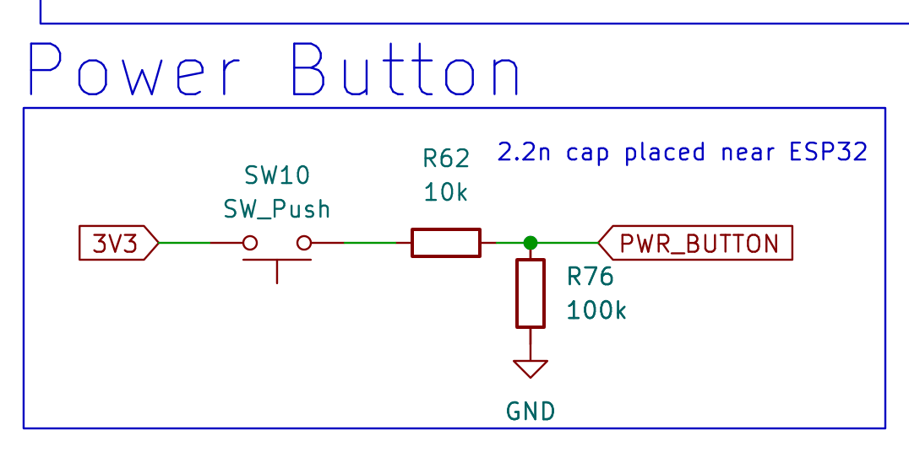

`SW10` connects `3V3` through `R62` (10 k) to `PWR_BUTTON` (`IO18`), with `R76` (100 k)
pull-down: pressing gives ~3.00 V logic high, releasing a defined 0 V. Because 3V3 is always
live, the power button is a **wake source**, not a true power switch — `IO18` is RTC-capable and
can trigger `ext0` wake from deep sleep.

`R73`/`R74` are 0 Ω configuration jumpers; **`R72` is 10 kΩ, not a 0 Ω link** (it is the series
resistor for the alternate path, matching `R62`). Annotation: *"UP(2) can serve as a power button
if R36/R73 are unpopulated and R72/R74 are populated."* In the reviewed build **`R36`/`R73` are
fitted for normal `SW7`; `R72`/`R74` are DNP.** **Never fit both `R73` and `R74`** — that shorts
the rails through the alternate link.

### 9.3 Boot & reset

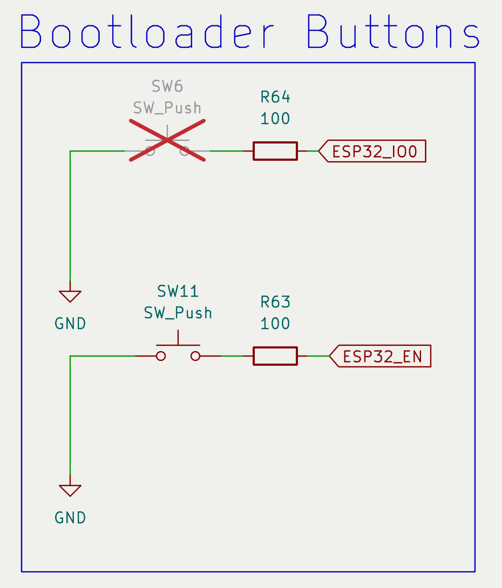

Standard ESP32 programming interface:

| Signal | Circuit | Purpose |
|---|---|---|
| `ESP32_EN` | `R7` 10 k pull-up, `C5` 1 µF, `SW11` via `R63` 100 Ω | reset, ~10 ms RC (**populated**) |
| `ESP32_IO0` | `R13` 10 k pull-up, `SW6` via `R64` 100 Ω | boot mode select (**`SW6` = DNP**; APEM MJTP1243 if fitted) |

Holding `IO0` low during reset enters the ROM bootloader; the 100 Ω series resistors limit
current if firmware ever drives these pins.

**`SW6` (BOOT/`IO0`) is DNP in the standard build** — its land is left unpopulated. It uses a
different land from the side buttons: a vertical 6 × 3.5 × 4.3 mm two-pin THT tactile (**APEM
MJTP1243**, 6.5 mm pin pitch), not the right-angle `TS365ZJ`. Leaving it off is fine for normal
flashing: the ESP32-S3's **USB-Serial-JTAG** lets `esptool` trigger download mode over USB-C
with no BOOT button. The one caveat is recovery — if application firmware fully claims the
USB-OTG peripheral and hangs, forcing download mode then means momentarily grounding `IO0` by
hand (it's on `R64`/`R13`). Fit an MJTP1243 (or an equivalent 6 × 3.5 × 4.3 mm part such as ALPS
SKHLACA010) if you want hardware boot-mode entry.

---

## 10. Real-time clock

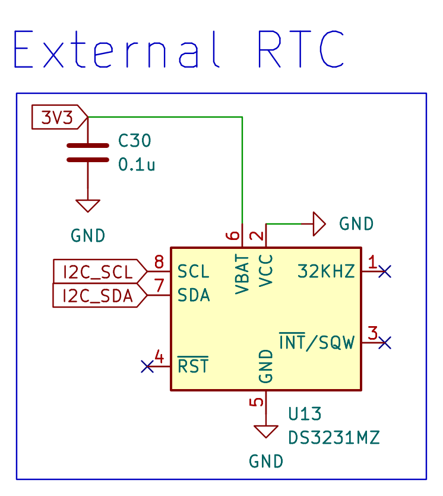

**`U13` `DS3231MZ`** — a temperature-compensated RTC, **±5 ppm (about ±2.6 minutes/year)**.
Populated in the standard build (LCSC `C107410`, DS3231MZ+TRL — the reel part; `C722467` was the
earlier cut-tape listing, superseded 2026-09-17 for stock reasons, see `fabrication/BOM.md`); omit
it if you don't need a clock.

The wiring looks wrong at first glance but is correct (verified in the netlist):

- **`VBAT` (6) → 3V3**
- **`VCC` (2) → GND**

This is the datasheet's **Figure 5 single-supply VBAT-only configuration**, which explicitly
requires `VCC` grounded, not floating. Three consequences firmware must know (they apply to
`U13`; the `U14` alternate below is a conventional single-supply part):

1. The oscillator **does not start until a valid I²C write occurs**, because `VCC` never rises
   above the power-fail threshold. Init code must touch the RTC and check the oscillator-stop
   flag rather than assume valid time at first power-up.
2. `RST` (pin 4) and `INT`/`SQW` (pin 3) are **unconnected** — so there is **no RTC interrupt /
   wake output** to the MCU.
3. There is **no independent time backup**: with no coin cell, time is lost if the battery is
   removed or fully discharged. For an e-reader that is an acceptable trade to avoid a coin-cell
   holder that would fight the "case agnostic" goal.

The RTC's local decoupler is **`C30` = 0.1 µF** (not `C22`). `R47`/`R48` (2.2 kΩ) pull up the
shared I²C bus. (`C22` = 1 µF is a separate 3V3 decoupler in the display area, not an RTC part —
an earlier draft mislabeled it.)

**`U14` `RV-8263-C7` (Micro Crystal) — a second RTC footprint, DNP by default.**
Fit **either `U13` or `U14`, never both** — the board only ever needs one clock, and there is no
reason to pay for two. They answer on different I²C addresses (`0x68` for the DS3231MZ, `0x51`
for the RV-8263-C7), so the two would not clash on the bus if both were fitted; the rule is about
cost, not conflict. `U13` is the accurate one (±5 ppm, temperature-compensated); `U14` is the
cheaper, lower-current alternative for builds that only need approximate time. `U14` is DNP in
the standard build.

---

## 11. Expansion header

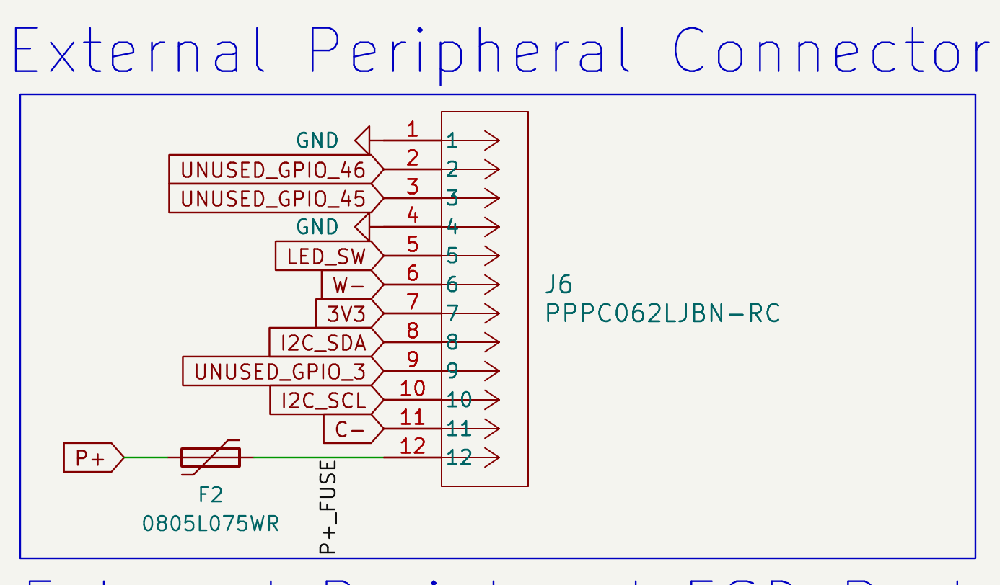

**`J6` `PPPC062LJBN-RC`** — a 2×6, 0.1"-pitch female header.

| | 1 | 2 | 3 | 4 | 5 | 6 |
|---|---|---|---|---|---|---|
| **row 1** | GND | IO46 | IO45 | GND | LED_SW | W− |
| | **7** | **8** | **9** | **10** | **11** | **12** |
| **row 2** | 3V3 | SDA | IO3 | SCL | C− | P+ |


What it exposes:

| Category | Pins |
|---|---|
| Power | `3V3` (7), `P+` raw battery (12, PPTC-fused — see the rules below), 2× `GND` (1, 4) |
| I²C | `SDA` (8), `SCL` (10) — shared bus, already pulled up |
| Spare GPIO | `IO46` (2, strap — internal pull-down, must be LOW at reset), `IO45` (3, strap), `IO3` (9, strap) |
| Frontlight | `LED_SW` (5), `W−` (6), `C−` (11) — drive external LED strips |

**Pin ordering groups signals by voltage domain**, which matters on a 0.1" header a user can
bridge with a solder whisker. `LED_SW` (pin 5) — the only net that can reach 24.5 V — is bounded
by `GND` (4), `W−` (6) and `C−` (11), all LED-domain or ground. No logic pin touches it.
Likewise `P+` (raw cell) sits at the corner where its only neighbours are the LED returns.

`W−` and `C−` are low-voltage in normal operation (`R49`/`R50` bleed them to ground; the
conducting one sits at the `FB` sense voltage).

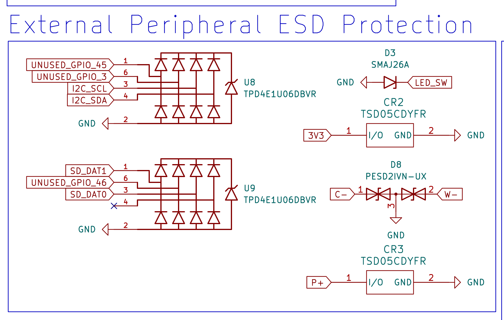

**Every signal pin is ESD-protected:** `U8` covers `IO45`/`IO3`/`SDA`/`SCL`, `U9`'s spare
channel covers `IO46`, `CR2` protects the 3V3 pin, `CR3` protects the battery pin (it sits on the `J6` side of the PPTC `F2`, net `/P+_FUSE`, so a clamped surge is also current-limited by the fuse), `D3` (SMAJ26A) clamps
`LED_SW`, and `D8` (PESD2IVN-UX) covers the `C−`/`W−` returns. The three GPIOs carry 33 Ω series
resistors (`R65`, `R68`, `R69`).

**Which of those go away with `J6`.** Leave `J6` off and **`U8`, `CR2` and `CR3` come off with
it** — all four of `U8`'s channels land on `J6` pins, and `CR2`/`CR3` only guard the `3V3` and
`P+` rails at the point where they leave the board. The others stay:

- **`U9` is not `J6`-only** — its other two channels are the microSD `DAT0`/`DAT1` lines.
- **`D3` and `D8` are not `J6`-only** — they clamp `LED_SW`, `W−` and `C−`, which are the front
  light's own nets. Fit them with the front light whether or not `J6` is there. (They sit on the tongue, so a
  board shortened at the cut line loses both — see the cut-line row in [§16](#16-design-notes--conventions).)
- The three 33 Ω series resistors `R65`/`R68`/`R69` are on the GPIO nets and cost nothing; leave
  them fitted. Strictly they only serve `J6` (with `J6` off they connect each GPIO to an empty
  net, or to `U9`'s spare channel for `IO46`), so a header-less build may drop them.

**This is not a general-purpose isolated GPIO header.** It exposes `LED_SW`, switched LED
cathodes and raw `P+` beside logic; external supply injection can back-power rails, and the
strap pins (`IO3`/`IO45`/`IO46`) need boot-time care. Exposing `P+` is deliberate — it lets a
daughterboard draw meaningful current or add its own regulation rather than being limited by the
LDO's remaining headroom.

### Rules for anything you plug into `J6`

**1. Never pull or drive `IO45` or `IO46` HIGH during power-up or reset.** Both are ESP32-S3
strapping pins, read at reset and brought out here with only a 33 Ω series resistor. `IO45` sets
`VDD_SPI`: held high at reset it selects 1.8 V and **the module will not boot** — the board looks
dead until the accessory is unplugged. `IO46` is sampled the same way. Both have only the chip's
internal ~45 kΩ weak pull-down on this board, so an accessory with its own pull-up wins. Use
**`IO3`** (pin 9) for anything that idles high; it is not sampled into a boot-critical
configuration. If an accessory must hold `IO45`/`IO46`, give it its own reset-time isolation.

**2. An external LED string with a low forward voltage is not current-limited.** `LED_SW`
(pin 5) with `W−` (6) or `C−` (11) is the front-light boost output, and a synchronous boost has a
body-diode path from its input to its switch node. If the string's total forward voltage is
**below the battery/`LDO_IN` voltage**, current flows through `L2` and `U10`'s high-side body
diode **even with the driver switched off**, with nothing regulating it. On USB (`LDO_IN` = 5 V,
`LED_SW` ≈ 4.3 V) a single 3 V white LED would see roughly 43 mA — about twice its rating. The
board silkscreen gives the *upper* limit (V_f < 22 V); the lower limit matters just as much:
**use at least three LEDs in series, V_f > 6 V.** Nothing on the board is stressed by this — it is
the accessory's LEDs that burn.

**3. `J6` pin 12 is raw battery positive.** It is connected to `P+` through the PPTC `F2`, upstream of the
3.3 V LDO and downstream of the cell protection, and it is **fused by a 0.75 A PPTC**
(`0805L075WR`) in series with the pin. Treat it as a
battery terminal: it is live whenever a cell is connected, it is not current-limited beyond the
PPTC, and a short across pins 11/12 or 12-to-GND will trip the fuse rather than the cell's own
protection.

---

## 12. Test points & mounting

Two bare test pads and three unpopulated header footprints are provided:

| TP | Net | Purpose |
|---|---|---|
| `TP1` | `RX` | UART0 RX — ROM bootloader / early boot messages |
| `TP2` | `TX` | UART0 TX — serial debug |
| `TP3` | `LED_SW` | Frontlight boost output (probe the LED rail / software OVP) |
| `TP4` | `C−` | Cool-string cathode return (frontlight bring-up / CCT tuning) |
| `TP5` | `W−` | Warm-string cathode return |

`TP1`/`TP2` are useful even though programming is over native USB, since boot messages come out
on UART. `TP3`–`TP5` make the frontlight driver measurable — handy for setting current, checking
the CCT blend, and confirming the boost output. `IO35`–`IO37` (PSRAM pins on `R8` modules) are
**not broken out** — see [§4](#4-the-processor).

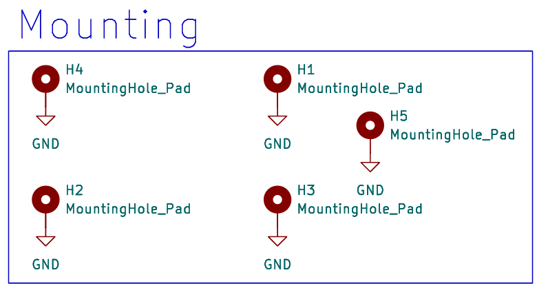

`H1`–`H6` are `MountingHole_Pad`s tied to GND — plated holes, so a metal standoff bonds the
enclosure to ground. (Make that a deliberate EMC choice — see [§16](#16-design-notes--conventions).)

---

## 13. Complete GPIO map

Every ESP32-S3 pin, as used (SD series resistors verified against the netlist):

| Pin | GPIO | Net | Function |
|---|---|---|---|
| 3 | EN | `ESP32_EN` | Reset (SW11) |
| 4 | IO4 | `BUTTON_ADC_2` | Side button ladder (ADC1_CH3) |
| 5 | IO5 | — | SD DAT1 (via `R26`) |
| 6 | IO6 | — | SD DAT0 (via `R25`) |
| 7 | IO7 | — | SD CLK (via `R24`) |
| 8 | IO15 | — | SD CMD (via `R23`) |
| 9 | IO16 | — | SD DAT3 (via `R22`) |
| 10 | IO17 | — | SD DAT2 (via `R21`) |
| 11 | IO18 | `PWR_BUTTON` | Power button / wake |
| 12 | IO8 | `BAT_MONIT` | Battery voltage (ADC1_CH7) |
| 13 | IO19 | `DN` | USB D− |
| 14 | IO20 | `DP` | USB D+ |
| 15 | IO3 | — | Spare → `J6` pin 9 (strap) |
| 16 | IO46 | — | Spare → `J6` pin 2 (strap; must read LOW at reset) |
| 17 | IO9 | `USB_STAT` | Charger status ladder (ADC1_CH8) |
| 18 | IO10 | `SD_ACTIVATE` | microSD power gate (active low) |
| 19 | IO11 | `TP_RST` | Touch reset |
| 20 | IO12 | — | EPD SDI (via `R29`) |
| 21 | IO13 | — | EPD SCLK (via `R30`) |
| 22 | IO14 | — | EPD CS (via `R31`) |
| 23 | IO21 | — | EPD DC (via `R32`) |
| 24 | IO47 | — | EPD RST (via `R33`) |
| 25 | IO48 | — | EPD BUSY (via `R34`) |
| 26 | IO45 | — | Spare → `J6` pin 3 (strap) |
| 27 | IO0 | `ESP32_IO0` | Boot mode (SW6, DNP) |
| 28–30 | IO35–37 | — (no net) | Reserved for the module's octal PSRAM; not connected on the board |
| 31 | IO38 | `I2C_SDA` | I²C data |
| 32 | IO39 | `I2C_SCL` | I²C clock (JTAG-overlapped) |
| 33 | IO40 | `COLOR_SEL` | Frontlight warm/cool (JTAG-overlapped) |
| 34 | IO41 | `TP_INT` | Touch interrupt (JTAG-overlapped; **not** RTC-wake) |
| 35 | IO42 | `PWM_LED` | Frontlight brightness / ADIM enable (JTAG-overlapped) |
| 36 | RXD0 | `RX` | UART0 → `TP1` |
| 37 | TXD0 | `TX` | UART0 → `TP2` |
| 38 | IO2 | `LED_MONIT` | Frontlight voltage sense (ADC1_CH1) |
| 39 | IO1 | `BUTTON_ADC_1` | Bottom button ladder (ADC1_CH0) |

**All five analog signals are on ADC1.** ADC2 is unusable while Wi-Fi is active on the
ESP32-S3, so this is a necessary constraint — and with five analog functions it consumes a
substantial share of ADC1's channels.

### 13.1 Firmware contract — things the board needs firmware to do

Several behaviours this board depends on are not enforced by anything on the PCB — they only happen
if the firmware does them. This list is written for whoever ports firmware to the board.

* **`USB_STAT` (`IO9`, ADC1_CH8, 11 dB attenuation) — decode "charger idle / no charge" as
  `> 2.6 V`, not `> 3.10 V`.** The ESP32-S3's SAR ADC is only specified to **2900 mV** at 11 dB
  (datasheet Table 5-6), so a `> 3.10 V` test asks the converter for a reading it is not specified to
  produce. Nothing real sits between about 2.3 V and 3.27 V, so there is ~1 V of free space to put
  the threshold in. Nominal node levels (ladder as rescaled 2026-09-21): **2.20 V** on battery,
  **1.11 V** charging, **0.55 V** charge complete, **3.3 V** charger idle. Decode on battery as
  `1.80–2.60 V`.
* **Accept `0.80–1.35 V` as charging and `0.35–0.70 V` as complete.** When a weak USB source sags
  `VBUS` below the power-path mux's ≈4.0 V threshold while the charger is still running, those two
  states read **0.95 V** and **0.51 V** instead of 1.11 V and 0.55 V. The wider windows keep the rare
  weak-USB cases decoding to the right charge state.
* **Treat `USB_STAT` as a slow, high-impedance node.** The ladder is 1 MΩ-class (up to 667 kΩ
  source impedance) with `C23` = 0.1 µF on the pin, so it needs **about 0.5 s to settle** after a
  cable or charge-state change — read it once a second or slower, never in a tight loop after a
  wake, and **leave the pin's internal pull-up and pull-down off** (they are ≈45 kΩ and would
  swamp the ladder). Keep the 11 dB attenuation; no other ADC setting matters at this impedance
  because `C23` supplies the sampling charge.
* **Require a stable reading for several seconds before reporting "charged".** If the cell is
  unplugged while USB power is present, the TP4056 enters its no-battery blink and `USB_STAT`
  alternates between about **0.55 V** and **0.41 V** every 1–4 s — and 0.55 V is the *same* node
  voltage as "charge complete", so only time separates them. (At a cold plug-in with no cell fitted
  the Fix 4 `CE` gate keeps the charger off entirely and the node reads a steady 3.3 V.)
* **Front light (`PWM_LED` / `IO42` → `TPS923610` `ADIM`) — `ADIM` is also the enable.** TI datasheet
  SNVSCN8 §6.5: the first HIGH pulse must be **≥ 40 µs** (`tADIM_EN`), and LOW for **> 2.5 ms**
  (`tADIM_SD`) shuts the driver down. A bare 10–25 kHz PWM carrier may never start it — at 25 kHz /
  50 % the HIGH time is only 20 µs. Drive `PWM_LED` HIGH for **≥ 100 µs**, *then* start the carrier.
* **Recover the front light after an open-LED over-voltage event by taking `ADIM` low, not by
  re-applying PWM.** The driver latches off after three OVP trips (SNVSCN8 §7.3.6 / §7.4.2) and no
  amount of PWM restarts it: hold `PWM_LED` **LOW for > 2.5 ms** (use ≥ 3 ms) or power-cycle `VIN`.
  Monitor `LED_MONIT` (`IO2`, ADC1_CH1) and shut the boost down before OVP is reached. **Never enable
  the boost with `J3` unplugged** — an unplugged flex is an open load, and it is the ordinary
  bring-up mistake.
* **Front-light colour select (`COLOR_SEL`, `IO40`) — change colour only with the PWM duty at 0.**
  `Q5` takes `COLOR_SEL` directly while `Q6` takes it through `U12`'s inverter, so the two string
  switches have no guaranteed non-overlap; mid-transition the driver can momentarily see both strings
  or an open load.
* **microSD (`SD_ACTIVATE`, `IO10`, HIGH = gate off) — park the bus before gating `SD_VDD` off.**
  De-initialise the SDMMC peripheral, then drive `CLK`, `CMD` and `DAT0`–`DAT3` (`IO5`–`IO7`,
  `IO15`–`IO17`) **LOW as outputs with the internal pull-ups disabled**, and hold ≥ 20 ms. Otherwise
  the five external 10 kΩ bus pull-ups back-feed the card to about **3.2 V** through `R77` and the
  gate saves nothing.
* **Deep-sleep wake sources are the RTC-capable pins `GPIO0`–`GPIO21` only.** The power button
  (`PWR_BUTTON`, `IO18`) can wake the chip. `TP_INT` is on `IO41` and **cannot**, and the DS3231's
  `INT`/`SQW` pin is deliberately not routed — there is no alarm wake on this board, by design.
* **Battery edge cases to tell users about.** A 0 V or protection-latched pack **will not start
  charging**: the Fix 4 charge-enable gate needs roughly **1.7 V at `J5`** in the worst case (`Q9`'s
  BSS138 threshold is 0.5–1.6 V behind a 0.909 divider, so 0.6–1.8 V across the lot), and a
  dead-pack-in, nothing-happens board is indistinguishable from a broken one. And after any
  battery-protection trip the board restarts **only when USB is plugged in** — `Q8`'s gate sits on
  system `GND`, which floats up when the DW01A's discharge FET opens.

---

## 14. Design themes

Reading the board as a whole, several consistent principles emerge.

**1. Pin economy as an enabler.** The button ladders (8→2), the status ladder (3→1) and the
shared I²C bus are all the same move. The ESP32-S3-WROOM-1 has ~35 usable GPIO; SDMMC, SPI, I²C
and USB claim 16 before any user interface exists. Multiplexing onto ADC pins is what leaves
room for expansion.

**2. Idle current treated as a first-class constraint.** 1 MΩ dividers, a 100 k gate pull-up, a
power-gated SD card, a ~130 nA-shutdown LED driver, and a 100 k (not 10 k) rail bleed. On an
e-paper device the display costs nothing to hold an image, so standby current *is* battery life.

**3. Defense in depth on power.** PPTC → TVS on the input; DW01A + FS8205A on the cell; a
priority mux that blocks reverse current; back-to-back FETs *intended* for reverse-polarity
blocking. That last item is the qualifier: as-built it does **not** hold when USB is present
(§3.3 / review §4). The rest genuinely make "bring your own cell" a defensible proposition once
polarity is verified.

**4. ESD on everything a user can touch.** USB (`U6`), SD (`U1` + `U9`), touch (`U7`), expansion
GPIO (`U8`), plus `CR1`/`CR2`/`CR3` on rails and `D3`/`D8` on the LED lines. Six arrays on a
board this size directly serves the "hand it to anyone" goal.

**5. Configuration by resistor.** Touch pin swap, power-button reassignment, LED colour routing.
Each is a 0 Ω jumper or DNP option that lets one PCB serve several builds.

**6. Let the peripheral drive itself.** The e-paper charge pump is the clearest case: the panel's
own controller runs the switching, so the board's HV rails adapt to whatever display is fitted —
the single biggest contributor to display agnosticism.

---

## 15. What changed from de-link

Silkscreen is a substantial revision of [de-link](https://de-link.me) rather than a new board.
The predecessor's history lives largely in backups, so this is a summary of the material changes
rather than a commit-level changelog:

| Area | Change |
|---|---|
| **Accessory header** | Refined into the current 12-pin `J6`, grouped by voltage domain and fully ESD-protected |
| **Power path** | Reworked around the TPS2116 priority mux; idle-current behaviour tightened throughout (high-value dividers, power-gated SD, low-shutdown LED driver) |
| **Touch** | Added — `J4` plus the `U7` ESD array and the 0 Ω pin-swap jumpers |
| **RTC** | Added — `U13` DS3231MZ on the shared I²C bus |
| **Frontlight** | Moved from the AP3012 to the TPS923610, gaining proper dimming; the two colour-select GPIOs became one GPIO plus the `U12` inverter |
| **ESD** | Expanded and refined — now six arrays plus three rail clamps |
| **Charge reporting** | Added the `USB_STAT` resistor ladder |
| **Mechanical** | The battery now sits in a cut-out *in* the PCB rather than stacked on top |

The through-line is that de-link proved the concept and Silkscreen makes it a **base board**:
more of the board is optional, more of it is protected, and much more of it is configurable
without a respin.

---

## 16. Design notes & conventions

**Sleep current target.** No numeric spec — the goal is "as low as practical." Updated
2026-09-18 to fold in Fix 4 (§3.3), and again 2026-09-21 when the `USB_STAT` ladder was rescaled
×10 (13.2 → 1.1 µA) and `R57` raised to 10 MΩ (≈3.7 → 0.4 µA) — about **15 µA saved, a fifth of
the sleep floor, for the price of four resistor values and one capacitor**. Contributors now
total roughly **60 µA typical, up to ~85 µA worst-case** — `TLV75533P` quiescent ~25 µA,
`USB_STAT` ladder ~1 µA, ESP32-S3 deep-sleep ~8–13 µA, and the Fix 4 detector network ~10 µA
(**not** the ≈3.4 µA in §3.3's earlier note — that figure only counted `R79`/`R80` pulling from
the raw cell; `R81`/`R82` pull another ≈6.6 µA from the always-on 3V3 rail once a correct cell
is detected: `/DET_NODE` sits at `B−` and `CE` sits at 3V3, so each 1 MΩ resistor drops a full
3.3 V, `I = 3.3 V / 1 MΩ ≈ 3.3 µA` apiece). The LDO's own quiescent draw is now the largest
single term, not a tied one. **Considered and declined:** raising `R79`–`R82` to cut this
further trades directly against the leakage margin already flagged in
[DESIGN_REVIEW.md](../DESIGN_REVIEW.md) §4 (the detector's logic levels are set against
1–5 µA-class FET leakage at 1 MΩ; going higher makes that margin worse, not better) for a
saving smaller than the LDO's own quiescent draw — not worth it. If deep-sleep current is ever
worth chasing seriously, the LDO's always-on `EN` tied to `IN` (§3.5) is the bigger, more
separable target. The board is designed so no other *avoidable* load remains: the SD card is
power-gated, the LED driver drops to a sub-µA shutdown, and every monitoring divider is
1 MΩ-class.

**Enclosure.** The author's own enclosure is 3D-printed and is not published in this repository; the board is meant to be housed in
anything. Implications for a custom case:

- The six `MountingHole_Pad`s (`H1`–`H6`) are **plated and GND-connected**, so a conductive
  enclosure will be bonded to signal ground through the standoffs — usually good for EMC, but make
  it deliberate (use one bonded standoff and isolate the rest if a chassis ground loop is a concern).
- **Keep screw heads at or under 4 mm and do not use metal washers.** Each hole's exposed GND pad
  is 3.8 mm across; live tracks pass 2.1–2.6 mm from the hole centres under nothing but solder
  mask, so a 5 mm washer or pan head sits on top of them. Solder mask is not insulation you
  should clamp a screw onto. The two to respect most are on the battery side: `H5` (the `Q3`
  gate net, 2.1 mm from centre) and `H1` (the fused battery rail to `J6`, 2.3 mm). An M2
  cap-head or a nylon washer is fine everywhere.
- A conductive case must not bridge the exposed high-voltage nets: `LED_SW` (up to 24.5 V) and
  the panel's ±22 V rails are the ones to keep clear of metalwork.
- **Keep the battery, screws and metal away from the antenna corner.** The ESP32-S3-WROOM-1's
  PCB antenna overhangs a cut-out in the board edge: the board is cut completely away underneath
  it, with **no copper pour, no track, no hole and no part** in that notch. That is the one part
  of the board where enclosure choices can ruin Wi-Fi. Leave roughly 10 mm of air in front of
  the antenna, and do **not** lay the battery over it, route battery leads across it, put a
  screw boss, a metal insert or a magnet there, or let the display's metal backplane extend over
  that corner. Everything on the board — the cell, both boost inductors and every connector —
  is already on the far side for this reason; a case is the easiest way to undo it.
- **The battery sits in front of the microSD slot.** In the normal layout the cell fills the
  board's cut-out directly in front of `J7`, so the card can only be inserted or removed with
  the battery lifted or slid aside. Design for that rather than around it — the card is not a
  frequently swapped item (see [§5](#5-storage--4-bit-sdmmc)).

### Enclosure dimensions

The **authoritative source is the 3D model**, [`mechanical/silkscreen_pcb.step`](mechanical/silkscreen_pcb.step)
— use it for anything that has to fit. The table below is a quick reference, not a substitute.
All x/y figures are board (KiCad page) coordinates, the same frame the STEP and the layout PDF use.

| Dimension | Value |
|---|---|
| PCB outline | **60.05 × 111.30 mm**, **1.6 mm** FR-4, 2 layers |
| Cavity above the top face | ≥ **2.5 mm** panel only; ≥ **4.0 mm** if the panel is stood off 1.5 mm to clear the through-hole leads; ≥ **6.8 mm** with front-mounted buttons |
| Cavity below the bottom face | ≥ **7.5 mm** (6.80 mm of switch body plus plug and wire room) |
| Total internal stack | ≥ **10.38 mm** |
| Display panel | 105.33 × 62.37 × 1.98 mm; overhangs the PCB by **1.185 mm per side**; 5.75 mm of visible bezel below it |
| Mounting bosses | M2 × 6: `H1` (94.241, 51.646) · `H2` (53.900, 70.500) · `H3` (47.987, 145.250) · `H4` (100.487, 145.250) · `H5` (94.600, 72.200) · `H6` (69.200, 117.500); keep bosses and screw heads ≤ **4 mm** diameter, all six GND-plated. `H5` moved from (94.100, 72.000) and `H6` was added on 2026-09-21 |
| Button plunger axis | **4.30 mm** below the bottom face; travel 0.25 mm; force 1.77 N; tip ≈1.5 mm |
| Bottom-button centres | x = 55.737 / 67.737 / 80.737 / 92.737 (12 / 13 / 12 mm apart, centred) |
| Side-button centres | left y = 75.25, 89.25; right y = 70.25, 84.25, and 52.25 for `SW10` |
| Inner walls | right ≥ x 105.6, left ≤ x 43.1, bottom ≥ y 150.4 (plunger tips) |
| USB-C aperture | mating face x = 105.485, centred y = 103.975; opening ≥ **9.3 × 3.6 mm** |
| microSD aperture | left wall, centred y = 84.6; opening ≥ **12 × 2.2 mm** |
| Expansion (`J6`) aperture | top wall, x 87.2 … 103.0, ≈6 mm tall |
| Battery bay | **38.75 × 30.50 mm** at x 44.24 … 82.99, y 37.00 … 67.50; lead exit at `J5` (x 96.20, y 63.5 … 69.5, opening +x) |
| Antenna keep-out | x 44.24 … 50.60, y 93.30 … 112.00, **plus ~10 mm of air** — nothing conductive, no battery |
| Display-flex slot | **47.04 × 1.30 mm** at x 51.26 … 98.30, y 141.20 … 142.50 |
| Tongue-neck slot | **5.30 × 1.10 mm** at x 89.59 … 94.89, y 61.40 … 62.50 |
| Cut line (optional shortening) | y = 61.86, x 84.42 … 104.24 — cutting here removes `J6` with its protection parts (`U8`, `CR2`, `CR3`, `D3`, `D8`, `F2`), `SW10` and mounting hole `H1` |
| Status-LED window | (102.80, 118.34), back face |

**Frontlight load.** The GDEQ bonded frontlights are V_f ≈ 15 V at I_f ≤ 15 mA per channel;
`R37` = 15 Ω sets ~13.3 mA at full `ADIM` duty, under the panel's 15 mA maximum (§7).
**13.3 mA at full `ADIM` duty is the figure everywhere** — the schematic's design note and the
board silkscreen both print 13.3 mA as of 2026-09-21.

**Button geometry.** Bottom edge, left-to-right facing the screen: BACK · OK · LEFT ·
RIGHT. Sides: UP(1)/DOWN(1) on the right edge, UP(2)/DOWN(2) on the left edge — the front
silkscreen abbreviates these `UP1`/`DWN1`/`UP2`/`DWN2`. (The board
silkscreen prints **OK**; earlier drafts of this document called that button CONFIRM.)

### Things that look like mistakes and are not

A handful of items look like errors in KiCad or in a fab's DFM check. They are deliberate:

- **Four dangling `F.Cu` stubs at the bottom button row.** These are the landing tabs described
  in [§9.1.1](#911-front-mounted-bottom-buttons-optional-hand-fitted) — copper for a DIY builder
  to bridge with an iron when fitting front-mounted `MJTP1243` buttons. They carry no net, they
  are not for a PCB fab to populate or "repair", and KiCad's dangling-track DRC warnings on them
  are expected.
- **The empty, mirrored silkscreen text box at the tongue neck is the cut line** — the marked
  line for shortening the board for a smaller panel. It is mirrored because it reads from the
  front face. The single `mirrored-text` DRC item is this.
- **`H2` and `H5` are deliberately not in line** (`H2` at y 70.5, `H5` at y 72.2). They serve
  different things in the case; they are not a misplaced pair.
- **`D2` is a "USB power present" indicator for the user**, not a charge-state indicator. It
  lights whenever USB is attached and says nothing about charging — charge state is read from
  `USB_STAT` ([§3.7](#37-usb--charge-status)).
- **Eight `lib_symbol_mismatch` ERC warnings are expected** — `CR1`–`CR3`, `D8`, `J3`, `J4`, `J5` and `U10`. Their
  symbols were edited inside this schematic (pin names, graphics) after being placed, so the copy cached in the
  schematic no longer matches the library it came from. Do **not** run "Update symbols from library" on them.
- **Five `footprint_link_issues` ERC warnings are expected** — `F1`, `F2`, `CR1`, `CR2`, `CR3` use hand-solder
  footprints that their symbols' footprint filters do not list (`Q1`'s is excluded in the project file for the same reason).
- **Nine DRC rules are set to "ignore" in the project file** (`solder_mask_bridge`, `text_height`, `text_thickness`,
  `footprint_type_mismatch`, `lib_footprint_mismatch`, `footprint_filters_mismatch`, `missing_courtyard`,
  `npth_inside_courtyard`, `pth_inside_courtyard`). They silence noise from the vendor footprints, the 0.5 mm-pitch
  FPC connectors and the fine silkscreen art; none of them hides a clearance, connection or parity check.

---

## Appendix — component summary

| Type | Count | Notable |
|---|---:|---|
| Resistors | 83 | all **0603** (except `R27`, 0805); incl. 15× 33 Ω series, 5× DNP 0 Ω config jumpers plus the DNP 10 kΩ `R72`, 4× Fix 4 (R79–R82), `R83` DW01A VCC filter |
| Capacitors | 36 | 23× **0603**, 13× **0805** (HV / bulk — see below); 10× marked 50 V (`C9`, `C11`, `C13`–`C20`) |
| ICs | 14 | see below; includes the **DNP** alternate RTC `U14` |
| Switches | 11 | 8 ladder + power + reset (right-angle `TS365ZJ`) + boot `SW6` (APEM MJTP1243, **DNP** → 10 populated) |
| Diodes | 6 | 3× B5819W, SMAJ26A, PESD2IVN-UX, LED |
| Connectors | 7 | USB-C, 24p ZIF, 2× 6p ZIF, microSD, 2-pin battery, 2×6 header |
| Transistors | 9 | 4× AO3401A (Q2/Q3/Q7/Q8 — swapped in from the schematic's original AO3419 2026-09-17, see `fabrication/BOM.md`), 3× BSS138 (Q5/Q6/Q9), IRLML6346 (Q4), FS8205A (Q1, SOT-23-6 — TECH PUBLIC/EVVOSEMI make this MPN in that package; Fortune Semiconductor's own FS8205A is TSSOP-8 only, their SOT-23-6 part is "FS8205" with no A) |
| Test points | 5 | UART RX/TX bare pads (`TP1`/`TP2`, fitted) + frontlight `LED_SW`/`C−`/`W−` 1-pin header footprints (`TP3`–`TP5`, **DNP**) |
| Mounting | 6 | plated, GND (`H1`–`H6`) |
| TVS | 3 | `CR1` SMF6.5CA (VBUS, SOD-123FL, LCSC `C19077501`); `CR2`/`CR3` TSD05CDYFR prime / DOWO SD05C-01FTG (`C5299440`) on 3V3 and on `J6`'s fused battery pin (`/P+_FUSE`) |
| Inductors | 2 | 47 µH (charge pump, `L1`, changed 2026-09-18 from 22 µH), 10 µH (frontlight, `L2`, changed 2026-09-17 from 4.7 µH) |
| Fuse | 2 | `F1` 0805L100WR 1 A PPTC on VBUS; `F2` 0805L075WR 0.75 A PPTC in series with `J6` pin 12 (both 0805) |
| **Total** | **184** | standard build: 165 fitted + 11 DNP (TP3–TP5, R43/R45/R58/R66/R72/R74, SW6, U14) + 8 bare-copper refs (H1–H6, TP1, TP2); includes the six Fix 4 parts Q2/Q9/R79–R82 |

**Passive case sizes.** The board standardised on **0603** for hand-solderability at the smallest
comfortable size. **Thirteen capacitors remain 0805** because the value does not exist in 0603 or
DC-bias derating would gut it:

| Refs | Value | Reason |
|---|---|---|
| `C11`, `C13`–`C17` | 4.7 µF @ 15–23 V | **4.7 µF/50 V does not exist in 0603**; the 0603/50 V ceiling is ~2.2 µF (X5R) / 1 µF (X7R) |
| `C4`, `C6`, `C32` | 22 µF | 0603 22 µF/6.3 V delivers only ~6.7 µF at 3.3 V vs ~12.7 µF for the 0805 part. Prime part is now the Murata `GRM21BR61E226ME44L` (the Samsung `CL21A226MAQNNNE` is obsolete at DigiKey); JLC places the Samsung part itself, `C45783` (Basic), in place of the earlier CCTC clone |
| `C9` | 4.7 µF/50 V | Frontlight boost output (`TPS923610` COUT). **Changed 2026-09-18 from 1 µF** because the 1 µF part derated to ~0.6–0.8 µF effective at the 15–24 V LED rail bias, below TI's own COUT minimum; 4.7 µF still sits inside TI's 1–4.7 µF window. See §7's blend-time note |
| `C18`–`C20` | 1 µF @ 15 V | Kept with the rest of the `J2` HV cluster |

`F1` (fuse) stays 0805 and `D2` (power LED) is 1206.

**Integrated circuits:**

| Ref | Part | Function |
|---|---|---|
| `U1`, `U6`–`U9` | TPD4E1U06DBVR | ESD arrays (SD data DAT2/3+CLK/CMD on `U1`; SD DAT0/1 + expansion on `U9`; USB `U6`; touch `U7`; expansion `U8`) |
| `U2` | TPS2116DRL | Power-path mux |
| `U3` | TLV75533PDBVR | 3.3 V LDO |
| `U4` | ESP32-S3-WROOM-1-N16R8 | Processor |
| `U5` | DW01A | Cell protection controller |
| `U10` | TPS923610DRLR | Frontlight boost driver |
| `U11` | TP4056-class | Li-ion charger |
| `U12` | 74LVC1G04 | Inverter (colour select) |
| `U13` | DS3231MZ | Real-time clock (populated in the standard build; optional) |
| `U14` | RV-8263-C7 | Alternate real-time clock, **DNP** — fit either `U13` or `U14`, never both ([§10](#10-real-time-clock)) |

> **Manufacturer note.** Several ordered parts are house-brand equivalents (TECH PUBLIC, MDD,
> PUOLOP, TOPPOWER, etc.) rather than the TI/Onsemi/Nexperia parts the schematic labels suggest.
> The review verified the exact ordered parts' pinouts and keeps their datasheets with the frozen
> order — see [DESIGN_REVIEW.md](../DESIGN_REVIEW.md) §10 and §12.

---

*Silkscreen is open-source hardware. Predecessor project: [de-link.me](https://de-link.me).*
*This file describes the board as it is; open issues and the assembly decision are in
[DESIGN_REVIEW.md](../DESIGN_REVIEW.md).*
