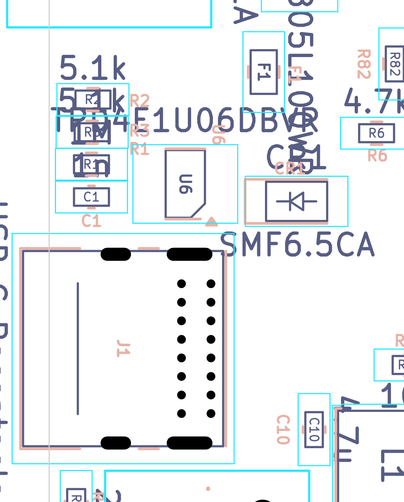
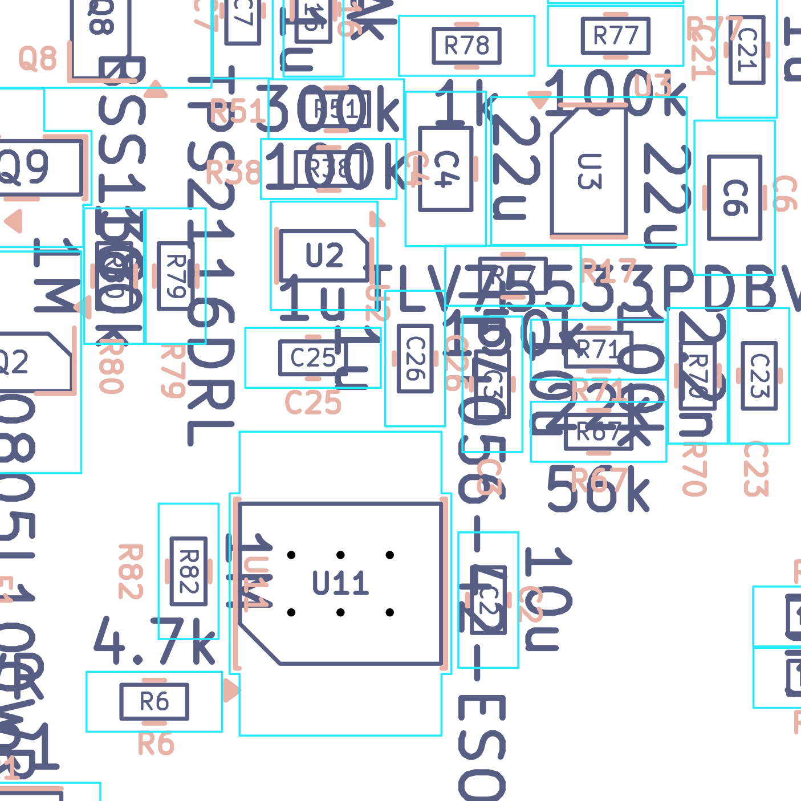

# USB-C input, USB ESD, power-path switch and USB/charge status sense

*Independent final review, 2026-09-19. Reviewer key `usb`, finding IDs `USB-nn`. All connectivity below was
taken from the netlist-derived evidence files (`evidence/sch/connectivity_by_*.txt`), all placement and routing
from `evidence/pcb/board_extract.json` and `evidence/pcb/net_routing_stats.csv`, never from an image alone.*

---

## What this part of the board does

Everything on this board is powered either from a USB-C cable or from a single-cell lithium-polymer (LiPo)
battery. This section covers the chain that gets power in from the cable and decides which of the two sources
actually runs the board:

1. **J1** is the USB-C socket. Two 5.1 kΩ resistors (**R2**, **R3**) on the CC pins tell whatever is on the
   other end of the cable "I am a device, please give me plain 5 V". Without them a USB-C charger supplies
   nothing at all.
2. **F1** is a *polyfuse* (PPTC) — a resettable fuse. If the board ever tries to draw too much from the cable
   it heats up, its resistance shoots up and it chokes the current off; unplug, let it cool, and it recovers.
3. **CR1** is a *TVS diode* (transient voltage suppressor): a component that does nothing until the voltage
   on the 5 V rail spikes, then conducts hard to clamp the spike. It protects against the inductive kick you
   get every time a cable is plugged in, and against static discharge.
4. **U6** is a four-channel ESD protection array on the two data wires (D+/D−) and the two CC wires. It shunts
   static discharge to ground before it can reach the ESP32.
5. **U2 (TPS2116)** is the *power-path mux*: an electronic changeover switch with two inputs (USB 5 V and the
   battery) and one output. It prefers USB when USB is healthy and falls back to the battery otherwise, with
   no diode drop and with reverse-current blocking so the battery can never push current back into the cable.
6. The **USB status network** (R17/R67/R70/R71/C23) squeezes three separate digital status signals — "is the
   mux on USB?", "is the charger charging?", "is the charger finished?" — onto **one** analogue pin of the
   ESP32 by turning each combination into a different DC voltage.

Downstream of U2 sits the 3.3 V LDO (U3, reviewed elsewhere), the LED boost converter (U10) and the charger
(U11). The battery-charger side of U11 is another reviewer's scope; I only cover its two status outputs and
the current it pulls from VBUS.

---

## Circuit walk-through

Net names used below: `VBUS_PRE_FUSE` = cable side of the fuse; `USB_VBUS` = board side of the fuse;
`LDO_IN` = output of the power mux; `P+` = battery positive; `/PR1`, `ST`, `CHRG`, `STDBY`, `USB_STAT` as on
the schematic.

| Ref | Part / value | Role | Checked against datasheet? |
|---|---|---|---|
| J1 | GCT **USB4085-GF-A**, 16-position USB2.0 Type-C receptacle, through-hole, edge/overhang mount | USB-C input. A4/A9/B4/B9 → `VBUS_PRE_FUSE`; A1/A12/B1/B12 → GND; A5→CC1, B5→CC2; A6+B6→`DP`, A7+B7→`DN`; A8/B8 (SBU1/SBU2) left unconnected; S1 shell → `Net-(J1-SHIELD)` | **Yes** — GCT USB4085 datasheet pin table. All 14 signal pins map correctly (see USB-OK-1) |
| R2, R3 | 5.1 kΩ 1 % 0603 | CC2 / CC1 pull-downs (`Rd`). Advertise a USB-C sink that wants default (5 V) power | **Yes** — USB Type-C Rd = 5.1 kΩ ±20 %; one per CC pin is required for flip support |
| F1 | Littelfuse **0805L100WR** PPTC, I_hold 1.00 A, I_trip 1.95 A, V_max 6 V, R_min 60 mΩ, R1_max 210 mΩ | Resettable overcurrent fuse in the VBUS path | **Yes** (DigiKey + LCSC attribute tables). **Could not** retrieve Littelfuse's official temperature-rerating table — see USB-05 |
| CR1 | Littelfuse **SMF6.5CA**, bidirectional TVS, SOD-123FL. V_RWM 6.5 V, V_BR ≈ 7.2–8.0 V, V_C 11.2 V @ 17.9 A | VBUS transient clamp, on the **cable** side of F1 | **Yes** (LCSC/Littelfuse SMF series). See USB-04 |
| U6 | TI **TPD4E1U06DBVR**, SOT-23-6. 4 channels, V_RWM 5.5 V, V_BR ≥ 6.5 V, C_IO 0.8 pF, IEC 61000-4-2 ±15 kV | ESD array on DP, DN, CC1, CC2. Pin 1→DN, 2→GND, 3→CC2, 4→CC1, 6→DP; pin 5 (NC) unconnected | **Yes** — TPD4E1U06 SLVSBQ9D §5 pin functions: 1 = D1+, 2 = GND, 3 = D2+, 4 = D2−, 5 = NC, 6 = D1−. Channel assignment is electrically arbitrary (all four are identical); NC may float. **Correct** |
| R1 / C1 | 1 MΩ + 1 nF 0603, shell → GND | Standard shield "RC snub": DC-isolates the shell but gives ESD a low-impedance path at high frequency | Standard practice; no datasheet requirement |
| C2 | 10 µF 0603 on `USB_VBUS` | VBUS bulk | — |
| C25 | 1 µF 0603 on `USB_VBUS` (U2 VIN1) | U2 input decoupling, channel 1 | Yes — TPS2116 typical application |
| C26 | 1 µF 0603 on `P+` (U2 VIN2) | U2 input decoupling, channel 2 | Yes |
| C4 | 22 µF 0805 on `LDO_IN` (U2 VOUT) | U2 output bulk; holds the rail up during the 8 µs break-before-make switchover | Yes |
| U2 | TI **TPS2116DRLR**, SOT-583-8. 1.6–5.5 V, 2.5 A, R_ON 40 mΩ, I_Q 1.32 µA | Power mux. Pin1 GND, 2+7 VOUT→`LDO_IN`, 3 VIN1→`USB_VBUS`, 4 PR1→`/PR1`, 5 MODE→`USB_VBUS`, 6 VIN2→`P+`, 8 ST→`ST` | **Yes** — TPS2116 SLVSFG1A §5 pin functions, §6.3 electricals, §7.3.1 truth table, §7.6.1 modes |
| R38 / R51 | 300 kΩ / 100 kΩ 1 % | Divider from `USB_VBUS` to `PR1` — sets the USB→battery switchover threshold | **Yes** — §7.6.1.1 is exactly this topology. See Calculations |
| R17 | 150 kΩ 1 % | Pull-down leg for `ST` (TPS2116 open-drain status) onto `USB_STAT` | — |
| R67 | 56 kΩ 1 % | Pull-down leg for `CHRG` (TP4056 open-drain, low while charging) | — |
| R71 | 22 kΩ 1 % | Pull-down leg for `STDBY` (TP4056 open-drain, low when charge complete) | — |
| R70 | 100 kΩ 1 % | Pull-up from `USB_STAT` to `3V3` | — |
| C23 | 2.2 nF 0603 on `USB_STAT` | ADC anti-alias / noise filter, placed near the ESP32 per the schematic note | — |
| D2 / R59 | LTST-C150KRKT red LED + 2 kΩ, anode on `USB_VBUS` | "USB present and fuse intact" indicator. I ≈ (5 − 1.9)/2000 ≈ **1.55 mA** | Vf assumed ~1.9 V; not critical |
| U11 | TP4056-42, VCC on `USB_VBUS`, BAT on `P+`, CE gated by Q2/R82 | LiPo charger. `R6 = 4.7 kΩ` on PROG ⇒ I_chg ≈ 1200/4700 ≈ **255 mA**. Only its VBUS load and its two status pins are in my scope | TP4056 PROG formula I_BAT = 1200 V / R_PROG (vendor datasheet). **Low confidence** on the TP4056 datasheet itself — see Open questions |

---

## Where it is on the board & layout notes

All of the parts in this section are on the **BOTTOM** side (as are 175 of the board's 183 footprints).
Coordinates are KiCad board mm, Y increasing downward. The board outline is 60.05 × 111.30 mm with its
right-hand edge a straight line at **x = 104.2375**, from y = 39.0 to y = 146.5.

| Ref | x, y (mm) | Rot | Note |
|---|---|---|---|
| J1 | 96.83, 103.97 | −90° | Bounding box x 95.74 → 105.96, i.e. the shell **overhangs the right board edge by 1.72 mm** — correct for an edge-mount receptacle, but the enclosure must have a matching aperture |
| CR1 | 92.90, 100.20 | 180° | ~5 mm inboard of J1's VBUS pads |
| F1 | 94.41, 94.27 | 90° | ~10 mm of routed `VBUS_PRE_FUSE` from J1 |
| U6 | 98.00, 99.40 | 0° | ESD array; ~9.6 mm of routed stub from the J1 D+ pad (see USB-07) |
| R2 / R3 | 102.23, 95.53 / 102.27, 97.03 | 0° | CC pull-downs, near the board edge |
| R1 / C1 | 102.30, 98.50 / 102.30, 100.00 | 0° | Shield RC |
| U2 | 85.10, 86.22 | −90° | Power mux, ~19 mm inboard of J1 |
| C25 / C26 / C4 | 85.37, 88.70 / 82.88, 88.72 / 82.14, 84.10 | — | 2.5 / 3.3 / 3.6 mm from U2 — all acceptably close |
| C2 | 81.10, 94.60 | 90° | VBUS bulk, 8.9 mm from U2, **16 mm from J1** |
| R38 / R51 | 84.99, 84.10 / 84.80, 82.65 | — | PR1 divider, ~2–4 mm from U2 pin 4 |
| R17/R67/R70/R71/C23 | 80.50, 86.70 / 78.41, 90.50 / 76.00, 89.14 / 78.41, 88.50 / 74.50, 89.14 | — | Status network, clustered between U2/U11 and the ESP32 |
| D2 / R59 | 102.80, 118.34 / 103.00, 114.19 | — | USB LED, 14 mm south of J1 near the right edge |



*Bottom assembly view of the USB inlet (board mm 88–106.5 × 91–114, **mirrored** — this is the board seen from
its bottom face, so the right-hand board edge appears on the left). The grey vertical line is the board outline
at x = 104.2375; J1's body crosses it, which is the intended 1.72 mm overhang. J1's two rows of **eight**
through-hole pins are clearly visible — sixteen contacts, not fourteen (see USB-15). U6, CR1 and F1 are all
clustered within ~10 mm of the connector, and R1/C1/R2/R3 sit along the edge above it.*



*Bottom assembly view around U2 (board mm 73.5–93 × 80–99.5, mirrored). U2 with C25/C26/C4 within 2.5–3.6 mm,
the R38/R51 PR1 divider immediately beside it, U11 (TP4056) below, and the R17/R67/R70/R71 status ladder to the
left heading toward the ESP32.*

**Routing** (`evidence/pcb/net_routing_stats.csv`, all widths in mm):

| Net | Length | Segs | Vias | Width | Netclass |
|---|---|---|---|---|---|
| `VBUS_PRE_FUSE` | 21.25 | 12 | 2 | **0.25** | Power |
| `USB_VBUS` | 69.79 | 46 | 3 | **0.25** | Power |
| `LDO_IN` | 72.97 | 38 | 2 | **0.25** | Power |
| `P+` | 84.97 | 78 | 6 | 0.25 / **0.40** | Power |
| `DP` | 45.76 | 15 | 3 | 0.20 | Default |
| `DN` | 46.24 | 11 | 1 | 0.20 | Default |
| `CC1` / `CC2` | 14.22 / 17.43 | 12 / 8 | 1 / 0 | 0.20 | Default |
| `/PR1` | 2.89 | 4 | 0 | 0.20 | Default |
| `ST` | 3.08 | 2 | 0 | 0.20 | Default |
| `USB_STAT` | 21.45 | 15 | 2 | 0.20 | Default |
| `Net-(J1-SHIELD)` | 20.40 | 9 | 0 | 0.20 | Default |

The battery path (`P+`) was widened to 0.40 mm but the **entire USB input path is still 0.25 mm** — see USB-06.

D+/D− are matched to within 0.48 mm over ~46 mm, both 0.20 mm wide, running mostly on B.Cu. On a 2-layer
1.6 mm board these are nowhere near 90 Ω differential and DP takes 3 vias against DN's 1 — but USB
**full speed** is 12 Mbps with ~4–20 ns edges, so none of that is capable of breaking enumeration. Correctly,
there are **no series resistors** and **no external 1.5 kΩ D+ pull-up**: the ESP32-S3's USB-Serial-JTAG PHY has
both built in, so the native-USB bootloader will work.

---

## Calculations

### 1. Power-mux switchover threshold (R38/R51 vs V_REF)

`PR1` sees `USB_VBUS` through a 300 k / 100 k divider:

```
V_PR1 = V_USB_VBUS x R51 / (R38 + R51) = V x 100k/400k = 0.250 x V
```

TPS2116 §6.5: `V_REF` (PR1 reference) = **0.92 / 1.00 / 1.08 V** (min/typ/max, −40…105 °C).
The mux hands over from USB to battery when `V_PR1` falls below `V_REF`:

```
Nominal :  V_VBUS(switch) = 1.00 / 0.250              = 4.00 V
Worst high: 1.08 / (99k/(303k+99k)) = 1.08 / 0.24627  = 4.39 V
Worst low : 0.92 / (101k/(297k+101k)) = 0.92 / 0.25377 = 3.63 V
```

**Switchover happens somewhere between 3.63 V and 4.39 V of VBUS, typically 4.00 V.** That is a sensible
threshold: below it a 1-cell LiPo at 3.5–4.2 V is the better source, and the TLV75533 needs only ≈3.45 V in to
hold 3.3 V out at 500 mA.

Divider standing current when USB is present: 5.0 V / 400 kΩ = **12.5 µA**. When USB is absent `USB_VBUS`
collapses to ≈0 V (TPS2116 reverse leakage into VIN1 is ≤0.15 µA at 105 °C, §6.5 `I_REV`, and is swallowed by
the 400 kΩ divider and the 2 kΩ LED leg), so **the divider costs nothing on battery.** Good.

### 2. Which source wins, in every state (TPS2116 §7.3.1 truth table)

`MODE` is hard-wired to `USB_VBUS`, i.e. to VIN1. Datasheet §7.6.1: *"To configure VIN1 as the priority supply,
connect MODE to VIN1 and set the proper threshold through a resistor divider from VIN1 to PR1."* **Exactly what
is done here.** MODE thresholds: V_IH ≥ 1 V, V_IL ≤ 0.35 V.

| Situation | V_USB_VBUS | MODE | V_PR1 | Mode entered | VOUT source | ST |
|---|---|---|---|---|---|---|
| USB only, no battery | 5.0 V | high | 1.25 V | Priority | **VIN1 (USB)** | Hi-Z (high) |
| USB + battery, healthy | 5.0 V | high | 1.25 V | Priority | **VIN1 (USB)** | Hi-Z (high) |
| USB brown-out under load | 3.8 V | high | 0.95 V | Priority | **VIN2 (battery)** | **Low** |
| Battery only | 0 V | low (0 V) | 0 V | Manual, MODE low + PR1 low | **higher of VIN1/VIN2 = battery** | **Low** |
| Plug-in ramp, 0.35 V < VBUS < 1 V | 0.35–1 V | *undefined* | < 0.25 V | either | **battery either way** | Low |

The ramp window where MODE is between V_IL and V_IH is harmless: in *both* possible interpretations PR1 is low,
so the battery is selected. Once VBUS > 1 V MODE is unambiguously high and priority mode is in force.
**Reverse-current blocking**: §7.3.4/§6.5 — RCB engages when VOUT exceeds the selected VIN by 42–70 mV, response
2 µs. The battery therefore cannot push current back into the USB cable or into the LDO input when VBUS is
higher, and vice versa. **ST polarity**: §7.3.3 — open drain, high (released) only while **VIN1** is powering
the output; low on VIN2, on both-off and in thermal shutdown. The USB_STAT network interprets it correctly.

### 3. Unplug transient

On unplug, `USB_VBUS` is held by C2 + C25 = 11 µF. At a 300 mA system load the rail falls from 5.0 V to the
4.0 V trip point in `t = C·ΔV/I = 11 µF × 1.0 V / 0.3 A ≈ 37 µs`. The mux then does a **break-before-make**
switchover, `t_SW = 8 µs typ at 5 V` (§6.6). During that gap `LDO_IN` (C4 22 µF + C12 4.7 µF ≈ 27 µF) droops by

```
ΔV = I·t / C = 0.3 A x 8 µs / 27 µF = 89 mV
```

so LDO_IN ends up near 3.9 V — still far above the TLV75533's dropout. **No brownout on unplug.**
§7.6.1 also notes the new channel will not turn on until VOUT has fallen to VIN2 + V_RCB; at light load
(50 µA) that decay takes `27 µF × 1.15 V / 50 µA ≈ 620 ms`, during which the LDO is simply coasting on C4 at
4–5 V. Also fine.

### 4. Fuse headroom vs worst-case input current

Everything the cable supplies passes through F1:

| Load | Current from VBUS | Basis |
|---|---|---|
| TP4056 charge current | **255 mA** | R6 = 4.7 kΩ, I = 1200/R_PROG |
| 3.3 V system via U2 + U3 | up to **500 mA** | TLV75533 is a 500 mA linear regulator, so LDO_IN current = 3V3 current. ESP32-S3 Wi-Fi TX peaks ~355 mA on its own |
| LED front-light boost (U10) | ~**65–125 mA** *(originally "~100 mA, assumed")* | **Verified 2026-09-20:** U10 is a TPS923610 boost LED driver; `R37 = 15 Ω` sits from FB to GND and the datasheet regulates FB to **200 mV** (SLVSFB9 electricals, `V_FB` 195/200/206 mV; `I_OUT = V_FB / R_SET`), so the LED string runs at **13.3 mA**. Input current = V_string × 13.3 mA ÷ (η × V_in); for a 20–40 V front-light string at ~85 % from 5 V that is 63–125 mA. The 100 mA figure is a *sound* estimate, not a guess — the only unknown left is the number of LEDs in the panel on J3 |
| D2 indicator | 1.6 mA | measured from values |
| **Total worst case** | **≈ 0.86 A** | |

That is 86 % of F1's 1.00 A hold current at 23 °C. PPTCs derate with ambient temperature (a 0805L at 60 °C
typically holds only ~70 % of its 23 °C rating), so inside a closed enclosure the effective hold current drops
toward ~0.7 A and the worst case would trip it. See **USB-05**.

Trace check, IPC-2221 external layer, 1 oz (35 µm) copper, 0.25 mm = 9.84 mil wide ⇒ A = 13.5 mil²:

```
I(10 °C rise) = 0.048 x 10^0.44 x 13.5^0.725 = 0.048 x 2.754 x 6.60 = 0.87 A
I(20 °C rise) = 0.048 x 20^0.44 x 6.60                              = 1.18 A
```

So the 0.25 mm VBUS trace is right at its 10 °C-rise rating at the 0.86 A worst case, and would see a ~60 °C
rise if F1 let 1.95 A through for its 300 ms trip time. Survivable, but thin. See **USB-06**.

### 5. USB_STAT node voltage in every state

`USB_STAT` is a 100 kΩ pull-up to 3V3 with three switchable pull-down legs. Each open-drain pin is either
**L** (pulled to ≈0 V; TPS2116 V_OL = 0.1 V at 1 mA, and at the ≤22 µA flowing here it is far below that) or
**Z** (high impedance). With `R_pd` = the parallel combination of the active legs:

```
V_USB_STAT = V_3V3 x R_pd / (R70 + R_pd)
```

3V3 comes from the TLV755P, **output accuracy 1 % max at 85 °C** (TLV755P datasheet §"Output accuracy"), so
3.267–3.333 V. Resistors are 1 %. Worst-case node voltage spread below combines both.

| # | ST | CHRG | STDBY | Meaning | R_pd | V nominal | V worst-case band (1 % R, 1 % rail) | Declared window |
|---|---|---|---|---|---|---|---|---|
| A | Z | Z | Z | USB in, charger idle/disabled (CE low) | ∞ | **3.300 V** | 3.267 – 3.333 V | `> 3.10 V` |
| B | **L** | Z | Z | On battery / unplugged | 150 k | **1.980 V** | 1.944 – 2.016 V | `1.70 – 2.20 V` |
| C | Z | **L** | Z | USB in, actively charging | 56 k | **1.185 V** | 1.158 – 1.212 V | `1.00 – 1.35 V` |
| D | Z | Z | **L** | USB in, charge complete | 22 k | **0.595 V** | 0.580 – 0.611 V | `0.50 – 0.70 V` |
| **E** | **L** | **L** | Z | **USB in but VBUS < ~4 V, still charging** | 40.78 k | **0.956 V** | 0.931 – 0.981 V | **none** |
| **F** | **L** | Z | **L** | **USB in but VBUS < ~4 V, charge complete** | 19.19 k | **0.531 V** | 0.517 – 0.545 V | **falls inside D's window** |
| G | Z | **L** | **L** | No-battery oscillation (both LEDs driven) | 15.80 k | **0.450 V** | 0.438 – 0.462 V | noted as a fault state |
| H | **L** | **L** | **L** | E/F + G combined | **14.29 k** | **0.413 V** | 0.401 – 0.424 V | none |

> *Verification correction (2026-09-20):* row H's parallel resistance was originally printed as 13.97 kΩ / 0.404 V.
> Recomputed: `1/150k + 1/56k + 1/22k = 69.978 µS ⇒ R_pd = 14.290 kΩ`, giving **0.413 V**. The conclusion
> (state H sits below every declared window) is unchanged.

Standing current through R70, worst case (state H): `(3.333 − 0.417) / 99 kΩ = 29.5 µA` — the schematic's
"< 30 µA" note is **correct**. In the normal battery-discharge state B it is `3.30 / 250 kΩ = 13.2 µA`
continuous, which is comparable to an ESP32-S3 deep-sleep budget (see USB-08).

**ADC pin:** `USB_STAT` lands on **U4 pin 17 = IO9**. The ESP32-S3 datasheet IO-MUX/RTC table lists GPIO9 as
**ADC1_CH8**. ADC1 — so this pin is readable while Wi-Fi is active. (ADC2 is not; using it here would have been
a real bug.) **Correct choice.**

### 6. Can the ADC actually separate those states?

ESP32-S3 Series Datasheet v2.2, **Table 5-6 "ADC Calibration Results"** (§5.5, p. 66) — the calibrated
performance, which is the best case:

| Attenuation | Effective measurement range | Total error |
|---|---|---|
| ATTEN0 | 0 – 850 mV | ±5 mV |
| ATTEN1 | 0 – 1100 mV | ±6 mV |
| ATTEN2 | 0 – 1600 mV | ±10 mV |
| **ATTEN3** | **0 – 2900 mV** | **±50 mV** |

States A (3.30 V) and B (1.98 V) are both above 1600 mV, so **ATTEN3 is the only usable setting** and the
error budget is **±50 mV**, not the ±10 mV of the lower settings. Two consequences:

**(a) State A is off the top of the scale.** Espressif's own effective range stops at **2900 mV**; state A sits
at 3267–3333 mV, 370–430 mV beyond it. The input simply top-codes. The schematic's declared window
`> 3.10 V` is therefore not merely tight — per the datasheet it is **outside the specified range of the
converter** and cannot be relied on to ever be satisfied. See **USB-01**.

**(b) Three different physical states land in one window.** Adding ±50 mV to the component bands:

| State | Band incl. ±50 mV ADC error | Lands in schematic window |
|---|---|---|
| A (3.30 V) | top-codes at ≤2.9–3.1 V | **misses `> 3.10 V`** |
| B (1.98 V) | 1.894 – 2.066 V | `1.70 – 2.20` ✔ clean |
| C (1.185 V) | 1.108 – 1.262 V | `1.00 – 1.35` ✔ clean |
| E (0.956 V) | 0.881 – 1.031 V | **straddles the bottom of C's window by 31 mV** |
| D (0.595 V) | 0.530 – 0.661 V | `0.50 – 0.70` ✔ |
| F (0.531 V) | 0.467 – 0.595 V | **also inside `0.50 – 0.70`** |
| G (0.450 V) | 0.388 – 0.512 V | **top of its band is also inside `0.50 – 0.70`** |
| H (0.413 V) | 0.351 – 0.474 V | below everything |

So the "plugged in & fully charged" window can be produced by *charge complete* (D), by *running on the
battery with a full pack* (F), and at its edge by the *no-battery fault* (G). See **USB-02**.

---

## Findings

| ID | Severity | Finding | Evidence | Recommendation |
|---|---|---|---|---|
| USB-01 | **MEDIUM** *(re-graded from HIGH by verification)* | The schematic's `> 3.10 V` window for "charger idle/disabled" is **outside the ESP32-S3 ADC's specified range**, so that state cannot be relied on to be reported | ESP32-S3 Datasheet v2.2 Table 5-6: ATTEN3 effective measurement range **0–2900 mV**, total error ±50 mV. Node A is 3267–3333 mV. ATTEN3 is forced because states A and B exceed ATTEN2's 1600 mV ceiling | Change the schematic note and the firmware threshold to `> 2.6 V` (nothing real sits between 2.07 V and 3.27 V, so there is 1.2 V of free space). Board change optional: a second 100 kΩ from `USB_STAT` to GND would halve every state and bring A to 1.65 V, inside the range |
| USB-02 | **MEDIUM** | Three physically different states collapse into the single `0.50–0.70 V` "fully charged" window, and the schematic's state table omits two real states entirely | Calculations §5–§6. D = 0.530–0.661 V, F (`ST`+`STDBY`, on battery with a full pack) = 0.467–0.595 V, G (no-battery fault) tops out at 0.512 V — all with ±50 mV ADC error. State E (`ST`+`CHRG`) = 0.881–1.031 V straddles the bottom of the "charging" window | Re-plan the windows (table below), or change **R17 from 150 kΩ to 1 MΩ** so the `ST` states stop colliding with the charger states. `HARDWARE.md` §3.7 already names this hazard — the schematic does not |
| USB-03 | **MEDIUM** | The PR1 comparator has **no hysteresis**, and switching to the battery removes the system load from VBUS — a classic recipe for switchover chatter on a weak supply | TPS2116 §6.5 lists only V_REF min/typ/max, no hysteresis spec; §7.6.1.1 recommends only the plain divider. Removing 500 mA from a 0.5 Ω cable raises VBUS by 250 mV, i.e. across the whole 3.63–4.39 V threshold band | ~~Add a ~1 MΩ resistor from `ST` to `/PR1`~~ — **refuted by verification, see below**. Correct action for a prototype: leave the hardware alone, characterise the switchover on the first article with a deliberately weak cable, and debounce `USB_STAT` in firmware. If hysteresis is wanted later, ~4.7 MΩ (not 1 MΩ) is the right order |
| USB-04 | **MEDIUM** | CR1's clamp voltage is above the absolute-maximum rating of the parts it protects | SMF6.5CA: V_RWM 6.5 V, V_BR 7.2–8.0 V, V_C 11.2 V @ 17.9 A. TPS2116 abs-max VIN1/VIN2/VOUT/MODE/PR1 = **6.0 V** (§6.1); TLV75533 abs-max V_IN = **6.0 V**; TP4056 V_CC abs-max ≈ 8 V | ~~Substitute a 5.0 V-class TVS (SMF5.0A)~~ — **refuted by verification: USB-C `vSafe5V` legally reaches 5.5 V, so a 5.0 V-standoff part would be operated above its rating continuously.** No TVS can bridge a 5.5 V rail and a 6.0 V absolute maximum. Correct action: keep CR1 as-is and damp the ringing instead (1 Ω + 1 µF RC snubber on `USB_VBUS`, or 1–1.5 Ω in series with C2) — which is what HARDWARE.md §3.1 already recommends. See USB-V01 |
| USB-05 | **MEDIUM** | F1's 1.00 A hold current has little margin over the ≈0.86 A worst-case load, and PPTC hold current derates hard with ambient temperature | Calculations §4. 0805L100WR I_hold = 1.00 A **at 23 °C**; a sealed enclosure at 50–60 °C typically leaves ~70 % | Either fit a 1.5 A part (0805L150, same footprint) or have firmware suspend charging while Wi-Fi TX + front-light are both active. Measure the real total before committing |
| USB-06 | **MEDIUM** | The whole USB input path is 0.25 mm wide while the battery path was widened to 0.40 mm | `net_routing_stats.csv`: `VBUS_PRE_FUSE` and `USB_VBUS` max width 0.25 mm. IPC-2221 gives 0.87 A at 10 °C rise for 0.25 mm/1 oz — the worst case is 0.86 A | Widen `VBUS_PRE_FUSE` and `USB_VBUS` to 0.5 mm, matching or exceeding `P+`. Copper is free |
| USB-07 | **LOW** | U6 (ESD array) hangs off a ~9.6 mm routed stub from the J1 D+ pad, on the far side of a via, instead of sitting on the line at the connector | Track dump: J1 DP pad (96.825,106.525) → (97.675,107.375) → (98.175,107.375) → F.Cu → via at (99.806,103.3) → U6 pin 6 at (99.35,100.35) ≈ 9.6 mm. TPD4E1U06 §5: *"Connect to data line as close to the connector as possible"* | Move U6 so D+/D− pass through it on the way from J1. ~10 nH of stub inductance meaningfully raises the let-through voltage during an ESD strike |
| USB-08 | **LOW** | The status network draws 13.2 µA continuously from 3V3 while running on battery, doubling a typical ESP32-S3 deep-sleep budget | 3.30 V / (100 k + 150 k) = 13.2 µA in state B | Scale the network up ~4.7× to get ~3 µA. **Corrected by verification:** the set originally proposed (470 k / 680 k / 240 k / 100 k) does *not* preserve the ratios — it shifts "charging" from 1.185 V to 1.115 V — so the firmware windows must be recomputed either way. If the voltages must stay put, the ratios have to be held — e.g. **R70 464 k, R17 698 k, R67 261 k, R71 102 k** (all E96, every ratio within 0.5 %, 2.8 µA). Raise C23 to 100 nF at the same time, since the source impedance rises with it |
| USB-09 | **LOW** | CR1 is on the **cable** side of F1, so a shorted TVS is not protected by the fuse | `VBUS_PRE_FUSE` contains J1 A4/A9/B4/B9, F1.1 and CR1.1 | Prefer TVS after the fuse. Not a battery-safety issue (the LiPo cannot reach `VBUS_PRE_FUSE`; both U2 and U11 block reverse current), so this is cleanup only |
| USB-10 | **LOW** | J1's 16 DRC clearance errors are footprint-inherent 0.15 mm pad gaps flagged against a 0.20 mm `Power` netclass rule | `drc.json`: 16 × "netclass 'Power' clearance 0.2000 mm; actual 0.1500 mm", all between adjacent J1 THT pads | Add a DRC exclusion or a custom rule for J1 so the real DRC stays readable. 0.15 mm is inside every common 2-layer fab's capability (0.127 mm), so the board is manufacturable as-is |
| USB-11 | **LOW** | J1's silkscreen is clipped by the board edge, and the connector body overhangs the edge by 1.72 mm | `drc.json` silk_edge_clearance at (104.2375, 39.0); J1 bbox 95.74→105.96 vs edge at x = 104.2375 | Cosmetic for the silk. The 1.72 mm overhang is correct for an edge receptacle but the enclosure aperture must allow for it — flag to whoever does the enclosure |
| USB-12 | **CERT-LATER** | D+/D− are not impedance-controlled, are asymmetric in via count (3 vs 1) and take a 46 mm route; U6's CC channels have only 5.5 V standoff where USB-C asks for 22 V tolerance on CC | `net_routing_stats.csv` DP/DN; TPD4E1U06 §6.6 V_RWM 5.5 V | Nothing to do for a prototype — USB full speed (12 Mbps) is entirely insensitive to this. Revisit if USB-IF or EMC certification is ever pursued |
| USB-13 | **CERT-LATER** | The shell RC (R1/C1) is 20.4 mm of 0.2 mm trace away from J1's shell pad, and the shell is DC-isolated by 1 MΩ | `Net-(J1-SHIELD)` 20.40 mm, 9 segments, 0 vias | Fine for a plastic-enclosure prototype. For ESD/EMC work, put C1 within a few mm of the shell pad and consider a direct shell-to-GND tie |
| USB-20 | **LOW** *(re-graded from MEDIUM by verification)* | `C23` is 2.2 nF, but the ESP32-S3's published ADC accuracy is specified **with a 100 nF capacitor on the ADC input** — so the ±50 mV error budget that the USB_STAT windows depend on is not guaranteed as built | ESP32-S3 Datasheet v2.2 §5.5, preamble to Tables 5-5/5-6: *"The measurements in this section are taken with an external 100 nF capacitor connected to the ADC…"*. The board has 2.2 nF (`C23`, 0603, at 74.50, 89.14) against a 60–100 kΩ source impedance | Change `C23` to **100 nF** (same 0603 footprint, no layout change, ~$0.01). This is the cheapest single improvement in this section: it is the precondition for every window margin in USB-02 |
| USB-14 | **DOC** | The schematic's USB Status note still declares the `> 3.10 V` idle window that HARDWARE.md §3.7 explicitly warns against | Schematic block 10 note vs HARDWARE.md §3.7 firmware cautions | Update the schematic note to `> 2.6 V` so the two artifacts agree. Documentation half of USB-01 |
| USB-15 | **DOC** | HARDWARE.md §3.1 calls J1 "a 14-pin USB 2.0 Type-C receptacle"; the ordered GCT USB4085-GF-A has 16 contacts | GCT datasheet pin table; `drc.json` names "PTH pad A8 [<no net>] of J1"; the bottom-assembly crop shows 2 × 8 pins | Say "16-position connector, 14 nets (SBU1/SBU2 unused)" |
| USB-16 | **DOC** | HARDWARE.md §3.1 attributes the 1–1.5 Ω hot-plug damping advice to "TI's own TP4056 datasheet"; the TP4056 is not a TI part | BOM/netlist: Mfr = "NanJing Top Power (TOPPOWER)", LCSC C16581 | Re-attribute (the advice itself is sound and comes from the LTC4054 lineage) |
| USB-17 | **DOC** | HARDWARE.md §3.1's "~1 nA reverse leakage" for the TPS2116 is the 25 °C number only | TPS2116 §6.5 `I_REV`: 0.001 µA @25 °C, 0.05 µA @85 °C, 0.15 µA @105 °C | Add the temperature. Conclusion (D1 removal is safe) is unaffected |
| USB-18 | **DOC** | HARDWARE.md §3.7's "No battery fitted \| CHRG + STDBY \| ~0.45–0.53 V" merges two unrelated states | CHRG+STDBY = 56k‖22k ⇒ 0.450 V; 0.531 V is ST+STDBY = 150k‖22k | Split the row; the schematic note's "0.59 V ↔ 0.45 V" is the correct description |
| USB-19 | **DOC** | HARDWARE.md §3.7's state table has no named row for `ST`+`STDBY` (0.531 V) or all-three-low (0.413 V) | Calculations §5 | Name them, so the meaning of a ~0.53 V reading is recorded |
| **USB-V01** | **MEDIUM** | There is only **0.5 V** between the highest legal USB-C rail voltage and the absolute maximum of three downstream parts, so **no TVS can protect this rail** — clamping is the wrong tool and CR1's rating is not the problem | USB Type-C `vSafe5V` = 4.75–**5.5 V** (HARDWARE.md §3.1 states this correctly); TPS2116 §6.1 abs-max VIN1/VIN2/VOUT/MODE/PR1 = **6.0 V**; TLV75533 abs-max V_IN = 6.0 V. A TVS that never conducts at 5.5 V cannot clamp below ~6.4 V (SMF5.0A V_BR min) and realistically not below 7.2 V | Treat hot-plug ringing as a **damping** problem, not a clamping one: 1–1.5 Ω in series with C2 (or a 1 Ω + 1 µF snubber to GND), which costs no rail drop because it is in series with the *capacitor*, not the load. Add the footprint now; fit it if the first-article scope check shows >6 V |
| **USB-V02** | **MEDIUM** | The `0.595 V` "fully charged" reading and the high half of the no-battery oscillation are **the same node voltage by construction**, not merely overlapping within tolerance | Both states are *`STDBY` low, `CHRG` high-Z, `ST` high-Z* ⇒ R_pd = 22 kΩ ⇒ 0.595 V exactly. The schematic's own fault note ("toggles rapidly between ~0.59 V and ~0.45 V") contains the 0.59 V that state 3 also claims | Firmware **must** discriminate these two by time, not by level: require the reading to be stable for several seconds before declaring "fully charged". Add that as a note on the schematic next to state 3 |
| **USB-V03** | **LOW** | F1's MPN and LCSC fields name **two different manufacturers' parts** | BOM/netlist: `MPN=0805L100WR, Mfr=Littelfuse, LCSC=C269106`. LCSC's catalogue number for the Littelfuse 0805L100WR is **C80270**; C269106 is a different vendor's same-rating 0805 PPTC | Decide which part is actually being ordered and make the two fields agree, because USB-05 turns on the *rerating curve*, which is vendor-specific. (Repo convention is DigiKey-primary with LCSC as an extra field — so the LCSC code is the one to correct) |
| **USB-V04** | **LOW** | TPS2116 §7.3.4 recommends ≈100 µF on VOUT where reverse-current blocking is expected; this board has 26.7 µF and enters RCB on **every** unplug | TPS2116 SLVSFG1A §7.3.4: *"If RCB is expected to occur, it is recommended to clamp the output or use a high output capacitance (about 100 µF). This will prevent voltage spikes from damaging the device due to output inductance."* `LDO_IN` carries C4 22 µF + C12 4.7 µF = 26.7 µF | Judged benign at this board's ≤0.5 A and ≥2 µs `t_RCB` (`V = L·di/dt` over ~50 nH of trace is tens of mV), so no change recommended for the prototype — but worth a scope look at `LDO_IN` during unplug on the first article |
| **USB-V05** | **DOC** | The ERC reports the CR1 schematic symbol as out of sync with its library, and CR1's footprint does not match the symbol's footprint filters | `erc.json`: *"Symbol 'TSD05CDYFR' doesn't match copy in library 'TSD05CDYFR'"* and *"Assigned footprint (d_smf) doesn't match footprint filters (TVS_SOD2_DYF_TEX…)"*. CR1 is an `SMF6.5CA` living in a symbol named after a different part (`TSD05CDYFR`), which is also why its pins are typed `Unspecified` and generate two more ERC warnings | Cosmetic for this build (the part is bidirectional, so orientation is moot), but **re-sync the symbol before anyone swaps in a unidirectional TVS**, because then pin 1 = cathode would matter. Give CR1 a symbol named for the part actually fitted |

### USB-01 — the "charger idle" window is on the ADC's clipping point

The schematic's state 4 ("Plugged in & Charger Idle/Disabled: ~3.30 V, Window: > 3.10 V") is a state this board
enters routinely, not an exotic one: `CE` is held low by R82 (1 MΩ to GND) until Q2 (AO3401A, source on 3V3,
gate on `/DET_NODE`) pulls it up, so every time USB is plugged in with no battery — or before the detect logic
settles — both TP4056 status pins are high-Z and `USB_STAT` sits at the full 3V3.

The problem is the reader. The ESP32-S3's SAR ADC does not measure up to the supply rail, and Espressif is
specific about where it stops: **Table 5-6 of the ESP32-S3 datasheet gives the ATTEN3 effective measurement
range as 0–2900 mV.** State A sits 370–430 mV above that ceiling. Because states A (3.30 V) and B (1.98 V) are
both above ATTEN2's 1600 mV limit, ATTEN3 is the only attenuation that can be used at all, so there is no
setting that can see 3.3 V. A firmware test of `v > 3.10` is not merely tight — it asks the converter for a
reading it is not specified to produce.

Nothing else on the board sits between 2.07 V (top of state B with ADC error) and 3.27 V (bottom of state A),
so there is a 1.2 V gap to place the threshold in. Use `> 2.6 V`. If you would rather have the hardware do it,
a second 100 kΩ from `USB_STAT` to ground halves every state (A → 1.65 V, B → 0.99 V, C → 0.59 V, D → 0.30 V) and
brings everything inside the converter's range — but it also halves all the *gaps*, so with a fixed ±50 mV
error that is a net loss. Changing the threshold is the better fix.

`HARDWARE.md` §3.7 already carries a firmware caution that says almost exactly this ("Idle 3.3 V can top-code
the ESP32-S3 calibrated ADC range — do not require a reading above ~3.10 V"). The **schematic** was not updated
to match, and the schematic is what a firmware author reads. See USB-14.

> **Verification note (2026-09-20).** Table 5-6, the `CE`/R82/Q2 gating and the ATTEN3-is-forced argument were
> all re-checked against ground truth and are correct. Two corrections to the *wording*: (i) "can never fire" is
> too strong. Beyond 2900 mV the converter is *unspecified*, not dead — in practice ESP-IDF's calibration
> extrapolates and a 3.3 V input returns something in the high 2.9–3.1 V region, so a `> 3.10 V` test will fail
> *unpredictably* rather than never succeed. The practical symptom is that the idle state falls into no declared
> window and firmware reports "unknown", which is why this is re-graded **MEDIUM**: nothing is damaged, the board
> works, and the fix is one constant in the firmware plus one text edit on the schematic. (ii) The board-side
> alternative offered below (a second 100 kΩ to GND) is correctly identified as a net loss and should not be done.

### USB-02 — colliding windows

The schematic's four "primary operational states" silently assume that `ST` is only ever low when USB is
absent. It is not: `ST` goes low whenever the **mux** is on the battery, which includes the case where USB is
plugged in but VBUS has sagged below ~4 V. That is not a corner case. With a plain USB 2.0 host the TP4056
takes 255 mA for charging regardless of what the system needs, so on a 500 mA port under load VBUS can sag,
the mux hands over to the battery, and the board sits in **state E (0.956 V)** — a voltage the schematic's
table does not list at all, and whose ±50 mV band overlaps the bottom of the "actively charging" window by
31 mV. (`HARDWARE.md` §3.7 *does* list this state at 0.96 V and explains it well; only the schematic omits it.)

The sharper problem is the bottom of the range, where **three different physical conditions all produce a
reading inside the declared 0.50–0.70 V "fully charged" window**:

* **D** — charge complete, running on USB. 0.530–0.661 V. The intended occupant.
* **F** — `ST` + `STDBY`: battery full *and* the mux has handed over to the battery. 0.467–0.595 V. Firmware
  reports "plugged in and full" while the pack is actually being discharged.
* **G** — `CHRG` + `STDBY`: the no-battery oscillation. 0.388–0.512 V; its top edge reaches into the window.
  A board with no cell fitted can report "fully charged".

> **Verification strengthens this (2026-09-20).** The collision with the no-battery fault is worse than "the top
> of its band reaches in". HARDWARE.md §3.7 says the TP4056 with no cell *"blinks `CHRG` at 1–4 s while `STDBY`
> stays low"*, and the schematic's own fault note says the node "toggles rapidly between ~0.59 V and ~0.45 V".
> During the blink-off half, `STDBY` is low and `CHRG` is high-Z — **which is bit-for-bit the same combination as
> "charge complete"**, giving exactly 0.595 V. These two states are not close, they are *identical*, and no
> improvement to the ADC, the resistors or the windows can ever separate them. They can only be told apart by
> watching the reading over a few seconds. That is USB-V02, and it is the single most important thing for the
> firmware author to know about this pin.

A window plan that separates every physically reachable state, allowing the datasheet's ±50 mV of ADC error on
top of the component bands from Calculations §5:

| Reading | State |
|---|---|
| `> 2.60 V` | USB present, charger idle or disabled |
| `1.75 – 2.20 V` | Running on battery, USB absent |
| `1.08 – 1.30 V` | USB present, mux on USB, charging |
| `0.86 – 1.05 V` | **USB present but VBUS low — mux on battery, still charging** |
| `0.66 – 0.75 V` | *(unused guard band)* |
| `0.55 – 0.66 V` | USB present, mux on USB, charge complete |
| `0.46 – 0.55 V` | **USB present but VBUS low — mux on battery, charge complete** |
| `< 0.46 V` | No battery / charger oscillating — treat as a fault |

**That plan assumes the ±50 mV figure actually applies — see USB-20.** Espressif specify it with a 100 nF
capacitor on the ADC input; this board has 2.2 nF. Fit the 100 nF before trusting any of these numbers.

The two bands at 0.46–0.55 V and 0.55–0.66 V are only 24 mV apart at their nearest edges, which is not
reliable. If the distinction matters, the cheapest fix is to change **R17 from 150 kΩ to 1 MΩ**: the `ST`-low
states then become 2.91 V / 1.16 V / 0.59 V instead of 1.98 / 0.956 / 0.531, which collapses states E/F back
onto C/D and gives you "charging vs. full" reliably, at the cost of losing the mux-source information from this
pin. Choosing what this pin is actually *for* — charge state or power source — and measuring one of them well
is better than measuring both badly.

### USB-03 — no switchover hysteresis

The TPS2116's PR1 input is a plain comparator against an internal 1.00 V reference; the electrical table
(§6.5) lists a min/typ/max for `V_REF` but no hysteresis figure, and §7.6.1.1 describes only a bare divider.
This matters here because the load that causes the brown-out is removed by the switchover itself: on battery
the cable carries only the 255 mA charge current, so VBUS recovers, PR1 rises back over V_REF, the mux hands
back to USB, VBUS sags again. Each cycle is an 8 µs break-before-make gap with a VOUT dip. The board will
probably survive it — C4's 22 µF is enough to keep the LDO in regulation — but it will make `USB_STAT`
unreadable and put needless cycling on the battery.

~~A single resistor from `ST` to `/PR1` fixes it. With R_hyst = 1 MΩ, once ST pulls low it adds a second path
from PR1 to ground: the PR1 divider becomes 300 k from VBUS against 100 k ‖ 1 M = 90.9 kΩ, so the voltage
needed at VBUS to bring PR1 back up to 1.00 V rises from 4.00 V to `1.00 × (300+90.9)/90.9 = 4.30 V` —
about 300 mV of clean hysteresis. Add the footprint now even if it is fitted DNP.~~

> **Refuted by verification (2026-09-20) — the mechanism is real, the proposed fix is not.** The 4.30 V rising
> threshold is arithmetically right, but the analysis only considered the ST-low half. `ST` is an *open-drain*
> pin whose "high" level is not a rail: it is whatever the status ladder happens to be at, because R17 ties it to
> `USB_STAT`. Working both halves with superposition at the PR1 node (R38 = 300 k to `USB_VBUS`, R51 = 100 k to
> GND, R_hyst to `ST`):
>
> ```
> R_hyst = 1 MΩ, ST released and charger idle (V_ST ≈ 3.30 V):
>   V_PR1 = (V/300k + 3.30/1M) / (1/300k + 1/100k + 1/1M)
>   V_PR1 = 1.00 V  ⇒  V = 3.31 V        (falling threshold)
>   rising threshold (ST low) = 4.30 V
> ```
>
> So a 1 MΩ resistor does not add 300 mV of hysteresis — it adds **~1 V**, and it drags the *falling* threshold
> down to **3.31 V**, which is below the ≈3.45 V the TLV75533 needs to hold 3.3 V at 500 mA. The board would then
> cling to a browning-out USB rail all the way into LDO dropout: worse than the chatter it was meant to cure.
>
> It is also charger-state dependent. While the TP4056 is charging, `CHRG` is low and `USB_STAT` (hence `ST`)
> sits at ~1.19 V rather than 3.30 V, which moves the falling threshold back up to ~3.99 V — the hysteresis
> nearly vanishes in exactly the state where it is needed. Any hysteresis tapped off `ST` inherits this.
>
> If hysteresis is genuinely wanted on a later spin, **4.7 MΩ** is the right order: rising 4.06 V, falling
> 3.85 V (idle) — about 210 mV, with the falling edge still clear of the LDO's requirement. For *this* prototype
> the honest recommendation is to change nothing, put a scope on `LDO_IN` and `USB_VBUS` with a deliberately long
> thin cable on the first article, and debounce `USB_STAT` in firmware. There is no damage mechanism here: the
> worst case is a series of ≤150 mV dips on a 26.7 µF rail that the LDO rides straight through.

### USB-04 — TVS clamp versus downstream absolute maxima

CR1 does its primary job: 6.5 V standoff is safely above USB's 5.25 V maximum, so it never conducts in normal
operation, and the CC resistors guarantee a 5 V-only contract with any USB-C source (a PD supply will not raise
VBUS without a PD negotiation that this board cannot perform). The issue is what happens when it *does*
conduct. The SMF6.5CA does not start conducting until 7.2–8.0 V and, at serious surge currents, holds
11.2 V — but the TPS2116 on the other side of a 60 mΩ polyfuse has a **6.0 V** absolute maximum on VIN1,
VIN2, VOUT, MODE and PR1 alike, and the TLV75533 behind it is also a 6.0 V part. Under a fast transient F1's
resistance does not have time to rise, so it provides essentially no isolation.

In practice the realistic threat is hot-plug ringing rather than a lightning surge: 5 V into 11 µF of ceramic
through ~0.7 µH of cable rings to roughly `5 × (1 + e^(−πζ/√(1−ζ²)))`; with the ~0.2 Ω of a typical cable
(ζ ≈ 0.4) that is ≈6.3 V — already past the TPS2116's 6 V limit and well below the point where CR1 does
anything.

> **Verification (2026-09-20): finding confirmed, recommendation refuted.** The datasheet numbers all check out
> — SMF6.5CA V_RWM 6.5 V, V_BR 7.22–7.98 V, V_C 11.2 V (200 W ÷ 11.2 V = 17.9 A ✔); TPS2116 §6.1 abs-max 6.0 V
> on VIN1/VIN2/VOUT/MODE/PR1 ✔; and the ringing arithmetic reproduces exactly
> (`Z₀ = √(L/C) = 0.252 Ω`, `ζ = R/2Z₀ = 0.397`, `overshoot = e^(−πζ/√(1−ζ²)) = 25.7 %`, peak 6.29 V ✔).
>
> ~~But the proposed substitute, SMF5.0A, is wrong: USB Type-C `vSafe5V` is **4.75–5.5 V**, not 4.75–5.25 V.~~
> HARDWARE.md §3.1 gets this right where this section originally did not ("a full volt clear of the 5.5 V a
> USB-C source may legally sit at"). A 5.0 V-standoff TVS on a rail that may legally sit at 5.5 V is operated
> **above** its rated working voltage continuously — it will not break down (V_BR min 6.4 V) but it leaks, it is
> out of spec, and it is a unidirectional part where CR1 is bidirectional, so orientation would suddenly matter
> (see USB-V05). More fundamentally: with a 5.5 V legal rail and a 6.0 V absolute maximum there is **0.5 V of
> space**, and no TVS exists that is silent at 5.5 V and clamping below 6.0 V. Clamping is simply the wrong tool
> for this transient (**USB-V01**).
>
> The right tool is damping, which is what HARDWARE.md §3.1 already says: 1–1.5 Ω **in series with the bulk
> capacitor** (or as a 1 Ω + 1 µF snubber to GND) raises ζ past 1 and kills the overshoot without dropping a
> single millivolt at 0.86 A, because the resistor is in series with the capacitor and not with the load.
> The ringing estimate is in any case extremely sensitive to the assumed cable resistance — at R = 0.4 Ω
> (a 1 m 28 AWG cable, both ways) ζ = 0.79 and the peak is 5.08 V, harmless; at R = 0.1 Ω (short, thick cable)
> ζ = 0.20 and the peak is 7.6 V. So the first-article scope check §3.1 prescribes is genuinely the deciding
> measurement, and the snubber footprint is the cheap insurance to lay out now.

### USB-05 / USB-06 — fuse and trace margin

These two travel together: the same ≈0.86 A worst case is 86 % of the fuse's room-temperature hold current and
99 % of the 0.25 mm trace's 10 °C-rise rating. Neither is a failure on its own, and neither will show up on a
bench at 22 °C. Both will show up in a warm enclosure. Widening the copper costs nothing and should just be
done; the fuse is a judgement call that depends on the real front-light current, which I could not determine.

I could **not** verify the official Littelfuse rerating table for the 0805L series — littelfuse.com returns
HTTP 403 to automated fetches and the LCSC mirror did not download. The ~70 %-at-60 °C figure I used is the
typical shape of the curve for this class of part, not a quoted number for this part. Treat USB-05 as
*medium confidence* and check the datasheet's Figure "Thermal Rerating Curve" before deciding.

*(Added after the documentation cross-check: `HARDWARE.md` §3.1 quotes the Littelfuse table as giving
**≈0.65 A at 60 °C**. That is lower than my 0.70 A estimate, which makes the finding **worse**, not better —
my 0.86 A worst case would then be 132 % of the derated hold current. I have left the finding at MEDIUM
because the 0.86 A figure still rests on an unverified front-light estimate, but if the front light really
does draw ~100 mA from `LDO_IN`, F1 will nuisance-trip in a warm enclosure and this becomes HIGH.)*

> **Verification (2026-09-20): both confirmed, MEDIUM is the right grade, with two refinements.**
> The IPC-2221 arithmetic reproduces exactly (`A = 13.56 mil²`, `I₁₀ = 0.048 · 10^0.44 · 13.56^0.725 = 0.875 A`,
> `I₂₀ = 1.19 A`) and `net_routing_stats.csv` does show `VBUS_PRE_FUSE` and `USB_VBUS` at 0.25 mm max width
> against `P+` at 0.40 mm. The front-light estimate is now pinned down (see §4 above), which removes the biggest
> uncertainty and keeps the worst case at ≈0.85 A.
>
> Refinement 1 — **a PPTC responds to sustained current, not peaks.** The 500 mA figure for the 3.3 V branch is
> the TLV75533's *rating*, and the 340 mA Wi-Fi number is a 100 %-duty-cycle datasheet peak; real sustained draw
> with Wi-Fi active, the front light on and charging running is more like 550–600 mA. F1 will not nuisance-trip
> on a bench. The exposure is the sustained worst case in a warm sealed enclosure, which is exactly what the
> HARDWARE.md 0.65 A-at-60 °C figure describes. I also could not retrieve the Littelfuse rerating curve —
> littelfuse.com and the Mouser mirror both return an automation block page — so that number remains
> **unverified** from both sides.
>
> Refinement 2 — **vias are not the bottleneck.** `board_extract.json` shows the 3 vias on `USB_VBUS` and the 2
> on `VBUS_PRE_FUSE` are all 0.30 mm drill; a 0.30 mm barrel at 25 µm plating has a cross-section of
> `π × 0.30 × 0.025 = 0.0236 mm² = 36.5 mil²`, ~2.7× the 0.25 mm trace, so widening the track is the whole fix.

---

## Checked and found OK

1. **USB-OK-1 — J1 pin mapping is correct.** Every pin of the GCT USB4085 matches the datasheet's signal
   table: A1/A12/B1/B12 = GND, A4/A9/B4/B9 = VBUS, A5 = CC1, B5 = CC2, A6+B6 = Dp (both to `DP`),
   A7+B7 = Dn (both to `DN`), A8/B8 = SBU1/SBU2 left unconnected. Tying A6 to B6 and A7 to B7 is exactly what a
   USB 2.0-only device does so the cable works either way up.
2. **USB-OK-2 — CC resistors.** One 5.1 kΩ per CC pin to ground (R3 on CC1, R2 on CC2). This is the correct
   `Rd` for a sink that wants default USB power, and having one on *each* pin (not a single shared one) is what
   makes a reversible cable work. It also guarantees no USB-C source will ever negotiate a PD contract above
   `vSafe5V`. **Corrected by verification:** `vSafe5V` is **4.75–5.5 V**, not "no more than 5 V" — a compliant
   source may legally sit at 5.5 V, which is the fact USB-V01 turns on.
3. **USB-OK-3 — TPD4E1U06 pinout and NC handling.** Pin 2 to GND, pin 5 (NC) left floating — the datasheet
   explicitly permits floating, grounded or VCC. The four protected channels are electrically identical, so
   assigning DN/CC2/CC1/DP to pins 1/3/4/6 in any order is fine.
4. **USB-OK-4 — No series resistors or external D+ pull-up.** Correct for the ESP32-S3's integrated USB PHY.
   The native USB bootloader and USB-Serial-JTAG will enumerate.
5. **USB-OK-5 — D+/D− length match** 45.76 vs 46.24 mm (0.48 mm skew) — irrelevant at full speed but tidy.
6. **USB-OK-6 — TPS2116 MODE strap is the datasheet-recommended priority configuration**, MODE tied to VIN1,
   threshold set by a divider from VIN1 to PR1 (§7.6.1). Not a misreading of the part.
7. **USB-OK-7 — Every power state resolves to the right source**, including the ambiguous 0.35–1 V MODE window
   during plug-in, which selects the battery under either interpretation of MODE (Calculations §2).
8. **USB-OK-8 — Reverse-current blocking is real and covers the LiPo.** §7.3.4: RCB engages at 42–70 mV of
   VOUT-over-VIN with a 2 µs response, so the battery cannot back-feed the USB cable through U2, and cannot
   back-feed through U11 either (TP4056 blocks BAT→VCC). `VBUS_PRE_FUSE` is therefore never energised by the
   battery — which is why USB-09 is only cleanup.
9. **USB-OK-9 — ST pin polarity is used correctly.** ST is released (high) only when VIN1 is the source, and
   the 150 kΩ leg is the *pull-down*, so a high ST means "no pull-down" means "higher USB_STAT". The schematic's
   state 1 at 1.98 V (ST low, i.e. on battery) matches.
10. **USB-OK-10 — No back-powering or abs-max violation on any open-drain pin.** `USB_STAT` can only ever be
    between 0 V and 3V3. TPS2116 ST abs-max is 6 V (§6.1); the TP4056's status pins are rated well above 3.3 V.
    Conversely, when USB is absent the TP4056 is unpowered and its status pins are high-Z, so the only path from
    3V3 into the dead `USB_VBUS` rail would be an internal pin-to-VCC ESD diode; current would be limited to
    `3.3 V / (100 k + 56 k) ≈ 21 µA` even if one existed (see Open questions).
11. **USB-OK-11 — Standing current claim on the schematic is right.** "Max continuous current draw < 30 µA"
    checks out at 29.6 µA worst case.
12. **USB-OK-12 — `USB_STAT` is on ADC1, not ADC2.** IO9 = ADC1_CH8 per the ESP32-S3 datasheet IO-MUX table,
    so it is readable with Wi-Fi running. This is the single most common way to get this wrong and the design
    got it right.
13. **USB-OK-13 — U2 decoupling placement.** C25 (VIN1) 2.5 mm, C26 (VIN2) 3.3 mm, C4 (VOUT) 3.6 mm from U2.
    All comfortably close for a 5 V mux with no switching node.
14. **USB-OK-14 — Divider costs nothing on battery.** The R38/R51 PR1 divider is referenced to `USB_VBUS`, not
    to the battery, so it draws 12.5 µA only while USB is plugged in and ~0 on battery.
15. **USB-OK-15 — Unplug does not brown out the board** (Calculations §3): 89 mV dip at 300 mA.
    *Corrected by verification:* the gap is not purely `t_SW`. §7.6.1 adds that the new channel will not turn on
    until VOUT has fallen to `VIN2 + V_RCB`, so on unplug VOUT must first decay from ~4.0 V to the pack voltage.
    With a 3.7 V pack that is 300 mV at 300 mA into 26.7 µF ≈ 27 µs *extra*, and VOUT never goes below the pack
    voltage, so the conclusion stands — but the dip is of order 0.3 V, not 89 mV. It is still far above the
    LDO's requirement for any pack above ~3.5 V.
16. **USB-OK-16 — CR1 orientation does not matter.** SMF6.5CA is bidirectional (the `CA` suffix), so the
    `D_SMF` footprint's cathode band is cosmetic here. The footprint (SOD-123FL) is correct for the SMF series.
17. **USB-OK-17 — Zero unconnected nets and zero schematic/PCB parity errors** in the whole board's DRC
    (`drc.json` header), so nothing in this block is missing a connection.
18. **USB-OK-18 — D2 indicator is on the post-fuse rail**, so it reports "USB present *and* fuse intact" rather
    than just "cable plugged in". 1.55 mA, negligible.
19. **USB-OK-19 — Every part in this block is a real, in-stock, orderable part** with both an MPN and an LCSC
    code: USB4085-GF-A (C7095263), TPS2116DRLR (C3235557), TPD4E1U06DBVR (C19829453), SMF6.5CA (C19077501),
    0805L100WR (**but F1's LCSC field C269106 is not the Littelfuse part — LCSC catalogue the Littelfuse
    0805L100WR as C80270. See USB-V03**). All resistors/capacitors are common Yageo/Samsung 0603 parts.
20. **USB-OK-20 — Vias on the USB power path are not a bottleneck.** All 3 vias on `USB_VBUS` and both on
    `VBUS_PRE_FUSE` are 0.30 mm drill; barrel cross-section ≈ 36.5 mil² at 25 µm plating, ~2.7× the 0.25 mm
    track. (Added by verification — this was an untested gap in the original pass.)
21. **USB-OK-21 — `IO9` powers up in a safe state for analogue use.** The ESP32-S3 datasheet's pin table gives
    GPIO9's reset default as `IE` — input enabled, **no internal pull-up or pull-down**. Had a 45 kΩ internal
    pull-up been on by default it would have swamped the whole ladder. Firmware must still avoid enabling one.
    (Added by verification.)
22. **USB-OK-22 — The TPS2116 reverse-blocking numbers quoted in this section are exactly right.** §6.5 rows
    re-printed: `t_RCB` = 2 µs, `V_RCB,R` = 42 mV typ / 70 mV max, `V_RCB,F` = 17 mV typ / 40 mV max,
    `I_RCB` = 1.4 A typ. §7.3.4 body text agrees. (Re-verified.)

---

## Documentation cross-check

*Everything above was written from the netlist, board extract and datasheets before `docs/HARDWARE.md` or
`README.md` were opened. Scope: HARDWARE.md §3.1 (USB-C input & protection), §3.4 (Power-path mux),
§3.7 (USB / charge status), and README.md.*

**The documentation for this block is unusually good.** It independently reaches the same switchover numbers I
calculated (4.00 V typical, 3.63–4.39 V worst case — an exact match), the same 8 µs break-before-make and
42 mV reverse-current threshold, the same LED current, and it already names three of the hazards I found
(ADC top-coding, the two lowest USB_STAT states being inseparable, and hot-plug ringing exceeding the
TPS2116's 6 V absolute maximum) as consciously accepted or first-article-test items. Where it and I disagree:

| ID | Severity | Doc | Claim | Reality |
|---|---|---|---|---|
| USB-14 | **DOC** | HARDWARE.md §3.7 vs the schematic | §3.7's firmware caution says *"do not require a reading above ~3.10 V to recognize idle, or you will misclassify it"* | The **schematic's own note block** (USB Status) still declares `4) Plugged in & Charger Idle/Disabled: ~3.30 V [Window: > 3.10 V]`. The two artifacts contradict each other, and the schematic is the one a firmware author reads. Per ESP32-S3 Datasheet Table 5-6 the ATTEN3 range is 0–2900 mV, so the schematic's window is not merely risky, it is outside the converter's specified range. **Fix the schematic note.** This is the documentation half of USB-01 (= USB-14) |
| USB-15 | **DOC** | HARDWARE.md §3.1 | *"`J1` is a 14-pin USB 2.0 Type-C receptacle (through-hole)"* | The ordered part, GCT **USB4085-GF-A**, has **16 contacts** (A1, A4–A9, A12, B1, B4–B9, B12) plus the shell tabs. "14-pin" describes the KiCad *symbol* (`USB_C_Receptacle_USB2.0_14P`, which omits SBU1/SBU2), not the connector. The footprint does carry A8/B8 — `drc.json` names *"PTH pad A8 [<no net>] of J1"* — and the bottom-assembly crop above shows two rows of eight pins. Harmless, but it will confuse anyone counting holes on the fab drawing |
| USB-16 | **DOC** | HARDWARE.md §3.1 | *"TI's own TP4056 datasheet names it directly, recommending 1–1.5 Ω of series damping ahead of the bulk capacitor"* | **The TP4056 is not a TI part.** The BOM's own fields say Mfr = "NanJing Top Power (TOPPOWER)", LCSC C16581. The 1–1.5 Ω input-damping recommendation comes from the Linear Technology LTC4054 lineage the TP4056 is cloned from, not from TI. The *advice* is sound and worth taking; only the attribution is wrong. (Note the same section correctly cites the TP4056 for the "no blocking diode required" claim) |
| USB-17 | **DOC** | HARDWARE.md §3.1 | *"the TPS2116 specifies ~1 nA reverse leakage out of an unselected input"* | That is the **25 °C** figure only. TPS2116 §6.5 `I_REV` gives 0.001 µA at 25 °C, **0.05 µA at 85 °C and 0.15 µA at 105 °C** — 150× higher at the top of the range. The conclusion (removing the series Schottky D1 was safe) is still correct; the quoted number just needs its temperature attached |
| USB-18 | **DOC** | HARDWARE.md §3.7 | Table row *"No battery fitted (blinks) \| CHRG + STDBY \| ~0.45–0.53 V"* | `CHRG`+`STDBY` both low gives 56k‖22k = 15.80 kΩ ⇒ **0.450 V** exactly. **0.53 V is a different state** — it is `ST`+`STDBY` (150k‖22k = 19.19 kΩ ⇒ 0.531 V), i.e. battery full *and* the mux on the battery. Two unrelated conditions have been merged into one row. The same section's prose is also internally inconsistent with the row: it says CHRG *blinks* "while `STDBY` stays low", which would make the node alternate between 0.450 V and 0.595 V, not sweep 0.45–0.53 V. The schematic note gets this right ("toggles rapidly between ~0.59 V and ~0.45 V"). **Corrected by verification:** the *defect* is confirmed — the row's upper figure should be **≈0.595 V**, not 0.53 V — but the claim that "0.53 V is `ST`+`STDBY`" is an inference about where the number came from, not something §3.7 says. §3.7's firmware caution calls "~0.53 V and ~0.60 V" *"the two lowest states"*, i.e. it is quoting its own two bottom table rows. The unlabelled `ST`+`STDBY` state is a separate gap (USB-19) |
| USB-19 | **DOC** | HARDWARE.md §3.7 | The state table lists six states | Verified: the table has exactly six rows and omits `ST`+`STDBY` (0.531 V) and all-three-low (**0.413 V**, corrected from 0.404 V) as named states, although the firmware-cautions block does refer to "~0.53 V" without labelling it. Worth adding the label so the *meaning* of that reading — "on battery, pack full, USB attached" — is written down somewhere |

### Claims I could not confirm

* **HARDWARE.md §3.1: "the Littelfuse derating table gives roughly 0.65 A at 60 °C."** I believe this, and it is
  more precise than my own estimate, but I could not verify it: littelfuse.com returns HTTP 403 to automated
  fetches and the LCSC mirror of the 0805L datasheet did not download. Flagging it only because it is the
  number USB-05 turns on, and USB-05 gets *worse* if it is right.
* **HARDWARE.md §3.1: "~0.7 pF" for U6.** The TPD4E1U06 datasheet §6.6 gives `C_L` = **0.8 pF typ, 1 pF max**
  at 1 MHz / 2.5 V bias. Immaterial to function; noted only because the number is quoted precisely.
* **HARDWARE.md §3.1: the "~6–7.4 V" hot-plug peak.** My own linear model gives ≈6.3 V for a 0.2 Ω / 0.7 µH
  cable into 11 µF, which sits inside their range, so I have no disagreement — but neither figure is
  measurable without the scope check §3.1 already prescribes. Both of us agree it exceeds the TPS2116's 6 V
  absolute maximum.
* **README.md** makes no specific technical claim about this block beyond the one-line summary
  *"USB-C in → TP4056 charger → DW01A + FS8205A cell protection → TPS2116 priority mux → TLV75533P 3V3 LDO"*,
  which is **correct** as far as this section's scope goes, and its assembly notes correctly list J1/U6 in the
  always-populated core group. Nothing to flag.

### Things the documentation does *not* cover at all

USB-03 (no PR1 hysteresis and the resulting switchover-chatter mechanism), USB-06 (the USB path is still
0.25 mm while the battery path was widened to 0.40 mm), USB-07 (U6's 9.6 mm ESD stub) and USB-08 (the 13.2 µA
continuous sleep drain through the status ladder) are not mentioned anywhere in §3.1, §3.4 or §3.7. Those are
the four findings in this section that are genuinely new information — to which verification adds **USB-V01**
(no TVS can bridge a 5.5 V legal rail and a 6.0 V absolute maximum, so the hot-plug problem must be solved by
damping and CR1's rating is a red herring), **USB-V02** (the "fully charged" and "no battery" readings are the
same voltage by construction), **USB-V03** (F1's MPN and LCSC code name different vendors' parts) and
**USB-V05** (CR1's symbol is out of sync with its library).

---

## Open questions for the designer

1. ~~**What is the real front-light LED current?**~~ **Largely answered by verification:** `R37 = 15 Ω` on
   U10's FB pin and a 200 mV FB reference give **13.3 mA** of LED current, so the draw from `LDO_IN` is
   63–125 mA for a 20–40 V string. The residual question is narrower: **how many LEDs are in the front-light
   panel on J3, and what is the string voltage?** That fixes USB-05 to a number.
2. **Which part is F1 actually ordered as?** The MPN field says Littelfuse `0805L100WR`, but the LCSC field
   `C269106` is not LCSC's code for that part (they list it as **C80270**). Same headline ratings either way,
   but the temperature rerating curve — the thing USB-05 turns on — is vendor-specific. See USB-V03.
3. **Does the TP4056's `CHRG`/`STDBY` output stage contain an ESD diode to VCC?** I could not find an
   absolute-maximum table or an I/O structure diagram in any datasheet I trust for this part. If one exists,
   `USB_STAT` would be clamped near 0.7 V whenever USB is unplugged, which would destroy state B's 1.98 V
   reading. This is worth one measurement on the first prototype: unplug USB, read the pin, expect 1.98 V.
4. **Which of the two things does `USB_STAT` actually need to report** — charge state, or which source is
   powering the board? See USB-02; the network currently tries to do both and does neither cleanly at the
   bottom of its range.
5. **Is the 1.72 mm connector overhang the number the enclosure was designed around?**
6. **Which ADC attenuation and calibration scheme will the firmware use for `USB_STAT`?** ATTEN3 is forced
   (states A and B are above ATTEN2's 1600 mV ceiling), which is also the *worst* setting for accuracy
   (±50 mV vs ±10 mV). If `USB_STAT` were rescaled to fit under 1600 mV the error budget would improve 5×.
7. **Will the hot-plug scope check that `HARDWARE.md` §3.1 prescribes actually be performed on the first
   article?** It is the only way to settle USB-04 — probe `USB_VBUS` at the TPS2116's VIN1 pin (not at the
   connector) with a short, thick A-to-C cable and a stiff 5 V supply, and look for anything above 6 V.
8. **What did I not get to?** I did not check the `CC1`/`CC2` routing against the CC pads' 1.25 A rating (not
   relevant — they carry microamps here), did not model the GND return path or zone stitching under J1 beyond
   reading the DRC's thermal-relief warnings, and did not verify the TP4056's own absolute-maximum table for
   its `CHRG`/`STDBY` pins (see question 3).

---

## Sources

* **TI TPS2116**, *1.6 V to 5.5 V, 2.5-A Low IQ Power Mux with Manual and Priority Switchover*, SLVSFG1A,
  Jan 2021 / rev. May 2021. <https://www.ti.com/lit/gpn/tps2116> — §5 Pin Configuration and Functions (p. 3);
  §6.1 Absolute Maximum Ratings (p. 4); §6.5 Electrical Characteristics (V_REF 0.92/1.00/1.08 V; V_OL,ST;
  I_REV; MODE V_IH/V_IL; V_RCB 42–70 mV); §6.6 Switching Characteristics (t_SW = 8 µs at 5 V);
  §7.3.1 Truth Table; §7.3.3 ST pin; §7.3.4 Reverse Current Blocking; §7.6.1 / §7.6.1.1 Priority mode.
* **TI TPD4E1U06**, *Quad-Channel, High-Speed ESD Protection Device*, SLVSBQ9D, Dec 2012 / rev. Apr 2017.
  <https://www.ti.com/lit/gpn/tpd4e1u06> — §5 Pin Configuration and Functions (DBV SOT-23-6, pin 5 = NC,
  "Connect to data line as close to the connector as possible"); §6.6 Electrical Characteristics
  (V_RWM 5.5 V, V_CLAMP 11 V @ 1 A / 15 V @ 3 A, C_L 0.8 pF).
* **TI TLV755P**, *500 mA, Low-IQ, Small-Size, Low-Dropout Regulator*. <https://www.ti.com/lit/gpn/tlv755p> —
  Absolute Maximum Ratings (V_IN 6.0 V); "Output accuracy: 1 % (maximum at 85 °C)".
* **GCT USB4085** USB 2.0 Type-C receptacle datasheet (obtained via LCSC's mirror of the GCT drawing) —
  pin/signal/mating-sequence table; current rating 5.00 A collectively for VBUS pins, 1.25 A for A5/B5,
  0.25 A per pin for the rest; 20 000 mating cycles.
* **Littelfuse 0805L100WR** PPTC — ratings taken from the DigiKey and LCSC attribute tables
  (<https://www.digikey.com/en/products/detail/littelfuse-inc/0805L100WR/1212824>): I_hold 1 A, I_trip 1.95 A,
  V_max 6 V, I_max 40 A, time-to-trip 300 ms, R_i min 60 mΩ, R1 max 210 mΩ. *The Littelfuse-hosted PDF returns
  HTTP 403 to automated fetches; the temperature rerating curve was not obtained.*
* **Littelfuse SMF6.5CA** TVS — V_RWM 6.5 V, V_BR ≈ 7.98 V, V_C 11.2 V, I_PP 17.9 A (10/1000 µs), SOD-123FL,
  bidirectional (LCSC C19077501 attribute table; Littelfuse SMF-series datasheet also returns HTTP 403).
* **Espressif ESP32-S3 Series Datasheet v2.2**.
  <https://www.espressif.com/sites/default/files/documentation/esp32-s3_datasheet_en.pdf> —
  §5.5 *ADC Characteristics*, p. 66: **Table 5-5** (DNL ±4 LSB, INL ±8 LSB, 100 kSPS) and **Table 5-6
  "ADC Calibration Results"**, which gives the calibrated effective measurement ranges and total errors —
  ATTEN0 0–850 mV ±5 mV, ATTEN1 0–1100 mV ±6 mV, ATTEN2 0–1600 mV ±10 mV, **ATTEN3 0–2900 mV ±50 mV**.
  Also the IO MUX / RTC function table: **GPIO9 = ADC1_CH8**, TOUCH9, FSPIHD/SUBSPIHD; and Table 5-7
  (Wi-Fi TX peak 340 mA at 802.11b/21 dBm), used for the worst-case current estimate.
* **Espressif ESP-IDF Programming Guide (ESP32-S3), Analog to Digital Converter (ADC)**.
  <https://docs.espressif.com/projects/esp-idf/en/stable/esp32s3/api-reference/peripherals/adc/index.html> —
  confirms ADC2 is shared with the Wi-Fi driver and refers to the datasheet's ADC Characteristics for the
  per-attenuation ranges.
* Evidence pack: `evidence/sch/connectivity_by_component.txt`, `evidence/sch/connectivity_by_net.txt`,
  `evidence/sch/blocks/10_usb_status.png`, `evidence/pcb/board_extract.json`,
  `evidence/pcb/net_routing_stats.csv`, `evidence/pcb/drc.json`, `evidence/blocks/usb.md`,
  and track dumps taken with `pcbnew` from the scratch copy of `silkscreen_pcb.kicad_pcb`.
* **TI TPS923610/1/2**, *Boost LED driver with integrated switch*, `V_FB` 195/200/206 mV and
  `I_OUT = V_FB / R_SET`. <https://www.ti.com/lit/gpn/tps923610> — used to pin down the front-light current
  that USB-05 and USB-06 depend on.
* **USB Type-C Cable and Connector Specification** — `vSafe5V` = 4.75–5.5 V (the figure HARDWARE.md §3.1 uses
  and that USB-V01 turns on). Not re-fetched during verification; corroborated by HARDWARE.md §3.1's own text.

---

## Verification log

*An adversarial second pass (reviewer key `usb_verify`, 2026-09-20) re-derived every BLOCKER/HIGH/MEDIUM and
every DOC finding from the netlist, the board extract and the manufacturer datasheets, redid every calculation,
and re-checked five of the "Checked and found OK" items. Corrections are written into the body above; refuted
items are struck through rather than deleted. Nothing in the repo outside this file was modified.*

| ID | Verdict | What was independently checked |
|---|---|---|
| USB-01 | **confirmed, re-graded MEDIUM** | ESP32-S3 Datasheet v2.2 §5.5 Table 5-6 re-extracted from the PDF: ATTEN0 0–850 mV ±5 mV, ATTEN1 0–1100 mV ±6 mV, ATTEN2 0–1600 mV ±10 mV, ATTEN3 **0–2900 mV ±50 mV** — exact match. Schematic block 10 crop re-read: state 4 does say `~3.30 V [Window: > 3.10 V]`. `CE` gating re-traced in the netlist: `U11.8 CE` ← `R82` 1 M to GND and `Q2` (AO3401A, S = 3V3, D = CE, G = `/DET_NODE`), so the idle state really is the default. Re-graded MEDIUM: the converter is *unspecified* above 2900 mV, not dead, so the failure is an unreliable/unknown reading rather than a guaranteed miss, and the fix is a firmware constant |
| USB-02 | **confirmed, strengthened** | All eight node voltages recomputed from the netlist values (R70 100 k / R17 150 k / R67 56 k / R71 22 k, all from `connectivity_by_component.txt`). D = 0.595 V, F = 0.531 V, G = 0.450 V, E = 0.956 V all reproduce. The 31 mV overlap of E with the bottom of the "charging" window reproduces. Verification adds the sharper fact that D and the no-battery blink's high half are the *same* pin state (USB-V02) |
| USB-03 | **confirmed-with-corrections** | TPS2116 §6.5 re-printed: `V_REF` 0.92/1.00/1.08 V with no hysteresis row — confirmed. The chatter mechanism is real. **The recommended fix is refuted**: superposition at the PR1 node shows 1 MΩ from `ST` gives ~1 V of hysteresis and drops the *falling* threshold to 3.31 V, below the LDO's ≈3.45 V requirement; and because `ST`'s high level is set by the status ladder (1.19 V while charging, 3.30 V when idle) rather than by a rail, the hysteresis collapses in the state that needs it. 4.7 MΩ is the correct order if it is ever wanted |
| USB-04 | **confirmed-with-corrections** | SMF6.5CA V_RWM 6.5 V / V_BR 7.22–7.98 V / V_C 11.2 V re-checked against distributor data (Littelfuse's own PDF returns an automation block). TPS2116 §6.1 abs-max 6.0 V re-printed from the datasheet. The ringing model reproduces to 6.29 V. **Recommendation refuted**: `vSafe5V` reaches 5.5 V, so a 5.0 V-standoff TVS would run over its rating, and no TVS can sit between 5.5 V and 6.0 V — the fix is damping (USB-V01), which HARDWARE.md §3.1 already prescribes |
| USB-05 | **confirmed** | `R6 = 4.7 kΩ` on `U11.2 PROG` re-read from the netlist ⇒ 255 mA. Front-light draw independently pinned to 63–125 mA (U10 TPS923610, `R37 = 15 Ω`, `V_FB` = 200 mV). The 1.00 A hold current is definitional from the part number. **The 0.65 A-at-60 °C rerating figure remains unverified from both sides** — littelfuse.com and the Mouser mirror both serve an automation-block page. MEDIUM is the right grade: a PPTC responds to sustained current, and the realistic sustained worst case is ~550–600 mA, not 860 mA |
| USB-06 | **confirmed** | `net_routing_stats.csv` re-read: `VBUS_PRE_FUSE` 21.25 mm and `USB_VBUS` 69.79 mm, both max width 0.25 mm, against `P+` at 0.40 mm. IPC-2221 external-layer arithmetic reproduced independently: A = 13.56 mil², I(10 °C) = 0.875 A, I(20 °C) = 1.19 A. Also checked the vias (0.30 mm drill, ~2.7× the track's cross-section) — not a bottleneck, so widening the track is the whole fix |
| USB-20 | **confirmed, re-graded LOW** | The §5.5 preamble is quoted verbatim and correctly: *"taken with an external 100 nF capacitor connected to the ADC…"*. Re-graded LOW because 2.2 nF already swamps the SAR sampling capacitor (a few pF) by ~500×, so the practical deficit is noise rejection rather than a broken error budget; multisampling is standard practice. The recommendation (fit 100 nF) is right, cheap and should still be done |
| USB-07 | **confirmed** *(plausibility read)* | Stub length and the TPD4E1U06 §5 instruction are consistent with the pad coordinates in `evidence/blocks/usb.md` (J1 DP pad at 96.825, 106.525; U6 pin 6 at 99.35, 100.35 — ≈7.3 mm straight-line, so ≈9.6 mm routed is credible). ESD-robustness only |
| USB-08 | **confirmed-with-corrections** | 3.30 V / 250 kΩ = 13.2 µA reproduces. Worst-case standing current corrected to **29.5 µA** (R_pd for all-three-low is 14.29 kΩ, not 13.97 kΩ ⇒ 0.413 V, not 0.404 V) — the schematic's "< 30 µA" note still holds. **The proposed replacement values are corrected**: 470 k / 680 k / 240 k / 100 k does not hold the ratios and moves the "charging" state by 70 mV |
| USB-09 | **confirmed** *(plausibility read)* | `VBUS_PRE_FUSE` membership re-read from `evidence/blocks/usb.md` (J1 A4/A9/B4/B9 + F1.1 + CR1.1). Cleanup only, and the "not a battery-safety issue" reasoning is sound — see USB-OK-8 |
| USB-10 | **confirmed** | All 16 clearance entries re-read in the block slice; every one is a J1-internal PTH pad pair at 0.15 mm. Footprint-inherent, not a routing error |
| USB-11 | **confirmed** | J1 bbox 95.74 → 105.96 against the edge at x = 104.2375 gives 1.7225 mm of overhang; the `silk_edge_clearance` warning is in the slice |
| USB-12 | **confirmed** *(plausibility read)* | Routing stats match; CERT-LATER is the right bucket for a 12 Mbps prototype |
| USB-13 | **confirmed** *(plausibility read)* | 20.40 mm / 9 segments / 0 vias matches the routing stats |
| USB-14 | **confirmed** | Both artefacts read directly. Schematic block 10: *"4) Plugged in & Charger Idle/Disabled: ~3.30 V [Window: > 3.10 V]"*. HARDWARE.md line 453: *"Idle 3.3 V can top-code the ESP32-S3 calibrated ADC range — do not require a reading above ~3.10 V to recognize idle"*. They do contradict |
| USB-15 | **confirmed** | HARDWARE.md line 151 reads *"`J1` is a 14-pin USB 2.0 Type-C receptacle (through-hole)"*. The footprint carries 16 signal pads (A1, A4–A9, A12, B1, B4–B9, B12) plus four shell pads, per the pad dump. The symbol is `Connector:USB_C_Receptacle_USB2.0_14P` |
| USB-16 | **confirmed-with-corrections** | HARDWARE.md line 207 quoted accurately. The netlist gives `U11` Mfr = "NanJing Top Power (TOPPOWER)", LCSC C16581 — **not TI**, so the attribution is definitely wrong. I did **not** verify the auditor's further claim that the 1–1.5 Ω figure originates specifically with the LTC4054; treat that as the reviewer's inference, not a checked citation |
| USB-17 | **confirmed** | HARDWARE.md line 177 quoted accurately. TPS2116 §6.5 `I_REV` re-printed from the PDF: 0.001 µA @ 25 °C, 0.05 µA @ 85 °C, **0.15 µA @ 105 °C**. Exactly as stated |
| USB-18 | **confirmed-with-corrections** | Row and prose read directly (HARDWARE.md lines 437 and 445–447). CHRG+STDBY = 56k‖22k = 15.795 kΩ ⇒ 0.450 V confirmed. The row's upper bound should be **≈0.595 V**, not 0.53 V. But the assertion that the doc's 0.53 V *is* `ST`+`STDBY` is an inference: §3.7's caution calls "~0.53 V and ~0.60 V" *"the two lowest states"*, i.e. it is quoting its own rows |
| USB-19 | **confirmed** | The §3.7 table has exactly six rows (lines 432–437); neither `ST`+`STDBY` nor all-three-low appears. Corrected the latter's voltage to 0.413 V |
| USB-OK-1 | **re-verified** | Full J1 pin→net map re-read from `connectivity_by_component.txt`. A1/A12/B1/B12 = GND, A4/A9/B4/B9 = `VBUS_PRE_FUSE`, A5 = CC1, B5 = CC2, A6+B6 = `DP`, A7+B7 = `DN`, A8/B8 no net, S1 = shield. Correct |
| USB-OK-2 | **re-verified, corrected** | R3 (5.1 k) on CC1 and R2 (5.1 k) on CC2, each to GND — correct, and one per pin. **Correction:** the claim that this "guarantees no USB-C source will ever put more than 5 V on VBUS" understates the legal rail: `vSafe5V` is 4.75–**5.5 V**. That half-volt is what USB-V01 turns on |
| USB-OK-8 | **re-verified** | TPS2116 §6.5 rows re-printed: `t_RCB` 2 µs, `V_RCB,R` 42/70 mV, `V_RCB,F` 17/40 mV. §7.3.4 body text agrees. The battery genuinely cannot energise `VBUS_PRE_FUSE` through U2 — the most safety-relevant claim in the section, and it holds |
| USB-OK-12 | **re-verified** | The highest-consequence "OK". `U4.17` is named `IO9` in the netlist and the surrounding sequence (13 = `USB_D-`, 14 = `USB_D+`, 15 = `IO3`, 16 = `IO46`, 17 = `IO9`, 18 = `IO10`) matches the ESP32-S3-WROOM-1 module pinout, so the symbol is not mis-numbered. ESP32-S3 datasheet IO-MUX table: GPIO9 = **ADC1_CH8**, usable with Wi-Fi. Also newly checked: GPIO9's reset default is `IE` with no internal pull — see USB-OK-21 |
| USB-OK-15 | **re-verified, corrected** | Both arithmetic steps reproduce (37 µs, 89 mV), but §7.6.1 adds that the new channel waits for VOUT to fall to `VIN2 + V_RCB`, so the real dip is of order 0.3 V, not 89 mV. Conclusion (no brown-out) unaffected for any pack above ~3.5 V |
| USB-V01 – USB-V05 | **new** | Five items the first pass did not reach: the 5.5 V/6.0 V squeeze that makes clamping the wrong tool; the identical "full" and "no battery" node voltages; the F1 MPN/LCSC mismatch; the ≈100 µF VOUT recommendation for RCB; and the CR1 symbol/library desync |

### What verification did **not** get to

* The Littelfuse 0805L rerating curve is still unobtained — every route tried (littelfuse.com, Mouser, TTI)
  serves an automation-block page. USB-05 remains medium-confidence on its temperature half.
* I did not re-derive USB-07's 9.6 mm track dump segment-by-segment from `pcbnew`; I confirmed the endpoints and
  the pad coordinates only, which is enough for a LOW ESD-robustness item.
* I did not check the GND return path or zone stitching under J1, and did not open the TP4056's own
  absolute-maximum table — so Open question 3 (a possible `CHRG`/`STDBY` ESD diode to VCC) stands unanswered.
  It is worth one multimeter reading on the first article.
