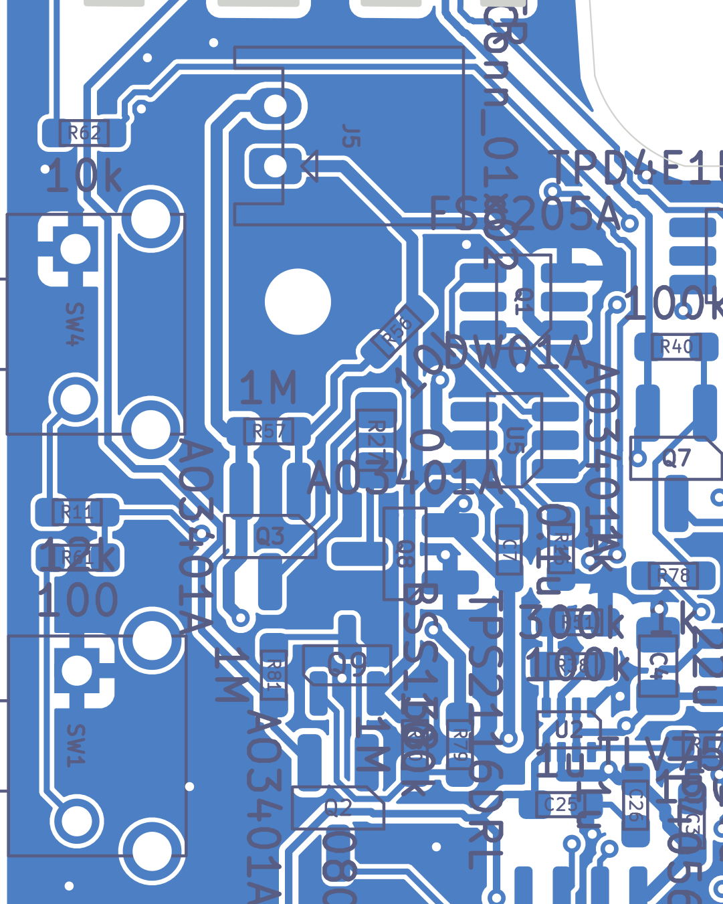
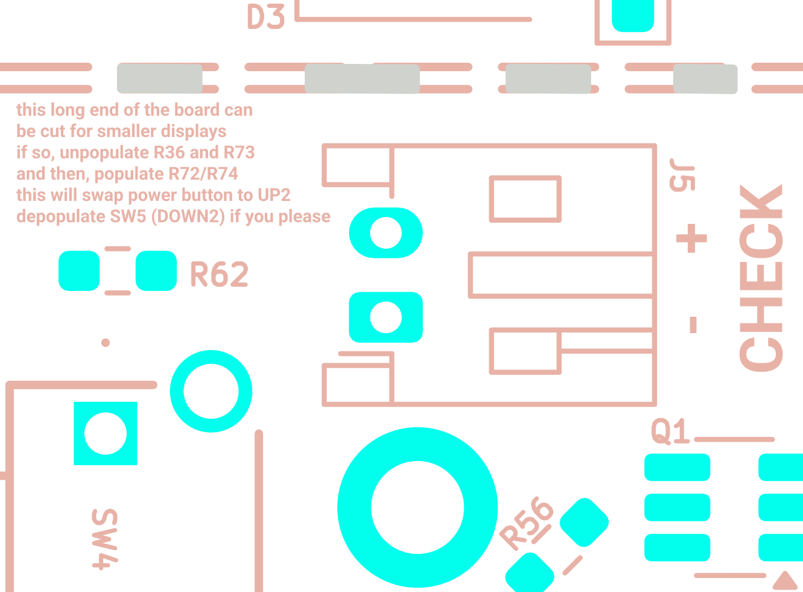

# Li-ion charger, battery protection, reverse-polarity protection, battery connector and battery monitor

*Final review 2026-09-19 — reviewer key `battery`, finding IDs `BAT-nn`.
Everything below was derived from the evidence pack (netlist-derived connectivity, board extract, plots) and from
manufacturer datasheets. Nothing here is taken from earlier audits or from the project's prose docs, except in the
explicitly-marked "Documentation cross-check" section at the end, which was written after the findings.*

> **Verification pass (2026-09-20, reviewer key `battery_verify`).** Every MEDIUM and DOC finding below was re-derived
> from the netlist, the datasheets and the board file by a second, adversarial reviewer. Net result: **no BLOCKER or
> HIGH**; one finding refuted (BAT-09 — the TP4056 thermal pad *is* solid-connected), four MEDIUMs re-graded to LOW
> (BAT-01, -04, -05, -06), several numbers and one fault mechanism corrected (BAT-03/04: a wrongly-enabled charger does
> not "reverse-charge" the cell — it turns Q8 on and lets the reversed cell discharge through the DW01A), and four
> findings added (`BAT-V01`…`BAT-V04`). Text changed by the verifier is marked **[V]**; the full table is in the
> "Verification log" at the end.

---

## What this part of the board does

The board runs from a single 3.7 V lithium-polymer (LiPo) cell **or** from USB. This section covers everything between
the battery plug and the rest of the board:

1. **Charger (U11, TP4056).** When USB power is present, this chip charges the cell. It is a *linear* charger: it burns
   the difference between 5 V USB and the cell voltage as heat in its own package. The charge current is set by one
   resistor (R6).
2. **Cell protection (U5 DW01A + Q1 FS8205A).** This is the standard "battery protection board" circuit found inside
   commercial LiPo packs. The DW01A watches the cell voltage and the current, and switches two back-to-back MOSFETs
   (inside Q1) that sit in the cell's **negative** lead. It disconnects the cell if it is over-charged (> ~4.3 V),
   over-discharged (< ~2.4 V), or if too much current is drawn.
3. **Reverse-polarity protection (Q3 + R27 + Q8).** Two P-channel MOSFETs, **drain-to-drain** through a 0 Ω jumper
   (Q3 source on `B+`, Q8 source on `P+`), in the cell's **positive** lead. A "MOSFET body diode" is the parasitic
   diode every MOSFET has between drain and source; because the two FETs face opposite ways, their body diodes cannot
   both conduct. **[V]** Be clear about which FET does what: with a reversed pack the fault current wants to flow
   `P+ → B+`. Only **Q8** can block that direction (and only while `P+` is within ~0.5–1 V of `GND`, because its gate
   is on `GND`). **Q3's body diode points *along* the fault current, so Q3 adds no reverse-polarity blocking at all**
   — see BAT-V02. The schematic note says Q8 was added following an EEVblog thread about DW01 start-up problems.
4. **Battery-detect / charger-enable gate (Q9, Q2, R79–R82).** A small logic circuit that only enables the TP4056 when a
   cell is present **and the right way round**. This is what stops the charger from trying to push current into a
   reversed cell.
5. **Battery monitor (R12/R10/C8).** A 2:1 resistive divider so the ESP32-S3 can measure the battery voltage on an ADC
   pin.
6. **Connector (J5).** A 2-pin JST-PH header for the cell.

**Net naming used in this design** (worked out from `evidence/sch/connectivity_by_net.txt`, not assumed):

| Net | What it physically is |
|---|---|
| `B+` | Raw cell **positive**, straight off J5 pin 2. Only 4 nodes: J5.2, Q3 source, R57, R79. |
| `B-` | Raw cell **negative**, straight off J5 pin 1. This is the "BATT−" node of a protection board: it is the DW01A's *local ground*, and it is **not** the board's ground. 7 nodes: J5.1, Q1 pin 1 (S1), U5 GND, C7, R56, R80, Q9 source. |
| `P+` | "Pack positive" — the battery rail on the **system** side of the reverse-polarity FETs. This is what the TP4056 BAT pin, the TPS2116 power mux VIN2, the DW01A VCC, the monitor divider and header J6 pin 12 all see. |
| *(P−)* | **There is no net called `P−`.** The pack-negative node is the board's `GND` net: Q1 pin 3 (S2) is tied straight to `GND`. So `GND` is "P−". |

So the current path from the cell to the board is:

```
cell +  ──J5.2──> B+ ──Q3(S→D)──> R27 (0R) ──Q8(D→S)──> P+ ──> TPS2116 / TP4056 / monitor / J6.12
cell −  ──J5.1──> B- ──Q1 FET1(S1)──> (common drain) ──Q1 FET2(S2)──> GND
```

---

## Circuit walk-through

| Ref | Part / value | Role | Checked against datasheet? |
|---|---|---|---|
| U11 | TP4056-42-ESOP8 (TOPPOWER), SOIC-8-1EP + 6 thermal vias | 1-cell linear charger, 4.2 V float | **Yes** — TOPPOWER TP4056 REV_2.4 |
| U11.1 TEMP | → GND | Cell-temperature sense **disabled** | Yes — "When TEMP is grounded, the battery temperature sense function is disabled" (p.7 Pin Functions / p.8 status table) |
| U11.2 PROG | → R6 4.7 k → GND | Sets charge current ≈ 235–265 mA | Yes — `IBAT = (VPROG/RPROG)·1100`, and the RPROG table (5 k→250 mA, 4 k→300 mA) |
| U11.4 VCC | → `USB_VBUS`, C2 10 µF | 5 V input from USB (after polyfuse F1) | Yes — abs max VCC −0.3…8 V |
| U11.5 BAT | → `P+`, C3 10 µF + C26 1 µF | Charge output. Note this is on the **system** side of Q3/Q8 | Yes — abs max BAT −0.3…7 V (datasheet prints "0.7 V", evidently an OCR/typo) |
| U11.6/7 STDBY/CHRG | → R71 22 k / R67 56 k into `USB_STAT` (pulled up by R70 100 k to 3V3) | Open-drain status, resistor-encoded into one ESP32 ADC pin | Yes — both are open-drain; datasheet says unused status pins go to GND, they are used here |
| U11.8 CE | ← Q2 drain, R82 1 M to GND | Charger enable. Low = shutdown (< 2 µA battery drain) | Yes — abs max CE −0.3…**10 V** independent of VCC |
| U11.9 EPAD | → GND, 6 × 0.2 mm thermal vias | Heat path | **[V]** Yes — the EPAD pads carry a pad-level *solid* zone-connection override, see BAT-09 (refuted) |
| R6 | 4.7 k 0603 (RC0603FR-074K7L) | Charge-current program resistor | Yes |
| C2 / C3 | 10 µF 0603 | VCC and BAT bulk caps | Yes — datasheet's typical app circuit uses 10 µF on both |
| D2 + R59 | red LED 1206 (LTST-C150KRKT) + 2 k | **USB-present** indicator (anode on `USB_VBUS`, not on CHRG) | Yes (current calc below) |
| U5 | DW01A, SOT-23-6. **[V]** Schematic says Mfr = Fortune, but the LCSC code C351410 is **PUOLOP**'s DW01A (BAT-V03) | Cell protection IC | **Yes** — Fortune DW01A Rev 1.2 (DW01A-DS-12_EN); the PUOLOP/LCSC datasheet is a near-copy (same R1 = 100 Ω, R2 = 1 kΩ, 150 mV, 4.3 V) |
| U5.5 VCC | → `P+` (**not** `B+`) | Cell-voltage sense + IC supply | Yes — datasheet app circuit takes VCC from BATT+ **through R1 = 100 Ω**; see BAT-02 |
| U5.6 GND | → `B-` | IC ground = cell negative | Yes |
| U5.2 CS | ← R16 1 k ← GND | Current sense: measures V(GND) − V(B−), i.e. the drop across Q1 | Yes — datasheet R2 = 1 k, "for latch-up protection when charger is connected under overdischarge condition and overstress protection at reverse connecting of a charger" (§12) |
| U5.1/3 OD/OC | → Q1 pin 6 / pin 4 | Discharge-FET gate / charge-FET gate | **Yes** — see the pinout check below |
| U5.4 TD | no-connect | Test/delay pin, correctly left open | Yes |
| C7 | 0.1 µF 0603, `P+` → `B-` | DW01A supply bypass (= datasheet C1) | Yes |
| R16 | 1 k 0603 | = datasheet R2 | Yes |
| Q1 | FS8205A (TECH PUBLIC, LCSC C2830320 — **[V]** the schematic's Manufacturer field says EVVOSEMI, BAT-V03), SOT-23-6 | Dual N-ch, common drain, 20 V / 6 A, Rds(on) 19.5 typ / 25 max mΩ @ Vgs 4.5 V, 25 typ / 31.5 max mΩ @ 2.5 V | **Yes** — TECH PUBLIC FS8205A p.1–2 |
| Q3 | AO3401A P-ch, S = `B+` | Labelled reverse-polarity FET, cell side. **[V]** On whenever a correct cell is fitted; contributes nothing with a reversed cell (BAT-V02) | Yes — AOS AO3401A Rev 3.1 |
| Q8 | AO3401A P-ch, S = `P+`, **G = GND** | Reverse-polarity FET, system side — **[V]** the only element that blocks a reversed cell | Yes |
| R27 | 0 Ω **0805** | Link between the two drains; also a convenient current-break point | Yes (0805 jumper, 2 A class) |
| R56 / R57 | 10 k `B-`→Q3.G / 1 M `B+`→Q3.G | Q3 gate drive, referenced to the **cell**, so Q3 is on whenever a correctly-oriented cell is fitted | Yes (Vgs calc below) |
| Q9 | BSS138 N-ch, S = `B-`, D = `/DET_NODE` | Battery-present + correct-polarity detector | Yes — onsemi BSS138, Vgs(th) 0.8–1.5 V |
| R79 / R80 | 100 k `B+`→Q9.G / 1 M Q9.G→`B-` | Q9 gate divider across the cell (0.909 × Vcell) | Yes |
| R81 | 1 M `/DET_NODE` → 3V3 | Pull-up: no cell ⇒ DET_NODE high ⇒ charger off | Yes |
| Q2 | AO3401A P-ch, S = 3V3, G = `/DET_NODE`, D = `CE` | Pulls CE high only when a correct cell is detected | Yes |
| R82 | 1 M `CE` → GND | Default-off pull-down for CE | Yes — see BAT-04 |
| R12 / R10 | 1 M `P+`→`BAT_MONIT` / 1 M →GND | 2:1 battery-voltage divider | n/a (calc below) |
| C8 | 1 µF `BAT_MONIT` → GND | ADC reservoir / filter | n/a |
| J5 | JST S2B-PH-K-S(LF)(SN), 2-pin PH horizontal, THT | Battery connector. **Pin 1 = `B-`, pin 2 = `B+`** | Yes (JST MPN matches footprint) |

### FS8205A pinout check (this one is worth spelling out)

The protection FET pair is the part most likely to be wired wrong, because the "8205A" exists in both TSSOP-8 (Fortune's
own FS8205A datasheet is the TSSOP-8 version) and SOT-23-6. The part actually specified here is LCSC **C2830320**,
TECH PUBLIC FS8205A in **SOT-23-6**, and that datasheet's "Package and Pin Configuration" drawing gives:

| Pin | 1 | 2 | 3 | 4 | 5 | 6 |
|---|---|---|---|---|---|---|
| TECH PUBLIC FS8205A SOT-23-6 | S1 | D1/D2 | S2 | G2 | D1/D2 | G1 |
| This design (Q1) | `B-` | NC | `GND` | OC | NC | OD |

That is exactly right: **OD** (discharge control) drives **G1**, whose source **S1** is on the cell side (`B-`);
**OC** (charge control) drives **G2**, whose source **S2** is on the system side (`GND`). The two drains are internally
common and correctly left unconnected. The KiCad footprint pad geometry confirms standard SOT-23-6 numbering
(pads 1/2/3 at x = 85.25 mm, pads 6/5/4 opposite at x = 87.95 mm). **No error here.**

The direction each body diode allows also checks out:
* Discharge current flows GND → B−; it is blocked by FET1's body diode, so it needs **OD** on. ✔
* Charge current flows B− → GND; it is blocked by FET2's body diode, so it needs **OC** on, and it can flow through
  FET1's body diode when the cell is in over-discharge lock-out. ✔ (This is why a flat cell can still be recharged.)

---

## Where it is on the board & layout notes

Everything in this section is on the **BOTTOM** side (as is 175 of 183 footprints). The battery cluster sits in a
compact group around x = 84–97 mm, y = 63–98 mm (board outline bbox origin 44.21, 36.97, size 60.05 × 111.30 mm):

| Ref | x, y (mm) | Note |
|---|---|---|
| J5 | 94.85, 67.5 | pins at x = 94.85; housing/courtyard spans x 88.1 → 96.7 mm |
| Q1 FS8205A | 86.6, 72.0 | ~9 mm of `B-` trace from J5 |
| U5 DW01A | 86.9, 76.6 | right next to Q1 — good |
| R16 (CS) | 85.36, 80.2 | |
| C7 | 87.08, 80.24 | DW01A bypass, ~3 mm from U5 |
| Q3 | 95.02, 79.80 | |
| R27 (0 Ω 0805) | 91.5, 76.6 | |
| Q8 | 90.54, 80.37 | |
| Q9 / R79 / R80 | 92.46, 84.07 / 88.71, 86.71 / 90.21, 86.71 | detect network |
| Q2 / R81 / R82 | 92.76, 88.81 / 94.9, 84.4 / 88.4, 93.9 | CE gate |
| U11 TP4056 | 84.7, 94.2 | EPAD 2.41 × 3.3 mm + 6 vias (0.5 mm pad / 0.2 mm drill) |
| C2 / C3 / R6 | 81.1, 94.6 / 81.0, 89.3 / 89.24, 97.08 | |
| R12 / R10 / C8 | 71.24, 89.42 / 69.74, 89.42 / (C8 near) | monitor divider is ~14 mm away from `P+`, near the MCU |
| D2 / R59 | 102.8, 118.3 / 103.0, 114.2 | USB LED, far away near the USB end |

**Placement is good.** U5 and Q1 are adjacent and both are close to J5, which keeps the sense loop short. The reverse-
polarity pair Q3/R27/Q8 forms a tidy chain. The detect/CE logic is stacked above it.

**Routing (from `evidence/pcb/net_routing_stats.csv` and the raw track geometry):**

| Net | Width | Length | Vias | Comment |
|---|---|---|---|---|
| `B+` | 0.40 mm | 29.4 mm | 2 | good |
| `B-` | 0.40 mm | 35.4 mm | 0 | all on B.Cu, good |
| `P+` | 0.40 mm (0.78 mm of it at 0.25) | 85.0 mm | 6 | good |
| `Net-(Q3-D)` | **0.25 mm** | 7.27 mm | 0 | in the main battery path — see BAT-07 |
| `Net-(Q8-D)` | **0.25 mm** | 3.00 mm | 0 | in the main battery path — see BAT-07 |
| `CE`, `/DET_NODE`, `BAT_MONIT`, OD/OC/CS | 0.2–0.25 mm | short | 0 | fine, signal-level |

The `B-` run is `J5.1 (94.85,67.5) → (92.6,67.5) → (90.83,69.4) → (87.9,69.4) → (86.44,70.86) → (86.44,72.54) →
Q1.1 (85.25,72.95)`, ≈ 12.9 mm of 0.4 mm track. The DW01A's GND pin taps this run at **(90.83, 69.40)**, i.e. ~4.9 mm
from the connector and ~8.0 mm from Q1's S1 pad (see BAT-08).



*Bottom copper (fab view, mirrored — i.e. as seen looking at the bottom face), board x 80–104 mm, y 62–92 mm. J5's two
through-holes are top-centre; the `B-` trace runs left and down to Q1 (FS8205A); U5 (DW01A) sits immediately below Q1;
the `B+ → Q3 → R27 → Q8 → P+` chain runs down the right-hand side. The GND pour is continuous under the whole cluster.*

Silkscreen at J5 (bottom silk):



*Bottom silkscreen, board x 85–104 mm, y 60–74 mm (mirrored view). The marks `J5`, `+`, `−`, `CHECK` are present; the
`+` sits at y ≈ 65.6 mm (= pad 2 = `B+`) and the `−` at y ≈ 67.7 mm (= pad 1 = `B-`).* **The polarity marking is
correct.** It is at board x ≈ 87.7 mm — the end of the connector body furthest from the pin row (BAT-11). **[V]** That
end is the *mating face*: the KiCad footprint's body extends 6.75 mm from the pin row towards the opening, so the
opening faces −x and the `+`/`−` marks sit exactly where the red/black wires leave the plug — the most useful place
for them. Seen looking into the opening with the board bottom-side-up, `−` (circuit 1) is on the left and `+` on the right.

---

## Calculations

**1. Charge current.** `IBAT = (VPROG / RPROG) × 1100`, with VPROG ≈ 1.0 V:
`IBAT = (1.0 / 4700) × 1100 = 0.234 A`. The datasheet's own RPROG table brackets it
(5 kΩ → 250 mA, 4 kΩ → 300 mA ⇒ 4.7 kΩ ≈ 265 mA). **Charge current ≈ 235–265 mA.**
For a 1000–2000 mAh pouch cell that is 0.12–0.25 C — conservative and safe. Even a small 400 mAh cell is charged at
only ~0.6 C, inside the 1 C rating of essentially every LiPo. ✔

**2. TP4056 dissipation.** `P = (VCC − VBAT) × ICHG`. Worst case is at the trickle→CC transition, VBAT = 2.9 V:
* at VCC = 5.00 V: `P = 2.10 × 0.25 = 0.53 W`
* at VCC = 5.25 V (USB high limit): `P = 2.35 × 0.25 = 0.59 W`

Junction temperature rise, using the datasheet's own worked-example figure of θJA = 125 °C/W (a deliberately
pessimistic "bad board" number; a well-soldered ESOP-8 with a via field is normally 50–70 °C/W):
* 125 °C/W → ΔT = 74 °C → Tj ≈ 99 °C at 25 °C ambient, ≈ 114 °C at 40 °C inside an enclosure
* 60 °C/W → ΔT = 35 °C → Tj ≈ 60 °C / 75 °C

**[V]** Both are below the ≈145 °C junction temperature at which this datasheet says the TP4056 starts to fold back
its charge current (TLIM = 145 °C typ, p.5 and p.8; the same figure is its maximum junction temperature). **The
thermal design is comfortable at this charge current** — which is the main reason 4.7 kΩ (rather than 1.2 kΩ/1 A) is
the right choice on a 2-layer board. ✔

**3. Reverse-polarity FET enhancement (normal polarity, worst case = flat cell at 3.0 V).**
* Q3: gate sits on the R57 (1 M, to `B+`) / R56 (10 k, to `B-`) divider ⇒
  `Vg = V(B-) + 3.0 × 10k/1010k = V(B-) + 0.030 V`, and `Vs = V(B+) = V(B-) + 3.0 V`
  ⇒ **Vgs = −2.97 V**.
* Q8: `Vg = 0` (system GND), `Vs = P+ ≈ 3.0 V` ⇒ **Vgs = −3.00 V**.

AO3401A: Vgs(th) = −0.5 … −1.3 V, and Rds(on) ≤ 85 mΩ at Vgs = −2.5 V, ≤ 60 mΩ at −4.5 V. So both FETs are fully
enhanced even on a flat cell, with Rds(on) ≈ 60–85 mΩ each; at a full 4.2 V cell, Vgs = −4.16 V and Rds ≈ 50–60 mΩ. ✔
Abs max Vgs = ±12 V — never approached. ✔

**4. Loss in the battery path at peak current.** Two things draw from the battery rail (`LDO_IN`, 8 nodes):
the TLV75533 LDO (**500 mA** rated — it feeds the ESP32-S3, e-paper, SD and everything logic) **and**, directly,
`U10` TPS923610 + `L2` — the frontlight LED boost converter, which does **not** go through the LDO. A 20 mA / ~20 V
LED string at ~85 % efficiency pulls roughly 130 mA from a 3.7 V cell. So the realistic peak is
**≈ 0.7–0.9 A**, not 0.5 A. Path resistance:
`Rds(Q3) + R27 + Rds(Q8) + trace ≈ 0.085 + ~0.005 + 0.085 + ~0.04 = 0.215 Ω` worst case.
* Drop at 0.8 A = 0.8 × 0.215 = **0.17 V**
* Total loss = 0.8² × 0.215 = **0.138 W**, i.e. ~0.055 W in each SOT-23 ⇒ ΔTj ≈ 5.5 °C at 100 °C/W. ✔

Plus the FS8205A in the negative leg: 2 × ~22 mΩ = 44 mΩ ⇒ 35 mV, 0.028 W. ✔

Trace headroom at 0.8 A (IPC-2221 external, 1 oz): 0.40 mm → ΔT ≈ 3.8 °C; 0.25 mm → ΔT ≈ 8.1 °C. Both fine; see
BAT-07. Note the same 0.17 V also appears as an under-read on the battery monitor when the frontlight and the radio
are both active — sample with them quiet.

**5. DW01A over-current trip.** The DW01A trips at `VOIP = 120/150/180 mV` (min/typ/max) measured across the two
FS8205A channels, so `IT = VOIP / (2 × Rds(on))` (datasheet §12 gives exactly this equation).
* nominal: `0.150 / (2 × 0.022) = 3.4 A`
* worst-case window: `0.120/(2×0.030) = 2.0 A` … `0.180/(2×0.0195) = 4.6 A`

**⇒ the over-current protection trips somewhere between about 2 and 4.6 A** (1.9 A with worst-case Rds(on) — **[V]**)**.** The second (short-circuit) threshold
VOI2 (VSIP) = 1.00 / 1.35 / 1.70 V min/typ/max corresponds to roughly 16–44 A (≈31 A typical). See BAT-06.
**[V]** Using the datasheet's *maximum* Rds(on) at low gate drive (31.5 mΩ @ Vgs 2.5 V) the bottom of the window is
`0.120/(2×0.0315) = 1.9 A`, and the ~10 mΩ of trace inside the sense loop (BAT-08) lowers it a little further.

**6. Battery monitor.**
* Divider = `R10/(R12+R10) = 1M/2M = 0.500`. Full cell 4.20 V → **2.10 V** at IO8; 3.00 V → 1.50 V; over-charge trip
  4.35 V → 2.18 V. ESP32-S3 with 12 dB ADC attenuation reads up to ~3.1 V, so the whole range fits with headroom. ✔
* ESP32-S3 abs max on an I/O pin is VDD+0.3 = 3.6 V. Even a shorted-through TP4056 (BAT pulled to VCC = 5 V) only gives
  2.5 V on the pin. **The MCU cannot be damaged through this divider.** ✔
* Source impedance = `1M ‖ 1M = 500 kΩ`. Charge stolen by the SAR sampling capacitor (~10 pF) is
  `q = 10 pF × 2.1 V = 21 pC`, which on C8 = 1 µF is a **21 µV** droop — the cap completely hides the high source
  impedance from the sampling event. ✔
* Settling time: `τ = 500 kΩ × 1 µF = 0.50 s` ⇒ the reading follows the battery with a ~1.5–2.5 s lag. Fine for a fuel
  gauge, but do not expect it to show a Wi-Fi-burst sag. (Informational — no finding ID.)
* **[V]** Pin leakage: the ESP32-S3 datasheet allows up to ±50 nA input leakage on a GPIO; into the 500 kΩ source
  impedance that is up to 25 mV at the pin = **≤ 50 mV (≈1.2 %) battery-voltage error**. Acceptable; calibrate it out
  if a precise fuel gauge is wanted.
* Continuous drain: `4.2 V / 2 MΩ = 2.1 µA`. ✔
* **GPIO8 on the ESP32-S3 is ADC1_CH7** (ADC1 = GPIO1…GPIO10). Using ADC1 rather than ADC2 is the right call — ADC2 is
  unusable while Wi-Fi is on. ✔ GPIO8 is not a strapping pin. ✔

**7. Standing (quiescent) current with a cell fitted and no USB.** This is what drains the pack while the reader
sleeps:

| Path | Current |
|---|---|
| R56 + R57 (Q3 gate divider, across the cell) | 4.2 V / 1.01 MΩ = 4.2 µA |
| R79 + R80 (Q9 gate divider, across the cell) | 4.2 V / 1.10 MΩ = 3.8 µA |
| R12 + R10 (monitor divider) | 4.2 V / 2.00 MΩ = 2.1 µA |
| R81 (3V3 → DET_NODE, held low by Q9) | 3.3 V / 1 MΩ = 3.3 µA |
| R82 (3V3 → Q2 → CE → GND) | 3.3 V / 1 MΩ = 3.3 µA |
| DW01A IDD | 3.0–6.0 µA |
| TP4056 battery drain with VCC absent | < 2 µA |
| **Total housekeeping** | **≈ 22–25 µA** |

That is ~0.6 mAh/day, ~18 mAh/month. On a 1500 mAh cell that is about 1 %/month of self-drain from this circuitry.
**Good.** ✔ (Note 6.6 µA of it — R81 and R82 — comes from the 3V3 rail, so it only exists while 3V3 is up; U3's EN is
tied to its own input, so 3V3 is *always* up whenever the board has any power.)

**8. After the DW01A trips over-discharge**, the FS8205A disconnects `B-` from `GND`, which removes everything on the
system side of the board from the cell. What is left across the cell is R56+R57, R79+R80, U5's own IOD (1.5–3 µA) and
FET leakage — call it **~8 µA at 2.4 V**. A 1000 mAh cell would take ~14 years to go from 2.4 V to zero. **The
protection really does protect long-term storage.** ✔

**9. D2 / R59 indicator.** LTST-C150KRKT red, Vf ≈ 1.75 V at low current:
`I = (5.0 − 1.75) / 2000 = 1.6 mA`. Dim but clearly visible indoors from a modern 1206 red LED. The LED is wired
**anode to `USB_VBUS`**, so it is a *USB-present* light, **not** a charge-status light. Charge status is encoded
instead by R67 (56 k from `CHRG`) + R71 (22 k from `STDBY`) + R17 (150 k from the TPS2116 `ST`) against R70 (100 k
pull-up to 3V3) into GPIO9, i.e. the MCU reads it as an analogue level. ✔

---

## Reverse-battery walk-through

This was done node by node, with a 3.7 V cell plugged in backwards (so `B+` carries the cell's **negative** terminal and
`B-` carries the cell's **positive** terminal, i.e. `V(B-) − V(B+) = +3.7 V`).

| Part | What it sees | Verdict |
|---|---|---|
| **Q3** (AO3401A, S = `B+`) | Gate divider now puts Vg ≈ V(`B-`) − 0.037 V, source at V(`B+`) ⇒ **Vgs = +3.66 V** (P-channel ⇒ hard **off**). Abs max ±12 V. | ✔ off, undamaged |
| **Q3 body diode** | anode = drain, cathode = `B+`. It is forward-biased **into** the reversed cell — it does **not** block. What blocks is Q8, **and only Q8 [V]**. | see BAT-03 / BAT-V02 |
| **Q8** (S = `P+`, G = `GND`) | With the charger disabled, `P+` is undriven, Vgs ≈ 0 ⇒ off; its body diode (drain → `P+`) is reverse-biased because Q3's diode has pulled the drain node *below* ground. | ✔ blocks |
| **Q9** (BSS138) | R79/R80 now give **Vgs = −3.36 V** ⇒ off (abs max ±20 V). Its body diode (source `B-` → drain `/DET_NODE`) may pass a few µA into the 3V3 rail through R81 — harmless. | ✔ off |
| **Q2** (AO3401A) | `/DET_NODE` is pulled to 3V3 by R81 ⇒ Vgs ≈ 0 ⇒ off. | ✔ off |
| **CE** | R82 (1 M) pulls CE to 0 V ⇒ **TP4056 is in shutdown and cannot charge the reversed cell**. | ✔ — this is the load-bearing protection; see BAT-04 |
| **U11 TP4056** | VCC = 5 V from USB ✔; BAT = `P+` which never goes below 0 V (abs max −0.3 V) ✔; CE = 0 V ✔ (abs max −0.3…10 V, so CE at 3.3 V with VCC = 0 V during battery-only running is also legal). | ✔ safe |
| **Monitor divider R12/R10 → IO8** | R12 is fed from **`P+`**, not from `B+`. `P+` stays at/above 0 V, so `BAT_MONIT` can never go negative. **The ESP32 pin is safe.** Had the divider been taken from `B+` it would have driven −1.85 V into GPIO8 and probably destroyed it. | ✔ — a genuinely good design decision |
| **Q1 FS8205A** | Vds and Vgs both stay within ±3.7 V (abs max 20 V / ±10 V). Its *state* is indeterminate because U5 is mis-powered, but it cannot be damaged. | ✔ undamaged |
| **C7, R56/R57, R79/R80** | Ceramic cap sees −3.7 V (non-polar, fine); resistors see the cell. | ✔ |
| **U5 DW01A** | **Problem.** Its GND pin is on the cell (`B-` = reversed cell **positive**) while its VCC pin is on the system side (`P+`). VCC therefore sits **below** GND. DW01A abs max is `VCC = GND−0.3 V … GND+10 V`. **[V]** The reverse current through U5 is whatever Q8 lets through: leakage if `P+` is fully discharged relative to `GND`, but mA-class for seconds if C3/C26 still hold more than ~0.5–1 V (their only bleed is R12+R10 = 2 MΩ, τ ≈ 22 s). | ✘ — **BAT-03** |

**Summary of the reverse case:** the board and the MCU survive; the charger is correctly inhibited; the only part
outside its absolute maximum ratings is the DW01A itself, and the current available to it is leakage-level so damage is
unlikely but not guaranteed. The one structural weakness is that Q3's body diode does *not* block current flowing from
`P+` into a reversed cell — the CE gate is the only thing stopping it.

**[V] Verifier's refinement of the reverse case.** I re-walked it node by node and agree with the table, with three
sharpenings. (1) With no USB the whole system (`GND`, `P+`, 3V3) floats to within a diode drop of the reversed cell's
positive terminal (through U5's substrate diode and Q9's body diode + R81), so `V(P+) − V(GND)` ≈ 0 and Q8 stays off —
provided C3/C26 are discharged. (2) "The CE gate is the only thing stopping it" is better stated as: **Q8 being off
is the protection, and Q8 is off only while nothing lifts `P+` more than ~0.5–1 V above `GND`.** Three things can
lift it: the TP4056 (hence the CE gate), an add-on board driving J6 pin 12, and residual charge on C3/C26 after a
correctly-fitted pack has just been removed. (3) When Q8 does turn on, the current does not go "backwards into the
cell" as a charge current; the reversed cell *discharges* around the loop U5-substrate-diode → `P+` → Q8 → Q3 body
diode, a loop that contains no resistor and does not pass through Q1. That is why the missing 100 Ω (BAT-02) is the
most valuable single fix in this block.

---

## Findings

| ID | Severity | Finding | Evidence | Recommendation |
|---|---|---|---|---|
| BAT-01 | ~~MEDIUM~~ **LOW [V]** | No capacitor from DW01A CS to its GND pin (first-connection / inrush robustness) | **[V] corrected numbers:** only C3 + C26 = 11 µF sit directly on `P+` (the ~27 µF on `LDO_IN` is behind the TPS2116's soft-start), and the inrush loop contains Q3 + Q8 (≈0.10–0.17 Ω), Q1 (≈0.044 Ω), ~0.05 Ω of trace and the cell's ESR — ≥ 0.25–0.4 Ω in total, not 50 mΩ. Peak ≈ 10–15 A for ≈ 3–4 µs ⇒ CS peaks at ≈ 0.5–0.8 V, **below** VSIP(min) = 1.0 V (TOI2 = 5 µs typ / 50 µs max); VOIP needs 10 ms. A latch-off from inrush is therefore unlikely, and a 0.5 A Wi-Fi burst is only ≈ 27 mV on CS, so there is no false-trip risk either | Still cheap insurance (the thread linked from the schematic lists it as a secondary fix): 1–10 nF from CS to `B-`. **No respin needed to try it** — R16 pad 2 (CS, 85.36 / 79.29) and C7 pad 2 (`B-`, 87.08 / 79.38) are 1.7 mm centre-to-centre, so an 0603 cap bridges them as a bodge if the prototype ever shows a start-up problem. |
| BAT-02 | MEDIUM | DW01A `R1` (100 Ω between the cell and VCC) is not fitted — only `C1` (C7) is | DW01A Rev 1.2 §8 Typical Application Circuit shows R1 = 100 Ω, C1 = 0.1 µF; §12 "To suppress the ripple and disturbance from charger, connecting R1 and C1 to VCC is recommended" | Put a 100 Ω 0603 in series between `P+` and U5 pin 5, with C7 on the U5 side. Costs 0.6 mV of sense error at 6 µA. Also limits reverse-fault current into U5 (helps BAT-03). |
| BAT-03 | MEDIUM | With a reversed pack the DW01A's VCC sits below its GND, outside absolute maximums — and nothing but Q8 limits the current | DW01A abs max `VCC = GND−0.3 V to GND+10 V` (Fortune Rev 1.2 §9). Reversed, U5's internal GND→VCC diode closes the loop *cell+ → `B-` → U5 → `P+` → Q8 → R27 → Q3 body diode → cell−* (net ≈ 3.7 − 0.6 − 0.6 = 2.5 V). **[V]** The only current limit in that loop is Q8's channel, whose gate drive is `V(P+) − V(GND)`. With `P+` fully discharged that is leakage-level, as originally stated. But the loop does not pass through C3, so any residual charge on C3/C26 (their only bleed is R12+R10 = 2 MΩ, τ ≈ 22 s) keeps Q8 partly on, and U5 then carries mA-class current for seconds — e.g. a wrong-polarity pack plugged in shortly after a correct one was removed. If U5 ever failed short, this loop bypasses Q1 entirely | Fit BAT-02's 100 Ω: it bounds the U5 fault current to ≈ 25–30 mA in every scenario, which is exactly what the DW01A reference design relies on for reverse connection. A Schottky clamp across U5 is optional on top. Confidence medium (analysis only — no manufacturer characterises this condition). |
| BAT-04 | ~~MEDIUM~~ **LOW [V]** | The CE gate's default-off is a single 1 MΩ (R82) with no capacitor, and `P+` is exposed on J6 pin 12 | Netlist: `CE` = Q2.D, R82.2, U11.8 only. AO3401A IDSS ≤ 1 µA @25 °C / 5 µA @55 °C *at −30 V* (realistically nA at −3.3 V); TP4056 CE threshold is not published. **[V] corrected mechanism:** a wrongly-enabled TP4056 would **not** push 250 mA "backwards into the cell" — charger current would enter the reversed cell's − terminal (the *discharge* direction) and its return path through Q1 is normally open. What actually happens is that the charger lifts `P+`, Q8 turns on, and the reversed cell discharges through U5's substrate diode and Q3's body diode (BAT-03): U5 is the casualty. **[V] new:** at USB plug-in `/DET_NODE` lags the 3V3 ramp (R81 × Cgs(Q2) ≈ 1 MΩ × 0.65 nF ≈ 0.7 ms), leaving Q2 with a transient Vgs ≈ −0.3…−0.5 V; marginal only for a minimum-Vth (−0.5 V) part | Add 10–100 nF from CE to GND (kills the ramp glitch) and, if the sleep budget allows, drop R82 to 330–470 kΩ (+4–7 µA). **[V]** Do *not* go to 100 kΩ without accepting ≈ +30 µA of sleep current — CE sits at 3.3 V whenever a cell is detected, and HARDWARE.md's whole sleep target is ~75 µA. Document J6 pin 12 as an output-only rail. |
| BAT-05 | ~~MEDIUM~~ **LOW [V]** | No cell-temperature protection: TP4056 TEMP is tied to GND, and J5 is a 2-pin connector with no NTC | `U11.1 TEMP -> GND`; datasheet: "When TEMP is grounded, the battery temperature sense function is disabled"; J5 = `Conn_01x02` | For a prototype this matches every TP4056 module ever sold and the 0.25 C rate keeps it tame — but write the limitation into the docs, use a cell that has its **own** PCM/NTC, and do not charge below 0 °C or above 45 °C ambient. A respin could bring the NTC out on a 3-pin JST and use the TEMP divider from §"Battery temperature monitor". **[V]** Re-graded LOW: it is already documented and knowingly accepted in HARDWARE.md §3.2, the charge rate is ≤ 0.25 A, and the DW01A is a second over-charge barrier. |
| BAT-06 | ~~MEDIUM~~ **LOW [V]** | DW01A/FS8205A over-current trip is ≈ 1.9–4.6 A — far above what a small cell can safely deliver | `IT = VOIP/(2·Rds)`, VOIP 120/150/180 mV, FS8205A Rds 19.5 typ / 25 max mΩ @4.5 V, 25 typ / 31.5 max mΩ @2.5 V (**[V]** max values added ⇒ lower bound 1.9 A) | **[V]** Informational, no board change (every commercial DW01A pack has the same ~3 A trip). Inherent to DW01A + 8205A; the fix is cell choice. Use a ≥ 1000 mAh cell (or one with its own PCM). If you want a real current limit, that is a different IC, not a different resistor. |
| BAT-07 | LOW | The two links either side of R27 — `Net-(Q3-D)` and `Net-(Q8-D)` — are 0.25 mm while the rest of the battery path is 0.40 mm | `net_routing_stats.csv`: Q3-D 7.27 mm @0.25, Q8-D 3.00 mm @0.25; `B+`/`B-`/`P+` all 0.40 mm. IPC-2221 external, 1 oz: 0.25 mm ≈ 0.87 A at ΔT = 10 °C vs 0.40 mm ≈ 1.23 A | At the realistic ~0.8 A peak (500 mA LDO **plus** the frontlight boost, which taps `LDO_IN` directly) this is an ~8 °C rise — not a functional problem. Widen to 0.40 mm anyway for consistency, especially because **`P+` is exposed on header J6 pin 12** with no current limit. |
| BAT-08 | LOW | The DW01A's GND reference taps the `B-` run ~8 mm *upstream* of Q1's S1 pad, so ~10 mΩ of trace is inside the current-sense loop | Tap at (90.827, 69.400); Q1.1 pad at (85.250, 72.950); 8.0 mm of 0.40 mm track ≈ 9.8 mΩ (1.23 mΩ/mm at 35 µm) | Harmless direction — it makes OCP trip ~20 % *earlier* (≈2.8 A instead of 3.4 A) — but it makes the trip point depend on copper. If convenient, Kelvin the U5 GND tap directly to Q1 pin 1. |
| BAT-09 | ~~LOW~~ **REFUTED [V]** | ~~U11's exposed pad is connected to the GND pour through **thermal relief**, not solid~~ — **refuted by verification:** the zone default is thermal relief, but both EPAD copper pads of U11 (2.41 × 3.3 mm on B.Cu and the 1.9 × 2.9 mm pad on F.Cu) carry a **pad-level zone-connection override = solid** (`pcbnew` `GetLocalZoneConnection()` = 2 = FULL, queried on the scratch copy of the board), and a `both_copper_xray` crop shows the F.Cu pad merged straight into the large GND pour to its right | ~~`board_extract.json` zone 0: `pad_connection = 1`~~ — true for the zone, but the pad override wins. The two `starved_thermal` DRC warnings are on U11 **pin 1** (TEMP, a signal-level ground) and C3 pad 2, not on the EPAD | None needed for U11. (Optional: give C3 pad 2 a second spoke to clear the DRC warning.) |
| BAT-10 | LOW | On battery alone at first connection, the DW01A measures the cell through Q8's body diode and reads it ~0.4 V low | Before the protection FETs close, system GND has no return to `B-`, so Q8's Vgs ≈ 0 and only its body diode conducts ⇒ `V(P+) − V(B-) = Vcell − Vf(µA) ≈ Vcell − 0.4 V`. DW01A VODP (over-discharge protect) = 2.30/2.40/2.50 V | So the board self-starts from battery alone only above ~2.8–2.9 V cell. **[V]** That figure assumes U5 powers up in its *normal* state. If it powers up in the over-discharge state (the classic DW01 first-connection complaint), the datasheet's only release condition is VCC ≥ VODR = 2.9–3.1 V, i.e. a cell above **≈ 3.3–3.5 V** — still fine for any pack that is not flat. In practice that is above the useful cut-off anyway, and plugging in USB always bootstraps it (Q8 goes hard on and the offset vanishes; **[V]** re-walked: Q9 pulls `/DET_NODE` to `B-`, which keeps Q2 on whether `B-` sits at, above or below `GND`, so CE does go high and the charger does start). **Document it**: "if a freshly-connected pack does not power the board, plug USB in once." |
| BAT-11 | LOW | J5's `+` / `−` silkscreen marks are ~7 mm from the pin row, at the far end of the connector body | Silk `+` at (≈87.7, 65.6), `−` at (≈87.7, 67.7); pins at x = 94.85 mm; connector courtyard x 88.1…96.7 mm. See `img/battery_j5_silk.png` | The marking is **correct** and there is a `CHECK` warning next to it — good. **[V]** The marks are at the connector's *mating face* (the opening faces −x), i.e. where the wires leave the plug, which is the most useful place — no action needed. Optionally repeat a small `+` at pad 2 for whoever probes the solder side. Also see the JST-PH convention warning below. |
| BAT-12 | DOC | The schematic note on D2 does not agree with its own arithmetic, and D2 is a USB indicator sitting inside a block titled "Battery Charger" | Note reads "LED lit when plugged in / 2.5mA at 2.0Vf / (5 − 2.0)/0.0015 ≈ 2 kΩ". `(5−2.0)/0.0015 = 2000 Ω` is the 1.5 mA case; actual current with Vf ≈ 1.75 V is 1.6 mA. Netlist: `D2.2 A -> USB_VBUS`, `D2.1 K -> Net-(D2-K) -> R59 -> GND` | Change the note to "≈1.6 mA, USB-present indicator". Consider moving D2/R59 into the USB block, or labelling it `PWR` on the silk, so nobody expects it to blink while charging. |
| BAT-13 | DOC | `HARDWARE.md` §3.7 lists a "No battery fitted (blinks) → ~0.45–0.53 V" state on the `USB_STAT` ladder, but the Fix-4 CE gate makes that state unreachable | With no cell, `/DET_NODE` is pulled to 3V3 by R81, Q2 is off, R82 holds CE at 0 V, and the TP4056 is in shutdown — so `CHRG` and `STDBY` are both high-impedance and `USB_STAT` reads the idle 3.30 V. The blink behaviour the doc describes requires the charger to be *running* into a capacitive BAT node, which Fix 4 specifically prevents | **[V] corrected:** the state is unreachable only from a *cold start* without a cell. It **is** reachable if the cell is unplugged while USB is charging, because the detector self-latches (BAT-V01). So keep the row but annotate it "only after the cell is removed with USB present"; add that with no cell at USB plug-in `USB_STAT` reads idle (3.30 V) and `BAT_MONIT` ≈ 0 V, whereas after a hot-unplug `BAT_MONIT` reads ≈ 4.1–4.2 V (the charger is holding `P+`) and only the blinking ladder reveals that the cell is gone. |
| BAT-14 | DOC | `HARDWARE.md` §3.3 says over-current opens **both** protection FETs | DW01A Rev 1.2 §11: "the overcurrent protection circuit operates and **discharging is inhibited by turning off the discharge control MOSFET**" — only OD opens; OC stays on so the pack can still be charged out of the fault. The doc also merges the two thresholds: VOIP (120/150/180 mV) and the separate short-circuit level VSIP (1.00–1.35 V) have different delays | Correct the row to "over-current → discharge FET only", and split out the short-circuit threshold. |
| BAT-15 | DOC | `HARDWARE.md` §3.3 says only `R56`+`R57` (~4 µA) sit outside the protection FETs; `R79`+`R80` do too | `R79 (100k): B+ → Net-(Q9-G)`, `R80 (1M): B- → Net-(Q9-G)` — both connect directly to the raw cell, so they keep drawing `4.2 V / 1.10 MΩ = 3.8 µA` after the DW01A has cut the low side. Total post-cutoff residual drain is therefore ≈ **8 µA of resistors** plus U5's IOD (1.5–3 µA), not ~4 µA | Update the figure to ~8 µA of divider current / ~10 µA total. It is still a perfectly safe number (≈14 years from 2.4 V to flat on a 1000 mAh cell), so this is accuracy, not a risk. |
| BAT-V01 | LOW **[V] new** | The Fix-4 cell detector is **self-latching** once the charger runs: unplug the cell with USB present and the charger keeps running into an empty connector | The detector (Q9) senses `V(B+) − V(B-)`, but `B+` is reachable from the charger: TP4056 BAT → `P+` → Q8 (on, gate at GND) → R27 → Q3 (body diode, then channel) → `B+`. After a hot-unplug the TP4056 holds `P+` at 4.05–4.2 V, U5 stays powered and keeps Q1 on (`B-` = GND), so Q9 still sees ≈ 3.8 V on its gate, `/DET_NODE` stays low, CE stays high. Result: J5 stays live at ≈ 4.2 V, the TP4056 sits in its documented "no battery" blink mode, and **`BAT_MONIT` reads a full battery with no battery fitted**. Inserting a wrong-polarity pack in this state was walked through and is benign: the pack drags `B+` negative, Q9 drops out in ≈ 1–2 ms (R81 × Cgs), and Q8 pinches off as `P+` collapses to ~1 V | No hardware change for the prototype. Document it; in firmware treat a toggling `CHRG` (USB_STAT bouncing between the "charging" and "no battery" levels) as "cell absent" regardless of `BAT_MONIT`. Corrects BAT-13. Confidence medium (circuit analysis + TP4056 datasheet no-battery behaviour; not bench-tested). |
| BAT-V02 | LOW **[V] new** | Q3 adds no reverse-polarity protection as oriented; Q8 does all of it | Q3: S = `B+`, D → R27, gate referenced to the cell (R57/R56). P-channel body diode = anode at drain, cathode at source, so it conducts `Net-(Q3-D) → B+`, which is exactly the direction a reversed pack drives fault current (`P+ → B+`, because the reversed `B+` is the most negative node). With a correct cell Q3 is simply always on. The only thing it ever blocks is *discharge* of a cell that is already below ~1 V. Cost: one SOT-23, ≈ 50–85 mΩ in the battery path, and a label ("back-to-back reverse-polarity pair") that overstates the protection. Flipping Q3 does **not** fix it either — with Q1 on, its gate (≈ `B-` ≈ GND) would turn it on as soon as the charger lifts `P+` | Leave it for this spin (harmless). For a respin either delete it (0 Ω) and rely on Q8 + the CE gate + BAT-02's 100 Ω, or replace the pair with a proper ideal-diode/reverse-protection arrangement. HARDWARE.md §3.3 already hints at this ("'Q3 is off' does not establish isolation"). Confidence high on the diode direction (netlist + AO3401A pinout 1-G / 2-S / 3-D). |
| BAT-V03 | DOC **[V] new** | Manufacturer fields do not match the parts the LCSC codes will actually deliver | `bom_ungrouped.csv`: U5 Manufacturer = "Fortune Semiconductor", Datasheet = `hmsemi.com/.../DW01A.PDF`, LCSC = C351410 — LCSC lists **C351410 as PUOLOP DW01A**. Q1 Manufacturer = "EVVOSEMI", LCSC = C2830320 — LCSC lists **C2830320 as TECH PUBLIC FS8205A**. Functionally equivalent as far as the datasheets go (PUOLOP's DW01A sheet shows the same R1 = 100 Ω / R2 = 1 kΩ circuit and 4.3 V / 150 mV thresholds; the FS8205A pinout check above was done on the TECH PUBLIC sheet, which is the right one) | Make the Manufacturer/Datasheet fields agree with the LCSC code (or vice versa). Note for replicators: none of U5 / Q1 / U11 is a mainstream-distributor part, so these three are LCSC-only in practice — I did not find, and did not exhaustively search for, DigiKey equivalents. |
| BAT-V04 | MEDIUM **[V] new — unverified lead, low confidence** | J5 is wired circuit 1 = `B−`, circuit 2 = `B+`; SparkFun's published convention is the opposite | SparkFun's LiPo tutorial states their JST-PH standard as "pin 1 as +VBATT (red wire) and pin 2 connected to ground". The KiCad `JST_PH_S2B-PH-K` footprint follows JST's own circuit numbering (pad 1 at the origin, body towards the opening), and this design puts `B-` on pad 1. **If** SparkFun number their pins the way JST does, a SparkFun/Adafruit-style pack plugs into this board **reversed**. Other web sources quote the hobby standard the other way round ("pin 1 = GND"), and none of the pages I could open gives a physical left/right description, so I could **not** settle this from documents. Nothing in README/HARDWARE.md names the intended pack or convention | Before ordering, hold the pack you intend to use against a 1:1 print or the 3D view: looking into J5's opening with the board bottom-side-up, `−` is on the **left** and `+` on the **right**. Then write the convention into the README in physical terms and name a known-good pack. If it turns out to be opposite to the common hobby packs, swapping the two nets at J5 before fab is a five-minute edit; after fab the fix is re-pinning the plug. |

### Notes on the non-trivial findings

**BAT-01 — first-connection latch-up.** *[V] Re-graded to LOW; the inrush arithmetic in the original paragraph below
was too pessimistic — it used 50 mΩ and ~50 µF, whereas the fast loop is ≥ 0.25–0.4 Ω (Q3 + Q8 + Q1 + traces + cell
ESR) and 11 µF (C3 + C26; the `LDO_IN` bulk sits behind the TPS2116's soft-start). That gives ≈ 10–15 A for ≈ 3–4 µs
and ≈ 0.5–0.8 V on CS, under the 1.0 V minimum short-circuit threshold. Also, per the first reviewer's own notes of
the linked EEVblog thread (I could not re-open it — HTTP 403), the thread's preferred fix was the P-FET with its gate
on circuit ground — which is Q8, already fitted — and the CS capacitor was a secondary suggestion, not "the"
resolution. The Wi-Fi-burst benefit claimed at the end does not exist: 0.5 A × 54 mΩ = 27 mV against a 120 mV minimum
trip with a 10 ms delay.* Original text: This is the single most-reported failure mode of DW01A/8205A circuits (it is
also what the `tinyurl.com/yzwe4dtf` link in the schematic points at). The mechanism: the DW01A senses discharge current as the voltage between its CS pin (system GND) and its GND pin
(`B-`). Before the protection FETs close, those two nodes are several volts apart, so the IC sees a huge apparent
over-current. Normally that does not matter because the outputs default on and the FETs close within microseconds,
long before the over-current delay expires. It goes wrong when closing the FETs produces a genuine inrush spike that
outlives the *short-circuit* delay TOI2. This board has roughly 40–60 µF of bulk capacitance on the system side
(C3 10 µF + C26 1 µF + the LDO input/output caps + 3V3 decoupling), charged through ~50 mΩ. A 1–10 nF cap from CS to
the DW01A's GND pin, working against the 1 kΩ R16 that is already fitted, filters that spike and is the standard cure.
~~There is a second-order benefit: it also stops the DW01A false-tripping on the ESP32's Wi-Fi current bursts.~~
**[V]** Struck: a 0.5 A burst is 27 mV on CS against a 120 mV / 10 ms trip, so there is no false-trip to stop.

**BAT-03/BAT-04 — what actually protects a reversed cell.** Worth being precise, because the intent of Q3/Q8 is often
misunderstood. The pair blocks **current from the cell into the board** (Q3 off, Q8's body diode anti-series). It does
**not** block current **from the board into the cell**: Q3's body diode points that way, and Q8 turns on as soon as
`P+` is driven positive. ~~So if the TP4056 were ever enabled with a reversed pack, it would push up to 250 mA *backwards*
into a lithium cell~~ **[V] — refuted as a mechanism:** charger current entering the reversed cell's − terminal is in the
*discharge* direction, and its return path (`B-` → Q1 → `GND`) is open because U5 is not properly powered. What a
wrongly-enabled charger really does is lift `P+`, turn Q8 on, and let the reversed cell discharge through U5's substrate
diode and Q3's body diode with nothing to limit the current (BAT-03). The conclusion is unchanged — keep the charger
off with a reversed pack — but the part at risk is U5 (and, if U5 fails short, Q3/Q8), not a reverse-charged cell. The design correctly recognises this and
gates CE off the polarity detector (Q9/Q2). That chain is sound; what I am flagging is that the last link in it is a
1 MΩ resistor fighting unspecified leakages, and it is cheap to make that link much stronger. Note also that
`P+` appears on header **J6 pin 12** — anything an external board pushes onto that pin can also reach a reversed cell
through Q3's body diode, completely bypassing the CE gate.

**BAT-05 — LiPo safety.** With TEMP grounded there is no cell-temperature protection during charge. The mitigations
that *are* present are real: the DW01A gives a hard 4.25–4.35 V over-charge cut-off as a second line of defence behind
the TP4056's 4.2 V ±1 % regulation, and the TP4056 has its own ≈145 °C die throttle. At 0.25 C the cell will not get
warm. This is the same risk posture as every TP4056 module on the market; I am flagging it because the brief
specifically calls out LiPo safety, not because this design is worse than the norm.

**BAT-06 — what the over-current protection is and is not.** *[V] re-graded LOW: informational, no board change.*
≈1.9–4.6 A is a *short-circuit* protection, not an overload
protection. A 500 mAh pouch cell asked for 3 A is being run at 6 C and will get hot long before the DW01A does
anything. The honest framing for the docs is: the DW01A/FS8205A protects against a dead short across the pack and
against over-charge/over-discharge; it does not limit current to a level that is safe for an arbitrarily small cell.

---

## Checked and found OK

* **FS8205A pin assignment** against the TECH PUBLIC SOT-23-6 datasheet for the exact ordered part (LCSC C2830320):
  S1/D/S2/G2/D/G1 on pins 1–6, and OD→G1 (cell side), OC→G2 (system side). Correct, including the drains left open.
  Also verified the footprint's pad numbering is standard SOT-23-6.
* **DW01A application circuit values**: R2 = 1 k on CS ✔ (datasheet value and purpose), C1 = 0.1 µF ✔, TD left open ✔,
  GND on `B-` ✔, OD/OC to the right gates ✔. (R1 = 100 Ω is the one missing piece — BAT-02.)
* **Body-diode directions** for charge and discharge through Q1 — charging a flat, over-discharge-locked cell works
  through FET1's body diode, and recovery from over-discharge is not blocked. Verified that the 0.7 V diode drop
  appears as a common-mode shift on both the DW01A's VCC and GND pins, so it does **not** cause a false over-charge
  trip during that recovery.
* **TP4056 application circuit**: TEMP grounded (explicitly permitted), PROG resistor to GND with nothing else on the
  node, 10 µF on VCC, 10 µF + 1 µF on BAT, CHRG/STDBY as open-drain into a pulled-up node (R70 100 k to 3V3), CE
  pull-down present. All per datasheet.
* **TP4056 CE with no USB present.** On battery-only operation CE is driven to 3.3 V while VCC = 0 V. The TP4056's CE
  absolute maximum is −0.3 V to **10 V, independent of VCC**, so there is no leakage path from 3V3 into `USB_VBUS`
  through the CE pin. ✔ (This was worth checking — it would have been an unpleasant phantom load.)
* **The "no battery" flicker mode is avoided.** The datasheet warns that with TEMP grounded, 10 µF on BAT and no
  battery, the charger enters a mode where the green LED is on and the red LED flickers with a 1–4 s period. The CE
  gate keeps the charger shut down in exactly that situation. Good.
* **Charge current vs. plausible cells**: 0.12–0.6 C for 400–2000 mAh cells. ✔
* **TP4056 thermal**: ≤ 0.59 W worst case, Tj ≤ ~114 °C even with the datasheet's pessimistic 125 °C/W and a 40 °C
  ambient. ✔ **[V]** And the thermal path is better than first reported: the EPAD is solid-connected to the pour on
  both layers through six vias, with a large unbroken F.Cu ground area immediately beside it (BAT-09 refuted).
* **Reverse-polarity FET enhancement**: Vgs = −2.97 V (Q3) / −3.00 V (Q8) on a 3.0 V cell, against Vgs(th) ≤ −1.3 V.
  Loss at the ~0.8 A peak = 0.138 W total, ~5.5 °C rise per FET. ✔
* **Battery monitor**: ratio, ADC range, abs-max safety, sampling droop, source impedance, ADC1 vs ADC2, strapping
  pins, leakage. ✔
* **Quiescent current** with a cell fitted: ~22–25 µA total, and ~8 µA after an over-discharge trip. ✔
* **Charging does not fight the system load**: the TPS2116 power mux has MODE tied to VIN1 (`USB_VBUS`), so whenever
  USB is present the board runs from USB and the TP4056 sees only the cell. ✔
* **3V3 is not switched** (U3's EN is tied to its own IN), so the CE gate cannot be accidentally disabled by a soft
  power-off, and the charger works with the device "off". ✔
* **`B-` is a separate net from `GND`** and joins it only through Q1 — the whole point of the protection circuit, and
  easy to get wrong. ✔ Confirmed in the netlist (108 GND nodes, 7 `B-` nodes, no accidental short).
* **J5 silkscreen polarity**: `+` aligned with pad 2 (`B+`) and `−` with pad 1 (`B-`), plus a `CHECK` warning. ✔
  (**[V]** the marking matches the *board*; whether the board matches the *pack you will buy* is BAT-V04.)
* **[V] Over-charge margin between the two ICs**: TP4056 float = 4.158 / 4.2 / 4.242 V (datasheet p.5) against DW01A
  VOCP(min) = 4.25 V, and U5 senses the very node the TP4056 regulates (`P+`, minus ≤ 11 mV across Q1). Worst-case
  margin 8 mV — thin, but it is the same margin every TP4056 + DW01A module has, and a nuisance over-charge trip only
  stops charging slightly early. ✔
* **[V] Hot-plug ringing on J5**: 11 µF of ceramic on `P+` behind ≥ 0.3 Ω (Q3 + Q8 + Q1 + ESR) with ~150 nH of lead
  inductance is over-damped (Z0 ≈ 0.12 Ω, ζ ≈ 1.5), so there is no 2 × Vcell overshoot to threaten the TP4056's 7 V or
  the mux's input rating. ✔
* **B+/B−/P+ trace widths** 0.40 mm, ≈3.8 °C rise at the ~0.8 A realistic peak (500 mA LDO + the frontlight boost,
  which taps `LDO_IN` directly rather than going through the LDO). ✔
* **DRC/ERC in this block**: only three items touch these refs — two `starved_thermal` warnings (U11 pad 1, C3 pad 2)
  and one `silk_over_copper` on R27's reference designator. No clearance, connectivity or parity errors. ✔
* **PROG node is clean** — R6 sits 4.4 mm from U11 pin 2 with no capacitance on the node, which the datasheet warns
  about. ✔

### JST-PH polarity — read this before plugging anything in

J5 is a **JST S2B-PH-K-S**, and in this design **pin 1 = negative (`B-`), pin 2 = positive (`B+`)**. The board is
marked correctly. The hazard is on the *cable* side: 2-pin JST-PH LiPo packs are sold with **both** wirings. Adafruit /
SparkFun / Seeed style packs and generic AliExpress packs are not consistently the same way round, and there is no
mechanical keying that prevents the wrong one from mating. **Before the first connection, put a meter on the plug and
confirm which contact is +.** **[V]** Physical reference for this board: looking *into J5's opening* with the board
bottom-side-up, `−` (JST circuit 1) is on the **left** and `+` on the **right**. SparkFun publish their convention as
"pin 1 = +VBATT", which — if they number pins as JST does — is the opposite of this board (BAT-V04, unverified). If it is wrong, re-pin the plug (the PH contacts lift out with a fine pick) rather than
trusting the reverse-polarity circuit — that circuit will save the board, but reverse-plugging is not something to do
routinely, and the DW01A is exposed to an absolute-maximum violation each time (BAT-03).

---

## Documentation cross-check

Sources read **after** the findings above were written: `docs/HARDWARE.md` §3.2 (Battery charger), §3.3 (Cell
protection & reverse polarity), §3.6 (Battery monitoring), §3.7 (USB / charge status); `README.md` overview and
assembly-group tables. `DESIGN_REVIEW.md` and the earlier audit folders were **not** read (blind review).

**The documentation is unusually good.** It is specific, it cites the netlist, and it is honest about limitations.
Most of what I found independently is already written down. Specifically, these are all **confirmed correct**:

| Doc claim | Verdict |
|---|---|
| §3.2 pin table (VCC→USB_VBUS, BAT→P+, PROG→R6 4.7 k, TEMP→GND, CE→Q2/R82, EPAD→GND) | ✔ exactly matches the netlist |
| §3.2 "Charge current ≈ 0.25 A … roughly 234–255 mA depending on which datasheet constant you trust" | ✔ my number is 234 mA by formula, ~265 mA by the datasheet's own RPROG table. The doc's caveat is the right one. |
| §3.2 "`R6` = 12 kΩ ≈ 100 mA" for a 300–500 mAh cell | ✔ (formula 92 mA, table ≈118 mA) |
| §3.2 "TEMP grounded disables cell-temperature monitoring, so choose the cell and its charge-temperature range accordingly" | ✔ — this is my BAT-05, already documented |
| §3.2 "no GPIO on CE, so firmware cannot inhibit charging" | ✔ `CE` has exactly 3 nodes: Q2.3, R82.2, U11.8 |
| §3.3 "`R16` (1 kΩ) from CS … also provides latch-up protection when a charger meets an over-discharged pack" | ✔ verbatim the DW01A §12 rationale |
| §3.3 "`C7` … is exactly the datasheet's recommended VCC decoupling cap" | ✔ (= C1, 0.1 µF, VCC→GND-pin) |
| §3.3 "the DW01A reference circuit also calls for a 100 Ω VCC filter resistor that is absent here" | ✔ — my BAT-02, already known |
| §3.3 ⚠️ box: "`Q8` can turn on even with a reversed cell; `Q3`'s body diode then leaves a path toward `B+` … `U5` … can be driven with a strongly reversed supply" | ✔ — this is precisely my BAT-03/BAT-04 analysis, independently reached |
| §3.3 "Fix 4 … ≈10 µA idle" | ✔ computed 10.4 µA (R79+R80 3.8 + R81 3.3 + R82 3.3) |
| §3.3 "Fix 4 can only enable the charger while a correctly oriented cell shows above roughly 1–1.8 V at `J5`" | ✔ BSS138 Vgs(th) 0.8–1.5 V ÷ the 0.909 divider ⇒ 0.88–1.65 V |
| §3.3 "`J5` … pin 1 = `B−`, pin 2 = `B+` … check it electrically" | ✔ and the silkscreen agrees |
| §3.6 divider values, 4.2 V→2.10 V, ADC1, ~500 kΩ source impedance, C8 as reservoir, RC ≈ 0.5 s | ✔ all correct |
| §3.6 "It measures `P+`, not `B+` … a reversed cell cannot drive the ADC pin positive through this path" | ✔ — the single best decision in this block |
| §3.6 "~7 mV at 50 mA, ~73 mV at 500 mA" load-dependent offset | ✔ consistent with ~0.146 Ω of series PMOS |
| §3.7 open-drain ladder, R70 100 k pull-up, R67 56 k / R71 22 k / R17 150 k | ✔ matches the netlist |
| README "USB-C in → TP4056 → DW01A + FS8205A → TPS2116 → TLV75533P" and "verify cable polarity" | ✔ |

**Where the documentation and the design disagree, or where I could not confirm a claim:**

1. **BAT-13** — §3.7's "No battery fitted (blinks) → ~0.45–0.53 V" ladder state cannot occur **from a cold start**,
   because Fix 4 holds CE low with no cell and the charger never runs. **[V]** It *can* occur after the cell is
   unplugged with USB present, because the detector self-latches through Q8/Q3 (BAT-V01) — so the row should be
   annotated, not deleted. The doc even explains the underlying TP4056 blink behaviour correctly;
   it just has not been reconciled with Fix 4. Firmware written against that table will never see the state.
2. **BAT-14** — §3.3's protection table says over-current opens "both" FETs. The DW01A opens only the discharge FET.
3. **BAT-15** — §3.3 attributes the post-cutoff residual drain to `R56`+`R57` alone (~4 µA); `R79`+`R80` are also
   outside the protection FETs and add another 3.8 µA. **[V]** HARDWARE.md's own sleep-budget section (~line 1201)
   *does* say R79/R80 pull "from the raw cell", so the document is internally inconsistent rather than unaware.
4. **§3.2 worst-case dissipation.** "≈500 mW worst case" uses `(5 V − 3.0 V) × 0.25 A`. The true worst case is at the
   trickle→constant-current boundary with a high-side USB rail: `(5.25 − 2.9) × 0.25 = 0.59 W`. Still comfortable, but
   the headline number is ~18 % optimistic. (Severity: DOC/LOW; folded into the cross-check rather than a separate ID.)
5. **§3.3's forward reference is easy to misread.** "the review treats sense-point/filtering as part of the battery
   rework — §4" points at `DESIGN_REVIEW.md`, which I did not read. As shipped, the 100 Ω R1 is **not fitted and has no
   footprint**, so a builder who reads §3.3 and stops there may believe it has been handled. Whatever
   `DESIGN_REVIEW.md` §4 says, the board going to fab does not have it. (Same for the DW01A GND Kelvin tap, BAT-08.)
6. **Claims I could not confirm.** The doc's `USB_STAT` ladder voltages (§3.7) depend on the TP4056's `VOL` at the few
   tens of µA the ladder draws, which the TP4056 datasheet does not specify; the doc's own firmware cautions already
   say to calibrate on hardware, which is the right answer. I also could not confirm the DW01A's behaviour with VCC
   below GND (BAT-03) from any datasheet — no manufacturer characterises that condition; my analysis is based on the
   stated absolute maximum and on standard CMOS ESD-structure behaviour.
7. **Absent from the documentation** (not wrong, just not covered): the numeric over-current trip point (≈1.9–4.6 A,
   BAT-06) and what it does and does not protect; the 0.25 mm links in the battery path (BAT-07); ~~the thermal-relief
   connection on U11's EPAD (BAT-09)~~ (**[V]** refuted); the battery-only cold-start offset through Q8's body diode
   (BAT-10); **[V]** the self-latching behaviour of the Fix-4 detector after a hot-unplug (BAT-V01); and which JST-PH
   wiring convention the board expects, stated physically (BAT-V04).

---

## Open questions for the designer

1. **Which cell do you actually intend to ship with?** Everything in this block scales off that: the 235–265 mA charge
   rate, whether the ≈1.9–4.6 A over-current trip is meaningful protection or decoration (BAT-06), and how much the
   ~22 µA housekeeping current matters. If the answer is "a 500 mAh pouch cell", I would strongly prefer one with its
   own PCM in the pack.
2. **Which way does the S2B-PH-K plug face once it is fitted?** The housing occupies board x 88.1–96.7 mm with the pin
   row at x = 94.85 mm and the board edge at x = 104.26 mm — about 7.5 mm of clear board. I did not confirm from the 3D
   model which end the plug enters, which determines both whether the `+`/`−` silk is on the side you look at
   (BAT-11) and whether the cable and its strain relief clear an enclosure wall. Worth 30 seconds in the 3D viewer.
3. **Has the first-battery-connection behaviour ever been observed on hardware?** BAT-01 and BAT-10 are both
   "probably fine, cheap to make certain". If you have a previous board with this same DW01A circuit that cold-starts
   reliably from a bare cell, both drop to LOW.
4. **Is `P+` on J6 pin 12 meant to be a power *output* only, or could an add-on board drive it?** If anything can push
   voltage onto that pin, it reaches a reversed cell through Q3's body diode with the CE gate completely bypassed
   (BAT-04). If it is output-only, say so in the header's documentation.
5. **Do you want the 100 Ω (BAT-02) and the CS capacitor (BAT-01) on this spin?** Both are one 0603 each on a board
   that already has hand-solder-sized pads. Together they cover the DW01A's two documented weak points and make the
   reverse-battery abs-max exposure current-limited.

6. **[V] Which battery pack, exactly, and which way round is its plug wired?** (BAT-V04.) This is the one item in
   this section that could make every replicator's first power-up a reverse-polarity event. It needs a physical
   check, not a document.
7. **[V] Is Q3 there for a reason I have missed?** As wired it never blocks a reversed cell (BAT-V02). If it is a
   left-over from an earlier idea, it can become a 0 Ω link at the next spin and give back 50–85 mΩ.

### What I did not get to

* **[V]** The verifier did open the scratch copy of the board with `pcbnew` (pad zone-connection overrides, pad
  coordinates) — that is what refuted BAT-09. Still not done by either reviewer: a bench test of first-connection and
  hot-unplug behaviour, and a physical check of J5 against a real pack (BAT-V04).
* I did not open the KiCad project through the MCP server or run an independent DRC — I used the pre-generated
  `drc.json`/`erc.json` extracts filtered to this block's refs (3 items, all benign).
* I did not measure the actual copper area connected to U11's EPAD through the thermal spokes, so the θJA figures in
  the calculations are bracketed rather than computed.
* I did not verify the LTST-C150KRKT forward voltage against a Lite-On datasheet; the 1.75 V I used is a generic
  low-current red-LED figure, so the 1.6 mA is ±0.15 mA.
* I did not check J5's mechanical/enclosure fit beyond the courtyard geometry — that belongs to the `mounting`
  reviewer.

---

## Verification log

*Adversarial verification, 2026-09-20. Method: netlist slice `evidence/blocks/battery.md` re-read for every ref; the
datasheet text/PDF pages in the first reviewer's scratch folder re-opened and the quoted tables re-checked (Fortune
DW01A Rev 1.2, TOPPOWER TP4056 REV_2.4, TECH PUBLIC FS8205A p.1–2 as images, AOS AO3401A Rev 3.1, onsemi BSS138); LCSC
product pages for C2830320 and C351410; `pcbnew` queries on the scratch copy of the board; one new copper crop around
U11; `docs/HARDWARE.md` §3.2/3.3/3.7 and the schematic block crops for the DOC items. The linked EEVblog thread and an
Adafruit forum thread returned HTTP 403 and could not be re-read.*

| ID | Verdict | What was independently checked |
|---|---|---|
| BAT-01 | confirmed-with-corrections → **LOW** | Netlist: `Net-(U5-CS)` has only R16.2 and U5.2 — no capacitor, confirmed. Inrush redone: 11 µF (not ~50 µF) through ≥ 0.25–0.4 Ω (not 50 mΩ) ⇒ ≈ 10–15 A, CS ≈ 0.5–0.8 V < VSIP(min) 1.0 V; TOI2 = 5 µs typ / 50 µs max confirmed. Wi-Fi false-trip claim removed (27 mV vs 120 mV). Thread summary says the P-FET (Q8) was the main fix, CS cap secondary. Found a no-respin bodge location (R16.2 ↔ C7.2, 1.7 mm apart). |
| BAT-02 | confirmed, MEDIUM | U5.5 → `P+` directly, C7 `P+`→`B-`; Fortune §6 pin table literally says "VCC — Power supply, through a resistor (R1)", §8 shows R1 = 100 Ω, §12 quote verified. PUOLOP (the part LCSC will ship) shows the same R1. Upgraded in importance by the BAT-03 loop analysis. |
| BAT-03 | confirmed-with-corrections, MEDIUM | Abs-max line verified ("GND-0.3 to GND+10"). Loop re-derived from the netlist. Correction: "leakage-level" holds only with `P+` discharged; residual charge on C3/C26 (2 MΩ bleed) keeps Q8 on and makes it mA-class for seconds. Q3 +3.66 V, Q9 −3.36 V, abs-max values (±12 V, ±20 V) verified. |
| BAT-04 | confirmed-with-corrections → **LOW** | `CE` net = Q2.3, R82.2, U11.8; J6.12 on `P+` — confirmed. AO3401A IDSS −1 / −5 µA verified; TP4056 CE text ("TTL or CMOS", no threshold) verified. **Refuted the "250 mA reverse charge" mechanism** (direction is discharge; return path via Q1 open). Added the 3V3-ramp glitch and the sleep-current cost of lowering R82 (+30 µA at 100 kΩ). |
| BAT-05 | confirmed → **LOW** | U11.1 → GND in netlist; datasheet sentence verified (p.8 area, "When TEMP is grounded…"); J5 is 2-pin. Already documented and accepted in HARDWARE.md §3.2. |
| BAT-06 | confirmed-with-corrections → **LOW** | `RON = VOIP/(2·IT)` and 120/150/180 mV verified. FS8205A max Rds (25 / 31.5 mΩ) read from p.2 ⇒ window 1.9–4.6 A. VSIP is 1.00 / 1.35 / **1.70** V (the original quoted min–typ as if it were the range) ⇒ ≈ 16–44 A. Informational. |
| BAT-07 | confirmed (plausibility + stats) | `net_routing_stats.csv`: Net-(Q3-D) 7.273 mm @ 0.25, Net-(Q8-D) 2.997 mm @ 0.25; `B+`/`B-` 0.40; `P+` 0.78 mm @ 0.25, rest 0.40. |
| BAT-08 | confirmed (plausibility) | Pad coordinates re-queried with `pcbnew` match (U5.6 88.250/77.550, Q1.1 85.250/72.950). Direction of error (earlier trip) is right. |
| BAT-09 | **refuted** | `pcbnew`: U11 pad "9" 2.41 × 3.3 mm and 1.9 × 2.9 mm both return `GetLocalZoneConnection() = 2` (FULL/solid); only the 0.5 mm via pads inherit. X-ray crop shows the F.Cu pad merged into the pour. DRC `starved_thermal` items are U11 **pad 1** and C3 pad 2. |
| BAT-10 | confirmed-with-corrections, LOW | Mechanism re-derived (Q1 open ⇒ `GND` floats ⇒ Q8 body diode only). Added the VODR case (needs ≈ 3.3–3.5 V cell if U5 starts in over-discharge; datasheet §11 "Auto Power Down recovery"). Re-walked the USB bootstrap including `/DET_NODE` being referenced to `B-` rather than `GND` — it works. |
| BAT-11 | confirmed-with-corrections, LOW (no action) | KiCad footprint file: pads (0,0)/(2,0), courtyard y −1.85…+6.75 ⇒ body extends towards the opening; on this board that is −x, so the marks are at the mating face — the right place, not a drawback. |
| BAT-12 | confirmed, DOC | Read the note in `05_battery_charger.png`: "2.5mA at 2.0Vf / (5 − 2.0)/0.0015 ≈ 2 kΩ". D2.2 A → `USB_VBUS` in the netlist. |
| BAT-13 | confirmed-with-corrections, DOC | HARDWARE.md line 437 row exists. Unreachable from cold start (agreed) but reachable after hot-unplug because the detector self-latches (BAT-V01). Recommendation changed from "delete" to "annotate". |
| BAT-14 | confirmed, DOC | HARDWARE.md line 260 "both open"; Fortune §11 "discharging is inhibited by turning off the discharge control MOSFET". |
| BAT-15 | confirmed, DOC | HARDWARE.md line 311 names only R56+R57; netlist has R79.1 on `B+`, R80.1 on `B-`. 4.2 V / 1.1 MΩ = 3.8 µA. (The doc's sleep-budget section does acknowledge it.) |
| verified_ok: FS8205A pinout | re-verified | TECH PUBLIC p.1 drawing: front row S1 / D1D2 / S2, back row G1 / D1D2 / G2, pin-1 dot at the S1 corner ⇒ 1-S1, 2-D, 3-S2, 4-G2, 5-D, 6-G1. Even under the only other legal reading (180° rotation) each gate stays opposite its own source, so OD/G1/S1-on-`B-` cannot come out crossed. LCSC confirms C2830320 = TECH PUBLIC SOT-23-6. |
| verified_ok: charge current | re-verified | Formula `IBAT = (VPROG/RPROG)·1100` and table 5 k → 250 mA, 4 k → 300 mA read from the datasheet text ⇒ 234–265 mA. The schematic's own note says 255 mA. |
| verified_ok: TP4056 thermal | re-verified with correction | 0.59 W worst case agreed. Datasheet gives the fold-back as ≈ **145 °C** (not 140 °C); margin conclusion unchanged. |
| verified_ok: FET enhancement | re-verified | AO3401A: Vth −0.5/−0.9/−1.3 V, Rds 60 mΩ max @ −4.5 V, 85 mΩ max @ −2.5 V, Vgs ±12 V — all read from the datasheet text. Vgs = −2.97 / −3.00 V at a 3.0 V cell re-computed. |
| verified_ok: monitor on ADC1, fed from `P+` | re-verified | U4.12 = IO8 → `BAT_MONIT`; GPIO8 = ADC1_CH7; R12.1 on `P+`. Added the ±50 nA pin-leakage error term (≤ 50 mV). |
| verified_ok: "CE at 3.3 V with VCC = 0 V is harmless" | **unverifiable** | The 10 V abs-max is real, but an abs-max rating does not prove there is no internal path from CE to VCC. Cheap to check at bring-up: on battery only, measure `USB_VBUS` — it should sit at ~0 V and D2 must stay dark. |

---

## Sources

* **TP4056** — NanJing Top Power ASIC Corp., *TP4056 1A Standalone Linear Li-Ion Battery Charger*, REV_2.4
  (LCSC datasheet for C16581, `datasheet.lcsc.com/lcsc/1809261820_TOPPOWER-...-TP4056-42-ESOP8_C16581.pdf`).
  Used: Absolute Maximum Ratings (p.2); Electrical Characteristics (p.4–5); Pin Functions, TEMP and CE (p.7);
  charge-status table and thermal limiting (p.8); `IBAT = (VPROG/RPROG)·1100` and the RPROG→IBAT table (p.8–9);
  Manual Shutdown / UVLO (p.11); power-dissipation worked example with θJA = 125 °C/W (p.12).
* **DW01A** — Fortune Semiconductor Corporation, *DW01A One Cell Lithium-ion/Polymer Battery Protection IC*,
  REV 1.2, DW01A-DS-12_EN, SEP 2011 (`ic-fortune.com/upload/Download/DW01A-DS-12_EN.pdf`).
  Used: §8 Typical Application Circuit (R1 = 100 Ω, R2 = 1 k, C1 = 0.1 µF) p.5; §9 Absolute Maximum Ratings p.6;
  §10 Electrical Characteristics (VOCP/VOCR/VODP/VODR/VOIP/VSIP) p.6–7; §11 Function Description (overcurrent,
  charge detection after overdischarge, auto power-down recovery) p.8; §12 Design Guide
  (`RON = VOIP/(2·IT)`, "Suppressing the Ripple and Disturbance from Charger", "Protection the CS pin") p.9.
* **FS8205A** — TECH PUBLIC, *FS8205A Dual N-Channel Enhancement Power Mosfet*, SOT-23-6
  (LCSC datasheet for C2830320). Used: p.1 Product Summary (VDS 20 V, ID 6 A, Rds(on) 19.5 mΩ typ @ Vgs 4.5 V,
  25 mΩ typ @ 2.5 V), Package and Pin Configuration drawing (S1 / D1-D2 / S2 / G2 / D1-D2 / G1), Absolute Maximum
  Ratings (Vgs ±10 V, PD 1.5 W, RθJA 83 °C/W).
  *(For reference: Fortune's own FS8205A Rev 1.2 datasheet describes the **TSSOP-8** version, Rds(on) 25 mΩ max
  @ Vgs 4.5 V — do not use its pinout for this SOT-23-6 part.)*
* **AO3401A** — Alpha & Omega Semiconductor, *AO3401A 30V P-Channel MOSFET*, Rev 3.1 Dec 2023 (`aosmd.com`).
  Used: Product Summary and Absolute Maximum Ratings p.1 (VDS −30 V, VGS ±12 V, ID −4 A, RθJA 100 °C/W max steady
  state); Electrical Characteristics p.2 (VGS(th) −0.5/−0.9/−1.3 V, Rds(on) 60 mΩ max @ −4.5 V, 85 mΩ max @ −2.5 V,
  IDSS −1 µA @25 °C / −5 µA @TJ 55 °C, VSD −1 V max).
* **BSS138** — onsemi *BSS138LT1G*, used for VGS(th) 0.8–1.5 V and VGS abs max ±20 V.
* **TPS2116** (context only) — Texas Instruments, 2-channel power mux; MODE tied to VIN1 gives USB priority.
* **[V] Verification sources** — LCSC product pages `lcsc.com/product-detail/C2830320.html` (TECH PUBLIC FS8205A,
  SOT-23-6) and `lcsc.com/product-detail/C351410.html` (PUOLOP DW01A); SparkFun, *Single Cell LiPo Battery Care —
  JST-PH connectors* (`learn.sparkfun.com/tutorials/single-cell-lipo-battery-care/jst-ph-connectors`), for the
  "pin 1 as +VBATT" statement; KiCad 9 library footprint
  `Connector_JST.pretty/JST_PH_S2B-PH-K_1x02_P2.00mm_Horizontal.kicad_mod` for pad numbering vs body direction;
  `pcbnew` Python queries against the scratch copy of `silkscreen_pcb.kicad_pcb`.
* Evidence pack: `evidence/blocks/battery.md`, `evidence/sch/connectivity_by_net.txt`,
  `evidence/pcb/board_extract.json`, `evidence/pcb/net_routing_stats.csv`,
  `evidence/sch/blocks/05_battery_charger.png`, `evidence/sch/blocks/11_lipo_connector_protection.png`,
  and `zoom.py` crops of `bottom_silk_mask` / `bottom_assembly` / `bottom_copper_fab` around J5 and the protection
  cluster.
