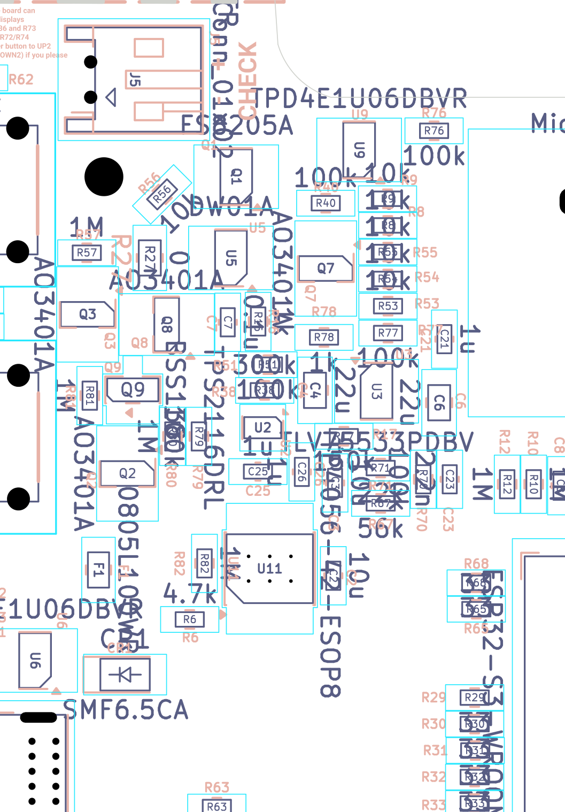
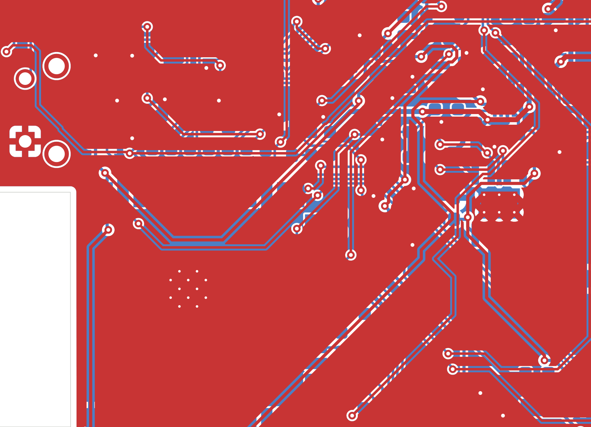

# 3.3 V LDO, system power tree, brown-out margin and sleep-current budget

*Final review 2026-09-19 — reviewer key `power`, finding prefix `PWR-`. Written from the evidence pack
(`docs/final-review-2026-09-19/evidence/`), which was generated directly from the KiCad files at commit `c0eccde`.
This review was written blind to the earlier audits.*

> **Verification pass (2026-09-20, reviewer key `power_verify`).** Every BLOCKER/HIGH/MEDIUM/DOC finding below was
> independently re-derived from the netlist, the datasheet text and the layout. Net result: **no BLOCKER and no HIGH
> item remains in this section.** PWR-08 (the only HIGH) and PWR-12 were **refuted**; PWR-02/03/04/05/06 were
> re-graded to LOW with factual corrections; one recommendation in PWR-03 was **wrong as written** (scaling only
> R70/R17 would break the charge-status ladder) and has been fixed; two small items were added (PWR-V01, PWR-V02); and PWR-06's "add a 100 kΩ bleeder" advice was withdrawn
> (re-solved: it does not fix anything and can move the `USB_STAT` reading further off).
> Corrections are marked **[V]** in the text; the full log is in the last section, "Verification log".

**Jargon, defined once**

* **LDO** — low-dropout linear regulator. It burns the difference between input and output voltage as heat:
  `P = (Vin − Vout) × I`. Efficiency is just `Vout/Vin`.
* **Dropout voltage (VDO)** — the minimum `Vin − Vout` an LDO needs to stay in regulation. Below it, the output
  simply follows the input down, minus that drop.
* **Iq / quiescent current / IGND** — what the chip itself burns just being switched on, with no load.
* **Power mux / power path** — a switch that picks whichever of two supplies (here USB or battery) should feed the system.
* **DC-bias derating** — a Class-II ceramic capacitor (X5R/X7R) loses a large fraction of its capacitance when a DC
  voltage is applied across it. A "22 µF" 0805 can be 9 µF in circuit.
* **Deep sleep** — the ESP32-S3 mode where everything but the RTC domain is powered off (~7 µA for the module).
* **Brown-out detector (BOD)** — a comparator inside the ESP32-S3 that resets the chip if VDD33 falls too low.
* **θJA (RθJA)** — thermal resistance, junction to ambient, in °C per watt of dissipation.

---

## What this part of the board does

The board runs from either a USB-C 5 V supply or a single-cell LiPo, and everything digital runs at 3.3 V.

1. **USB 5 V** enters at J1, passes a 1 A resettable polyfuse (F1) and becomes the net `USB_VBUS`.
2. **The battery** enters at J5 (`B+` / `B-`), passes a DW01A + FS8205A protection pair on the low side and a
   back-to-back P-channel MOSFET pair (Q3 / R27 / Q8) on the high side, and becomes the net `P+`.
   `P+` is also the TP4056 charger's `BAT` output, so the same node charges and discharges the cell.
3. **U2, a TPS2116 power mux**, picks between `USB_VBUS` (VIN1, priority) and `P+` (VIN2) and drives the net
   **`LDO_IN`**. USB wins whenever it is present.
4. **`LDO_IN` feeds two things:** U3, the 3.3 V LDO, and U10, the TPS923610 boost LED driver for the front light.
   The LED backlight therefore does **not** load the LDO — good decision, it keeps ~150 mA of boost current out of
   the linear regulator.
5. **U3 (TLV75533PDBV, TI TLV755P family, 500 mA, SOT-23-5)** makes the net **`3V3`**, which is the only logic rail
   on the board. Its EN pin is tied to its own input, so the LDO is always on whenever any source is present.
6. **`3V3` feeds everything else**: the ESP32-S3-WROOM-1 module, the DS3231MZ RTC, a 74LVC1G04 inverter, the microSD
   card (through a P-FET load switch Q7), the e-paper connector J2 (panel VDD *and* the panel's own boost inductor
   L1), the touch connector J4 (through the 0 Ω jumper R42), the 6-pin expansion header J6, the I²C pull-ups, the
   button ladders and half a dozen pull-up/divider networks.

The power tree, from the netlist (`evidence/sch/connectivity_by_net.txt`):

```
J1 USB-C ──VBUS_PRE_FUSE── F1 (0805L100WR, 1 A) ──USB_VBUS──┬── U11 TP4056 VCC (charger)
                                                            ├── U2.3 VIN1 (priority input)
                                                            ├── U2.5 MODE  (ties mux to "priority mode")
                                                            ├── R38 300k ─ /PR1 ─ R51 100k ─ GND
                                                            ├── D2 LED + R59 2k  (USB-present indicator; [V] also the only low-ohmic bleeder, but only above the LED's ~1.7 V)
                                                            └── C2 10u, C25 1u

J5 LiPo ──B+── Q3 (AO3401A) ── R27 (0 Ω 0805) ── Q8 (AO3401A) ──P+──┬── U2.6 VIN2      [V] Q3–R27–Q8 link is 0.25 mm, see PWR-V01
        └─B-── FS8205A (Q1) ── GND        (DW01A U5 supervises)      ├── U11.5 BAT (charger output)
                                                                    ├── U5.5 DW01A VCC
                                                                    ├── R12 1M ─ BAT_MONIT ─ R10 1M ─ GND
                                                                    ├── CR3 TSD05C ESD clamp
                                                                    ├── J6.12 (expansion header!)
                                                                    └── C3 10u, C7 100n, C26 1u

U2 TPS2116 VOUT ──LDO_IN──┬── U3.1 IN  +  U3.3 EN     (TLV75533, 500 mA)
                          ├── U10.1 VIN (TPS923610 LED boost, via L2 10 µH)
                          └── C4 22u (2.3 mm from U3.IN), C12 4.7u (at the boost, 34 mm away)

U3 OUT ──3V3── C21 1u, C6 22u ──┬── U4 ESP32-S3-WROOM-1 (pin 2)  + C32 22u, C33 100n
                                ├── U13 DS3231MZ  (on its **VBAT** pin, VCC grounded — deliberate, see HARDWARE.md §10)
                                ├── U12 74LVC1G04 VCC
                                ├── Q7 AO3401A load switch ── SD_VDD ── J7 microSD (+5× 10k pull-ups)
                                ├── J2.15/16 e-paper panel VDD, and L1 47 µH → the panel's own boost
                                ├── R42 (0 Ω) ── J4.2 touch connector supply
                                ├── J6.7 expansion header
                                ├── R47/R48 2.2k I²C pull-ups
                                ├── R4, R28 10k button-ladder pull-ups; R5 10k EPD_RST; R7 10k EN; R13 10k IO0
                                ├── R40 100k (Q7 gate), R70 100k (USB_STAT), R81 1M (DET_NODE), R82 1M (TP4056 CE)
                                └── CR2 TSD05C ESD clamp
```

---

## Circuit walk-through

| Ref | Part / value | Role | Checked against datasheet? |
|---|---|---|---|
| U3 | TLV75533PDBV, SOT-23-5 (DBV) | 3.3 V / 500 mA LDO, the only logic rail | **Yes** — TI SBVS320D. Pinout matches: 1 IN, 2 GND, 3 EN, 4 NC, 5 OUT. Schematic pin 1→`LDO_IN`, 2→`GND`, 3→`LDO_IN`, 4 NC, 5→`3V3`. Correct. |
| C4 | 22 µF 0805 X5R (CL21A226MAQNNNE) | LDO input cap (also the mux output cap). Sits 2.3 mm from U3 pin 1 | **Yes** — datasheet requires ≥1 µF at IN, nominal >0.47 µF after 50 % derating. Satisfied with margin. |
| C21 | 1 µF 0603 X5R **50 V** (CL10A105KB8NNNC — **[V]** Samsung voltage code "B" = 50 V, not 25 V) | LDO output cap, the one the stability spec asks for | **Yes** — "stable with a 1 µF ceramic output capacitor"; TI requires ≥0.47 µF effective (SBVS320D §7.1.2). |
| C6 | 22 µF 0805 X5R (CL21A226MAQNNNE) | Extra bulk on 3V3 at the LDO | Yes — **[V]** TI does give a ceiling: "for best performance, use a maximum output capacitance value of 200 µF" (SBVS320D §7.1.2). Total on `3V3` is ≈51 µF nominal, so there is 4× margin. |
| U2 | TPS2116DRL, SOT-583-8 | USB-or-battery power mux, priority mode (MODE tied to VIN1) | **Yes** — TI SLVSFG1A. Pinout matches (1 GND, 2/7 VOUT, 3 VIN1, 4 PR1, 5 MODE, 6 VIN2, 8 ST). |
| R38 / R51 | 300k / 100k | PR1 divider: VIN1 is "valid" above ≈4× VREF | Partially — the divider ratio is 4:1 so PR1 crosses its threshold at 4×VREF ≈ 4.4 V of VBUS. |
| F1 | 0805L100WR polyfuse | 1.0 A hold / 2.0 A trip on VBUS; also the main series resistance on the USB path | Yes — Littelfuse 0805L series. |
| Q3 + R27 + Q8 | 2× AO3401A + 0 Ω 0805 | Back-to-back P-FETs in the battery high side (reverse-battery / reverse-current block) | Yes for AO3401A; the back-to-back topology is correct for bidirectional blocking. |
| Q1 / U5 | FS8205A / DW01A | Low-side cell protection (over-charge, over-discharge, over-current) | Partially — I used published FS8205A/DW01A numbers, not a primary manufacturer PDF (see Sources). |
| U11 | TP4056-42 | Linear charger, BAT output on `P+` | Partially — status-pin behaviour with VCC absent is not in the datasheet (see PWR-06/PWR-18). |
| U10 | TPS923610DRLR | LED boost, fed from `LDO_IN` (not from 3V3) | **Yes** — TI SLVSG23. Shutdown current 130 nA typ / 250 nA max. |
| U4 | ESP32-S3-WROOM-1 | The load that dominates everything | **Yes** — Espressif datasheet v1.8, Tables 6-2, 6-4, 6-7. |
| U13 | DS3231MZ RTC | Timekeeping — wired VCC→GND, VBAT→3V3, i.e. "VBAT as primary supply" | **Yes** — this is a configuration the datasheet explicitly allows. **[V]** HARDWARE.md §10 already documents it and its three consequences, so PWR-12 is withdrawn. |
| C32 / C33 | 22 µF + 0.1 µF | Bulk + HF decoupling at the module's 3V3 pin | Yes. |

---

## Where it is on the board & layout notes

Everything here is on the **bottom** side. The whole power chain is packed into a strip along the right-hand edge of
the board between y ≈ 67 mm (the LiPo connector J5) and y ≈ 104 mm (the USB-C connector J1):

| Ref | x, y (mm) | Note |
|---|---|---|
| J5 LiPo (JST-PH) | 94.85, 67.50 | board edge |
| Q3 / R27 / Q8 | 95.02, 79.80 / 91.50, 76.60 / 90.54, 80.37 | high-side battery FETs |
| Q1 FS8205A / U5 DW01A | 86.60, 72.00 / 86.90, 76.60 | low-side protection |
| U2 TPS2116 | 85.10, 86.22 | power mux |
| **U3 TLV75533** | **78.65, 84.15** | the LDO |
| C4 (LDO input, 22 µF) | 82.14, 84.10 | its 3V3-side pad is 2.3 mm from U3 pin 1 |
| C21 (1 µF out) / C6 (22 µF out) | 74.80, 81.20 / 75.10, 84.80 | 2.7 mm / 2.2 mm from U3 pin 5 |
| U11 TP4056 | 84.70, 94.20 | charger |
| F1 / J1 USB-C | 94.41, 94.27 / 96.83, 103.98 | |
| U4 ESP32-S3-WROOM-1 | 57.50, 102.50 | 3V3 pad at (53.51, 93.50) |
| C32 / C33 (module decoupling) | 53.50, 89.01 / 53.50, 87.00 | 4.6 mm / 6.6 mm from the module 3V3 pad |
| U10 LED boost / L2 | 49.50, 122.00 / 49.48, 119.13 | fed from `LDO_IN` |

Routing (from `evidence/pcb/net_routing_stats.csv`, reproduced in `evidence/blocks/power.md`):

| Net | Class | Total length | Vias | Width(s) | Layers |
|---|---|---|---|---|---|
| `3V3` | Power | 379.1 mm | 18 | 0.25 mm, uniformly | B.Cu 260.0 / F.Cu 119.1 |
| `LDO_IN` | Power | 73.0 mm | 2 | 0.25 mm, uniformly | B.Cu 16.5 / F.Cu 56.5 |
| `GND` | Default | 48.8 mm of track | 68 | 0.2–0.8 mm | mostly poured |

`GND` is a poured plane on both layers (the routing length is tiny because the pour does the work).

**[V] Copper actually attached to U3 (checked on a 144 px/mm bottom-copper crop).** Pin 1 (IN) leaves on a single
0.25 mm track of ≈2.5 mm to C4; pin 3 (EN) reaches the same C4 pad on a ≈0.6 mm stub; pin 5 (OUT) leaves on a single
0.25 mm track towards C6/C21; pin 4 (NC) is an isolated pad; pin 2 (GND) joins the pour under the package through
**one** ≈0.5 mm spoke, with one GND via ≈1.5 mm away. In other words the LDO has essentially **no heat-spreading
copper on any lead** — this is what makes the JEDEC-class θJA in PWR-01 the right number to use, and it is also the
cheapest thing on the board to improve.

---



*Bottom-side assembly view of the power strip (mirrored, i.e. as you see the board looking at its bottom face).
J5 LiPo top right, then the protection FETs, the DW01A, the TPS2116 mux, U3 the LDO, the TP4056 charger, F1 and the
USB-C connector at the bottom.*



*X-ray copper view (top view, bottom copper seen through the board) of the region between U3 (right) and the
ESP32-S3 module footprint (left). All of `3V3` is routed at 0.25 mm.*

---

## Calculations

### 1. Series resistance from the cell to the LDO input

Everything between the cell and U3 pin 1 adds voltage drop that comes straight off the dropout budget.

| Element | Typ | Max | Source |
|---|---|---|---|
| FS8205A, 2 N-FETs in series (low side, in the GND return) | 50 mΩ | 70 mΩ | 2 × 25–35 mΩ; **published** FS8205A figure, not confirmed from a manufacturer PDF |
| Q3 AO3401A, V<sub>GS</sub> ≈ −V<sub>cell</sub> ≈ −3.6 V | 50 mΩ | 70 mΩ | AO3401A DS: R<sub>DS(on)</sub> < 60 mΩ @ −4.5 V, < 85 mΩ @ −2.5 V → interpolated |
| R27, 0 Ω 0805 (RC0805JR-070RL) | 20 mΩ | 50 mΩ | Yageo 0 Ω spec is "≤50 mΩ" |
| Q8 AO3401A, V<sub>GS</sub> = −V(P+) | 50 mΩ | 70 mΩ | as Q3 |
| U2 TPS2116, VIN2→VOUT R<sub>ON</sub> | 37 mΩ | 55 mΩ (−40…85 °C) | TI SLVSFG1A §6.5 |
| PCB traces (B+ / P+ at 0.4 mm, B− at 0.4 mm, 1 oz) | ≈70 mΩ | ≈90 mΩ | 0.5 mΩ/square; `net_routing_stats.csv`. **[V]** This omits the Q3–R27–Q8 link (`Net-(Q3-D)` 7.27 mm + `Net-(Q8-D)` 3.00 mm, both at **0.25 mm** = 41 squares ≈ **20 mΩ**, see PWR-V01); with it the trace total is ≈90–110 mΩ and the overall total moves to ≈0.30 Ω typ. That is inside the error bar of everything below (it shifts the voltages in §2 by <10 mV at 355 mA) |
| **Total, cell → LDO IN** | **≈0.28 Ω** | **≈0.40 Ω** | |

Add the cell's own internal resistance — 0.10–0.25 Ω is normal for a 1000 mAh pouch cell, more when cold.

**[V] Verified:** AO3401A R<sub>DS(on)</sub> limits (<60 mΩ @ −4.5 V, <85 mΩ @ −2.5 V) and TPS2116 R<sub>ON</sub>
(37 typ / 46 max at 25 °C, 55 mΩ to 85 °C, at 5 V) read from the datasheet text. Q3's gate sits at 1 % of V<sub>cell</sub>
(R57 1 M / R56 10 k), so V<sub>GS</sub> ≈ −0.99 × V<sub>cell</sub>; Q8's gate is at GND, so V<sub>GS</sub> = −V(P+). Note that
**U2 is *not* in the path measured by `BAT_MONIT`** (the divider taps `P+`, upstream of the mux) — relevant to PWR-17.

### 2. Dropout and the usable battery window

TI specifies dropout for the 3.3 V option as **150 mV typ / 215 mV max (−40…85 °C) at 500 mA**
(SBVS320D §5.5, row "V<sub>DO</sub>, 3.3 V ≤ V<sub>OUT</sub> < 5.0 V"). Modelling the pass FET as a resistor:

* R<sub>pass,typ</sub> = 150 mV / 500 mA = **0.30 Ω**
* R<sub>pass,max</sub> = 215 mV / 500 mA = **0.43 Ω**

The rail stays at 3.30 V as long as `Vcell ≥ 3.30 + I × (Rseries + Rpass)`:

| 3V3 load | Vcell needed (typ, 0.58 Ω) | Vcell needed (worst, 0.83 Ω) |
|---|---|---|
| 20 mA (sleep / static display) | 3.31 V | 3.32 V |
| 60 mA (CPU @80 MHz, no radio) | 3.33 V | 3.35 V |
| 100 mA (CPU + SD read) | 3.36 V | 3.38 V |
| 200 mA (e-paper refresh) | 3.42 V | 3.47 V |
| **355 mA (Wi-Fi 802.11b TX peak)** | **3.51 V** | **3.59 V** |
| 500 mA | 3.59 V | 3.72 V |

Below that the LDO is in dropout and the rail simply follows: `V(3V3) = Vcell − I × (Rseries + Rpass)`.

Three thresholds matter on the way down:

* **3.0 V** — ESP32-S3-WROOM-1 minimum recommended VDD33 (Espressif DS v1.8 Table 6-2). Below this,
  flash and RF behaviour is out of spec.
* **2.44 V** — the ESP32-S3 brown-out detector's *default* trip point (`CONFIG_ESP_BROWNOUT_DET_LVL_SEL_7`,
  the ESP-IDF default for esp32s3).
* **≈2.4 V (cell)** — the DW01A's over-discharge cut-off, which removes the battery entirely.

3V3 reaches 3.00 V when `Vcell = 3.00 + I × 0.58`:

| 3V3 load | Cell voltage at which 3V3 = 3.00 V |
|---|---|
| 20 mA | 3.01 V |
| 100 mA | 3.06 V |
| **355 mA (Wi-Fi TX)** | **3.21 V** (3.28 V once you add 0.2 Ω of cell IR) |

**Usable window, plain language:** the rail holds a flat 3.30 V from a full 4.2 V cell down to about **3.35 V at
light load** — by which point a LiPo has already delivered roughly 90–95 % of its capacity, so essentially nothing
is lost. Below that the rail sags with the cell but stays inside the ESP32's recommended range down to about
**3.05 V of cell** at ordinary loads. **Wi-Fi transmit is the weak point:** at 355 mA the rail is already 0.21 V
below the cell, so it drops under 3.0 V at roughly **3.2–3.3 V of cell** — the last ~5 % of the discharge curve.
**[V] Correction:** the original text said the 2.44 V brown-out detector "will essentially never fire because the
DW01A cuts the cell off at 2.4 V first". That is not right — the detector watches the **3V3 rail**, which sits
*below* the cell by `I × 0.58 Ω`, so it does trip before the DW01A: at ≈2.50 V of cell at 100 mA and at ≈2.65–2.75 V
of cell during a Wi-Fi burst. The real point is that 2.44 V is **far too late to be useful**: it is 0.56 V under the
module's 3.0 V minimum and under the 2.7 V that SPI flash typically needs for a safe write. So with the default
level a flat battery presents as flaky Wi-Fi and possibly a corrupted flash write, not as a clean early reset.

### 3. LDO thermal dissipation, USB case

USB path: 5.0 V at J1, minus F1 and minus the mux.
F1 (0805L100WR) initial resistance is of order 0.10–0.15 Ω and up to ~0.3–0.45 Ω after a trip; U2 R<sub>ON</sub> is
37–55 mΩ. At 300 mA that is 40–60 mV, so **V<sub>IN</sub>(LDO) ≈ 4.85–4.9 V**.

`Pd ≈ (4.85 − 3.3) × I = 1.55 × I` watts (the 25 µA ground current adds ~0.12 mW — negligible).

U3 is the **DBV** package: SOT-23-5 with **no** thermal pad. TI's table (SBVS320D §5.4) gives
**Rθ<sub>JA</sub> = 231.1 °C/W on the JEDEC board** and **100.8 °C/W on TI's own EVM**.
**[V] Correction:** the original text said the 100.8 °C/W EVM figure belonged to the exposed-pad DYD part. It does
not — the table's columns are DYD / DQN / DBV / DRV, the EVM row reads 60.3 / N/A / **100.8** / N/A, and the JEDEC row
reads 92.5 / 168.4 / **231.1** / 100.2. So **100.8 °C/W is the very same DBV package on a board with generous copper
on its leads** — i.e. copper alone is worth a factor of ≈2.3, and at 100 °C/W the part could deliver its full 500 mA
from USB at 25 °C (0.78 W → ΔT 78 °C). This layout gives U3 almost no copper (see the layout note above), so
**200–260 °C/W** remains the realistic bracket *for the board as drawn*. Using 230 °C/W:

| I(3V3) | Pd | ΔT<sub>J</sub> | T<sub>J</sub> @ 25 °C ambient | T<sub>J</sub> @ 40 °C in an enclosure |
|---|---|---|---|---|
| 50 mA | 0.078 W | 18 °C | 43 °C | 58 °C |
| 100 mA | 0.155 W | 36 °C | 61 °C | 76 °C |
| 200 mA | 0.31 W | 71 °C | 96 °C | 111 °C |
| 250 mA | 0.39 W | 89 °C | 114 °C | **129 °C — over T<sub>J</sub>(max)** |
| 355 mA | 0.55 W | 127 °C | **152 °C** | **167 °C — thermal shutdown** |
| 500 mA | 0.78 W | 179 °C | **204 °C** | — |

Solving for T<sub>J</sub> ≤ 125 °C: **281 mA continuous at 25 °C ambient, 238 mA at 40 °C.**

**[V] Perspective:** these are *continuous* currents. A realistic sustained load for this product (Wi-Fi
associated and downloading to SD) averages ≈100–200 mA — RX is 95 mA, and the 355 mA TX peak is a small duty cycle —
so the junction sits at ≈60–110 °C, inside the rating but with little margin in a warm enclosure next to a charging
TP4056. The arithmetic was re-done and is correct.

On **battery** the same arithmetic is harmless: Pd = (V<sub>cell</sub> − 3.3) × I, i.e. 0.9 × I at a full 4.2 V cell
and 0.2 × I at 3.5 V. 200 mA from a full cell is 180 mW → ΔT<sub>J</sub> = 41 °C. No problem at all.

### 4. Capacitors and DC-bias derating

| Ref | Part | Rating (verified) | Nominal | At TI's blanket 50 % derating | Requirement |
|---|---|---|---|---|---|
| C4 (IN) | CL21A226MAQNNNE | 22 µF, **25 V**, X5R, 0805 | 22 µF | ≥11 µF | ≥1 µF, nominal >0.47 µF |
| C21 (OUT) | CL10A105KB8NNNC | 1 µF, **50 V** **[V]**, X5R, 0603 | 1 µF | ≥0.5 µF | ≥0.47 µF effective (SBVS320D §7.1.2) |
| C6 (OUT bulk) | CL21A226MAQNNNE | 22 µF, 25 V, X5R, 0805 | 22 µF | ≥11 µF | — |
| C32 / C33 (at the module) | CL21A226MAQNNNE / CC0603KRX7R9BB104 | 22 µF 25 V X5R / 0.1 µF 50 V X7R | 22 µF + 0.1 µF | ≥11 µF | ≥10 µF + 0.1 µF |

**These are 25 V (C21: 50 V) parts running at 3.3–5 V, so real DC-bias loss is moderate.**
**[V] Caution on the original wording** ("13–20 % of rated voltage, so loss is small"): DC-bias loss in a high-CV
part tracks case size and capacitance more than the printed voltage rating. Comparable 22 µF / 25 V / 0805 X5R parts
lose roughly 20–25 % at 3.3 V and ≈40 % at 5 V, so expect **C6/C32 ≈ 17 µF each on `3V3` and C4 ≈ 12–13 µF on
`LDO_IN` when on USB** (estimate from typical curves; I did not pull Samsung's curve for this exact part number).
None of that changes the conclusion, because the requirement is only 0.47 µF. Even assuming TI's pessimistic blanket 50 % derating, every
capacitor clears its requirement with a wide margin. Picking 25 V rather than the cheaper 6.3 V parts was the right
call and it is what makes this section boring. **[V]** (The original comparison — "a 1 µF/6.3 V 0603 would have been
~0.45 µF, below the stability floor" — was a guess, not a datasheet figure, and has been removed.)

**Start-up inrush.** The mux soft-starts `LDO_IN` in 1.3 ms (3.3 V) / 1.7 ms (5 V) into C4 + C12 ≈ 27 µF nominal:
`I = C × V/t` = 27 µF × 5 / 1.7 ms ≈ 79 mA — trivially inside the TPS2116's 2.5 A. The LDO then soft-starts `3V3`
into C6 + C21 + C32 ≈ 45 µF nominal (≈40 µF effective, since these are 25 V parts at 3.3 V); with the TLV755P's
built-in soft-start ramp of roughly 0.5 ms that is ≈264 mA, still inside the 560 mA minimum current limit — but it
is the reason the soft start matters: without it, 40 µF from a hard 3.3 V source would hit the limit instantly.

### 5. Peak 3V3 load versus what the LDO can deliver

| Load | Peak | Source |
|---|---|---|
| ESP32-S3 Wi-Fi 802.11b TX @ 20.5 dBm | 355 mA | WROOM-1 DS v1.8 Table 6-4 (rated at 100 % duty cycle) |
| ESP32-S3 BLE TX @ 20 dBm | 344 mA | Table 6-5 |
| ESP32-S3 Wi-Fi RX | 95–97 mA | Table 6-4 |
| microSD write burst | 100 mA typical, up to 200 mA allowed by the SD spec | SD card, not measured here |
| E-paper refresh: panel logic on J2.15/16 **plus** the panel's own boost drawing through L1 (47 µH) from 3V3 | 20–60 mA | topology; panel-dependent |
| RTC, inverter, pull-ups | <30 µA | see sleep budget |
| **Worst case if they coincide** | **≈515 mA** | |

TLV75533 current limit: **560 mA minimum**, 720 mA typical, 865 mA max (verified, SBVS320D §5.5; I<sub>SC</sub> 355 mA
typ into a dead short). So a simultaneous Wi-Fi burst + SD write + display refresh sits about **8 % below the
guaranteed current limit** — thin, but **inside the specification [V]**. And the TLV755P uses
**foldback** current limiting: SBVS320D §6.3.3 notes that once V<sub>OUT</sub> falls below 0.4 × V<sub>OUT(NOM)</sub>
the limit is scaled back further, and "the load current demanded by the load potentially exceeds the foldback
current limit" — i.e. the rail can stick in a collapsed state instead of recovering. On this board the load *is*
the ESP32, so the symptom would be a brown-out and restart loop under exactly the conditions an e-reader hits when
it syncs.

**[V] Correction — the stuck-in-foldback scenario is not credible here.** §6.3.3 says the limit is a *brick wall*
(≥560 mA) until V<sub>OUT</sub> falls below 0.4 × 3.3 V = **1.32 V**; only below that does it fold back. To get
there the load would first have to exceed 560 mA *and* keep demanding it while the rail collapses through 3.0 V,
2.44 V (brown-out reset) and on down to 1.3 V. The ESP32 stops transmitting and resets long before that, its load
falls to tens of mA, and the LDO recovers. Two of the three addends (SD 100 mA, e-paper 60 mA) are also estimates,
not measurements. On a low battery the rail is dropout-limited (§2) well before it is current-limited. This is why
PWR-02 is re-graded to LOW.

### 6. Sleep-current budget (ESP32 in deep sleep, USB unplugged, backlight off, SD gated off)

**A — loads on the 3V3 rail**

| Item | Typ | Max | Evidence |
|---|---|---|---|
| U4 ESP32-S3-WROOM-1, deep sleep, RTC memory up / RTC peripherals down | 7 µA | — | WROOM-1 DS Table 6-7 |
| U13 DS3231MZ, running from its VBAT pin on 3V3, I²C idle | 2.0 µA | 3.0 µA | DS3231M DS, I<sub>BATT</sub> @ V<sub>BAT</sub> = 3.63 V, EN32KHZ = 0 (Note 4: includes the averaged temperature-conversion current). **[V]** EN32KHZ powers up as **1** (Status-register description); the 32KHZ pin is unconnected here so the penalty is small, but firmware should clear the bit so this figure applies |
| U12 74LVC1G04 (input held at GND by R75 100 k, so no crowbar) | 0.1 µA | 4 µA | Nexperia 74LVC1G04 DS, I<sub>CC</sub> |
| **R70 100 k → USB_STAT → R17 150 k → U2 ST (held LOW on battery)** | **13.2 µA** | 13.2 µA | 3.3 V / 250 kΩ. TPS2116 DS Table 5-1: "ST … Pulled low when VIN1 is not being used" |
| Extra USB_STAT leak through R67 56 k / R71 22 k into the unpowered TP4056 status pins | 0 (expected) – 3 µA (bound) | — | **not verified** — see PWR-06. **[V]** the original "0–15 µA" double-counted: 15 µA was the *total* out of 3V3 in that scenario, of which 12–13 µA is the R70/R17 row above; the extra is ≤3 µA |
| R81 1 M, 3V3 → /DET_NODE, held low by Q9 whenever a cell is fitted | 3.3 µA | 3.3 µA | 3.3 V / 1 MΩ |
| R82 1 M, TP4056 CE → GND, fed from 3V3 through Q2 (on whenever a cell is fitted) | 3.3 µA | 3.3 µA | 3.3 V / 1 MΩ |
| Q7 AO3401A drain–source leakage, SD off | <0.1 µA | 1 µA | AO3401A I<sub>DSS</sub> 1 µA max at V<sub>DS</sub> = −24 V |
| CR2 TSD05C ESD clamp | 0.01 µA | 0.01 µA | TSD05C DS, I<sub>LEAK</sub> 10 nA max |
| R4/R5/R7/R13/R28/R40/R47/R48 — pull-ups with nothing holding them low | 0 | 0 | |
| **J4 touch panel, permanently fed from 3V3 through R42 (0 Ω)** | **unknown** | | no load switch — PWR-07 |
| **J2 e-paper panel VDD (pins 15/16) and VGH through L1 + D5** | **unknown** | | no load switch — PWR-07 |
| **Subtotal (quantified only)** | **≈29 µA** | ≈32 µA | |

**B — loads on `LDO_IN`** (upstream of the LDO, downstream of the mux)

| Item | Typ | Max | Evidence |
|---|---|---|---|
| **U3 TLV75533 ground current I<sub>GND</sub>** | **25 µA** | 31 µA @25 °C, 33 µA to 85 °C | SBVS320D §5.5 |
| U10 TPS923610 shutdown current (ADIM pulled low by its own 600 kΩ) | 0.13 µA | 0.25 µA @25 °C, 0.5 µA to 85 °C | SLVSG23 §"Shutdown" |
| R39 1 M + R41 120 k (LED_MONIT divider) across LED_SW, which the boost's high-side body diode holds at ≈ LDO_IN − 0.5 V | ≈2.5 µA | | 3.0 V / 1.12 MΩ |
| **Subtotal** | **≈28 µA** | ≈36 µA | |

**C — loads on `P+`** (raw cell, upstream of the mux)

| Item | Typ | Max | Evidence |
|---|---|---|---|
| U2 TPS2116: I<sub>Q,VIN2</sub> 1.35 µA + I<sub>STBY,VIN1</sub> 0.22 µA | 1.6 µA | 3.9 µA to 85 °C | SLVSFG1A §6.5 |
| U5 DW01A supply current | ≈3 µA | ≈6 µA | published DW01A spec — **not confirmed from a manufacturer PDF** |
| U11 TP4056 BAT-pin drain with VCC absent | <2 µA | | TP4056 DS sleep-mode spec |
| R12 1 M + R10 1 M, BAT_MONIT divider permanently across P+ | 1.85 µA | | 3.7 V / 2 MΩ |
| CR3 TSD05C | 0.01 µA | | |
| **Subtotal** | **≈8.5 µA** | ≈13 µA | |

**D — loads on the raw cell, upstream of the high-side FETs**

| Item | Typ | Evidence |
|---|---|---|
| R57 1 M + R56 10 k — Q3's gate bias (this is what keeps the reverse-protection FET on) | 3.7 µA | 3.7 V / 1.01 MΩ |
| R79 100 k + R80 1 M — Q9's gate bias (battery-present detect) | 3.4 µA | 3.7 V / 1.1 MΩ |
| **Subtotal** | **7.1 µA** | |

**TOTAL battery current in deep sleep:** the LDO is linear, so 3V3 current appears 1:1 at the cell.

> **≈73 µA typical**, ≈88 µA with datasheet maxima at 85 °C — *plus* whatever the touch panel and the
> e-paper panel draw, which is not in this number.

**Standby life** (ignoring cell self-discharge, and assuming 100 % of rated capacity):

| Cell | @ 73 µA | @ 88 µA |
|---|---|---|
| 1000 mAh | 13 700 h = **571 days ≈ 19 months** | 11 400 h = 473 days ≈ 16 months |
| 1500 mAh | 20 500 h = **856 days ≈ 28 months** | 17 000 h = 710 days ≈ 23 months |
| 2000 mAh | 27 400 h = **1142 days ≈ 38 months** | 22 700 h = 947 days ≈ 31 months |

Realistically, subtract two things: only ~90 % of the capacity is usable before the rail leaves regulation, and a
LiPo self-discharges at ~2–3 %/month, which for a 1000 mAh cell is an extra ≈34 µA equivalent.
**[V] Correction:** the original text applied that same 34 µA to the larger cells. Self-discharge is a percentage,
so it scales with capacity: ≈51 µA for 1500 mAh and ≈68 µA for 2000 mAh. Recomputed
(`0.9 × C / (73 µA + self-discharge)`):

| Cell | Self-discharge equiv. | Real standby @ 73 µA | @ 52 µA (after the PWR-03 changes) |
|---|---|---|---|
| 1000 mAh | 34 µA | 8 400 h ≈ **11.5 months** | ≈14 months |
| 1500 mAh | 51 µA | 10 850 h ≈ **15 months** (was "≈18") | ≈18 months |
| 2000 mAh | 68 µA | 12 700 h ≈ **17.5 months** (was "≈24") | ≈20 months |

With a big cell the cell's own self-discharge is about half the total, so further circuit optimisation has
diminishing returns — a year of shelf standby is already a very good number for this class of device.

**Where the 73 µA goes, and what is cheap to fix**

| Rank | Item | µA | % | Cheap fix? |
|---|---|---|---|---|
| 1 | U3 LDO ground current | 25.0 | 34 % | Only by changing the part (e.g. TPS7A02, 25 nA I<sub>Q</sub>) — but that part is 200 mA and could not carry a Wi-Fi burst. **Keep it.** |
| 2 | R70/R17 USB_STAT divider | 13.2 | 18 % | **Yes — but [V] all four ladder resistors must scale together:** R70 → 1 M, R17 → 1.5 M, **R67 → 560 k, R71 → 220 k**, C23 → 22 nF. Saves ≈12 µA. Scaling only R70/R17 (as originally written here) would break the ladder — see the warning below. |
| 3 | ESP32-S3 deep sleep | 7.0 | 10 % | No |
| 4 | R57/R56 Q3 gate bias | 3.7 | 5 % | Raise R57 to 10 M / R56 to 100 k → 0.37 µA. Slower turn-on, otherwise harmless. |
| 5 | R79/R80 Q9 gate bias | 3.4 | 5 % | ×10 → 0.34 µA |
| 6 | R81 (DET_NODE) | 3.3 | 5 % | 10 M → 0.33 µA |
| 7 | R82 (TP4056 CE) | 3.3 | 5 % | 10 M → 0.33 µA |
| 8 | U5 DW01A | 3.0 | 4 % | No |
| 9 | R39/R41 LED_MONIT divider | 2.5 | 3 % | ×10 → 0.25 µA (check the ADC's input impedance requirement first) |
| 10 | U13 DS3231MZ | 2.0 | 3 % | Only by deleting the part and using the ESP32's own RTC |
| 11 | U11 TP4056 | 2.0 | 3 % | No |
| 12 | R12/R10 BAT_MONIT divider | 1.85 | 3 % | ×10, **or** put a small N-FET in series with R10 and only enable the divider while sampling |
| 13 | U2 TPS2116 | 1.6 | 2 % | No |
| 14 | everything else | ≈1.2 | 2 % | |

> **[V] WARNING — the original recommendation was wrong as written.** `USB_STAT` is a *four*-resistor ladder against
> one pull-up: R70 (100 k to 3V3) against R17 (150 k → ST), R67 (56 k → CHRG) and R71 (22 k → STDBY). HARDWARE.md §3.7
> relies on 1.98 V (battery), 1.19 V (charging), 0.96 V, 0.60 V (full). If only R70 and R17 are scaled ×10, the
> on-battery level stays at 1.98 V but **charging becomes 3.3 × 56/(1000+56) = 0.18 V and full becomes
> 3.3 × 22/(1000+22) = 0.07 V** — indistinguishable from each other and from 0 V on the ESP32 ADC. All four
> resistors must be scaled by the same factor (or none). With all four ×10 every documented level is unchanged.

**Which of these are actually worth doing.** Items 4, 5 and 9 (R57/R56, R79/R80, R39/R41) and above all item 2
(the R70/R17/R67/R71 ladder) are free: none of them is an ESP32 ADC input whose source impedance is already marginal, or a FET gate
where leakage competes with the bias current. Doing just those four:

```
73.0 µA − 11.9 (R70/R17) − 3.3 (R57/R56) − 3.1 (R79/R80) − 2.25 (R39/R41)  ≈  52 µA
```

i.e. **≈73 µA → ≈52 µA, a 29 % cut, for value changes only and no layout work** (**[V]** it is ten resistor values
plus C23, not "four": R70, R17, R67, R71, R57, R56, R79, R80, R39, R41). Note one consequence: scaling the ladder ×10
raises the `USB_STAT` source impedance to ≈0.2–0.6 MΩ depending on state, so C23 should go from 2.2 nF to ~22 nF to
keep the node stiff enough for the ADC's sampling capacitor. For R57/R56 it is enough to raise **R57 alone** to
10 MΩ — R56 (10 k) sets the gate potential and carries the same current, so it can stay.

Items 6, 7 and 12 (R81, R82, R12/R10) would save a further ≈8 µA, but HARDWARE.md §16 already argues against
raising those — R81/R82 bias MOSFET gates where 1–5 µA-class leakage would start to compete at 10 MΩ, and R12/R10
already presents ≈500 kΩ to the ADC. **That reasoning is sound; I am not disputing it.** A better answer for
R12/R10 specifically is a small N-FET in series with R10 so the divider only draws current while the ADC samples —
that gets the 1.85 µA back without touching the impedance the ADC sees.

---

## Findings

| ID | Severity | Finding | Evidence | Recommendation |
|---|---|---|---|---|
| PWR-01 | MEDIUM *(confirmed, with corrections)* | U3 is thermally limited to ≈240–280 mA continuous from USB, not its rated 500 mA — **as laid out**: its IN and OUT pins leave on single 0.25 mm tracks and its GND pin has one spoke | Pd = 1.55 × I; DBV Rθ<sub>JA</sub> = 231 °C/W (JEDEC) vs **100.8 °C/W for the same DBV package on TI's EVM** (SBVS320D §5.4 — **[V]** not the DYD part as first written); T<sub>J</sub> = 125 °C max | **Pour copper onto U3's IN, OUT and GND pads** (each ≥ ~30–50 mm², solid connection) — TI's own numbers say that is worth ≈2× in θJA. Document the limit. Realistic average load (100–200 mA) stays inside the rating, so this is a margin item, not a fault |
| PWR-02 | ~~MEDIUM~~ → **LOW** **[V]** | Worst-case coincident 3V3 load (≈515 mA, two of three addends estimated) sits ~8 % under the LDO's 560 mA *minimum* current limit. **It is inside the spec**; the foldback "stuck rail" scenario is not credible (foldback only starts below 1.32 V, see §5) | Wi-Fi TX 355 mA (WROOM-1 Table 6-4) + SD 100 mA + EPD 60 mA; I<sub>CL</sub> min 560 mA, foldback per §6.3.3 | Serialise in firmware: never TX during an SD write or an EPD refresh. Write the rule into HARDWARE.md |
| PWR-03 | ~~MEDIUM~~ → **LOW** **[V]** | Sleep budget is ≈73 µA typical (re-added independently: 72–73 µA); ≈21 µA of that is avoidable with value changes only. This is an optimisation of an already good number (≈11.5 months → ≈14 months on 1000 mAh) | full budget in §6 above | Scale **all four** ladder resistors R70/R17/**R67/R71** ×10 (and C23 to ~22 nF) — **never R70/R17 alone, that breaks the charge-status ladder**; raise R57 to 10 M; scale R79/R80 and R39/R41 ×10 → ≈52 µA. Leave R81/R82/R12/R10 alone, for the reasons HARDWARE.md §16 already gives |
| PWR-04 | ~~MEDIUM~~ → **LOW** **[V]** (firmware setting, no board change; HARDWARE.md §3.5 already flags this headroom as an open bench check) | Wi-Fi TX pulls 3V3 below the ESP32-S3's 3.0 V recommended minimum once the cell drops to ≈3.2–3.3 V; the chip's default brown-out level (2.44 V) is far too low to protect against it (**[V]** it *can* fire before the DW01A — it watches the rail, not the cell — but only ≈0.5 V too late) | §2 above; Espressif DS Table 6-2; ESP-IDF `ESP_BROWNOUT_DET_LVL_SEL_7` default | Raise `CONFIG_ESP_BROWNOUT_DET_LVL_SEL` to level 3 (2.98 V) or 4 (2.84 V); gate Wi-Fi on BAT_MONIT ≥ ~3.4 V |
| PWR-05 | ~~MEDIUM~~ → **LOW** **[V]** | U3's GND pad reaches the ground pour through a **single** thermal spoke (DRC fact confirmed, and visible in the copper crop). The *thermal* half of the argument stands and is folded into PWR-01; the *electrical* half is withdrawn — an LDO's GND pin carries only its ≈25 µA–1 mA ground current, so a ≈1 mΩ / <1 nH neck has no measurable effect on regulation, PSRR or stability | `drc.json` / `evidence/blocks/power.md`: `starved_thermal … zone min spoke count 2; actual 1` on U3 pad 2 and on C21 pad 2 | Set U3's (and the other power parts') GND pad connection to **solid** fill, or free space so all four spokes form |
| PWR-06 | ~~MEDIUM~~ → **LOW** **[V]** | On battery, `USB_VBUS` has no resistive bleeder other than R38+R51 (400 kΩ) and the D2/R59 LED branch (which only conducts above ≈1.7 V). *If* the TP4056's status pins clamp to VCC (unverified, and unusual for open-drain pins) the node could float to ≈1.2 V. **The mux cannot mis-select because of this** — every row of the TPS2116 truth table with PR1 < V<sub>REF</sub> outputs VIN2 (or the higher input, which is VIN2), and the one dangerous row (MODE low + PR1 high = shutdown) is unreachable because PR1 = V<sub>BUS</sub>/4 | Nodal solve in the finding text below; TPS2116 DS §6.5 V<sub>IH,MODE</sub> = 1 V min; `connectivity_by_net.txt` `USB_VBUS` | ~~Add a 100 kΩ bleeder from `USB_VBUS` to GND, or~~ **[V]** Measure `USB_VBUS` and `USB_STAT` on battery (no cable) before fixing the firmware's ADC bands. A bleeder is **not** a fix: if the status pins do clamp, it pulls `USB_STAT` *further* off (≈1.41 V instead of 1.98 V); if they do not, it is redundant. Same bench check as PWR-V02 |
| PWR-07 | MEDIUM *(confirmed; R42 fitted, R43/R66 DNP verified in the netlist)* | Two always-on, unmeasured 3V3 loads: the touch panel (J4 pin 2, fed through the 0 Ω R42) and the e-paper panel (J2 pins 15/16, plus VGH through L1 + D5). Neither has a load switch, so both are in the sleep budget with unknown magnitude | `connectivity_by_net.txt`: `/PIN_2` = J4.2 + R42 + R43; `3V3` includes J2.15, J2.16, L1.2 | Measure both on the prototype. If either is >20 µA, add a P-FET load switch like Q7's |
| ~~PWR-08~~ | ~~HIGH~~ → **refuted** | ~~struck~~ — **refuted by verification:** (1) the datasheet row the claim rests on reads "Light-sleep: VDD_SPI and Wi-Fi are powered down, and **all GPIOs are high-impedance**"; its footnote "all related SPI pins are pulled up" sits beside the VDD_SPI/PSRAM sentence and refers to the module's *internal flash/PSRAM SPI pins*, not to user GPIOs — and the SD bus here is on IO5/6/7/15/16/17 (via R21–R26), none of which is a flash pin. Nothing pulls those pins up "by itself". (2) The arithmetic was self-contradictory: with `SD_VDD` at 3.23 V only 3.23 V/100 kΩ = **32 µA** flows; 1.65 mA is the *short-circuit* figure with `SD_VDD` held at 0 V — the two cannot both be true. The residual, generic firmware rule (keep the SD lines low or un-pulled for as long as Q7 is off) is kept under PWR-19 at DOC level. Original text follows for the record: ~~**Light sleep silently back-powers the gated-off microSD card.**~~ The five 10 kΩ pull-ups (R8/R9/R53/R54/R55) are referenced to `SD_VDD`; Espressif states that in light-sleep mode "all related SPI pins are pulled up", which pushes `SD_VDD` to ≈3.2 V through them and burns ≈1.6 mA — 20× the whole sleep budget. HARDWARE.md §5 requires data lines low *before power-off* but does not cover the whole time the card is off, nor light sleep | `connectivity_by_net.txt` `SD_VDD` = 5 × 10 kΩ + R77 100 kΩ to GND; Thevenin 3.3 V/2 kΩ ÷ 100 kΩ → 3.23 V; WROOM-1 DS v1.8 Table 6-7 note 1 | Either forbid light sleep while the card is gated off, or have firmware hold all six SD pins at input-no-pull for the whole off period. Add that to HARDWARE.md §5 alongside the existing power-off rule |
| PWR-09 | LOW | The 0.1 µF (C33) is *further* from the module's 3V3 pad (6.6 mm) than the 22 µF (C32) is (4.6 mm); the small cap should be closest | pad coordinates: U4 3V3 @ (53.51, 93.50), C32 @ (52.46, 89.01), C33 @ (52.64, 87.00) | Swap C32 and C33 positions in the next revision |
| PWR-10 | LOW | `3V3` is routed at 0.25 mm everywhere, including the ≈35–45 mm trunk from U3 to the module; at a 515 mA peak that is ≈40 mV of drop, straight off the dropout margin | `net_routing_stats.csv`: `3V3` 379.11 mm, all at 0.25 mm; 1 oz sheet resistance 0.5 mΩ/square | Widen the U3 → module segment of `3V3` to 0.5 mm. Thermally 0.25 mm is fine (≈0.86 A for a 10 °C rise) — this is purely about drop |
| PWR-11 | LOW | `USB_VBUS` is 0.25 mm but carries the charger current *plus* the whole system when plugged in (up to ≈0.73 A) — narrower than the 0.4 mm battery path it feeds in parallel with | `net_routing_stats.csv`: `USB_VBUS` all 0.25 mm; `B+`/`P+` 0.4 mm | Widen `USB_VBUS` and `VBUS_PRE_FUSE` to 0.4 mm for consistency |
| ~~PWR-12~~ | ~~DOC~~ → **refuted** | ~~struck~~ — **refuted by verification:** the wiring observation is correct (and datasheet-legal — verified against the DS3231M pin table and the "oscillator does not start until … a valid I²C address is written" paragraph), but it is **not a documentation gap**: HARDWARE.md §10 (lines ≈1000–1015) already states VBAT→3V3 / VCC→GND, calls it the datasheet's single-supply VBAT-only configuration, and lists all three consequences (first I²C access starts the oscillator; RST and INT/SQW unconnected so no RTC wake; no independent time backup, accepted deliberately). The original reviewer did not open §10. Original text: ~~U13 DS3231MZ is wired VBAT-as-primary~~ (pin 6 → 3V3) with VCC (pin 2) grounded. This is datasheet-sanctioned, but it means the RTC has **no** backup: when 3V3 goes, the time goes. It also means the oscillator will not start until firmware writes a valid I²C address | `connectivity_by_component.txt` U13; DS3231M DS pin table ("VCC … Connect to ground if not used", "VBAT … when using the device with the VBAT input as the primary power source") | Confirm this is intentional and say so in HARDWARE.md; make sure firmware does the first I²C write that starts the oscillator |
| PWR-13 | CERT-LATER | The LDO's input and output loops are laid out for convenience rather than for loop area; C21's GND pad has a single thermal spoke, and `3V3` / `LDO_IN` change layers several times (18 and 2 vias respectively) | `drc.json` starved_thermal on C21 pad 2; `net_routing_stats.csv` layer split | Irrelevant for a prototype; revisit if EMC testing is ever pursued |
| PWR-14 | DOC *(confirmed, minor)* | README's populate table calls **C12 the "LDO-input capacitor"**. C12 *is* on the net named `LDO_IN`, so the label is literally defensible, but functionally it is the LED boost's input capacitor, **44 mm** from U3 (**[V]** not 34 mm: Δx 26.3, Δy 35.6); the LDO's input capacitor is C4 | `board_summary.md`: C12 @ (52.38, 119.77) beside U10/L2, C4 @ (82.14, 84.10), U3 @ (78.65, 84.15). HARDWARE.md §3.5 has it right | Fix the README label: "`C4` (LDO-input capacitor)"; move C12 into the Frontlight group or relabel it |
| PWR-15 | DOC | HARDWARE.md §3.5 names "**on battery** at high sustained load" as the thermal qualification item. The thermal worst case is on **USB** | §3 above: battery Pd ≤ 0.18 W at 200 mA; USB Pd = 1.55 × I, T<sub>J</sub> > 125 °C above ≈280 mA | Re-point the thermocouple plan at the USB case, and state the ≈250 mA continuous USB ceiling |
| PWR-16 | DOC | HARDWARE.md §3.5 says bulk capacitance "should ride out a short Wi-Fi-TX current pulse". It cannot | Δt = C·ΔV/I: even at a generous 40 µF effective, 40 µF × 0.05 V / 0.355 A = **5.6 µs**; Espressif rates 355 mA at 100 % duty cycle | Delete that sentence; the LDO supplies the whole TX burst. The rest of the blockquote's argument stands |
| PWR-17 | DOC *(confirmed, with corrections)* | HARDWARE.md §3.6 states the battery-gauge load offset as "~73 mV at 500 mA" (implying 146 mΩ) | **[V]** the divider taps `P+`, so U2's 37 mΩ does *not* belong in this sum (the original included it); but the 0.25 mm Q3–R27–Q8 link (≈20 mΩ) was missing. Net: FS8205A pair ≈50 + Q3 ≈50 + R27 ≈20 + Q8 ≈50 + traces ≈70–100 = **≈0.24–0.27 Ω typ**, ≈0.35 Ω worst (FS8205A figure still unverified) | Restate as ≈120–135 mV typ (up to ≈175 mV) at 500 mA, or measure it |
| PWR-18 | ~~DOC~~ → **LOW, unverifiable** **[V]** (not a doc error: §3.7 labels the column "ideal" and already says "Calibrate on the real device") | HARDWARE.md §3.7's "on battery → 1.98 V" assumes the TP4056's status pins are true high-Z with VCC at 0 V. **Neither reviewer could verify that** (the TP4056 datasheet does not specify it; fetch of the PDF timed out during verification) | Nodal solve in PWR-06 gives 1.79 V (and `USB_VBUS` floated to 1.24 V) if those pins clamp to VCC | Measure `USB_STAT` and `USB_VBUS` on battery, no cable, before fixing the firmware's ADC bands |
| PWR-19 | DOC *(confirmed, with corrections)* | HARDWARE.md §5's SD rule ("all data signals driven low before power-off") is worded for the power-off *transition*; it should say the lines stay low or un-pulled for the whole off period. **[V]** The light-sleep argument is withdrawn (see PWR-08) | Netlist: R8/R9/R53/R54/R55 (10 k) from CMD/DAT0–3 to `SD_VDD`, R77 100 k bleeder. A realistic trigger is firmware, not the chip: ESP-IDF's `gpio_reset_pin()` — which drivers call when a peripheral releases a pin — leaves the pin with its ≈45 kΩ **pull-up enabled** (API reference, quoted from memory, not re-fetched). Six lines × 3.3 V/45 kΩ ≈ 0.4 mA worst case into a gated-off card while the chip is awake. In deep sleep the pads are high-Z, so the 73 µA budget is unaffected | Extend the rule in §5 to "for as long as `SD_ACTIVATE` is de-asserted, hold SD_CLK/CMD/DAT0–3 low or as inputs with pulls disabled (note that `gpio_reset_pin()` enables a pull-up)" |
| PWR-V01 | LOW *(added by verification)* | The link between the two reverse-protection FETs was missed when the battery path was widened: `Net-(Q3-D)` (7.27 mm) and `Net-(Q8-D)` (3.00 mm) — i.e. Q3 → R27 → Q8, which carries the **entire** battery current — are routed at **0.25 mm** while `B+`, `B−` and `P+` on either side are 0.4 mm | `evidence/pcb/net_routing_stats.csv`: `Net-(Q3-D),…,0.25:7.27` and `Net-(Q8-D),…,0.25:3.0`; 10.27 mm / 0.25 mm = 41 squares × 0.49 mΩ ≈ **20 mΩ**, about as much as the whole of `B+`. At 355 mA that is 7 mV of dropout margin; thermally irrelevant | Widen both to ≥0.4 mm (they are 3–7 mm long, so 0.6–0.8 mm costs nothing) next time the board is open. Not worth a re-spin on its own |
| PWR-V02 | LOW *(added by verification)* | The largest unexamined "if" in the sleep budget is not the status ladder of PWR-06 but the **TP4056 CE pin**: Q2 connects it straight to `3V3` — no series resistor — whenever a correctly oriented cell is fitted, *including on battery, when U11's VCC (`USB_VBUS`) is at 0 V*. If CE had any internal path to VCC, `3V3` would hold `USB_VBUS` at ≈2.7 V, light D2 through R59 (≈(2.7 − 1.7) V / 2 kΩ ≈ 0.5 mA) and multiply the ≈73 µA sleep current about 7× (1000 mAh → ≈2½ months) | `connectivity_by_net.txt`: `CE` = Q2.3 (D), R82.2, U11.8 only; Q2.2 (S) = `3V3`; Q2's gate `/DET_NODE` is held at `B−` by Q9 whenever a cell is present, so Q2 is on all the time on battery. The TP4056 abs-max list rates CE (and TEMP) −0.3…10 V *independently of VCC* (VCC max 8 V), which argues against a CE→VCC clamp on the genuine Top Power part — but an abs-max line is not a guarantee, and substitute/clone 4056 parts differ. Section 02 (battery/charger) reached the same "legal, but unverifiable — measure it" conclusion independently | Bring-up check, battery only, no cable: `USB_VBUS` must read ≈0 V and D2 must stay dark; then measure total cell current in deep sleep against the ≈73 µA budget. If `USB_VBUS` floats up, put 100 kΩ–1 MΩ in series with U11 pin 8 (CE is a logic input, so it costs nothing functionally) |

### PWR-01 — the LDO is thermally limited on USB

The TLV75533 is a 500 mA part, but in the **DBV** package (SOT-23-5, *no* exposed thermal pad) with only pin copper
to get heat out. TI's number for that package on the JEDEC test board is 231 °C/W — and, tellingly, **100.8 °C/W for
the same package on TI's EVM, where the leads sit on real copper [V]**. On this board the leads sit on 0.25 mm tracks
and one thermal spoke, so the pessimistic figure is the honest one. Burning
(4.85 − 3.3) = 1.55 V across it means every 100 mA of 3V3 load costs 155 mW and raises the die by ~36 °C.

Concretely: plugged into USB at room temperature, sustained draw above about **280 mA** takes the junction past
125 °C; inside a closed enclosure at 40 °C ambient that becomes about **240 mA**. A long Wi-Fi/OTA session on USB —
exactly what you'd do to load books onto the thing — is 100–200 mA average and will make U3 genuinely hot; a
sustained 355 mA would drive it into thermal shutdown. Add that the TP4056 is next door dissipating
(5 − 3.7) × I<sub>chg</sub> at the same time, and U3/U2/U11 form a small hot cluster in the corner at
(78–95 mm, 76–95 mm).

Nothing here damages the board — the LDO has thermal shutdown and will simply protect itself — but the owner should
know the real number is ~250 mA, not 500 mA. Cheap mitigations: fill copper around U3's IN, OUT and GND pads (the
leads are the only heat path), and keep U3 away from the enclosure's hottest corner.

### PWR-02 — no headroom against the current limit if three things happen at once

The three big 3V3 consumers are the radio (355 mA), the microSD card (≈100 mA on a write burst) and the e-paper
refresh (the panel's own boost runs from 3V3 through L1). Individually each is fine. Together they are ≈515 mA,
against a **guaranteed** limit of 560 mA. Worse, the TLV755P's limit is *foldback*: SBVS320D §6.3.3 warns that once
the output has collapsed, the demanded load can exceed the folded-back limit and the part will not recover until
the load goes away. Since the load is the ESP32 itself, the failure mode is a restart loop.

This is a firmware constraint, not a board bug — but it must be written down now, because it is invisible from the
schematic.

**[V] Re-graded to LOW.** 515 mA is *below* the guaranteed 560 mA brick-wall limit, so by TI's specification the rail
holds; the foldback region only begins below 1.32 V and cannot be reached without first exceeding the brick-wall limit
and then sustaining the overload through a brown-out reset, which the ESP32 will not do. The advice (stagger TX, SD
writes and refreshes) is still good practice and costs nothing.

### PWR-05 — the LDO's ground pad has one thermal spoke

KiCad's DRC reports, for `Pad 2 [GND] of U3`: *"Thermal relief connection to zone incomplete (zone min spoke
count 2; actual 1)"*. A thermal relief is the little spoke pattern that connects a pad to a copper pour; normally
there are four, and the zone rules here require at least two. U3's GND pad has **one**.

**[V] The electrical half of the next paragraph is withdrawn.** An LDO's GND pin does not carry load current — only
the regulator's own ground current (25 µA at no load, well under 1 mA at full load). A 0.5 mm × 0.5 mm copper neck is
about 0.5 mΩ and a fraction of a nanohenry, so the error it introduces is nanovolts; it has no measurable effect on
load regulation, PSRR or stability, and C21's single spoke likewise adds <1 nH to a 1 µF capacitor on a regulator that
is stable with any ceramic ≥0.47 µF. The thermal half stands. ~~That matters twice over. Electrically, the LDO's
ground reference now reaches the plane through a single ~0.5 mm neck — extra impedance in exactly the path that sets
the output voltage, and it will show up as poorer load regulation and worse PSRR.~~ Thermally, the GND lead is one of the three main heat exits from a DBV package, so a
single spoke makes PWR-01 worse. C21 (the 1 µF stability capacitor) has the same problem on its ground pad, which
is the worse of the two for stability.

The fix costs nothing: set the pad-to-zone connection for U3 pin 2 and C21 pin 2 to **solid**, or move whatever is
crowding them so the pour can form all four spokes.

### PWR-06 — `USB_VBUS` has no bleeder and it drives the mux's MODE pin

On battery with USB unplugged, `USB_VBUS` is a floating node with 11 µF hanging on it and only R38 + R51 (400 kΩ
to GND) as a DC path. Meanwhile `USB_STAT` sits at 3.3 V through R70 (100 k) and is connected to the TP4056's
CHRG and STDBY pins through R67 (56 k) and R71 (22 k). Those pins are open-drain outputs on a chip whose VCC is
`USB_VBUS` — i.e. unpowered. If they behave like ordinary CMOS outputs and clamp to VCC through an ESD diode, the
node solves (with a 0.5 V diode drop) to:

```
USB_VBUS  ≈ 1.24 V
USB_STAT  ≈ 1.79 V
current from 3V3 ≈ 15 µA
```

Two consequences. (a) `USB_STAT` reads ≈1.8 V with **no USB connected**, which is not obviously distinguishable
from a real charger state — the firmware's ADC thresholds need checking against a measurement. (b) The TPS2116's
MODE pin is tied to `USB_VBUS`, and its logic-high threshold is **1.0 V minimum** (SLVSFG1A §6.5), so the mux could
decide it is in *manual* mode rather than *priority* mode. It still selects the battery, because in manual mode
PR1 (= `USB_VBUS` / 4 ≈ 0.31 V) is below the 1.0 V V<sub>REF</sub> — so the outcome is correct, but by luck rather
than design.

**[V] Verification notes.** (1) The nodal arithmetic was re-solved and is right *given the assumption*
(15.1 µA in = 11.9 µA through R17 + 3.1 µA through R67‖R71 into 400 kΩ). (2) The assumption is doubtful: CHRG/STDBY
are open-drain NMOS outputs intended to be pulled up to arbitrary rails, which normally have **no** diode to VCC, and
the unpowered VCC pin itself loads the node, so expect `USB_VBUS` ≈ 0 V and `USB_STAT` ≈ 1.98 V. (3) Other leakage
sources are negligible: TPS2116 reverse leakage out of VINx is 1 nA typ / 50 nA at 85 °C (SLVSFG1A §6.5) = ≤20 mV
across 400 kΩ. (4) The **"correct by luck" statement in consequence (b) is withdrawn**: per the §7.3.1 truth table,
PR1 < V<sub>REF</sub> gives VIN2 in priority mode, VIN2 in manual-high mode and "the higher of VIN1/VIN2" (= VIN2) in
manual-low mode; the only harmful state, MODE low + PR1 high (shutdown), needs PR1 > 0.92 V, i.e. V<sub>BUS</sub> > 3.7 V,
at which point MODE is unambiguously high. The mux is correct by construction. What remains is a bench check of the
ADC level, hence LOW.

I could **not** verify from the TP4056 datasheet whether its status pins actually clamp to VCC, so treat the
1.24 V figure as an upper bound, not a prediction. ~~Either way, a 100 kΩ resistor from `USB_VBUS` to GND removes the
whole question for a fraction of a cent~~ The 13.2 µA of PWR-03 item 2 is real regardless.

**[V] The bleeder advice is withdrawn.** Re-solving the same network with 100 kΩ added across R38 + R51
(load = 400 k ‖ 100 k = 80 kΩ; Thevenin of the `USB_STAT` node = 1.98 V behind 60 kΩ; R67 ‖ R71 = 15.8 kΩ; 0.5 V diode):
I = 1.48 V / 155.8 kΩ = 9.5 µA, so `USB_VBUS` = 0.76 V and **`USB_STAT` = 1.41 V** — *closer* to the 1.18 V
"charging" level than the 1.79 V it would be without the bleeder, and three times the leakage current. So if the pins
clamp, a bleeder makes the ADC reading worse; if they do not clamp (the likely case — the TP4056 abs-max list rates its
logic/status pins to 10 V independently of the 8 V VCC limit, which is how pins *without* a VCC clamp are specified),
the node is already discharged by R38 + R51 (τ ≈ 11 µF × 400 kΩ ≈ 4.4 s) and by D2/R59 above ≈1.7 V. The only
action is the bench measurement. Note also that the status ladder is the *weak* path into the unpowered charger;
the stiff one is the CE pin — see PWR-V02.

### ~~PWR-08 — the SD pull-ups can back-power the card through its own I/O pins~~ (refuted as a HIGH finding)

> **[V] Refuted by verification — read this box, not the struck reasoning below it.**
> * The trigger does not exist. Espressif's Table 6-7 row says of light sleep: "VDD_SPI and Wi-Fi are powered down,
>   and **all GPIOs are high-impedance**". Footnote 1 ("all related SPI pins are pulled up") is a measurement condition
>   for the module's internal flash/PSRAM bus — it is followed immediately by the PSRAM current adders — and the SD
>   card is on IO5, IO6, IO7, IO15, IO16, IO17 (through R21–R26), which are ordinary GPIOs.
> * The numbers contradict each other. If `SD_VDD` really rose to 3.23 V, the current would be 3.23 V / 100 kΩ =
>   **32 µA**, not 1.6 mA. 1.65 mA is what flows if `SD_VDD` is pinned at 0 V. With a card inserted the truth lies
>   between, set by the card's own draw.
> * What survives: a plain firmware rule — while Q7 is off, do not drive or pull the SD lines high. HARDWARE.md §5
>   already says so for the power-off moment; PWR-19 asks for the wording to cover the whole off period and warns
>   that `gpio_reset_pin()` enables a pull-up. In deep sleep the pads are high-Z, so **the sleep budget is unaffected**.
> * The hardware is correct as designed: pull-ups on the switched rail, R77 bleeder, Q7 default-off, no VCC pin on the
>   TPD4E1U06 ESD arrays (so no back-feed path through them either).

Q7 gates `SD_VDD` so that the card draws nothing when it is not in use — good design. But the five 10 kΩ pull-ups
that the SD bus needs (R8, R9, R53, R54, R55) are referenced to `SD_VDD`, and the only thing holding `SD_VDD` down
when Q7 is off is R77, a 100 kΩ bleeder.

If the ESP32 drives any of those lines high, or enables its ~45 kΩ internal pull-ups, current flows *backwards*
through the 10 kΩ into `SD_VDD`. With all five active the Thevenin source is 3.3 V behind 2 kΩ, and
`SD_VDD` = 3.3 × 100/(100 + 2) = **3.23 V** with no card fitted (**[V]** at which point only 32 µA flows, into R77).
~~and ≈1.6 mA is being burned. That is **twenty times the entire rest of the sleep budget**.~~ **[V]** 1.65 mA is the
other extreme — `SD_VDD` pinned at 0 V. With a card fitted the real figure lies between the two and is set by the
card. Either way it only happens while firmware is actively holding the lines high; in deep sleep the pads float.

~~This is not hypothetical: the ESP32-S3-WROOM-1 datasheet's own footnote to the low-power table says that in
**Light-sleep mode "all related SPI pins are pulled up"**. So the moment the firmware uses light sleep with the
card gated off, this happens automatically — no bug required.~~ *(misreading — see the box above)* Powering an SD card through its I/O pins is also a
well-known way to leave a card in an undefined state or corrupt a write.

**Credit where it is due:** HARDWARE.md §5 already gets most of this right. It explains why the pull-ups belong on
`SD_VDD` rather than on the always-on rail ("they would inject current into the card's I/O pins while its supply
was at 0 V, phantom-powering it through its ESD structures") and it requires "all data signals driven low before
power-off". Two gaps remain: (a) the rule is written for the *power-off transition*, not for the whole time the
card is off; and (b) light sleep re-asserts the pull-ups by itself, defeating the rule after the fact.

The board is fine; the rule is a firmware one and it belongs in HARDWARE.md §5:
**for the whole time `SD_ACTIVATE` is de-asserted, SD_CLK/CMD/DAT0–3 must be input-with-no-pull or driven low.**
~~and therefore light sleep must not be entered while the card is gated off (or the pins must be re-configured on
the way in).~~ **[V]** Light sleep needs no special handling — see the box at the top of this finding.

---

## Checked and found OK

* **U3 pinout.** SOT-23-5 DBV: 1 IN, 2 GND, 3 EN, 4 NC, 5 OUT (SBVS320D Figure 4-2 / Table 4-1). The schematic
  matches exactly, pin 4 is correctly left unconnected, and the PCB pads carry the right nets.
* **U3 EN.** Tied to `LDO_IN`, i.e. the LDO is on whenever any source is present. V<sub>EN</sub> = V<sub>IN</sub> is
  the datasheet's own test condition. Correct, and it avoids a floating enable.
* **Input capacitor placement.** C4 (22 µF) is **2.3 mm** from U3 pin 1 — this genuinely is the LDO's input cap,
  not just something that happens to share the net. TI's ≥1 µF requirement is met ~10× over.
* **Output capacitor.** C21 (1 µF) is 2.7 mm from pin 5 and C6 (22 µF) is 2.2 mm. The 1 µF is exactly the
  datasheet's stability requirement and its 50 V rating **[V]** keeps it there under DC bias.
* **Capacitor voltage ratings.** All the power-path ceramics are 25 V (or 50 V for C33) parts working at 3.3–5 V.
  This is the thing most hobby designs get wrong and it is right here.
* **The LED backlight is fed from `LDO_IN`, not from 3V3.** ≈120–150 mA of boost input current therefore never
  passes through the linear regulator. Good architectural call — it is what makes the LDO viable at all.
* **The power mux is wired in TI's recommended priority configuration**: MODE tied to VIN1, PR1 from a divider on
  VIN1. R38 (300 k) / R51 (100 k) gives a 4:1 ratio, so with V<sub>REF</sub> = 1.0 V (0.92–1.08) the mux hands over
  to USB when VBUS rises past ≈3.7–4.3 V. Sensible: above a charged cell, below a valid USB supply.
* **Battery-path trace widths.** `B+`, `B−` and `P+` are 0.4 mm, wider than the 0.25 mm default — the right
  priority given they are in the dropout budget.
* **Reverse-battery protection is genuinely bidirectional.** Q3 and Q8 are back-to-back P-FETs (each one's body
  diode faces the other), so the pair blocks in both directions when off — not the common single-FET mistake.
* **Power-up sequencing.** `LDO_IN` is soft-started by the mux (1.3–1.7 ms), then `3V3` is soft-started by the LDO
  ("built-in soft-start with monotonic V<sub>OUT</sub> rise"), then the ESP32's EN is released by R7 (10 k) + C5
  (1 µF) ≈ 10 ms later. That is Espressif's own recommended EN delay and the order is correct.
* **No back-powering through the 74LVC1G04.** Its input (COLOR_SEL) is held at GND by R75 (100 k) when the ESP32
  releases the pin, so there is no floating-CMOS-input crowbar current — the datasheet's ΔI<sub>CC</sub> of up to
  500 µA per pin does **not** apply here.
* **The LED driver shuts itself down.** U10's ADIM pin has a 600 kΩ internal pull-down, so when the ESP32's IO42
  goes high-Z the boost enters its 130 nA shutdown by itself. No external pull-down needed.
* **The SD load switch turns off by default.** R40 (100 k) pulls Q7's gate to 3V3, so the card is *off* unless the
  ESP32 actively drives `SD_ACTIVATE` low. Fail-safe in the right direction.
* **ESD clamps leak nothing.** CR2 on 3V3 and CR3 on P+ are TSD05C parts, 10 nA maximum leakage. Invisible in the
  budget.
* **DRC/ERC on this block.** Apart from the two `starved_thermal` warnings (PWR-05) and one silkscreen overlap
  between R77's and C21's reference designators, U3/C6/C21 generate no DRC or ERC items at all.
* **Current-carrying capacity of `3V3` at 0.25 mm.** IPC-2221 for an external 0.25 mm × 35 µm trace gives ≈0.86 A
  for a 10 °C rise — comfortably above the 515 mA worst case. The narrow trace is a voltage-drop issue (PWR-10),
  not a fusing issue.
* **[V] Re-verified by the second reviewer** (independently, from the netlist and datasheet text): U3 DBV pinout
  (Table 4-1: IN 1, GND 2, EN 3, NC 4, OUT 5) against the netlist and the pad nets; U2 pinout and the priority-mode
  strap; `LDO_IN` really does feed U10.1 and L2 as well as U3; R40/R78/Q7 default-off; R75 holds the inverter input
  low; R7 10 k + C5 1 µF on `ESP32_EN`; R15 10 k holds the e-paper boost FET Q4 off when no panel is attached (so
  powering the bare board cannot short `3V3` through L1).
* **[V] USB unplug is glitch-free.** TPS2116 switchover is break-before-make but lasts 6–8 µs (SLVSFG1A §6.6); with
  ≈17 µF effective on `LDO_IN` even a 355 mA load droops it by only ≈0.17 V, from ≈3.9 V, so U3 never leaves
  regulation. No soft-start is applied on switchover while V<sub>OUT</sub> > 1 V (§7.3.2), as intended.
* **[V] No hard short hiding in the option jumpers.** R73 (0 Ω to GND, fitted) and R74 (0 Ω to 3V3, DNP) share a
  node and would short the rail if both were fitted — but R74 is absent from `production/positions.csv` and is
  listed as "DNP (standard build)" in the JLC BOM, as are R43 and R66 (the touch-connector alternates). Cosmetic
  only: R74 is flagged `dnp` but not `exclude_from_bom` in the schematic, unlike R43/R45/R66.
* **[V] Expansion-header back-feed** (3V3 on J6.7, raw `P+` on J6.12) is a real way to reverse-bias the LDO —
  TI warns that V<sub>OUT</sub> > V<sub>IN</sub> + 0.3 V is outside the absolute maximum (SBVS320D §7.1.4) — but
  HARDWARE.md §11 already warns that "external supply injection can back-power rails", so it is documented.
* **Inrush at power-on** (≈79 mA on `LDO_IN`, ≈264 mA on `3V3`) stays inside both the mux's 2.5 A and the LDO's
  560 mA minimum limit, so the board starts into its own capacitance without tripping a current limit. Both parts
  have soft start and both are relying on it.

---

## Documentation cross-check

Done **after** the findings above were written. Sources checked: `docs/HARDWARE.md` §3.4 (power mux),
§3.5 (3.3 V regulation), §3.6 (battery monitoring), §3.7 (USB/charge status), §5 (SD power gating),
§16 (design notes — sleep-current target); and `README.md` (architecture table, populate-options table).

### Where the documentation is right — and unusually good

This is a well-documented board and most of what it says matches the netlist and the datasheets:

* **LDO quiescent "~25 µA"** (§3.5) — exactly TI's I<sub>GND</sub> typ figure. ✔
* **Mux switchover "4.00 V (≈3.63–4.39 V worst case)"** (§3.4) — my calculation from V<sub>REF</sub> = 0.92–1.08 V
  and a 4:1 divider gives 3.68–4.32 V. Same number within resistor tolerance. ✔
* **"`ST` reports which input the mux picked, not whether a cable is attached"** (§3.7) — precisely right, and it
  is the reason `USB_STAT` sits at 1.98 V on battery. The documented ladder value (1.98 V) matches my own
  3.3 × 150/250 = 1.98 V exactly. ✔
* **"The frontlight boost does *not* run from 3V3"** (§3.5) — confirmed from the netlist: U10 pin 1 is on
  `LDO_IN`. This is the architectural decision that makes a 500 mA SOT-23-5 LDO viable here. ✔
* **§3.6 divider numbers** (4.2 V → 2.10 V, 3.0 V → 1.50 V, ~2 µA idle) — all correct. ✔
* **§3.3's "`R56`+`R57` divider draws ~4 µA" and "≈10 µA idle" for the `R79`–`R82` detector network** — my
  independent figures are 3.7 µA and 10.0 µA. ✔
* **§16's sleep budget: "roughly 75 µA typical, up to ~100 µA worst-case — TLV75533P quiescent ~25 µA, `USB_STAT`
  ladder ~13 µA, ESP32-S3 deep-sleep ~8–13 µA, and the Fix 4 detector network ~10 µA"** — I built my budget from
  scratch from the netlist and datasheets and arrived at **≈73 µA typical / ≈88 µA worst case** with the same
  four items dominating in the same order. **This is the strongest corroboration in my whole section.** ✔
* **§16's argument against raising the 1 MΩ resistors further** (FET leakage would compete at 10 MΩ) — sound, and
  I have adopted it rather than contradicted it. ✔
* **§5's explanation of why the SD pull-ups belong on `SD_VDD`** — correct and well reasoned. ✔
* **§3.1's F1 figures** (1.0 A hold / ~1.95 A trip, derating to ~0.65 A at 60 °C) — consistent with the
  0805L series. ✔

### Discrepancies

| ID | Doc | Claim | Reality |
|---|---|---|---|
| PWR-14 | `README.md`, populate-options table, "Core" row | Lists "`C12` (LDO-input capacitor)" among the always-fit core parts (quote verified, README line 190) | **`C12` is on the `LDO_IN` net but is not the LDO's input capacitor in any functional sense.** It is the 4.7 µF input capacitor for the **LED boost**, at (52.38, 119.77) — **44 mm [V]** away from U3, right beside U10 and L2. The LDO's input capacitor is **C4** (22 µF), 2.3 mm from U3 pin 1. HARDWARE.md §3.5 has this right ("`C4` 22 µF in"); only the README is wrong. A builder following the README to assemble a frontlight-free "core" board would fit a capacitor in the frontlight area believing it is required for the regulator |
| PWR-15 | `docs/HARDWARE.md` §3.5, blockquote | "the LDO's dropout/thermal behavior **on battery** at high sustained load is a qualification item" | The thermal worst case is **on USB**, not on battery. On battery the LDO drops 0.2–0.9 V (Pd ≤ 0.18 W at 200 mA from a full cell, ΔT<sub>J</sub> ≈ 41 °C — a non-issue). On USB it drops ≈1.55 V, and the DBV package's 231 °C/W means T<sub>J</sub> passes 125 °C at ≈280 mA at room temperature, ≈240 mA in a warm enclosure (see PWR-01 and §3). The doc points the reader's thermocouple at the benign case |
| PWR-16 | `docs/HARDWARE.md` §3.5, blockquote | "the bulk capacitance on `3V3` and `EN` should ride out a short Wi-Fi-TX current pulse without the rail itself sagging that far" | Arithmetic says no. Nominal bulk on `3V3` is C6 22 µF + C32 22 µF + C21 1 µF + C10 4.7 µF plus assorted 0.1 µF locals ≈ 50 µF, so 40 µF effective is generous. `Δt = C·ΔV/I` = 40 µF × 0.05 V / 0.355 A = **5.6 µs** before the rail has sagged 50 mV. An 802.11b packet at 1 Mbps lasts hundreds of µs to milliseconds, and Espressif rates the 355 mA figure "at a 100 % duty cycle". The LDO has to supply the whole TX burst; the capacitors only smooth the sub-microsecond edges. The rest of that blockquote's argument (firmware shuts down near 3.3 V, so the region is never reached) is the one that actually holds |
| PWR-17 | `docs/HARDWARE.md` §3.6 | Load-dependent offset on the battery measurement is "~7 mV at 50 mA, ~73 mV at 500 mA" | That implies 146 mΩ between the cell and the `P+`/GND pair. **[V] corrected:** the element-by-element total *for the path `BAT_MONIT` actually sees* is **≈0.24–0.27 Ω typical, ≈0.35 Ω worst case** — both AO3401A high-side FETs (~50 mΩ each at the relevant V<sub>GS</sub>), R27, the FS8205A pair in the ground return, ~70–100 mΩ of trace including the 0.25 mm FET link (PWR-V01), but **not** U2, which is downstream of the `P+` tap (the first pass included it). At 500 mA the real offset is closer to **120–135 mV typ, up to ≈175 mV**. The advice ("sample when the radio is quiet") is right; the number is optimistic by roughly 1.7–2× |
| PWR-18 *(unverifiable — a bench check, not a doc error)* | `docs/HARDWARE.md` §3.7, ladder table | "On battery (unplugged, or USB too weak to charge) … `USB_STAT` 1.98 V" | The **ideal** value is right (and the doc says "ideal"). But it assumes the TP4056's CHRG and STDBY pins are true high-impedance while their VCC is at 0 V. If those pins clamp to VCC through an ESD diode, R67 (56 k) and R71 (22 k) pull the node down and float `USB_VBUS` up — my nodal solve gives `USB_STAT` ≈ 1.79 V and `USB_VBUS` ≈ 1.24 V (PWR-06). **I could not verify the TP4056's behaviour from its datasheet**, so this is a claim to *check on the bench*, not one I can call wrong. Measure `USB_STAT` and `USB_VBUS` on battery with no cable before finalising the firmware's ADC bands |
| PWR-19 | `docs/HARDWARE.md` §5 | "the schematic requires **all data signals driven low before power-off**" (quote verified, lines 548–549) | Correct as far as it goes, but it is written as a rule about the *transition*. It reads better as a rule about the *whole off period*. **[V]** The original justification (light sleep re-applying pull-ups by itself) was a misreading and is withdrawn — see the PWR-08 box; the practical trigger is firmware releasing the pins with `gpio_reset_pin()`, which enables a pull-up |

### [V] Withdrawn discrepancy

* **PWR-12 (DS3231MZ wiring "undocumented")** — withdrawn. HARDWARE.md §10 documents the VBAT-only wiring, the
  first-I²C-access oscillator start, the unconnected RST and INT/SQW pins (no RTC wake) and the deliberate absence of
  a backup cell. The original cross-check did not include §10. The wiring itself was re-verified against the DS3231M
  datasheet (VCC "connect to ground if not used"; I<sub>BATT</sub> 2 µA typ / 3.0 µA max at 3.63 V; temperature
  conversion every 10 s on VBAT) and is correct.

### Claims I could not confirm either way

* §3.4: "The device also blocks reverse current at ~42 mV". **[V] Now confirmed:** SLVSFG1A §6.5, Protection —
  V<sub>RCB,R</sub> (reverse-current-blocking rising threshold, V<sub>OUT</sub> − V<sub>IN</sub>) = **42 mV typ / 70 mV max**;
  falling 17 mV typ. The documentation is right. ✔
* §3.1: the exact F1 series resistance (needed for the LDO input voltage on USB). Littelfuse's page returned
  HTTP 403; I used the 0805L family's typical 0.10–0.15 Ω initial resistance and said so.
* The FS8205A R<sub>DS(on)</sub> and the DW01A supply current are from widely republished figures, not from a
  manufacturer PDF I could open. Both feed §1 and §6 — if either is materially different, the dropout numbers move
  by tens of millivolts and the sleep budget by a couple of microamps. Neither would change a conclusion.
* The e-paper panel's and the touch panel's own standby currents (PWR-07). These are the largest unknowns in the
  entire sleep budget and neither document gives a figure.

---

## Open questions for the designer

1. **What does the touch panel draw when idle?** J4 pin 2 is hard-wired to 3V3 through the 0 Ω jumper R42, with no
   load switch. If the chosen touch controller idles at more than ~20 µA it is the largest single item in the sleep
   budget and nothing in the design can turn it off. (PWR-07)
2. **Same question for the e-paper panel**, which has 3V3 permanently on J2 pins 15/16 *and* gets its VGH rail
   pulled up to ≈3.0 V through L1 and D5 even when Q4 is off.
3. ~~**Is the DS3231MZ's VBAT-as-primary wiring deliberate?**~~ **[V] Answered — yes.** HARDWARE.md §10 says so
   explicitly and accepts the no-backup trade. (PWR-12 withdrawn.)
4. **What is the firmware's brown-out level?** If `CONFIG_ESP_BROWNOUT_DET_LVL_SEL` is left at the ESP-IDF default
   (level 7, 2.44 V), the detector fires far too late to protect a flash write (**[V]** corrected from "can never
   fire"). Note for a PlatformIO/Arduino build: the level is baked into the precompiled SDK, so changing it means a
   custom `sdkconfig` build or setting the brown-out register at start-up — check which applies to your framework. Level 3 (2.98 V) or 4
   (2.84 V) would give a clean shutdown instead of an abrupt cut. (PWR-04)
5. **Does the firmware ever transmit while writing to SD or refreshing the display?** That is the ≈515 mA case
   against a 560 mA guaranteed current limit with foldback recovery. (PWR-02)
6. ~~**Does the firmware use light sleep?** If so, PWR-08 applies and the SD rail needs explicit handling.~~
   **[V]** Withdrawn with PWR-08. The remaining question is simply: after unmounting the card, does the firmware leave
   the six SD pins low or un-pulled (PWR-19)?
7. **Is a ~250 mA continuous ceiling on USB acceptable?** That is the real thermal limit of the DBV package on
   this board, against the 500 mA on the part's front page. (PWR-01)

8. **[V] On battery with no cable, is `USB_VBUS` really at 0 V and is D2 dark?** This one measurement settles PWR-06,
   PWR-18 and PWR-V02 together (status-ladder and CE-pin back-feed into the unpowered TP4056). Do it before trusting
   the ≈73 µA sleep figure or fixing the `USB_STAT` ADC bands.

### What I did not get to

* I did not open the KiCad project with pcbnew or the MCP server, so I did not measure the actual copper area
  attached to U3's pads — the θJA bracket of 200–260 °C/W in §3 is an engineering estimate from TI's JEDEC and EVM
  figures, not a thermal simulation of this layout.
* I did not trace the physical routed path of the `3V3` trunk between U3 and the module segment by segment; the
  35–45 mm estimate in PWR-10 is from pad coordinates and the net's total routed length, not from the track list.
* I did not verify the TPS2116's reverse-current blocking threshold or the TP4056's status-pin behaviour with
  VCC absent (both noted above).
* I did not review the LED boost, the e-paper charge pump, the USB front end or the battery protection circuit on
  their own terms — those are other reviewers' sections. I only took from them what the power tree and the sleep
  budget needed.

---

## Sources

**Datasheets** (all read as text extracted from the manufacturer's own PDF unless noted):

* Texas Instruments, **TLV755P** (TLV75533PDBV), SBVS320D, Nov 2017 – rev. Sep 2024 —
  <https://www.ti.com/lit/ds/symlink/tlv755p.pdf>
  §4 Table 4-1 (pin functions, DBV column); §5.4 Thermal Information (DBV Rθ<sub>JA</sub> 231.1 °C/W JEDEC,
  100.8 °C/W EVM); §5.5 Electrical Characteristics (I<sub>GND</sub> 25 µA typ / 31 µA max, I<sub>CL</sub> 560 mA
  min, I<sub>SC</sub> 355 mA, V<sub>DO</sub> 150 mV typ / 215 mV max at 500 mA for 3.3 V ≤ V<sub>OUT</sub> < 5.0 V);
  §6.3.3 Internal Foldback Current Limit; §6.4.2 Dropout Operation; §7.1 Input and Output Capacitor Selection
  (≥1 µF, nominal >0.47 µF, 50 % derating assumption).
* Texas Instruments, **TPS2116**, SLVSFG1A, Jan 2021 – rev. May 2021 —
  <https://www.ti.com/lit/ds/symlink/tps2116.pdf>
  §5 Table 5-1 (pin functions; "ST … Pulled low when VIN1 is not being used"); §6.1 Absolute Maximum Ratings;
  §6.5 Electrical Characteristics (I<sub>Q,VIN2</sub> 1.35 µA typ, I<sub>STBY,VIN1</sub> 0.22 µA,
  R<sub>ON</sub> 37 mΩ typ / 46 mΩ max at 5 V / 200 mA / 25 °C, V<sub>REF</sub> 0.92–1.08 V,
  V<sub>IH,MODE</sub> 1 V min); §6.6 Switching Characteristics (t<sub>SS</sub> 1.3 ms at 3.3 V, 1.7 ms at 5 V);
  §7.3.1 Truth Table.
* Espressif, **ESP32-S3-WROOM-1 / 1U Datasheet v1.8** —
  <https://www.espressif.com/sites/default/files/documentation/esp32-s3-wroom-1_wroom-1u_datasheet_en.pdf>
  Table 6-2 Recommended Operating Conditions (VDD33 3.0 / 3.3 / 3.6 V, I<sub>VDD</sub> ≥ 0.5 A);
  Table 6-4 Wi-Fi active current (802.11b @20.5 dBm, 355 mA peak); Table 6-5 BLE (344 mA);
  Table 6-7 Low-power modes (deep sleep 7 µA RTC-memory-only, 8 µA with RTC peripherals, light sleep 240 µA)
  and its note 1 ("In Light-sleep mode, all related SPI pins are pulled up").
* Texas Instruments, **TPS923610/1/2**, SLVSG23 — <https://www.ti.com/lit/ds/symlink/tps923610.pdf>
  §6 Electrical Characteristics (I<sub>SD</sub> 0.13 µA typ / 0.25 µA max at 25 °C, 0.5 µA to 85 °C;
  R<sub>ADIM_PD</sub> 600 kΩ internal pull-down); §7.3.3 Shutdown.
* Analog Devices / Maxim, **DS3231M** — <https://www.analog.com/media/en/technical-documentation/data-sheets/DS3231M.pdf>
  (fetched via the SparkFun mirror after analog.com timed out). Pin Description (8-SO: 1 32KHZ, 2 VCC,
  3 INT/SQW, 4 RST, 5 GND, 6 VBAT, 7 SDA, 8 SCL; "VCC … Connect to ground if not used"; "VBAT … When using the
  device with the VBAT input as the primary power source, this pin should be decoupled using a 0.1 µF to 1.0 µF
  low-leakage capacitor"); DC Electrical Characteristics (I<sub>BATT</sub> 2 µA typ / 3.0 µA max at
  V<sub>BAT</sub> = 3.63 V, EN32KHZ = 0; V<sub>PF</sub> 2.45 / 2.575 / 2.70 V); AC Electrical
  Characteristics — I²C Interface, which is specified for "VCC **or** VBAT = +2.3 V to +5.5 V".
* Nexperia, **74LVC1G04GV** — <https://assets.nexperia.com/documents/data-sheet/74LVC1G04.pdf>
  Static characteristics: I<sub>CC</sub> 0.1 µA typ / 4 µA max (V<sub>I</sub> = V<sub>CC</sub> or GND);
  ΔI<sub>CC</sub> 5 µA typ / 500 µA max per pin when V<sub>I</sub> = V<sub>CC</sub> − 0.6 V (does not apply here —
  R75 holds the input at a rail).
* Alpha & Omega, **AO3401A** — <https://aosmd.com/res/data_sheets/AO3401A.pdf>
  R<sub>DS(on)</sub> < 60 mΩ at V<sub>GS</sub> = −4.5 V, < 85 mΩ at −2.5 V; I<sub>DSS</sub> 1 µA max.
* Texas Instruments, **TSD05C** — <https://www.ti.com/lit/ds/symlink/tsd05c.pdf> — I<sub>LEAK</sub> 10 nA max.
* Samsung Electro-Mechanics **CL21A226MAQNNNE** — 22 µF, **25 V**, X5R, 0805, ±20 %. Rating confirmed via
  distributor listings: [Newark 82AC9400](https://www.newark.com/samsung-electro-mechanics/cl21a226maqnnne/cap-22uf-25v-mlcc-0805/dp/82AC9400)
  and [TME](https://www.tme.com/us/en-us/details/cl21a226maqnnne/mlcc-smd-capacitors/samsung/).
* **TP4056** (NanJing Top Power) — <https://www.mouser.com/datasheet/2/830/TP4056-2487427.pdf> — BAT-pin drain
  current <2 µA in sleep mode when V<sub>IN</sub> falls within 30 mV of BAT. *Status-pin behaviour with VCC absent
  is not specified; see PWR-06.*
* **DW01A** supply current ≈3 µA — widely republished figure; I did not obtain a Fortune Semiconductor PDF.
* **FS8205A** R<sub>DS(on)</sub> ≈25–35 mΩ — likewise a published figure, not confirmed from a manufacturer PDF.
* **Espressif ESP-IDF**, `components/esp_system/port/soc/esp32s3/Kconfig.system` — the
  `ESP_BROWNOUT_DET_LVL_SEL` choice: levels 1–7 = 3.30 / 3.19 / 2.98 / 2.84 / 2.67 / 2.56 / **2.44 V**, with
  `ESP_BROWNOUT_DET_LVL_SEL_7` (2.44 V) as the default.
* Littelfuse **0805L100WR** — 1.0 A hold / ~1.95 A trip (as cited in HARDWARE.md §3.1). The product page returned
  HTTP 403; the series' initial resistance (0.10–0.15 Ω) is a family figure, not one I read from the datasheet.

**Evidence pack** (all under `docs/final-review-2026-09-19/evidence/`):

* `sch/connectivity_by_net.txt` and `sch/connectivity_by_component.txt` — the ground truth for every connection
  asserted in this section.
* `sch/bom_ungrouped.csv` — manufacturer part numbers for the capacitors and resistors.
* `sch/blocks/04_ldo_3v3.png` — the LDO block crop.
* `blocks/power.md` — the pre-made slice for U3 / C6 / C21 (pin→net, pads, routing stats, DRC items).
* `blocks/_block_membership.csv` — ref → schematic block map.
* `pcb/board_summary.md` — footprint placement table and net classes.
* `pcb/net_routing_stats.csv` — widths, lengths, via counts for `3V3`, `LDO_IN`, `B+`, `B−`, `P+`, `USB_VBUS`,
  `SD_VDD`, `GND`.
* `pcb/drc.json` (via `blocks/power.md`) — the two `starved_thermal` warnings behind PWR-05.
* `pcb/img/bottom_copper*`, `pcb/img/both_copper_xray*`, `pcb/img/bottom_assembly*` — rendered on demand with
  `tools/zoom.py` into the two images embedded above.

**Design documentation cross-checked:** `docs/HARDWARE.md` §§3.4, 3.5, 3.6, 3.7, 5, 16; `README.md`.
Per this review's ground rules I did **not** read `DESIGN_REVIEW.md`, `docs/audit-2026-09-16/`,
`docs/audit-2026-09-18/` or `fabrication/NEXTPCB_REV0_NOTES.md`.

---

## Verification log

*Second, adversarial pass by reviewer key `power_verify`, 2026-09-20. Same ground rules (blind to the earlier audits;
`DESIGN_REVIEW.md`, `docs/audit-*` and `fabrication/NEXTPCB_REV0_NOTES.md` were not opened). Datasheet facts were
re-read from the text extractions of the manufacturers' PDFs in the first reviewer's scratch folder, not taken from
the first reviewer's quotes. Connectivity was re-read from `evidence/sch/connectivity_by_net.txt` /
`connectivity_by_component.txt`. One layout crop (144 px/mm, bottom copper around U3) was inspected.*

| ID | Verdict | Severity after | What was independently checked |
|---|---|---|---|
| PWR-08 | **refuted** | — (was HIGH) | Read WROOM-1 DS v1.8 Table 6-7 text: the light-sleep row says "all GPIOs are high-impedance"; footnote 1 concerns the internal flash/PSRAM SPI pins. Traced the SD bus in the netlist to IO5/6/7/15/16/17 via R21–R26 (not flash pins). Re-did the arithmetic: 3.23 V on `SD_VDD` implies 32 µA, not 1.6 mA — the two published numbers are mutually exclusive. Confirmed the hardware is right (five 10 k pull-ups + C36/C37 on `SD_VDD`, R77 100 k bleeder, Q7 default-off through R40, no VCC pin on the ESD arrays). Residual firmware rule moved to PWR-19 |
| PWR-01 | confirmed with corrections | MEDIUM | SBVS320D §5.4 table re-read: DBV = 231.1 °C/W JEDEC **and 100.8 °C/W EVM** (the first pass wrongly attributed 100.8 to the DYD part, which is 60.3). Arithmetic re-done (Pd = 1.55 × I; 281 mA @25 °C, 238 mA @40 °C) — correct. Copper crop inspected: 0.25 mm tracks on IN/OUT, one spoke on GND, so the JEDEC-class figure is appropriate and the copper fix is worth ≈2×. Added the realistic-average-load perspective |
| PWR-02 | confirmed with corrections | LOW (was MEDIUM) | I<sub>CL</sub> 560/720/865 mA and I<sub>SC</sub> 355 mA verified in §5.5; §6.3.3 re-read — brick-wall until V<sub>OUT</sub> < 0.4 × V<sub>OUT(NOM)</sub> = 1.32 V, so the "stuck in foldback / restart loop" scenario is not credible. 355 mA TX peak verified (Table 6-4). 515 mA is inside the guaranteed limit and two addends are estimates |
| PWR-03 | confirmed with corrections | LOW (was MEDIUM) | Every resistor in the budget re-traced in the netlist (R70/R17/ST, R81/Q9/`/DET_NODE`, Q2/CE/R82, R12/R10, R57/R56, R79/R80, R39/R41) and the total re-added: 72–73 µA. I<sub>GND</sub> 25/31/33 µA, TPS2116 "ST pulled low when VIN1 is not being used", DS3231M I<sub>BATT</sub> 2/3.0 µA, ESP32 7/8 µA all verified in datasheet text. **Found the recommendation wrong as written:** scaling only R70/R17 collapses the charging / full ladder levels to 0.18 V / 0.07 V — R67 and R71 must scale too. Standby-life figures for 1500/2000 mAh corrected (self-discharge scales with capacity): 15 and 17.5 months, not 18 and 24 |
| PWR-04 | confirmed with corrections | LOW (was MEDIUM) | V<sub>DO</sub> 150 typ / 215 max mV at 500 mA for the non-DYD 3.3 V option verified; 3.0 V VDD33 minimum verified; series-resistance sum re-built (adds ≈20 mΩ for PWR-V01, immaterial). ESP-IDF default re-fetched and confirmed in the continuation pass (esp-idf v5.1.4 `components/esp_system/port/soc/esp32s3/Kconfig.system`: levels 1–7 = 3.30 / 3.19 / 2.98 / 2.84 / 2.67 / 2.56 / 2.44 V, default level 7). Corrected "the BOD can never fire": it monitors the rail, which is below the cell under load, so it fires at ≈2.5–2.75 V of cell — just uselessly late. No board change involved, and HARDWARE.md §3.5 already lists this headroom as an open bench check |
| PWR-05 | confirmed with corrections | LOW (was MEDIUM) | DRC items confirmed in `evidence/blocks/power.md`; single ≈0.5 mm spoke seen in the copper crop. Electrical argument rejected (GND pin carries µA-level ground current only; ≈0.5 mΩ / <1 nH). Thermal argument kept and merged into PWR-01 |
| PWR-06 | confirmed with corrections | LOW (was MEDIUM) | Netlist: `USB_VBUS` = C2, C25, D2 (+R59 2 k), F1, R38, U2.3, U2.5, U11.4 — so the only resistive path below the LED's knee is R38+R51. Nodal solve reproduced. TPS2116 truth table (§7.3.1) and §7.6.1 text read: the mux selects VIN2 in every reachable state, so "correct by luck" is wrong. TPS2116 reverse leakage out of VINx 1 nA typ verified. TP4056 status-pin clamp behaviour **could not be verified** (the LCSC PDF link in the BOM serves an HTML shell; only the abs-max lines "VCC −0.3…8 V, TEMP −0.3…10 V, CE −0.3…10 V" were recovered from a search index). Continuation pass: the "add a 100 kΩ bleeder" recommendation was re-solved and **withdrawn** — under the clamp assumption it gives `USB_VBUS` 0.76 V / `USB_STAT` 1.41 V (worse for the ADC ladder), and without the clamp it is redundant |
| PWR-07 | confirmed | MEDIUM | R42 fitted / R43 + R66 DNP verified by flags; `/PIN_2` = J4.2; `3V3` includes J2.15/16 and L1.2; `EINK_SW` → D5 → `PREVGH` → J2.21 verified; Q4 gate has R15 10 k to GND. Comment: the L1/D5 path is the standard e-paper reference circuit and a panel's published deep-sleep current already includes it, *provided firmware issues the panel's deep-sleep command*; the touch controller is the larger unknown |
| PWR-09, -10, -11, -13 | confirmed (plausibility read only) | LOW / LOW / LOW / CERT-LATER | Coordinates and routing-stat numbers spot-checked against `board_summary.md` and `net_routing_stats.csv`; nothing looked off. U3 → module straight-line distance re-computed: 25.9 mm ✔ |
| PWR-12 | **refuted** (as a DOC finding) | — | Wiring verified in the netlist (U13.2 VCC → GND, U13.6 VBAT → 3V3) and against the DS3231M datasheet text — legal. But HARDWARE.md §10 already documents the configuration and all of its consequences, so there is no discrepancy |
| PWR-14 | confirmed with corrections | DOC | README line 190 quote verified. C12 is on net `LDO_IN` (C12.2) so the label is literally defensible; distance to U3 is 44.3 mm, not 34 mm |
| PWR-15 | confirmed | DOC | Quote verified (HARDWARE.md lines 375–381). Caveat: that paragraph defers to `DESIGN_REVIEW.md` §3 for "the full thermal treatment", which this review is not allowed to read, so the USB case may be covered there |
| PWR-16 | confirmed | DOC | Quote verified (lines 386–388). Re-derived differently: in dropout the rail is an RC of ≈0.8 Ω × 40 µF ≈ 30 µs, so it settles to its DC sag within ≈0.1 ms, against Wi-Fi frames of 0.25 ms (54 Mbps) to 12 ms (1 Mbps) |
| PWR-17 | confirmed with corrections | DOC | Quote verified (line 417). U2 removed from the sum (the divider is on `P+`); the 0.25 mm FET link added; net ≈0.24–0.27 Ω → ≈120–135 mV typ at 500 mA. FS8205A R<sub>DS(on)</sub> remains unverified |
| PWR-18 | **unverifiable** | LOW (was DOC) | The doc labels the ladder "ideal" and already instructs "Calibrate on the real device", so it is not a doc error. Whether the TP4056 status pins load the node with VCC absent cannot be settled from the datasheet; it is a two-minute bench measurement |
| PWR-19 | confirmed with corrections | DOC | Quote verified (lines 548–549). Light-sleep justification withdrawn; `gpio_reset_pin()` pull-up behaviour cited from memory of the ESP-IDF API reference |
| PWR-V01 | new | LOW | `net_routing_stats.csv` rows for `Net-(Q3-D)` and `Net-(Q8-D)` |
| PWR-V02 | new | LOW | `CE` net (Q2.3, R82.2, U11.8) and Q2/Q9 wiring re-read in the netlist; D2 = LTST-C150KRKT (red) + R59 2 k on `USB_VBUS`; TP4056 abs-max CE rating; cross-checked that section 02 treats the same path as "unverifiable, measure at bring-up" |

**"Checked and found OK" items that were challenged:** U3 pinout (Table 4-1) ✔; TPS2116 priority strap and truth table ✔;
capacitor voltage ratings — **C21 is a 50 V part, not 25 V** (Samsung code B), and TI *does* give a 200 µF C<sub>OUT</sub>
ceiling, both corrected above, neither changes a conclusion; LED boost on `LDO_IN` ✔; SD load switch default-off ✔;
power-up sequencing R7/C5 ✔.

**Completeness — what the first pass did not look at, and what I found:** the copper actually attached to U3 (now
described in the layout notes); the FET-to-FET link width (PWR-V01); USB-unplug switchover droop (OK); the R73/R74
and R42/R43/R44/R66 option jumpers as possible rail shorts (OK — DNP handled in the production files); e-paper boost FET
gate pull-down with no panel attached (OK — R15); expansion-header back-feed into the LDO output (already documented in
HARDWARE.md §11); HARDWARE.md §10 (which disposes of PWR-12). **Not covered by either pass:** a measured or simulated
θJA for this layout; the routed (as opposed to estimated) length of the `3V3` trunk; TP4056 status-pin behaviour with
VCC absent; FS8205A / DW01A figures from a manufacturer PDF; the touch controller's and the e-paper panel's real
standby currents.

**Continuation pass (same reviewer key, after the first verification run was cut short by a usage limit).** The edits above were treated as unverified and the load-bearing ones re-checked from the sources: WROOM-1 Table 6-7 row + footnote text (PWR-08 refutation stands); SBVS320D §5.4 thermal table, §5.5 I<sub>CL</sub>/I<sub>SC</sub>/V<sub>DO</sub>/I<sub>GND</sub> rows and §6.3.3 (PWR-01/02/04 numbers stand); TPS2116 truth table, V<sub>IH/IL,MODE</sub> = 1.0 / 0.35 V, I<sub>Q,VIN2</sub> 1.35 µA and the ST description (PWR-06 stands); DS3231M I<sub>BATT</sub> and Note 4; HARDWARE.md §10 lines 1002–1013 (PWR-12 refutation stands); README line 190 and HARDWARE.md lines 378/387/417/549 (DOC quotes stand); `board_summary.md` zone table — **GND is the only zone on the board**, so U3's IN and OUT pins really have no copper beyond their 0.25 mm tracks (PWR-01); the `USB_STAT` ladder re-solved for ×10 on R70/R17 only (0.175 V / 0.071 V — the PWR-03 correction stands); standby-life arithmetic for all three cell sizes. New in this pass: PWR-V02, the withdrawal of the bleeder advice in PWR-06, the EN32KHZ note, and the ESP-IDF brown-out default confirmed from source.
