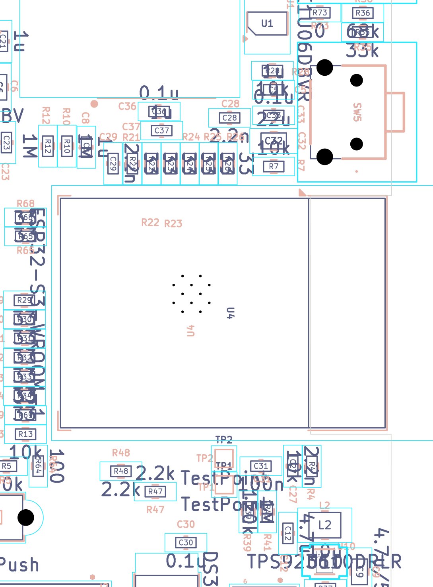

# ESP32-S3-WROOM-1 core: GPIO map, strapping, boot/reset/power buttons, UART test points, antenna

*Final review 2026-09-19 — reviewer key `mcu`, finding prefix `MCU-`. Evidence pack:
`docs/final-review-2026-09-19/evidence/`. All connectivity claims below come from the netlist-derived
`evidence/sch/connectivity_by_component.txt` / `connectivity_by_net.txt`; all coordinates come from
`evidence/pcb/board_extract.json`.*

> **Independently verified 2026-09-20** (verifier key `mcu_verify`). Every BLOCKER/HIGH/MEDIUM and DOC finding was
> re-derived from the netlist, the board extract and the manufacturer datasheets. Severities, numbers and wording
> below are the *post-verification* versions; anything changed is marked, refuted items are struck through but
> kept visible, and the full audit trail is in the **Verification log** at the end of this file.
> Net result: **no BLOCKER and no HIGH item remains in this section.**

## What this part of the board does

`U4` is the brain of the reader: an **ESP32-S3-WROOM-1** module — a small daughter-PCB that already carries
the ESP32-S3 dual-core processor, its flash memory, its PSRAM (extra RAM), a crystal, all the RF matching parts
and a printed Wi-Fi/Bluetooth antenna. The base board only has to give it 3.3 V, a clean reset, and wire its
41 castellated pads to everything else: the e-paper display, the SD card, the touch panel, the front-light
driver, the battery monitor and the USB-C socket.

Three small support circuits belong to this section:

* **EN / reset network** (`R7`, `C5`, `R63`, `SW11`) — holds the module in reset until the 3.3 V rail is stable,
  and lets a user reboot it with a button.
* **Boot-select network** (`R13`, `R64`, `SW6`) — pulls GPIO0 high so the module boots from its own flash; pulling
  it low at reset makes the module wait for new firmware over USB instead. `SW6` is **not fitted** in the
  standard build.
* **Power button** (`SW10`, `R62`, `R76`, `C29`) — a plain momentary button read as a logic input on GPIO18. It is
  *not* a hard power switch; it is the pin the firmware watches to wake from deep sleep and to turn the reader
  "off" in software.

Plus two bare copper pads, **TP1/TP2**, which expose the module's UART0 receive/transmit lines so a serial
adapter can be clipped on for console output.

Jargon, defined once:

* **Strapping pin** — a GPIO whose *voltage at the instant the chip comes out of reset* selects a hardware option
  (boot source, flash voltage, JTAG routing). After reset it becomes an ordinary GPIO.
* **RTC GPIO** — one of GPIO0–GPIO21 on the ESP32-S3. Only these stay alive in deep sleep and can be used as a
  wake-up source.
* **ADC1 / ADC2** — the chip's two analogue-to-digital converters. ADC2 shares hardware with the Wi-Fi radio and
  cannot be read reliably while Wi-Fi is on, so every analogue signal should land on ADC1 (GPIO1–GPIO10).
* **WPU / WPD / IE** — Espressif's notation for "internal weak pull-up / weak pull-down / input buffer enabled"
  in the pin table. A pin with neither WPU nor WPD is *floating* until firmware or an external resistor defines it.
* **DNP** — "do not populate": the footprint is on the board but no part is fitted.

## Circuit walk-through

### Module variant

| Ref | Part / value | Role | Checked against datasheet? |
|---|---|---|---|
| U4 | **ESP32-S3-WROOM-1-N16R8** (Espressif, LCSC C2913202) | MCU module: 16 MB quad SPI flash + **8 MB Octal SPI PSRAM**, on-board PCB antenna, 3.3 V VDD_SPI | Yes — MPN from `connectivity_by_component.txt` line 1088 and `fabrication/part_fields.csv`; variant table WROOM-1 DS v1.8 §1.2 |

The `-R8` suffix is the decisive detail: it means the in-package PSRAM is **Octal** SPI, which consumes chip pins
GPIO33–GPIO37 internally. WROOM-1 DS v1.8 §3.2 footnote b: *"For modules with Octal SPI PSRAM, i.e. modules
embedded with ESP32-S3R8 or ESP32-S3R16V, pins IO35, IO36 and IO37 are connected to the Octal SPI PSRAM and are
not available for other uses."* The schematic marks module pins 28/29/30 (IO35/36/37) as explicit no-connects —
**correct**. VDD_SPI on an N16R8 stays at 3.3 V (the 1.8 V footnote applies only to `-N16R16VA`), so GPIO47/48 are
normal 3.3 V pins here — also correct, they drive `EPD_RST` / `EPD_BUSY`.

### Complete GPIO map

Module pin numbers and pin names are from ESP32-S3-WROOM-1 Datasheet v1.8, Table 3-1 (§3.2 Pin Description).
"At Reset" is the ESP32-S3 Series Datasheet v2.2 Table 2-1 *At Reset* column for the corresponding **chip** pin;
"Glitch" is Table 2-2 *Power-Up Glitches on Pins*.

| Mod pin | GPIO | Net | Function on this board | At reset (DS Table 2-1) | Glitch (Table 2-2) | Notes |
|---|---|---|---|---|---|---|
| 1 | — | GND | Ground | — | — | |
| 2 | — | 3V3 | Supply | — | — | C32 22 µF + C33 0.1 µF local |
| 3 | EN | ESP32_EN | Reset, R7 10 k↑ + C5 1 µF, SW11 via R63 100 Ω | — | — | τ = 10 ms, see Calculations |
| 4 | GPIO4 | BUTTON_ADC_2 | Analogue button ladder #2 (**ADC1_CH3**) | *(blank — Hi-Z, IE off)* | low 60 µs | R28 10 k↑, ladder R11/R35/R36, R61 100 Ω, C28 2.2 nF |
| 5 | GPIO5 | Net-(U4-IO5) → R26 33 Ω → SD_DAT1 | SD data 1 | *(blank)* | low 60 µs | |
| 6 | GPIO6 | Net-(U4-IO6) → R25 33 Ω → SD_DAT0 | SD data 0 | *(blank)* | low 60 µs | |
| 7 | GPIO7 | Net-(U4-IO7) → R24 33 Ω → SD_CLK | SD clock | *(blank)* | low 60 µs | |
| 8 | GPIO15 | Net-(U4-IO15) → R23 33 Ω → SD_CMD | SD command | *(blank)* | low 60 µs (XTAL_32K_P) | chip pin 21 = XTAL_32K_P; OK, module has no 32 kHz crystal |
| 9 | GPIO16 | Net-(U4-IO16) → R22 33 Ω → SD_DAT3 | SD data 3 | *(blank)* | low 60 µs (XTAL_32K_N) | chip pin 22 = XTAL_32K_N; same |
| 10 | GPIO17 | Net-(U4-IO17) → R21 33 Ω → SD_DAT2 | SD data 2 | *(blank)* | low 60 µs | drive strength default 10 mA (DS note 5) |
| 11 | GPIO18 | PWR_BUTTON | Power button input, **RTC GPIO — wake source** | *(blank)* | **low *and* high 60 µs** | R62 10 k, R76 100 k↓, C29 2.2 nF |
| 12 | GPIO8 | BAT_MONIT | Battery voltage divider (**ADC1_CH7**) | *(blank)* | low 60 µs | R10/R12 1 M + C8 1 µF |
| 13 | GPIO19 | DN | **Native USB D−** | *(blank)* | low + 2× high, 3.2 ms total | to J1 A7/B7 and TVS U6.1 |
| 14 | GPIO20 | DP | **Native USB D+** | USB_PU | pull-down + 2× high, 2 ms | to J1 A6/B6 and TVS U6.6 |
| 15 | GPIO3 | Net-(U4-IO3) → R68 33 Ω → UNUSED_GPIO_3 → J6.9 | **Strapping (JTAG source select)**, exported to expansion header | IE, **no pull** | low 60 µs | see MCU-04 |
| 16 | GPIO46 | Net-(U4-IO46) → R65 33 Ω → UNUSED_GPIO_46 → J6.2 | **Strapping (ROM message / boot mode)**, exported | **WPD**, IE | — | internal pull-down defines it |
| 17 | GPIO9 | USB_STAT | USB/charger sense divider (**ADC1_CH8**) | *(blank)* | low 60 µs | |
| 18 | GPIO10 | SD_ACTIVATE | SD card power-gate control → R78 1 k → Q7 gate | *(blank)* | low 60 µs | see MCU-06 |
| 19 | GPIO11 | TP_RST | Touch-panel reset (J4.3, TVS U7.3) — RTC-capable | *(blank)* | low 60 µs | |
| 20 | GPIO12 | Net-(U4-IO12) → R29 33 Ω → SPI_MOSI | Display SPI MOSI | *(blank)* | low 60 µs | |
| 21 | GPIO13 | Net-(U4-IO13) → R30 33 Ω → SPI_SCK | Display SPI clock | *(blank)* | low 60 µs | |
| 22 | GPIO14 | Net-(U4-IO14) → R31 33 Ω → EPD_CS | Display chip select | *(blank)* | low 60 µs | |
| 23 | GPIO21 | Net-(U4-IO21) → R32 33 Ω → EPD_DC | Display data/command | *(blank)* | — | last RTC-capable GPIO |
| 24 | GPIO47 | Net-(U4-IO47) → R33 33 Ω → EPD_RST | Display reset (+R5 10 k) | IE, no pull | — | chip pin 37 SPICLK_P; 3.3 V on N16R8 |
| 25 | GPIO48 | Net-(U4-IO48) → R34 33 Ω → EPD_BUSY | Display busy | IE, no pull | — | chip pin 36 SPICLK_N |
| 26 | GPIO45 | Net-(U4-IO45) → R69 33 Ω → UNUSED_GPIO_45 → J6.3 | **Strapping (VDD_SPI voltage)**, exported | **WPD**, IE | — | see MCU-04 |
| 27 | GPIO0 | ESP32_IO0 | **Strapping (boot mode)**, R13 10 k↑, SW6 (DNP) via R64 100 Ω | **WPU**, IE | — | see MCU-01 |
| 28 | GPIO35 | *no-connect* | Reserved — Octal PSRAM | — | — | correct for N16R8 |
| 29 | GPIO36 | *no-connect* | Reserved — Octal PSRAM | — | — | correct |
| 30 | GPIO37 | *no-connect* | Reserved — Octal PSRAM | — | — | correct |
| 31 | GPIO38 | I2C_SDA | I²C data, R48 2.2 k↑ | *(blank)*, IE after reset | — | |
| 32 | GPIO39 | I2C_SCL | I²C clock, R47 2.2 k↑ | *(blank)*, **MTCK** | — | JTAG pin reused; see MCU-07 |
| 33 | GPIO40 | COLOR_SEL | Front-light colour select → Q5 gate + U12 inverter, R75 100 k↓ | *(blank)*, **MTDO** | — | defined low at reset ✔ |
| 34 | GPIO41 | TP_INT | Touch-panel interrupt (R43/R44 0 Ω to /PIN_2, /PIN_4) | *(blank)*, **MTDI** | — | **not RTC-capable** — see MCU-05 |
| 35 | GPIO42 | PWM_LED | Front-light driver U10 `ADIM` (enable + PWM dimming) | *(blank)*, **MTMS** | — | ADIM has 600 kΩ internal ↓ — see MCU-08 |
| 36 | GPIO44 | RX | UART0 RXD → **TP1** only | **WPU**, IE | — | |
| 37 | GPIO43 | TX | UART0 TXD → **TP2** only | **WPU**, IE | — | |
| 38 | GPIO2 | LED_MONIT | Front-light current sense (**ADC1_CH1**) | IE | low 60 µs | R39 1 M / R41 120 k, C31 100 n |
| 39 | GPIO1 | BUTTON_ADC_1 | Analogue button ladder #1 (**ADC1_CH0**) | IE | low 60 µs | R4 10 k↑, ladder R18/R19/R20, R60 100 Ω, C27 2.2 nF |
| 40 | GND | GND | Ground | — | — | |
| 41 | EPAD | GND | Thermal/ground pad + 12 in-pad vias | — | — | see Layout |

### Support components

| Ref | Part / value | Role | Checked against datasheet? |
|---|---|---|---|
| R7 | 10 k 0603 | EN pull-up to 3V3 | Yes — matches WROOM-1 reference RC |
| C5 | 1 µF 0603 | EN delay capacitor | Yes — esptool docs require 1–10 µF on EN |
| R63 | 100 Ω 0603 | Series resistor, EN ↔ SW11 | Yes — limits C5 discharge current |
| SW11 | APEM MJTP1117 (LCSC C557598) | RESET button (fitted) | Footprint `mjtp1117:MJTP1117` |
| R13 | 10 k 0603 | GPIO0 pull-up to 3V3 | Yes — default = SPI boot |
| R64 | 100 Ω 0603 | Series resistor, GPIO0 ↔ SW6 | Yes |
| SW6 | APEM MJTP1243 THT | BOOT button — **DNP** | `flags=dnp` in netlist; `part_fields.csv` note "BOOT button; not needed (USB-Serial-JTAG)" |
| SW10 | APEM MJTP1117 | POWER button (fitted) | pin 2 → 3V3, pin 1 → R62 |
| R62 | 10 k 0603 | Power-button series resistor | |
| R76 | 100 k 0603 | PWR_BUTTON pull-down to GND | |
| C29 | 2.2 nF 0603 | Power-button RC filter | |
| R72 | 10 k 0603, **DNP** | Optional link PWR_BUTTON → Net-(R36-Pad1) (button-ADC ladder 2) | `flags=dnp` — correctly not fitted |
| C32 | 22 µF 0805 X5R | Module bulk decoupling | Espressif asks for ≥10 µF at the module |
| C33 | 0.1 µF 0603 X7R | Module HF decoupling | |
| C30 | 0.1 µF 0603 | 3V3 decoupling (placed in RTC block) | |
| R47, R48 | 2.2 k 0603 | I²C SCL / SDA pull-ups to 3V3 | See Calculations |
| R21–R26, R29–R34, R65, R68, R69 | 33 Ω 0603 | Series/damping resistors on SD, display SPI and exported GPIOs | 15 of them |
| TP1, TP2 | 1.0 × 1.0 mm test pads | UART0 RX / TX | |

## Where it is on the board & layout notes

Everything in this section is on the **bottom** side (the board has 175 of 183 footprints on B.Cu).
Board outline bounding box: x 44.21 → 104.26 mm, y 36.97 → 148.27 mm.

| Ref | Side | Centre (x, y) mm | Rot | Note |
|---|---|---|---|---|
| U4 | bottom | 57.50, 102.50 | −90° | footprint bbox incl. keep-out: x 29.73 → 71.00, y 92.48 → 112.53 |
| C32 / C33 | bottom | 53.50, 89.01 / 53.50, 87.00 | 0° | ~4.5 mm and ~6.3 mm of track from module pin 2 |
| R7 | bottom | 53.50, 91.01 | 0° | EN pull-up, right at module pin 3 |
| C5 | bottom | 53.50, 85.00 | 0° | EN capacitor, ~8.6 mm from pin 3 |
| R13 | bottom | 73.00, 112.00 | 180° | GPIO0 pull-up, close to module pin 27 |
| R64 | bottom | 72.00, 114.50 | 90° | |
| SW6 (DNP) | bottom | 79.48, 118.53 | 180° | THT 6 × 3.5 mm |
| SW11 (RESET) | bottom | 96.96, 115.52 | −90° | R63 at 87.70, 107.70 |
| SW10 (POWER) | bottom | 101.71, 52.25 | −90° | R62 at 101.20, 66.40; R76 at 75.39, 69.40 |
| TP1 (RX) | bottom | 57.38, 115.96 | | 1 mm square pad |
| TP2 (TX) | bottom | 57.40, 113.90 | | 2.06 mm below TP1 |
| R47 / R48 | bottom | 62.80, 116.50 / 65.50, 114.90 | | I²C pull-ups |

### Module orientation and the antenna cut-out

The module is rotated −90°, so its 25.5 mm long axis lies along **x** and the printed antenna points towards the
**left (−x) edge** of the board. The module's castellated pads occupy x 52.24 → 70.13, y 93.50 → 111.50; the
25.5 mm body therefore runs from x = 57.5 − 12.75 = **44.75** to x = **70.25**, and the ≈ 6 mm antenna section
occupies **x 44.75 → ≈ 50.7, y 93.5 → 111.5** *(corrected by verification: derived from the footprint origin and the
antenna boundary line drawn on the footprint's fab layer; the footprint bbox starts at x 29.73 = 44.75 − 15 mm, which
is KiCad's 15 mm antenna keep-out graphic)*.

The board outline has a deliberate **notch** exactly there. From `board_extract.json` `edge_cuts`:

```
Line (44.2567, 93.3)  -> (50.5853, 93.3)     <- step in from the main left edge
Line (50.5853, 93.3)  -> (50.6,   112.0)     <- new left edge in the antenna band
Line (50.6,   112.0)  -> (44.2713,112.0)     <- step back out
```

The main left edge is at x ≈ 44.24, so this removes a **6.35 mm deep × 18.7 mm tall** bite of substrate from
under the antenna. The antenna zone (x 44.75 → ≈ 50.7) therefore hangs over free air for
essentially its whole length — the notch's inner edge at x = 50.6 is within ≈ 0.1 mm of where the antenna zone ends,
and the module's far end (x 44.75) sits 0.5 mm *inside* the main board edge, so nothing protrudes from the outline. This is exactly Espressif's fallback recommendation
when the antenna cannot be pushed fully off the board edge
(*ESP32-S3 Hardware Design Guidelines > PCB Layout Design*: "cut off the base board on both sides of the antenna
and below it to minimise the impact of the base board material"). **Good design choice — see MCU-14/MCU-15 for
what remains.**



*Bottom-assembly plot of x 41–75 mm, y 78–124 mm (mirrored, as seen looking at the bottom face). The tall white
rectangle on the right is the board cut-out; U4's outline extends into it — that is the antenna hanging over air.
`SW5` sits immediately above the cut-out and `R4`/`L2` immediately below it (MCU-14).*

### Ground pad

Module pin 41 (EPAD) is a 3.9 × 3.9 mm SMD pad at (59.96, 101.0) on net GND, **plus 12 plated through-holes on
GND inside the pad** (0.6 mm pad / drilled, on a 0.7 mm staggered grid) — from `board_extract.json`, U4 pad list.
There are also 9 unnumbered 0.9 × 0.9 mm squares, which are the KiCad footprint's solder-paste grid, not
electrical features. Espressif's layout guide asks for at least nine ground vias under the *chip's* ground pad on chip-down designs; it
gives no number for a module's pad, so treat that as a yardstick only — **12 is comfortably above it**. The holes are
0.2 mm drill / 0.6 mm pad (all other vias on the board are 0.3 mm); JLCPCB lists 0.15 mm as its 2-layer minimum and
charges extra for 0.2 mm holes only when the via pad is under 0.45 mm, so this is buildable as drawn *(added by verification)*.
The GND zone is filled on both F.Cu and B.Cu (6705.85 mm² total, priority 0), so the EPAD connects directly into
the bottom pour and through the 12 holes into the top pour.

### Routing observations

From `evidence/pcb/net_routing_stats.csv`:

| Net | Routed length | Vias | Width | Comment |
|---|---|---|---|---|
| ESP32_EN | 55.0 mm | 2 | 0.20 mm | long for a reset net — reaches SW11 at (96.96, 115.52) |
| ESP32_IO0 | 5.2 mm | 0 | 0.20 mm | short and local ✔ |
| PWR_BUTTON | 87.2 mm | 4 | 0.20 mm | SW10 is at the far top-right corner |
| I2C_SDA | 184.0 mm | 6 | 0.20 mm | see MCU-09 |
| I2C_SCL | 178.6 mm | 5 | 0.20 mm | see MCU-09 |
| BUTTON_ADC_2 | 82.7 mm | 3 | 0.20 mm | high-impedance analogue node |
| BUTTON_ADC_1 | 38.4 mm | 2 | 0.20 mm | |
| TP_INT | 94.8 mm | 2 | 0.20 mm | |
| PWM_LED | 16.4 mm | 0 | 0.20 mm | short ✔ |
| SD_ACTIVATE | 24.8 mm | 2 | 0.20 mm | |
| RX / TX | 5.4 / 5.6 mm | 0 | 0.20 mm | test pads sit right under the module ✔ |
| 3V3 | 379.1 mm | 18 | 0.25 mm | |

## Calculations

**1. EN rise time.** R7 = 10 kΩ to 3V3, C5 = 1 µF to GND.
τ = R·C = 10 000 × 1e−6 = **10 ms**.
ESP32-S3 V_IH = 0.75 × VDD = 0.75 × 3.3 = **2.475 V**.
t(2.475 V) = −τ·ln(1 − 2.475/3.3) = −10 ms × ln(0.25) = **13.9 ms** after the 3.3 V rail is up.
Espressif's WROOM-1 reference design and the esptool documentation both call for 1 µF–10 µF on EN; 10 k / 1 µF is
the canonical value. **Pass.**

**2. Reset button (SW11).** Pressed, C5 discharges through R63 = 100 Ω: τ = 100 × 1e−6 = **100 µs**, so EN is below
V_IL within ~0.3 ms. Steady-state pressed level = 3.3 × 100/(10 000 + 100) = **32.7 mV**, well under
V_IL = 0.25 × 3.3 = 0.825 V. **Pass.**
Peak contact current = 3.3 V / 100 Ω = **33 mA** — comfortable for an MJTP1117 and much kinder to the contacts than
tying the 1 µF directly across the switch. **Good practice.**

**3. Boot button (SW6, if fitted).** Pressed level on GPIO0 = 3.3 × 100/(10 000 + 100) = **32.7 mV** < 0.825 V.
**Pass** — the 100 Ω also protects GPIO0 if firmware ever drives it as an output while the button is held.

**4. Power button (SW10).** Idle: R76 100 k to GND with nothing driving → **0 V**. Pressed: divider 3V3 → SW10 →
R62 10 k → node → R76 100 k → GND:
V = 3.3 × 100 k/(110 k) = **3.00 V** > V_IH 2.475 V. **Pass.**
Current while held = 3.3 / 110 k = **30 µA**; zero when released, so no deep-sleep penalty.
Filter time constant = (10 k ∥ 100 k) × 2.2 nF = 9.09 k × 2.2 n = **20 µs** — enough to kill RF pickup, not enough
to debounce mechanical bounce (typically 1–10 ms). Firmware must debounce.

**5. I²C pull-ups.** R47 = R48 = 2.2 kΩ to 3.3 V.
Sink current at V_OL: 3.3 / 2200 = **1.5 mA** — within the 3 mA that both the ESP32-S3 and the DS3231 guarantee at
V_OL ≤ 0.4 V. **Pass.**
Bus capacitance estimate: 0.2 mm track over a 1.51 mm dielectric with a ground pour gives roughly
0.04 pF/mm (Z₀ ≈ 150 Ω, √ε_eff ≈ 1.73 → C = √ε_eff/(c₀·Z₀) ≈ 38 pF/m), so 184 mm ≈ **7 pF** of track. Add ~10 pF
per attached pin for U4, U13, the two touch-connector stubs and the J6 header ≈ **40–50 pF** worst case.
t_r = 0.8473 · R · C = 0.8473 × 2200 × 50e−12 = **93 ns**, against a 300 ns Fast-mode (400 kHz) limit.
**Pass with ~3× margin.** 4.7 kΩ would also have worked and would halve the static current; 2.2 kΩ is the safer
choice for the long routes actually used.

**6. GPIO42 / front-light driver at reset.** ESP32-S3 DS v2.2 Table 2-1 chip pin 48 (MTMS = GPIO42): the *At Reset*
cell is **empty** — no WPU, no WPD, input buffer off. So GPIO42 is genuinely high-impedance from power-on until
firmware configures it. The TPS923610 `ADIM` pin has R_ADIM_PD = **600 kΩ** internal pull-down (TPS923610
datasheet, Electrical Characteristics, "ADIM pin internal pull down resistor") and V_ADIM_H = **1.2 V**, so ADIM
sits at 0 V and the driver stays in its 130 nA shutdown state. **No backlight flash at boot — pass**, but the node
is defined only by a 600 kΩ resistor (see MCU-08).

**7. GPIO40 / colour-select FET at reset.** GPIO40 (MTDO) is likewise floating at reset; R75 = 100 kΩ to GND holds
COLOR_SEL at **0 V**, so Q5 (BSS138, V_GS(th) 0.8–1.5 V) is off and U12's 74LVC1G04 input is a solid logic 0.
**Pass.**

**8. 3V3 feed resistance to the module.** Track is 0.25 mm wide, 35 µm copper; the traced path from the LDO
(`U3` pin 5) to module pin 2 is **37.3 mm**.
Cross-section A = 0.25e−3 × 35e−6 = 8.75e−9 m²; ρ_Cu = 1.72e−8 Ω·m → **1.97 mΩ/mm**.
R = 37.3 × 1.97 mΩ = **73 mΩ**. At the WROOM-1's ~355 mA peak transmit current the DC drop is
0.355 × 0.073 = **26 mV** — negligible, and the transient demand is served by C32's 22 µF sitting 4.5 mm from the
pin. IPC-2221 gives a 0.25 mm external 1 oz trace roughly 1 A at a 10 °C rise, so there is ~3× thermal margin.
**Electrically fine**, even though it is well under Espressif's 25 mil guidance (MCU-17).

**9. GPIO18 power-up glitch.** ESP32-S3 DS Table 2-2 lists GPIO18 with both a low-level and a **high-level** glitch
of ~60 µs. During the high glitch the pin drives PWR_BUTTON to 3.3 V, charging C29; it then decays through R76:
τ = 100 k × 2.2 nF = **220 µs**, so the node is back below V_IL within ~0.5 ms. Firmware is not running yet, so the
only consequence is 3.3 V briefly appearing on the R62/SW10 branch — harmless. **Pass.**

## Findings

| ID | Severity | Finding | Evidence | Recommendation |
|---|---|---|---|---|
| MCU-01 | **MEDIUM** *(was HIGH — re-graded by verification)* | BOOT button SW6 is DNP, so the only *fitted* route into download mode is the native USB-Serial/JTAG — which is unavailable in exactly the awkward cases (boot-looping firmware, deep sleep, USB pins reconfigured). Recovery without SW6 is possible but fiddly: bridge SW6's two through-holes (pad 2 to pad 1 = GND, 6.5 mm apart) while tapping `SW11` | `connectivity_by_component.txt` SW6 `flags=dnp`; `bom_JLC_upload_v4_optimized.csv` line 70 "DNP (standard build)"; ESP-IDF USB-Serial/JTAG console guide, *Limitations* (re-fetched and confirmed by the verifier) | Fit SW6 on every prototype. It is a THT part on an existing footprint and costs cents |
| MCU-13 | **MEDIUM** *(was HIGH — re-graded: the facts are all confirmed, but this is a firmware porting task that changes nothing on the PCB order)* | The sibling firmware repo's `DE_LINK` board profile and `[env:delink]` build **do not match this PCB** — neither the PSRAM type nor a single GPIO assignment | `crosspoint-reader-de-link/freeink-sdk/libs/hardware/BoardConfig/include/BoardConfig.h` line 1122 (`BoardProfile DE_LINK`) and line 743 (`DE_LINK_FRONTLIGHT`); `crosspoint-reader-de-link/platformio.ini` `[env:delink]` lines 257–264. Every value in the comparison table below was re-read from those files by the verifier | Do not flash the stock `delink` build onto this board. Create a new `BoardProfile` + PlatformIO env with `memory_type = qio_opi` and this board's pin map **before the first firmware flash** |
| ~~MCU-02~~ | ~~MEDIUM~~ → **NONE** | ~~DS3231MZ `U13` has VCC tied to GND and VBAT tied to 3V3; auditor could not reach the datasheet to confirm this is legal~~ — **refuted by verification: the wiring is a documented datasheet configuration.** DS3231M datasheet (Maxim 19-5312 Rev 5): the VCC pin description (p. 7) says to ground VCC when it is unused; *Power-Supply Configurations* (p. 8) and Figure 5 describe single-supply operation from VBAT only with the VCC input grounded; the I²C timing table applies for VCC *or* VBAT = 2.3–5.5 V | netlist U13 pin 2 → GND, pin 6 → 3V3; `C30` 0.1 µF sits on 3V3 beside U13, which satisfies the datasheet's request for 0.1–1.0 µF on VBAT when VBAT is the primary supply | None — moved to "Checked and found OK". Two datasheet consequences for firmware (p. 10): the oscillator does not start until the first valid I²C address is written, and the time/date registers reset to 01/01/00 at that moment. Bonus: in this mode the RTC idles at ≈ 2–3 µA instead of VCC-mode standby current |
| MCU-04 | **LOW** *(was MEDIUM — re-graded by verification)* | All three "spare" GPIOs exported to expansion header J6 are strapping pins (GPIO3, GPIO45, GPIO46) with only 33 Ω series resistors; GPIO3 has no internal pull and floats. **Verification correction:** on *this module* none of the three can stop a normal boot — GPIO45 is ignored because PSRAM modules have VDD_SPI fixed by eFuse (WROOM-1 DS v1.8 §8 schematic note), GPIO3 is ignored while `EFUSE_STRAP_JTAG_SEL` = 0 (factory default, WROOM-1 DS Table 4-5), and GPIO46 is "any value" whenever GPIO0 is high (Table 4-3) | netlist nets `UNUSED_GPIO_3/45/46`; ESP32-S3 DS Table 2-1 chip pins 8/51/52; WROOM-1 DS v1.8 §4 Tables 4-1, 4-3, 4-5 and §8 | No hardware change needed. Have firmware enable the internal pull-down on GPIO3 when J6 is unused, and tell add-on builders only that J6 pin 2 (GPIO46) must not be held high *while download mode is being entered* |
| MCU-14 | MEDIUM *(confirmed; coordinates corrected)* | Metal and copper sit ~1 mm from the module's PCB antenna on both flanks: right-angle tactile switch **SW5** (it has a grounded metal cover; courtyard y 81.2 → **92.27**, cover/contact holes at about x 49.5, y 83–90) is 1.2 mm from the antenna band, and **R4** (bbox y 112.84 →) is 0.84 mm below the notch. Boost inductor **L2** (and the TPS923610 switch node next to it) is 6.3 mm away | `board_extract.json` bboxes; antenna zone is x 44.75 → ≈ 50.7, y 93.5 → 111.5; notch is x 44.26 → 50.6, y 93.3 → 112.0. Espressif asks for 15 mm clearance in all directions. Verifier's own crop of the area confirms the picture | Accept for the prototype but **measure** RSSI/throughput, with the front-light both off and on. SW5's position is probably dictated by the enclosure, so this is likely an "accept knowingly" item; R4 and L2 can move in a later spin |
| MCU-15 | **LOW** *(was MEDIUM — re-graded by verification)* | The F.Cu and B.Cu ground pours are barely stitched anywhere near the antenna: **0 GND vias** in x 50–58, y 90–115, and only **2** in the whole module footprint region (via counts reproduced exactly by the verifier). Re-graded because this is RF hygiene with no demonstrated functional impact — the category the owner's brief says to keep below MEDIUM — but it is free, so do it anyway if the layout is reopened | `board_extract.json` vias (188 total, 68 on GND; the two are at (55.5, 89.0) and (68.9, 113.6)); Espressif PCB Layout Design asks for ground copper and dense ground vias on the base board near the antenna | Add a row of GND stitching vias (≈ 2–3 mm pitch) along the notch edge at x ≈ 51–52 and around the module's three pad rows |
| MCU-03 | LOW *(documented)* | The DS3231 alarm output `INT/SQW` is a no-connect, so the external RTC **cannot wake the ESP32** from deep sleep | `connectivity_by_component.txt` U13 pin 3 `-> unconnected-(U13-~{INT}/SQW-Pad3)`; already stated in `docs/HARDWARE.md` §10 item 2 | Accept — the designer has documented this. If timed wake from the precision RTC is ever wanted, route INT/SQW to a free **RTC-capable** GPIO (GPIO0–21) |
| MCU-05 | LOW *(documented)* | Touch-panel interrupt is on **GPIO41, which is not RTC-capable** (RTC GPIOs are GPIO0–21), so a touch cannot wake the board from deep sleep | `connectivity_by_net.txt` TP_INT → U4.34 (IO41); ESP32-S3 DS §2.3.3; already flagged in `docs/HARDWARE.md` §13 | Accept (power button is the wake source). A future spin could swap TP_INT (GPIO41) and TP_RST (GPIO11) at zero cost, since GPIO11 *is* RTC-capable |
| MCU-06 | LOW | `SD_ACTIVATE` (GPIO10) has a documented 60 µs low-level power-up glitch, which briefly turns the SD power FET **on** before the MCU has booted. Also, the net name implies active-high but the circuit is **active-low**. **Verification correction:** with Q7 on (tens of mΩ) the 1.1 µF on SD_VDD charges in about a microsecond, so SD_VDD *does* reach the rail during the glitch and then bleeds away through R77 100 kΩ (τ ≈ 110 ms with no card). The card sees one short, slowly-decaying supply pulse before its real power-up — harmless, but it is not "too short to matter", and C36/C37 are the cause of the inrush, not a limit on it | ESP32-S3 DS Table 2-2 (GPIO10 low glitch, 60 µs); netlist `SD_ACTIVATE → R78 1 k → Net-(Q7-G)`, `Q7 = AO3401A` **P-channel**, S = 3V3, D = SD_VDD, `R40 100 k → 3V3`, `R77 100 k` SD_VDD → GND | Accept. Rename the net `SD_PWR_N` (or similar) so nobody drives it the wrong way in firmware, and have firmware hold SD power off for ≥ 0.5 s before the first real power-up so the card always sees a clean cycle |
| MCU-07 | LOW | All four JTAG pins (GPIO39/40/41/42 = MTCK/MTDO/MTDI/MTMS) are used for I²C, colour-select, touch-INT and backlight PWM, so hardware JTAG debug is unavailable | GPIO map above; ESP32-S3 DS §2.3.4 | Accept — the USB-Serial/JTAG controller provides debug over GPIO19/20. Note that GPIO39 = MTCK gains a weak pull-up after reset when EFUSE_DIS_PAD_JTAG = 0; harmless against the 2.2 k I²C pull-up |
| MCU-08 | LOW | The front-light enable/PWM line (GPIO42 → U10 ADIM) is defined only by the TPS923610's 600 kΩ internal pull-down while the MCU is in reset | TPS923610 datasheet R_ADIM_PD = 600 kΩ, V_ADIM_H = 1.2 V; ESP32-S3 DS Table 2-1 chip pin 48 | Optional: add a 100 kΩ 0603 pull-down on PWM_LED near U10 for a hard-defined off state |
| MCU-09 | LOW | I²C runs 184 mm (SDA) / 179 mm (SCL) of 0.2 mm track with 5–6 vias each — electrically fine at 100–400 kHz but a large radiating loop | `net_routing_stats.csv` | Keep for this spin. CERT-LATER if EMC is pursued |
| MCU-10 | LOW | TP1/TP2 (UART0) have **no adjacent ground pad**, and the nearest module GND pin is a castellation under the module | `board_extract.json` TP1 (57.38, 115.96), TP2 (57.40, 113.90); no GND test point within 5 mm | Add a third 1 mm GND pad next to TP1/TP2 in a future spin so a 3-wire serial lead can clip on |
| MCU-11 | LOW | U4's silkscreen outline is clipped by the antenna notch in three places (DRC `silk_edge_clearance`) | `drc.json`, segments of U4 on B.Silkscreen at (44.60, 93.3) and (44.60, 111.7) vs Edge.Cuts | Cosmetic; trim the silkscreen rectangle to the board outline |
| MCU-16 | LOW | The 0.1 µF HF decoupling cap (C33) is **farther** from module pin 2 than the 22 µF bulk cap (C32) — 6.34 mm vs 4.50 mm of routed track | `board_extract.json` C32 (53.50, 89.01), C33 (53.50, 87.00), U4 pin 2 (53.51, 93.50); traced path lengths from `pcbnew` | Swap the two positions so the small cap is closest. Low impact — the WROOM-1 carries its own on-module decoupling |
| MCU-17 | LOW / CERT-LATER | The 3V3 feed to the module is a 0.25 mm track, 37 mm long. **Verification correction:** Espressif's trace-width numbers (25 mil for main power, 20 mil at VDD3P3 pins 2 and 3) are written for chip-down designs — pins 2/3 there are ESP32-S3 *chip* supply pins (on the module, pin 3 is EN) — so there is no Espressif figure for a module feed. The finding stands on its own arithmetic only | `net_routing_stats.csv` 3V3 max width 0.25 mm; measured LDO→module path 37.3 mm; 73 mΩ, 26 mV at the datasheet's 355 mA peak TX current (WROOM-1 DS v1.8, RF current table — confirmed) | Accept for the prototype. Widen to ≥ 0.5 mm in a future spin |
| MCU-18 | LOW | The three unused octal-PSRAM pads (module pins 28/29/30) sit **directly between** `ESP32_IO0` (pin 27) and `I2C_SDA` (pin 31) on the same 1.27 mm pad row. A hand-soldering bridge from pin 28 to pin 27, or pin 30 to pin 31, would tie a live PSRAM data line to the boot strap or the I²C bus | `board_extract.json`: pin 27 (68.75, 111.50), pin 28 (67.48, 111.50), pin 29 (66.21), pin 30 (64.94), pin 31 (63.67), all `size [2.0, 0.9]` | Inspect those five joints under magnification after reflow / hand-soldering. Worth one line in the assembly notes |
| MCU-V01 | LOW *(added by verification)* | Nothing tells a hand-assembler that the module's centre ground pad (pin 41, EPAD) **does not have to be soldered**. It is unreachable with a soldering iron, and an amateur replicating the board could conclude that a hot-air / reflow setup is mandatory, or flood the pad with paste and lift the module off its 40 edge pads | WROOM-1 DS v1.8 §9 *Peripheral Schematics*, first note: soldering the EPAD to the base-board ground "is not a must", it only improves thermal performance, and too much paste can increase the module-to-board gap so that the other pins solder poorly. Pins 1 and 40 are also GND (netlist), so the module is grounded without pin 41. The land has 12 open 0.2 mm through-holes, which also lets an iron on the *top* face heat the pad if someone wants it soldered | Add one line to the assembly notes: "U4 pin 41 (centre pad) is optional — edge pads only is fine for hand assembly; if pasting it, use a sparse paste pattern". No board change |
| MCU-12 | CERT-LATER | No series resistor on U0TXD; Espressif's layout guide asks for one placed close to the chip | ESP32-S3 Hardware Design Guidelines > PCB Layout Design | Ignore for the prototype |
| MCU-19 | DOC | `docs/HARDWARE.md` states in three places that **"IO46 is input-only"**. It is not — GPIO46 is a full bidirectional I/O on the ESP32-S3 | ESP32-S3 DS v2.2 Table 2-1 chip pin 52: Type = **IO**; Table 2-4: `GPIO46 I/O/T`. WROOM-1 DS v1.8 Table 3-1 pin 16: Type **I/O/T** | Correct §4, §11 and §13. (The ESP32-*classic* GPIO34–39 and the ESP32-S2's GPIO46 are input-only; the S3's is not) |
| MCU-20 | DOC | `docs/HARDWARE.md` §9.2 calls **"`R72`/`R73`/`R74` … 0 Ω configuration jumpers"**. `R72` is 10 kΩ | `connectivity_by_component.txt`: R72 `value=10k`, `MPN=RC0603FR-0710KL`; R73/R74 are `value=0`, `RC0603JR-070RL` | Reword to "`R73`/`R74` are 0 Ω jumpers; `R72` is a 10 kΩ link" |
| MCU-21 | DOC | Neither `docs/HARDWARE.md` nor `README.md` mentions the **antenna cut-out** at all — the single most RF-critical feature of the outline, and a hard mechanical constraint on any enclosure or battery placement | `grep -i "antenna\|keepout\|notch\|cut-out"` over both files returns only two hits, both about the SD connector | Add a short subsection: where the antenna is, that the 6.35 × 18.7 mm notch at x 44.2–50.6 / y 93.3–112.0 must stay empty, and that no battery, metal foil or standoff may sit over or beside it |
| MCU-22 | DOC | `README.md` line 190 calls `SW10` a **"power switch"**, while `docs/HARDWARE.md` §9.2 correctly explains it is a wake input and *not* a true power switch | Netlist: SW10 → R62 → GPIO18; no latch circuit anywhere on the net | Use "power/wake button" consistently. A reader who believes it is a power switch will expect the board to draw nothing when "off" |

### MCU-01 — no fitted way into download mode (MEDIUM — was HIGH)

> **Verification note.** All facts confirmed (SW6 `flags=dnp`; the three ESP-IDF limitations were re-fetched and say
> what is claimed). Re-graded to MEDIUM because nothing is damaged, no rework is needed beyond soldering one
> through-hole part, `SW11` (reset) *is* fitted, and `docs/HARDWARE.md` §9.3 already tells the builder that recovery
> means grounding `IO0` by hand. The case the docs under-sell is a **boot-looping** or instantly-sleeping firmware,
> where the USB device re-enumerates faster than `esptool` can catch it — on a first spin that *will* happen, which
> is why the recommendation (fit it) is unchanged.

`SW6` is the BOOT button. The netlist marks it `flags=dnp`, the JLC BOM line reads "APEM MJTP1243 **DNP (standard
build)**", and `fabrication/part_fields.csv` explains the reasoning: *"BOOT button; not needed
(USB-Serial-JTAG)"*. That reasoning is correct **most of the time** — the ESP32-S3's built-in USB-Serial/JTAG
peripheral on GPIO19/20 can put the chip into download mode by itself, as the ESP-IDF guide says: *"The USB
Serial/JTAG Controller is able to put the ESP32-S3 into download mode automatically."*

The problem is the cases where it cannot, all of which the same guide lists:

* **Deep sleep** — *"When entering Deep-sleep, the USB Serial/JTAG device appears disconnected from the host/PC
  (even if the USB cable is still physically connected)."* An e-reader is *designed* to spend most of its life in
  deep sleep. If the firmware sleeps a second after boot, the flashing window is a second wide.
* **Reconfigured USB pins** — *"If the application accidentally reconfigures the USB peripheral pins or disables
  the USB Serial/JTAG Controller, the device disappears from the system."*
* Recovery in both cases is explicit: *"you need to manually put the ESP32-S3 into download mode by pulling low
  GPIO0 and resetting the chip."* With SW6 unfitted there is no button to do that.

You are not fully bricked — `SW6`'s through-hole pads are on the board, so you can short SW6 pad 2 to GND with
tweezers while pressing `SW11`. But on a first prototype spin, where firmware *will* crash and *will* be
rewritten dozens of times, a 6 mm tactile switch is the cheapest insurance on the whole board. **Fit it.**

### MCU-13 — the sibling firmware does not match this board (MEDIUM — was HIGH)

> **Verification note.** Every row of the table below was re-read from `BoardConfig.h` and `platformio.ini` and is
> correct. Re-graded to MEDIUM because it is a firmware porting task: nothing on the PCB changes and it does not gate
> the order — it gates the **first flash**. Corrections to the hazard analysis: (1) the datasheet figures are
> I_OH = 40 mA and I_OL = **28 mA**, and they are *typical drive capability*, not damage limits (the only absolute
> maximum is 1500 mA cumulative, DS Table 5-1); 3.3 V / 33 Ω = 100 mA is an upper bound that ignores both drivers'
> own output resistance, so real contention current would be a few tens of mA. (2) The auditor missed the more
> visible side-effects of a mis-flash: the stock profile's SDMMC D2 is GPIO42, which here is `PWM_LED` → the
> front-light driver's enable, so the **front-light would come on at full brightness**; its display SCLK is GPIO10,
> which here is the **SD-card power gate**, so the card's supply would be chopped at SPI clock rate; and two of the
> mis-driven nets have **no series resistor at all** — GPIO38 = `I2C_SDA` (straight to the DS3231 and J6) and
> GPIO41 = `TP_INT` (0 Ω `R44` to the touch connector). With Arduino's PSRAM-not-found tolerance the wrong
> `qio_qspi` mode most likely logs a PSRAM error and carries on rather than halting, so assume the wrong pin map
> *will* run. None of this is likely to destroy anything, but it would look like a dead board.

`../crosspoint-reader-de-link` (the author's firmware repository, a sibling folder) builds an env named
`delink` by default. Its `BoardProfile DE_LINK` (BoardConfig.h line 1122) and `[env:delink]` describe **different
hardware** — almost certainly the retail "de-link" reader that this PCB is a replacement mainboard for, not this
PCB. Every line disagrees:

| Item | Firmware `DE_LINK` | This PCB (netlist) |
|---|---|---|
| PSRAM / flash mode | `memory_type = qio_qspi`, comment: *"16MB flash + 2MB QUAD (QSPI) PSRAM … an octal board (e.g. -n16r8) would **fail PSRAM init** on this quad part"* | **ESP32-S3-WROOM-1-N16R8** — 16 MB flash + **8 MB Octal** PSRAM → needs `qio_opi` |
| Display SCLK / MOSI / CS / DC / RST / BUSY | 10 / 9 / 11 / 12 / 13 / 14 | **13 / 12 / 14 / 21 / 47 / 48** |
| SDMMC CLK / CMD / D0 / D1 / D2 / D3 | 39 / 40 / 38 / 48 / 42 / 41 | **7 / 15 / 6 / 5 / 17 / 16** |
| Battery ADC | GPIO4 | **GPIO8** (GPIO4 here is button ladder 2) |
| Charger STAT | GPIO8 | **GPIO9** (GPIO8 here is the battery ADC) |
| Frontlight bright / warm / cool / rail gate | 5 / 6 / 7 / 17 | **PWM_LED = GPIO42, COLOR_SEL = GPIO40** (5/6/7/17 here are the SD bus) |
| Power button | `{0,1,2,3,4,5,3,true}` | **GPIO18** |
| Touch | `NO_TOUCH` | J4 connector, TP_INT **GPIO41**, TP_RST **GPIO11** |

Flashing the stock `delink` build onto this board would (a) fail PSRAM initialisation outright, and (b) if it got
past that, drive **GPIO48** as an SDMMC data output while the e-paper panel is driving the same net as `EPD_BUSY`.
That is output-against-output contention; the 33 Ω series resistor `R34` caps the current at
3.3 V / 33 Ω = **100 mA**, against the ESP32-S3's typical I_OH of **40 mA** / I_OL of **28 mA** (DS v2.2 Table 5-4 — drive capability, not a
damage limit; see the verification note above). It would also
drive GPIO40 (`COLOR_SEL`, the BSS138 gate) at bus speed.

The 33 Ω resistors on every bus line are what keeps this from being a destroyed board — good design. But the
firmware needs a new `BoardProfile` and a new PlatformIO env before anything is flashed.

### MCU-14 / MCU-15 — the antenna (MCU-14 MEDIUM, MCU-15 LOW — was MEDIUM)

> **Verification note.** Geometry, via counts and the three Espressif quotations were all re-checked and hold; the
> antenna-zone coordinates were corrected (x 44.75 → ≈ 50.7, essentially all of it over the notch). The released
> gerbers carry the notch: `evidence/gerber_fresh/COMPARISON.txt` reports `Edge_Cuts.gm1` identical to the production
> zip. One of the auditor's open questions is partly answered by the outline itself: the board is L-shaped and the
> battery bay is the large cut-away at x 45–81, y 37–67.5, so a cell that stays inside its bay is ≥ 25 mm from the
> antenna. What still nobody can answer from the design data is what the **display panel and its FPC** put over the
> notch from the top side.

The module placement itself is **right**: the antenna points at the board edge, and a 6.35 × 18.7 mm notch has
been cut out of the outline so essentially the whole ≈ 6 mm antenna zone (x 44.75 → ≈ 50.7) hangs over free air (see
`img/mcu_antenna_keepout.png` — the white rectangle is the cut-out, U4's outline extends into it). That is
Espressif's documented fallback when the module cannot be pushed fully off the board, and it was done properly.

What is left are two second-order problems.

**MCU-14 — metal in the antenna's flanks.** The notch is exactly as tall as the module (y 93.3 → 112.0 vs the
module's 93.5 → 111.5), so board material, ground copper and components resume within a fraction of a millimetre
above and below the antenna:

* `SW5` (a THT tactile switch with a metal dome and 1.0–1.3 mm plated holes) occupies x 42.2 → 51.7,
  y 81.2 → **92.27**. Its x-range sits directly over the antenna's x-range and its edge is **1.2 mm** from the
  antenna band.
* `R4` occupies x 49.74 → 51.25, y **112.84** → 116.19 — **0.84 mm** below the band, again in the antenna's x-range.
* `L2`, the 10 µH boost inductor for the front-light, is at (49.48, 119.13) — **6.3 mm** away and in line with the
  antenna. A switching inductor that close is both a detuning mass and a noise source in the receiver's band.
* The SD socket shell (`J7`, bbox x 56.1 → 73.5, y 69.3 → 86.4) comes within about **8.6 mm**.

Espressif asks for 15 mm clear in all directions. None of this is fatal — Wi-Fi will work — but expect measurably
reduced range and a shifted resonance. Measure it before blaming the firmware.

**MCU-15 — no ground stitching near the antenna.** The board has 188 vias, 68 of them on GND, but **none at all**
in the x 50–58 / y 90–115 window and only **two** anywhere in the module's surroundings (x 44–72, y 88–116).
On a 2-layer board the top and bottom ground pours around the antenna cut-out are therefore joined only through
the module's own 12 EPAD through-holes. Espressif's layout guide explicitly asks for "dense ground vias" next to
an antenna cut-out. A row of GND vias along the notch edge at x ≈ 51–52 mm, and a ring around the module's three
pad rows, costs nothing at fab and is the highest-value RF change available on this board.

### MCU-04 — strapping pins on the expansion header (LOW — was MEDIUM)

> **Verification note.** The netlist facts and the reset states (GPIO3 no pull; GPIO45/46 weak pull-down) are
> confirmed. Two consequences stated below were **wrong for this module** and have been corrected in place: GPIO45
> cannot switch VDD_SPI on a module with PSRAM, and GPIO3 is not read at all with factory eFuses. The external
> 100 kΩ on GPIO3 is therefore not needed.

The three "spare" GPIOs brought out to `J6` are GPIO3 (pin 9), GPIO45 (pin 3) and GPIO46 (pin 2). All three are
**strapping pins**:

* **GPIO45** nominally sets the VDD_SPI voltage. It has an internal weak pull-down at reset (DS Table 2-1 chip pin 51:
  `WPD, IE`). ~~Anything on the header that pulls it high at reset switches the flash/PSRAM rail to 1.8 V and the
  module will not boot.~~ — *refuted by verification:* the WROOM-1 datasheet's module-schematic note (§8) states that
  on modules **with PSRAM** the VDD_SPI voltage is fixed by eFuse and is not affected by the GPIO45 level. The N16R8
  is such a module, so this strap is inert here.
* **GPIO46** sets boot mode together with GPIO0 (and ROM message printing). Also `WPD, IE` — defined by default.
* **GPIO3** *can* select the JTAG signal source, but only when `EFUSE_STRAP_JTAG_SEL` has been burnt to 1 (WROOM-1 DS
  Table 4-5); with factory eFuses the pin is **ignored** and JTAG defaults to the USB-Serial/JTAG controller. Its
  At-Reset cell is `IE` with **no pull at all**, so on this board it is a floating CMOS input on an ~86 mm net with a
  33 Ω resistor, a TVS diode and an exposed header pin. That costs nothing functionally; a floating enabled input can
  add a little supply current, which one line of firmware (enable the internal pull-down) removes.

None of this stops the prototype working with nothing plugged into J6. Configure a pull-down on GPIO3 in firmware
at start-up, and in the documentation reduce the J6 strapping warning to the one case that is real on this module:
pin 2 (GPIO46) must not be held high while download mode is being entered (GPIO0 low + GPIO46 high is an invalid
combination).

### MCU-05 — touch interrupt cannot wake the board (LOW, documented)

`TP_INT` lands on module pin 34 = **GPIO41**. The ESP32-S3's RTC domain only covers GPIO0–GPIO21 (DS v2.2 §2.3.3),
so GPIO41 is dead during deep sleep and cannot be an `ext0`/`ext1` wake source. Waking the reader therefore
depends entirely on the power button (GPIO18 — correctly RTC-capable) or the internal timer. If "tap the screen
to wake" was ever intended, it is not possible with this wiring. `TP_RST` on GPIO11 *is* RTC-capable, so if a
future spin swaps TP_INT and TP_RST the problem disappears at no cost.

### MCU-02 / MCU-03 — the external RTC (MCU-02 refuted; MCU-03 LOW, documented)

These belong to the HMI/RTC reviewer (`U13` is in block `13_external_rtc`, sliced into `blocks/hmi.md`) but they
sit on the I²C bus this section owns, so they are recorded here.

* ~~The schematic connects pin 2 (VCC) to GND and pin 6 (VBAT) to 3V3. If the pin names are right, the DS3231 will be
  running permanently in battery-backup mode, where the I²C interface is not available — the RTC simply will not
  answer on the bus.~~ — **refuted by verification.** The verifier obtained the DS3231M datasheet (Maxim 19-5312
  Rev 5). Its *Power-Supply Configurations* section (p. 8) lists three legal arrangements, and Figure 5 is exactly
  this one: single supply on VBAT with the VCC input grounded. The pin table (p. 7) says to ground VCC when unused,
  the I²C timing table is specified for VCC *or* VBAT = 2.3–5.5 V, and Table 1 gives the active (I²C) and timekeeping
  currents for the VBAT-only case. `docs/HARDWARE.md` §10 describes all of this correctly, including the two
  firmware-visible consequences (p. 10): the oscillator starts only after the first valid I²C address is written, and
  the time/date registers reset at that moment. In VBAT-only mode the RST output is disabled and temperature
  conversions run every 10 s instead of every second. The payoff is a ≈ 2–3 µA always-on RTC. **No action.**
* `INT/SQW` (pin 3), `32KHZ` (pin 1) and `RST` (pin 4) are all no-connects, so the RTC's alarm output goes nowhere:
  a scheduled wake from the precision RTC is impossible and deep-sleep timing comes from the ESP32's own (far less
  accurate, temperature-sensitive) RTC timer. Documented by the designer as a knowing trade-off (MCU-03).

### MCU-07 — JTAG pins reused (LOW)

GPIO39/40/41/42 are MTCK/MTDO/MTDI/MTMS. All four carry board functions here (I²C_SCL, COLOR_SEL, TP_INT,
PWM_LED), so a hardware JTAG probe cannot be attached. This is normal and fine — the USB-Serial/JTAG controller on
GPIO19/20 gives you JTAG debugging over the USB-C connector instead. One consequence worth knowing: per DS
Table 2-1 footnote 7, MTCK (**GPIO39 = I2C_SCL**) gains an internal weak pull-up after reset when
`EFUSE_DIS_PAD_JTAG = 0` (the factory default). Against R47's 2.2 kΩ external pull-up that is harmless.

### MCU-10 — no ground next to the UART pads (LOW)

`TP1` (RX) at (57.38, 115.96) and `TP2` (TX) at (57.40, 113.90) are 1 mm square pads 2.06 mm apart. There is no
ground pad near them, and the nearest module ground is a castellation *under* the module. Clipping a USB-serial
adapter on therefore means finding a ground somewhere else on the board. A third 1 mm pad on GND next to them
would make console debugging a one-clip operation.

## Checked and found OK

* **Module variant vs pin usage.** `ESP32-S3-WROOM-1-N16R8` has Octal PSRAM, so module pins 28/29/30
  (IO35/IO36/IO37) are unusable. The schematic marks all three with explicit no-connect flags and annotates them
  "PSRAM" on the sheet. **Correct, and correctly documented on the schematic.**
* **VDD_SPI voltage.** N16R8 keeps VDD_SPI at 3.3 V (the 1.8 V footnote applies only to `-N16R16VA`), so GPIO47 and
  GPIO48 are ordinary 3.3 V pins. They drive `EPD_RST`/`EPD_BUSY` at 3.3 V. **Correct.**
* **Every analogue signal is on ADC1.** BUTTON_ADC_1 = GPIO1 (ADC1_CH0), BUTTON_ADC_2 = GPIO4 (ADC1_CH3),
  BAT_MONIT = GPIO8 (ADC1_CH7), USB_STAT = GPIO9 (ADC1_CH8), LED_MONIT = GPIO2 (ADC1_CH1). **Not one of them is on
  ADC2**, so none of them break when Wi-Fi is on. This is the single most commonly botched thing on ESP32-S3
  boards and it is right here.
* **Native USB is on the right pins.** D− = GPIO19 (module pin 13), D+ = GPIO20 (module pin 14), matching the
  ESP-IDF USB-Serial/JTAG hardware requirement exactly. No series resistors or pull-ups added — correct, the
  controller provides its own.
* **GPIO0 boot strap.** R13 10 kΩ to 3V3 with a 100 Ω series resistor to the (unfitted) button. Default = SPI boot.
  **Correct.**
* **EN network.** 10 kΩ / 1 µF is Espressif's own recommended value; τ = 10 ms gives ~14 ms of reset hold after the
  rail is up. The 100 Ω in series with SW11 limits contact current to 33 mA and gives a 100 µs discharge.
  **Correct and well thought out.**
* **Power button levels.** 3.00 V when pressed against a 2.475 V threshold, 0 V idle, 30 µA only while held, and it
  lands on **GPIO18 — an RTC GPIO**, so it can actually wake the board from deep sleep. **Correct.**
* **Boot-time state of every external circuit the MCU gates.**
  * Front-light driver (GPIO42 → TPS923610 ADIM): GPIO42 is floating at reset; ADIM's 600 kΩ internal pull-down
    holds it low → driver stays in 130 nA shutdown. **No backlight flash at power-up.**
  * Colour-select FET (GPIO40 → Q5 + U12): R75 100 kΩ pull-down holds it at 0 V → Q5 off, inverter input a clean
    logic 0. **Defined.**
  * SD power gate (GPIO10 → R78 → Q7 gate): Q7 is a **P-channel** AO3401A with R40 100 kΩ to 3V3, so the card is
    **unpowered** while GPIO10 is floating. **Safe** (with the 60 µs caveat in MCU-06).
  * Display reset (GPIO47 → EPD_RST): R5 10 kΩ pull-up to 3V3 holds the panel out of reset. **Defined.**
* **No IO35/36/37 nets.** Confirmed by searching `connectivity_by_net.txt`: the only nets touching those pins are
  `unconnected-(U4-IO35-Pad28)` etc., each with exactly one node.
* **Module ground pad.** Pin 41 is a 3.9 × 3.9 mm pad **plus 12 plated through-holes on GND**, against Espressif's
  "at least nine ground vias". **Compliant.** The 9 unnumbered 0.9 mm squares are the footprint's paste grid.
* **Decoupling.** C32 22 µF + C33 0.1 µF on 3V3 at the module, meeting Espressif's "10 µF, optionally with 0.1 µF
  or 1 µF in parallel". (Ordering nit in MCU-16.)
* **I²C pull-ups.** 2.2 kΩ each: 1.5 mA sink, ~93 ns rise time against a 300 ns Fast-mode budget. **Comfortable.**
* **Analogue filter caps are placed near the module.** C29 (power button, 2.2 nF) is 3.0 mm from module pin 11 —
  the schematic note "2.2n cap placed near ESP32" is honoured. C27 3.3 mm from pin 39, C31 3.0 mm from pin 38,
  C8 4.5 mm from pin 12. C23 is 9.9 mm from pin 17, which is the loosest but still acceptable.
* **Touch-connector jumper muxes are consistently set.** Exactly one of each 0 Ω pair is fitted: R42
  (3V3 → J4.2), R44 (TP_INT → J4.4), R46 (I2C_SDA → J4.5), R52 (I2C_SCL → J4.6); R43, R45, R58 and R66 are DNP
  *(list corrected by verification — the auditor had R42 as DNP and omitted R45; the conclusion is unchanged)*. No two functions are shorted
  together.
* **R72 (10 kΩ, DNP)** would tie PWR_BUTTON into the BUTTON_ADC_2 ladder. It is correctly *not* fitted, so GPIO18
  is a clean standalone digital input.
* **DRC.** No clearance error anywhere in this section. The only DRC items naming U4 or the buttons are
  `silk_edge_clearance` warnings (MCU-11). The 15 clearance errors in the board all belong to `J1` (USB-C pad
  pitch) and `J3`.
* **GPIO15/GPIO16 used as SD_CMD/SD_DAT3** — these are the chip's XTAL_32K_P/N pins. The WROOM-1 has no 32 kHz
  crystal fitted, so reusing them as GPIO is legitimate.
* **Series resistors.** Fifteen 33 Ω resistors on the SD bus, display SPI and every exported GPIO. Good practice:
  they damp edges and, as MCU-13 shows, they are what stops a firmware pin-map mistake from destroying a pin.

Added by verification:

* **DS3231M supply wiring (was MCU-02).** VCC → GND, VBAT → 3V3 is the datasheet's Figure 5 "VBAT only" single-supply
  configuration; I²C works in it. `C30` 0.1 µF provides the VBAT decoupling the datasheet asks for. **Correct.**
* **Whole module pin map re-checked.** All 41 symbol pin names/numbers were compared one by one against WROOM-1 DS
  v1.8 Table 3-1 (the KiCad symbol is right), and every ADC1 channel number quoted in this file matches that table.
* **33 Ω series resistors are at the source end.** R21–R26 sit in a row directly above module pins 5–10, and
  R29–R34 / R65 / R68 / R69 sit directly beside pins 15–26, i.e. at the driver as Espressif recommends.
* **Deep-sleep wake sources are understood and documented.** Ladder press levels are 33 mV (SW1, SW2 via 100 Ω),
  1.18 / 2.20 / 2.80 V (ladder 1: 5.6 k / 20 k / 56 k against 10 k) and 1.80 / 2.53 / 2.88 V (ladder 2: 12 k / 33 k /
  68 k). Only the 33 mV steps are below V_IL = 0.825 V, so only `SW1`, `SW2` and the power button can fire an
  ext0/ext1 wake — exactly what `docs/HARDWARE.md` §9 (line 876 ff.) already says.
* **Released gerbers contain the antenna notch.** `evidence/gerber_fresh/COMPARISON.txt`: `Edge_Cuts.gm1` identical
  between a fresh export and `production/Silkscreen_Reader_PCB_1.0.zip`.
* **EPAD via drill size.** 12 × 0.2 mm drill / 0.6 mm pad is inside JLCPCB's published 2-layer capability with no
  surcharge (surcharge applies to 0.2 mm holes only when the via pad is < 0.45 mm).
* **Battery bay vs antenna.** The battery cut-away (x 45–81, y 37–67.5) is ≥ 25 mm from the antenna notch.
* **No ADC pin can be driven above the 3.3 V rail** *(added by verification — the auditor checked which ADC unit each
  analogue net uses, but not the voltage each one can reach)*. `LED_MONIT` (GPIO2) is R39 1 MΩ from the boost
  output `LED_SW` over R41 120 kΩ to GND, ratio 120/1120 = 0.107; the TPS923610's over-voltage threshold is 25.5 V
  max (datasheet Electrical Characteristics, V_OVP_R 24.25 / 25 / 25.5 V), so the pin tops out at 25.5 × 0.107 =
  **2.73 V**, and even a fault is current-limited to tens of µA by the 1 MΩ. `BAT_MONIT` (GPIO8) is 1 MΩ / 1 MΩ from
  `P+`: 4.2 V / 2 = **2.10 V**. `USB_STAT` (GPIO9) is pulled up only to 3V3 (R70 100 k) and pulled down by three
  open-drain status outputs (TPS2116 `ST` via 150 k, TP4056 `CHRG` via 56 k, `STDBY` via 22 k) — nothing on the net
  connects to VBUS, so it cannot exceed **3.3 V**. `PWR_BUTTON` (GPIO18) switches 3V3, not VBAT. All safe.
* **The antenna notch is labelled on a user layer.** `evidence/pcb/img/user_layers.png` shows the cut-out annotated
  "Antenna" in the board file itself, so the intent is recorded in the design data even though the prose documents
  never mention it (MCU-21 still stands).

## Documentation cross-check

Read **after** the findings above were written, per the review protocol: `docs/HARDWARE.md` §4 (The processor),
§9.2 (Power button), §9.3 (Boot & reset), §10 (Real-time clock), §11 (Expansion header), §12 (Test points),
§13 (Complete GPIO map); and `README.md`.

**First, the good news: the documentation is unusually accurate.** I compared §13's complete GPIO map row by row
against the netlist and **every one of its 37 rows is correct**, including the series-resistor designators, the
ADC channel numbers, and the two subtle caveats (`IO41` marked "**not** RTC-wake", `SD_ACTIVATE` marked
"active low"). §9.2's calculated 3.00 V press level matches mine exactly. §9.3's "~10 ms RC" matches. §4's
description of the N16R8 and of `IO35`–`IO37` being consumed by octal PSRAM is correct. The `R73`/`R74`
"never fit both" warning is real and important (fitting both shorts 3V3 to GND through `Net-(R73-Pad2)`).
The SW6 land is indeed 6.5 mm pitch (pads at x 72.98 and 79.48). `R36` and `R73` are fitted; `R72` and `R74` are
DNP, exactly as §9.2 states.

Discrepancies and unconfirmed claims:

| # | Where | Documentation says | Design actually does | Severity |
|---|---|---|---|---|
| 1 | `docs/HARDWARE.md` §4 "Strapping and JTAG-overlapped pins"; §11 table; §13 row for pin 16 | "`IO46` is **input-only**" / "IO46 (2, **input-only** strap)" | GPIO46 on the ESP32-S3 is a **full bidirectional I/O** (DS v2.2 Table 2-1 chip pin 52 Type = IO; Table 2-4 `GPIO46 I/O/T`; WROOM-1 DS Table 3-1 pin 16 `I/O/T`). Only the ESP32-classic GPIO34–39 and the ESP32-**S2**'s GPIO46 are input-only | **DOC** (MCU-19) |
| 2 | §9.2 | "`R72`/`R73`/`R74` are 0 Ω configuration jumpers" | `R72` is **10 kΩ** (`RC0603FR-0710KL`); only R73/R74 are 0 Ω | **DOC** (MCU-20) |
| 3 | §4 and §12 | "IO35–37 have **no pads or vias**" / "not broken out" | The module's castellated **pads for pins 28/29/30 necessarily exist** on the footprint (2.0 × 0.9 mm each, at y = 111.50, x = 67.48 / 66.21 / 64.94). What is true is that they carry no net, no track and no via. As written the sentence could make an assembler skip inspecting those joints — see MCU-18 | **DOC** (minor) |
| 4 | §9.3 and `README.md` line 42 | Leaving `SW6` off "is fine for normal flashing… The one caveat is recovery — if application firmware fully claims the USB-OTG peripheral and hangs" | True but **incomplete**. Espressif documents a second, far more likely case for this product: *"When entering Deep-sleep, the USB Serial/JTAG device appears disconnected from the host/PC (even if the USB cable is still physically connected)."* An e-reader lives in deep sleep. See MCU-01 | **DOC** / supports MCU-01 |
| 5 | `README.md` line 190 | "power switch `SW10`" | It is a wake/soft-power **input**, not a switch — as §9.2 itself explains. The two documents disagree with each other | **DOC** (MCU-22) |
| 6 | Both documents | — | **Nothing at all is said about the PCB antenna, the 6.35 × 18.7 mm outline notch that serves it, or the keep-out it implies for an enclosure, battery or metal standoff.** For a "case agnostic" product this is the most consequential omission I found in the prose | **DOC** (MCU-21) |
| 7 | §10 | The DS3231MZ's `VCC`→GND / `VBAT`→3V3 wiring "looks wrong at first glance but is correct… the datasheet's **Figure 5 single-supply VBAT-only configuration**, which explicitly requires `VCC` grounded, not floating" | **CONFIRMED by verification** against the DS3231M datasheet (Maxim 19-5312 Rev 5, pp. 7–10): Figure 5 is the VBAT-only single-supply configuration with VCC grounded; the VCC pin description says to ground it when unused; the oscillator-start and register-reset behaviour the doc describes is on p. 10. The documentation is right and the auditor's doubt is withdrawn | **none** (~~MCU-02~~) |

Claims in the documentation that I positively **confirmed** against the datasheets or the design data:
`N16R8` = 16 MB flash + 8 MB octal PSRAM; `IO19`/`IO20` are the native USB pins; no CH340/CP2102 bridge on the
board; no DTR/RTS auto-reset circuit; `EN` = 10 kΩ / 1 µF with `SW11` through 100 Ω; `IO0` = 10 kΩ pull-up with
`SW6` (DNP) through 100 Ω; `SW6`'s 6.5 mm pin pitch; boot straps are `IO0`/`IO3`/`IO45`/`IO46`; `IO39`–`IO42`
overlap JTAG; `IO35`–`IO37` are consumed by octal PSRAM on `R8` parts and are unconnected here; all five analogue
signals are on ADC1; `R47`/`R48` = 2.2 kΩ pull up the shared I²C bus; `C30` = 0.1 µF is the RTC decoupler;
`TP1` = RX and `TP2` = TX; the RTC's `RST` and `INT`/`SQW` are unconnected so there is no RTC wake output;
`J6` exposes `IO46`/`IO45`/`IO3` with 33 Ω series resistors (`R65`/`R68`/`R69`) and ESD protection.

## Open questions for the designer

1. **What sits over the antenna notch in the finished product?** The notch only helps if it stays empty. Where
   does the LiPo cell go, where does the display's metal-backed panel sit, and will any standoff, screw head or
   foil land within ~15 mm of x 44–52 mm, y 93–112 mm? I have no mechanical/enclosure data in the evidence pack.
2. **Is `SW5` deliberately that close to the antenna?** It is 1.2 mm away and directly in line. Could it move a
   few millimetres in +y (toward the SD socket) without upsetting the button layout?
3. **Which firmware will actually run on this board?** The `delink` env in `crosspoint-reader-de-link` is for
   different hardware (MCU-13). Is a new `BoardProfile` already planned, and has anyone checked the
   `memory_type = qio_opi` change for the octal-PSRAM module?
4. ~~Has the DS3231M VBAT-only wiring been tested on real hardware?~~ — *closed by verification: it is the datasheet's
   Figure 5 configuration (see MCU-02).*
5. **Was leaving `GPIO3` with no pull-down deliberate?** It is the one strapping pin on `J6` with no internal
   pull at reset, and it has ~86 mm of net plus a header pin hanging on it.
6. **Is Wi-Fi throughput actually needed at range**, or only for sideloading books over a metre or two? That
   decides whether MCU-14/MCU-15 are worth acting on for this spin.

### What I did not get to

* I did not run the KiCAD MCP server's clearance queries around the module — KiCad's own DRC found no clearance
  error touching `U4` or the buttons, so I relied on that.
* ~~I did not open the gerbers to confirm the antenna notch is cut in the released outline.~~ — *closed by
  verification: `gerber_fresh/COMPARISON.txt` reports `Edge_Cuts.gm1` identical to the production zip.*
* I did not measure the exact position of the printed antenna trace *inside* the module (I inferred it from the
  pad-free end of the footprint, x 45.5 → 51.2). The mechanical drawing in WROOM-1 DS §10 would pin it down to
  a tenth of a millimetre if MCU-14 becomes contentious.
* I did not verify the ESP32-S3's cumulative-IO absolute-maximum current (DS Table 5-1) — I used the per-pin
  I_OH/I_OL of 40 mA from Table 5-4 for the MCU-13 contention calculation.

## Sources

1. **ESP32-S3-WROOM-1 & WROOM-1U Datasheet v1.8**, Espressif —
   <https://www.espressif.com/sites/default/files/documentation/esp32-s3-wroom-1_wroom-1u_datasheet_en.pdf>
   §1.2 module variants (N16R8 = 16 MB flash + 8 MB Octal PSRAM); §3.2 Table 3-1 Pin Description and footnote b
   (IO35/36/37 unavailable on R8 parts); §4 Boot Configurations.
2. **ESP32-S3 Series Datasheet v2.2**, Espressif —
   <https://www.espressif.com/sites/default/files/documentation/esp32-s3_datasheet_en.pdf>
   Table 2-1 Pin Overview (At Reset / After Reset columns, pp. 16–17); Table 2-2 Power-Up Glitches on Pins (p. 18);
   §2.3.4 Restrictions for GPIOs and RTC_GPIOs (p. 25).
3. **ESP32-S3 Hardware Design Guidelines > PCB Layout Design**, Espressif —
   <https://docs.espressif.com/projects/esp-hardware-design-guidelines/en/latest/esp32s3/pcb-layout-design.html>
   (module positioning, antenna keep-out, 15 mm enclosure clearance, ≥9 ground vias on the module ground pad,
   U0TXD series resistor).
4. **esptool: ESP32-S3 Boot Mode Selection** —
   <https://docs.espressif.com/projects/esptool/en/latest/esp32s3/advanced-topics/boot-mode-selection.html>
   (GPIO0 low at reset → serial bootloader; GPIO46 must be floating or low; 1–10 µF on EN).
5. **ESP-IDF: USB Serial/JTAG Controller Console** —
   <https://docs.espressif.com/projects/esp-idf/en/latest/esp32s3/api-guides/usb-serial-jtag-console.html>
   (GPIO19 = D−, GPIO20 = D+; automatic download mode; limitations in deep sleep and after USB pin reconfiguration).
6. **TPS923610 datasheet**, Texas Instruments — <https://www.ti.com/lit/ds/symlink/tps923610.pdf>
   Electrical Characteristics: V_ADIM_H 1.2 V, V_ADIM_L 0.385 V, R_ADIM_PD 600 kΩ, t_ADIM_EN 40 µs,
   t_ADIM_SD 2.5 ms; §7.3.3 Shutdown.
7. Design data: `docs/final-review-2026-09-19/evidence/sch/connectivity_by_component.txt`,
   `connectivity_by_net.txt`, `pcb/board_extract.json`, `pcb/net_routing_stats.csv`, `pcb/drc.json`,
   `blocks/_block_membership.csv`, `sch/blocks/14_esp32_pinout.png`, `17_power_button.png`,
   `18_bootloader_buttons.png`. Board crops rendered with `evidence/tools/zoom.py`.
8. Firmware cross-check (read-only):
   `../crosspoint-reader-de-link/freeink-sdk/libs/hardware/BoardConfig/include/BoardConfig.h`
   (lines 732–743 `DE_LINK_FRONTLIGHT`, line 1122 `BoardProfile DE_LINK`) and
   `crosspoint-reader-de-link/platformio.ini` (`[env:delink]`, line 257).
9. **DS3231M ±5 ppm I²C Real-Time Clock datasheet**, Maxim Integrated / Analog Devices, 19-5312 Rev 5 (7/13) — pin
   description p. 7, *Power-Supply Configurations* and Figures 4–6 p. 8, Table 1 p. 9, oscillator start-up p. 10.
   analog.com (<https://www.analog.com/media/en/technical-documentation/data-sheets/DS3231M.pdf>) reset the connection
   for the verifier as well; the same document was read from SparkFun's distributor mirror
   <https://cdn.sparkfun.com/datasheets/Dev/Beagle/DS3231M.pdf>.
   Also used by the verifier: JLCPCB PCB capabilities page <https://jlcpcb.com/capabilities/pcb-capabilities>
   (2-layer minimum drill / via sizes).
10. Ordering data cited for the module variant and SW6's DNP status:
   `production/bom_JLC_upload_v4_optimized.csv`, `fabrication/part_fields.csv`.

## Verification log

Independent adversarial verification, 2026-09-20. Method: U4's pin → net list and every net named below were re-read from
`connectivity_by_component.txt` / `connectivity_by_net.txt`; geometry was re-extracted from `board_extract.json` with a
fresh script and looked at in two fresh `zoom.py` crops; datasheet statements were re-read from the PDFs' text (ESP32-S3
DS v2.2, WROOM-1 DS v1.8, TPS923610, DS3231M) or re-fetched from docs.espressif.com; all arithmetic was redone. LOW and
CERT-LATER items got a plausibility read only, as the protocol prescribes.

| ID | Verdict | What was independently checked |
|---|---|---|
| MCU-01 | confirmed-with-corrections → **MEDIUM** (was HIGH) | SW6 `flags=dnp`, MPN MJTP1243, BOM line 70; `ESP32_IO0` net = R13 + R64 + U4.27 only; 32.7 mV pressed level recomputed; ESP-IDF USB-Serial/JTAG *Limitations* re-fetched — deep-sleep disconnect, pin-reconfiguration and GPIO0 recovery statements all present. Re-graded: no damage, no rework, reset button fitted, recovery by bridging SW6's holes, and the docs already disclose the trade-off |
| MCU-13 | confirmed-with-corrections → **MEDIUM** (was HIGH) | Read `platformio.ini` `[env:delink]` (board `esp32-s3-devkitc-1`, `memory_type = qio_qspi`, comment about 2 MB quad PSRAM) and `BoardConfig.h` lines 732–743, 1114–1150: display {10,9,11,12,13,14}, SDMMC {39,40,38,48,42,41}, battery ADC 4, STAT 8, front-light {5,…,6,7,17}, `NO_TOUCH` — all as reported, none matching the netlist. Corrected I_OL (28 mA, not 40), the nature of the 40 mA figure, and added the GPIO42→front-light, GPIO10→SD-power and unprotected GPIO38/GPIO41 side-effects. Re-graded: firmware task, not a board defect |
| MCU-02 | **refuted** → NONE | Obtained DS3231M datasheet 19-5312 Rev 5: VCC pin is to be grounded if unused (p. 7); Figure 5 = single supply, VBAT only, VCC grounded (p. 8); I²C AC table valid for VCC or VBAT 2.3–5.5 V; oscillator start / register reset behaviour (p. 10). Netlist: U13.2 → GND, U13.6 → 3V3, C30 0.1 µF on 3V3. The wiring is legal and the documentation's description of it is accurate |
| MCU-04 | confirmed-with-corrections → **LOW** (was MEDIUM) | Nets and reset states confirmed (Table 2-1: GPIO3 `IE`, GPIO45/46 `WPD, IE`). Two stated consequences are wrong for this module: WROOM-1 DS §8 says VDD_SPI is eFuse-fixed on PSRAM modules so GPIO45 is inert; WROOM-1 DS Table 4-5 says GPIO3 is ignored unless `EFUSE_STRAP_JTAG_SEL` = 1; Table 4-3 says GPIO46 is don't-care when GPIO0 = 1. External pull-down on GPIO3 not needed |
| MCU-14 | confirmed-with-corrections, stays MEDIUM | SW5 bbox [42.22, 81.22, 9.45, 11.05] → bottom edge 92.27; R4 bbox top 112.84; L2 bbox top 117.75; J7 corner ≈ 8.9 mm away — all reproduced. Antenna-zone coordinates corrected to x 44.75 → ≈ 50.7 (auditor had two different guesses). SW5 identified from the docs as a right-angle switch with a grounded cover. Visual check in a fresh bottom-assembly crop. Espressif 15 mm sentence re-fetched |
| MCU-15 | confirmed-with-corrections → **LOW** (was MEDIUM) | Via scan reproduced: 0 GND vias in x 50–58 / y 90–115; exactly two in x 44–72 / y 88–116 at (55.5, 89.0) and (68.9, 113.6). Espressif sentence about ground copper and dense ground vias near the antenna re-fetched. Re-graded as RF hygiene per the owner's brief |
| MCU-03 | confirmed (LOW) | U13 pins 1/3/4 are no-connects in the netlist; documented by the designer |
| MCU-05 | confirmed (LOW) | WROOM-1 Table 3-1: IO41 has no RTC_GPIO function; TP_INT net = R43 + R44 + U4.34. Section heading said MEDIUM while the table said LOW — heading fixed |
| MCU-06 | confirmed-with-corrections (LOW) | Q7 S = 3V3, D = SD_VDD, G via R78 1 k, R40 100 k to 3V3, R77 100 k bleed — confirmed. Table 2-2 glitch confirmed. Corrected the physics: SD_VDD charges fully within the 60 µs pulse; the capacitors cause the inrush rather than limit it |
| MCU-07 | confirmed (LOW) | Pins 32–35 = MTCK/MTDO/MTDI/MTMS per Table 3-1; default JTAG source is USB-Serial/JTAG per Table 4-5; MTCK footnote 7 confirmed |
| MCU-08 | confirmed (LOW) | PWM_LED is a 2-node net (U4.35, U10.2 ADIM); TPS923610 R_ADIM_PD = 600 kΩ found in the datasheet text |
| MCU-09 | confirmed (LOW) | Rise-time arithmetic redone: 0.8473 × 2200 × 50 pF = 93 ns |
| MCU-10 | confirmed (LOW) | RX/TX are 2-node nets to TP1/TP2; positions confirmed |
| MCU-11 | confirmed (LOW) | Three `silk_edge_clearance` warnings naming U4 found in the block's DRC slice |
| MCU-12 | confirmed (CERT-LATER) | Espressif U0TXD sentence re-fetched; TX is a 5.6 mm 2-node net |
| MCU-16 | confirmed (LOW) | C32 (53.50, 89.01), C33 (53.50, 87.00), U4.2 (53.51, 93.50) confirmed; plausibility only on the traced lengths |
| MCU-17 | confirmed-with-corrections (LOW / CERT-LATER) | 73 mΩ / 26 mV arithmetic redone; 355 mA peak found in WROOM-1 DS. The Espressif 25 mil / 20 mil citation is for chip-down designs (chip pins 2/3), not module pins — corrected |
| MCU-18 | confirmed (LOW) | Pad coordinates of pins 27–31 confirmed in the board extract |
| MCU-19 | confirmed (DOC) | `docs/HARDWARE.md` lines 487, 1042, 1111 say input-only; ESP32-S3 DS Table 2-1 pin 52 type IO; WROOM-1 Table 3-1 pin 16 type I/O/T |
| MCU-20 | confirmed (DOC) | `docs/HARDWARE.md` line 961; netlist R72 = 10 k DNP, R73 = 0 Ω fitted, R74 = 0 Ω DNP; R73 → GND and R74 → 3V3 share `Net-(R73-Pad2)` |
| MCU-21 | confirmed (DOC) | grep of both documents: no mention of antenna / notch / keep-out other than the SD connector's keep-out and the battery cut-out |
| MCU-22 | confirmed (DOC) | README line 190 "power switch `SW10`"; HARDWARE.md line 958 "not a true power switch"; netlist SW10 → R62 → GPIO18, no latch |
| MCU-V01 | new (LOW) — raised by the verifier | WROOM-1 DS v1.8 §9 note on EPAD soldering read from the datasheet text; U4 pins 1, 40 and 41 all on GND in the netlist; 12 × 0.2 mm in-pad holes in `board_extract.json` |

"Checked and found OK" items re-verified because an error there would hurt most: **(1)** the complete module pin map
against WROOM-1 DS Table 3-1 — all 41 pins correct; **(2)** all five analogue nets on ADC1 — correct; **(3)** USB
D− = GPIO19 → J1 A7/B7 and D+ = GPIO20 → J1 A6/B6 — correct; **(4)** reset-time state of the four MCU-gated circuits
(SD P-FET held off by R40, COLOR_SEL held low by R75, ADIM held low by 600 kΩ, EPD_RST held high by R5) — correct;
**(5)** EN RC (13.9 ms), power-button divider (3.00 V, 20 µs) and GPIO18-glitch decay (220 µs) arithmetic — correct.
Two small errors were found and fixed: the jumper list (R42 is fitted, R45 is the DNP one) and the At-Reset state of
GPIO47/48 (`IE`, not blank).

**Completeness.** The scope items the auditor did not cover were checked by the verifier: deep-sleep wake capability
of the ladder buttons (only SW1/SW2 — already documented), series-resistor placement, notch presence in the released
gerbers, EPAD via drill vs fab capability, and battery-bay distance from the antenna. None produced a new finding;
they are recorded under "Checked and found OK".

**Second verification pass (same day, after an interrupted session).** The first pass was cut off after it had edited
this file but before it had reported, so its conclusions were treated as unverified leads and the ones that matter
most were re-derived from scratch rather than trusted:

| Item re-derived | Result |
|---|---|
| MCU-02 refutation | DS3231M datasheet text re-read: VCC pin description ends "Connect to ground if not used"; "Figure 5 illustrates a single-supply configuration using VBAT only, with the VCC input grounded"; oscillator start on first valid I²C address. Refutation stands |
| MCU-04 re-grade | WROOM-1 DS v1.8 §8 note re-read verbatim ("For modules with PSRAM, the VDD_SPI voltage is fixed … via eFuse, so their VDD_SPI voltage will not be affected by the GPIO45 level") and Table 4-5 row 1 (eFuses 0/0/0 → GPIO3 "Ignored"). Stands |
| MCU-13 facts | `platformio.ini` lines 257–275 and `BoardConfig.h` lines 1122–1148 re-read. The `DE_LINK` profile describes an earlier, different board (comments name an MCP73832 charger and an AP3012 boost; this PCB has a TP4056 and a TPS923610) and no other profile in the file carries this board's pin map. Stands at MEDIUM |
| MCU-13 numbers | ESP32-S3 DS Table 5-4 re-read: I_OH 40 mA typ, I_OL 28 mA typ, V_IH 0.75 × VDD = 2.475 V, V_IL 0.25 × VDD = 0.825 V. Correct as now written |
| MCU-14 / MCU-15 geometry | Fresh script on `board_extract.json`: notch edges (44.26 → 50.6, y 93.3 → 112.0), SW5 bbox bottom 92.275, R4 bbox top 112.84, L2 bbox top 117.75; 188 vias / 68 GND; 0 GND vias in x 50–58 / y 90–115; 2 in x 44–72 / y 88–116 at (55.5, 89.0) and (68.9, 113.6). All reproduced; bottom-assembly crop looked at again |
| EPAD holes vs fab | JLCPCB capabilities page re-fetched: 2-layer minimum via 0.15 mm hole / 0.25 mm diameter; surcharge only for 0.15 mm holes, or 0.2–0.25 mm holes with via diameter < 0.45 mm. 0.2 / 0.6 mm is standard price. Stands |
| U4 pin → net list | Re-read from `connectivity_by_component.txt` (41 pins); matches the GPIO map in this file, IO35/36/37 are flagged no-connect |
| DOC findings MCU-19 … 22 | `docs/HARDWARE.md` lines 487 / 1042 / 1111 (input-only), 961 (R72 "0 Ω"), 495–496 ("no pads or vias"), 958 (not a true power switch); `README.md` line 190 ("power switch `SW10`"); antenna grep returns nothing relevant. All reproduced |
| Power-button, EN and strap arithmetic | 3.3 × 100/110 = 3.00 V; τ = 10 k × 1 µF = 10 ms, −τ·ln 0.25 = 13.9 ms; 3.3 × 100/10 100 = 32.7 mV. Correct |

This pass added one LOW finding (**MCU-V01**, EPAD soldering is optional — assembly note) and two "Checked and found
OK" items (maximum voltage on every ADC pin; the notch is labelled "Antenna" on a user layer). It found nothing that
changes a severity set by the first pass. Still open and not answerable from the repository: where the e-paper panel
sits relative to the antenna notch (open question 1) — if the panel's glass backplane covers the notch it will detune
the antenna far more than SW5 or R4 do, so that question decides how much MCU-14 matters.
