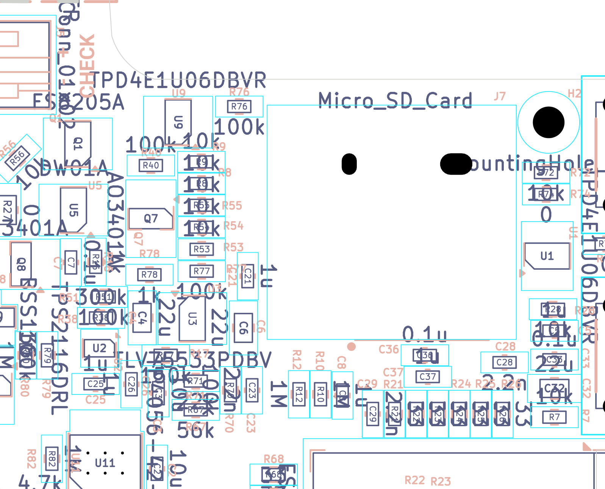
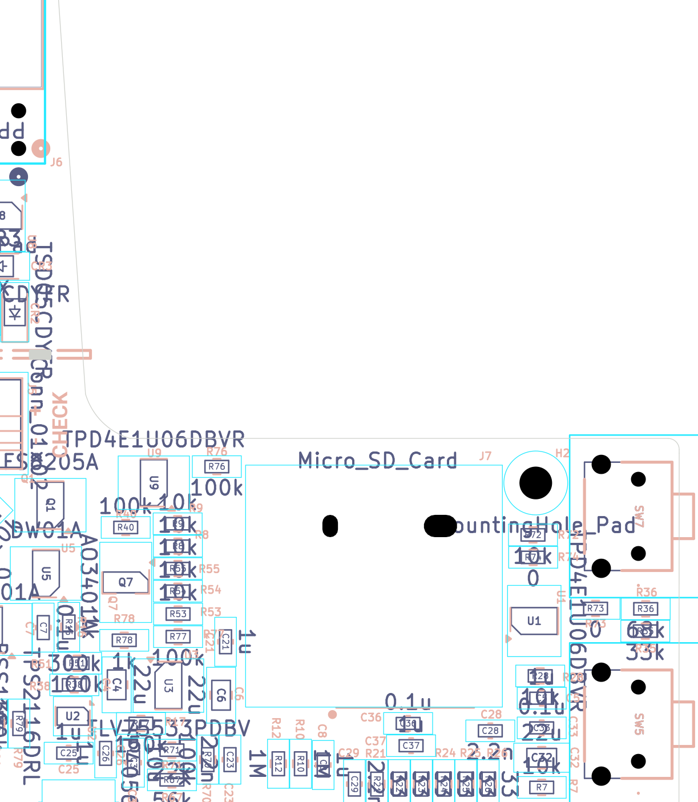

# microSD (SDMMC 4-bit) interface, SD power gate and ESD

*Independent final review, 2026-09-19. Reviewer key `sd`, finding prefix `SD-`.
All connectivity statements are taken from the netlist-derived files in `docs/final-review-2026-09-19/evidence/`,
never from an image. All board coordinates are KiCad mm with Y growing downward.*

> **Adversarial verification pass, 2026-09-20 (reviewer key `sd_verify`, finding prefix `SD-V`).**
> Every BLOCKER/HIGH/MEDIUM and every DOC finding above was re-derived from scratch: netlist re-read,
> datasheets re-opened and re-quoted, arithmetic redone, layout geometry recomputed from
> `board_extract.json` and from the board file itself. Two findings were re-graded down, five were
> corrected in detail, none was refuted outright, and **one new HIGH finding (SD-V01) and one new
> CERT-LATER finding (SD-V02) were added** — including one claim in *Checked and found OK* that had to
> be struck. See the [Verification log](#verification-log) at the end for the item-by-item record.

## What this part of the board does

The reader stores its books and images on a **microSD card**. The card plugs into **J7**, a
*push-push* socket (push once to latch it in, push again to eject it) soldered to the **bottom**
face of the board, near the board's top edge.

The ESP32-S3 talks to the card over **SDMMC in 4-bit mode**: one clock line (CLK), one
command line (CMD) and four data lines (DAT0-DAT3). That is the fast, native SD protocol —
several times the throughput of the simpler SPI mode that many hobby projects use (four times
from the bus width alone, more if the SPI clock would also have been lower).

Three extra pieces of circuitry surround it:

* **A power gate.** The card's supply pin is *not* wired straight to the 3.3 V rail. It is fed
  through **Q7**, a P-channel MOSFET acting as a switch ("high-side load switch"). The ESP32
  can therefore cut power to the card completely — to save battery in sleep, and to hard-reset
  a card that has locked up. A locked-up SD card can only be recovered by removing its power.
* **Pull-up resistors** (R8, R9, R53, R54, R55). The SD protocol requires the CMD and DAT lines
  to be held high when nobody is driving them. Note they are pulled up to the *switched* rail
  `SD_VDD`, not to 3V3 — that is the right choice and it matters (see SD-01).
* **ESD protection** — **U1** and **U9**, transient-voltage-suppressor (TVS) arrays. A microSD
  card is touched by human fingers, so its contacts are an electrostatic-discharge entry point.
  These parts clamp a static zap to ground before it reaches the microcontroller.

The socket footprint is a **custom, dual-source land pattern** the designer drew so that
*either* of two cheap sockets can be fitted: the SHOU HAN "TF PUSH" (LCSC C393941) or the
GCT MEM2075. Verifying that pattern against both manufacturers' drawings was the single
biggest job in this review.

## Circuit walk-through

Signal path, ESP32 → card (all confirmed in `evidence/sch/connectivity_by_component.txt`):

| ESP32-S3 pin | Net | 33 Ω series R | Bus net | Clamp | Socket pin |
|---|---|---|---|---|---|
| 5 (GPIO5) | `Net-(U4-IO5)` | R26 | `SD_DAT1` | U9.1 | J7.8 DAT1 |
| 6 (GPIO6) | `Net-(U4-IO6)` | R25 | `SD_DAT0` | U9.3 | J7.7 DAT0 |
| 7 (GPIO7) | `Net-(U4-IO7)` | R24 | `SD_CLK` | U1.4 | J7.5 CLK |
| 8 (GPIO15) | `Net-(U4-IO15)` | R23 | `SD_CMD` | U1.6 | J7.3 CMD |
| 9 (GPIO16) | `Net-(U4-IO16)` | R22 | `SD_DAT3` | U1.1 | J7.2 DAT3/CD |
| 10 (GPIO17) | `Net-(U4-IO17)` | R21 | `SD_DAT2` | U1.3 | J7.1 DAT2 |
| 18 (GPIO10) | `SD_ACTIVATE` | R78 (1 k) | `Net-(Q7-G)` | — | (gate control) |

| Ref | Part / value | Role | Checked against datasheet? |
|---|---|---|---|
| J7 | microSD push-push socket, fp `microSD_dualsource:microSD_PushPush_TFPUSH-MEM2075` | Card socket; pins 1-8 = DAT2, DAT3/CD, CMD, VDD, CLK, VSS, DAT0, DAT1; pad "9" = shell + card-detect terminal, all on GND | **Yes** — both GCT MEM2075 and SHOU HAN TF PUSH recommended PCB layouts measured off the drawings (see *Calculations*) |
| Q7 | AO3401A, P-ch MOSFET, SOT-23 | High-side switch: S = 3V3, D = `SD_VDD`, G = `Net-(Q7-G)` | **Yes** — AOS AO3401A rev 3.1, abs-max and RDS(on) table |
| R40 | 100 k, gate → 3V3 | Default-OFF pull-up: holds Q7 off whenever GPIO10 is high-Z (reset, boot, unprogrammed board) | Yes (divider arithmetic below) |
| R78 | 1 k, `SD_ACTIVATE` → gate | Series gate resistor; limits GPIO current and slows the edge slightly | Yes |
| R77 | 100 k, `SD_VDD` → GND | Bleeder: discharges the card rail when the gate is off | Yes (τ computed below) |
| C36 | 0.1 µF 0603 X7R | High-frequency decoupling at the socket | n/a |
| C37 | 1 µF 0603 X5R | Local bulk at the socket | n/a |
| R8, R9, R53, R54, R55 | 10 k each | SD bus pull-ups on DAT0, DAT1, DAT2, DAT3, CMD — to `SD_VDD` | Yes — SD spec wants 10 k–100 k; CLK correctly has none |
| R21–R26 | 33 Ω | Series damping / source termination at the MCU end | Yes |
| U1 | TPD4E1U06DBVR, SOT-23-6 | 4-channel TVS: pins 1, 3, 4, 6 on DAT3, DAT2, CLK, CMD; pin 2 GND; **pin 5 = NC, floating** | **Yes** — TI SLVSBQ9D §5 *Pin Configuration and Functions*: NC "can be left floating, grounded, or connected to VCC" |
| U9 | TPD4E1U06DBVR (drawn in another schematic block) | 4-channel TVS: pin 1 = `SD_DAT1`, pin 3 = `SD_DAT0`, pin 6 = `UNUSED_GPIO_46`, pin 4 explicitly no-connect | Yes, same datasheet |

So **all six** SD bus lines are clamped — four by U1 and two by U9. Nothing on the bus is left
unprotected. (The SDMMC schematic block only *shows* U1, which is misleading — see SD-13.)

## Where it is on the board & layout notes

Everything is on the **bottom** side.

| Ref | x | y | note |
|---|---|---|---|
| J7 body (courtyard) | 56.15 … 73.45 | **69.30** … 85.60 | card mouth faces the y = 67.5 board edge |
| J7 contact row (pins 1-8 + CD) | 58.10 … 66.90 | 84.60 | 1.10 mm pitch, pads 0.7 × 1.6 mm |
| J7 locating slots (NPTH) | 60.32 and 67.75 | 73.40 | 2.25 × 1.5 mm and **1.05 × 1.5 mm** oval slots |
| C36 / C37 | 62.5 / 62.3 | 86.7 / 88.2 | 2.1 mm and 3.6 mm from the socket VDD/VSS pins — good |
| U1 (TVS) | 54.0 | 79.8 | 11.3–14.3 mm from the socket pins it protects |
| U9 (TVS) | 79.6 | 70.5 | **23.2–23.5 mm** from J7.7 / J7.8 |
| Q7 + R40/R77/R78 | 80.6 … 82.5 | 73.5 … 81.1 | gate cluster, far side of the socket |
| R8/R9/R53/R54/R55 (pull-ups) | 78.0 | 73.2 … 80.9 | ~15 mm from the socket |
| R21–R26 (33 Ω) | 57.1 … 64.6 | 90.79 | tight row right at the ESP32 module — correct place for source termination |
| U4 ESP32-S3-WROOM-1 | 57.5 | 102.5 | module top edge at y ≈ 92.5 |

*Bottom-side assembly view (mirrored, i.e. as you see the board looking at its component face),
board region x 50–92 mm, y 62–96 mm. The grey line across the top is the board edge at y = 67.5.
The two black ovals inside the socket outline are the NPTH locating slots.*

Observations:

* **Board edge and card entry.** The board is not rectangular: a straight edge runs at
  **y = 67.5 mm** for x = 44.99 … 81.24 (`evidence/pcb/board_extract.json` → `edge_cuts`,
  `Line (44.9875, 67.5) → (81.2375, 67.5)`). The socket's card mouth faces it and sits
  **1.78 mm inside** it (≈ 2.05 mm to the socket body, see SD-05). There is free air beyond the edge
  *in the plane of the board*, so nothing on the PCB obstructs insertion — **but that "free air" is
  the board's internal cut-out, which `HARDWARE.md` l.1187 says is where the battery goes. See
  SD-V01, the highest-severity item in this section.**
* **Orientation is correct, not mirrored.** For the bottom-side placement the mapping from
  footprint to board coordinates is `board_x = 63.05 + fp_x`, `board_y = 84.6 − fp_y`
  (verified on every pad). That is a 180° rotation, *not* a mirror, so the socket's handedness
  matches both manufacturers' component-side drawings. Pad 1 (DAT2) is at the high-x end and
  the locating pegs are between the contacts and the mouth, exactly as drawn in both datasheets.
* **Ground return.** A GND zone is filled on **both** F.Cu and B.Cu
  (`board_extract.json` → `zones`: one `['F.Cu','B.Cu']` zone plus a `['B.Cu']` zone). The SD
  bus runs mostly on B.Cu, so its reference is the F.Cu pour. ~~The x-ray crop below shows an
  essentially unbroken F.Cu pour beneath the socket region, so the return path under the bus is
  continuous here.~~ — **refuted by verification:** the F.Cu pour in this region is cut by 62 track
  segments, two of which (`PWR_BUTTON` down x = 67.8 for 12 mm, `BUTTON_ADC_2` along y = 90.2 for
  13 mm) run directly under the socket and across the bus fan-out. The x-ray image below is
  low-contrast for thin traces and should not be read as showing a solid plane. Consequences are
  small at these lengths — see **SD-V02**.

*Top-down x-ray, board region x 54–78, y 66–92. F.Cu red, B.Cu blue. The red field is the F.Cu
GND pour; it is continuous under the socket and under the SD bus in this window.*

* **Copper under the socket.** Ten vias sit inside the socket outline (SD_CLK @62.5,83.2;
  GND @61.4,83.4 / 63.5,75.8 / 68.5,77.6; SD_CMD @68.5,76.27 / 71.2,76.27; SD_DAT3 @68.6,79.7 /
  70.86,81.86; SD_VDD @70.3,77.9; PWR_BUTTON @58.1,71.9). Vias are tented front and back
  (`(tenting front back)` in the board setup), and none of them fall inside the GCT body keep-out
  rectangle (board x 57.55–67.55, y 77.1–81.1). Acceptable — but see SD-08 about that keep-out.
* **Trace widths.** All six SD signals are 0.2 mm; `SD_VDD` is 0.25 mm (netclass `Power`).
* **DRC.** The only DRC items naming these parts are 3 × `silk_edge_clearance` (silkscreen near
  the J7 NPTH slots — cosmetic), 4 × `starved_thermal` (J7 pads 6 and 9, and C37 pad 1 — SD-09),
  and 4 cosmetic silk-overlap/silk-over-copper warnings on R8/R77/R78. No clearance, no shorts,
  no unconnected items. ERC lists nothing for these refs.

## Calculations

### 1. Dual-source socket footprint vs both datasheets

This is the check that mattered most, so it was done numerically rather than by eye. Both
recommended-layout drawings are raster images inside the PDFs, so pad and hole positions were
measured by scanning pixel rows/columns (`scratchpad/agents/sd/scan.py`, `scan2.py`) and
calibrated on the one dimension both drawings guarantee: the **1.10 mm contact pitch**.

Measured, expressed in the footprint's own coordinate frame (origin between pads 4 and 5,
contact row at y = 0, +y = into the socket / toward the mouth):

| Quantity | SHOU HAN TF PUSH | GCT MEM2075 | Footprint as drawn |
|---|---|---|---|
| Scale check | pitch 69.25 px ⇒ 62.95 px/mm | pitch 73.25 px ⇒ 66.59 px/mm | — |
| Contact pad size | **0.70 × 1.60 mm** (measured 44 × 101 px) | 0.62 × 1.40 mm (measured 41 × 93 px) | **0.7 × 1.6 mm** ✔ superset of both |
| Contact pitch / count | 9 pads (Cd + 8) @ 1.10 mm | 9 pads (Cd + 8) @ 1.10 mm | 9 pads @ 1.10 mm ✔ |
| Peg-hole pitch | **8.006 mm** (504 px) | **6.803 mm** (453 px) | slots span both ✔ |
| Right hole, x from pad 1 | +0.810 mm | +0.818 mm | slot B at +0.85 |
| Peg-hole Y below contact row | **10.99 mm** (692 px) | **11.43 mm** (761 px) | slots at **11.20** = midpoint ✔ |
| Recommended hole Ø | Ø1.00 | Ø0.95 | slot A 2.25 × 1.5, slot B 1.05 × 1.5 |
| Shell ground lands | 4 lands: 1.2×1.5, 1.6×1.6, 2×(1.2×2.2) | 4 lands: 4 × (1.10 × 2.40), 16.15 apart in x, 9.00 apart in y | **all 8 present** — see SD-03 |

Cross-checks that the footprint reproduces the GCT drawing exactly: left-shell-land to Cd pad
= 1.38 mm (drawing "1.38") ✔; Cd to pad 1 = 8.80 mm ("8×1.10=8.80") ✔; pad 1 to right land
= 5.97 mm ✔; land span 16.15 mm ✔; land row spacing 9.00 mm ✔; body keep-out 10.20 × 4.05 mm ✔.

**Verdict: the dual-source trick works.** Put the two peg envelopes into the slots:

* TF PUSH, peg nominally Ø0.80 at (−3.30, +11.00): occupies x −3.70 … −2.90, y 10.60 … 11.40.
  Slot A is x −3.855 … −1.605, y 10.45 … 11.95 → **fits**, tightest margin 0.15 mm (top edge).
  Right peg at (+4.65, +11.00) → x 4.25 … 5.05 inside slot B's 4.175 … 5.225 → **fits**,
  tightest margin 0.075 mm.
* MEM2075, peg nominally Ø0.75 at (−2.135, +11.43) and (+4.668, +11.43): → **fits** both slots,
  tightest margin 0.155 mm (slot A bottom edge).

The 11.20 mm slot centre is almost exactly the midpoint of the two parts' 10.99 / 11.43 peg
rows — this was clearly deliberate and it is correct. The residual concern is only margin,
in slot B (SD-07).

### 2. Power gate — turn-on, drop, ratings

Gate low (GPIO10 driven low, ≈ 40 Ω pin impedance):
VG = 3.3 × (1 000 + 40)/(100 000 + 1 000 + 40) = **34 mV**, so **VGS = −3.27 V**.

AO3401A (AOS rev 3.1, p. 1 product summary / p. 2 electrical table):
RDS(on) < 60 mΩ at VGS = −4.5 V, < 85 mΩ at −2.5 V ⇒ **≈ 70 mΩ at −3.27 V**.
VGS abs-max ±12 V (applied 3.3 V ✔), VDS −30 V (applied 3.3 V ✔),
ID −4.0 A continuous (load ≤ 0.5 A ✔).

`SD_VDD` copper from Q7.3 to J7.4 is ≈ 25 mm of 0.25 mm-wide 1 oz trace:
R = 1.72e−8 × 0.025 / (0.25e−3 × 35e−6) = **49 mΩ**.
At a 200 mA card current the total drop is 0.2 × (0.070 + 0.049) = **24 mV** → SD_VDD ≈ 3.28 V,
comfortably inside the card's 2.7–3.6 V window. At a 500 mA peak it is 60 mV. ✔
IPC-2221 current capacity of that trace (10 °C rise, external, 1 oz) ≈ **0.87 A** ✔.
GCT MEM2075 contact rating is 0.5 A per pin (datasheet p. 1) ✔.

**Default state.** With GPIO10 high-impedance (power-on, reset, unprogrammed board) R40 holds
the gate at 3V3 ⇒ VGS = 0 ⇒ **Q7 off, card unpowered**. That is the safe default, and
it matches the schematic note "SD_ACTIVATE HIGH (default) = OFF". ✔
**With one exception:** the ESP32-S3 datasheet v2.2 **Table 2-2 "Power-Up Glitches on Pins"**
lists GPIO10 as producing a *low-level* glitch of ~60 µs typical at power-up. Because the gate is
active-low, that glitch pulls the gate down through R78 and turns Q7 **on** for ~60 µs on every
cold start. See SD-15.

**Reset-time pull configuration (this is what makes SD-01 a firmware issue, not a silicon one).**
ESP32-S3 datasheet v2.2, Table 2-1 *Pin Overview*, "At Reset"/"After Reset" columns:
GPIO5, GPIO6, GPIO7 — blank (no IE, no pull); GPIO10 and GPIO17 — `IE` only;
GPIO15 and GPIO16 appear in the table as `XTAL_32K_P` / `XTAL_32K_N` — blank.
**None of the six SDMMC pins, and not GPIO10, has an internal weak pull-up enabled at or after
reset.** So on a freshly reset or unprogrammed board the bus really is high-impedance and
`SD_VDD` sits near 0 V through R77. ✔

**Body-diode orientation.** Q7 source = 3V3, drain = `SD_VDD`. For a P-channel device the body
diode's anode is the drain, so it conducts SD_VDD → 3V3 and *blocks* 3V3 → SD_VDD. Correct for
a high-side switch: with the gate off, no current sneaks to the card through the diode. ✔

### 3. Inrush and 3V3 droop — can enabling the card brown out the ESP32?

Capacitance switched on: C36 0.1 µF + C37 1 µF ≈ 1.0 µF after DC-bias derating, plus the card's
own input capacitance (assume a pessimistic 1 µF) ⇒ **Cload ≈ 2 µF**.

3V3 bulk available (from the `3V3` net node list): C6 22 µ + C32 22 µ + C10 4.7 µ + C21 1 µ +
C22 1 µ + C24 0.1 µ + C30 0.1 µ + C33 0.1 µ = 51 µF nominal, ≈ **30 µF** after DC-bias derating
of the two 22 µF parts.

Worst case (regulator contributes nothing, pure charge sharing):
ΔV = 3.3 × 2/(2 + 30) = **206 mV** → the rail dips to ≈ **3.09 V**.

That is above the ESP32-S3's 3.0 V minimum recommended supply and far above any brownout-detector
setting. **Enabling the card cannot brown out the ESP32.** ✔
The event is also short: τ = (70 mΩ + 49 mΩ) × 2 µF ≈ 0.24 µs, and the regulator responds long
before the bulk is meaningfully depleted. No soft-start is needed. (If a future card proves to
have a much larger input capacitance, a 10 nF gate-to-source capacitor on Q7 would give a
~10 µs ramp through R78, and ~1 ms turn-off through R40.)

**Verification addendum — the overshoot the charge-sharing model hides.** A purely resistive model
cannot show ringing, so the verification pass redid it as a series RLC. The `SD_VDD` feed is
~25 mm of 0.25 mm trace: Z₀ ≈ 131 Ω by the same microstrip formula, giving L ≈ 0.79 nH/mm ×
25 mm ≈ **20–25 nH**. With C = 2 µF and R = 0.119 Ω the damping factor is
ζ = (R/2)·√(C/L) = 0.0595 × √(2×10⁻⁶ / 25×10⁻⁹) = 0.0595 × 8.94 = **0.53**, which is under-damped:
overshoot = exp(−πζ/√(1−ζ²)) = **14 %**, i.e. `SD_VDD` would peak near **3.76 V** — above the card's
3.6 V operating maximum, though far below any card's absolute maximum.
Two things kill it in practice. First, C37's own ESR (~50 mΩ for a 1 µF 0603 X5R at MHz) raises
R to ~0.17 Ω and ζ to ~0.76, cutting the overshoot to **~2.5 %**. Second, Q7's turn-on is not a
step: the AO3401A's Ciss is **645 pF** (AOS rev 3.1, p. 2 electrical table) and the gate
sees ≈ 1 kΩ (R78 ∥ R40), so τgate ≈ **0.65 µs** against an LC half-period of ~0.7 µs —
the edge is inherently soft. **Conclusion: no overshoot problem, and the original "no soft-start
needed" verdict survives an adversarial check.** This also closes the original review's open
question about Ciss.

### 4. Back-powering the card through the pull-ups — the important one

With Q7 **off**, the only thing holding `SD_VDD` down is R77 = 100 kΩ. But five 10 kΩ pull-ups
connect `SD_VDD` to five ESP32 pins through 33 Ω each.

If firmware drives (or weakly pulls) those pins **high** while the gate is off:

* five parallel paths of (10 000 + 33) Ω = **2.007 kΩ** from 3.3 V into `SD_VDD`
* divider against R77: VSD_VDD = 3.3 × 100/(100 + 2.007) = **3.235 V**

The card is then fully powered *through its data pins* even though the gate is off. Even with
only the ESP32's internal weak pull-ups (≈ 45 kΩ typ) the path is 5 ∥ (45 k + 10 k) = 11.0 kΩ and
VSD_VDD = 3.3 × 100/111 = **2.97 V** — still enough to keep a card alive.

Making R77 smaller does not fix it: to hold `SD_VDD` below 0.3 V against 2.0 kΩ you would need
R77 < 200 Ω, which would burn 3.3 V / 200 Ω = **16.5 mA** continuously while the card is on.
This is a firmware problem, not a resistor problem. See SD-01.

Conversely, if firmware **drives the bus low** (which is exactly what the schematic note says to
do), the five pull-ups become 2.0 kΩ to ground, `SD_VDD` collapses in
τ = 2.0 k ∥ 100 k × 2 µF ≈ **4 ms** and everything is correct. The note is right; it just needs
to be stated in terms firmware can implement exactly.

### 5. Discharge time for a clean power-cycle

With the bus truly high-impedance (pins as inputs, internal pull-ups *disabled*), only R77 bleeds
the rail: τ = 100 kΩ × 2 µF = **0.200 s**; falling from 3.3 V to the 0.5 V that the SD spec treats
as "powered off" takes t = τ·ln(3.3/0.5) = 0.200 × 1.887 = **0.377 s**.
With the bus driven low, R = 2.007 kΩ ∥ 100 kΩ = 1.967 kΩ, τ = **3.93 ms** and the time to 0.5 V is
**7.4 ms**. *(These four figures were recomputed during verification; the original review's 0.21 s /
0.40 s / 4 ms / 8 ms were each slightly off but led to the same recommendation.)* Firmware therefore needs either a ≥ 500 ms off-time,
or the drive-low approach with ≥ 20 ms. See SD-10.

### 6. Timing / skew (lenient, per the owner's standard)

Routed lengths from `evidence/pcb/net_routing_stats.csv`: SD_CLK 20.77, SD_CMD 43.30,
SD_DAT0 38.79, SD_DAT1 44.41, SD_DAT2 35.15, SD_DAT3 41.03 mm.

Those totals are misleading, because most of the length is the **branch out to the pull-ups and
to U9**, not the MCU→card path. Shortest-path copper distance from each 33 Ω resistor to its
socket pin (measured on the scratch board with a pad-to-pad trace walk):

| net | series R → socket pin |
|---|---|
| SD_DAT0 | R25.2 → J7.7 = 5.95 mm |
| SD_DAT1 | R26.2 → J7.8 = 6.13 mm |
| SD_DAT2 | R21.2 → J7.1 = 6.32 mm |
| SD_CLK | R24.2 → J7.5 = 6.57 mm |
| SD_DAT3 | R22.2 → J7.2 = 6.55 mm |
| SD_CMD | R23.2 → J7.3 = 7.94 mm |

Spread = 2.0 mm ⇒ at ~6 ps/mm that is **12 ps of skew**, i.e. 0.05 % of a 25 ns clock period at
40 MHz. Completely irrelevant. ✔

The long branches (up to ~36 mm out to R8/R9/U9) are electrically **stubs**. A 0.2 mm trace
1.55 mm above the plane is a ~138 Ω line (microstrip formula in SD-14) carrying
C = √εr_eff/(c·Z₀) = 1.79/(3×10⁸ × 138) ≈ **0.043 pF/mm**, so a 36 mm stub adds only ~1.6 pF and
a 0.21 ns one-way delay. At SDMMC speeds that is a minor ringing contributor, not a
functional problem. ✔ (It does matter for ESD — SD-02.)

## Findings

| ID | Severity | Finding | Evidence | Recommendation |
|---|---|---|---|---|
| **SD-V01** | **HIGH** | **The card-insertion corridor runs straight through the battery bay.** The socket mouth does not face the outside of the product — it faces the board's large internal **cut-out**, and `docs/HARDWARE.md` l.1187 states *"The battery now sits in a cut-out **in** the PCB rather than stacked on top"*. A ~15 mm-long card plus finger room must occupy that cut-out to be inserted | Edge.Cuts polygon: the main body's top edge is `Line (44.9875, 67.5) → (81.2375, 67.5)`, then an arc up to (84.2375, 64.5) and a slant to (86.05, 37.96). So the region x ≈ 44.2–84, y 37–67.5 (~40 × 30 mm) is **not board**. J7's mouth is at y ≈ 69.3–69.55 facing −y into exactly that region, x 56.15–73.45. See `img/sd_verify_cutout.png` | **Decide this before the enclosure, ideally before ordering.** Either (a) confine the cell to the upper-left of the cut-out so a ≥ 17.5 mm-wide × ≥ 20 mm-deep channel stays clear in front of J7, and say so in HARDWARE.md with the maximum cell dimensions; or (b) on a respin rotate J7 180° so the mouth faces the board's *outer* left edge (x = 44.24) or bottom edge; or (c) accept "remove the battery to change the card" and document it. Option (a) costs nothing now but constrains every battery a replicator can fit |
| **SD-V02** | **CERT-LATER** | The F.Cu ground pour under the socket and under the SD bus is **cut by several signal traces**, so the bus's return path is not the continuous plane the original review claimed | 62 F.Cu track segments cross x 54–80 / y 66–92 on the board file. The relevant cuts: `PWR_BUTTON` runs x = 67.8 from y = 76.7 to 88.8 (12 mm, under the socket *and* across the bus fan-out) and y = 68.3 from x = 62.5 to 77.8; `BUTTON_ADC_2` runs y = 90.2 from x = 55.3 to 68.5 (13 mm, directly across every socket → R21–R26 path); `SD_DAT2` itself runs 6.1 mm on F.Cu at y = 88.68; plus `SD_VDD`, `UNUSED_GPIO_3` and two `3V3` diagonals | Accept for the prototype: the crossings are near-perpendicular (low crosstalk) and the MCU→card runs are 6–8 mm, so the extra return inductance cannot cause a functional failure. If EMI work is ever done, reroute `PWR_BUTTON` and `BUTTON_ADC_2` off F.Cu in the y = 66–92 band so the top-side pour under the SD bus is solid |
| SD-01 | MEDIUM | `SD_VDD` is back-fed to 3.24 V through the five 10 k pull-ups whenever the ESP32 drives the SDMMC bus high with the gate off; the power gate cannot actually power-cycle the card unless firmware parks the bus first | Divider 3.3 × 100 k/(100 k + 2.007 k) = 3.235 V; nets `SD_DAT0..3`, `SD_CMD` each 10 k to `SD_VDD`, R77 = 100 k | Keep the schematic note, but make it exact and testable: *before* raising `SD_ACTIVATE`, drive GPIO5/6/7/15/16/17 **low as outputs** (including CLK) and *disable internal pull-ups*; hold ≥ 20 ms. Add the same rule to `docs/HARDWARE.md`. Measure `SD_VDD` with the gate off on the first board |
| SD-02 | MEDIUM | ESD clamps are 11–23 mm from the socket contacts they protect, against TI's explicit "as close to the connector as possible" | *All six distances independently recomputed from `board_extract.json` and reproduce to ±0.01 mm:* U1.4→J7.5 11.27, U1.6→J7.3 11.53, U1.1→J7.2 11.39, U1.3→J7.1 14.27, **U9.3→J7.7 23.46, U9.1→J7.8 23.19 mm**. Two TI citations, not one: SLVSBQ9D **§5 Pin Functions** ("Connect to data line as close to the connector as possible", for all four channels) and **§10.1 Layout Guidelines** ("The optimum placement is as close to the connector as possible") | Prototype: accept. On any respin move U1 (and ideally a second array) to within ~3 mm of J7's contact row. *Correction:* the clamps are **already electrically on the socket side** of R21–R26 — nets `SD_CLK`/`SD_CMD`/`SD_DAT*` each contain J7, the 33 Ω resistor and the TVS as one node — so only the physical distance is wrong. Also fix the single thermal spoke on **U9 pad 2** and on J7's shield pads (SD-09): that spoke is the clamp's discharge return |
| SD-03 | ~~MEDIUM~~ → **LOW** | The dual-source footprint carries **all eight** shell ground lands; whichever socket is fitted, roughly 2.6 mm² of pasted copper is left uncovered at the top-right corner | *Verified pad-by-pad against the `.kicad_mod`.* Pads "9" at fp (−6.33,2), (−6.33,11), (9.82,2), (9.82,11) = GCT lands (1.1 × 2.4 mm); (−6.15,1) 1.3×1.6, (−6.15,10.6) 1.3×2.3, (8.45,1) 1.7×1.6, (9.35,10.6) 1.3×2.3 = TF PUSH lands. Three pairs overlap by ≥ 0.7 mm and merge harmlessly. The top-right pair overlaps by only **0.03 mm in x** (7.60–9.30 vs 9.27–10.37) so they merge through a thin neck, leaving ~2.6 mm² uncovered | For reflow assembly, have the stencil house remove the paste apertures for the socket you are *not* fitting (or hand-solder J7 after reflow). **Re-graded LOW on verification:** all nine pads are GND, and paste on a land wets that land rather than forming a free ball, so the realistic outcome is a solder dome on an unused ground pad, not a loose sphere. Worth an assembly note only because the dome sits at the socket-body edge and could fight coplanar seating |
| SD-04 | MEDIUM | The J7 BOM row names **three different parts** | `bom_ungrouped.csv`: MPN `MEM2075-00-140-01-A` (GCT), LCSC `C393941` (= SHOU HAN "TF PUSH", a different manufacturer's part), Datasheet URL `we-online.com/.../693072010801.pdf` (= a **Würth** socket). DigiKey field empty | Pick a primary: put the GCT MPN + its DigiKey number in the primary fields (the repo convention is DigiKey-primary) and move `C393941` to an "Alt MPN / LCSC" field with a comment that the footprint accepts both. Fix the datasheet URL — it currently points at a third, unverified part |
| SD-05 | MEDIUM | The socket mouth is **1.78–2.05 mm inside** the edge of the copper; an ejected card may not protrude far enough to grip. **Read together with SD-V01** — the "edge" here is the cut-out, not the outside of the product | Socket courtyard starts at y = 69.275; board edge `Line (44.9875,67.5)→(81.2375,67.5)`. *Correction on verification:* the footprint's courtyard runs 0.25 mm past the GCT body (CrtYd max fp y = 15.3 vs the drawing's 15.05 mm body depth), so the true body face is at y ≈ 69.55 and the setback is **≈ 2.05 mm**, slightly worse than first reported | Before cutting an enclosure: measure the actual push-push pop-out stroke on a real socket. If it is ≤ 4 mm, put a finger notch / flared slot at that opening, or (on a respin) shift J7 ~2 mm toward y = 67.5 so the mouth is flush. The opening must be positioned for a **bottom-mounted** socket, i.e. below the board plane. If SD-V01 is resolved by rotating J7 instead, this finding disappears with it |
| SD-06 | ~~MEDIUM~~ → **LOW** | Card-detect is thrown away: both sockets have a mechanical detect contact, and the footprint ties it to GND with the shell | *Verified.* Footprint pad `"9"` at fp (−4.95, 0) → board (58.10, 84.60), exactly 1.10 mm beyond pad 8, net `GND`. GCT drawing p.1 confirms the land count and labelling: `8x 1.10` pitch, `9x 1.40 / 9x 0.62` contact lands (8 signals + one "Card Detect"), `4x 1.10 / 4x 2.40` shell lands all labelled "Ground", `1.38` from the left ground land to the Cd land. Ordering code `MEM2075-**00**-140-01-A` = "Switch 00 = Normally Open", and the drawing's *Card Detect Switch Circuit* shows Without Card (open) / Card Inserted. With exactly one Cd terminal and four Ground terminals, the switch's return can only be the shell — so tying Cd to GND shorts ground to ground | Prototype: accept, and poll by attempting to mount. On a respin, give the socket a 10-pin symbol, route the Cd pad to a spare GPIO with a 10 k pull-up to 3V3 (not to `SD_VDD`), and you get insert/remove events and a safe interlock for the power gate. **Re-graded LOW on verification:** nothing can be damaged, there is no functional loss the firmware cannot work around, and `HARDWARE.md` l.510-511 already discloses it — that makes it a knowing acceptance, which the rubric puts at LOW |
| SD-07 | LOW | Slot B (the tight locating slot) is 1.05 × 1.5 mm — only **0.05 mm** wider than the TF PUSH's recommended Ø1.00 peg hole, and at the minimum routed-slot width most fabs quote | Slot B is `np_thru_hole oval`, size **1.05 × 1.5 mm**, drill oval 1.05 × 1.5, at fp (4.7, 11.2) → board (67.75, 73.40) — *confirmed directly in the `.kicad_mod` and in `board_extract.json`*. The peg position it is compared against (TF PUSH hole Ø1.00 at fp +4.65, +11.00) comes from pixel-measuring a raster drawing and **I did not reproduce that measurement**, so the 0.075 mm margin is the original reviewer's number, not a verified one. Routed-slot tolerance is typically ±0.10 mm | Widen slot B to ~1.25 × 1.6 mm (and slot A's high-x edge by 0.1 mm). Costs nothing, keeps both parts seating, removes the fab-tolerance risk. Nothing electrical is nearby |
| SD-08 | LOW | The GCT body keep-out is drawn as a rule area on the **F.SilkS** layer, so it enforces nothing — and the part is on the bottom anyway | Footprint `zone ... (layer "F.SilkS") (name "keep-out-gct") (keepout (tracks not_allowed)(vias not_allowed)(pads not_allowed))` | Redraw it on B.Cu (or both copper layers) if you want DRC to enforce it. As routed today nothing violates it anyway — no via or track falls inside board x 57.55–67.55 / y 77.1–81.1 — so this is cleanup, not a risk |
| SD-09 | LOW | J7's ground/shield pads — **and U9's ground pin** — reach the GND zone through a **single** thermal spoke | *Corrected on verification: there are **five**, not four.* `drc.json` `starved_thermal` "zone min spoke count 2; actual 1" on **Pad 2 [GND] of U9**, Pad 6 [GND] of J7, Pad 9 [GND] of J7 (×2) and Pad 1 [GND] of C37 | Set the pad connection for these pads to *solid* fill. The **U9 one matters most** and the original review missed it: U9 is the ESD clamp for `SD_DAT0`/`SD_DAT1`, and a single thermal spoke is precisely the wrong thing on a TVS ground pin, since that spoke carries the whole discharge current. It compounds SD-02 rather than merely "partly offsetting" it |
| SD-10 | LOW | A clean SD power-cycle needs ~0.4 s if the bus is left high-impedance | *Arithmetic corrected on verification (conclusion unchanged):* τ = R77 × C = 100 kΩ × 2 µF = **0.200 s** (not 0.21); to 0.5 V takes τ·ln(3.3/0.5) = 0.200 × 1.887 = **0.377 s** (not 0.40). Bus driven low: R = 2.007 k ∥ 100 k = 1.967 kΩ, τ = 3.93 ms, to 0.5 V = **7.4 ms** | Document the required off-time: **≥ 500 ms** high-impedance or **≥ 20 ms** driven-low (both keep generous margin over the computed figures). If you prefer a hardware margin, 22 k for R77 gives τ = 44 ms at a cost of 150 µA while the card is powered |
| SD-11 | LOW | Local `SD_VDD` bulk is 1.1 µF, below the ~10 µF usually shown in SD host reference designs | C36 0.1 µF + C37 1 µF at (62.5, 86.7) / (62.3, 88.2); supply path back to 30 µF of 3V3 bulk is only 0.12 Ω | Adequate as computed (the 1.1 µF covers ~0.55 µs at 200 mA, after which the 0.12 Ω path takes over for a 24 mV drop). If card writes prove flaky on the prototype, change C37 from 1 µF to 10 µF — same 0603 land, zero layout change |
| SD-12 | LOW | Q7's library symbol, description and datasheet field are the **IRLML6402**'s, not the AO3401A's | `lib=Transistor_FET:IRLML6402`; Description "−3.7A Id, −20V Vds, 65mOhm"; Datasheet `infineon.com/dgdl/irlml6402pbf.pdf`. Actual part AO3401A is −4.0 A / −30 V | Fix the Description and Datasheet fields to the AO3401A. Both parts would work here, so this is bookkeeping — but it misleads anyone sizing the part later. (Q2 uses the same symbol, so this likely spans blocks) |
| SD-13 | LOW | The SDMMC schematic block shows ESD protection for only 4 of the 6 bus lines | Block crop `07_sdmmc`: the "ESD Protection" group contains U1 only. `SD_DAT0`/`SD_DAT1` go to U9, drawn in a different block | Add a text note in the SDMMC block ("DAT0/DAT1 clamped by U9, see <block>"), or move U9's two SD channels next to U1 on the sheet. Purely a readability fix — the netlist is correct |
| SD-14 | CERT-LATER | 33 Ω series resistors are well below the ~138 Ω characteristic impedance of a 0.2 mm trace over a 1.55 mm dielectric, so the bus is under-damped — and `docs/HARDWARE.md` states the opposite | R21–R26 = 33 Ω; ESP32 pin drive ≈ 40 Ω ⇒ ~73 Ω source. Microstrip Z₀ = (87/√(εr+1.41))·ln(5.98h/(0.8w+t)) with h = 1.55, w = 0.2, t = 0.035 mm, εr = 4.5 ⇒ **138 Ω** | Leave it for the prototype — the MCU→card runs are only 6–8 mm, so reflections settle in well under a nanosecond. If EMI work happens later, 47–68 Ω would damp the edges better at no cost. Correct the "~60 Ω trace impedance / slightly over-damped" sentence in HARDWARE.md §5 |
| SD-15 | LOW | `IO10` has a documented ~60 µs **low-level** power-up glitch, which briefly switches the card **on** at every cold start — and `docs/HARDWARE.md` explicitly claims this pin has "no power-up glitch" | *Re-read from the PDF (p. 18).* ESP32-S3 Series Datasheet v2.2, **Table 2-2 Power-Up Glitches on Pins**: `GPIO10 — Low-level glitch — 60 µs`. Gate is active-low through R78, so a low glitch = Q7 on. **Important mitigation the original review missed:** the *same* table lists GPIO1–GPIO14, `XTAL_32K_P`, `XTAL_32K_N` and GPIO17 with the identical 60 µs low-level glitch — i.e. **the whole SD bus (GPIO5/6/7/15/16/17) is being driven LOW during the same 60 µs**. So the card sees a VDD blip with all of its inputs at 0 V, which is the safe combination, not a dangerous one. The blip nevertheless *charges* `SD_VDD` (τ = 0.24 µs) and it then decays with SD-10's 0.2 s time constant, so the card really is powered for roughly the first 0.4 s | Harmless in itself, but it means firmware must not assume the card was continuously unpowered after a cold boot: do one deliberate power-cycle with a long enough off-time (see SD-10) before the first mount. Correct the claim in HARDWARE.md §5 |
| SD-16 | LOW | `SD_CMD` and `SD_DAT3` use GPIO15/GPIO16, which are the ESP32-S3's **only** 32.768 kHz crystal pins (`XTAL_32K_P` / `XTAL_32K_N`) | ESP32-S3 Series Datasheet v2.2, Table 2-1: chip pins 21/22 are `XTAL_32K_P`/`XTAL_32K_N`, occupying the GPIO15/GPIO16 positions | Informational — the board already has an I²C RTC, so this is probably a non-issue. But note it: this board can never gain an external 32 kHz crystal for accurate deep-sleep timekeeping without moving two SD signals. If that matters, swap SD_CMD/SD_DAT3 onto two of the spare GPIOs on a respin |

### Notes on the non-trivial findings

**SD-V01 — the card slot opens into the battery bay.** *(Added by the verification pass; it is the
highest-severity item in this section.)*
The original review checked that the socket faces a board edge with "free air beyond it" and treated
the only mechanical risk as an enclosure wall. That is the wrong picture. This board is not
rectangular. Its outline (from `board_extract.json` → `edge_cuts`) runs up the left side to
y = 68.5, rounds over at (44.99, 67.5), then runs **right along y = 67.5 all the way to x = 81.24**,
arcs up to (84.24, 64.5) and slants away to (86.05, 37.96) before the upper-right tab. Everything
above y = 67.5 and left of that slant — roughly **40 × 30 mm** — is a **cut-out**, not board.
`docs/HARDWARE.md` l.1187 says what that cut-out is for: *"The battery now sits in a cut-out **in**
the PCB rather than stacked on top."*

J7's mouth is at y ≈ 69.3–69.55, spanning x 56.15–73.45, and it faces **−y, straight into that
cut-out**. A microSD card is 15 mm long, so before it is pushed home it occupies roughly y 54–69
over x ≈ 61–72 — squarely in the middle of the battery bay — and a finger needs several more
millimetres behind that. A LiPo pouch sitting in the cut-out will foul the card unless it is
deliberately kept out of a ~17.5 mm-wide channel in front of the socket.

I cannot tell from the design files which way the owner intends to resolve this, and it may well
already be planned for — but nothing in the repo records it, and the consequence of getting it wrong
is a finished product whose SD card can only be changed by unplugging the battery. Hence HIGH
rather than MEDIUM: the PCB itself is fine, but this is the kind of thing that is cheap to settle
now and expensive to discover after an enclosure exists.

*Bottom-side assembly view (mirrored), board region x 43–90, y 38–92 at 26 px/mm. The large white
area is the **cut-out** — no PCB. The thin grey line crossing the picture is the board edge at
y = 67.5. `J7`'s outline sits just below it, its card mouth pointing up into the cut-out.*

**SD-01 — back-powering, and why the power gate is only half a power gate.**
The designer clearly thought about this: the schematic block carries the note *"All data signals
should be asserted low before shutting down"*, and pulling the bus up to the switched rail rather
than to 3V3 is exactly the right topology. What is missing is that the hardware provides **no
fallback**. There are five 10 kΩ resistors tying `SD_VDD` to five GPIOs; against R77's 100 kΩ they
win by 50:1. Any code path that leaves a SDMMC pin high — a driver that enables internal pull-ups
on deinit, a crash before the shutdown sequence runs, a developer poking a pin — leaves the card
sitting at ~3 V, powered through its I/O clamp diodes, which is outside the SD electrical spec and
defeats the one thing the gate exists to do (recover a wedged card). The sleep-current consequence
matters too for a battery reader: a card in an undefined powered state can idle at hundreds of µA
to a few mA. The fix is free but must be written down precisely, including *disable the internal
pull-ups* and *include CLK* (CLK has no external pull-up, but a high CLK still injects current into
the unpowered card's input clamp). This is the one item I would most want verified with a
multimeter on the first assembled board: gate off, card inserted, measure `SD_VDD`.

**SD-02 — ESD clamps are too far from the connector.**
TI's own pin table for this part says, in the DESCRIPTION column for every channel, "Connect to
data line as close to the connector as possible" (SLVSBQ9D, §5). U1 is 11–14 mm away and U9 is
23 mm away. The reason the distance matters is inductance, not resistance: an IEC 61000-4-2 8 kV
contact discharge is roughly 30 A with a ~1 ns rise. Twenty millimetres of trace is on the order of
20 nH, and L·di/dt = 20 nH × 30 A/ns ≈ 600 V of extra overshoot that appears at the connector
*before* the clamp starts conducting. The 33 Ω series resistors help protect the ESP32 itself, so
this is a degraded-protection issue rather than a certain failure — a microSD card is handled by
fingers, so it is worth fixing whenever the board is next revised, but it will not stop the
prototype working.

**SD-03 — the price of the dual-source footprint.**
The land pattern is a genuine success (see the calculations — the peg slots really do capture both
parts' pegs), but it is a *union*, and a union leaves spare lands. Fitting the TF PUSH leaves the
four GCT lands (1.1 × 2.4 mm each ≈ 10.6 mm² of pasted copper) unpopulated; fitting the GCT part
leaves the four TF PUSH lands unpopulated. Where they overlap the solder simply joins the shell tab
to a slightly larger land — harmless. Where they do **not** overlap — most obviously the top-right
pair, whose centres are 1.37 mm apart — a whole pasted land reflows with nothing on it. Under a
metal-shelled connector that is where solder balls come from. For a hand-built prototype this is a
non-issue; it becomes real the moment the board goes to a turnkey assembler.

**SD-05 — can you actually get the card out?**
*(Read SD-V01 first: the more serious question is whether you can get the card **in**.)*
The socket mouth is 1.78 mm behind the board edge as measured to the courtyard, and ≈ 2.05 mm as
measured to the GCT body face (the footprint's courtyard runs 0.25 mm past the drawing's 15.05 mm
body depth). A push-push microSD socket typically pops the
card out by about 3–4 mm. Subtract ~2 mm of setback and then an enclosure wall of 1.5–2 mm, and
there may be nothing left to grab. I could not find a pop-out/eject stroke figure in either
datasheet, so this needs a physical measurement rather than a calculation. It does not affect
whether the board works — only whether the product is usable — but it is much cheaper to find out
now than after an enclosure is printed.

**SD-06 — card detect.**
Worth being precise about what is and is not a problem here. Both sockets put their detect contact
in the main contact row, one 1.10 mm pitch past pin 8, and the footprint assigns that pad to pad
number "9" along with all the shell tabs — i.e. to GND. On both parts the detect switch closes
between that contact and the metal shell, which is itself GND, so the short is **harmless**: the
switch simply connects ground to ground. Nothing can be damaged. What is lost is the ability to
know a card is present, which in turn means firmware must discover insertion by trying to mount,
and cannot use card presence as an interlock before switching `SD_VDD` on.

## Checked and found OK

* **Symbol pin → SD signal mapping.** J7 pins 1-8 = DAT2, DAT3/CD, CMD, VDD, CLK, VSS, DAT0, DAT1.
  Identical to the "Micro SD Card Pin Assignment" table on page 1 of the GCT MEM2075 drawing
  (P1 DAT2, P2 CD/DAT3, P3 CMD, P4 VDD, P5 CLK, P6 Vss, P7 DAT0, P8 DAT1) and to the TF PUSH
  contact labelling. ✔
* **Footprint handedness and rotation** — conclusion confirmed, *description corrected*. The board
  placement is `board = (63.05 + fp_x, 84.6 − fp_y)`, verified on all **19** pads (9 contacts,
  8 shell lands, 2 NPTH slots). That is KiCad's standard back-side flip, which **is** a mirror (it
  negates the footprint's local y), not the "180° rotation" the original review described. It is
  nonetheless correct and harmless *because the part is physically on the other face of the board* —
  a flipped library footprint always accepts the same physical part. No pad was hand-edited, so no
  handedness error is possible here. ✔
* **Footprint land geometry.** Contact pitch, pad size, all four GCT shell lands, all four
  TF PUSH shell lands, the Cd position and the GCT keep-out rectangle all reproduce the
  manufacturers' drawings to within my ~0.03 mm measurement error. ✔
* **Both locating pegs fit both slots**, with 0.075–0.155 mm of margin. The 11.20 mm slot centre
  is the correct midpoint of the two parts' 10.99 / 11.43 mm peg rows. ✔
* **Pull-up strategy.** CMD and DAT0-DAT3 pulled to `SD_VDD` (the switched rail), not to 3V3 —
  the correct choice, and the thing that makes the gate meaningful at all. 10 kΩ is inside the
  SD spec's 10–100 kΩ. CLK correctly has **no** pull-up. ✔
* **ESD channel usage.** All six bus lines are clamped (U1 ×4, U9 ×2). U1 pin 5 and U9 pin 5 are
  the NC pin, which TI's datasheet explicitly permits to float. U9 pin 4 is properly flagged
  no-connect so ERC stays quiet. ✔
* **Gate logic and default state.** R40 (100 k to 3V3) holds Q7 off whenever GPIO10 is
  high-impedance — at power-on, during reset, and on an unprogrammed board. Card starts
  unpowered. ✔
* **VGS adequacy.** −3.27 V against a −0.5…−1.3 V threshold; RDS(on) ≈ 70 mΩ. ✔
* **Q7 body-diode orientation** blocks 3V3 → `SD_VDD` when off. ✔
* **Q7 abs-max ratings** all have >8× margin. ✔
* **Inrush.** Worst-case 3V3 droop 206 mV (to 3.09 V) for ~0.25 µs. No brownout risk. ✔
* **SD_VDD IR drop** 24 mV at 200 mA; trace rated ~0.87 A; socket rated 0.5 A/pin. ✔
* **Decoupling placement.** C36 and C37 are 2.1 mm and 3.6 mm from J7's VDD/VSS pins, with the
  VDD feed routed *through* them on its way from Q7. ✔
* **SDMMC GPIO choice.** GPIO5, 6, 7, 15, 16, 17 for the bus and GPIO10 for the gate. **None is
  an ESP32-S3 strapping pin** (those are GPIO0, 3, 45, 46). None collides with the USB PHY
  (GPIO19/20) or with the octal-PSRAM pins (GPIO33-37). GPIO15/16/17 are ADC2 channels, which is
  irrelevant because they are used digitally. The S3's SDMMC host routes through the GPIO matrix,
  so any GPIO is legal. ✔ (GPIO15/16 do carry the 32 kHz-crystal function — SD-16.)
* **No internal pull-ups at reset** on any of GPIO5/6/7/15/16/17 or GPIO10 (ESP32-S3 datasheet
  v2.2, Table 2-1). The bus is genuinely high-impedance out of reset, so `SD_VDD` starts near 0 V.
  This is the fact that makes SD-01 purely a firmware-discipline item. ✔
* **GPIO drive strength.** Footnote 5 of Table 2-1: GPIO17 defaults to 10 mA drive where the
  others default to 20 mA. So SD_DAT2 is driven roughly half as hard as the rest of the bus. With
  a 6.3 mm run and a 33 Ω series resistor this is not a problem — noted only so it is not a
  surprise if DAT2 ever looks slightly slower on a scope. ✔
* **Series termination present on CLK** (R24, 33 Ω, at the MCU end, correct end). ✔
* **Skew** between the six MCU→card paths is 2.0 mm ≈ 12 ps. ✔
* ~~**Return path.** GND zones on both copper layers; the F.Cu pour under the socket and under the
  SD bus is continuous in the region inspected.~~ — **refuted by verification.** GND zones on both
  layers is correct (`board_extract.json` → `zones`: one `['F.Cu','B.Cu']` zone plus a `['B.Cu']`
  zone), but the F.Cu pour is **not continuous** there. Parsing the board file for F.Cu segments in
  x 54–80 / y 66–92 returns **62 of them**, including `PWR_BUTTON` running the full 12 mm from
  (67.8, 76.7) to (67.8, 88.8) — under the socket and across the bus fan-out — and `BUTTON_ADC_2`
  running 13 mm along y = 90.2 from x = 55.3 to 68.5, directly across every socket → R21–R26 path.
  See **SD-V02**. The consequence is small (near-perpendicular crossings, 6–8 mm runs) but the
  claim as written was wrong.
* **Vias under the socket** are tented (`(tenting front back)` confirmed in the board setup) and
  none falls inside the GCT body keep-out rectangle (x 57.55–67.55, y 77.1–81.1). ✔ *Correction:
  there are **11** vias inside the socket courtyard, not 10 — the original list omits `SD_CLK` at
  (56.70, 80.12). It too is outside the keep-out (its 0.6 mm body reaches only x = 57.00).* Also
  verified: **no footprint of any kind overlaps J7's courtyard**, so nothing is trapped under the
  socket.
* **DRC/ERC.** No clearance violations, shorts, unconnected pads or schematic-parity errors
  involving any part in this block. The only items are cosmetic silk warnings (3 `silk_edge_clearance`,
  3 `silk_over_copper`, 1 `silk_overlap`) and **five** — not four — thermal-spoke warnings, covered
  by SD-09. ✔
* **Fabrication output is current and the slots survived the export.** `evidence/gerber_fresh/COMPARISON.txt`:
  a fresh kicad-cli export at commit `c0eccde` is byte-identical to the committed
  `production/Silkscreen_Reader_PCB_1.0.zip` on every copper, mask, paste and outline layer, and the
  NPTH drill file contains **both** J7 locating slots (routed-slot vs G85 encoding is the only
  difference). There is no stale-fab-output risk and no dropped-slot risk at J7. ✔ *(Checked during
  verification; the original review did not look at the fab outputs.)*
* **Pad-to-pad gap** on the 1.10 mm-pitch contact row is 0.40 mm — a comfortable solder-mask dam
  for any fab. ✔

## Documentation cross-check

Done **after** the findings above were written, against `docs/HARDWARE.md` §5 *Storage — 4-bit
SDMMC* (lines 501-562) and the pin table at lines 1094-1113, plus `README.md`.

The SD section of HARDWARE.md is unusually good — it is accurate on the pinout, the parts list,
the ESD assignment, the pull-up rationale and the power-gate polarity, and it already discloses
the card-detect limitation and the peg-fit uncertainty. The disagreements below are therefore
narrow.

### Disagreements

| # | Where | Documentation says | What the design / datasheet actually shows |
|---|---|---|---|
| D1 | HARDWARE.md §5, l.522-523 | "the ESP32's ~30–40 Ω output impedance plus 33 Ω brings the source close to the **~60 Ω trace impedance** (slightly **over**-damped, good for EMC)" | A 0.2 mm trace 1.55 mm above the plane on this 2-layer board is ≈ **138 Ω**, not 60 Ω. 73 Ω into 138 Ω is **under**-damped, not over-damped. (60 Ω would be right for a 4-layer stack with a close plane.) Harmless at these lengths — see SD-14 |
| D2 | HARDWARE.md §5, l.537 | "`IO10` (not a strapping pin, **no power-up glitch**, no reset pull)" | "not a strapping pin" ✔ and "no reset pull" ✔ (Table 2-1: `IE` only, no WPU/WPD). But ESP32-S3 datasheet v2.2 **Table 2-2** lists `GPIO10 — Low-level glitch — 60 µs typ.` Because the gate is active-low, the card is briefly powered at every cold start — SD-15 |
| D3 | HARDWARE.md §5, l.559 | "The current board uses a **slot + round-hole** compromise" | Both J7 locating features are **slots**: `np_thru_hole oval`, drill oval **2.25 × 1.5 mm** and **1.05 × 1.5 mm**, at board (60.32, 73.4) and (67.75, 73.4). The second is nearly round (1.43:1) but is a routed slot, which matters for fab tolerance — SD-07 |
| D4 | HARDWARE.md §5, l.559-560 | "the **saved library footprint still differs from the board**" | It does not, at commit `c0eccde`. Every pad of `microSD_dualsource.pretty/microSD_PushPush_TFPUSH-MEM2075.kicad_mod` maps onto the board's J7 pads exactly under `board = (63.05 + fp_x, 84.6 − fp_y)` — all 9 contacts, all 8 shell lands, both NPTH slots. This warning appears to be stale |
| D5 | HARDWARE.md §5, l.556-562 | "the **mechanical fit is not yet resolved** … the two parts' locating pegs and keepouts differ … the first assembled build was halted over peg-vs-hole fit" | Measured from both manufacturers' recommended-layout drawings, **both parts' pegs fit both slots** (margins 0.075–0.155 mm), and the 11.20 mm slot centre is correctly the midpoint of the TF PUSH's 10.99 mm and the MEM2075's 11.43 mm peg rows. I consider the open item *resolvable on paper*, with two caveats: slot B has almost no tolerance margin (SD-07), and I inferred peg **diameters** from each datasheet's recommended hole size — neither drawing states a peg diameter, so the physical check the doc asks for is still worth doing |
| D6 | HARDWARE.md §5, l.560 | "the **GCT keepout is not fully clear**" | The keep-out exists in the footprint but is drawn as a rule area on the **F.SilkS** layer, so it enforces nothing in DRC — and the part is on the bottom side in any case. Nothing currently violates its area (board x 57.55–67.55, y 77.1–81.1): no track or via falls inside. SD-08 |
| D7 | HARDWARE.md §5, l.556 | the GCT MEM2075 is "(**DigiKey**, for hand builds)" | The BOM's `DigiKey` field for J7 is **empty**; the row carries a GCT MPN, a SHOU HAN LCSC code and a **Würth** datasheet URL. Also contrary to the repo's DigiKey-primary convention. SD-04 |
| D8 | HARDWARE.md §5, l.547-550 | "`R77` (100 k) bleeds the rail down when gated off (RC ≈ 0.11 s no-card…)" | **Softened on verification — this is not really a documentation error.** The RC is exactly right (100 k × 1.1 µF = 0.11 s); the doc *does* add "the card adds capacitance"; and it *does* tell the reader to "verify `SD_VDD` actually reaches a low level before assuming a short off interval is a real power cycle". So the doc understands the point and simply does not give the number. That number is 1.887 τ = **0.21 s** with no card and **0.377 s** with a 1 µF card (SD-10). Treat as "add a figure", not "fix an error" |
| D9 | HARDWARE.md §5, l.506 | "4-bit at ~40 MHz is roughly **8×** the throughput of 1-bit SPI" | **Could not confirm.** Bus width alone gives 4×; the other factor of 2 must assume the SPI alternative would run at ~20 MHz. Plausible, but the assumption is not stated |
| D10 | both documents | *(absent)* | Neither document says that the ESP32's **internal** pull-ups must be disabled — only that data lines should be driven low. With internal pull-ups on and the gate off, `SD_VDD` still reaches 2.97 V (SD-01). Nor does either mention that CLK must be parked too, or that GPIO15/16 are the chip's 32 kHz crystal pins (SD-16) |
| D11 | schematic field vs HARDWARE.md l.1242 | HARDWARE.md correctly calls Q7 an AO3401A | Here the **documentation is right and the schematic metadata is wrong**: Q7's symbol is `Transistor_FET:IRLML6402`, its Description reads "−3.7A Id, −20V Vds, 65mOhm" and its Datasheet field points at `infineon.com/dgdl/irlml6402pbf.pdf?fileId=…`. SD-12. *Correction: l.1242 lists **Q2, Q3, Q7 and Q8** as AO3401A, so the metadata fix spans four transistors across several blocks, not two* |
| **D12** | HARDWARE.md §5 (l.501-562) and §15 l.1187 | §5 describes J7's mechanical open item purely as a peg-vs-hole question. §15 separately records that "the battery now sits in a cut-out *in* the PCB" | **Nowhere does either document connect the two.** The cut-out described in §15 is the space J7's card mouth opens into: the board's top edge runs at y = 67.5 only as far as x = 81.24, and J7's mouth is 2 mm inside it at x 56–73. Whatever battery goes in that cut-out shares space with the card-insertion corridor. This belongs in §5 and in the enclosure notes at l.1215. **SD-V01** *(found by the verification pass)* |

### Confirmed correct

* Contact pinout `1 DAT2, 2 DAT3, 3 CMD, 4 SD_VDD, 5 CLK, 6 GND, 7 DAT0, 8 DAT1` (l.510) — matches
  the netlist **and** both manufacturers' drawings, including the claim that it is "identical
  across … TF PUSH and GCT parts" (l.509). ✔
* "Shield/detect pins are grounded — there is no independent firmware card-detect signal"
  (l.510-511) — correct and honestly disclosed. SD-06 is therefore a knowing acceptance, not a
  documentation error. ✔
* Bus-conditioning table (l.517-520): R21-R26 = 33 Ω on all six lines; R8/R9/R53/R54/R55 = 10 kΩ to
  `SD_VDD`; U1 on CLK/CMD/DAT2/DAT3; U9 on DAT0/DAT1 with its spare channel on IO46. Every entry
  matches the netlist exactly. ✔
* "CLK has no pull-up" (l.526) ✔; "The pull-ups return to switched `SD_VDD`, not `3V3`" (l.525) ✔.
* Power-gate polarity and default (l.530-538): `SD_ACTIVATE` LOW = ON, HIGH/high-Z = OFF via R40 ✔.
* "There is no gate slow-down, so Q7 turns on in microseconds … a brief dip on 3V3 of a few hundred
  mV is possible" (l.531-534) — my independent figure is a **206 mV worst-case** charge-sharing
  droop to 3.09 V, so the doc's estimate is right and slightly conservative. Its remedy
  ("47–100 nF from Q7's gate to 3V3, τ ≈ 50–100 µs with R78") checks out arithmetically; worth
  adding that turn-**off** would then slow to R40 × C = 4.7–10 ms, which is still fine. ✔
* Pin map at l.1100-1105 and l.1113 (IO5→DAT1/R26, IO6→DAT0/R25, IO7→CLK/R24, IO15→CMD/R23,
  IO16→DAT3/R22, IO17→DAT2/R21, IO10→`SD_ACTIVATE`) — matches the netlist pin for pin. ✔
* "An idle-but-powered SD card draws 0.2–2 mA" (l.540) — consistent with published card idle
  figures; not independently verified here, but it is the correct order of magnitude and it is the
  right justification for gating.
* README l.14 "the slotted microSD land", l.41 "push-push microSD in 4-bit SDMMC, power-gated",
  l.172 "Confirm J7's locating pegs against the approved placement", l.1267 ESD array assignment —
  all consistent with the design. ✔

## Open questions for the designer

1. **What is the actual pop-out stroke of the socket you will fit?** The mouth is 1.78 mm inside
   the board edge. Neither datasheet gives an eject travel. This decides whether the enclosure
   needs a finger notch (SD-05) — and it is a five-minute measurement with a real socket.
2. **What are the real peg diameters?** Both drawings give a *recommended hole* (Ø1.00 for the
   TF PUSH, Ø0.95 for the MEM2075) but neither states the peg itself. The footprint's description
   asserts Ø0.80 and Ø0.75. My fit margins (down to 0.075 mm on slot B) depend on that. Widening
   slot B to ~1.25 mm makes the question moot (SD-07).
3. **Which socket is actually going to be fitted for this run**, and will the board be reflowed or
   hand-built? That determines whether SD-03 (four unused pasted shell lands) needs a stencil edit
   or can be ignored.
4. **Will firmware disable the internal pull-ups, not just drive the pins low?** And does the
   shutdown sequence include CLK? (SD-01.) Please also measure `SD_VDD` on the first board with
   the gate off and a card inserted — that one reading validates the whole gating scheme.
5. Is the ~60 µs card-power blip at cold boot (SD-15) acceptable, or would you rather add a 100 kΩ
   gate pull-up closer to the FET / a small RC so the glitch cannot switch Q7? (It almost certainly
   is acceptable; worth a conscious decision.)
6. I could **not** verify the SD card's own input capacitance, so the 2 µF total used in the
   inrush and discharge maths is an assumption. If you have a specific card in mind its datasheet
   would tighten SD-10's off-time number.

7. **Where exactly does the battery sit in the cut-out, and how big is it?** (SD-V01.) This is the
   one question in this section I would want answered before an enclosure is designed. If you can
   give the cell's outline and its position relative to the board edge at y = 67.5, the card-corridor
   conflict either disappears in one sentence or becomes a respin item.

### What I did not get to

* I did not open the KiCAD MCP server or re-run DRC myself; I worked from the pre-generated
  `drc.json` / `erc.json` extracts and from the scratch copy of the board for trace walks.
* ~~I did not verify the AO3401A's Ciss.~~ **Closed by the verification pass:**
  Ciss = **645 pF** (AOS AO3401A rev 3.1, p. 2). With ≈ 1 kΩ of gate drive that is
  τ ≈ 0.65 µs, so the "~1 µs turn-on" estimate was right, and it is now a cited number.
* I did not check the 3D model alignment (`TF-SMD_TF-PUSH.wrl`, applied with a 2.54 scale factor
  and a (1.6, −5.3) offset in the footprint) — a wrong 3D model would not affect the board, but it
  would mislead an enclosure design taken from the STEP export. **The verification pass did not
  check it either**, and given SD-V01 it is now worth doing: the STEP export is exactly what an
  enclosure designer would use to discover the card/battery conflict.
* Neither pass re-measured the two sockets' recommended-layout drawings pixel-by-pixel. Every
  statement in this section that rests on those measurements — the 10.99 / 11.43 mm peg rows, the
  0.075–0.155 mm fit margins, the "the dual-source trick works" verdict and SD-07's margin — is the
  original reviewer's measurement, independently *plausible* but not independently *reproduced*.
  The physical check HARDWARE.md asks for is still the right call.
* I did not review the *other* consumers of U9 (the `UNUSED_GPIO_46` channel) or whether GPIO46's
  strapping role is respected — that belongs to the MCU reviewer.

## Sources

* GCT **MEM2075** microSD socket drawing — `https://gct.co/files/drawings/mem2075.pdf`
  (page 1: pin assignment table, specifications, "Recommended PCB Layout"). Downloaded to the
  scratch dir and measured.
* SHOU HAN **TF PUSH** specification (LCSC C393941) —
  `https://datasheet.lcsc.com/lcsc/1912111437_SHOU-HAN-TF-PUSH_C393941.pdf`
  (page 1: "RECOMMENDED P.C.B HOLE LAYOUT, COMPONENT SIDE VIEW"). Raster drawing; measured by
  pixel scanning calibrated on the 1.10 mm contact pitch.
* Texas Instruments **TPD4E1U06**, SLVSBQ9D (Dec 2012, rev. Apr 2017), §5 *Pin Configuration and
  Functions* — DBV package pin table and the "as close to the connector as possible" instruction.
* Alpha & Omega **AO3401A** 30 V P-channel MOSFET, rev 3.1 (Dec 2023) — p. 1 product summary and
  absolute maximum ratings, p. 2 electrical characteristics.
* Espressif **ESP32-S3 Series Datasheet v2.2** —
  `https://documentation.espressif.com/esp32-s3_datasheet_en.pdf`
  §2.2 **Table 2-1 Pin Overview** (At Reset / After Reset pull configuration; GPIO15/16 =
  `XTAL_32K_P`/`XTAL_32K_N`; footnote 5 on default drive strengths) and
  **Table 2-2 Power-Up Glitches on Pins** (GPIO5/6/7/10/17 and XTAL_32K_P/N: low-level glitch,
  60 µs typical).
* Project evidence pack: `evidence/sch/connectivity_by_component.txt`,
  `evidence/sch/connectivity_by_net.txt`, `evidence/sch/bom_ungrouped.csv`,
  `evidence/pcb/board_extract.json`, `evidence/pcb/net_routing_stats.csv`, `evidence/pcb/drc.json`,
  `evidence/blocks/sd.md`, `evidence/sch/blocks/07_sdmmc.png`.
* Footprint under review: `KiCad/9.0/3rdparty/microSD_dualsource.pretty/microSD_PushPush_TFPUSH-MEM2075.kicad_mod`.
* *(Verification pass, additional)* `evidence/gerber_fresh/COMPARISON.txt`; the board file itself
  (`<scratch>/work/silkscreen_pcb.kicad_pcb`, parsed for F.Cu track segments and via tenting);
  TI SLVSBQ9D **§10.1 Layout Guidelines** p. 12; GCT MEM2075 drawing p. 1 *Specifications* /
  *Ordering Grid* / *Card Detect Switch Circuit*; AOS AO3401A rev 3.1 p. 2 (Ciss = 645 pF,
  VGS(th) from −0.5 V, VGS abs-max ±12 V); ESP32-S3 v2.2 **p. 18 Table 2-2**
  (full glitch list) and **p. 17 / p. 24** (chip pins 21/22 = `XTAL_32K_P`/`XTAL_32K_N` =
  RTC_GPIO15/16 = ADC2_CH4/CH5).

---

## Verification log

*Adversarial verification pass, 2026-09-20, reviewer key `sd_verify`. Every BLOCKER/HIGH/MEDIUM and
every DOC item was re-derived from ground truth — netlist re-read for the refs involved, datasheets
re-opened and re-quoted rather than trusted, arithmetic redone, layout geometry recomputed.
LOW and CERT-LATER items got a plausibility read only, as instructed.*

| ID | Verdict | What was independently checked |
|---|---|---|
| **SD-V01** | *new finding* | Edge.Cuts polygon reconstructed from all 23 segments: the main body's top edge is y = 67.5 for x 44.99–81.24, and x ≈ 44.2–84 / y 37–67.5 is a cut-out. J7 mouth at y ≈ 69.3–69.55 faces −y into it. `HARDWARE.md` l.1187 identifies the cut-out as the battery bay. Rendered `img/sd_verify_cutout.png` to confirm visually |
| **SD-V02** | *new finding* | Parsed 1 679 track segments from the board file; 62 F.Cu segments fall in x 54–80 / y 66–92, on nets `PWR_BUTTON`, `BUTTON_ADC_2`, `3V3`, `SD_VDD`, `SD_DAT2`, `SD_DAT3`, `SD_CLK`, `SD_CMD`, `SD_ACTIVATE`, `UNUSED_GPIO_3`, `LDO_IN`, `P+`, `DP`, `USB_STAT`. Cross-checked against `net_routing_stats.csv` (`SD_DAT2` 10.17 mm on F.Cu, `SD_CLK` 8.0 mm, `SD_ACTIVATE` 19.23 mm) |
| SD-01 | **confirmed** | Netlist re-read: R8/R9/R53/R54/R55 = 10 k each from `SD_DAT0`/`DAT1`/`DAT2`/`DAT3`/`SD_CMD` to `SD_VDD`; R77 = 100 k to GND; nothing else on `SD_VDD` but C36, C37, J7.4 and Q7.3. Divider redone: 5 ∥ 10 033 Ω = 2 006.6 Ω → 3.3 × 100/(102.007) = **3.235 V** ✔. Internal-pull-up case 5 ∥ 55 033 = 11.0 kΩ → **2.97 V** ✔. R77 < 200 Ω / 16.5 mA ✔. No damage mechanism (3.235 V is inside the card's 2.7–3.6 V window), so MEDIUM is right: it defeats the gate, it does not break anything |
| SD-02 | **confirmed, corrections** | All six pad-to-pad distances recomputed from `board_extract.json` — reproduce to ±0.01 mm. TI quote verified verbatim at SLVSBQ9D §5 *and* the stronger §10.1. Trace inductance sanity-checked independently: 0.82 nH/mm × 20 mm ≈ 16 nH (review said ~20 nH — same order). Added: U9's GND pad is starved too, and U1/U9 are already *electrically* on the connector side of R21–R26 |
| SD-03 | **confirmed, re-graded MEDIUM → LOW** | All eight "9" pads re-read from the `.kicad_mod`; overlaps computed. The top-right pair does overlap, by 0.03 mm in x, so they merge rather than sitting apart as implied; ~2.6 mm² is uncovered. All nine pads are on net GND. Paste wets its land, so a free ball is unlikely — prototype-level nuisance, not MEDIUM |
| SD-04 | **confirmed** | `bom_ungrouped.csv` J7 row read verbatim: `MPN=MEM2075-00-140-01-A`, `Manufacturer=GCT`, `DigiKey=""`, `LCSC=C393941`, `Datasheet=https://www.we-online.com/components/products/datasheet/693072010801.pdf`. Three manufacturers, empty DigiKey field, against the repo's DigiKey-primary rule. MEDIUM stands — "can an amateur replicate it" is an explicit owner criterion |
| SD-05 | **confirmed, corrections** | Courtyard from the `.kicad_mod` (fp y −1 … 15.3) → board y 69.30 … 85.60 ✔; edge line ✔. Correction: the courtyard runs 0.25 mm past the GCT drawing's 15.05 mm body, so the true setback is ≈ 2.05 mm, not 1.78 mm. Re-framed: the space in front is the cut-out, not the outside of the product (SD-V01) |
| SD-06 | **confirmed, re-graded MEDIUM → LOW** | Footprint pad "9" at fp (−4.95, 0) → board (58.10, 84.60), net GND, exactly 1.10 mm past pad 8 ✔. GCT drawing p.1 read as text: 9 contact lands at 1.10 pitch (8 signals + "Card Detect"), 4 shell lands all labelled "Ground", ordering code `-00-` = normally-open switch, and a *Card Detect Switch Circuit* note. One Cd terminal + four Ground terminals means the switch can only return through the shell, so grounding Cd is GND-to-GND. No damage, no un-workaroundable loss, already disclosed in HARDWARE.md → LOW |
| SD-07 | **confirmed (partly unverifiable)** | Slot B geometry verified exactly (`np_thru_hole oval`, 1.05 × 1.5 mm, fp (4.7, 11.2) → board (67.75, 73.40)). The Ø1.00 peg-hole position it is compared against is a pixel measurement I did not reproduce, so the 0.075 mm margin is unverified. Recommendation is free and sensible either way |
| SD-08 | **confirmed** | Read the zone verbatim from the `.kicad_mod`: `(zone (net 0) (layer "F.SilkS") (name "keep-out-gct") (keepout (tracks not_allowed)(vias not_allowed)(pads not_allowed)))`, polygon (−5.5,3.5)–(4.5,7.5) → board x 57.55–67.55, y 77.1–81.1 ✔. Extended the check the original review did on vias to **tracks**: no F.Cu segment enters the rectangle either. Minor extra: the `Dwgs.User` rectangle (−5.78,3.5)–(4.42,7.55) and the rule area (−5.5,3.5)–(4.5,7.5) disagree by 0.08–0.28 mm |
| SD-09 | **confirmed, corrections** | Re-extracted every `drc.json` violation naming a block ref: **5** `starved_thermal`, not 4 — the missing one is **Pad 2 [GND] of U9**. Also recounted the silk items: 3 `silk_edge_clearance`, 3 `silk_over_copper`, 1 `silk_overlap` |
| SD-10 | **confirmed, corrections** | τ = 100 kΩ × 2 µF = 0.200 s (not 0.21); t→0.5 V = 0.377 s (not 0.40); driven-low τ = 1.967 kΩ × 2 µF = 3.93 ms, t→0.5 V = 7.4 ms (not ~8 ms as an endpoint). Same recommendation |
| SD-11 | **confirmed, strengthened** | Decoupling distances recomputed pad-to-pad: C36.2→J7.4 = 2.11 mm, C37.2→J7.4 = 3.63 mm ✔. Added the RLC overshoot check the resistive model cannot show (ζ = 0.53 → 14 % bare, ~2.5 % with ESR, and a 0.65 µs soft turn-on from Ciss = 645 pF). Conclusion unchanged: LOW, leave as is |
| SD-12 | **confirmed, correction** | `bom_ungrouped.csv` Q7 row read verbatim — symbol/Description/Datasheet are all the IRLML6402's while MPN/LCSC are the AO3401A's. Correction: HARDWARE.md l.1242 names **Q2, Q3, Q7, Q8**, so the fix spans four parts |
| SD-13 | **confirmed** | `_block_membership.csv` / the `sd` slice list only U1 for block `07_sdmmc`; U9 belongs to another block. Readability item, netlist correct |
| SD-14 | **confirmed, caveat** | Microstrip formula redone term by term: 87/√5.91 = 35.79; ln(9.269/0.195) = ln(47.53) = 3.8615; Z₀ = **138.2 Ω** ✔. Caveat: w/h = 0.129 is at the bottom of that formula's 0.1–3.0 validity band, and SD-V02 shows the reference under the bus is not solid, so the true Z₀ is a bit higher and less well defined. The direction of HARDWARE.md's error is unchanged |
| SD-15 | **confirmed, important softening** | ESP32-S3 v2.2 p. 18 Table 2-2 re-read: GPIO10 low-level glitch, 60 µs ✔. But the same table lists GPIO1–14, `XTAL_32K_P/N` and GPIO17 identically — so GPIO5/6/7/15/16/17 are all driven low during the same window. The card is therefore powered with its inputs at 0 V, which is the safe combination. The recommendation (one deliberate power-cycle before the first mount) still stands, because `SD_VDD` then decays with SD-10's 0.2 s constant |
| SD-16 | **confirmed** | ESP32-S3 v2.2 p. 17 (chip pins 21/22 = `XTAL_32K_P`/`XTAL_32K_N`) and p. 24 (`RTC_GPIO15 / XTAL_32K_P / ADC2_CH4`, `RTC_GPIO16 / XTAL_32K_N / ADC2_CH5`) ✔ |
| D1 | **confirmed** | Quote verified verbatim in HARDWARE.md §5; 138 Ω re-derived (see SD-14) |
| D2 | **confirmed** | Quote verified verbatim; Table 2-2 re-read from the PDF |
| D3 | **confirmed** | Quote verified; both J7 locating features are `np_thru_hole oval` with oval drills 2.25 × 1.5 and 1.05 × 1.5 mm at board (60.32, 73.40) and (67.75, 73.40) |
| D4 | **confirmed** | Independently re-verified: all 19 footprint pads map onto the board's J7 pads under `board = (63.05 + fp_x, 84.6 − fp_y)`. The doc's warning is stale |
| D5 | **confirmed (quote); underlying resolution unverifiable** | The doc quote is accurate. The counter-claim rests on pixel measurements of two raster drawings that I did not reproduce — see *What I did not get to* |
| D6 | **confirmed** | Zone layer and polygon read verbatim from the `.kicad_mod`; extended to tracks as well as vias |
| D7 | **confirmed** | BOM `DigiKey` field for J7 is the empty string |
| D8 | **confirmed with corrections — softened** | The doc does say "the card adds capacitance" *and* instructs the reader to verify `SD_VDD` reaches a low level. This is "add a number", not "fix an error" |
| D9 | **unverifiable** | Agreed: bus width alone gives 4×; the remaining 2× is an unstated assumption about the SPI clock. Neither pass could confirm it |
| D10 | **confirmed** | HARDWARE.md §5 says only "all data signals driven low before power-off"; no mention of disabling internal pull-ups, of CLK, or of the GPIO15/16 crystal function |
| D11 | **confirmed, correction** | HARDWARE.md is right, the schematic metadata is wrong; the fix spans Q2/Q3/Q7/Q8 |
| **D12** | *new* | HARDWARE.md §5 and §15 l.1187 never connect the battery cut-out to the card slot (SD-V01) |
| *verified_ok* "return path continuous" | **refuted** | See SD-V02 — 62 F.Cu segments cross the window, including two long cuts directly across the SD bus |
| *verified_ok* "180° rotation, not a mirror" | **confirmed with corrections** | The conclusion (the right physical part fits) is right; the description is wrong — a KiCad back-side flip *is* a mirror about the X axis, which is exactly why it is safe |
| *verified_ok* "10 vias under the socket" | **confirmed with corrections** | There are **11**; `SD_CLK` at (56.70, 80.12) was omitted. None is inside the keep-out. Tenting `front back` confirmed in the board setup |
| *verified_ok* "inrush cannot brown out the ESP32" | **confirmed, strengthened** | 3.3 × 2/(2+30) = 206 mV ✔, and the RLC overshoot check (SD-11 addendum) also comes out clean |
| *verified_ok* "body-diode orientation blocks 3V3 → SD_VDD" | **confirmed** | P-channel body is tied to the source (3V3) and the diode's anode is the drain (`SD_VDD`), so it conducts only when `SD_VDD` > 3V3 |
| *verified_ok* "no strapping-pin conflict" | **confirmed** | ESP32-S3 strapping pins are GPIO0, 3, 45, 46; the bus uses 5/6/7/15/16/17 and the gate uses 10 |
| *verified_ok* "symbol pin → SD signal mapping" | **confirmed** | GCT drawing p.1 pin-assignment table read as text: P1 DAT2, P2 CD/DAT3, P3 CMD, P4 VDD, P5 CLK, P6 Vss, P7 DAT0, P8 DAT1 — identical to the netlist |
| *verified_ok* "GCT socket rated 0.5 A/pin" | **confirmed** | GCT drawing p.1 *Electrical*: "Current Rating: 0.5A per pin", 30 V AC/DC, 100 mΩ max contact resistance |

### What the verification pass added that neither pass had covered

* **Fabrication outputs** (`gerber_fresh/COMPARISON.txt`): committed production zip is current with the
  board file, and both NPTH slots are present in the drill file. No stale-output or dropped-slot risk.
* **Nothing is trapped under the socket**: no footprint's bounding box overlaps J7's courtyard.
* **The board's outline**, which turned out to be the most consequential thing in this section (SD-V01).
