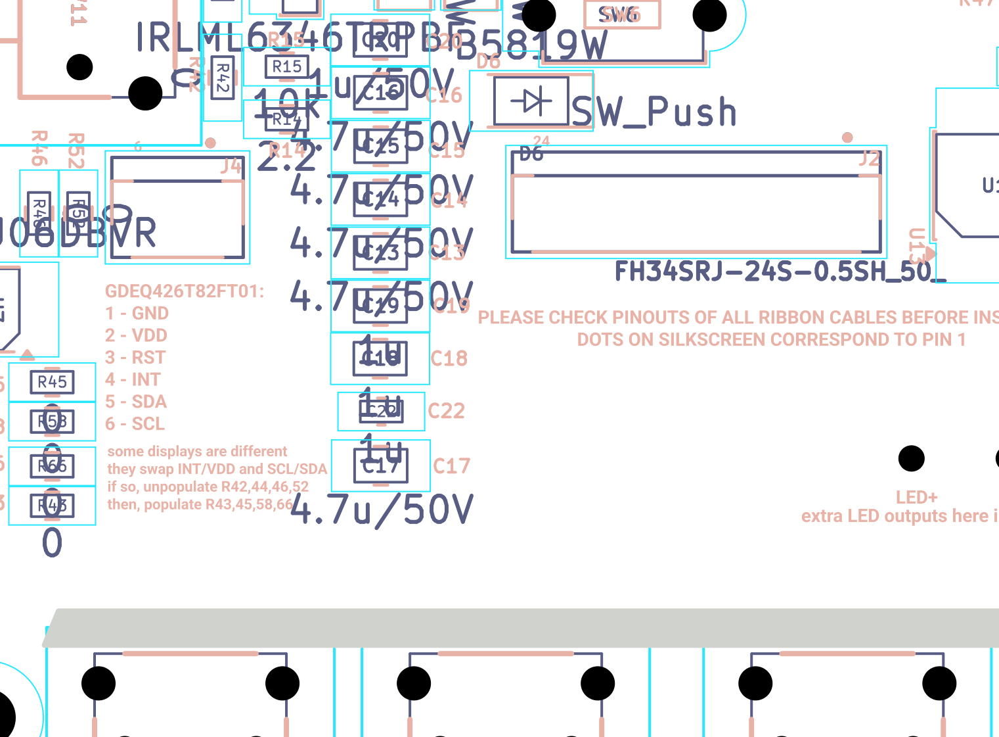
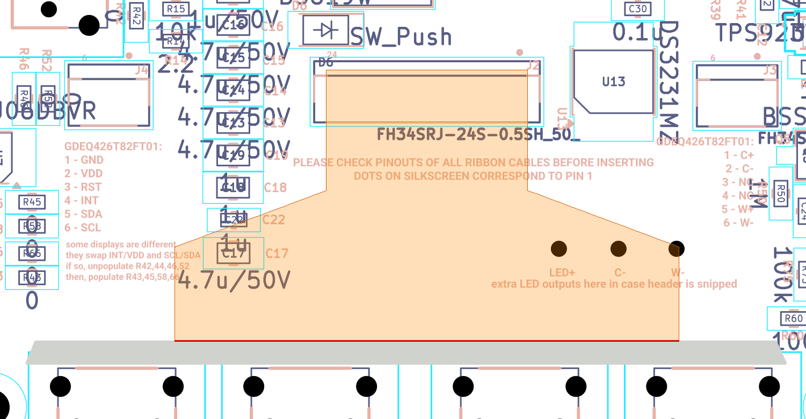
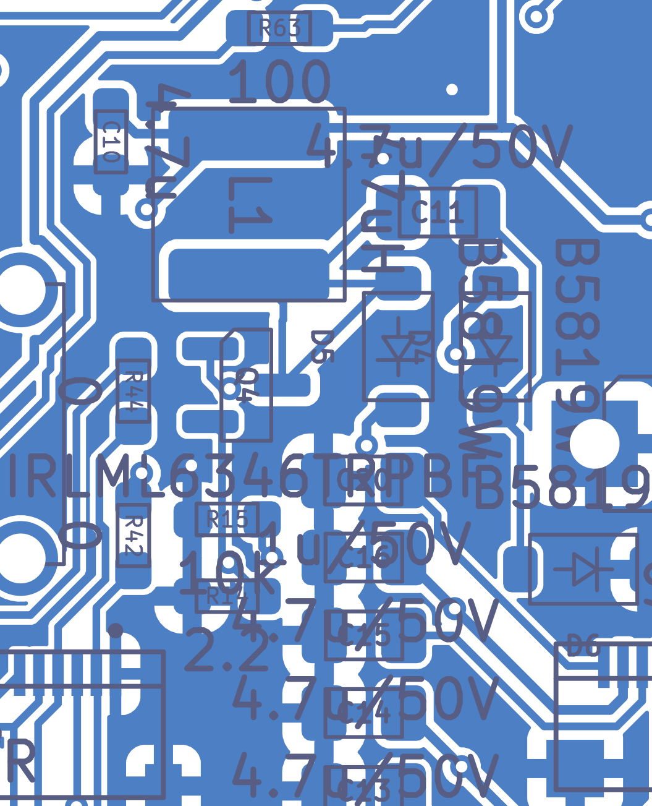

# E-paper panel driver (boost / charge pump) and 24-pin FPC connector

*Independent final review, 2026-09-19. Reviewer key `epd`, finding prefix `EPD-`.
Evidence: `docs/final-review-2026-09-19/evidence/` (the netlist-derived connectivity files are ground truth for
every connection asserted here), plus manufacturer datasheets cited inline. Schematic block crop:
`evidence/sch/blocks/15_eink_driver_connector.png`.*

> **Verification pass, 2026-09-20 (reviewer key `epd_verify`).** Every MEDIUM and DOC finding below was
> re-derived from the netlist, the board file and the datasheets by a second, adversarial reviewer. Net result:
> **no BLOCKER, no HIGH, and after re-grading no MEDIUM either.** Three things changed materially:
> (1) the panel drawing *does* settle the pin-1 question — pin 1 meets pin 1 (EPD-02 is **refuted as a
> finding**; its one useful piece of advice, a continuity check on board #1, now lives under EPD-01);
> (2) the auditor misread the drawing's **24.85 mm** dimension as the tail length — it is the tail's *lateral
> offset*; the tail is **24.0 ±0.3 mm** long, and it fans out to **31.3 mm** wide, so it lies over C17/C22
> (new finding EPD-V01); (3) the Solomon Systech SSD1677 datasheet was obtained, which closes DOC-9 and shows
> the controller maker's own application circuit has **no** GDR pull-down at all (EPD-05 downgraded).
> Corrections are marked **[V]** inline; the full log is in "Verification log" at the end.
> The verification was interrupted once by a usage limit and resumed; on resumption the verifier re-checked
> its own earlier edits against the sources (panel drawing p.5, Hirose p.3/p.4, SSD1677 Table 13-1, netlist,
> board file) before finalising, and additionally confirmed the two LCSC order codes that matter most for an
> assembled board (Q4 `C67276` = IRLML6346TRPBF, J2 `C324726` = FH34SRJ-24S-0.5SH(50)), the L1 land pattern
> against the Laird terminal dimensions, and that the FH34SRJ's open actuator stays inside the connector's own
> 3.8 mm depth (so D6 does not obstruct it).

## What this part of the board does

An e-paper (electrophoretic) panel cannot be driven from 3.3 V. To move the ink particles, the panel's driver
chip needs several higher-voltage rails:

| Rail | Value (datasheet §7.2) | What it does |
|---|---|---|
| VGH | **+19.5 / +20 / +20.5 V** | positive gate-driver voltage (switches the TFT rows on) |
| VGL | **-19.5 / -20 / -20.5 V** | negative gate-driver voltage (holds rows off) |
| VSH1 / VSH2 | **+15 V** typ | positive source (column) drive |
| VSL | **-15 V** typ | negative source (column) drive |
| VCOM | **-2.0 V** typ | common-electrode bias |
| VDD | internal | core logic, regulated down from VCI inside the chip |
| VPP | 7.25–7.75 V | only used when programming the chip's one-time-programmable (OTP) memory |

The driver chip — an **SSD1677**, bonded onto the panel's own flex tail, *not* on this PCB — contains the
switching regulator's *control loop* but not its power parts. It brings two pins out to the host board:
**GDR** (a gate-drive output for an external N-channel MOSFET) and **RESE** (a current-sense input). The host
board must supply the inductor, the MOSFET, the sense resistor and the rectifier diodes; the chip closes the
loop. That is exactly what this block is:

* a **boost converter** — L1 (47 µH) + Q4 (N-FET) + D5 (Schottky) — that makes **PREVGH ≈ +20 V**, and
* an **inverting charge pump** — C11 + D4 + D6 — hanging off the same switch node, that makes **PREVGL ≈ -20 V**.

VSH1/VSH2/VSL/VCOM/VDD are generated *inside* the driver chip from VGH/VGL and only need stabilising
capacitors — that is what C13, C15, C17, C18, C19, C20 are for.

Everything reaches the panel over one **24-pin, 0.5 mm-pitch flat flex cable (FPC)** that plugs into **J2**, a
Hirose FH34SRJ-24S-0.5SH(50) zero-insertion-force (ZIF) connector with a back-flip latch.

Jargon, defined once: *FPC* = the thin flexible ribbon coming off the display. *ZIF* = you lift a latch, drop
the ribbon in, close the latch — no insertion force. *Isat* = the DC current at which an inductor's core
saturates and its inductance collapses. *DC-bias derating* = a ceramic capacitor loses much of its capacitance
when DC voltage is applied across it. *DCM* = discontinuous conduction mode, where the inductor current falls
to zero every cycle. *Vf* = a diode's forward voltage drop.

**Target panel.** The board's own silkscreen names it: `GDEQ426T82FT01` (B.Silkscreen at 96.0, 134.4 and
53.2, 134.1). That is Good Display's **GDEQ0426T82** 4.26" 800×480 module (front-light + touch variant). Its
datasheet mechanical drawing (p.5) confirms driver IC **SSD1677**, 24-contact 0.5 mm FPC, tail width
12.5 ±0.1 mm, tail thickness **0.30 ±0.03 mm** — which is exactly the FPC thickness the FH34SRJ requires
(Hirose p.1 feature 6, p.4 recommended FPC drawing). Everything below is checked against that datasheet and
against **its own reference circuit, §8.2, page 11**, which is the yardstick I use throughout.

## Circuit walk-through

### The 24-pin connector, pin by pin

Ground truth: `evidence/sch/connectivity_by_component.txt` (J2) and `evidence/pcb/board_extract.json` (pad
nets). Panel pin names from GDEQ0426T82 datasheet **§5 Module Interface, p.6** and the pin-assignment table on
the mechanical drawing, **p.5**. Both agree.

| J2 pin | Panel pin name | Net on this board | Correct? |
|---|---|---|---|
| 1 | NC | *(unconnected)* | yes |
| 2 | GDR | `/GDR` → Q4 gate, R15 10 k to GND | yes |
| 3 | RESE | `/RESE` → Q4 source, R14 2.2 Ω to GND | yes |
| 4 | NC | *(unconnected)* | yes |
| 5 | VSH2 | `Net-(C17-Pad2)` → C17 4.7 µF/50 V to GND | yes |
| 6 | NC (ref. circuit calls it TSCL) | *(unconnected)* | yes — see EPD-08 |
| 7 | NC (ref. circuit calls it TSDA) | *(unconnected)* | yes — see EPD-08 |
| 8 | BS1 (SPI mode strap) | **GND** | yes — GND = 4-wire SPI |
| 9 | BUSY (output) | `EPD_BUSY` → R34 33 Ω → U4 IO48 | yes |
| 10 | RES# (active low) | `EPD_RST` → R5 10 k to 3V3, R33 33 Ω → U4 IO47 | yes |
| 11 | D/C# | `EPD_DC` → R32 33 Ω → U4 IO21 | yes |
| 12 | CS# | `EPD_CS` → R31 33 Ω → U4 IO14 | yes |
| 13 | SCL | `SPI_SCK` → R30 33 Ω → U4 IO13 | yes |
| 14 | SDA (input only) | `SPI_MOSI` → R29 33 Ω → U4 IO12 | yes |
| 15 | VDDIO | **3V3** | yes |
| 16 | VCI | **3V3** | yes |
| 17 | VSS | **GND** | yes |
| 18 | VDD | `Net-(C18-Pad2)` → C18 1 µF/50 V to GND | yes |
| 19 | VPP | `Net-(C19-Pad2)` → C19 1 µF/50 V to GND | yes (ref. leaves it open — harmless) |
| 20 | VSH1 | `Net-(C13-Pad2)` → C13 4.7 µF/50 V to GND | yes |
| 21 | VGH | **PREVGH** (boost output) + C14 4.7 µF/50 V | yes |
| 22 | VSL | `Net-(C15-Pad2)` → C15 4.7 µF/50 V to GND | yes |
| 23 | VGL | **PREVGL** (charge-pump output) + C16 4.7 µF/50 V | yes |
| 24 | VCOM | `Net-(C20-Pad2)` → C20 1 µF/50 V to GND | yes |
| S1, S2 | shell | GND | yes |

**All 24 signal assignments match the panel datasheet.** BS1 is tied to GND, which selects 4-wire SPI
(datasheet §5: "3-wire (H active) or 4-wire (L active)") — the same as the reference circuit, and the right
choice because there is a separate D/C# line. There is no MISO, which is correct: panel pin 14 (SDA) is a
data *input*.

### The boost / charge pump

| Ref | Part / value | Role | Checked against datasheet? |
|---|---|---|---|
| L1 | TYS5040470M-10, 47 µH | Boost inductor, 3V3 → EINK_SW | **Yes** — Laird TYS5040 datasheet p.3, row read by word coordinates: 47.00 µH, **Irms 1.00 A typ, Isat 1.10 A typ, DCR 272.0 mΩ TYP / 326.0 mΩ MAX, SRF 6.7 MHz**. Reference calls for "47 µH 500 mA". **Comfortably exceeds it.** **[V]** Row re-extracted independently — identical. *But the Laird part is only the DigiKey/hand-build part:* `production/bom_JLC_upload_v4_optimized.csv` (LCSC C206267) and `fabrication/nextpcb_substitutes.csv` both fit **Sunltech SLW5040S470MST** on assembled boards. LCSC listing: 47 µH, Irms 0.94 A, **Isat 1.3 A**, DCR **650 mΩ** — Isat is fine; the higher DCR costs ~20 mW during a refresh and slightly damps the inrush ring. OK. |
| Q4 | IRLML6346TRPbF, SOT-23 | Boost switch, gate = GDR | **Yes** — Infineon PD-97584A: V(BR)DSS 30 V, VGS ±12 V, VGS(th) 0.5/0.8/1.1 V, R<sub>DS(on)</sub> 63 mΩ @4.5 V / 80 mΩ @2.5 V, Q<sub>g</sub> 2.9 nC, C<sub>iss</sub> 270 pF, I<sub>D</sub> 3.4 A. Reference uses Si1308EDL (also 30 V logic-level). Pinout G/S/D = 1/2/3 matches the `Transistor_FET:BSS138` symbol used. |
| D5 | B5819W = 1N5819HW-7-F, SOD-123 | Boost rectifier, EINK_SW → PREVGH | **Yes** — Diodes Inc, 40 V / 1 A Schottky. Reference uses MBR0530 (30 V / 0.5 A). **Higher ratings**; higher leakage (see EPD-09). Cathode on PREVGH, anode on EINK_SW — correct. |
| C11 | 4.7 µF / 50 V, 0805 (CL21A475KBQNNNE) | Charge-pump coupling cap | **Yes** — reference C3 = 4.7 µF/25 V. Design uses a 50 V part. |
| D4 | B5819W | Pump rectifier: anode = PREVGL, cathode = pump node | **Yes** — matches reference D1 polarity exactly |
| D6 | B5819W | Pump clamp: anode = pump node, cathode = GND | **Yes** — matches reference D2 polarity exactly |
| R14 | 2.2 Ω, 0603 (RC0603FR-072R2L) | Current sense (RESE) | **Yes** — reference R2 = **2.2 Ω**. Exact match. |
| R15 | 10 kΩ, 0603 | GDR pull-down (holds Q4 off) | Good Display's reference shows 1 MΩ; Solomon Systech's own SSD1677 application circuit (Table 13-1) has **no** pull-down at all — see EPD-05 **[V]** (the original text pointed at EPD-06 by mistake) |
| C10 | 4.7 µF / 16 V, 0603 (CL10A475KO8NNNC) | Boost input cap on 3V3 | Reference C4 = 4.7 µF/25 V. Node is 3.3 V, so 16 V is fine. |
| R5 | 10 kΩ | RES# pull-up to 3V3 | Not in the reference circuit, but correct and desirable — keeps the panel out of reset while the ESP32's IO47 is high-Z (boot / deep sleep) |
| R29–R34 | 33 Ω ×6 | Series terminators on SPI/control | Good practice; no datasheet requirement |
| C13–C17 | 4.7 µF / 50 V, 0805 ×5 | VSH1, VGH, VSL, VGL, VSH2 stabilising | Reference: 4.7 µF/25 V for all five. Design's 50 V parts are strictly better |
| C18–C20, C22 | 1 µF / 50 V, 0805 ×3 + 0603 ×1 | VDD, VPP, VCOM, VDDIO+VCI | Reference: 1 µF/25 V for VDD, VCOM, VDDIO/VCI; reference shows **no** cap on VPP |

**The topology is identical to Good Display's own reference circuit** (datasheet p.11): same inductor value,
same sense resistor value, same three-diode arrangement with the same polarities, same capacitor values, BS
strapped to ground, VDDIO and VCI both on 3.3 V with a single 1 µF. Where the design deviates, it deviates
towards higher ratings — except R15.

## Where it is on the board & layout notes

Everything in this block is on the **BOTTOM** copper layer. Board outline bbox: 44.2375–104.2875 mm in x,
36.97–148.25 mm in y (60.05 × 111.28 mm). Remember KiCad's y grows *downward*.



*Bottom-side assembly view, board region x 62–100 mm, y 118–146 mm (mirrored, i.e. as seen looking at the
bottom face — board x increases to the left). J2 is the wide outline at top; the grey band across the bottom
is the FPC slot in Edge.Cuts.*

### J2 and the FPC path

| Item | Value |
|---|---|
| J2 centre / rotation / side | (73.487, 125.750) mm, 180°, **bottom** |
| Body (B.Fab outline) | x 66.49–80.49, y 123.75–127.55 (3.80 mm deep — matches Hirose "Depth: 3.8 mm") |
| Signal pads | 24 × 0.30 × 1.15 mm on 0.5 mm pitch, all at y = 124.325 |
| Pin 1 | x = **67.7375** (low-x end). B.Silkscreen pin-1 dot at (67.74, 123.20) |
| Pin 24 | x = **79.2375**. B.Silkscreen text "24" at (79.7, 123.6) |
| Shell pads S1/S2 | (79.9875, 127.0) and (66.9875, 127.0), both GND |
| **FPC opening faces** | **+y**, i.e. towards the board's bottom edge — confirmed from the STEP model in `render/3d_bottom_persp_a.png` (see below). **[V]** Confirmed independently from Hirose's own drawings, not the 3D model: on the FH34SRJ the SMT signal leads are at the **rear** and the FPC opening + hold-down tabs at the **front** (p.3 top view, p.4 land pattern). On this board the signal pads are at y = 124.325 and the hold-down pads at y = 127.0, so the opening faces +y. |
| Edge.Cuts slot | polygon (51.261, 142.5) (51.861, 141.2) (97.763, 141.2) (98.3, 142.5) → **45.9–46.5 mm wide × 1.30 mm** |
| Corridor, J2 courtyard → slot | 141.2 − 127.83 = **13.37 mm**, no footprints in x 66–81. **[V] That is only the 12.5 mm neck of the tail.** The tail widens to 31.3 mm — C17, C22 and TP3–TP5 sit under the wide part; see EPD-V01 |
| Board material left below the slot | 148.25 − 142.5 = **5.75 mm** bridge, joined only at x < 51.26 and x > 98.3 |
| Nearest obstruction on the *other* side of J2 | D6 (SOD-123), bbox y 120.63–122.98 → **0.52 mm** from J2's courtyard, **0.77 mm** from the pad row |

I confirmed the FPC opening direction by cropping the ray-traced 3D render around J2 (my crop is in the
scratch dir as `j2_3d_persp.png`): the FH34SRJ STEP model shows the dark insertion slot running the full
length of the housing on the side *away* from D6, i.e. on the +y side, with the two hold-down ears on that
same face. **[V] Correction:** the *back-flip actuator is not on that face* — Hirose p.1 feature 3 says "the
rotating actuator opens from the back of the connector", and the p.3 drawing shows it hinged over the lead
row. So the latch is on the **−y (D6) side**, with D6's body 0.77 mm behind the pad row. D6 is a ~1.1 mm-tall
SOD-123 next to a 1.0 mm-tall connector, so it does not block the latch, but that is the side your fingernail
or tweezers approach from. The +y side is the side facing the edge slot. **The intended build is therefore:
panel on the top of the board, tail down through the slot at y ≈ 141.85, folded 180° back under the board, and
inserted into J2 travelling in the −y direction.** The 13.37 mm corridor between the connector and the slot is
deliberately empty.

Because the tail folds about an axis *parallel* to the connector's contact row, the fold does **not** change
which end of the tail is conductor 1 — the left-to-right order is preserved. (The fold does flip which face
the contacts are on, but the `-RJ` suffix of FH34SRJ means **top *and* bottom contact** — Hirose part-number
breakdown, p.3: "RJ : Top and Bottom contact, halogen-free" — so the connector works with the contacts either
way up. That is a good part choice and it removes one half of the classic FPC trap.) What the fold does
*not* fix is which board-x the panel's conductor 1 lands at; see EPD-02.

**[V] Pin 1 does meet pin 1 — proof.** The original review said the Good Display drawing "carries no
view-convention annotation". It does: the title block (p.5, bottom-left of the sheet) carries the
**"3rd Angle Projection"** symbol, and the sheet holds three views in the standard 3rd-angle arrangement —
a front view, an edge view, and a rear view.

* The **front view** is the one dimensioned with "TFT AA", "Border", "PS", "FPL" and captioned
  `4.26" EPD  Dots:480*800`. In it the tail's contact fingers are drawn solid black (visible) and are
  labelled **"1"** and **"24"**. Turn the sheet so the text reads normally: the tail points **down** and
  **"1" is on the LEFT**, "24" on the right. The cross-hatched corner mark is at bottom-left.
* The **rear view** is the mirror image (corner mark at bottom-*right*), with the tail tip hatched as the
  stiffener and the "White mark line" insertion marker — i.e. contacts on the display-face side, stiffener
  on the back.
* Panel face-up on the top of the board, tail towards the slot (+y): seen from above, conductor 1 is at
  **low x**. The wrap through the slot is about an axis parallel to x, so it preserves x. J2 pad 1 is at
  **x = 67.7375** (low-x end), pad 24 at 79.2375 (`board_extract.json`). **Pin 1 lands on pad 1.**
* Cross-check against Hirose: after the wrap the contacts face *away* from the board, i.e. "top contact"
  from J2's point of view. Hirose p.4 draws the FPC from its contact face with "Contact No.1 (Top contact)"
  on the right; looking at the bottom of this board (x mirrored) with the tail entering from below, the
  panel's conductor 1 (low x) is on the right, and Hirose p.3's "Contact No.1" is on the right of the
  connector's top view, where the footprint's pad 1 and the silkscreen dot are. All three agree.



*[V] Bottom-side assembly view, x 50–100 mm, y 120–146 mm (mirrored). Orange = the panel's tail drawn to the
GDEQ0426T82 p.5 dimensions, seated ~3.2 mm into J2 and pulled taut: 12.5 mm wide for the first 7.5 mm, tapering
to **31.3 mm** by 11 mm from the tip, 24.0 mm long in total. C17 and C22 (left) and the three through-hole
pads TP3/TP4/TP5 "LED+ / C− / W−" (right) are underneath it. See EPD-V01.*

### The boost stage



*Bottom copper + fab view, board region x 78–95 mm, y 107–128 mm (mirrored). Blue is copper (the GND pour);
white is the clearance gap. L1 is the large rounded rectangle, Q4 the SOT-23 below it, D5/D4 the two vertical
SOD-123s to its left, C11 above them, and the R15/R14 pair at lower left of L1.*

| Ref | Position (mm) | Note |
|---|---|---|
| C10 | (92.100, 110.663) | input cap; its 3V3 pad is **3.66 mm** from L1's 3V3 pad |
| L1 | (88.500, 112.300) | 5.55 × 5.65 mm land |
| Q4 | (88.567, 117.006) | drain pad **2.99 mm** from L1's switch pad |
| R14 (2.2 Ω) | (89.067, 122.506) | its RESE pad is **4.75 mm** from Q4's source pad |
| R15 (10 k) | (89.067, 120.506) | **4.65 mm** from Q4's gate pad |
| D5 | (84.600, 116.000) | anode 3.90 mm from L1's switch pad |
| C11 | (83.567, 112.506) | pump cap |
| D4 | (82.067, 116.010) | |
| D6 | (79.767, 121.806) | its anode is **9.37 mm** from C11's pump-node pad |
| C13–C20 | x ≈ 85.5, y 119.5–135.7 | the rail caps, in a column beside J2's right-hand end |
| C22 | (85.472, 133.624) | the only VDDIO/VCI decoupling cap |

Routed lengths from `evidence/pcb/net_routing_stats.csv`:

| Net | Length | Vias | Width | By layer |
|---|---|---|---|---|
| `EINK_SW` (switch node) | 15.38 mm | 0 | 0.20 | all B.Cu |
| `/GDR` | 36.31 mm | 3 | 0.20 | B.Cu 8.29 + F.Cu 28.01 |
| `/RESE` | 36.63 mm | 2 | 0.20 | B.Cu 8.20 + F.Cu 28.42 |
| `PREVGH` (+20 V) | 22.66 mm | 2 | 0.25 | B.Cu 13.26 + F.Cu 9.39 |
| `PREVGL` (−20 V) | 17.24 mm | 2 | 0.25 | B.Cu 10.59 + F.Cu 6.64 |
| `Net-(D4-K)` (pump node) | 10.56 mm | 0 | 0.20 | all B.Cu |
| `Net-(C17-Pad2)` (VSH2) | 19.84 mm | 0 | 0.20 | all B.Cu |
| `Net-(C18-Pad2)` (VDD) | 14.81 mm | 0 | 0.20 | all B.Cu |
| `Net-(C19-Pad2)` (VPP) | 14.96 mm | 0 | 0.20 | all B.Cu |
| `Net-(C13-Pad2)` (VSH1) | 12.65 mm | 0 | 0.20 | all B.Cu |
| `Net-(C15-Pad2)` (VSL) | 8.39 mm | 0 | 0.20 | all B.Cu |
| `Net-(C20-Pad2)` (VCOM) | 7.56 mm | 0 | 0.20 | all B.Cu |

The long `/GDR` and `/RESE` figures look alarming but decompose harmlessly — see "Checked and found OK".

Net classes (`evidence/pcb/board_extract.json`): `EINK_SW` → class **SW** (0.20 mm track, 0.25 mm clearance);
`PREVGH`, `PREVGL`, `3V3` → class **Power** (0.25 mm track, 0.20 mm clearance); everything else Default
(0.20 mm / 0.15 mm). GND pour on both F.Cu and B.Cu covers the whole board.

## Calculations

Throughout: Vin = 3.3 V, VGH = 20 V typ (max 20.5 V), Vf(Schottky) ≈ 0.4 V.

**1. Boost duty cycle.**
D = 1 − Vin/(VGH + Vf) = 1 − 3.3 / 20.4 = **0.838**.

**2. Peak inductor current.** The SSD1677's internal sense threshold is not published, so I bound it. The
sense resistor is 2.2 Ω, identical to the reference:

| Assumed sense threshold | I<sub>pk</sub> = V<sub>th</sub>/2.2 Ω |
|---|---|
| 0.22 V | 100 mA |
| 0.50 V | 227 mA |
| 1.10 V | 500 mA (= the reference's stated inductor rating) |

Because **both** L (47 µH) and R<sub>sense</sub> (2.2 Ω) are identical to the reference, the operating point of
this board is identical to the reference's. The reference calls for an inductor rated 500 mA; L1 is rated
**Isat 1.1 A / Irms 1.0 A** — so even at the extreme end of the table there is 2.2× margin on saturation.
**L1 is correctly chosen.**

**3. Power delivered.** In DCM, P<sub>out</sub> ≈ ½·L·I<sub>pk</sub>²·f<sub>sw</sub>. With L = 47 µH and
I<sub>pk</sub> = 227 mA: ½ × 47e-6 × 0.227² = **1.21 µJ/cycle**; at 100 kHz that is **121 mW**, at 20 kHz
**24 mW**. An SSD1677 driving a 4.26" panel needs a few tens of mW on the gate/source rails, so the stage has
ample headroom.

**4. R14 dissipation** (0603, 100 mW rating). For a current ramping 0 → I<sub>pk</sub> during the on-time,
P = D · (I<sub>pk</sub>²/3) · R:

| I<sub>pk</sub> | P(R14) | vs 0603 rating |
|---|---|---|
| 100 mA | 6.1 mW | 6 % |
| 227 mA | 31.7 mW | 32 % |
| 400 mA | 98 mW | 98 % — the limit |
| 500 mA | 154 mW | **over** |

So R14 is safe for any plausible I<sub>pk</sub> up to ~400 mA, and the boost only runs for the 1–4 s of a
refresh (datasheet §7.3: full update 4 s). **OK, with the caveat that if you ever see R14 discolour, the sense
threshold is higher than assumed.**

**5. Q4 losses and stress.**
Conduction: P = D · (I<sub>pk</sub>²/3) · R<sub>DS(on)</sub> = 0.838 × (0.227²/3) × 0.070 ≈ **1.0 mW**. Negligible.
Gate drive: Q<sub>g</sub> = 2.9 nC → at 100 kHz, 0.29 mA average from GDR. R15 (10 k) adds
3.3 V / 10 kΩ = **0.33 mA** while GDR is high. Total ≈ 0.6 mA — trivial for a CMOS output.
Gate voltage: GDR swings to VDDIO = 3.3 V; VGS(th) max is 1.1 V, so Q4 is fully enhanced, and VGS(max) = ±12 V
gives a 3.6× margin. **Correct MOSFET choice for 3.3 V gate drive.**
Drain stress: V<sub>DS(off)</sub> = VGH<sub>max</sub> + Vf = 20.5 + 0.4 = **20.9 V** against
V(BR)DSS = 30 V → only **30 % headroom before ringing is counted**. See EPD-03.
**[V] Ringing estimate (added in verification).** When Q4 turns off, the inductor current has to transfer into
D5 → C14 through the parasitic inductance of that loop. C14 is ~9 mm and two vias from D5 (EPD-07), so call the
loop L<sub>par</sub> ≈ 20 nH. The node capacitance is Q4's C<sub>oss</sub> (32 pF) plus two Schottky junctions
and copper, ≈ 120 pF. Undamped overshoot = I<sub>pk</sub>·√(L<sub>par</sub>/C<sub>node</sub>) =
0.3 A × √(20 nH / 120 pF) = 0.3 × 12.9 = **3.9 V** → peak ≈ 25 V; at I<sub>pk</sub> = 0.5 A, 6.5 V → ≈ 27 V.
Both are under 30 V, and even if a spike did reach breakdown the energy available is
½·L<sub>par</sub>·I² = ½ × 20 nH × (0.5 A)² = **2.5 nJ**, which is nothing to a MOSFET. Also note
that *both* published reference circuits use a 30 V FET (Good Display: Si1308EDL; Solomon Systech SSD1677
Table 13-1: Si1304BDL). This is why EPD-03 is re-graded LOW.
**[V] Unit slip corrected:** the original text gave R15's load as "~0.28 mW average". 0.838 × 0.33 mA =
0.28 **mA** average *current*; the average *power* is D·V²/R = 0.838 × 3.3² / 10 kΩ = **0.91 mW**. Still trivial.

**6. Diode stress.** Worst-case reverse voltage on D4, D5 and D6 is 20.9 V (D5: PREVGH vs 0 V when Q4 is on;
D6: pump node at −20 V; D4: pump node at +0.4 V while PREVGL is −20 V). 1N5819HW is rated 40 V →
**48 % derating**, better than the reference's 30 V MBR0530. Forward current 0.23 A vs 1 A rating.

**7. C11 stress.** The pump node is clamped by D6 to +0.4 V and driven to −20 V; EINK_SW swings 0 → +20.4 V.
So C11 sees ±20 V on a 50 V part. **Fine** (reference uses 25 V).

**8. Capacitor DC-bias derating.** The ±20 V rails sit on 0805 X5R 4.7 µF/50 V parts (Samsung
CL21A475KBQNNNE; 4.7 µF / 50 V / X5R / 0805 / ±10 % — confirmed on the distributor listing for LCSC C513770).
I could not obtain Samsung's DC-bias curve for this exact part, so I will not quote a number. What I *can*
say rigorously: the reference circuit specifies **4.7 µF/25 V** for the same nodes. A 50 V part in the same
0805 case has thicker dielectric layers than a 25 V part of the same capacitance, so at 20 V bias it retains
*more* capacitance than the part the panel maker specified. **The design is on the safe side of the
reference.** For a rough sense of scale, an 0805 X5R at ~40 % of rated voltage typically loses 40–70 %, so
C14/C16 probably present 1.4–2.8 µF at +20/−20 V — still ≥ the ~1 µF that these "stabilising capacitor" pins
need. Reliability-wise, 20.5 V on a 50 V part is a comfortable 41 % of rating.

**9. FPC reach.** This is the one geometric budget that worries me (EPD-01). Required tail length, measured
from where the tail leaves the panel:

```
  slot inner edge -> J2 opening (under the board)   141.20 - 127.83 = 13.37 mm
  insertion depth into J2 (Hirose: 2.5 mm stiffener,
      3.15 mm exposed contacts on the panel tail)              ~  3.0 mm
  180-degree wrap around a 1.6 mm board with ~0.6 mm
      bend radii                                               ~  3.5 mm
  ------------------------------------------------------------------------
  consumed before the tail even reaches the slot             ~ 19.9 mm
```
~~The GDEQ0426T82 mechanical drawing (p.5) dimensions the tail region as **24.85 ±0.3 mm** (and 31.3 ±0.2 mm for
the wider fan-out portion). Reading 24.85 mm as the free tail length leaves **≈ 5 mm** to get from the panel's
edge to the slot.~~ — **[V] corrected: 24.85 mm is not the tail length.** On the drawing, dimension ⑫
"24.85 ±0.3" runs *across* the panel, from the panel's side edge to the pin-1 edge of the tail — it is the
tail's **lateral position** (check: 24.85 + 12.5/2 = 31.10 ≈ 62.37/2 = 31.19, i.e. the tail is centred on the
panel; likewise 15.45 + 31.3/2 = 31.10 for the wide part). The **tail length is dimension ⑪, "24 ±0.3 mm"**,
from the glass edge to the tip; I confirmed it by scaling the drawing (12.5 mm ↔ 233 px → the tip-to-glass
distance measures 24.1 mm). Tail shape, measured the same way: 12.5 mm wide for the first **7.5 mm** from the
tip, tapering out to **31.3 mm** by **11 mm** from the tip, then 31.3 mm wide to the glass; the marked
"Bending Area" is the last ~3 mm next to the glass.

Revised budget, measuring to J2's body face (y = 127.55) rather than its courtyard: 13.65 mm + ~3.2 mm
insertion (the panel's white insertion-mark line is 3.55 mm from the tip) + ~3.5 mm wrap ≈ **20.3 mm** of a
**24.0 ±0.3 mm** tail → **≈ 3.5–4 mm** of slack, not 5. That is still fine, and in fact it is *self-consistent
with the board*: a 105.33 mm-long panel laid flush with the board's top edge (y = 36.97) puts its tail-side
glass edge at y = 142.3, directly over the slot (141.2–142.5), so the tail drops straight through in its
bending area and the ~4 mm excess is lost as a gentle bow under the board. Excess is harmless; only a
*shortage* would be fatal, and that needs the panel pushed > 4 mm up-board, which nothing would cause.
Workable, and nothing in the design files fixes where the panel sits — but the numbers show the designer
laid it out against the real panel. One side-effect worth knowing for the enclosure: J2's centre
(x = 73.49) is 0.78 mm left of the board centre-line (x = 74.26) and the tail is centred on the panel, and the
panel (62.37 mm) is wider than the board (60.05 mm) — so with a straight tail the glass overhangs the board
by ≈ 1.9 mm on the low-x side and ≈ 0.4 mm on the high-x side (or the tail takes a 0.8 mm skew, which it
easily can).

## Findings

| ID | Severity | Finding | Evidence | Recommendation |
|---|---|---|---|---|
| EPD-01 | ~~MEDIUM~~ → **LOW** [V] | Nothing in the design data defines where the panel sits or how its tail reaches J2. **[V] corrected numbers:** the tail is **24.0 ±0.3 mm** long (the 24.85 mm the original review used is the tail's *lateral offset* on the panel, not its length); the reach budget is ≈20.3 mm, leaving **≈3.5–4 mm** of slack, not 5 | No *board-level* graphics on any User/Dwgs/Cmts/Eco layer (pcbnew scan; the only objects on those layers are 9 library graphics inside footprints). 13.65 mm (slot edge → J2 body face) + ~3.2 mm insertion + ~3.5 mm wrap ≈ 20.3 mm of a 24.0 mm tail. A panel laid flush with the board's top edge puts its glass edge at y = 142.3, right over the slot, so the geometry is coherent — it was clearly laid out against the real panel. The slot is 46 mm wide because the display tail is **31.3 mm** wide where it passes through (plus the front-light and touch tails either side), not 12.5 mm | Documentation job, not a board change. Cut a paper tail to the real shape (12.5 mm × 7.5 mm neck, tapering to 31.3 mm at 11 mm, 24 mm long) and check it on a 1:1 print; add a panel outline + fold line on User.Drawings and a photo of a correct assembly to the build docs. **[V]** From EPD-02: state the orientation in words ("panel face-up, tail through the slot, conductor 1 at the silkscreen dot") and, on board #1 only, ohm out tail contact 1 → J2 pad 1 before first power-up |
| EPD-02 | ~~MEDIUM~~ → **NONE — refuted** [V] | ~~Pin-1 orientation of the panel tail cannot be proved from the design data~~ — **refuted by verification: it can, and it is correct.** The GDEQ0426T82 drawing (p.5) *is* marked "3rd Angle Projection"; its front view shows the tail pointing down with contact **"1" on the left**; panel face-up with the tail towards the slot therefore puts conductor 1 at low x, and J2 pad 1 is at x = 67.7375 (low x). The wrap preserves x; the FH34SRJ is dual-contact. Pin 1 meets pad 1 (full proof under "J2 and the FPC path"). What remains is only the consequence analysis for a reversed tail | Reversed, J2 15/16 (3V3, no series R) would meet panel 10 (RES#) and 9 (BUSY, an output) while VCI/VDDIO get `EPD_RST`/`EPD_BUSY`; the boost cannot start (panel GDR would sit on J2 23). **[V]** Two corrections: a reversed insertion needs the 24 mm tail twisted 180° or the panel mounted face-down, which is not a plausible slip; and the back-feed current is set by what the parasitically-powered chip draws plus one output-contention path on BUSY, not "only by the 3V3 regulator" | No action as a finding. (Advice carried over to EPD-01:) keep the silk warning, and as cheap insurance on board #1 only: with the tail latched and the board unpowered, ohm out tail contact 1 → J2 pad 1. State the orientation ("panel face-up, tail through the slot, pin 1 at the silkscreen dot") in the build docs |
| EPD-03 | ~~MEDIUM~~ → **LOW** [V] | Q4 sits at 20.9 V of a 30 V rating with no snubber and no measured switch-node ringing | V<sub>DS(off)</sub> = 20.5 V (datasheet §7.2, re-checked) + 0.4 V = 20.9 V vs V(BR)DSS = 30 V (PD-97584A, re-checked). **[V]** *Both* published reference circuits use a 30 V FET at this same 20 V output (Good Display §8.2: Si1308EDL; Solomon Systech SSD1677 Table 13-1: Si1304BDL). Estimated overshoot 3.9 V at 0.3 A / 6.5 V at 0.5 A (calculation 5) → ≤ ~27 V, and the energy behind any spike is ~2.5 nJ | Bring-up measurement only: scope `EINK_SW` at Q4's drain during one full refresh. Only if peaks exceed ~28 V consider a 40 V logic-level SOT-23 part. Do not change it blind |
| EPD-04 | ~~MEDIUM~~ → **LOW** [V] | The panel's decoupling and rail-stabilising caps are 13–20 mm from the pins they serve | **[V] measured along the copper:** J2.15/16 → C22 is **16.4 mm** of **0.25 mm** `3V3` track (≈32 mΩ; the original "≈13 mm" was the straight-line distance and 3V3 is 0.25 mm, not 0.20 mm); J2.16 → L1's 3V3 pad is 24.3 mm on the same net. `Net-(C18-Pad2)` 14.81 mm, `Net-(C19-Pad2)` 14.96 mm, `Net-(C17-Pad2)` 19.84 mm at 0.20 mm. Why LOW: the driver IC is not at J2 — it is on the panel glass at the far end of the panel's own ≥ 24 mm flex tail, whose conductors are finer than these tracks, so the board adds roughly half again to an inductance the panel maker already accepts; the SSD1677 draws a few mA with slow edges | Accept. On a respin move C22, C18 **and C17** behind J2 (y ≈ 119–123) — that also takes C17/C22 out from under the panel tail (EPD-V01). Scope VCI at J2 during a refresh if artefacts ever appear |
| EPD-05 | ~~MEDIUM~~ → **LOW** [V] | R15 = 10 kΩ where Good Display's reference circuit shows **1 MΩ** on GDR | Netlist: R15 = 10k, GND ↔ `/GDR` (re-checked). GDEQ0426T82 §8.2 p.11: R1 = 1 MΩ (re-read from the page image — confirmed). **[V]** But the controller maker's own application circuit — Solomon Systech SSD1677 Rev 1.0 §13, Table 13-1 — lists only C0–C8, R1 (2.2 Ω sense), D1–D3, Q1, L1: **no gate pull-down at all**. So the value is the board designer's free choice, not a control-loop parameter. GDR has to slew a 270 pF gate in tens of ns (output impedance of at most a few hundred ohms), so a 10 kΩ load is a percent-level burden. `HARDWARE.md` §6.2 line 619 shows the 10 k is deliberate ("pulls Q4's gate down so the pump stays off when the panel is unpowered or high-Z"). Load = 0.33 mA while GDR is high, 0.91 mW average (not "0.28 mW" — unit slip) | No change needed. Keep it in mind only as a late item on the bring-up checklist: if VGH is low or slow *and* everything else checks out, try 100 kΩ–1 MΩ |
| EPD-06 | LOW | No pull on `EPD_CS` (floats during ESP32 boot with the panel powered) and no pull on `EPD_BUSY` (floats if the panel is absent) | `EPD_CS` has exactly 2 nodes: J2.12 and R31.1. `EPD_BUSY` has 2 nodes: J2.9 and R34.1. No pull-ups/downs anywhere on either net | Enable the ESP32-S3's internal pull-up on IO14 (CS) and pull-down on IO48 (BUSY) in the first lines of `app_main`. A floating BUSY makes most SSD16xx driver libraries spin forever when no panel is plugged in. Optionally fit a 10 k pull-up on `EPD_CS` at the next spin |
| EPD-07 | LOW | The ±20 V reservoir caps are 8–9 mm and 2 vias away from their rectifiers, so the diode's pulsed current has no local capacitor | Reference C5 (4.7 µF) sits **at** the boost output; here `PREVGH` runs 22.66 mm / 2 vias from D5's cathode (84.60, 117.65) to C14 (85.50, 125.55) and J2 pin 21, and `PREVGL` 17.24 mm / 2 vias from D4 to C16 | Add a 1 µF/50 V 0603 directly at D5's cathode and another at D4's anode on the next spin (~2 parts, negligible cost). Raises rail ripple and radiated noise as-is, but will work |
| EPD-08 | LOW | J2's symbol labels pins 6/7 "TSCL/TSDA" and the board leaves them open; touch is brought out on a separate 6-pin connector (J4) | Panel datasheet §5 p.6 calls pins 6/7 **NC**, but the manufacturer's own reference circuit (p.11) labels them TSCL/TSDA. The board's B.Silkscreen at (96.0, 134.4) documents J4 as `GDEQ426T82FT01: 1-GND 2-VDD 3-RST 4-INT 5-SDA 6-SCL` | Confirm with the vendor that the exact touch module you buy brings the touch I²C out on a **separate** 6-pin tail and not on pins 6/7 of the 24-way. If it is on the 24-way, touch simply will not work — no damage |
| EPD-09 | LOW | D4/D5/D6 use 1N5819HW, whose reverse leakage is ~5× the reference MBR0530's | Diodes Inc 1N5819HW-7-F: I<sub>R</sub> up to 1 mA at V<sub>R</sub> = 40 V, 25 °C, and roughly an order of magnitude more at 100 °C. ON Semi MBR0530: ~0.2 mA at 30 V. At 20 V reverse the figures are much lower, but the ratio holds | Accept for a prototype — the rails are only live during a refresh, so this costs efficiency, not function. If refresh current turns out higher than expected, try MBR0530 or BAT54 (same SOD-123/SOT-23 class) |
| EPD-10 | LOW (**closed** [V]) | Seven vias sit under J2's body or in the FPC's lie-flat corridor | Under the body: GND (71.30, 125.50), GND (70.00, 126.40), `/RESE` (69.50, 127.10). In the corridor: `/GDR` (71.00, 128.30), GND (70.90, 129.20), `I2C_SDA` (66.88, 132.51), `I2C_SCL` (68.38, 133.22). All 0.6 / 0.3 mm (re-listed with pcbnew — identical). **[V]** The board file's plot setup is `(tenting front back)`, so these vias are solder-mask **tented on both sides** in any gerbers plotted from it | Nothing to do beyond not ticking a "vias not covered" option at the fab |
| EPD-11 | LOW | J2 pad 17 (VSS) reaches the GND pour through a single thermal spoke | DRC `starved_thermal` warning: "Pad 17 [GND] of J2 on B.Cu @(75.737, 124.325)", zone min spoke count 2, actual 1. Pad 8 (the other GND) is not flagged | Set J2's GND pads to a solid zone connection. Current is only a few mA so this is about inductance in the ±20 V return path, not heating |
| EPD-12 | DOC | Three `silk_over_copper` DRC warnings on J2's own outline, and the build note that matters most sits where the FPC will cover it | DRC: segments of J2 on B.Silkscreen at (66.487, 124.65), (79.717, 127.55), (80.487, 124.65). B.Silkscreen text "PLEASE CHECK PINOUTS OF ALL RIBBON CABLES BEFORE INSERTING / DOTS ON SILKSCREEN CORRESPOND TO PIN 1" is at (70.6, 131.2), i.e. inside the FPC corridor | Cosmetic. If you re-do the silk, move the warning text just outside the corridor (e.g. x < 60 or x > 82) so it stays readable after assembly |
| EPD-13 | CERT-LATER | Minimum copper gaps of 0.201 mm between the +20 V / −20 V nets and their neighbours | Pairwise clearance scan of the scratch board: `PREVGH` (+20 V) vs `/GDR` (0–3.3 V) 0.201 mm near (82.95, 126.95); `PREVGL` (−20 V) vs `Net-(C15-Pad2)` (VSL, −15 V) 0.201 mm near (78.24, 125.24). Both legal (netclass Power clearance = 0.20 mm; IPC-2221 table B4 needs ~0.13 mm for 31–50 V on a coated external layer). **[V] addition:** the largest voltage difference across a 0.20 mm gap in this block is not either of those — it is at J2 itself: pad 21 (VGH, +20 V) sits next to pad 22 (VSL, −15 V), **35 V across 0.50 − 0.30 = 0.20 mm**, and pads 23/24 (VGL −20 V / VCOM −2 V) are 18 V apart. That is fixed by the panel's pinout and the 0.5 mm-pitch connector and is identical on every SSD16xx host board, so it is not actionable; it is the reason to clean flux residue off J2 pads 20–24 after any hand rework | Fine for a prototype. If this ever goes for a safety/EMC certification, or if the enclosure is humid, widen the ±20 V nets' clearance to 0.35–0.4 mm |
| EPD-14 | CERT-LATER | The boost pulls pulsed current from the shared 3V3 rail that also feeds the panel's VCI | L1 returns to 3V3 with only C10 (4.7 µF / 16 V 0603, ≈3 µF after bias) locally; the panel's VCI/VDDIO come off the same 3V3 with C22 13 mm away. Datasheet p.7: "ripple and noise are not allowed" on VCI/VDD. The reference circuit does the same thing, so this is normal practice | Measure 3V3 ripple at J2 pins 15/16 during a refresh. If it exceeds ~50 mV, add a small ferrite + 1 µF between 3V3 and J2 pins 15/16 on a respin |
| EPD-V01 | LOW | **[V, new]** The panel tail is not 12.5 mm wide all the way: it fans out to **31.3 mm**, and C17, C22 and the through-hole pads TP3/TP4/TP5 sit underneath the wide part. The "clear corridor" only covers the 12.5 mm neck | GDEQ0426T82 p.5: neck 12.5 mm × 7.5 mm, taper to 31.3 mm at 11 mm from the tip, 24 mm long. Seated in J2 (tip at y ≈ 124.35, centre x = 73.49) and pulled taut, the tail is full-width from y ≈ 135.4 to the slot, spanning **x 57.8–89.1**. Footprints whose bbox falls inside that envelope (pcbnew scan): **C17** (4.7 µF/50 V 0805, ~1.25 mm tall, bbox x 83.59–87.40, y 134.67–136.68 — fully under), **C22** (0603, partly under the taper), and **TP3/TP4/TP5** (through-hole, x 56.2–67.1, y 133.6–137.2, silkscreened "LED+ / C− / W− extra LED outputs here"). Any slack in the tail moves the fan-out *towards* J2, i.e. over C18/C19 as well. See `img/epd_verify_tail_envelope.png` | No electrical risk — the tail is coverlay-insulated everywhere except its tip — and it will work: the flex simply rides over a 1.25 mm bump on one edge. But (a) allow ~1.5 mm for it in the rear enclosure and do not let the case press the tail onto C17; (b) **do not solder wires to TP3–TP5 on the bottom side** on a build that has the panel fitted (on the top side they are under the glass); (c) on a respin move C17/C22 behind J2, which also fixes EPD-04 |
| EPD-V02 | DOC | **[V, new]** Q4 and D4–D6 still carry the *library symbol's* Description and Datasheet fields, which describe different parts | `evidence/sch/bom_ungrouped.csv`: Q4 (MPN IRLML6346TRPBF, 30 V / 3.4 A) has Description "50V Vds, 0.22A Id, N-Channel MOSFET, SOT-23" and Datasheet = onsemi **BSS138**; D4/D5/D6 (MPN 1N5819HW-7-F, 40 V / 1 A) have "30V 0.5A Schottky Power Rectifier Diode" and Datasheet = MCC **MBR0520–0580**. The symbol names are `Transistor_FET:BSS138` and `Diode:MBR0530`. The JLC upload BOM does not export these columns, so assembly is unaffected — but a replicator or a fab's BOM engineer reading the full BOM sees a 50 V FET that is really a 30 V one, which matters for exactly the margin discussed in EPD-03 | Overwrite the Description and Datasheet fields on Q4, D4, D5, D6 with the fitted parts' data (schematic-only edit, no netlist change) |

### Notes on the non-trivial findings

**EPD-01 / EPD-02 — the mechanical gap.** These two are the same underlying problem: the board defines the
*electrical* interface to the panel perfectly, and says nothing about the *mechanical* one. There is not a
single graphic on any User, Dwgs, Cmts or Eco layer in `silkscreen_pcb.kicad_pcb`. The Edge.Cuts slot is
45.9–46.5 mm wide but the display tail is only 12.5 mm, so the slot does not locate the tail (it is that wide
because the 6-pin touch tail for J4, at x ≈ 90–96, has to pass through it too). **[V] Correction:** 12.5 mm is
only the tail's neck; where it passes through the slot the display tail is **31.3 mm** wide (x ≈ 57.8–89.1),
with the front-light tail (J3, x ≈ 52–56) and touch tail (J4, x ≈ 91–94) either side of it — that is what the
46 mm slot width is for. The designer clearly knows
about the risk — the B.Silkscreen carries an explicit "PLEASE CHECK PINOUTS OF ALL RIBBON CABLES BEFORE
INSERTING / DOTS ON SILKSCREEN CORRESPOND TO PIN 1" — but that is a warning, not a definition. For a
prototype the right answer is not a board change, it is a documented build step and a paper mock-up before you
spend money on panels.

I want to be explicit about what I could and could not prove. **Proved:** J2's pin 1 is at the low-x end and
is marked with a silkscreen dot; the connector's FPC opening faces the board's bottom edge, where the slot is;
a 180° fold about the slot line preserves the left-to-right conductor order, so the fold cannot swap pin 1 for
pin 24; and the FH34SRJ`-RJ` variant has top *and* bottom contacts, so the contact face does not matter.
~~**Not proved:** which board-x the panel's conductor 1 arrives at, because that depends on the panel's
orientation and on whether the Good Display mechanical drawing (p.5) is a front or a rear view — the drawing
is not annotated with a view convention, and the design files contain nothing that constrains the panel's
placement. I am therefore *not* claiming the design is wrong; I am claiming it is unverifiable from the
design data~~ — **refuted by verification:** the drawing's title block is marked "3rd Angle Projection", the
view carrying the active-area dimensions and the `4.26" EPD` caption is the front view, and in it contact "1"
is on the left with the tail pointing down. With the only arrangement the board allows (panel face-up on top,
tail through the slot into a connector whose mouth faces the slot) conductor 1 arrives at low x, which is where
J2 pad 1 is. The step-by-step proof and the Hirose cross-check are under "J2 and the FPC path" above. The
one-off continuity check on board #1 is still worth its thirty seconds, which is why the EPD-02 row is kept
visible — but as a *finding* it is withdrawn (severity NONE) and that advice now sits under EPD-01. **Also corrected:** the tail is 24.0 mm long, not 24.85 mm, and it is 31.3 mm wide for
its last 13 mm — see calculation 9 and EPD-V01.

**EPD-03 — Q4's voltage margin.** 20.9 V steady-state on a 30 V part is the same choice the panel maker made,
so I would not change it blind. But nobody has measured the switch-node overshoot on this particular layout
(15.38 mm of switch node, a shielded 47 µH inductor, a SOD-123 rectifier 3.9 mm away). Shielded drum-core
inductors have low leakage inductance and the currents here are small, so I expect this to be fine — but it is
cheap to check with a scope on day one and expensive to discover as an intermittent failure later.

**EPD-05 — the GDR pull-down.** I spent some time deciding whether this is a real risk. The datasheet
describes GDR only as "N-Channel MOSFET gate drive control pin"; it gives no output-drive spec. If GDR is a
conventional push-pull CMOS output (which is overwhelmingly likely), 330 µA of extra load is nothing and 10 kΩ
is arguably *better* than 1 MΩ because it discharges Q4's gate faster when GDR goes high-impedance. The
reason I rated it MEDIUM rather than LOW is that it is the only deviation from the reference on the control
path, it is free to correct, and it would be an annoying thing to be chasing during bring-up.

**[V] Why EPD-03, EPD-04 and EPD-05 were re-graded to LOW.** The severity rubric reserves MEDIUM for things
that are "marginal, risky or performance-degrading". None of these three is, once the second reference is on
the table. The Solomon Systech SSD1677 datasheet (Rev 1.0, §13, Table 13-1 — obtained during verification)
lists the controller maker's own application circuit: 47 µH (CDRH2D18 / LDNP-470NC, a ~0.3–0.5 A class
part), 2.2 Ω, MBR0530 ×3, **Si1304BDL (a 30 V FET)**, 4.7 µF/25 V ×6 — and **no GDR pull-down resistor at
all**. So (a) a 30 V switch at 20 V out is what both the controller maker and the panel maker ship, and the
overshoot estimate in calculation 5 says why that is safe; (b) the GDR pull-down is an optional extra whose
value each board designer picks — 1 MΩ at Good Display, 10 kΩ here, deliberately, per `HARDWARE.md` line 619;
and (c) the rail capacitors in every reference design sit on the host board at the far end of the panel's
own flex tail, so another 15 mm of 0.2 mm track is a modest addition to an inductance that is already there.
All three remain worth a glance with a scope on board #1; none is a reason to touch the layout before
ordering.

**EPD-V01 — the tail is wider than the corridor kept clear for it.** The original review checked that
x 66–81 is empty between J2 and the slot. That is the right check for a 12.5 mm ribbon, but the GDEQ0426T82
tail is only 12.5 mm wide for its first 7.5 mm; it then flares to 31.3 mm. With the tip seated in J2 the flare
begins ~4 mm in front of the connector and the tail is full width from y ≈ 135 to the slot, covering
x 57.8–89.1. C17 sits squarely under its high-x edge, C22 under the taper, and the three through-hole
"extra LED output" pads TP3–TP5 under its low-x half. None of this stops the board working — a polyimide
flex will lie over a 1.25 mm capacitor without complaint — but it is the sort of thing that is obvious the
moment the panel is fitted and invisible in the CAD data, so it belongs in the record: leave room for it in
the case, and do not use TP3–TP5 for wires on a build with the display installed.

## Checked and found OK

* **All 24 FPC pin assignments** match GDEQ0426T82 §5 (p.6) and the pin table on the mechanical drawing (p.5).
  Verified pad-by-pad from `board_extract.json`, not from the schematic image.
* **BS1 → GND** selects 4-wire SPI, matching the reference circuit and matching the fact that a separate D/C#
  line exists. No MISO is needed (panel pin 14 SDA is input-only).
* **VDDIO (15) and VCI (16) both on 3.3 V with one shared 1 µF** — exactly the reference arrangement (C6).
* **VSS (17) and BS1's ground both on GND**, shell pads S1/S2 on GND.
* **Boost topology and all three diode polarities** match the reference circuit pin-for-pin: D5 anode on the
  switch node / cathode on PREVGH; D4 anode on PREVGL / cathode on the pump node; D6 anode on the pump node /
  cathode on GND. I traced these from the net names (`Net-(D4-K)` is the cathode-named net) rather than from
  the drawing.
* **L1 = 47 µH with Isat 1.1 A / Irms 1.0 A** against a reference requirement of "47 µH 500 mA" — correct part,
  good margin, and the same value as the reference so the control loop sees what it expects.
* **R14 = 2.2 Ω** is an exact match to the reference's R2, which is what makes the peak-current argument above
  valid.
* **Q4's gate drive at 3.3 V**: VGS(th) max 1.1 V, R<sub>DS(on)</sub> ≤ 80 mΩ at 2.5 V, so it is fully on;
  VGS abs max ±12 V gives 3.6× margin; Q<sub>g</sub> = 2.9 nC is trivial to drive.
* **Q4's SOT-23 pin mapping**: the schematic uses the `Transistor_FET:BSS138` symbol with
  `Package_TO_SOT_SMD:SOT-23`; pins 1/2/3 = G/S/D, which is the IRLML6346TRPbF pinout. Pad 1 is `/GDR`,
  pad 2 is `/RESE` (source), pad 3 is `EINK_SW` (drain) — correct.
* **The current-sense power path is short**, despite `/RESE` being 36.63 mm long overall. The length
  decomposes exactly: 4.75 mm from Q4's source to R14 on B.Cu, then a via to F.Cu, 28.42 mm across to J2, then
  a via back and 3.45 mm to J2 pin 3 — total 36.62 mm, matching the routing stats to 0.01 mm. The full switch
  current therefore flows through only 4.75 mm of 0.20 mm track (≈12 mΩ, i.e. **0.5 % of the 2.2 Ω sense
  resistor**); the long F.Cu run is the high-impedance branch back to the chip's sense input and carries no
  current. The same decomposition holds for `/GDR` (4.65 mm Q4-gate-to-R15 + 28.01 mm F.Cu + 3.64 mm =
  36.30 mm). **This is good routing, not bad routing.**
* **Gate-drive loop inductance**: ~36 mm of trace ≈ 30 nH. With ~50 mA of gate current and 5 ns edges that is
  ~0.3 V of error on a 3.3 V drive — not a problem. Capacitive crosstalk from `/GDR` into `/RESE` is likewise
  negligible because the RESE node is a 2.2 Ω impedance to ground.
* **Capacitor voltage ratings**: C13–C17 are 4.7 µF/50 V X5R 0805 on rails of at most ±20.5 V (41 % of
  rating); C18/C19/C20 are 1 µF/50 V X7R 0805; C11 is 4.7 µF/50 V for a ±20 V swing; C22 is 1 µF 0603 on
  3.3 V; C10 is 4.7 µF/16 V 0603 on 3.3 V. **Every rating is at or above the reference circuit's.**
* **Diode ratings**: 40 V / 1 A against 20.9 V / 0.23 A — better than the reference's 30 V / 0.5 A.
* **R5 = 10 k pull-up on RES#** is correct and the schematic note explains why ("pull-up on RST recommended to
  avoid epd wakes when in deep sleep"). It holds the panel out of reset while IO47 is high-Z, and draws no
  current while idle because RES# is a high-impedance input. Deep-sleep current for the panel is 2–6 µA
  (datasheet §7.1).
* **33 Ω series resistors** (R29–R34) on all six SPI/control lines — good practice, and they also limit
  back-feed current if the panel is mis-inserted.
* **GPIO assignment**: MOSI = IO12, SCK = IO13, CS = IO14, D/C = IO21, RST = IO47, BUSY = IO48. **None of
  these is an ESP32-S3 strapping pin** (those are IO0, IO3, IO45, IO46), and none collides with the
  WROOM-1-N16R8's internal OPI PSRAM pins (IO33–IO37). So the 10 k pull-up on `EPD_RST` cannot affect boot
  mode.
* **What happens if the ESP32 resets mid-refresh**: nothing bad. GDR and RESE are driven by the *panel*, not
  by the ESP32, so the boost keeps switching; R5 holds RES# high so the panel is not reset and finishes its
  waveform from its internal RAM; the ±20 V rails stay in spec. After reboot the firmware must issue a
  hardware reset on IO47 and wait for BUSY before touching the panel, which every SSD16xx driver does anyway.
  If the 3V3 rail itself collapses mid-refresh you get a partially-written (ghosted) image, which the next
  full refresh clears. **No damage path found.**
* **DRC**: of the board's 94 violations, only four touch anything in this block — one `starved_thermal` on J2
  pad 17 (EPD-11) and three `silk_over_copper` on J2's own outline (EPD-12). **No clearance, no
  copper-edge-clearance, no dangling-track and no unconnected items on any net in this block.** The board's
  copper-to-edge rule is 0.475 mm and nothing near the FPC slot violates it.
* **Connector choice**: FH34SRJ-24S-0.5SH(50) accepts 0.30 ±0.03 mm FPC, which is exactly the panel tail's
  thickness (p.5, "0.3±0.03 (FPC+PI)"); it has top *and* bottom contacts; and it is delivered with the
  actuator already open (Hirose p.1 feature 5), which makes hand assembly easier. It is also a genuine Hirose
  part with a DigiKey/LCSC listing rather than a clone. Good choice.
* **Corridor between J2 and the slot is clear *for the 12.5 mm neck of the tail***: no footprints in x 66–81,
  y 128–141, a full 13.37 mm. **[V]** Not true for the tail's 31.3 mm-wide section — see EPD-V01.
* **[V] Pin 1 meets pin 1.** Proven from the panel drawing (3rd-angle front view: "1" on the left, tail down),
  the board's pad coordinates (pad 1 at x = 67.7375, the low-x end) and Hirose's Contact-No.1 convention — see
  "J2 and the FPC path".
* **[V] FH34SRJ footprint vs Hirose's recommended land pattern (p.4).** 24 pads on 0.5 mm pitch spanning
  11.5 mm (= Hirose dimension B for the 24-way) ✓; pad width 0.30 mm ✓; pad length 1.15 mm vs Hirose 0.8 mm
  (extended inward — fine for hand rework); hold-down pads 1.5 × 1.5 mm centred ±6.5 mm vs Hirose's
  0.4 × 0.8 mm at ±6.55–6.95 mm — the recommended pad lies wholly inside in x, and ≥ 0.5 mm of its 0.8 mm
  inside in y under either plausible datum. Row-to-hold-down spacing is 2.675 mm centre-to-centre against
  Hirose's 3.3 mm, which the asymmetric pad enlargement accounts for to within 0.1 mm. Signal leads at the
  rear, hold-downs at the front — orientation consistent with the FPC mouth facing the slot. I did not find a
  reason to doubt the footprint.
* **[V] As-built L1.** Assembled boards get Sunltech SLW5040S470MST (LCSC C206267), not the Laird part:
  47 µH, Isat 1.3 A, Irms 0.94 A, DCR 0.65 Ω per the LCSC listing. Isat is above the Laird's; fine.
* **[V] Peak-current bound.** Solomon Systech's reference inductor for this exact stage is a CDRH2D18-class
  47 µH part (a few hundred mA saturation), so the controller's peak current must be well under ~0.4 A. That
  puts R14 at ≤ ~100 mW worst case and typically a third of that (calculation 4), and L1 at < 40 % of Isat.
* **[V] ESP32 variant.** U4's MPN is ESP32-S3-WROOM-1-**N16R8** (3.3 V octal PSRAM), so IO47/IO48 (RST/BUSY)
  are ordinary 3.3 V pins; the 1.8 V restriction on those two pins applies only to the R16V modules.
* **[V] LCSC order codes for the two parts that would hurt most if wrong.** `C67276` is Infineon
  IRLML6346TRPBF (30 V, 3.4 A, SOT-23) and `C324726` is Hirose FH34SRJ-24S-0.5SH(50) ("top and bottom
  contact, back flip") on LCSC's own product pages — both match the schematic MPNs.
* **[V] L1 land pattern.** Footprint `Inductor_SMD:L_APV_ANR5040`: two 1.4 × 4.2 mm pads centred ±1.85 mm
  (copper from 1.15 to 2.55 mm either side of centre, 2.3 mm gap). Laird TYS5040 p.2: terminal width
  G = 1.50 ±0.30 mm, gap between terminals E = 2.10 ±0.40 mm → terminals at 1.05–2.55 mm. The pads cover the
  terminals to within 0.1 mm. OK.
* **[V] Latch access.** Hirose p.3 side view: leads (0.5) + body = (3.8) mm overall *with the actuator drawn
  open* — the open back-flip actuator stands up inside the connector's own depth and does not swing out over
  the lead row. D6, 0.77 mm behind the pad row, therefore cannot foul it. Connector length A = 14 mm matches
  the footprint's B.Fab outline (x 66.49–80.49).
* **[V] Reference-circuit drawing re-read.** GDEQ0426T82 p.11 (image): L1 "47uH 500mA", Q1 Si1308EDL,
  D1–D3 MBR0530, C3/C4/C5 4.7 µF/25 V, R2 2.2 Ω, R1 1M from GDR to GND; D1 anode on PREVGL, D2 cathode on GND,
  D3 cathode on PREVGH. The board's pad nets (pcbnew): D5 K = `PREVGH`, A = `EINK_SW`; D4 K = `Net-(D4-K)`,
  A = `PREVGL`; D6 K = `GND`, A = `Net-(D4-K)`; Q4 1/2/3 = `/GDR` / `/RESE` / `EINK_SW`. All agree.
* **[V] One caveat worth knowing, not a finding:** both the panel datasheet (§7.1) and SSD1677 Table 11-1
  give VCI "operation voltage" as 2.2 / 3.0 / **3.3 V max** (absolute max 4.0 V). A nominal 3.3 V rail sits
  at the top of that range. Every ESP32 e-paper board in the world does the same, so this is normal
  practice — but it is a reason not to trim the 3V3 rail upward.
* **Panel operating temperature**: 0 to +50 °C (datasheet §6) — worth knowing for the enclosure, but not a
  finding.

## Documentation cross-check

*Performed after everything above was already written. Documents read: `docs/HARDWARE.md` §6 (Display
interface) plus the overview/power tables, and `README.md`.*

**Overall the prose is unusually accurate.** `HARDWARE.md` §6.1's pin table agrees with my pad-by-pad check on
all 24 pins, including the TSCL/TSDA labelling of pins 6–7 and the note that touch is on J4. §6.2 describes
the boost/charge-pump topology correctly, correctly identifies that the panel (not the ESP32) runs the loop,
and is honest about what has not been bench-verified. Two of its quantitative claims I was able to
independently reproduce, and both are right — see "claims I verified" below. The discrepancies are these:

| # | Doc | Claim | Reality |
|---|---|---|---|
| DOC-1 | `HARDWARE.md` §6.2 line 610; also §1 power table lines 126/141 and `README.md` line 36 | "The e-paper panel needs roughly **±22 V** gate rails"; "panel HV … **±15–22 V**" | The GDEQ0426T82 datasheet §7.2 (p.8) specifies VGH = **+19.5 / +20 / +20.5 V** and VGL = **−19.5 / −20 / −20.5 V**. ±22 V overstates the real rail by 1.5 V. The error is in the safe direction (it makes the 50 V caps and 40 V diodes look less comfortable than they are), but it also makes Q4's 30 V rating look *worse* than it is, so it has been distorting the margin discussion in both directions **[V] Confirmed** — lines 126, 141, 610 and also line 1222 ("the panel's ±22 V rails"), README line 36. SSD1677 command table: "VGH setting from 12V to 20V", so the controller cannot even be programmed above 20 V |
| DOC-2 | `HARDWARE.md` §6.2 lines 622–630 and 648–653 | "Matches the SSD1677 reference design's sense resistor exactly, now that `L1` … is also at the reference inductance — **the pair lands on the actual reference operating point** instead of partway there" | True for L1 and R14, and I confirmed both against Good Display's own reference circuit for this exact panel (GDEQ0426T82 §8.2, p.11: 47 µH 500 mA, R2 = 2.2 Ω). But the *same* reference circuit specifies **R1 = 1 MΩ** on GDR, where this board fits `R15` = **10 kΩ** — a 100× deviation on the control path that the documentation never mentions. See EPD-05. The claim of landing "on the actual reference operating point" is therefore not quite complete **[V] Facts confirmed, but as a documentation discrepancy this is refuted — the doc is not wrong:** `HARDWARE.md` line 619 *does* document R15 ("`R15` (10 k) pulls `Q4`'s gate down so the pump stays off when the panel is unpowered or high-Z"), so the value is deliberate and explained; what the doc omits is only that Good Display's drawing shows 1 MΩ. And the SSD1677 datasheet the doc cites as its reference has no pull-down at all, so "lands on the reference operating point" is a fair statement — R15 is not part of the operating point |
| DOC-3 | `HARDWARE.md` §6.2 line 640 | Laird `TYS5040470M-10` … "Isat 1.1 A, **DCR 272 mΩ max**, rated current 1 A" | Isat 1.1 A ✓ and rated (Irms) current 1.0 A ✓, but **272 mΩ is the TYP figure; the MAX is 326 mΩ** (Laird TYS5040 datasheet p.3, row extracted by word coordinates). Harmless here — even 326 mΩ is irrelevant at these currents — but the label is wrong **[V] Confirmed** by an independent word-coordinate extraction of the same row. Add: the part actually fitted on assembled boards is Sunltech SLW5040S470MST (DCR 650 mΩ, Isat 1.3 A), which line 640 does not describe |
| DOC-4 | `HARDWARE.md` §6.2 line 661 | "…and **there are no vias under the part**" (about L1's new footprint) | There is a 0.6 mm / 0.3 mm **`3V3` via at (91.17, 112.43)**. L1's footprint bbox is x 85.725–91.275, y 109.475–115.125 and the nominal 5.0 mm body spans x 86.0–91.0, so the via's centre is inside the footprint bbox and its pad overlaps the body outline by ≈0.13 mm. It is on the **same net** as L1's adjacent pad, so it is electrically harmless and the seating impact is negligible — but the statement as written is not true **[V] Confirmed** — pcbnew lists exactly one via inside L1's footprint bbox: `3V3` at (91.17, 112.43) |
| DOC-5 | `HARDWARE.md` §6.1 (whole section) and `README.md` | Nothing anywhere describes **how the panel's flex tail physically gets to J2** | The board has a 45.9–46.5 × 1.30 mm Edge.Cuts slot at y 141.2–142.5 that the tail must pass through, a 13.37 mm corridor that must stay clear, and a reach budget with ≈5 mm of slack against the panel's ≈24.85 mm tail. There are **zero** objects on any User/Dwgs/Cmts/Eco layer. This is the largest gap between the docs and what a builder actually needs (EPD-01, EPD-02) **[V] Confirmed** (grep of both files for slot / fold / tail finds nothing about the display flex), **with corrected numbers:** the tail is 24.0 ±0.3 mm long, slack ≈ 3.5–4 mm, and the tail is 31.3 mm wide where it passes through the slot. The 9 objects that *do* exist on User.Comments/User.Drawings are library graphics inside footprints, not a mechanical definition |
| DOC-6 | `HARDWARE.md` §6.1 lines 598–601 | "**`CS` has no discrete pull-up** — firmware should establish an inactive `CS` before clock activity … (a `CS` pull-up is an optional next-revision improvement, not a wiring defect)" | Correct and well-judged, and I agree with the severity call. But the same section does not mention that **`EPD_BUSY` has no pull-down either** (net has exactly two nodes: J2.9 and R34.1). A floating BUSY is the more user-visible of the two, because it makes most SSD16xx driver libraries block forever when no panel is plugged in (EPD-06) **[V] Confirmed** — lines 598–601 read as quoted; `EPD_BUSY` has two nodes |
| DOC-7 | `HARDWARE.md` lines 85–88 vs `README.md` line 200 vs the board silkscreen | HARDWARE.md lists the family as `GDEQ426T82` / `-FL01C` / `-FT01C`; README lists four variants and once spells it `GDEQ0426T82`; the B.Silkscreen at (96.0, 134.4) and (53.2, 134.1) says `GDEQ426T82FT01` | The manufacturer's part number is **`GDEQ0426T82`** (with the leading zero after GDEQ), and the touch+frontlight variant is `GDEQ0426T82-FT01C`. The abbreviated spelling is used in most places including on the board itself. For "can an amateur replicate it", the exact orderable P/N should appear at least once in README's buying guidance **[V] Confirmed** — lines 85–88 and README line 200 |
| DOC-8 | `HARDWARE.md` §6.1 line 603 | "`C18`–`C20` (1 µF)" | Correct but understated: `C18`/`C19`/`C20` are `CL21B105KBFNNNE` (LCSC C28323) = 1 µF **50 V X7R** 0805, i.e. they *also* carry the 50 V rating the section asks readers to preserve. Worth saying, since VCOM (C20) sits on a real (if small) negative rail **[V] Confirmed** (line 604). Related slip in the same document: the table at line 1259 lists "`C18`–`C20` — 1 µF @ 15 V", but none of the three is on a 15 V rail (C18 = VDD ≈ 1.8 V, C19 = VPP, unused, C20 = VCOM ≈ −2 V) |
| DOC-9 | `HARDWARE.md` §6.2 line 648 | "the Solomon Systech **SSD1677 datasheet (§13, Table 13-1)** specifies 47 µH / 2.2 Ω"; line 630 cites "SSD1677 spec (Table 11-1)" | **I could not verify this.** I did not obtain the SSD1677 controller datasheet, so I cannot confirm those section/table numbers exist or say what they contain. I *can* confirm the substance from a different source: Good Display's GDEQ0426T82 datasheet §8.2 p.11 shows 47 µH / 500 mA and 2.2 Ω for this exact stage. Not a contradiction — just an unverified citation **[V] Now verified — the citations are correct.** Solomon Systech SSD1677 Rev 1.0 (Nov 2018), §13 "Application Circuit", **Table 13-1** (sheet 45/47): C0–C1 1 µF/6 V, C2–C7 4.7 µF/25 V 0805, C8 1 µF/25 V X7R, **R1 2.2 Ω**, D1–D3 MBR0530, Q1 Si1304BDL, **L1 47 µH** (CDRH2D18 / LDNP-470NC), remark "component value is subjected to change and depends on panel loading". **Table 11-1** (sheet 42/47) is the DC-characteristics table. No discrepancy |

**Claims in the documentation that I independently verified and that hold:**

* §6.2 line 666–668: *"47 µH with `C14`'s 4.7 µF can ring toward roughly 0.8–1.0 A if 3V3 steps in under
  ~50 µs"*. This checks out exactly. The resonant peak current of an undamped L-C step is
  I<sub>pk</sub> = V·√(C/L) = 3.3 × √(4.7 µF / 47 µH) = 3.3 × 0.316 = **1.04 A**, against L1's 1.10 A Isat.
  The half-period is π·√(LC) = π·√(47e-6 × 4.7e-6) = **47 µs**, which is exactly where the "under ~50 µs"
  threshold comes from. Damping helps (Q = (1/R<sub>DCR</sub>)·√(L/C) ≈ 7.9 with 0.4 Ω of total series
  resistance, so it is lightly damped and the first peak survives), and DC-bias derating of C14 helps more
  (at ~2 µF the peak falls to 0.68 A). **The warning is correct and the advice — check the 3V3 ramp time —
  is the right advice.** **[V]** Perspective: this is a *measurement* item, not a damage risk. Even if L1 did
  saturate for a few tens of µs, the event only moves C14's charge (4.7 µF × 3.3 V ≈ 15 µC) through a 1 A /
  ~25 A-surge Schottky; nothing in the path is stressed. The assembled-board inductor (Sunltech, Isat 1.3 A)
  has more margin still. This is the one thing in this block I would prioritise measuring on board #1.
* §6.2 line 663: *"`EINK_SW` copper is now 15.4 mm … no vias"*. Confirmed: `net_routing_stats.csv` gives
  `EINK_SW` = 15.379 mm, 12 segments, **0 vias**, all on B.Cu.
* §6.2 line 670–673: Q4 is `IRLML6346TRPBF` with LCSC `C67276`, on `Package_TO_SOT_SMD:SOT-23`, and the
  80 mΩ-at-2.5 V figure is correct (Infineon PD-97584A). Confirmed in `connectivity_by_component.txt`.
* §6.1 line 593: all six SPI/control lines do carry 33 Ω (R29–R34). Confirmed.
* §6.1 line 605–606: the parenthetical corrections are right — J2 pin 5 is VSH2 (not VGH), and C22 is the
  panel's VDDIO/VCI decoupler (GND / 3V3), not an RTC part.
* §6.1 line 603: C13–C17 really are 4.7 µF/50 V (`CL21A475KBQNNNE`, X5R 0805), and the section's own caveat
  that "effective capacitance under bias is a separate qualification" is exactly the right framing — see
  calculation 8 above.
* `README.md` line 137: *"0.5 mm `Edge.Cuts` polygons are below JLC's 1.0 mm routed-slot minimum"*. Confirmed
  that the small polygons near y ≈ 61.6 are 0.500 mm. **Importantly, the FPC slot is not one of them** — it
  measures **1.30 mm** (141.2 → 142.5), comfortably above the 1.0 mm minimum. The docs would be clearer if
  they said so explicitly, because a reader could easily assume the display slot is at risk too.
* `README.md` line 190: the "Core (always)" population set correctly includes J2 with L1, Q4, D4–D6 and R14 —
  i.e. this whole block is never a DNP option. Consistent with the design.
* L1's BOM fields pair a DigiKey-primary MPN (`TYS5040470M-10`, Laird) with an LCSC code for a different
  manufacturer's equivalent (`C206267`, Sunltech `SLW5040S470MST`). That looks odd in isolation but it is
  exactly the documented two-channel sourcing policy in §6.2 lines 638–646, and both parts are shielded
  5 × 5 mm with adequate Isat. Not a defect.

## Open questions for the designer

1. ~~**Which face of the panel's tail carries the contacts, and which end is conductor 1 when the panel is lying
   face-up on the board?**~~ — **[V] settled from the drawing:** contacts on the display-face side, stiffener
   on the back, conductor 1 on the left with the tail pointing down (front view) → J2 pad 1. A photo of the
   first assembly in the build docs is still the right deliverable.
2. **Where exactly does the panel sit?** The 5.75 mm strip below the slot carries the front buttons, and the
   panel is 105.33 mm tall against a 111.28 mm board — so the panel's bottom edge must land within a few mm of
   the slot for the **24 mm** tail to reach. Has this been mocked up? **[V]** The arithmetic says the intended
   seating is "panel flush with the board's top edge, glass edge over the slot" (calculation 9); please confirm,
   and note the glass is 2.3 mm wider than the board and sits ~0.7 mm towards low x if the tail runs straight.
3. **Does the exact touch module you buy bring touch out on a separate 6-pin tail (as J4 and the silkscreen
   assume), or on pins 6/7 of the 24-way?**
4. ~~**Is 10 kΩ on GDR (R15) deliberate, or was 1 MΩ from the reference simply mis-transcribed?**~~ — **[V]**
   deliberate; `HARDWARE.md` line 619 explains it, and the SSD1677 datasheet's own circuit has no pull-down.
5. **Has anyone scoped `EINK_SW` and `PREVGH` on a previous spin of this board?** If so, EPD-03 and EPD-14 can
   be closed immediately.
6. I did **not** review: the ESP32 side of the SPI bus beyond confirming the GPIO numbers, the touch block
   (J4), the front-light block, the 3V3 regulator that feeds both the boost and VCI, or the mechanical
   strength of the 5.75 mm bridge below the FPC slot. Those belong to other reviewers.
7. **[V]** Does the owner intend TP3/TP4/TP5 ("extra LED outputs") to be usable with the display fitted? As laid
   out they are under the panel glass on the top side and under the display tail on the bottom side (EPD-V01).
8. **[V]** Not reached in verification: Samsung's DC-bias curve for CL21A475KBQNNNE (the argument by comparison
   with the reference's 25 V part stands on its own); the lateral positions of the front-light and touch tails
   on the -FT01C variant relative to J3/J4 (other reviewers' blocks); a measured FH34SRJ insertion depth (3.2 mm
   was assumed from the panel's 3.55 mm insertion-mark line and Hirose's 2.5 mm stiffener minimum).

## Sources

1. Good Display **GDEQ0426T82** 4.26" 800×480 e-paper module datasheet, rev 1.0 (2023-02-15), 23 pp.
   Retrieved from `https://www.laskakit.cz/user/related_files/gdeq0426t82.pdf`.
   §4 Mechanical Drawing p.5 (driver IC SSD1677, FPC dimensions, pin-assignment table); §5 Module Interface
   p.6 (pin functions, BS1 strap); §6 Absolute Maximum Ratings p.7 (VCI −0.5…+4.0 V, T<sub>opr</sub> 0…+50 °C,
   "ripple and noise are not allowed" note); §7.1 p.7 (VCI operating 2.2/3.0/3.3 V, deep-sleep 2–6 µA);
   §7.2 Panel DC Characteristics p.8 (VGH +19.5/20/20.5 V, VGL −19.5/−20/−20.5 V, VSH ±15 V, VCOM −2.0 V);
   §7.3 p.8 (4 s full update); **§8.2 Reference Circuit p.11** (L1 47 µH 500 mA, Q1 Si1308EDL, D1–D3 MBR0530,
   R1 1 MΩ, R2 2.2 Ω, C2–C12 values).
2. Hirose **FH34SRJ Series** catalogue drawing, Oct. 1. 2018, 12 pp (via Farnell).
   p.1 (3.8 mm depth, 1.0 mm height, 0.3 mm FPC, back-flip actuator, delivered open, no exposed contacts on
   the bottom, traces may run under the connector); p.3 (connector dimensions, part-number breakdown
   "RJ : Top and Bottom contact, halogen-free", Contact No.1 position, FH34SRJ-24S: A 14, B 11.5, C 12.57,
   D 13.38); p.4 (recommended PCB mounting pattern 3.3 ±0.05, recommended FPC/FFC dimensions, "Contact No.1
   (Top contact)" / "Contact No.1 (Bottom contact)"); p.5 (recommended FPC construction).
3. Infineon / International Rectifier **IRLML6346TRPbF**, datasheet PD-97584A, 03/09/12.
   V<sub>DS</sub> 30 V, V<sub>GS</sub> ±12 V, I<sub>D</sub> 3.4 A, R<sub>DS(on)</sub> 63 mΩ @ V<sub>GS</sub>
   4.5 V / 80 mΩ @ 2.5 V, V(BR)DSS 30 V, V<sub>GS(th)</sub> 0.5/0.8/1.1 V, Q<sub>g</sub> 2.9 nC,
   C<sub>iss</sub> 270 pF, C<sub>oss</sub> 32 pF.
4. Laird **TYS5040 Series** shielded power inductor datasheet, Rev. A, p.3 general specification table.
   The row was extracted by word coordinates (a plain text dump of this table comes out column-scrambled):
   **TYS5040470M-10 — 47.00 µH ±20 %, Irms 1.00 A typ, Isat 1.10 A typ, DCR 272.0 mΩ TYP / 326.0 mΩ MAX,
   SRF 6.7 MHz.** Cross-checked against the element14/Farnell listing, which states "47 µH, 1 A".
5. Diodes Incorporated **1N5819HW-7-F** (marked B5819W), SOD-123, 40 V / 1 A Schottky.
6. Samsung Electro-Mechanics **CL21A475KBQNNNE** (LCSC C513770) — 4.7 µF, 50 V, X5R, 0805, ±10 %, confirmed
   against the distributor parametric listing; **CL21B105KBFNNNE** (LCSC C28323) 1 µF 50 V X7R 0805;
   **CL10A475KO8NNNC** (LCSC C19666) 4.7 µF 16 V X5R 0603; **CL10A105KB8NNNC** (LCSC C15849) 1 µF X5R 0603.
7. IPC-2221B Table 6-1 (conductor spacing, B4 external coated, sea level to 3050 m) for the clearance
   assessment in EPD-13.
8. Evidence pack files used: `sch/connectivity_by_component.txt`, `sch/connectivity_by_net.txt`,
   `sch/blocks/15_eink_driver_connector.png`, `blocks/epd.md`, `pcb/board_extract.json`,
   `pcb/net_routing_stats.csv`, `pcb/drc.json`, `render/3d_bottom.png`, `render/3d_bottom_persp_a.png`,
   and my own `tools/zoom.py` crops (the two images embedded above).
9. **[V]** Solomon Systech **SSD1677** datasheet, Rev 1.0, Nov 2018, 47 sheets.
   Retrieved from `https://www.e-paper-display.com/SSD1677Specification.pdf` (Good Display's site).
   §6 pin description (GDR "N-Channel MOSFET gate drive control pin"); §10 Table 10-1 absolute maxima;
   §11 Table 11-1 DC characteristics (VCI 2.2/3.0/3.3 V); **§13 Figure 13-1 / Table 13-1** application circuit
   and component list.
10. **[V]** LCSC product page for **C206267**, Sunltech SLW5040S470MST (`https://www.lcsc.com/product-detail/C206267.html`):
   47 µH, rated current 940 mA, saturation current 1.3 A, DCR 650 mΩ, 5 × 5 mm. Distributor listing, not a
   manufacturer datasheet — the Sunltech PDF would not download.
11. **[V]** `production/bom_JLC_upload_v4_optimized.csv`, `fabrication/nextpcb_substitutes.csv`,
   `evidence/sch/bom_ungrouped.csv` (as-built L1; Description/Datasheet fields for EPD-V02); pcbnew scripts run
   against the scratch copy of the board (user-layer scan, via list, 3V3 copper path lengths, tail-envelope
   overlap scan); image `img/epd_verify_tail_envelope.png`.
12. **[V]** LCSC product pages: `https://www.lcsc.com/product-detail/MOSFETs_Infineon-Technologies-IRLML6346TRPBF_C67276.html`
   (IRLML6346TRPBF, N-channel 30 V 3.4 A SOT-23) and
   `https://www.lcsc.com/product-detail/Others_Hirose_FH34SRJ-24S-0-5SH-50_Hirose-HRS-FH34SRJ-24S-0-5SH-50_C324726.html`
   (FH34SRJ-24S-0.5SH(50), 0.5 mm pitch, 24 positions, top and bottom contact, back flip).

## Verification log

*Adversarial verification, 2026-09-20. "Re-derived" means the verifier went back to the netlist / board file /
datasheet independently rather than reading the auditor's numbers. LOW and CERT-LATER items were given a
plausibility read only, as instructed.*

| ID | Verdict | What was independently checked |
|---|---|---|
| EPD-01 | **Confirmed with corrections → LOW** | pcbnew scan: no board-level graphics on User/Dwgs/Cmts/Eco (9 footprint-library graphics only). Slot polygon re-read (141.2–142.5). Panel drawing p.5 re-read and scaled: **24.85 mm is the tail's lateral offset, not its length; the tail is 24.0 ±0.3 mm long** and fans to 31.3 mm. Budget redone: ≈20.3 mm used, ≈3.5–4 mm slack. Geometry shown to be coherent with a panel flush to the board's top edge |
| EPD-02 | **Refuted** (severity NONE); its continuity-check advice moved to EPD-01 | Title block carries "3rd Angle Projection"; front view identified by AA/Border/caption and visible contacts, rear view by mirrored corner mark + stiffener hatch; "1" is on the left with the tail down; J2 pad 1 at x = 67.7375; Hirose p.3/p.4 Contact-No.1 convention agrees. Reversed-tail consequence re-derived pin by pin (15↔10, 16↔9, 2↔23) and its wording toned down |
| EPD-03 | **Confirmed with corrections → LOW** | VGH max 20.5 V (GD §7.2 text), V(BR)DSS 30 V / VGS ±12 V / VGS(th) 0.5–1.1 V / Qg 2.9 nC (PD-97584A text). Second reference found: SSD1677 Table 13-1 also uses a 30 V FET. Overshoot and spike-energy estimate added |
| EPD-04 | **Confirmed with corrections → LOW** | Copper path J2.15 → C22 computed by graph search over the 3V3 tracks: 16.4 mm at 0.25 mm (not ≈13 mm at 0.20 mm). Track-resistance arithmetic re-done (37 mΩ for 15 mm × 0.2 mm ✓). Severity lowered because the IC is at the far end of the panel's own tail |
| EPD-05 | **Confirmed with corrections → LOW** | R15 netlist entry; R1 = 1 MΩ re-read from the p.11 image ✓. SSD1677 Table 13-1 has no pull-down; `HARDWARE.md` line 619 documents the 10 k as deliberate. "0.28 mW" corrected to 0.28 mA / 0.91 mW |
| EPD-06 | Confirmed (plausibility) | Both nets have two nodes in the slice; GPIO map re-read from the netlist (IO12/13/14/21/47/48 via R29–R34) |
| EPD-07 | Confirmed (plausibility) | Routing stats in the slice; D4 → C16 copper path 10.8 mm by graph search |
| EPD-08 | Confirmed (plausibility) | p.5 pin table reads NC for 6/7; schematic symbol says TSCL/TSDA; both unconnected in the netlist |
| EPD-09 | Confirmed (plausibility) | Not re-fetched; ratio is of the right order |
| EPD-10 | **Confirmed; closed** | Same seven vias re-listed with pcbnew; board setup is `(tenting front back)` |
| EPD-11 | Confirmed (plausibility) | DRC item present in the slice |
| EPD-12 | Confirmed | DRC items present; tail-envelope overlay shows the warning text under the tail's neck |
| EPD-13 | Confirmed (plausibility), one addition | Net-class clearances and IPC-2221B figures are as stated; added that the block's worst case is 35 V across the 0.20 mm gap between J2 pads 21/22 (inherent to the panel pinout) |
| EPD-14 | Confirmed (plausibility) | 3V3 copper path L1 → J2.16 is 24.3 mm on a shared net; C10 is 3.9 mm from L1 |
| DOC-1, DOC-3 … DOC-8 | Confirmed (DOC-5, -8 with additions) | Each cited line grepped in `HARDWARE.md` / `README.md` (lines 85–88, 604, 610, 640, 661, 1222, 1259; README 36, 200); see **[V]** notes in the table |
| DOC-2 | **Refuted as a discrepancy** (facts right, conclusion wrong) | `HARDWARE.md` line 619 documents R15 = 10 k and why; the reference the doc cites (SSD1677 Table 13-1, line 648) has no GDR pull-down, so "lands on the reference operating point" is accurate. Only omission: Good Display's drawing shows 1 MΩ |
| DOC-9 | **Was "unverifiable" → now verified, no discrepancy** | SSD1677 datasheet downloaded and text-extracted: §13 Table 13-1 and Table 11-1 exist and say what `HARDWARE.md` says |
| Checked-OK: 24-pin map | Confirmed | p.5 pin table read from the page image, compared with the netlist pin-by-pin |
| Checked-OK: diode polarities | Confirmed | Netlist K/A nets vs the reference drawing re-read from the p.11 image |
| Checked-OK: L1 / Q4 figures | Confirmed | Both rows re-extracted as text from the PDFs; as-built Sunltech L1 checked additionally |
| Checked-OK: BS1 strap | Confirmed | GD §5: "3-wire (H active) or 4-wire (L active)" |
| Checked-OK: FPC opening direction | Confirmed, **reason corrected** | Derived from Hirose p.3/p.4 (leads at rear, hold-downs at front) rather than from the 3D model. The auditor's statement that the actuator is on the opening face is wrong — it is at the rear (D6 side) |
| Checked-OK: "corridor is clear" | **Corrected** | True only for the 12.5 mm neck → new finding EPD-V01 |
| Checked-OK: inrush arithmetic | Confirmed | 3.3 × √(4.7 µ / 47 µ) = 1.04 A; π√(LC) = 46.7 µs |
| Checked-OK: LCSC codes (new) | Confirmed | LCSC product pages for C67276 and C324726 |
| Checked-OK: L1 / J2 footprints (new) | Confirmed | Pad geometry from pcbnew vs Laird p.2 terminal dims and Hirose p.3/p.4; open-actuator envelope from the p.3 side view |
| Resumed-pass self-check | Confirmed | After the interruption the verifier re-derived its own key corrections: "1" left / tail down in the front view (p.5 crop), 24 ±0.3 mm tail length and 24.85 = 15.45 + (31.3 − 12.5)/2 lateral offset, tail-envelope overlap list (C17, C22, TP3–TP5) re-run in pcbnew, `(tenting front back)` at line 49 of the board file, SSD1677 Table 13-1 text, `HARDWARE.md` lines 610/619/640/648/661/1222/1259 and README lines 36/200 |
| EPD-V01 | New, LOW | Tail shape scaled from p.5; envelope overlap scan in pcbnew; overlay image |
| EPD-V02 | New, DOC | `bom_ungrouped.csv` rows for Q4, D4–D6 |
