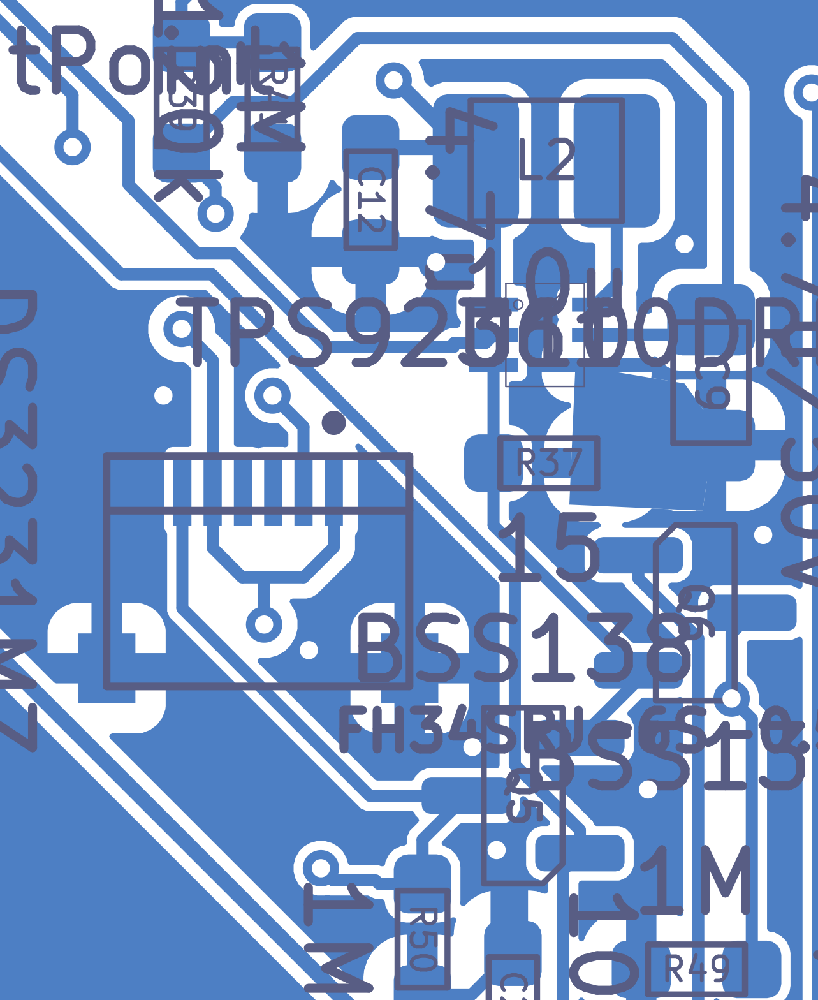
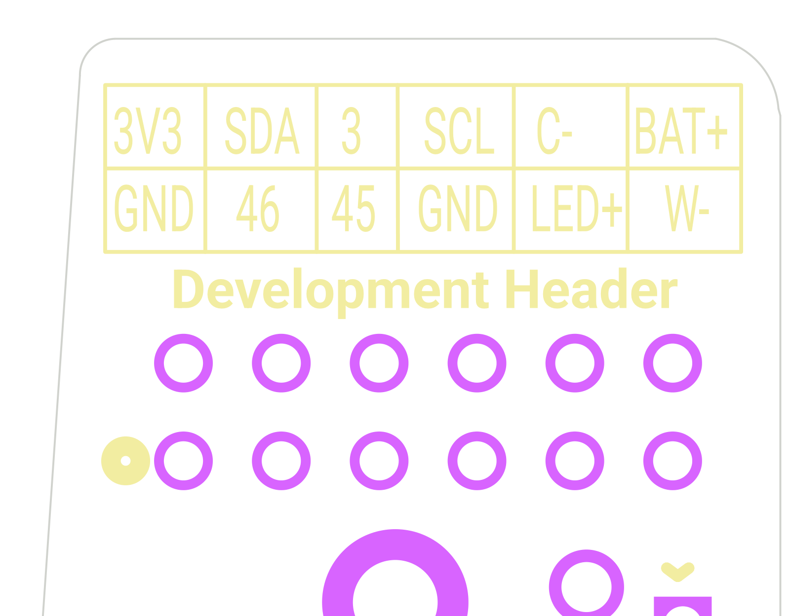

# Front-light LED boost driver, warm/cool select and LED connector

*Final review 2026-09-19 — reviewer key `led`, finding prefix `LED-`. Written from the netlist, the board
file, the TI/Nexperia/TDK datasheets and the fab output, independently of the earlier audits. The
documentation cross-check at the end was done only after every finding above it was already written.*

> **Adversarially verified 2026-09-20.** A second reviewer independently re-derived every BLOCKER / HIGH /
> MEDIUM / DOC finding from the raw netlist, the board file and the manufacturer datasheets, without
> trusting any number quoted above. Three severities were lowered, five facts were corrected, five
> additional findings (`LED-V01`…`LED-V05`) were added, and nothing was refuted outright. Corrections are
> marked **[verified]** inline, and the full audit trail is in **[Verification log](#verification-log)** at
> the end.

## What this part of the board does

E-paper displays do not emit light, so the "front light" is a thin strip of tiny white LEDs bonded to the
edge of the display glass. This block is the power supply and the switchboard for that strip.

Three jobs:

1. **Make a high voltage from a low one.** The LEDs are wired in a *series string* (one after another), so
   the string needs roughly 15–22 V while the board only has a 3.0–5.5 V battery/USB rail. `U10` is a
   **boost converter** — an inductor (`L2`) plus a chip that chops current through it 1.1 million times a
   second to pump the voltage up. It does not regulate *voltage*; it regulates *current* through the LEDs
   (brightness follows current, not voltage) by holding 200 mV across the sense resistor `R37`.
2. **Dim it.** The ESP32 sends a square wave (`PWM_LED`) into the driver's `ADIM` pin. The chip averages
   that square wave internally and scales the LED current by its duty cycle. This is *analog* dimming — the
   LED current ends up a smooth DC value, not a flashing one, so there is no buzz and no flicker. The same
   pin is also the on/off switch; there is no separate enable pin.
3. **Choose warm or cool white.** The front light has two LED strings (cool and warm) sharing a common
   positive wire. `Q5` and `Q6` are low-side switches deciding which string's negative end may return to
   the sense resistor. `U12` is an inverter, so the two switches are always in opposite states.

`J3` is the 6-pin 0.5 mm flat-flex (FPC) socket the front-light ribbon plugs into. The same three nets
(`LED_SW` = "LED+", `W-`, `C-`) also appear on the 12-pin expansion header `J6` so a user can drive their own
LED strip.

Jargon, once: **Vf** = forward voltage, what an LED drops when lit. **OVP** = over-voltage protection.
**FB** = feedback. **SW** = the converter's switching node. **DCR** = an inductor's DC resistance.
**Isat** = the current at which an inductor stops behaving like an inductor. **ZIF** = zero-insertion-force,
the flip-lock style of flat-flex socket. **Paste aperture** = the hole in the solder-paste stencil that puts
solder on a pad during machine assembly.

## Circuit walk-through

| Ref | Part / value | Role | Checked against datasheet? |
|---|---|---|---|
| U10 | TPS923610DRLR, SOT563-6 | Synchronous boost LED driver: 24.5 V max out, 1.8 A switch limit, 1.1 MHz | **Yes** — TI SNVSCN8A rev A (Oct 2025) §5 Table 5-1, §6.1/6.3/6.5, §7.3, §8.2, §8.5 |
| L2 | TDK VLS252012HBX-100M-1, 10 µH | Boost inductor. Isat 850 mA, Irated 1.0 A, DCR 540 mΩ max, 2.5 × 2.0 × 1.2 mm | **Yes** — 10 µH is TI's own recommended value (§8.2.2.2); ratings from TDK data via DigiKey |
| C12 | 4.7 µF 0603 16 V X5R (CL10A475KO8NNNC) | Input cap on `LDO_IN` at the VIN pin (shared with the 3V3 LDO's input) | Yes — TI wants ≥1 µF *effective* CIN (§6.3) |
| C9 | 4.7 µF 0805 **50 V** X5R (CL21A475KBQNNNE) | Output cap on `LED_SW` | Yes — TI wants ≥1 µF *effective* COUT (§6.3). See LED-05 |
| R37 | 15 Ω ±1 % 0603 | LED current sense (TI's RSET). ILED = VFB/R37 | **Yes** — §8.2.2.1, VFB = 200 mV |
| R39 / R41 | 1 MΩ / 120 kΩ | Divider from `LED_SW` to `LED_MONIT` → ESP32 `IO2` (ADC1_CH1) | Yes — ESP32-S3 datasheet pin/ADC tables |
| C31 | 100 nF (lives in the MCU block) | Charge reservoir on `LED_MONIT` so the SAR ADC has something to sample from | — |
| J3 | Hirose FH34SRJ-6S-0.5SH(50) | 6-pin 0.5 mm ZIF to the panel's front-light flex. **Top *and* bottom contacts**, back-lock, 0.5 A, 50 V, 0.30 mm flex | **Yes** — DigiKey attribute table for this exact orderable. See LED-01, LED-12 |
| U12 | Nexperia 74LVC1G04GV,125 (SOT753 = SC-74A = SOT-23-5) | Inverter producing `COLOR_SEL_INV` from `COLOR_SEL` | **Yes** — Nexperia 74LVC1G04 datasheet §3 Table 1 and §6.1 pinning: 1 = n.c., 2 = A, 3 = GND, 4 = Y, 5 = VCC |
| Q5 / Q6 | onsemi BSS138LT1G, SOT-23 | Low-side switches on `W-` (warm) and `C-` (cool). 50 V Vds, 0.22 A Id | Yes — 50 V ≫ 25 V, 220 mA ≫ 13.3 mA |
| R75 | 100 kΩ | Pull-down on `COLOR_SEL` — stops the inverter input floating and makes cool the default | Yes |
| R49 / R50 | 1 MΩ each | Bleed the *unselected* string's cathode to ground so it sits at a defined potential | — |
| C24 | 100 nF | U12 supply decoupling, 1.8 mm from its VCC pad | — |
| TP3/TP4/TP5 | DNP test pads on `LED_SW` / `C-` / `W-` | Bring-up probe points, **top** side, holes still drilled | See LED-13 |
| D3 | SMAJ26A (power block, sits on `LED_SW`) | Transient clamp on the exposed LED+ node. VRWM 26 V, VBR 28.9–31.9 V | Yes — never conducts below the 25.5 V max OVP trip |
| D8 | PESD2IVN-UX (power block, on `W-`/`C-`) | Bidirectional ESD clamp on the two cathode nets. VCL 38 V @ 1 A | Yes — Nexperia PESD2IVN-U datasheet |

**Connectivity, taken from `evidence/sch/connectivity_by_component.txt` / `connectivity_by_net.txt`, not from
the picture:** `LDO_IN` → `L2.1`; `L2.2` → `U10.6 (SW)` on net `TPS_SW_NODE`; `U10.5 (VOUT)` → net `LED_SW` →
`C9`, `R39`, `D3`, `TP3`, `J3.1`, `J3.5`, `J6.5`. The two strings return on `J3.2` (`C-`) and `J3.6` (`W-`)
into `Q6.3` and `Q5.3`. Both FET sources join at `Net-(Q5-S)`, which is simultaneously `U10.3 (FB)` and the
top of `R37`; `R37`'s other end is `GND`. `COLOR_SEL` (ESP32 `IO40`) drives `Q5.G` and `U12.2`; `U12.4`
drives `Q6.G`. `PWM_LED` (ESP32 `IO42`) drives `U10.2 (ADIM)`.

**Pinout verification, U10.** TI SNVSCN8A Table 5-1, DRL (SOT563-6) column: 1 = VIN, 2 = ADIM, 3 = FB,
4 = GND, 5 = VOUT, 6 = SW. The schematic symbol and the netlist use exactly this. **Correct.**

**Footprint verification, U10.** The board uses `TPS923610DRLR:U_DRL0006A_6L_TEX-M` from
`KiCad/9.0/3rdparty/TPS923610DRLR`. Pads are 0.8128 × 0.2286 mm on 0.5 mm pitch with row centres at
x = ±0.8509 mm. TI's own land-pattern example (datasheet p. 26, drawing DRL0006A) is 6× (0.67) long ×
6× (0.3) wide with the (1.48) row dimension. The KiCad land is the IPC "most material" (-M) density variant:
longer toes (0.81 vs 0.67 mm), slightly narrower pads (0.229 vs 0.30 mm). Longer toes help hand rework; the
narrower pad widens the pad-to-pad gap from 0.20 to 0.27 mm, which reduces bridging risk but leaves the pad
only ~0.01 mm wider than the nominal SOT563 lead (0.22 mm). Thin by IPC preference, workable in practice.
**No pin-numbering or geometry error found.**

**Pinout verification, U12.** Nexperia 74LVC1G04 datasheet: the `GV` suffix is SOT753 (SC-74A), the 5-lead
SOT-23-5; §6.1 gives pin 1 = n.c., 2 = A, 3 = GND, 4 = Y, 5 = VCC. Netlist: `U12.1` = no-connect,
`U12.2` = `COLOR_SEL` (input), `U12.3` = GND, `U12.4` = `COLOR_SEL_INV` (output), `U12.5` = 3V3.
**Correct — no pin swap.**

## Where it is on the board & layout notes

Everything except the three DNP test points is on the **bottom** side, clustered between y = 117 and
y = 138 mm near the low-x edge — the bottom-left of the board seen from the back.

| Ref | x, y (mm) | Note |
|---|---|---|
| L2 | 49.48, 119.13 | pads at x 48.32 (`TPS_SW_NODE`) and 50.64 (`LDO_IN`) |
| U10 | 49.50, 122.00 | SW at (48.649, 121.5), VOUT at (48.649, 122.0), GND at (48.649, 122.5) |
| C9 | 46.76, 122.79 | `LED_SW` pad (46.759, 121.75), GND pad (46.759, 123.825) |
| C12 | 52.38, 119.77 | `LDO_IN` pad (52.380, 118.907) |
| R37 | 49.44, 124.12 | FB pad (50.351, 124.116), GND pad (48.526, 124.116) |
| Q6 / Q5 | 47.02, 126.59 / 49.86, 129.60 | |
| J3 | 54.24, 126.00 | signal pads in a row at y = 124.575; shield tabs at y = 127.5 |
| U12 | 47.45, 136.06 | |
| R39 / R41 | 55.50 / 54.00, 118.09 | monitor divider, tucked between C12 and the board edge |
| TP3/4/5 | 65.3 / 61.6 / 58.0, 135.4 | **top** side, 1.7 mm pads, 1.0 mm holes, DNP |

**Switch node.** `TPS_SW_NODE` is **2.50 mm total, 2 segments, no vias, entirely on B.Cu**
(`evidence/pcb/net_routing_stats.csv`). That is about as good as it gets: the fast-edged, high-di/dt node is
essentially a stub between L2 pad 2 and U10 pin 6. Meets TI layout guideline 3 (§8.5.1).

**Output hot loop.** C9's `LED_SW` pad is 1.91 mm from U10 pin 5 and C9's GND pad is 2.31 mm from U10 pin 4
(both on B.Cu). The enclosed loop is roughly 2 × 2 mm. A dedicated priority-1 GND zone of 2.4 × 2.4 mm sits
at (46.7, 122.5), right under C9/U10's ground, tying the return together locally. Meets TI guideline 1.

**Feedback / sense.** `Net-(Q5-S)` is 7.54 mm, 6 segments, no vias, B.Cu only. R37 pad 1 is 0.91 mm from
U10 pin 3 (FB); R37 pad 2 is 1.62 mm from U10 pin 4 (GND) through the pour. Meets TI guideline 2.
The boost's pulsed ground current (≤243 mA peak) shares ~1.6 mm of pour with the sense return; at a
sub-milliohm pour resistance that is ≲0.12 mV of error against a 200 mV reference (≤0.06 %). Acceptable.

**Ground stitching.** Three GND vias sit within 5 mm of U10 — at (47.200, 120.500) d = 2.75 mm,
(51.300, 120.800) d = 2.16 mm and (45.900, 125.300) d = 4.88 mm — tying the B.Cu pour under the converter
to the F.Cu pour. Adequate for a 2-layer board handling 0.35 W.

**Input loop.** C12's GND pad is ~4.2 mm from U10's GND pad — longer than ideal (TI guideline 4), but in a
boost the input current is the continuous inductor current, so this is not the hot loop. Acceptable.

**The long nets.** `LED_SW` is 180.4 mm with 6 vias, `W-` 172.9 mm with 2 vias, `C-` 187.9 mm with 3 vias,
all 0.2 mm wide and mostly on F.Cu, running the full height of the board to reach `J6` at y ≈ 46–48 mm.
Current is only 13 mA so width and resistance barely matter: 0.2 mm × 1 oz × 180 mm ≈ 4.4 Ω, 58 mV — that
comes out of boost headroom, not out of current accuracy, because the sense resistor is downstream of the
LEDs. The only real concern is radiated emissions — see LED-11.

**Clearance at J3.** KiCad DRC reports three `clearance` **errors** at J3 (pads 1–2, 4–5, 5–6: 0.200 mm
actual vs the `SW` netclass's 0.250 mm). That is the connector's own 0.5 mm-pitch land geometry (0.3 mm pads,
0.2 mm gaps) and cannot be changed without changing connectors. See LED-08.

**Test points.** TP3–TP5 are DNP but through-hole, so holes and annular rings survive into the fab output.
They sit on the **front** face between the two decorative QR codes, in an area that is clearly meant to
remain visible (not under the panel).

**Expansion header labelling.** The front-face silk `3V3 SDA 3 SCL C- BAT+ / GND 46 45 GND LED+ W-` maps to
J6 pins 7–12 / 1–6 and matches the netlist pin-for-pin.

## Calculations

**1. LED current set point.** VFB = 200 mV typ (195–206 mV over temperature, TI §6.5); R37 = 15 Ω ±1 %.

    ILED = VFB / R37 = 0.200 / 15 = 13.33 mA          (100 % ADIM duty)
    extremes: 0.195 / 15.15 = 12.87 mA  …  0.206 / 14.85 = 13.87 mA

**12.9–13.9 mA, nominal 13.3 mA.**

**[verified] — but only at 100 % duty.** The TPS923610 dims by chopping its own reference, so
`VFB = Duty × 200 mV` (TI §7.3.8), and the reference tolerance widens badly as the duty falls. TI §6.5
gives VFB = 195 / 200 / 206 mV at 100 % duty (±3 %) but **14.5 / 20.2 / 25.5 mV at 10 % duty**
(−28 % / +26 %). So the LED current at a tenth brightness is 0.97–1.70 mA against a 1.35 mA nominal —
a five-times-worse relative accuracy, varying part to part. See LED-V03.

**2. Operating output voltage and OVP headroom.** VOUT = Vf(string) + Vds(FET) + VFB. Vds at 13.3 mA through
≤6 Ω is ≤80 mV.

| String Vf | VOUT | Margin to OVP rising **min** (24.25 V) |
|---|---|---|
| 15 V (the intended GDEQ panel) | 15.28 V | 8.97 V |
| 21 V (7 white LEDs × 3.0 V) | 21.28 V | 2.97 V |
| 22 V (the silkscreen's stated ceiling) | 22.28 V | **1.97 V** |

TI §6.3 recommended max VOUT = 24.5 V; §6.5 OVP rising = 24.25 / 25.0 / 25.5 V. LED Vf rises as temperature
falls at roughly −2 mV/°C per die, so 7 dies from +25 °C to −10 °C add ~0.5 V. See LED-04.

**3. Inductor peak current and saturation margin.** TI eq. (4)–(6) §8.2.2.2, with L = 10 µH, FS = 1.1 MHz,
ILED = 13.33 mA. Worst ripple is at the highest VIN (USB); worst DC current at the lowest VIN (flat battery).
Taking the stressful case Vf = 22 V → VOUT = 22.28 V:

    VIN = 3.0 V:  D = (22.28-3.0)/22.28 = 0.865
                  ΔIL(pp) = VIN·D/(L·FS) = 3.0 × 0.865 / (10e-6 × 1.1e6) = 0.236 A
                  IL(dc)  = VOUT·IOUT/(VIN·η) = 22.28 × 0.01333 / (3.0 × 0.85) = 0.117 A
                  IL(peak) = 0.117 + 0.118 = 0.235 A ;  IL(valley) = -0.001 A

    VIN = 5.0 V:  D = 0.776 ;  ΔIL(pp) = 5.0 × 0.776 / 11 = 0.353 A
                  IL(dc)  = 22.28 × 0.01333 / (5.0 × 0.88) = 0.068 A
                  IL(peak) = 0.068 + 0.176 = 0.244 A ;  IL(valley) = -0.109 A

**Worst peak ≈ 244 mA against Isat = 850 mA → 3.5× margin**, and against the IC's own 1.6 A *minimum*
current limit → 6.6× margin, so no nuisance current-limit trips. **L2 is correctly sized**, and its value
is exactly what TI recommends. The negative valley current at high VIN is normal FCCM behaviour and is
precisely why TI recommends 10 µH rather than something smaller.

Conduction loss: IL(rms) = √(IL(dc)² + ΔIL²/12) = √(0.068² + 0.353²/12) = 0.122 A →
P = 0.122² × 0.540 = **8 mW**, ~2 % of the 0.30 W delivered. Thermally irrelevant in a 2520 part.

**4. LED_MONIT divider.** Ratio = R41/(R39+R41) = 120 k / 1120 k = **0.10714** (the schematic's own
annotation says 0.107 — correct).

| LED_SW | LED_MONIT |
|---|---|
| 15.28 V (normal, intended panel) | 1.637 V |
| 22.28 V (max recommended string) | 2.387 V |
| 24.5 V (IC max VOUT) | 2.625 V |
| **25.5 V (OVP rising, worst case)** | **2.732 V** |
| 31.9 V (only if D3 ever broke down) | 3.418 V |

ESP32-S3 GPIO absolute maximum is VDD + 0.3 = 3.6 V. **2.73 V worst case leaves 0.87 V of margin, so the
divider protects IO2 even during a full open-LED OVP event.** With 12 dB attenuation the ADC span is
~0–3.1 V, so 0–25.5 V maps in without clipping and without wasting much range. `IO2` is `ADC1_CH1`, so the
monitor keeps working while Wi-Fi is on (ADC2 does not). Divider load on the boost output:
24.5 V / 1.12 MΩ = 21.9 µA, i.e. 0.16 % of the LED current. Thevenin source impedance = 1 M ∥ 120 k =
**107.1 kΩ** — see LED-06.

**5. Capacitor effective values (ceramic DC-bias derating).** TI §6.3 requires CIN ≥ 1 µF and COUT ≥ 1 µF
**effective**, and TI's own reference design (Figure 8-1) uses 4.7 µF / 1 µF.

* **C12** — 4.7 µF 16 V X5R 0603 at 5.0 V bias typically retains 50–60 % → **~2.4–2.8 µF**. Comfortable.
* **C9** — 4.7 µF 50 V X5R 0805 is near the density limit of that case size; at 15 V typical retention is
  ~45–55 % (**~2.1–2.6 µF**) and at 22 V ~30–40 % (**~1.4–1.9 µF**). Over the 1 µF floor in both cases, but
  by a factor of only ~1.5 at the top of the range. See LED-05.

Ripple is not the constraint. TI eq. §8.2.2.3 with COUT = 1.5 µF:
`(VOUT−VIN)·IOUT / (VOUT·FS·COUT) = (22.28−3.7) × 0.01333 / (22.28 × 1.1e6 × 1.5e-6) = 6.7 mV`.
The constraint is loop stability, because the TPS923610 is internally compensated around an assumed COUT.
Output-cap RMS current = IOUT·√(D/(1−D)) = 13.33 mA × 2.53 = 34 mA — trivial.

**6. Power and temperature.** Pout = 22.28 × 13.33 mA = 0.297 W; at 85 % efficiency Pin = 0.349 W, so U10
dissipates ~44 mW. RθJA on a standard board is 142.7 °C/W (TI §6.4) → **ΔTj ≈ 6 °C**. No hot spot, and the
SOT563 has no thermal pad to worry about. Battery-side draw at 3.0 V with the light at full brightness:
0.349 / 3.0 = **116 mA** — significant for runtime, not for the rail (C4 22 µF + C12 4.7 µF hold it up, and
the TPS2116 mux passes far more than this).

**7. Behaviour when the driver is disabled.** TI §7.3.3 states explicitly that a path remains "between the
input and the LEDs through the inductor and body diode of internal high-side FET". So with ADIM low,
**`LED_SW` ≈ `LDO_IN` − one diode drop ≈ 2.3–4.8 V, not 0 V.** For a 15–22 V string that is far below
turn-on and the LEDs stay dark, exactly as TI argues. Two consequences for the *user-accessible* header —
LED-02 and LED-03.

**8. Enable timing vs the dimming waveform.** ADIM is also the enable. TI §6.5:
`tADIM_EN` = **40 µs** (first HIGH pulse needed to enable), `tADIM_SD` = 2.5 ms (LOW time that shuts down),
`tADIM_PWM` = 20 ns (minimum dimming pulse), `VADIM_H` = 1.2 V, `VADIM_L` = 0.385 V.

    PWM carrier   period    HIGH time at 50 %    enables from cold?
    10 kHz        100 us    50 us                yes (10 us of margin)
    20 kHz         50 us    25 us                NO
    25 kHz         40 us    20 us                NO
    10 kHz @ 30 % 100 us    30 us                NO

**The board's own design note recommends 10–25 kHz, but across most of that range the dimming waveform on
its own can never start the chip.** See LED-14. Once running, it stays running: the longest LOW interval at
10 kHz is 100 µs, 25× shorter than the 2.5 ms shutdown timer. And 3.3 V logic against a 1.2 V high
threshold and a 5.5 V FB/PWM absolute maximum is correct.

**9. Dimming carrier vs the datasheet.** TI §7.3.8: *"use the PWM dimming frequency in the range of 10 kHz
to 200 kHz"* — below 10 kHz the internal low-pass filter no longer smooths the chopped reference and output
ripple/audible noise appear. The note's 10–25 kHz sits inside that window. **Correct.**

**10. Conductor spacing at 25 V.** The tightest gap on a 25 V net is 0.20 mm (J3 pads 1–2 and 5–6).
IPC-2221B Table 6-1 class B1 (external, uncoated, ≤3050 m) requires 0.1 mm for 16–30 V.
**0.20 mm is 2× the requirement.** No electrical-safety issue; the LED rail is SELV.

**11. Colour-select switching transient.** 74LVC1G04 propagation delay at 3.3 V is ~4 ns, so on a
`COLOR_SEL` edge the two FETs overlap or gap by ~4 ns. In the gap case the output capacitor charges by
ΔV = I·t/C = 13.33 mA × 4 ns / 4.7 µF = **11 nV**. In the overlap case both strings conduct for 4 ns,
briefly doubling FB. Both are utterly harmless. **Hot-switching the colour under load is safe**, at least
as far as the switching edge is concerned; the slower constraint is re-slewing C9 to the other string's Vf,
which is a colour-blending question, not a safety one.

**12. Reverse-wired flex (the LED-12 scenario).** If a panel flex reversed the pin order, both strings would
be reverse-biased by VOUT. The boost would ramp until either (a) the string's aggregate reverse breakdown is
reached, in which case it would regulate **13.3 mA backwards through the LEDs**, or (b) OVP trips at
24.25–25.5 V and it hiccups harmlessly. Seven dies in series would normally break down well above 25 V, so
(b) is the likely outcome — but the margin depends on the weakest die and the front light is bonded to the
panel and not separately replaceable. Not a gamble worth taking. See LED-12.

## Findings

| ID | Severity | Finding | Evidence | Recommendation |
|---|---|---|---|---|
| LED-01 | **BLOCKER** | J3's six signal pads have **no solder-paste aperture** — a machine-assembled board gets no solder on the front-light connector's pins. `J2` (display) and `J4` (touch) have the same defect | Pad layer sets read with `pcbnew` from the scratch board: `J3.1`–`J3.6` = `B.Cu, B.Mask` only; `J3.S1/S2` = `B.Cu, B.Mask, B.Paste`. Same for `J2.1`–`J2.24` and `J4.1`–`J4.6`. Confirmed in the fab output: `evidence/gerber_fresh/silkscreen_pcb-B_Paste.gbp` has **0** flashes on the J3/J4 signal-pad row (Y = 124.575 mm) while `B_Cu` has 11 and `B_Mask` has 6; the shield row (Y = 127.5) has 6 flashes on all three layers. Whole-layer counts: B_Mask 571 flashes vs B_Paste 441 | Add `B.Paste` to pads 1–N of the three `HRS_FH34SRJ-*` footprints (or override per-pad on the board), re-export the paste gerber, and re-check the flash counts before placing an assembly order |
| LED-02 | MEDIUM *(was HIGH)* | An external LED string with Vf below ~(VIN − 0.7 V) on `J6.5`/`J3` is driven with **no current control**, through L2 and U10's high-side body diode, even with the driver switched off | TI SNVSCN8A §7.3.3 (quoted verbatim, **[verified]**). With USB connected LDO_IN = 5 V → `LED_SW` ≈ 4.3 V. A single 3 V white LED sees (4.3−3)/(15 Ω + ~15 Ω dynamic) ≈ **43 mA**, roughly 2× its rating. The silkscreen states only an *upper* Vf limit. **[verified]** the path also requires the matching low-side FET to be on — at power-on that is Q6, so it is the `C-` branch that is exposed; and nothing *on the board* is stressed (R37 sees 28 mW, Q6 43 mA) | Add a **minimum** string voltage to the silk and the docs — "≥3 LEDs in series / Vf > 6 V" — next to the existing 22 V maximum. No board change needed |
| LED-03 | LOW *(was MEDIUM)* | `LED+` (`LED_SW`) on expansion header `J6` pin 5 is a low-impedance path to the battery/USB rail whenever the driver is off; shorting that 0.1 in pin to ground puts amps through L2 | `J6.5` = `LED_SW` at (98.90, 47.97), PTH ⌀1.016 mm, 2.54 mm from GND on `J6.4`. Path is LDO_IN → L2 (DCR 540 mΩ) → HS body diode → LED_SW. **[verified]** the quoted (3.7 − 0.7)/0.54 ≈ 5.5 A is an idealised *upper bound* — it ignores the body diode's dynamic resistance, the TPS2116 Ron, cell ESR and the ~4.4 Ω of 0.2 mm trace between J6.5 and U10, so realistic fault current is ~1–2 A. **[verified]** the same header already exposes raw battery `P+` on `J6.12` with GND on `J6.1`/`J6.4`, which is a strictly worse short, so LED+ is not a distinctive hazard | Accept for a prototype. Document the **header as a whole** as unfused and not probe-safe (LED+ additionally reads a deceptively logic-like 3–4.5 V with the light off). On a respin a few ohms in series with the LED+ tap would fix this and LED-V05 together |
| LED-04 | LOW *(was MEDIUM)* | The 24.5 V part leaves only ~2.0 V of OVP headroom for the 22 V string the **silkscreen** invites, while the documented design target is only 15 V. **[verified]** the failure mode is a benign OVP hiccup/latch, not damage, and 22 V is inside TI's own 24.5 V recommended maximum — this is a wording refinement, not a design defect | OVP rising min 24.25 V (TI §6.5); VOUT at a 22 V string = 22.28 V. Cold-temperature Vf rise ≈ +0.5 V for 7 dies at −10 °C. Silk text box at (84.23, 52.5): *"should ideally have a forward voltage of less than 22V"* | Lower the silk/doc ceiling to **20 V**, which still covers a 7-die string with margin. Fitting the pin-identical `TPS923611DRLR` (30 V, same DRL package, same current limit) is *not* a free swap: SMAJ26A breaks down at 28.9–31.9 V, right on top of the '611's 29.6–31.4 V OVP window, so D3 would have to change too |
| LED-05 | LOW | C9's effective capacitance at high output voltage sits close to TI's 1 µF minimum for a stable loop | CL21A475KBQNNNE is 4.7 µF/50 V/X5R in 0805; typical X5R DC-bias loss gives ~2.1–2.6 µF at 15 V and ~1.4–1.9 µF at 22 V, versus TI §6.3's 1 µF effective floor. I did **not** obtain the Samsung DC-bias curve for this exact part number | Pull the Samsung curve, or measure C9 in circuit at the operating bias. Cheap insurance if it comes out low: a 1206 4.7 µF/50 V, or a second 0805 in parallel (there is room beside C9). `docs/HARDWARE.md` already reaches the same 1–2 µF estimate independently |
| LED-06 | LOW | `LED_MONIT` presents 107 kΩ to the ESP32 SAR ADC — roughly 10× the source impedance ESP-IDF recommends | R39 ∥ R41 = 1 M ∥ 120 k = 107.1 kΩ; C31 = 100 nF gives a 10.7 ms time constant (≈50 ms to settle) | It works because of C31, but firmware must wait ≥50 ms after any change and should expect a DC offset from ADC input leakage. If accuracy matters, scale to 100 k/12 k — same ratio, 10.7 kΩ source, 245 µA load |
| LED-07 | DOC | Three different LED currents are stated in three places | Actual: 200 mV / 15 Ω = **13.33 mA**. Schematic note: *"Feedback current is ~14mA tuned via R37"*. Silkscreen: *"...and at least 15mA (strict unless you replace R37)"*. `docs/HARDWARE.md` line 694 is the only one that is right | Make the schematic note and the silk say **13.3 mA**. If the silk's "15 mA" means "your LEDs must be rated for at least 15 mA", say that explicitly — as written it reads like the drive current |
| LED-08 | LOW | Three KiCad DRC **errors** at J3 are netclass artefacts, not real problems | `evidence/pcb/drc.json`: clearance 0.200 mm actual vs the `SW` netclass's 0.250 mm, on J3 pads 1–2 / 4–5 / 5–6. IPC-2221B B1 needs 0.1 mm at 16–30 V | Add a DRC rule exception (or take J3's pads out of the `SW` netclass) so the error list is genuinely empty before release. No copper change |
| LED-09 | LOW | `lib_symbol_mismatch` ERC warnings on U10 and J3: the symbols cached in the schematic differ from their library copies | `evidence/sch/erc.json`, symbols `U10 [TPS923610DRLR]` and `J3 [FH34SRJ-6S-0.5SH_50_]` | Harmless now (the netlist, which is what gets built, is correct and matches the datasheets), but re-sync the libraries so a future "update symbols from library" cannot silently renumber pins |
| LED-10 | LOW | Three `starved_thermal` warnings: the GND pads of R37, R41 and R50 reach the pour through a single 0.5 mm spoke instead of two | `evidence/pcb/drc.json`. One spoke ≈ 0.5 mΩ → 6.5 µV at 13.3 mA against a 200 mV reference (0.003 %) | Electrically negligible. Worth fixing on R37 alone, for mechanical robustness of the current-sense return |
| LED-11 | CERT-LATER | 25 V nets carrying 1.1 MHz ripple are routed ~180 mm across the board: `LED_SW` 180.4 mm / 6 vias, `W-` 172.9 mm / 2 vias, `C-` 187.9 mm / 3 vias, all 0.2 mm and mostly on F.Cu | `evidence/pcb/net_routing_stats.csv` | Nothing to do for a prototype. For EMC work later: shrink the LED loop area, add a series ferrite or RC snubber at `LED_SW`, and consider the 400 kHz `TPS923611LSDRLR`, which TI offers specifically for "EMI constraints near the 1.1 MHz frequency band" (§7.3.4) |
| LED-12 | MEDIUM | J3's pin mapping to the Good Display front-light flex rests on one owner-verified physical sample; a supplier drawing reportedly shows the reverse, and I could not obtain the primary spec to settle it | **[verified]** the `1 C+, 2 C−, 3 NC, 4 NC, 5 W+, 6 W−` mapping lives in the **schematic symbol's own pin names** (visible in block crop `16_led_driver_connector`), not in a PCB silk note — correcting the reference below. The netlist has J3.1 = J3.5 = `LED_SW` (anodes), J3.2 = `C-`, J3.6 = `W-` — self-consistent for a common-anode two-string light. Good Display's public pages give only "7 LEDs, series, ≤15 V, ≤15 mA" and no pinout; the spec PDF is login-gated and the CDN returns HTTP 403 for direct fetches. The FH34SRJ has **top *and* bottom contacts**, so a flipped flex still makes contact rather than failing open — it reverses the pin order instead | **Make this a bring-up gate, not a board change.** Before first power-on with any new panel lot, diode-test J3's mating pads with a meter (or probe TP3/TP4/TP5) and confirm pins 1 and 5 are the anodes. See calculation 12 for why a wrong lot is probably — but not certainly — survivable |
| LED-13 | LOW | `TP3` (net `LED_SW`, up to 25 V) is an exposed 1.7 mm pad with a 1.0 mm hole on the **front** face, at (65.3, 135.4), in the visible decorative area between the two QR codes | `evidence/blocks/led.md` footprint table; TP3–TP5 are `dnp` but through-hole, so holes and annular rings remain in the fab output | 25 V is harmless to touch, but confirm nothing conductive in the display stack-up or the enclosure lands on TP3. If in doubt, tent it on F.Mask |
| LED-14 | MEDIUM | The on-board design note's dimming range (10–25 kHz) cannot start the driver over most of that range: `ADIM` doubles as the enable and needs one HIGH pulse longer than 40 µs | TI §6.5 `tADIM_EN` = 40 µs. At 25 kHz/50 % the HIGH time is 20 µs, at 20 kHz/50 % it is 25 µs, and at 10 kHz/30 % it is 30 µs — all below 40 µs. Only ~10 kHz at ≥40 % duty starts from cold. See calculation 8 | Firmware must emit an explicit enable pulse (≥100 µs HIGH) **before** applying the dimming carrier. Add that sentence to the schematic design-note text box, since that note is what an amateur replicator will read. `docs/HARDWARE.md` already states this correctly |
| LED-15 | DOC | `simulations/led_driver/LED_circuit.asc` does not model the circuit that was built | **[verified, corrected]** the file is **not** a discrete boost: it instantiates the IC `PowerProducts\LT1615` (an ADI/Linear asynchronous step-up converter) with `L1` 22 µH, an external `MBR0540` Schottky, `R3` 82 Ω sense, `Q7`/`Q_reset` IRLML6402 PMOS, `Q_iso` 2N7002, a `BZX84C22VLY` zener for OVP and a 2N3904/2N3906 latch. The board uses a *different* IC — a synchronous TPS923610 with an internal high-side FET, 10 µH, no external diode, IC-internal OVP and a 200 mV (not 1.23 V) reference. Only `M1`/`M2` (BSS138) and the `N=7` LED strings carry over. `LED_circuit.log` line 7 reports *"WARNING: Node N005 is floating"* (plus three "Multiple definitions of model" warnings) | Either retire the file or add a header comment saying it models a superseded **LT1615** concept, so nobody validates the shipped driver against it |
| LED-V01 | LOW | `D3` (SMAJ26A) clamps at up to **42.1 V**, well above U10's **32 V** `VOUT` absolute maximum — the TVS that guards the user-exposed LED+ pin cannot actually keep U10 inside its ratings during a real surge | TI SNVSCN8A §6.1 Absolute Maximum Ratings: `VOUT` = −0.3 to **32 V** (`SW` = −1 to 32 V, 38 V for <10 ns; `FB, PWM` = −0.3 to 5.5 V). SMAJ26A: VBR 28.90–31.90 V, **VC = 42.1 V at IPP 9.5 A**. Dynamic resistance ≈ (42.1 − 30)/9.5 ≈ 1.27 Ω, so D3 passes 32 V at only ~1.6 A. Mitigating: D3 sits at (93.446, 58.8), ~11 mm from J6 — i.e. at the threat, which is right — and there is ~180 mm of 0.2 mm trace (≈4.4 Ω) plus 6 vias between `J6.5` and `U10.5`, so most of the clamp overshoot drops in the trace, not on the pin | Accept for the prototype. Note that **no ordinary TVS fits cleanly here**: VRWM must exceed the 25.5 V max OVP trip, and every 26 V SMAJ clamps near 42 V. If the header is ever exposed in a finished product, add a few ohms or a ferrite in the LED+ tap at J6 (which also fixes LED-03/LED-V05), or a second lower-clamping device local to U10 |
| LED-V02 | MEDIUM | Open-load OVP **latches**: after three trips U10 stops switching permanently and re-applying the PWM carrier will *not* restart it — recovery needs `PWM_LED` LOW for >2.5 ms or a VIN power cycle. Documented nowhere on the board or in `HARDWARE.md` | TI SNVSCN8A §7.3.6 / §7.4.2, quoted: after the rise/fall detection is *"triggered 3 times"* the device *"enters over-voltage protection mode … and does not resume switching"*, and *"remains in over-voltage protection mode until it is reset by two ways, which are shutdown and re-enabling device by the ADIM pin or triggering UVLO by the VIN pin"*. `tADIM_SD` = 2.5 ms (§6.5). The normal bring-up state — power the board with `J3` unplugged and turn the light on — is exactly an open-load OVP event | Firmware's front-light enable sequence must be: drive `PWM_LED` LOW for ≥3 ms (clears any latch) → single HIGH pulse ≥100 µs (satisfies `tADIM_EN`, LED-14) → start the dimming carrier. Put that three-step sequence in the schematic design-note box and `HARDWARE.md`; it turns two separate bring-up traps into one recipe |
| LED-V03 | LOW | The 13.33 mA set point only holds at 100 % duty. TI's dimming is *analog* — the duty cycle scales the internal reference — and the reference tolerance widens sharply at low duty, so dim settings are far less accurate than the headline number implies | TI SNVSCN8A §7.3.8: `VFB = Duty × 200 mV`. §6.5 VOLTAGE REFERENCE: at 100 % duty VFB = 195 / 200 / 206 mV (±3 %); at **10 % duty** VFB = **14.5 / 20.2 / 25.5 mV** (−28 % / +26 %). So ILED at 10 % duty is 0.97–1.70 mA against a 1.35 mA nominal, part to part | No board change. Expect a non-linear, unit-to-unit-varying brightness curve at the bottom of the range; calibrate in firmware if the UI exposes fine low-end steps, and do not use `LED_MONIT` to infer current at low duty |
| LED-V04 | LOW | `COLOR_SEL` (`IO40`/MTDO) and `PWM_LED` (`IO42`/MTMS) occupy two of the four ESP32-S3 JTAG pins, so an external JTAG probe and the front light cannot coexist | ESP32-S3 datasheet, pin-function note: *"GPIO39, GPIO40, GPIO41, GPIO42 : JTAG interface."* Netlist: `COLOR_SEL` → `U4.33 (IO40)`, `PWM_LED` → `U4.35 (IO42)`. A probe driving MTMS toggles `ADIM` directly: the light flickers, and if `J3` is unplugged the boost can be enabled into an open load and latch off per LED-V02. The on-chip USB-Serial-JTAG (IO19/IO20) is unaffected | Document "no external JTAG probe while the front light is connected — use the built-in USB-Serial-JTAG". Nothing to change on the board; these were reasonable pins to spend |
| LED-V05 | LOW | The two most likely accidental shorts on `J6` destroy **R37**, the current-sense resistor, not L2 — and both fault pins are nearest neighbours of LED+ | `J6.5` = `LED_SW` @ (98.902, 47.970); `J6.6` = `W-` @ (101.442, 47.970) — 2.540 mm away in the same row; `J6.11` = `C-` @ (98.902, 45.430) — 2.540 mm directly above it, and `C-` is the string *selected by default at power-on*. Bridging LED+ to the selected cathode bypasses the LED string: the control loop protects itself (FB instantly exceeds 200 mV, switching stops) but `LED_SW` only falls to the body-diode level ≈ 4.2–4.3 V on USB, giving I ≈ 4.2/(15 Ω + ~3 Ω Rds(on)) ≈ **233 mA** continuous. P(R37) = 0.233² × 15 = **0.81 W in an 0603 rated 0.1 W**; Q5/Q6 sit at 233 mA against a 220 mA Id rating | Same control as LED-03 — this is header documentation, not a board defect. Worth calling out specifically because R37 failing *open* kills the front light and R37 failing *low* silently changes the LED current, and neither is obvious from outside |

### Notes on the non-trivial findings

**LED-01 — the paste problem.** This is the one that stops a build. KiCad decides what goes on the
solder-paste stencil from each pad's layer set. In the three Hirose FPC footprints under
`KiCad/9.0/3rdparty/FH34SRJ_*`, the signal pads were drawn with `(layers F.Cu F.Mask)` while the two
hold-down tabs got `(layers F.Cu F.Mask F.Paste)`. I confirmed this twice: once by reading the layer set of
every pad on the real board through `pcbnew`, and once by counting aperture flashes in the freshly exported
`B_Paste` gerber, which has **zero** flashes where the connector's signal pads are and six where the shield
tabs are. A contract-assembled board would come back with J2 (24-pin display), J3 (front light) and J4
(touch) tacked down by two mechanical tabs each and **no solder on any signal pin**. It would look
assembled, pass a visual check, and have no display, no front light and no touch. Nothing in `README.md` or
`docs/HARDWARE.md` says to hand-solder these — the documented plan (README §"other fabs") is an SMD assembly
order of 149 parts plus 13 hand-soldered through-hole parts, and J3 is SMD. The fix is one layer flag per
pad and costs nothing.

**LED-02 — the body-diode path.** Worth understanding because it is not intuitive. A synchronous boost has
an internal high-side MOSFET between SW and VOUT whose body diode points from SW to VOUT. The output is
therefore *always* connected to the input through L2 and that diode, switching or not. TI says so in §7.3.3
and argues it is harmless *because the LED string's forward voltage exceeds VIN*. That argument holds for
the intended 15–22 V front light. It does **not** hold for a hobbyist who wires two or three LEDs to the
header's LED+/W− pins: those see ~4.3 V through a 15 Ω resistor with the driver off, and nothing regulates
the current. The silkscreen already warns about the upper Vf limit; it needs the lower one too. LED-02 and
LED-04 are really one story — the on-board guidance for third-party strips is incomplete at **both** ends.

**LED-04 — part choice.** TI sells three parts in this family. `TPS923610DRLR` (fitted) is the 24.5 V one;
`TPS923611DRLR` is 30 V in the same SOT563-6 package with an identical pinout and identical 1.8 A limit. At
first glance the '611 looks like a free upgrade, and it is not: SMAJ26A's 28.9 V minimum breakdown sits
inside the '611's 29.6–31.4 V OVP window, so during an open-LED fault the TVS rather than the IC would
become the load, dissipating ~0.4 W continuously in an SMA package. **As built, with the '610, the D3/U10
pairing is correct** — OVP (max 25.5 V) always trips before the TVS (min 28.9 V) conducts. I flag this only
so the obvious "upgrade" does not get made in isolation.

**LED-12 — the connector mapping.** The pin order is the one thing in this block I could not verify from a
primary source. What I *can* say from the board data is that the wiring is internally coherent: two pins
(1 and 5) tie to the boost output as common anodes, two (2 and 6) go to the switched returns, and two are
no-connects — exactly the shape a common-anode dual-string front light wants. The DigiKey attribute table
for this exact orderable says the FH34SRJ has contacts on **both** the top and bottom of the flex, which is
a double-edged detail: a flipped flex will still connect rather than fail open, so the board cannot "detect"
the mistake by simply not lighting the first time. That makes a 30-second meter check before first power-on
the right control.

**LED-14 — enable versus dimming.** The chip has no EN pin; ADIM does both jobs, and the two jobs have
conflicting timing requirements. Enabling needs a single HIGH pulse wider than 40 µs, but a dimming carrier
at 20–25 kHz never produces one, and at low brightness (low duty) even a 10 kHz carrier does not. The
consequence during bring-up is simply "the front light does not come on", which is a frustrating way to lose
a day. The on-board design-note text box gives the 10–25 kHz recommendation with no mention of the enable
pulse, and that text box is precisely what someone replicating the board reads first.

**LED-V02 — the other half of the enable problem (added by verification).** LED-14 explains why the
recommended dimming carrier cannot *start* the driver. There is a second, independent trap on the same pin
that nothing in the project documents. TI §7.3.6: an over-voltage event does not simply hiccup. The first
three times `VOUT` crosses the OVP threshold the chip stops and restarts, but on the third it **latches** —
"does not resume switching even if the voltage at the VOUT pin falls below VOVP_R − VOVP_HYS" — and stays
latched "until it is reset … by shutdown and re-enabling device by the ADIM pin or triggering UVLO by the
VIN pin" (§7.4.2). An open load *is* an over-voltage event, and the most natural bring-up sequence in the
world — power the bare board with no panel attached and try the front light — produces one. After that, the
driver is dead to any amount of PWM until `PWM_LED` has been LOW for more than `tADIM_SD` = 2.5 ms. Combined
with LED-14 this yields a single three-step enable recipe that firmware should always use:

    PWM_LED = 0 for >= 3 ms      # clears any latched OVP
    PWM_LED = 1 for >= 100 us    # satisfies tADIM_EN = 40 us with margin
    start the 10-25 kHz carrier  # brightness control from here on

**LED-V05 — what a header short actually breaks (added by verification).** LED-03 correctly identifies the
body-diode path but picks the wrong casualty. The realistic accident is not LED+ to ground; it is LED+ to
the *cathode* pin next to it, because those are the pins a user wiring a strip is touching. `J6.5` (LED+) has
`W-` 2.54 mm to its right and `C-` 2.54 mm directly above it, and `C-` is the string selected by default.
Bridging them short-circuits the LED string out of the loop. The driver is not harmed — FB jumps above
200 mV and it simply stops switching — but the body-diode path still holds `LED_SW` at ≈4.3 V, and that
drives ~233 mA continuously through the selected FET and `R37`. `R37` is a 15 Ω 0603 rated 0.1 W; it would be
dissipating 0.81 W. It is also the part that *defines* the LED current, so a partial failure changes the
brightness of every future build of that board without anything looking wrong.

**Colour-select logic — analysed and correct.** At reset, ESP32-S3 `IO40` (MTDO) is input-enabled with no
internal pull (ESP32-S3 pin overview table: "IE", versus "WPU, IE" on U0RXD/U0TXD), so `R75`'s 100 kΩ holds
`COLOR_SEL` low. Q5 is off, U12's output is high, Q6 is on — **cool white is the power-on default and
exactly one string is selected in steady state.** That matters more than it looks: the boost can never see
an open load from the selector logic, so the only way to reach OVP is to unplug J3. **[verified]** two
details that make this argument airtight and were not stated: (a) the ESP32-S3 pin-overview table gives
`MTDO` (pin 45 = GPIO40) and `MTMS` (pin 48 = GPIO42) as **"IE"** both at reset and after reset — no `WPU`
or `WPD`, unlike `U0TXD`/`U0RXD` two rows down which read "WPU, IE" — so R75 and U10's 600 kΩ `RADIM_PD`
really are unopposed; and (b) U3 (the 3V3 LDO) has its `EN` pin tied to `LDO_IN` itself, so U12 is powered
whenever the boost has a supply at all — there is no window in which the inverter is dark while the driver
could run. It also means the
inverter input is never left floating, which would otherwise draw milliamps of CMOS shoot-through. And
because both FET sources share `Net-(Q5-S)`, the same sense resistor sets the current for both colours, so
there is nothing to recalibrate when the colour changes. This is a clean piece of design. The only caveat
is the ~4 ns transition window quantified in calculation 11, which is harmless.

**Enable/shutdown default state — analysed and correct.** ADIM has a 600 kΩ internal pull-down (TI §6.5,
`RADIM_PD`) and `IO42` (MTMS) is also "IE" with no pull at reset, so **the boost is guaranteed off at
power-on and in deep sleep** — no front-light flash at boot. Shutdown current is 130 nA typ / 500 nA max at
85 °C, and a power-up glitch on IO42 could not enable the part because enabling needs >40 µs of sustained
HIGH. In deep sleep `IO40` is not an RTC GPIO, so it floats and R75 returns the selector to the cool string
with zero static current.

## Checked and found OK

* **U10 pinout** against TI SNVSCN8A Table 5-1 (DRL column) — all six pins correct.
* **U10 footprint** `U_DRL0006A_6L_TEX-M` against TI's land-pattern drawing DRL0006A (datasheet p. 26) —
  IPC "most material" variant, correct pitch, correct pin-1 orientation, no numbering error.
* **U12 pinout** against the Nexperia 74LVC1G04 datasheet (§3 Table 1: `GV` = SOT753 = SC-74A = SOT-23-5;
  §6.1: 1 n.c., 2 A, 3 GND, 4 Y, 5 VCC) — matches the schematic and the `Package_TO_SOT_SMD:SOT-23-5`
  footprint. No pin swap.
* **Supply choice.** VIN = `LDO_IN` (TPS2116 mux output, 3.0–5.5 V) is inside TI's 2.5–5.5 V recommended
  range with a 6 V absolute maximum. The schematic's own reason — "to reduce stress on LDO output power" —
  is right: feeding the boost from 3V3 would have put ~90 mA through the TLV75533 for no benefit.
* **Integrated vs external diode.** The TPS923610 is a *synchronous* boost with an internal high-side FET.
  **No external Schottky is required and none is fitted — correct.**
* **Inductor value, saturation and DCR** — 244 mA worst-case peak against 850 mA Isat; 8 mW of DCR loss.
  Calculation 3, re-derived with TI's own equations (4)–(6). **[verified, minor correction]** "10 µH is
  TI's own recommended value (§8.2.2.2)" overstates it: §8.2.2.2 gives only the selection *formulas*.
  10 µH is the value TI uses throughout the §6.6 typical-performance curves ("10uH Inductor") and in the
  design example, so the choice is well supported — just not a numbered recommendation.
* **Dimming method and carrier frequency** — PWM on ADIM (pin 2) from `IO42`; 10–25 kHz sits inside TI's
  10–200 kHz window; 3.3 V drive against a 1.2 V threshold and a 5.5 V absolute maximum. (The *enable*
  aspect of ADIM is LED-14.)
* **LED_MONIT divider protects IO2** in every condition the board can produce, including a full open-LED
  OVP event — 2.73 V worst case against a 3.6 V absolute maximum. `IO2` is on ADC1, so the monitor works
  with Wi-Fi active.
* **Colour-select power-on state, "exactly one string", and hot-switching under load** — see above.
* **Enable/shutdown default state and 130 nA shutdown current** — see above.
* **D3 (SMAJ26A) against the IC's OVP window** — 26 V standoff / 28.9 V minimum breakdown never conducts
  below the 25.5 V maximum OVP trip. Correct pairing *for the fitted '610*. **[verified]** D3 is also
  *placed* correctly, at (93.446, 58.8) on the bottom side — about 11 mm from `J6`, i.e. next to the
  user-exposed pin it protects rather than next to U10. What this pairing does **not** do is keep U10
  inside its ratings during a real surge — see **LED-V01**.
* **[verified] U10 absolute maximum ratings vs every node it can see** — TI §6.1: `VIN` −0.3/6 V (rail is
  ≤5.5 V, OK); `SW` −1/32 V and 38 V for <10 ns (peak ≈25 V, OK); `VOUT` −0.3/32 V (OVP caps it at 25.5 V
  in normal operation — but see LED-V01 for the surge case); `FB, PWM` −0.3/5.5 V (FB sits at 0.2 V, ADIM
  is driven from 3.3 V logic, and the worst credible fault — LED+ shorted to the selected cathode — puts
  only ≈4.3 V on FB). No rail on this block can exceed an absolute maximum by normal means.
* **D8 (PESD2IVN-UX) on `W-`/`C-`** — bidirectional ESD clamp, VCL 38 V at 1 A, on nets that never exceed
  ~25 V in normal operation. Appropriate.
* **Q5/Q6 ratings** — BSS138: 50 V Vds against 25 V, 220 mA Id against 13.3 mA, and at 3.3 V gate drive the
  on-resistance (≤6 Ω) costs ≤80 mV. Comfortable on every axis, and Vgs stays inside ±20 V.
* **R49/R50 bleed resistors** — hold the unselected string's cathode at a defined potential and cannot make
  the off string glow. **[verified — conclusion right, reasoning corrected]:** the "~22 µA at 22 V" figure
  assumes the off string is a short, which it is not. The off string and its 1 MΩ resistor form a divider:
  for even 1 µA to flow, R50 must drop 1 V, leaving ~14.3 V across 7 dies = 2.04 V per die — well below a
  white LED's ~2.5 V conduction knee. Actual leakage is therefore in the **nanoamp** range and the off
  string is genuinely dark. R49/R50's real job is defining the node when `J3` is unplugged.
* **Layout against TI's five guidelines (§8.5.1)** — guidelines 1 (COUT at VOUT/GND), 2 (RSET at FB/GND) and
  3 (short wide SW) are met well; guideline 4 (CIN close to VIN *and* GND) is met loosely at 4.2 mm, which
  is acceptable for a boost.
* **GND stitching around the converter** — three vias within 5 mm of U10.
* **Conductor spacing at 25 V** against IPC-2221B — 2× margin at the tightest point.
* **Thermal** — ~44 mW in U10, ΔTj ≈ 6 °C on a standard board. No hot spot.
* **J6 silkscreen labels against the netlist** — `3V3 SDA 3 SCL C- BAT+ / GND 46 45 GND LED+ W-` maps to
  pins 7–12 / 1–6 and matches pin-for-pin, including `J6.5` = `LED_SW` = "LED+".
* **TP3/TP4/TP5** are DNP but through-hole, so their holes and pads survive into the fab output and they
  really are usable probe points on `LED_SW`, `C-` and `W-` during bring-up.
* **J3 connector ratings** — 0.5 A and 50 V per contact against 13.3 mA and 25 V. Ample.
* **DRC/ERC triage for this block** — the only DRC *errors* are the three J3 netclass-clearance items
  (LED-08); the rest are silk and thermal-spoke warnings. The ERC `pin_to_pin` warnings on U10 are an
  artefact of the custom symbol's "Unspecified" pin types, not a wiring problem.

## Documentation cross-check

Read **after** every finding above was written: `docs/HARDWARE.md` §7 "Frontlight driver" (lines 679–791) and
`README.md` (feature table line 37, build-group table line 192).

**Where the documentation is right and my analysis agrees:**

* `HARDWARE.md` line 694 computes `I_LED = ~200 mV / 15 Ω ≈ 13.3 mA (up to ~13.9 mA)` — identical to my
  calculation 1, including the tolerance stack. It is the only place in the project that states this
  correctly.
* Lines 715–718 already qualify the "exactly one string conducts at every instant" claim as too strong
  because of propagation delay and gate charge. Correct, and my calculation 11 quantifies the window as
  ~4 ns / 11 nV — i.e. real but harmless.
* Lines 742–753 independently identify the C9 DC-bias problem, estimate 1–2 µF effective at operating bias,
  and explain why a larger C9 is *not* a PWM-flicker risk (the ADIM chopping is filtered before the current
  loop, TI §7.3.8). I reached the same conclusion. This is why LED-05 is LOW rather than MEDIUM.
* Lines 762–767 state the `tADIM_EN` 40 µs enable-pulse requirement and the 2.5 ms shutdown timer, and
  explicitly point out that a 20 kHz/50 % carrier is insufficient to enable. This matches my calculation 8
  exactly. LED-14 is therefore *not* a documentation gap in `HARDWARE.md` — it is a gap in the **schematic
  design-note text box and the silkscreen**, which are what a replicator reads first.
* Lines 776–781 document the off-state body-diode path and its effect on `LED_MONIT` readings. Correct, and
  it matches TI §7.3.3. `HARDWARE.md` treats it purely as a firmware-reading note and does not draw out the
  two hazards in LED-02 and LED-03 — those remain new.
* Lines 783–791 flag exactly the J3 mapping uncertainty behind LED-12, including the reversed supplier
  drawing, and correctly warn that a differently-wired panel would reverse-bias rather than merely swap
  colours. `README.md` line 37 likewise calls blending "requires qualification".
* `README.md` line 192 puts the right parts in the Frontlight build group (`J3 U10 U12 L2 Q5 Q6 C9 C24 R37
  R39 R41 R49 R50 R75`, TP3–TP5 DNP) and correctly leaves `C12` in Core.

**Discrepancies and unconfirmed claims:**

| # | Where | Claim | Reality |
|---|---|---|---|
| D1 | Silkscreen text box at (84.23, 52.5) and the schematic design note | "External series LEDs ... should ideally have a forward voltage of less than 22V and at least 15mA"; "Feedback current is ~14mA tuned via R37" | The set point is **13.33 mA** (200 mV / 15 Ω), not 14 mA and not 15 mA. `HARDWARE.md` line 694 has it right; these two do not. **LED-07** |
| D2 | Same silkscreen text box | Gives only an upper Vf limit (22 V) | There is also a hard **lower** limit (~VIN − 0.7 V ≈ 4.3 V on USB) below which the string is driven uncontrolled through the body diode; and 22 V leaves only 2 V of OVP headroom against the documented 15 V design target. **LED-02, LED-04** |
| D3 | Schematic design note | "Recommended to run between 10kHz–25kHz via PWM_LED for brightness control" | True for *dimming*, but silently omits that ADIM is also the enable and needs a >40 µs first pulse, which most of that range cannot supply. `HARDWARE.md` lines 762–767 say it; the board itself does not. **LED-14** |
| D4 | Schematic design note | "software protection should kick in and disable **LED_ACTIVATE** at safe voltage above known forward voltage (15V)" | There is **no net named `LED_ACTIVATE`** anywhere in the netlist. The enable is `PWM_LED` → `ADIM`. The note describes intended firmware using a name the hardware does not have |
| D5 | Schematic design note | "Internal OVP should cut out at ~24V" | Datasheet value is 24.25 / **25.0** / 25.5 V (TI §6.5). `HARDWARE.md` line 774's "~25 V typical" is the accurate one |
| D6 | `README.md` line 190 | Calls `C12` "(LDO-input capacitor)" | `C12` is *also* the TPS923610's input capacitor and is the only one — TI §6.3 requires ≥1 µF effective CIN. It is correctly placed in the always-fitted Core group, so nothing breaks, but the label understates its role |
| D7 | `README.md` / `HARDWARE.md` — everywhere | Nothing anywhere says the ZIF connectors' signal pads carry no paste, and the documented assembly plan (README lines 232, 258) is an SMD machine-assembly order plus 13 hand-soldered through-hole parts | `J3` is SMD and would go to the machine with pasteless pads. **LED-01** — this is not documented as a deliberate hand-solder exception anywhere I am allowed to read |
| D8 | `simulations/led_driver/LED_circuit.asc` | Present in the repo as the LED driver simulation | Models a superseded **discrete** boost (22 µH, MBR0540 Schottky, IRLML6402 PMOS, BZX84C22 zener OVP), not the TPS923610 as built. **LED-15** |
| D9 | Schematic design note | "LED_MONIT ... references 0–24.5V output on LED voltage. (ADC range from 0 to ~30V)" | The first half is right; the parenthetical is not. At the 0.10714 divider ratio, 30 V maps to 3.214 V, which is *above* the ESP32-S3's ~3.1 V full scale at 12 dB attenuation and would clip. It is moot in practice because OVP stops the output at 25.5 V (→ 2.73 V), but the stated headroom does not exist |

**Claims I could not confirm:** `HARDWARE.md` line 697's "the GDEQ bonded frontlights are V_f ≈ 15 V,
I_f ≤ 15 mA per channel" — Good Display's public pages give "7 LEDs, series, ≤15 V, ≤15 mA" for the front
light but never split it per colour channel, and the specification PDF is login-gated. Seven white dies in
series would normally be ~21 V, not ≤15 V, so either the dies are unusually low-Vf or the "≤15 V" figure
means something else. This matters for LED-04 (headroom) but not for safety.

## Open questions for the designer

1. **Was the missing paste on J2/J3/J4 deliberate** — hand-solder the ZIFs, reflow everything else? If so it
   has to be written into the assembly instructions, because no fab will infer it.
2. **What is the real Good Display front-light flex pinout, and the actual Vf of each string at 13.3 mA?**
   This decides both LED-12 and whether the 22 V ceiling on the silk is meaningful.
3. **Which way does the ribbon leave J3?** Its signal pads are at y = 124.575 with the shield tabs at
   y = 127.5, so the flex enters from the +y (bottom-of-board) side. With a top-and-bottom-contact connector
   a flipped flex still connects — worth confirming mechanically against the panel's tail routing.
4. **Is 13.3 mA the intended brightness?** If the panel really wants 15 mA, R37 should be 13 Ω
   (200 / 13 = 15.4 mA) and the silkscreen would then be right. `HARDWARE.md` line 698 says the 13.3 mA
   ceiling is deliberate and under the panel's maximum — if so, the silk is the thing to change.
5. **Does the firmware plan include the explicit >40 µs enable pulse before the dimming carrier** (LED-14),
   and a `LED_MONIT` over-voltage interlock? The schematic note promises the latter under the name
   `LED_ACTIVATE`, which does not exist as a net.
6. **Should the header's `LED+` tap get a series element** on a respin (LED-03, LED-V05), given that the
   header is advertised in the board's own welcome text as a user accessory port? A few ohms costs nothing
   at 13 mA and protects `R37` as well as `L2`.
7. **Does the firmware's front-light enable sequence clear a latched OVP before pulsing ADIM** (LED-V02)?
   If bring-up is done with `J3` unplugged — which it usually is — the driver *will* be latched off, and no
   amount of PWM will restart it until `PWM_LED` has been LOW for >2.5 ms.
8. **Is anyone planning to use an external JTAG probe on this board** (LED-V04)? `COLOR_SEL` and `PWM_LED`
   sit on MTDO and MTMS, so a probe and a working front light are mutually exclusive.

## Sources

* Texas Instruments, **TPS923610, TPS923611, TPS923612** — *30 V Synchronous Boost LED Driver with Ultra-low
  Shutdown Current and 0.1 %-ratio PWM Controlled Analog Dimming*, SNVSCN8A, Sept 2025 rev. Oct 2025.
  <https://www.ti.com/lit/ds/symlink/tps923610.pdf> — §4 Device Comparison Table (p. 3); §5 Pin
  Configuration and Functions, Table 5-1 (p. 3); §6.1 Absolute Maximum Ratings (p. 4); §6.3 Recommended
  Operating Conditions (p. 4); §6.4 Thermal Information (p. 5); §6.5 Electrical Characteristics (pp. 5–6);
  §7.3.1 Enable and Start-up, §7.3.3 Shutdown, §7.3.4 Boost Control Operation, §7.3.6 Over-Voltage
  Protection, §7.3.8 PWM Controlled Analog Dimming (pp. 11–13); §8.2.2 Detailed Design Procedure
  (pp. 15–17); §8.5 Layout Guidelines and Example (pp. 19–20); DRL0006A land-pattern drawing (p. 26).
* Nexperia, **74LVC1G04** *Single inverter* datasheet — §3 Table 1 Ordering information (GV = SC-74A,
  SOT753) and §6.1 Pinning (1 n.c., 2 A, 3 GND, 4 Y, 5 VCC).
  <https://assets.nexperia.com/documents/data-sheet/74LVC1G04.pdf>.
* Nexperia, **PESD2IVN-U** datasheet — VCL 38 V at IPP 1 A, SOT323, common-cathode dual.
  <https://assets.nexperia.com/documents/data-sheet/PESD2IVN-U.pdf>.
* TDK **VLS252012HBX-100M-1** electrical attributes (10 µH ±20 %, Isat 850 mA, Irated 1.0 A, DCR 540 mΩ max,
  2.50 × 2.00 × 1.20 mm) via the DigiKey part page
  <https://www.digikey.com/en/products/detail/tdk-corporation/VLS252012HBX-100M-1/5147062>. TDK's own
  `product.tdk.com` page returns HTTP 403 to automated fetches.
* Hirose **FH34SRJ-6S-0.5SH(50)** attributes (0.5 mm pitch, 6 positions, **contacts top and bottom**, rotary
  back-lock ZIF, 0.30 mm FPC, SMT right-angle, 0.5 A, 50 V, 1.00 mm height) via the DigiKey part page
  <https://www.digikey.com/en/products/detail/hirose-electric-co-ltd/FH34SRJ-6S-0-5SH-50/4283771>.
* Good Display **GDEQ0426T82-FT01C** product page — front light: 7 LEDs, series connection, operating
  voltage ≤15 V, operating current ≤15 mA, 6-pin 0.5 mm FPC. <https://www.good-display.com/product/938.html>.
  The full specification PDF is login-gated and the CDN returns HTTP 403; **pinout not obtained**.
* Espressif **ESP32-S3 Series Datasheet** — pin overview table (IO40/MTDO and IO42/MTMS are "IE" at reset and
  after reset: input-enabled, no internal pull-up or pull-down) and ADC1 channel mapping for IO2.
* Project evidence pack (`docs/final-review-2026-09-19/evidence/`): `blocks/led.md`,
  `sch/connectivity_by_component.txt`, `sch/connectivity_by_net.txt`, `pcb/board_extract.json`,
  `pcb/board_summary.md`, `pcb/net_routing_stats.csv`, `pcb/drc.json`, `sch/erc.json`,
  `sch/blocks/16_led_driver_connector.png`, `gerber_fresh/silkscreen_pcb-B_{Paste,Cu,Mask}.g*`.
* Project libraries: `KiCad/9.0/3rdparty/TPS923610DRLR/KiCADv6/footprints.pretty/U_DRL0006A_6L_TEX*.kicad_mod`,
  `KiCad/9.0/3rdparty/FH34SRJ_6pin/HRS_FH34SRJ-6S-0.5SH_50_.kicad_mod`.
* `simulations/led_driver/LED_circuit.asc` and `LED_circuit.log`.
* Pad layer sets and via positions read with KiCad 9.0.6 `pcbnew` from the scratch copy of
  `silkscreen_pcb.kicad_pcb` (read-only).
* IPC-2221B Table 6-1, class B1 external conductor spacing.
* Documentation cross-check: `docs/HARDWARE.md` §7 (lines 679–791), `README.md` (lines 37, 190, 192,
  232, 258).

Added during verification:

* **SMAJ26A** 400 W TVS electrical characteristics — VRWM 26.0 V, VBR 28.90–31.90 V, IPP 9.5 A,
  **VC 42.1 V**. Littelfuse / Vishay / Diodes Inc. SMAJ-series datasheets (the same row in all three);
  e.g. <https://www.diodes.com/part/view/SMAJ26A> and
  <https://www.mouser.com/datasheet/2/240/Littelfuse_TVS-Diode_SMAJ-23503.pdf>.
  *(The earlier text's "IPP 8.6 A" should read 9.5 A; VC is unchanged.)*
* **`KiCad/9.0/3rdparty/FH34SRJ_6pin/HRS_FH34SRJ-6S-0.5SH_50_.kicad_mod` lines 11–18** — the paste defect
  read at source: `(pad S1 … (layers F.Cu F.Mask F.Paste))` and `(pad S2 … F.Paste)` versus
  `(pad 1 … (layers F.Cu F.Mask))` through `(pad 6 … (layers F.Cu F.Mask))`.
* **TI SNVSCN8A §6.1 Absolute Maximum Ratings** (VIN −0.3/6 V, SW −1/32 V, VOUT −0.3/32 V, FB & PWM
  −0.3/5.5 V) and **§7.4.2 Over-Voltage Protection Mode** (three-strike latch and the two reset paths).
* **Espressif ESP32-S3 datasheet, Pin Overview table**, rows 45 (`MTDO`) and 48 (`MTMS`): reset state
  "IE", no WPU/WPD; and the pin-function note *"GPIO39, GPIO40, GPIO41, GPIO42 : JTAG interface."*

## Verification log

An independent reviewer re-derived every BLOCKER / HIGH / MEDIUM / DOC finding from the raw netlist, the
board file, the KiCad library sources and the manufacturer datasheets — not from the numbers quoted above —
on 2026-09-20. LOW and CERT-LATER findings received a plausibility read only. Nothing was refuted.

| ID | Verdict | What was independently checked |
|---|---|---|
| LED-01 | **confirmed** (BLOCKER) | Re-ran a pad-layer-set dump over the whole scratch board with KiCad 9.0.6 `pcbnew`: of 482 SMD pads, **41 have no paste layer** — J2 (24), J3 (6), J4 (6), U11 (2), TP1 (1), TP2 (1), U4 (1). J3.1–J3.6 = `{B.Cu, B.Mask}`; J3.S1/S2 = `{B.Cu, B.Mask, B.Paste}`. Also traced it to **source**: the library footprint `HRS_FH34SRJ-6S-0.5SH_50_.kicad_mod` has `(layers F.Cu F.Mask)` on pads 1–6 and `F.Paste` only on S1/S2, so the defect regenerates on any re-import. The fix belongs in the three `.kicad_mod` files, not just on the board |
| LED-02 | **confirmed, corrected → MEDIUM** | TI §7.3.3 read verbatim — the body-diode path and TI's "negligible because Vf(string) + Vf(diode) > VIN" argument are both exactly as described, and the argument genuinely fails for a low-Vf strip. Downgraded because the damage falls only on a user-supplied LED (nothing on the board is stressed: R37 28 mW, Q6 43 mA), the exposed branch at power-on is `C-` only, and it needs a user to ignore the port's stated purpose. Real guidance gap, not a HIGH |
| LED-03 | **confirmed, corrected → LOW** | Path confirmed. The 5.5 A figure is an idealised bound — it omits the body diode's dynamic resistance, the TPS2116 Ron, cell ESR and ≈4.4 Ω of 0.2 mm trace between J6.5 and U10; ~1–2 A is realistic. Decisive context the auditor missed: `J6.12` = `P+` (raw battery) with GND on `J6.1`/`J6.4`, so the header already carries a strictly worse short hazard. LED+ is not a distinctive risk; the header as a whole is the thing to document |
| LED-04 | **confirmed, corrected → LOW** | Every datasheet number re-read: §6.3 VOUT recommended max **24.5 V**; §6.5 VOVP_R = **24.25 / 25 / 25.5 V** ('610) and **29.6 / 30.5 / 31.4 V** ('611). Arithmetic re-done: 22 + 0.2 + 0.08 = 22.28 V, margin 1.97 V. The '611 caution is correct — SMAJ26A's 28.9–31.9 V VBR really does overlap the '611's OVP window. Downgraded because the outcome is a benign OVP hiccup/latch, not damage, and 22 V is inside TI's own recommended maximum |
| LED-05 | **confirmed** (plausibility) | 4.7 µF/50 V X5R in 0805 is indeed near the case-size density limit; the 1 µF effective floor (§6.3) is real. Derating figures remain class-typical, as the finding already says |
| LED-06 | **confirmed** | 1 M ∥ 120 k = 107,143 Ω; × 100 nF = 10.71 ms. Both correct |
| LED-07 | **confirmed, corrected** (DOC) | Both texts read verbatim from the source rather than from an image. Schematic `text_box` (scratch `.kicad_sch` line 11958): *"Feedback current is ~14mA tuned via R37."* Silkscreen (from the `silk_over_copper` DRC item at (84.227, 52.5)): *"…forward voltage of less than 22V and at least 15mA (strict unless you replace R37)."* 200 mV / 15 Ω = 13.333 mA confirmed. **Two corrections:** (a) 13.33 mA holds only at **100 % ADIM duty** — TI §7.3.8 scales the reference with duty — so the number needs that qualifier wherever it is written; (b) the silkscreen's "15 mA" is *ambiguous* rather than flatly wrong, since it can be read as a rating requirement for the user's LEDs. The schematic's "~14 mA" is unambiguously wrong |
| LED-08 | **confirmed** (plausibility) | Three `clearance` errors in the block's DRC slice, all J3 pad-to-pad, netclass `SW` 0.250 mm vs 0.200 mm actual. Inherent to a 0.5 mm-pitch land pattern |
| LED-09 | **confirmed** (plausibility) | Two `lib_symbol_mismatch` warnings present, on U10 and J3 |
| LED-10 | **confirmed** (plausibility) | Three `starved_thermal` warnings on pad 2 of R37, R41, R50 |
| LED-11 | **confirmed** (plausibility) | Routing stats match: LED_SW 180.393 mm / 6 vias, W- 172.925 / 2, C- 187.852 / 3, all 0.2 mm |
| LED-12 | **confirmed, corrected** (MEDIUM) | Netlist re-read: J3.1 and J3.5 both on `LED_SW`, J3.2 = `C-`, J3.6 = `W-`, pins 3/4 flagged `no_connect`. **Correction:** the `1 C+ / 2 C- / 3 NC / 4 NC / 5 W+ / 6 W-` mapping is carried in the **schematic symbol's pin names**, not a PCB silk note — the only LED-related silk text box is the "external series LEDs" note. The load-bearing connector claim was verified at the manufacturer/distributor level: the DigiKey attribute table for `FH34SRJ-6S-0.5SH(50)` gives **"Contacts, Top and Bottom"**, 50 V, 0.5 A, rotary back-lock, 0.30 mm FPC — so a flipped flex does mate and silently reverses the order rather than failing open. Severity and the bring-up-gate recommendation stand |
| LED-13 | **confirmed** (plausibility) | TP3 at (65.3, 135.4), top side, `dnp` but THT with a 1.0 mm drill |
| LED-14 | **confirmed** (MEDIUM) | Every timing number re-read from the §6.5 table: `tADIM_EN` **40 µs**, `tADIM_SD` **2.5 ms**, `tADIM_PWM` **20 ns**, `VADIM_H` 1.2 V, `VADIM_L` 0.385 V, `RADIM_PD` 600 kΩ. §7.3.1 confirms ADIM is the enable. The duty arithmetic is right: 25 kHz/50 % = 20 µs, 20 kHz/50 % = 25 µs, 10 kHz/30 % = 30 µs, all short of 40 µs; at 10 kHz you need ≥40 % duty. See LED-V02 — this trap has a twin |
| LED-15 | **confirmed, corrected** (DOC) | The `.asc` symbol list was dumped rather than eyeballed. **Correction:** it is *not* a discrete boost — it instantiates `PowerProducts\LT1615`, an ADI/Linear step-up **IC**, around which sit L1 22 µH, D1 MBR0540, R3 82 Ω, Q7/Q_reset IRLML6402, Q_iso 2N7002, D3 BZX84C22VLY and the 2N3904/2N3906 latch. "Superseded concept, different topology, external diode, zener OVP" all stand; "discrete" does not. `LED_circuit.log` line 7 confirms *"WARNING: Node N005 is floating."* |
| *verified_ok:* U10 pinout | **confirmed** | Netlist pin→net re-read and cross-checked against the schematic symbol's own pin labels and TI's DRL package column: 1 VIN, 2 ADIM, 3 FB, 4 GND, 5 VOUT, 6 SW. No error |
| *verified_ok:* LED_MONIT protects IO2 | **confirmed and strengthened** | 120 k / 1120 k = 0.107143; 25.5 V → 2.732 V against a 3.6 V GPIO absolute maximum. Also checked two things the auditor did not: at D3's 31.9 V maximum breakdown the node would still only reach 3.418 V, and R39 sees 25.5 × (1000/1120) = 22.8 V against a Yageo RC0603's 50 V working-voltage rating. Sound in every case |
| *verified_ok:* colour-select power-on default | **confirmed and strengthened** | ESP32-S3 pin-overview rows read directly: `MTDO` (45) and `MTMS` (48) are "IE" at and after reset, with no WPU/WPD — `U0TXD` two rows down reads "WPU, IE", which is the contrast that makes the claim safe. Additionally verified `U3.EN → LDO_IN`, so the inverter is powered whenever the boost has a supply. The "boost can never see an open load from the selector" argument holds |
| *verified_ok:* R49/R50 cannot make the off string glow | **confirmed, reasoning corrected** | Conclusion right, arithmetic wrong. "~22 µA at 22 V" treats the off string as a short. The string and its 1 MΩ form a divider: 1 µA would require 2.04 V per die, below a white LED's conduction knee, so real leakage is nanoamps. The off string is dark for a better reason than the one given |
| *verified_ok:* D3/U10 pairing is correct | **confirmed but incomplete → LED-V01** | The OVP-side claim is right (28.9 V min VBR > 25.5 V max OVP). But the clamping voltage was never checked against what D3 protects: VC = 42.1 V versus U10's 32 V `VOUT` absolute maximum |
| *verified_ok:* inductor sizing | **confirmed, minor correction** | Re-derived with TI's own eq. (4)/(5) — TI's ripple expression `1/(L·(1/(VOUT−VIN) + 1/VIN)·FS)` is algebraically identical to the `VIN·D/(L·FS)` used above. 244 mA peak at VIN = 5 V reproduced. "10 µH is TI's recommended value (§8.2.2.2)" overstates it — §8.2.2.2 gives formulas only; 10 µH is what TI uses in the typical-performance curves. Choice still well supported |
| LED-V01 … LED-V05 | **new** | Added by this verification; evidence in the findings table above |

**Not re-verified (accepted as written):** the U10 land-pattern comparison against TI's DRL0006A drawing,
the U12 pinout against the Nexperia datasheet, the L2 mechanical/DCR figures (TDK's own site returns
HTTP 403; DigiKey remains the only source), the C9 DC-bias estimates, the ≤0.12 mV shared-pour sense-error
estimate, and the ~44 mW / ΔTj ≈ 6 °C thermal calculation.
