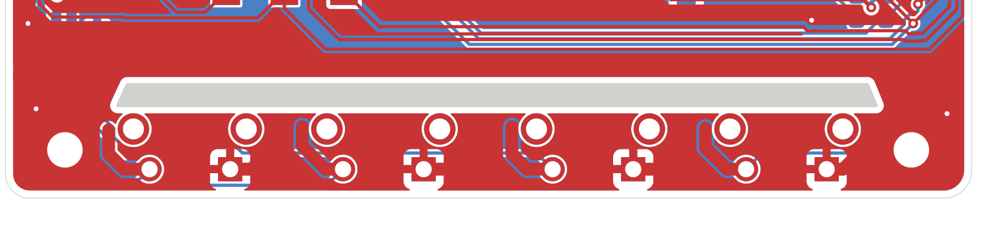
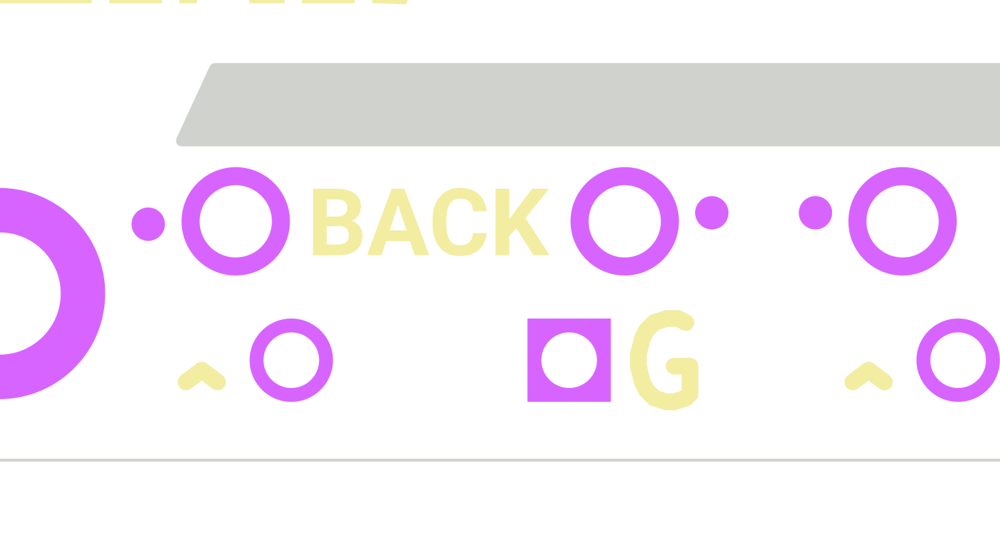
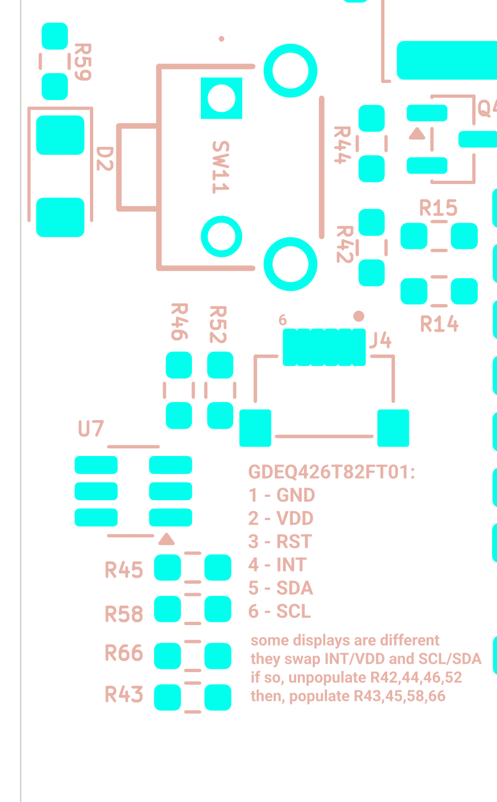
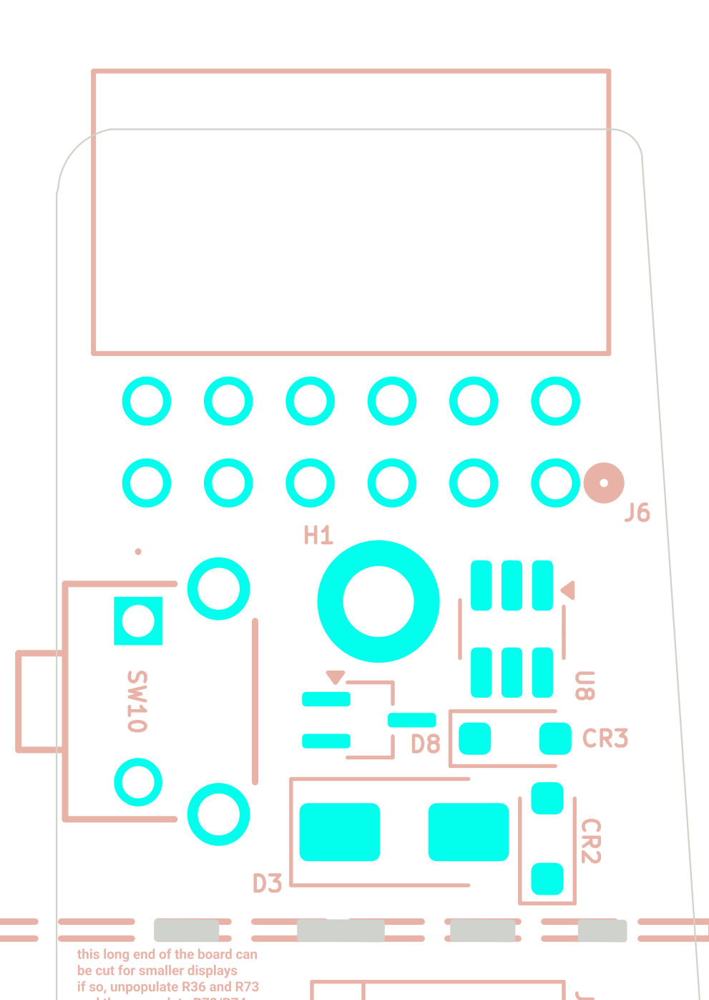

# ADC button ladders, RTC, touch connector + jumper mux, expansion header and its ESD

*Final review 2026-09-19 — reviewer key `hmi`, finding IDs `HMI-nn`.
Evidence: `docs/final-review-2026-09-19/evidence/` (netlist-derived connectivity, board extract, plots).
Written blind of all earlier audits; every connection below was taken from
`evidence/sch/connectivity_by_component.txt` / `evidence/blocks/hmi.md`, never from an image alone.*

> **This section has been through an adversarial verification pass (2026-09-20).** A second reviewer
> re-derived every BLOCKER/HIGH/MEDIUM and every DOC finding from the netlist, the board file and the
> manufacturer datasheets. **One HIGH finding (HMI-20) was refuted outright**, several severities were
> re-graded, a number of measurements were corrected, and six new findings (`HMI-V01`–`HMI-V06`) were added.
> Refuted material is struck through but left visible. The full audit trail is in
> **[Verification log](#verification-log)** at the end.

**Jargon used once and then re-used**

* **Resistor ladder** — several push-buttons, each with its own resistor, all sharing one wire to one analogue
  input. Pressing a button pulls the wire to a different voltage, so one pin reads many buttons.
* **ADC** — analogue-to-digital converter, the thing in the ESP32 that turns that voltage into a number.
* **Pull-up** — a resistor to +3.3 V that holds a wire high when nothing else is driving it.
* **DNP** — "do not populate": the part is on the drawing but deliberately left off the board.
* **TVS / ESD array** — a diode that does nothing until the voltage on a wire goes too high, then conducts and
  dumps the surge to ground. **Standoff voltage (V_RWM)** is the highest voltage it will tolerate without
  conducting; **clamping voltage (V_C)** is where it holds the wire during a big surge.
* **Strapping pin** — an ESP32 pin whose voltage *at the instant of reset* is latched and changes how the chip
  boots. After reset it becomes an ordinary pin again, but the damage (or the failed boot) is already done.

---

## What this part of the board does

Four separate jobs, all on the "how the user and the outside world touch this board" side of the design.

1. **Eight physical buttons.** Instead of using eight GPIO pins, the design uses two resistor ladders on two
   ADC pins. The four buttons along the bottom edge (`RIGHT`, `LEFT`, `OK`, `BACK`) share `BUTTON_ADC_1`
   (ESP32-S3 **IO1**); the four page-turn buttons on the left and right edges (`DWN1`, `UP1`, `DWN2`, `UP2`)
   share `BUTTON_ADC_2` (**IO4**). All eight are APEM MJTP1117 right-angle through-hole tact switches placed
   so the actuator pokes out past the PCB edge.
2. **A real-time clock.** U13, a DS3231MZ, hangs off the board's I²C bus so the reader knows the date and time
   with ±5 ppm accuracy instead of the ESP32's own (much worse) internal oscillator.
3. **A capacitive-touch connector.** J4 is a 6-way 0.5 mm FPC socket for the touch layer of the e-paper panel,
   with a small ESD array (U7) and a bank of 0 Ω "jumper" resistors that let you swap which connector pin
   carries VDD vs INT and which carries SDA vs SCL, because different panel vendors wire the flex differently.
4. **A 12-way expansion ("development") header.** J6 brings out spare GPIOs, the I²C bus, 3V3, ground, the LED
   backlight drive rails and the raw battery, so accessories can be plugged on. U8, U9, D3, D8, CR2 and CR3 are
   the surge protection for those exposed pins.

---

## Circuit walk-through

### Button ladder 1 — `BUTTON_ADC_1` → ESP32-S3 IO1

| Ref | Part / value | Role | Checked against datasheet? |
|---|---|---|---|
| R4 | 10 kΩ 1 % (RC0603FR-0710KL) | Pull-up from `BUTTON_ADC_1` to 3V3 | n/a (passive) |
| C27 | 2.2 nF (CL10B222KB8NNNC) | Filter cap, `BUTTON_ADC_1` → GND, placed at the ESP32 | n/a |
| R60 + SW2 | 100 Ω + MJTP1117 | `RIGHT` — lowest code | Yes — MJTP1117 rated 0.05 A / 12 VDC, we use 0.33 mA / 3.3 V |
| R18 + SW3 | 5.6 kΩ + MJTP1117 | `LEFT` | Yes |
| R19 + SW8 | 20 kΩ + MJTP1117 | `OK` / confirm | Yes |
| R20 + SW9 | 56 kΩ + MJTP1117 | `BACK` | Yes |
| U4 pin 39 | ESP32-S3-WROOM-1 IO1 | RTC_GPIO1 / TOUCH1 / **ADC1_CH0** | Yes — ESP32-S3 datasheet v2.2, IO MUX table |

### Button ladder 2 — `BUTTON_ADC_2` → ESP32-S3 IO4

| Ref | Part / value | Role | Checked against datasheet? |
|---|---|---|---|
| R28 | 10 kΩ 1 % | Pull-up to 3V3 | n/a |
| C28 | 2.2 nF | Filter cap at the ESP32 | n/a |
| R61 + SW1 | 100 Ω + MJTP1117 | `DWN1` (right edge) | Yes |
| R11 + SW4 | 12 kΩ + MJTP1117 | `UP1` (right edge) | Yes |
| R35 + SW5 | 33 kΩ + MJTP1117 | `DWN2` (left edge) | Yes |
| R36 + SW7 | 68 kΩ + MJTP1117 | `UP2` (left edge) | Yes |
| R73 | 0 Ω, **fitted** | Returns SW7's far side to GND (ladder mode) | n/a |
| R74 | 0 Ω, **DNP** | Alternative: returns SW7's far side to 3V3 (power-button mode) | n/a |
| R72 | 10 kΩ, **DNP** | Alternative: couples SW7's node to `PWR_BUTTON` (IO18) | n/a |
| U4 pin 4 | ESP32-S3 IO4 | RTC_GPIO4 / TOUCH4 / ADC1_CH3 | Yes |

The schematic note reads *"UP(2) can serve as a power button if R36/R73 are unpopulated and R72/R74 are
populated"*, and the same instruction is silkscreened on the back of the board next to J6. With R36 removed
the option is electrically clean (see **Calculations**).

Reference for the power-button path: `PWR_BUTTON` (IO18) also carries R76 = 100 kΩ to GND and R62 = 10 kΩ up
to SW10 (the dedicated power button) which goes to 3V3.

### External RTC

| Ref | Part / value | Role | Checked against datasheet? |
|---|---|---|---|
| U13 | DS3231MZ+TRL (Analog Devices/Maxim), SOIC-8 | ±5 ppm I²C RTC, address 0x68 | Yes — DS3231M datasheet, Pin Description + "Power-Supply Configurations" |
| U13.2 VCC | tied to **GND** | Datasheet: *"Connect to ground if not used."* This is the sanctioned **Figure 5 "Single Supply (VBAT only)"** configuration | Yes |
| U13.6 VBAT | tied to **3V3** | Datasheet: *"When using the device with the VBAT input as the primary power source, this pin should be decoupled using a 0.1 µF to 1.0 µF low-leakage capacitor."* | Yes |
| C30 | 0.1 µF X7R, 3V3→GND, 1.1 mm from U13's VBAT pad | The required VBAT decoupling cap | Yes |
| U13.1 32KHZ | open (open-drain, no pull-up) | Datasheet: *"can be left open circuit if not used"* | Yes |
| U13.3 INT/SQW | **open** (open-drain, no pull-up, not routed) | Datasheet: *"It can be left open if not used"* — legal, but see **HMI-04** | Yes |
| U13.4 RST | open | Datasheet: *"No external pullup resistors should be connected."* In VBAT-only mode the datasheet says RST *"is disabled and is held at ground"* — harmless here because it is unconnected | Yes |
| U13.7/8 SDA/SCL | `I2C_SDA` / `I2C_SCL`, pulled up by R48/R47 = 2.2 kΩ to 3V3 | Shared with J4 (touch) and J6 (header) | Yes |

### Touch connector, ESD and jumper mux

| Ref | Part / value | Role | Checked against datasheet? |
|---|---|---|---|
| J4 | Hirose FH34SRJ-6S-0.5SH(50) | 6-way, 0.5 mm pitch, 1.0 mm height, back-flip FPC socket, **top *and* bottom contact** | Yes — Hirose FH34 series page |
| J4.1, J4.S1, J4.S2 | GND + both shield tabs | Ground and mechanical retention | Yes |
| J4.3 | `TP_RST` → IO11 (hard-wired, no jumper) | Panel reset | — |
| R42 | 0 Ω **fitted**: 3V3 → `/PIN_2` | Default: connector pin 2 = panel VDD | — |
| R43 | 0 Ω **DNP**: `TP_INT` (IO41) → `/PIN_2` | Alternate | — |
| R44 | 0 Ω **fitted**: `TP_INT` → `/PIN_4` | Default: connector pin 4 = panel INT | — |
| R66 | 0 Ω **DNP**: 3V3 → `/PIN_4` | Alternate | — |
| R46 | 0 Ω **fitted**: `I2C_SDA` → `/PIN_5` | Default: pin 5 = SDA | — |
| R45 | 0 Ω **DNP**: `I2C_SCL` → `/PIN_5` | Alternate | — |
| R52 | 0 Ω **fitted**: `I2C_SCL` → `/PIN_6` | Default: pin 6 = SCL | — |
| R58 | 0 Ω **DNP**: `I2C_SDA` → `/PIN_6` | Alternate | — |
| U7 | TPD4E1U06DBVR, SOT-23-6 | 4-channel ESD array on `/PIN_4`, `TP_RST`, `/PIN_5`, `/PIN_6`. V_RWM 5.5 V, DC breakdown ≥ 6.5 V, leakage ≤ 10 nA, clamps to 11 V at 1 A. Pin 5 is **NC** — *"can be left floating, grounded, or connected to VCC"* | Yes — TI SLVSBQ9D, Pin Functions + Feature Description |

**Resulting default pinout of J4 (pin 1 nearest the board interior, silkscreen dot = pin 1):**

| J4 pin | Default net | Alternate net (all four alternates swapped together) |
|---|---|---|
| 1 | GND | GND |
| 2 | **3V3 (panel VDD)** | `TP_INT` (IO41) |
| 3 | `TP_RST` (IO11) | `TP_RST` — *no jumper, cannot be moved* |
| 4 | `TP_INT` (IO41) | **3V3** |
| 5 | `I2C_SDA` (IO38) | `I2C_SCL` |
| 6 | `I2C_SCL` (IO39) | `I2C_SDA` |

The board's own silkscreen right beside J4 says `GDEQ426T82FT01: 1-GND 2-VDD 3-RST 4-INT 5-SDA 6-SCL`
(see image below). **The default population matches that panel pinout exactly**, pin for pin.

> ~~**Warning — the board's instruction for the *alternate* panel is incomplete.** The silkscreen next to J4
> says *"if so, unpopulate R42,44,46,52 / then, populate R43,45,58"*. That is three resistors; the alternate
> set is **four**. **R66 is missing from the list**, and without it connector pin 4 — the panel's VDD in the
> alternate wiring — is left floating and the touch panel never powers up. See **HMI-20**.~~
>
> **Refuted by verification.** The silkscreen is **correct**. The board's own source reads
> `"some displays are different \nthey swap INT/VDD and SCL/SDA\nif so, unpopulate R42,44,46,52\nthen,
> populate R43,45,58,66"` — all **four** alternates are listed, R66 included. Verified twice: by `pcbnew`
> on the scratch copy, and by reading the `gr_text` at `(at 95.9 137.4 0)`, layer `B.SilkS`, in
> `silkscreen_pcb.kicad_pcb` itself. The original reviewer appears to have transcribed the text from an
> image crop with the trailing `,66` cut off. **The alternate recipe on the board, in `HARDWARE.md` §8 and
> in `README.md` all agree.** See **HMI-20** (struck).

### Expansion header and its protection

| Ref | Part / value | Role | Checked against datasheet? |
|---|---|---|---|
| J6 | Sullins PPPC062LJBN-RC, 2×6 0.1" female **socket**, through-hole, **right-angle** | Development header, mouth facing out over the board's top edge | Yes — DigiKey 776017 lists PPPC062LJBN-RC as Right Angle; the `-LFBN-` suffix is the straight version |
| U8 | TPD4E1U06DBVR | ESD on `UNUSED_GPIO_45`, `I2C_SCL`, `I2C_SDA`, `UNUSED_GPIO_3` | Yes |
| U9 | TPD4E1U06DBVR | ESD on `SD_DAT1`, `SD_DAT0`, (pin 4 NC), `UNUSED_GPIO_46` | Yes |
| D3 | Littelfuse SMAJ26A, DO-214AC | Unidirectional 400 W TVS on `LED_SW`. V_RWM 26 V, I_R ≤ 5 µA at 26 V, V_BR 28.9–31.9 V at 1 mA, V_C 42.1 V at 9.5 A | Yes |
| CR2 | TI TSD05CDYFR, SOD-323 | **Bidirectional** TVS on 3V3. V_RWM ±5.5 V, V_BR 7–9 V at 1 mA, leakage ≤ 10 nA at 5.5 V | Yes — TI SLVSH42C |
| CR3 | TI TSD05CDYFR, SOD-323 | Same part on `P+` (raw battery) | Yes |
| D8 | Nexperia PESD2IVN-UX, SOT-323 | Dual **bidirectional** TVS on `C-` and `W-`, common on **pin 3**. V_RWM 26.5 V, I_RM 1 nA typ / 50 nA max at 26.5 V, V_BR 28–32 V at 5 mA | Yes — Nexperia PESD2IVN-U datasheet, Table 2 "Pinning information" |

**Physical pinout of J6** (pad coordinates from `evidence/blocks/hmi.md`; row A is at y = 47.97 mm, row B at
y = 45.43 mm, x increases 88.74 → 101.44 mm in 2.54 mm steps):

| Row | Pin 1 / 7 | +2.54 | +5.08 | +7.62 | +10.16 | +12.70 |
|---|---|---|---|---|---|---|
| **B** (y = 45.43, toward board top edge) | 7 `3V3` | 8 `I2C_SDA` | 9 `GPIO3` | 10 `I2C_SCL` | 11 `C-` | 12 `P+` (raw battery) |
| **A** (y = 47.97) | 1 `GND` | 2 `GPIO46` | 3 `GPIO45` | 4 `GND` | 5 `LED_SW` | 6 `W-` |

The top-side silkscreen reads `3V3 SDA 3 SCL C- BAT+` over `GND 46 45 GND LED+ W-`, which matches the netlist
**exactly**, and the board carries the note *"The dev-header label is from the perspective of looking at the
device straight on from its top side (not from the back)"* — which is the correct reading direction for a
non-mirrored F.Silkscreen label.

---

## Where it is on the board & layout notes

Board outline: x 44.21–104.26 mm, y 36.97–148.27 mm. Y grows **downward**. Everything in this section is on
the **bottom** (component) side.

### Buttons

| Button | Ref | Ladder leg | Switch pads (mm) | Edge | Footprint outline overhangs edge by |
|---|---|---|---|---|---|
| `RIGHT` | SW2 | 100 Ω (R60) | x 90.24 / 95.24, y 146.45 | bottom | 2.95 mm |
| `LEFT` | SW3 | 5.6 kΩ (R18) | x 78.24 / 83.24, y 146.45 | bottom | 2.95 mm |
| `OK` | SW8 | 20 kΩ (R19) | x 65.24 / 70.24, y 146.45 | bottom | 2.95 mm |
| `BACK` | SW9 | 56 kΩ (R20) | x 53.24 / 58.24, y 146.45 | bottom | 2.95 mm |
| `DWN1` | SW1 | 100 Ω (R61) | x 101.44, y 84.25 / 89.25 | right | 1.95 mm |
| `UP1` | SW4 | 12 kΩ (R11) | x 101.49, y 70.25 / 75.25 | right | 1.95 mm |
| `DWN2` | SW5 | 33 kΩ (R35) | x 46.99, y 84.25 / 89.25 | left | 1.99 mm |
| `UP2` | SW7 | 68 kΩ (R36) | x 46.99, y 70.25 / 75.25 | left | 1.99 mm |

The MJTP1117 footprint has two 1.0 mm-drill electrical pins 5.0 mm apart plus two 1.3 mm-drill mechanical
posts 7.0 mm apart offset 2.5 mm toward the board interior — consistent with a right-angle (side-actuated)
switch whose actuator points off the board edge. **The left/right pairs are properly mirrored** (SW1 and SW5
both occupy y 84.25–89.25; SW4 and SW7 both occupy y 70.25–75.25), so left- and right-hand page-turn buttons
line up. See **HMI-10** for the bottom-row-vs-side-row standoff difference.

*Bottom edge, both-copper x-ray (top view), x 44–106 mm, y 136–150 mm. The blue F.Cu stubs leaving each
button's signal pad are the deliberate remote-mount lands, see below.*

*Top side (mask + silk) over `BACK`/`OK`, x 48–66 mm, y 140–150 mm at 80 px/mm. Small solid dots = exposed
copper lands; `G` marks the ground pin of each switch; `^` marks the actuator position; `BACK` is the label.*

These front-face copper stubs are a **front-mount option**, not stray copper. Each of the four bottom-edge
switches has two of them: a 0.8 mm-wide F.Cu track grows from contact pad 1 (GND) toward mounting-hole ring 3,
and another from contact pad 2 (the ladder resistor) toward ring 4, each stopping just short with a ø 0.6 mm
solder-mask window over its tip. Rings 3 and 4 carry no net on the board. Bridging both tabs with an iron puts
a **front-mounted vertical APEM MJTP1243** — dropped into the two 1.3 mm mounting holes — onto the same ladder
node as the right-angle part would have used. Measured tab-tip geometry (script `tabs2.py`):

| Switch | GND tab → ring 3 | copper gap | Signal tab → ring 4 | copper gap |
|---|---|---|---|---|
| SW2 (`RIGHT`) | tab tip (97.763, 143.900) | **0.151 mm** | tab tip (87.711, 143.900) | **0.151 mm** |
| SW3 (`LEFT`) | tab tip (85.800, 143.800) | 0.188 mm | tab tip (75.711, 143.800) | **0.151 mm** |
| SW8 (`OK`) | tab tip (72.800, 143.900) | 0.188 mm | tab tip (62.711, 143.800) | **0.151 mm** |
| SW9 (`BACK`) | tab tip (60.763, 143.800) | **0.151 mm** | tab tip (50.700, 144.000) | 0.163 mm |

> **Corrected during verification.** The gaps above were originally computed as
> `tip-to-ring-centre distance − ring radius − track half-width`, which is only right if the track points at
> the ring centre. Re-measured as a true point-to-segment copper clearance against every F.Cu segment
> (`hmi_verify/v3.py`), the real gaps are **0.151–0.188 mm**, minimum **0.1510 mm** — 1 µm over the board's
> 0.150 mm minimum-clearance rule, not 2 µm — and the maximum is 0.188 mm, not 0.195 mm.
>
> The **solder-mask dam** was also wrong. The eight F.Mask windows are 0.600 × 0.600 mm and sit 1.575 mm from
> their ring centres; with global mask expansion at 0.000 mm the ring's mask opening is ø 1.95 mm, so the dam
> is `1.575 − 0.300 − 0.975` = **0.300 mm**, not 0.26 mm. 0.30 mm is a comfortable dam for any fab that will
> build this board, which is why **HMI-13 has been re-graded from MEDIUM to LOW**. It also means
> `HARDWARE.md` §9.1.1's *"each tab stops 0.3 mm short of its ring"* is **exactly right about the mask** and
> was simply describing a different pair of edges from the copper gap.

See **HMI-13**. Note that only the four **signal-side** tabs are electrically dangling
(`Net-(R18/R19/R20/R60-Pad1)`, 1.19–1.71 mm long, the four `track_dangling` DRC warnings); the four GND-side
tabs belong to the GND net, so they raise no warning.

**Only the four bottom-edge switches have these copper tabs.** SW1, SW4, SW5 and SW7 — the actual
*side-mounted* switches — have none. They do, however, all carry F.Silkscreen **`G` / `^` / name markers**
on the front face (SW1 `G`@(100.4, 83.4) `^`@(102.0, 89.2) `DWN1`; SW4 `G`@(100.4, 69.2) `^`@(102.0, 75.2)
`UP1`; SW5 `G`@(46.0, 92.2) `^`@(46.4, 84.2) `DWN2`; SW7 `G`@(46.0, 78.2) `^`@(46.4, 70.4) `UP2`), and all
eleven switches are PTH, so a flying lead can be soldered to any of them from the front face. That matters
for **HMI-14**, which has been re-graded accordingly. All eleven switches, including SW10 and SW11, are on
the **bottom** side; there are no top-side duplicate button footprints and nothing is wired in parallel.

**The MJTP1117 land pattern is confirmed against APEM's own catalogue drawing** (see **Sources**): two inner
terminals at `.197 (5.0)` mm and two outer legs at `.276 (7.0)` mm, offset `.098 (2.5)` mm, body height
`.169 (4.3)` mm — exactly the KiCad footprint. The catalogue titles MJTP1117 (EU `PHAP3363`) *"Right angle,
**grounding**"*, and the drawing shows the outer 7.0 mm pair as continuations of the one-piece metal frame.
So `HARDWARE.md`'s claim that mounting pads 3/4 are the switch cover's legs is **correct**, and it has a
consequence the original review missed — see **HMI-V03**.

### RTC

U13 sits at (61.91, 125.03) rotated 90°, pads on 1.27 mm pitch. C30 is at (60.40, 120.50); its 3V3 pad is at
(61.26, 120.50), **1.1 mm from U13's VBAT pad at (61.27, 122.55)** — about as tight as a 0603 hand-solder
footprint allows. Good.

### Touch connector

*Bottom side (mirrored view), x 87–105 mm, y 112–141 mm at 50 px/mm. J4 with its pin-1 dot and `6` marker;
R46/R52 and R44/R42 are the fitted jumpers; R45/R58/R66/R43 are the DNP alternates, grouped under the
explanatory silkscreen; U7 is the SOT-23-6 ESD array; the GDEQ426T82FT01 pinout is printed beside them.*

J4 is at (92.50, 126.00); U7 at (100.15, 129.74) — **8.3 mm** centre-to-centre. The fitted mux resistors
R46/R52 are at (98.5, 126.09) / (97.0, 126.09), ~5.5 mm from J4. The ESD array is correctly tapped onto the
*connector-side* nets (`/PIN_4`, `/PIN_5`, `/PIN_6`, `TP_RST`), i.e. it is in parallel with the connector and
not hidden behind the jumpers — that part is right.

### Expansion header and its protection cluster

*Bottom side (mirrored view), x 84–106 mm, y 33–64 mm at 45 px/mm. The 2×6 grid is J6 (pin-1 dot bottom
right in this mirrored view); below it, clockwise, U8, CR3, D8, CR2, D3. SW10 (power button) and H1 are at
left. The long silkscreen note about cutting the board and swapping the power button is at the bottom.*

Distances from J6's nearest pad:

| Protector | Position | Protects | Distance to the J6 pin it protects |
|---|---|---|---|
| U8 | (90.10, 52.50) | GPIO45, GPIO3, SDA, SCL | 4.5–6.5 mm — **good** |
| CR2 | (89.00, 59.00) | 3V3 | 11 mm — acceptable |
| CR3 | (90.00, 55.90) | `P+` | 14 mm — acceptable |
| D8 | (94.53, 55.33) | `C-`, `W-` | 9–11 mm — acceptable |
| D3 | (93.45, 58.80) | `LED_SW` | 12 mm — acceptable |
| **U9** | (79.63, 70.48) | GPIO46 **and** the SD card lines | **25 mm straight line, 93 mm of routed track** — see HMI-09 |

**J6 is a right-angle socket, which explains its geometry.** Sullins PPPC062LJBN-RC is the right-angle member
of the PPPC family (the straight one is PPPC062L**F**BN-RC). Its footprint therefore puts the insulator body
*beside* the pins rather than around them: body/B.Fab outline y 35.12–44.03 mm, pads at y 45.43 and 47.97 mm,
courtyard y 34.99–49.06 mm covering both. The mouth faces −y, i.e. **out over the board's top edge**, and the
body overhangs that edge (y = 36.975) by **1.67 mm** (B.Fab body) to **1.86 mm** (B.Silkscreen); the 1.98 mm
originally quoted here was the *courtyard*, which carries clearance margin — normal and desirable for an edge connector, but the
enclosure needs a *slot* there, not a hole. The 2×6 grid of pads is the only thing inside the board outline.
See **HMI-21** for the labelling consequence: the pin-function table is on F.Silkscreen while the socket and
the mating plug are on the bottom face.

---

## Calculations

All numbers below come from `scratchpad/agents/hmi/ladder.py`, which enumerates every button subset and
evaluates worst case over ±1 % on every resistor (the parts are Yageo RC0603F, 1 %).

### Ladder voltages (V_DD = 3.30 V, pull-up = 10 kΩ)

`V = V_DD · R_parallel / (R_parallel + 10 k)` where `R_parallel` is the parallel combination of all pressed legs.

**Ladder 1 (IO1)** — ordered, with the worst-case ±1 % window and the raw 12-bit code assuming the
ESP32-S3's 12 dB attenuation full scale of ~3.1 V:

| Buttons | Nominal | Worst-case window | Raw code | Worst-case gap to the code below |
|---|---|---|---|---|
| any combination containing `RIGHT` | 0.0319–0.0327 V | 0.0313 … 0.0333 V | 42–43 | — (all collapse into one band) |
| `LEFT`+`OK`+`BACK` | 0.9526 V | 0.9391 … 0.9662 | 1258 | +906 mV |
| `LEFT`+`OK` | 1.0043 V | 0.9904 … 1.0184 | 1327 | **+24.2 mV** |
| `LEFT`+`BACK` | 1.1133 V | 1.0985 … 1.1281 | 1471 | +80.2 mV |
| `LEFT` | 1.1846 V | 1.1695 … 1.1998 | 1565 | **+41.4 mV** |
| `OK`+`BACK` | 1.9660 V | 1.9500 … 1.9818 | 2597 | +750 mV |
| `OK` | 2.2000 V | 2.1853 … 2.2146 | 2906 | +204 mV |
| `BACK` | 2.8000 V | 2.7915 … 2.8084 | 3699 | +577 mV |
| *(none)* | 3.3000 V | — | 4095 (saturated) | +492 mV |

**Ladder 2 (IO4)**:

| Buttons | Nominal | Worst-case window | Raw code | Worst-case gap |
|---|---|---|---|---|
| any combination containing `DWN1` | 0.0323–0.0327 V | 0.0316 … 0.0333 | 43 | — |
| `UP1`+`DWN2`+`UP2` | 1.4452 V | 1.4290 … 1.4615 | 1909 | +1396 mV |
| `UP1`+`DWN2` | 1.5447 V | 1.5283 … 1.5611 | 2040 | +66.8 mV |
| `UP1`+`UP2` | 1.6663 V | 1.6498 … 1.6828 | 2201 | +88.7 mV |
| `UP1` | 1.8000 V | 1.7836 … 1.8163 | 2378 | +100.8 mV |
| `DWN2`+`UP2` | 2.2757 V | 2.2615 … 2.2898 | 3006 | +445 mV |
| `DWN2` | 2.5326 V | 2.5207 … 2.5443 | 3345 | +231 mV |
| `UP2` | 2.8769 V | 2.8695 … 2.8842 | 3800 | +325 mV |
| *(none)* | 3.3000 V | — | 4095 (saturated) | +416 mV |

**Every single-button code is separable, and "no button" is separable by ≥ 416 mV. That part of the design is
sound.** *(Verification correction: the "≥ 204 mV" originally quoted here is the gap from `OK` down to the
`OK`+`BACK` **chord**. Comparing single presses against each other only, the worst-case minimum is
**325 mV** — `DWN2` at most 2.5443 V against `UP2` at least 2.8695 V. Every other single-to-single gap is
larger: 0.492 / 0.577 / 0.986 / 1.136 V on ladder 1 and 0.416 / 0.704 / 1.750 V on ladder 2.)* The two-button combinations are where it gets tight — see
**HMI-05**.

Note that every single-button code including the two highest (2.877 V and 2.800 V) stays below the ~3.1 V
12 dB full scale even at V_DD = 3.366 V (3V3 + 2 %): `UP2` worst case = 3.366 × 68.68 k / 78.58 k = 2.942 V.
Only the released state saturates. That is deliberate and fine — but see **HMI-15**.

### Current, and what it costs in sleep

| State | Ladder current | Note |
|---|---|---|
| No button pressed | **0 µA** | The pull-up's only load is the ADC pin and a 2.2 nF cap — no DC path |
| `RIGHT` or `DWN1` held | 3.3 V / 10.1 kΩ = **327 µA** | Worst case, the 100 Ω legs |
| `LEFT` held | 212 µA | |
| `UP1` held | 150 µA | |
| `OK` held | 110 µA | |
| `DWN2` held | 77 µA | |
| `BACK` held | 50 µA | |
| `UP2` held | 42 µA | |

So the ladders cost nothing at rest, and a single jammed/stuck button costs at most 0.33 mA. Acceptable.

Total always-on leakage contributed by this whole section:

| Source | Leakage | Reference |
|---|---|---|
| U13 DS3231MZ timekeeping current (I_BATT, I²C idle, EN32KHZ = 0) | 2 µA typ / 3.0 µA max at 3.63 V | DS3231M DC Electrical Characteristics — VBAT Current Consumption |
| CR2 + CR3 (TSD05C) | ≤ 10 nA each at 5.5 V, far less at 3.3 / 4.2 V | TI SLVSH42C |
| U7 + U8 + U9 (12 used TPD4E1U06 channels) | ≤ 10 nA each = ≤ 120 nA total | TI SLVSBQ9D |
| D8 (PESD2IVN, `W-`/`C-` near 0 V when the backlight is off) | 1 nA typ / 50 nA max at 26.5 V | Nexperia PESD2IVN-U |
| D3 (SMAJ26A, `LED_SW` at 0 V when the backlight is off) | ≤ 5 µA at 26 V, ≈ 0 at 0 V | Littelfuse SMAJ |
| R47/R48 I²C pull-ups | 0 µA with the bus idle-high | — |
| **Total** | **≈ 2–3 µA, entirely the RTC** | |

While the system is awake and the I²C bus is being clocked (e.g. polling the touch controller) the RTC draws
I_BATA = 70 µA typ / 150 µA max instead, because it is on the same bus. That is a real but small awake cost.

### The `UP2`-as-power-button option, proved

Default build (R73 = 0 Ω fitted, R72 and R74 DNP, R36 = 68 kΩ fitted): SW7 is an ordinary ladder leg to GND.
Verified from the netlist — `Net-(R73-Pad2)` has exactly three nodes: R73.2, R74.2, SW7.1, and R73.1 is GND.

Option build as documented (R36 and R73 removed, R72 = 10 kΩ and R74 = 0 Ω fitted):

* SW7 released → `Net-(R36-Pad1)` is open, so `PWR_BUTTON` is held at 0 V by R76 (100 kΩ to GND). Clean low.
* SW7 pressed → 3V3 → R74 (0 Ω) → SW7 → R72 (10 kΩ) → `PWR_BUTTON`, loaded by R76 100 kΩ:
  `3.3 × 100 k / 110 k = 3.00 V`. A valid high (V_IH min = 0.75 × 3.3 = 2.475 V). Current 30 µA while held.
* **The option works, and it needs R36 removed.** If R36 were left fitted the chain would be
  3V3 → R28 10 k → R36 68 k → R72 10 k → R76 100 k = 188 kΩ, putting `PWR_BUTTON` at a permanent
  `3.3 × 100/188 = 1.76 V` — in the indeterminate band, with 17.6 µA burned forever. The schematic and the
  silkscreen both say to remove R36, so this is documented correctly. I checked it because the task asked
  whether any population combination misbehaves, and this is the one that would.
* **The one combination that is genuinely dangerous** is R73 *and* R74 both fitted: R73 is 0 Ω to GND and R74
  is 0 Ω to 3V3, so together they are a **direct short from 3V3 to ground**. See **HMI-07**.

### Logic levels — can a button wake the ESP32 from deep sleep?

ESP32-S3 datasheet v2.2: V_IH min = 0.75 × V_DD = **2.475 V**, V_IL max = 0.25 × V_DD = **0.825 V**.

| Button | Ladder voltage | Digital level |
|---|---|---|
| `RIGHT` (SW2) | 0.033 V | **valid LOW** |
| `DWN1` (SW1) | 0.033 V | **valid LOW** |
| `LEFT` (SW3) | 1.185 V | indeterminate |
| `UP1` (SW4) | 1.800 V | indeterminate |
| `OK` (SW8) | 2.200 V | indeterminate |
| `DWN2` (SW5) | 2.533 V | valid HIGH — same as released |
| `BACK` (SW9) | 2.800 V | valid HIGH — same as released |
| `UP2` (SW7) | 2.877 V | valid HIGH — same as released |
| *released* | 3.300 V | valid HIGH |

IO1 is RTC_GPIO1 and IO4 is RTC_GPIO4, so both *are* valid `ext0`/`ext1` wake sources in principle. But only
the two 100 Ω legs produce a level that an ext-wake comparator can see. See **HMI-06**.

### ESD/TVS standoff voltage vs each protected net's working voltage

| Protector | Net | Net's maximum normal working voltage | Protector V_RWM | Verdict |
|---|---|---|---|---|
| CR2 (TSD05C, bidirectional) | `3V3` | 3.37 V (3.3 V + 2 %) | ±5.5 V | **OK**, 2.1 V margin |
| CR3 (TSD05C, bidirectional) | `P+` raw LiPo | 4.2 V (TP4056 CV point) | ±5.5 V | **OK**, 1.3 V margin |
| U7/U8/U9 (TPD4E1U06) | 3.3 V logic, SD data, I²C | 3.37 V | 5.5 V | **OK** |
| D3 (SMAJ26A, unidirectional) | `LED_SW` boost output | TPS923610 OVP rising threshold **24.25 / 25 / 25.5 V** (TI datasheet, V_OVP_R, T_J ≤ 85 °C); board silk asks for LED strings under 22 V | 26 V | **OK**, but only 0.5 V above the worst-case OVP trip. Leakage there is ≤ 5 µA |
| D8 (PESD2IVN-UX, dual bidirectional) | `W-`, `C-` LED cathode returns, which float up to ≈ `LED_SW` when Q5/Q6 are off | same ≤ 25.5 V | 26.5 V | **OK**, 1.0 V margin |

**This is the check I expected to fail and it does not.** A 5.5 V array on the 22–25 V backlight nets would
have been a fire hazard; the designer used a 26.5 V automotive part on `W-`/`C-` and a 26 V TVS on `LED_SW`.
Both are correctly matched to the TPS923610's 25 V over-voltage trip.

### Polarity checks on the unidirectional/asymmetric protectors

* **D3 (SMAJ26A)** — the KiCad symbol is `Diode:SMAJ30A`, which inherits from `SM6T6V8A`. Its pin *names* are
  the misleading `A1`/`A2`, but the symbol graphics put the cathode bar (polyline at x = −1.27) on the
  **pin 1** side and the triangle's base on pin 2. `Diode_SMD:D_SMA` has pad 1 at x = −2 with the extended
  silkscreen band on that end. D3 pin 1 → `LED_SW`, pin 2 → GND. **Cathode to the positive rail — correct.**
  A reversed unidirectional TVS here would have been a forward-biased short across the boost output.
* **D8 (PESD2IVN-UX)** — Nexperia's Table 2 "Pinning information" gives pin 1 = K, pin 2 = K, **pin 3 = CC
  (common)**. The design has pin 1 → `C-`, pin 2 → `W-`, **pin 3 → GND**. **Correct.** See **HMI-11** for the
  library-hygiene caveat.
* **CR2/CR3 (TSD05C)** — bidirectional, and TI's Pin Functions table says either pin may be the I/O with the
  other grounded. Orientation cannot be wrong. The ERC "footprint doesn't match footprint filters" warning on
  these two is a false alarm: TI's `DYF` package **is** SOD-323, which is what `Diode_SMD:D_SOD-323_HandSoldering`
  is.

---

## Findings

| ID | Severity | Finding | Evidence | Recommendation |
|---|---|---|---|---|
| HMI-01 | **HIGH** | J6 pin 12 brings the raw LiPo `P+` rail out on an unkeyed 0.1" socket **with no fuse, PTC or series element of any kind** — the only protection downstream is the DW01A in the cell's negative path | `evidence/blocks/hmi.md` J6 pin map; net `P+` has no series element between U5/U11 and J6.12. Pad at (101.44, 45.43). The pin *placement* is well chosen — its only neighbours are `C-` (98.90, 45.43) and `W-` (101.44, 47.97), both LED-domain, so a whisker cannot reach a logic pin — but placement is not current limiting | Fit a 0.5–1 A PPTC (1206) in series with J6 pin 12. Add a `BAT+` warning to the silkscreen. A mis-inserted or reversed mating plug still puts the cell across whatever it lands on |
| HMI-02 | MEDIUM *(re-graded from HIGH)* | Three of the four ESP32-S3 strapping pins (GPIO3, GPIO45, GPIO46) are on J6 with only a 33 Ω series resistor. An accessory that pulls **GPIO45 high at reset** sets VDD_SPI to 1.8 V and the module will not boot | ESP32-S3 datasheet v2.2 §3 Boot Configurations, Table 3-1 (GPIO45 default = weak pull-down, bit 0 = 3.3 V VDD_SPI; GPIO46 default = weak pull-down; GPIO3 default = *floating*); nets `UNUSED_GPIO_45` (J6.3, R69, U8.1), `UNUSED_GPIO_46` (J6.2, R65, U9.6), `UNUSED_GPIO_3` (J6.9, R68, U8.6) | Add 4.7–10 kΩ pull-downs to GND on GPIO45 and GPIO46 close to U4; silkscreen/doc warning "GPIO45/46 must be low at reset"; long term, prefer non-strapping pins on the header. **Verification note:** every datasheet fact was re-checked verbatim and is correct (Table 3-1: GPIO0 weak pull-up = 1, GPIO3 *Floating*, GPIO45 weak pull-down = 0, GPIO46 weak pull-down = 0; R_PU = R_PD = 45 kΩ typ). Re-graded to MEDIUM because the board as released boots fine — the hazard needs a third-party accessory — and the must-do part of the fix (a loud doc/silkscreen warning) is free, while the pull-downs need a reroute next to U4 |
| HMI-03 | MEDIUM | The DS3231MZ has **no backup cell**. VBAT is the main 3V3 rail, so the clock only runs while 3V3 is up, and per the datasheet the time/date registers are reset to 01/01/00 on the first valid I²C address after VBAT is re-applied | DS3231M datasheet Figure 5 "Single Supply (VBAT only)" and *"On the first application of VCC power, or (if VBAT powered) when a valid I²C address is written to the device, the time and date registers are reset to 01/01/00 01 00:00:00"*; U13.6 → `3V3`, U13.2 → GND; no coin cell or supercap on the net | Either (a) accept, and document that the RTC buys ±5 ppm accuracy while powered, not time-across-power-loss; or (b) next spin, move 3V3 to VCC and put a CR1225/supercap on VBAT, which is what the part is for |
| HMI-04 | MEDIUM | U13 `INT/SQW` (pin 3) is not routed anywhere, so the RTC's two programmable alarms cannot wake the ESP32 — arguably the main reason to fit an external RTC in a battery reader | Netlist: `unconnected-(U13-~{INT}/SQW-Pad3)`, 1 node. Datasheet: open-drain, needs an external pull-up | Route `INT/SQW` to a free RTC-capable GPIO (IO0–IO21) with a 10–100 kΩ pull-up to 3V3, or state in the docs that alarms are unavailable |
| HMI-05 | LOW | On ladder 1 the codes `LEFT+OK` (1.004 V), `LEFT+BACK` (1.113 V) and `LEFT` (1.185 V) are only **24–41 mV apart** in the worst case over ±1 % resistors, before any ADC error — so two-button chords cannot be reliably decoded. **Downgraded from MEDIUM after the documentation cross-check**: `HARDWARE.md` §9.1 already declares these *"single-press inputs"* and tells firmware to ignore any reading not close to a clean single-button level, which is the correct mitigation | `ladder.py` output, reproduced in **Calculations**; `docs/HARDWARE.md` §9.1 names the same two worst chords I found (`SW3`+`SW9` vs `SW3`; `SW4`+`SW7` vs `SW4`) | Keep the single-press rule and make it explicit in the firmware-interface docs. Oversample (≥16 reads) and use the eFuse ADC calibration. Only if chords are ever wanted: re-space ladder 1 next spin (e.g. 5.6 k → 4.7 k, 20 k → 15 k) |
| HMI-06 | LOW *(re-graded from MEDIUM)* | Only `RIGHT` (SW2) and `DWN1` (SW1) — the 100 Ω legs — produce a valid logic low. `LEFT`, `UP1` and `OK` sit in the indeterminate input band (0.825–2.475 V); `DWN2`, `BACK`, `UP2` are indistinguishable from "released" digitally | ESP32-S3 datasheet v2.2: V_IH = 0.75 × V_DD, V_IL = 0.25 × V_DD; table in **Calculations** | Document that the `ext1` deep-sleep wake list can only be IO1/IO4 *low* = `RIGHT`/`DWN1` (the dedicated power button SW10 on IO18 remains the intended wake source). Configure IO1/IO4 as analogue (or apply RTC hold) before deep sleep so a held mid-rail button does not leave a digital input buffer in its linear region. **Verification note:** V_IH = 0.75 × VDD and V_IL = 0.25 × VDD confirmed verbatim in the ESP32-S3 DC characteristics, and all eight ladder voltages re-derived independently — the table is right. Re-graded to LOW because this is inherent to *any* resistor ladder, SW10 is the designed wake source, and `HARDWARE.md` §9.1 already documents it |
| HMI-07 | MEDIUM | Several 0 Ω option pairs are mutually exclusive but nothing on the board says so. **R73 + R74 both fitted = a direct 3V3-to-GND short.** R42 + R43, or R44 + R66, both fitted = 3V3 driven straight into `TP_INT` (IO41) | R73: GND ↔ `Net-(R73-Pad2)`; R74: 3V3 ↔ `Net-(R73-Pad2)`. R42: 3V3 ↔ `/PIN_2`; R43: `TP_INT` ↔ `/PIN_2`. R44: `TP_INT` ↔ `/PIN_4`; R66: 3V3 ↔ `/PIN_4`. All four alternates are DNP in the netlist, so the as-released board is safe | Cheapest fix: make R74 100 Ω instead of 0 Ω (a both-fitted mistake then draws 33 mA instead of shorting the rail, and the power-button divider still reads 2.99 V). For the touch pairs, make the two **`TP_INT`-side** jumpers R43 and R44 100 Ω — *not* R42/R66, which carry the panel's VDD and must stay 0 Ω. Add "FIT ONE ONLY" silkscreen next to each pair |
| HMI-08 | LOW *(re-graded from MEDIUM)* | The GND pads of the ESD parts connect to the ground pour through a **single thermal-relief spoke**, and in two cases to an *isolated island* — exactly the path that has to carry the ESD current | KiCad DRC `starved_thermal`, **all eight items, re-read from `drc.json` during verification**: "zone min spoke count 2; actual 1" on B.Cu for pad 2 [GND] of **U7**, **U9**, **CR2**, on PTH pad 4 [GND] of **J6**, and — *missed by the original review* — on pad 1 [GND] of **C27** and pad 2 [GND] of **C29**, the two ADC filter caps. Plus PTH pad 1 [GND] of **SW4** ("layer F.Cu; 1 spoke connected to isolated island") and of **SW9** ("layer B.Cu; 2 spokes connected to isolated island"). Note U8, CR3, D3 and D8 are **not** flagged | Set the GND pads of U7/U9/CR2/C27/C29 to *solid* zone connection (no thermal relief) and drop a stitching via within ~1 mm of each. **Verification note:** re-graded to LOW because the same DRC run reports **zero unconnected items**, so every one of these pads *is* connected — this is spoke impedance and hand-soldering heat-sinking, not a connectivity defect |
| HMI-09 | LOW *(re-graded from MEDIUM)* | GPIO46's ESD clamp is channel 6 of **U9**, which sits by the SD card ~25 mm away, so a strike on J6 pin 2 travels most of the board before it is clamped | U9 @(79.63, 70.48), J6.2 @(91.282, 47.970) → straight-line **25.35 mm** (recomputed). By contrast U8 protects GPIO45/GPIO3/SDA/SCL from 4.5–6.5 mm. **Correction:** the original "behind 93 mm of routed track" overstates it — 92.607 mm is the *whole* `UNUSED_GPIO_46` net including the run back to U4; only the J6→U9 portion (≥ 25 mm) is ahead of the clamp. `UNUSED_GPIO_45` (81.2 mm) and `UNUSED_GPIO_3` (69.6 mm) are similarly long nets whose clamp is nonetheless right at the connector, which is the point | For a prototype, accept and note it. Next spin, put GPIO46's channel in a protector next to J6 (U9 pin 4 is already an unused channel). Re-graded to LOW: ESD-placement quality, no functional consequence |
| HMI-10 | MEDIUM | The four bottom-edge buttons sit ~1.0 mm closer to the board edge than the four side buttons, so their actuators stand ~1 mm proud of the side ones. An enclosure has to account for two different standoffs | **Pad coordinates** (all eight are the same `mjtp1117:MJTP1117` footprint, so the difference is pure placement): bottom row SW2/3/8/9 contact pads at y = 146.45 vs bottom edge y = 148.27 → **1.82 mm**; right-edge SW1/SW4 pads at x = 101.4425 / 101.4875 vs edge x = 104.26 → **2.82 / 2.77 mm**; left-edge SW5/SW7 pads at x = 46.9875 vs edge x = 44.21 → **2.78 mm**. SW10 (power) is a third value: x = 101.705 → 2.56 mm | Confirm against the real MJTP1117 body before cutting a case. If it is not deliberate, move the bottom row ~0.96 mm inboard (pads y 146.45 → 145.49) so all eight actuators share one standoff |
| HMI-11 | LOW | D8 uses a **project-local copy** of `Device:D_TVS_Dual_ACA` in which pin 2 = A2 and pin 3 = common. KiCad 9.0.6's stock symbol has pin 2 = **common** and pin 3 = A2. Accepting a "update symbols from library" prompt would silently move the ground connection onto `W-` | ERC `lib_symbol_mismatch`: *"Symbol 'D_TVS_Dual_ACA' doesn't match copy in library 'Device'"*. Stock symbol dumped from `C:\Program Files\KiCad\9.0\share\kicad\symbols\Device.kicad_sym`: ACA = pin 2 common; AAC = pin 3 common. The project's cached pinout (pin 3 common) is the one that matches PESD2IVN-UX | Rename the local symbol (e.g. `PESD2IVN-UX`) so it can never be "updated" onto the wrong stock part, or switch D8 to `Device:D_TVS_Dual_AAC`, which already has pin 3 = common, and re-verify |
| HMI-12 | LOW | J4 pin 2 — the panel's VDD in the default configuration — has **no ESD clamp** (U7's four channels are on pins 3, 4, 5, 6) and **no local decoupling capacitor** anywhere near J4. In the *alternate* configuration pin 2 carries `TP_INT`, an unprotected GPIO | Net `/PIN_2`: J4.2, R42.2, R43.2 only. The nearest 3V3 bulk/decoupling in this area is not at the connector; the 3V3 clamp CR2 is at (89.0, 59.0), ~67 mm of board away | Add a 0.1 µF (and ideally 1 µF) from J4 pin 2 to GND within a few mm of the connector, and a fifth ESD channel (or a second TPD1E10B06-class single) on pin 2 |
| HMI-13 | LOW *(re-graded from MEDIUM; numbers corrected)* | The eight front-side solder-bridge tabs stop **0.151–0.188 mm** from the mounting-hole rings they are meant to be bridged to, i.e. 1 µm over the board's own 0.150 mm rule. Two accidental bridges (one per side) on a *standard* build would tie that button's ladder node to GND through the switch's metal cover | **Re-measured** as a true point-to-segment copper clearance (`hmi_verify/v3.py`), not tip-to-ring-centre: **SW2 0.151 / 0.151, SW3 0.188 / 0.151, SW8 0.188 / 0.151, SW9 0.151 / 0.163 mm**. Global solder-mask expansion is **0.000 mm**; the eight F.Mask windows are 0.600 × 0.600 mm at 1.575 mm from their ring centres, so the mask dam is `1.575 − 0.300 − 0.975` = **0.300 mm**, *not* 0.26 mm. DRC reports four `track_dangling` warnings, all on the **signal-side** tabs only (`Net-(R18/R19/R20/R60-Pad1)`, 1.19–1.71 mm). The metal-cover premise is now **confirmed**: APEM's catalogue titles MJTP1117 *"Right angle, grounding"* and draws the outer 7.0 mm pair as legs of the one-piece metal frame | Optional cleanup rather than a pre-order fix. If touched next spin: widen the copper gap to ≥ 0.25 mm and make each tab tip a real 1-pad footprint so the aperture is pad-defined and the `track_dangling` warnings clear. **Re-graded to LOW:** a 0.30 mm mask dam is comfortable for any fab that will build this board, and the short needs **two** independent bridges, not one — rings 3 and 4 are tied only to each other through the switch cover, so a single bridge just connects a floating ring |
| HMI-14 | LOW *(re-graded from MEDIUM; main claim corrected)* | The front-panel silkscreen's switch **range** is wrong: *"the marked positions of each labeled side-mounted switch, **SW1-SW8**"* includes SW6 (the DNP MJTP1243 BOOT button, which is not an interface button and carries no markers) and excludes SW9 (`BACK`), which does. "Side-mounted" is also loose for the four bottom-edge switches | F.Silkscreen text @(51.2, 78.4), quoted verbatim in **Documentation cross-check**. **Correction made during verification:** the original claim that *"the marked positions exist only on the four bottom-edge switches"* is **wrong** — F.Silkscreen `G` / `^` / name markers exist beside all eight interface switches (SW1 `G`@(100.4, 83.4); SW4 `G`@(100.4, 69.2); SW5 `G`@(46.0, 92.2); SW7 `G`@(46.0, 78.2), each with a `^` and a name). All eleven switches are PTH, so a flying lead can be soldered from the front face to any of them and the instruction works as written. What is bottom-row-only is the **F.Cu solder-bridge tab**, a different feature (HMI-13) | Fix the range to "SW1–SW5 and SW7–SW9" (or just "the eight interface buttons"). Re-graded to LOW: silkscreen wording, no functional consequence |
| HMI-15 | LOW | The released-state ladder voltage is 3.300 V, above the ESP32-S3's ~3.1 V full scale at 12 dB attenuation, so it saturates at code 4095. Firmware therefore cannot use the released reading as a reference to cancel 3V3 tolerance (±2 % on the TLV75533 = ±58 mV at the `UP2` code) | See the raw-code column in **Calculations**; U3 is a TLV75533PDBVR fixed 3.3 V | Accept for a prototype, but size the firmware's decision windows for ±3 % of full scale, not for the nominal gaps. Do not attempt ratiometric self-calibration from the idle code |
| HMI-16 | LOW | D3's clamping voltage (42.1 V at 9.5 A) is above the TPS923610's `VOUT` absolute maximum of 32 V, so D3 protects the exposed connector pin but does not by itself guarantee the LED driver survives a large surge | Littelfuse SMAJ26A: V_C 42.1 V at I_PP 9.5 A, V_BR 28.9–31.9 V at 1 mA. TI TPS923610 Abs Max: VOUT −0.3 to 32 V | Accept for a prototype (for slow overvoltage the TVS holds ~29–32 V, which is at the limit; only a multi-amp strike reaches 42 V). If you want belt-and-braces, an SMAJ26CA-class part with a lower dynamic resistance, or a series 10 Ω into the connector pin |
| HMI-17 | LOW | The ten `MJTP1117` switches are the most expensive mechanical line here, and the BOM row says `MPN=MJTP1117, Mfr=APEM, LCSC=C557598` — but **LCSC `C557598` is SHOU HAN `TS365ZJ`, a different manufacturer's part**. That is consistent with this project's deliberate "MPN/DigiKey primary, LCSC as an extra field" convention, and the prose explains it — but the BOM row alone gives no hint that the LCSC code is a *substitute* rather than the same part, which is exactly the kind of thing an amateur replicator gets wrong | `sch/bom_ungrouped.csv` rows SW1–SW5, SW7–SW11 (`MPN=MJTP1117`, `Mfr=APEM`, `LCSC=C557598`); LCSC product page for C557598 lists SHOU HAN `TS365ZJ` (<https://www.lcsc.com/product-detail/C557598.html>). `docs/HARDWARE.md` §9.1.1: *"the `MJTP1117` land, fitted with the SHOU HAN `TS365ZJ` on the JLC build"*; `README.md` names ALPS `SKHLLAA010` for NextPCB. Footprint: two 1.0 mm-drill contacts at 5.00 mm pitch plus two 1.3 mm-drill posts at 7.00 mm pitch | Add a `Substitute`/`Notes` BOM column naming `TS365ZJ` and `SKHLLAA010` and marking them as alternates, so the row is self-explanatory without the prose. Confirm the TS365ZJ's actuation force and travel match the APEM part if button feel matters |
| HMI-18 | CERT-LATER | Two EMI-flavoured items: U7 is 8.3 mm from J4 rather than immediately at the connector pins, and each ladder leg's switch-side net is a **floating stub** on the high-impedance ADC node when the button is open — up to 64 mm long (`Net-(R60-Pad1)`, because SW2 sits at x ≈ 90 mm while its resistor R60 sits at x ≈ 51 mm) | Routing stats: `Net-(R60-Pad1)` 64.0 mm, `Net-(R18-Pad1)` 37.2 mm, `Net-(R19-Pad1)` 26.6 mm. Coupling is attenuated by the 2.2 nF at the ADC pin (a ~32 pF stub against 2.2 nF ≈ 1.5 % of any coupled swing) | Ignore for the prototype. If EMC is ever pursued: move U7 to within 2–3 mm of J4, and move each ladder leg resistor next to its switch so the long run is the filtered shared node rather than a floating antenna |
| HMI-19 | LOW | The DS3231M powers up with `EN32KHZ = 1`; the 2–3 µA timekeeping figure in the datasheet is specified with `EN32KHZ = 0`. Firmware must clear that bit in status register 0Fh to hit the quoted current | DS3231M pin description (32KHZ output *"operates on either power supply"* when enabled) and DC Electrical Characteristics — VBAT Current Consumption, I_BATT conditions *"EN32KHZ = 0"* | One line in the driver init: clear bit 3 of register 0x0F. Worth putting in the firmware-interface docs |
| ~~HMI-20~~ | ~~**HIGH**~~ → **NONE** | ~~The silkscreen recipe for the alternate touch pinout **omits R66**. A builder who follows the board exactly gets a touch panel with no VDD~~ — **struck — refuted by verification: the silkscreen does list R66.** | The B.Silkscreen `gr_text` at `(at 95.9 137.4 0)` reads, verbatim from `silkscreen_pcb.kicad_pcb`: *"some displays are different / they swap INT/VDD and SCL/SDA / if so, unpopulate R42,44,46,52 / **then, populate R43,45,58,66**"*. Confirmed twice — by `pcbnew` on the scratch copy and by reading the board source directly. All four alternates are listed. The original reviewer transcribed the line from an image crop with the trailing `,66` lost. `/PIN_4`'s four nodes (`J4.4`, `R44.2`, `R66.2`, `U7.1`) are as described, but the recipe that drives it is correct | No action. The board, `HARDWARE.md` §8 and `README.md` all agree on the alternate set `R43, R45, R58, R66`. *(The pair-labelling suggestion — `R42/R43`, `R44/R66`, `R46/R45`, `R52/R58` — is still a nice-to-have, and is now covered by HMI-07's "FIT ONE ONLY" recommendation.)* |
| HMI-V01 | MEDIUM | **R72 and R74 are flagged `dnp` but *not* `exclude_from_bom`, so both appear as ordinary rows in the exported BOM** — unlike the touch-mux alternates R43/R45/R58/R66, which carry `dnp,exclude_from_bom` and never reach a BOM at all. The dangerous one is R74: if an importer ignores the `DNP` column, it fits R74 beside R73 and shorts 3V3 to GND | `connectivity_by_component.txt`: `R72 … flags=dnp`, `R74 … flags=dnp`, versus `R43/R45/R58/R66 … flags=dnp,exclude_from_bom`. `sch/bom_ungrouped.csv` confirms the consequence — R72 and R74 **are** rows (with `DNP` in column 10, `ExclBOM` empty); R43/R45/R58/R66 are absent entirely. This is the mechanism behind the hazard `README.md` already describes for NextPCB | Set `exclude_from_bom` on R72 and R74 as well, so the DNP set is handled consistently and no exporter can leak them. That moves the mitigation out of one fab's hand-edited BOM and into the schematic. Combine with HMI-07's "make R74 100 Ω" |
| HMI-V02 | MEDIUM | **The advertised "cut the long end of the board" option has a ~1.9 mm cut window, not the ~11 mm the original review claimed, and the lower bound is the LiPo connector J5.** There is no cut line on the silkscreen | Every footprint bounding box crossing y 50…72 mm (`hmi_verify/v5.py`): J6 34.99–50.51, SW10 49.23–60.27, H1 49.47–53.82, U8 50.08–54.92, D8 53.79–56.65, CR3 54.92–56.88, **CR2 56.98–61.07**, **D3 57.02–60.58**, **J5 (battery connector) 63.02–69.97**, R62 65.64–67.16, SW4/SW7 67.22–78.28, H2 68.33–72.67. The only straight-line cut that hits nothing is **y ≈ 61.1 … 63.0 mm**. The original "anywhere in y = 57 … 68.3 mm" would saw through CR2, D3, J5 and R62. The board also loses mounting hole H1 | Add a dashed cut line on the silkscreen at **y ≈ 62.0 mm** with a "cut here" label, and note in the docs that the cut also removes H1. Then the existing R36/R73-out, R72/R74-in instruction is safe to follow |
| HMI-V03 | MEDIUM | **Every switch's metal cover is left floating, on a part APEM sells specifically as the *grounding* variant** — and on SW1/SW4 the I²C bus runs within 0.151–0.182 mm of those floating rings on F.Cu | APEM catalogue: MJTP1117 = EU `PHAP3363`, *"Right angle, **grounding**"*; the drawing shows the outer `.276 (7.0)` mm pair as legs of the one-piece metal frame. In the design, pads 3/4 of **all eleven** switches carry **no net**. Measured F.Cu clearances to those netless rings (`v3.py`): `I2C_SCL` 0.151 mm from SW4 pad 4 and 0.182 mm from SW1 pad 3; `I2C_SDA` 0.379–0.424 mm from SW4/SW1; `BUTTON_ADC_2` 0.413 mm from SW5 pad 4. Separately, neither `BUTTON_ADC_1` nor `BUTTON_ADC_2` has any TVS — the only thing between a finger and IO1/IO4 is the ladder resistor (100 Ω on the `RIGHT`/`DWN1` legs) and a 2.2 nF cap | **The four side switches have no front-mount tabs, so net their pads 3/4 to GND — it is free and it drains finger ESD.** The bottom four must stay netless for the front-mount option, but route `I2C_SCL`/`I2C_SDA` further from SW1/SW4's rings next spin. This is a damage-in-realistic-use item, not an EMC-purity one: buttons are the primary ESD entry point on a handheld |
| HMI-V04 | LOW | **J6 pin 7 brings out 3V3, and pins 8/10 the I²C bus, with no series resistance or current limit** — unlike the three GPIOs, which each get 33 Ω | `connectivity_by_net.txt`: `3V3` reaches J6.7 directly; `I2C_SDA` (J6.8) and `I2C_SCL` (J6.10) have only the 2.2 kΩ pull-ups R48/R47 and U8's clamp. An accessory that shorts pin 7 pulls the TLV75533 into current limit (survivable — it has fold-back and thermal shutdown); an accessory that holds SDA or SCL low takes out the RTC *and* the touch panel as well as itself | Accept for a prototype. If a rev ever touches this area, 33 Ω in series with SDA/SCL at the header costs nothing and matches what the GPIOs already get |
| HMI-V05 | LOW | The top three codes on ladder 2 (`DWN2` 2.533 V, `BACK` 2.800 V, `UP2` 2.877 V) all sit above 2.5 V, in the region where the ESP32-S3 SAR's transfer curve compresses at 12 dB attenuation | The ESP-IDF calibration range for 12 dB attenuation is quoted as roughly 150–2450 mV of *good* linearity against a ~3100 mV full scale; above that, raw codes bunch up. The nominal `DWN2`→`UP2` gap of 344 mV is the tightest single-button gap on the board and it is the one most affected | Use the eFuse ADC calibration (`esp_adc_cal`) rather than raw codes, and oversample ≥ 16 reads, exactly as HMI-05 recommends. No hardware change needed |
| HMI-V06 | LOW | The F.Silkscreen `^` actuator marks on the four **bottom** switches sit 2.24 mm outboard of contact pad 2 — outside the switch body — whereas on the four **side** switches they land exactly on pad 2 | SW2 pads x 90.2375 / 95.2375, `^` @ x 88.0; SW3 78.2375/83.2375, `^` @ 76.0; SW8 65.2375/70.2375, `^` @ 63.0; SW9 53.2375/58.2375, `^` @ 51.0 — a consistent −2.24 mm offset. Compare SW1 `^`@(102.0, 89.2) against pad 2 at y 89.25, and SW4 `^`@(102.0, 75.2) against pad 2 at y 75.25 | Since the board tells builders to "connect to the marked positions", make the mark unambiguous: put the `^` on the actuator centreline (mid-way between the two contact pads) on all eight, or drop it and keep only `G` |
| HMI-21 | LOW *(numbers corrected)* | J6 is a **right-angle** socket whose body lies over the board's top edge and overhangs it by ~1.7–1.9 mm, and the only pin-**function** labels are on the **top** face while the socket body and the mating plug are on the **bottom** face | Sullins PPPC062LJBN-RC is right-angle (DigiKey 776017). **Re-measured:** B.Fab body outline y 35.31…43.84, B.Silkscreen y 35.12…44.03, pads at y 45.430 / 47.970; board edge y = 36.975 → overhang **1.67 mm** (body) / **1.86 mm** (silk). The original "1.98 mm" was the *courtyard*, which carries clearance margin. DRC confirms the overhang with two `silk_edge_clearance` warnings on J6's own B.Silkscreen. B.Silkscreen near J6 carries only the `J6` refdes and a pin-1 dot. **Additional fragility found:** the F.Silkscreen label is a **textbox** whose frame runs x 85.89 → **109.70 mm**, i.e. 5.44 mm past the board's right edge (104.262) — the glyphs stay on the board today (DRC raises nothing on it) but any font or size change will reflow text off the edge | Mirror a compact copy of the label (at minimum `BAT+` at pin 12 and the pin-1 marker) onto B.Silkscreen, and pull the textbox frame inside the board outline. Tell the enclosure designer the connector mouth protrudes ~1.9 mm past the top edge and needs a slot, not a hole |
| HMI-22 | LOW *(recommendation corrected)* | The README lists the expansion-header optional block as just *"`J6`, `U8`"*, but omitting J6 should also drop **`CR3`**, which is the only one of the protection cluster that serves nothing else | **Correction made during verification** — the original recommendation (drop CR2, CR3, D3 **and** D8) is wrong. From `connectivity_by_net.txt`: `LED_SW` includes **J3.1 and J3.5** and `W-`/`C-` include **J3.6 / J3.2**, so **D3 and D8 also protect the frontlight connector J3** and must stay if J3 is fitted. `3V3` reaches **J4 pin 2** through R42, so CR2 also guards the touch connector, besides being the clamp on a board-wide rail. Only `P+` is J6-exclusive (nodes: C3, C7, C26, CR3, J6.12, Q8, R12, U2, U5, U11 — no other connector), so only **CR3** is safe to drop with J6. U9 must stay in any case (`SD_DAT0`/`SD_DAT1`) | Change the row to "`J6`, `U8`, `CR3` (keep `U9`, `CR2`, `D3`, `D8` — they also protect the SD card, the touch connector and the frontlight connector)" |
| HMI-23 | LOW | The README names **CJT `A2541HWR-2x6P`** as the NextPCB substitute for J6. The CJT A2541 "WR" part is a right-angle **male wafer/pin header**, not a female socket, so an accessory built for the Sullins receptacle would not mate | `README.md` line describing `nextpcb_bom.csv`: *"three NextPCB-only substitutes … (`J6` CJT `A2541HWR-2x6P`, …)"*. Sullins PPPC062LJBN-RC is a female receptacle. I did not open the CJT datasheet, so this is a naming-convention inference — **medium confidence** | Verify the CJT part's gender before ordering from NextPCB; if it is male, either drop J6 from that build and hand-fit the Sullins part, or pick a right-angle 2×6 female substitute |
| HMI-24 | LOW | **RTC cost sanity.** The DS3231MZ+TRL is by a wide margin the most expensive IC in this section, and it is bought for a feature set the board does not use: no backup cell (**HMI-03**) and `INT/SQW` unrouted (**HMI-04**), so what it actually delivers over a ~$0.30 PCF8563/RV-3028 is ±5 ppm-vs-±20 ppm accuracy *while powered* | BOM: `U13 = DS3231MZ+TRL`, Analog Devices, LCSC `C107410`. `docs/HARDWARE.md` §10 notes the LCSC line changed from `C722467` to `C107410` on 2026-09-17 for stock reasons. I did **not** verify current distributor pricing, so the "most expensive IC" claim rests on the part's well-known price band, not on a quote I pulled | If the ±5 ppm is genuinely wanted, keep it and fix HMI-03/HMI-04 so the part earns its price. If the clock only has to be good between syncs, an RV-3028-C7 is cheaper, far lower power, and has a usable interrupt. Either way, decide it deliberately |

### The ones worth a paragraph

**HMI-01 — unfused battery on the expansion header.** The owner flagged LiPo safety as a priority, so this is
the one I would fix first. `P+` on J6 pin 12 is the cell's positive terminal; the netlist shows it going
straight to U5 (DW01A VCC), U11 (TP4056 BAT) and J6 with nothing in series. The DW01A protection IC does give
real short-circuit and over-current protection, but it acts in the cell's *negative* path and it trips on a
threshold, not on a fuse curve — a sustained 1–2 A fault through a thin wire or a solder bridge may sit below
the trip point long enough to get hot. The header is also unkeyed 0.1", so plugging an accessory one column
over puts the battery on `C-` and the 3V3 rail on SDA. A 1206 PPTC in series with pin 12 is about ten cents
and turns a "smoke" failure into a "it clicked off, unplug it" failure. I am deliberately *not* calling this a
BLOCKER because the DW01A is present and the user assembles the board themselves, but it is the cheapest
safety improvement available here.

**HMI-02 — strapping pins on the header.** This is a "will it work" trap rather than a damage risk. GPIO45
selects the VDD_SPI voltage that feeds the module's flash and PSRAM. Its internal pull-down (≈45 kΩ, per the
ESP32-S3 datasheet) gives the correct 3.3 V default, but it is *weak*: a perfectly ordinary accessory with a
10 kΩ pull-up on that pin will win, VDD_SPI becomes 1.8 V, and the board simply will not boot — with no
obvious clue why, because the accessory looks innocent. GPIO46 is the boot-mode partner to GPIO0. GPIO3's
default is *floating*, so it is the least dangerous of the three. Two 4.7 kΩ pull-downs near U4 would make
GPIO45/46 robust against a 10 kΩ external pull-up; failing that, the header pinout documentation needs a loud
warning.

**HMI-03/HMI-04 — what the DS3231MZ actually buys you.** I want to be careful here because the wiring *looks*
wrong at first glance (VCC on ground, VBAT on 3V3) and it is not. The DS3231M datasheet explicitly describes
this as Figure 5, "Single Supply (VBAT Only)", says of VCC *"Connect to ground if not used"* and of VBAT
*"When using the device with the VBAT input as the primary power source, this pin should be decoupled using a
0.1 µF to 1.0 µF low-leakage capacitor"* — which C30 is. The I²C interface works: *"The I²C interface is
accessible whenever either VCC or VBAT is at a valid level."* Two real consequences follow, though. First,
temperature compensation runs every 10 s instead of every 1 s in this mode (the datasheet says this does not
affect long-term accuracy). Second, and more importantly, there is no backup cell, so if 3V3 ever drops —
flat battery, battery unplugged, protection IC latched — the clock stops, and on the next power-up the
oscillator stays stopped *"until a valid I²C address is written"*, at which point the registers reset to
01/01/00. So this RTC gives you an accurate clock while the device has power (genuinely useful, since the
ESP32-S3-WROOM-1 has no 32.768 kHz crystal and its deep-sleep timebase is a poor internal RC), but it does
**not** give you the thing most people buy a DS3231 for. Combined with HMI-04 — `INT/SQW` goes nowhere, so
you cannot schedule a wake-up — the part is doing less than it could for its price. Both are cheap to fix on
the next spin: a CR1225 holder plus moving 3V3 to VCC, and one track from pin 3 to a spare RTC GPIO.

**HMI-05 — the tight ladder-1 codes.** Single presses are comfortable everywhere (the worst single-to-single
worst-case gap on the whole board is 325 mV, on ladder 2). The problem is only multi-press: `LEFT+OK`, `LEFT+BACK` and `LEFT` alone land inside a 232 mV band
with 24 mV and 41 mV worst-case gaps once ±1 % resistors are accounted for. If the firmware never assigns
meaning to chords, this does not matter — a chord just reads as "something near LEFT". If chords *are* used
(a reset combination, say), the ESP32-S3's raw ADC error will swallow these gaps. Note also that both 100 Ω
legs completely dominate their ladder: any combination containing `RIGHT` reads as `RIGHT`, and any
combination containing `DWN1` reads as `DWN1`. Since `DWN1` is on the right edge and `DWN2` on the left, a
two-handed grip will report `DWN1` only. That is probably fine for a reader, but it should be a conscious
decision, not a surprise.

**HMI-07 — the option resistors.** The board is safe as released: every alternate is DNP in the netlist and
the board is silkscreened with both option recipes. But R73 and R74 are both 0 Ω, both 0603, 4.2 mm apart at
(49.87, 78.96) and (54.08, 75.51), and fitting both shorts 3V3 to ground. A builder following the silkscreen
who adds R74 without removing R73 will have a dead board and no idea why. Changing R74 (and, for symmetry,
R43 and R44) from 0 Ω to 100 Ω makes every wrong combination survivable while changing none of the intended
behaviour by more than 1 %. Note the asymmetry: R43/R44 are the `TP_INT` side of their pairs, and 100 Ω in
series with an interrupt input costs nothing. R42 and R66 are the *VDD* side and must stay 0 Ω — 100 Ω in
series with a touch controller drawing ~20 mA would drop 2 V and brown it out.

**~~HMI-20 — the silkscreen's alternate touch recipe is missing a resistor.~~ — struck — refuted by
verification: the silkscreen lists all four alternates, R66 included.** The board's `gr_text` at
`(at 95.9 137.4 0)` on `B.SilkS` reads *"…if so, unpopulate R42,44,46,52 / then, populate **R43,45,58,66**"*.
Read directly out of `silkscreen_pcb.kicad_pcb` and confirmed independently through `pcbnew` on the scratch
copy. The reasoning below is sound but its premise was a mis-transcription from an image crop; the artwork,
`HARDWARE.md` §8 and `README.md` all agree. Kept visible for the record:

> ~~This is the one finding here I
would call a genuine bug in the shipped artwork rather than a matter of taste. The mux is four *pairs*: for
each connector pin there is a fitted 0 Ω and a DNP 0 Ω alternate. The default set is R42, R44, R46, R52, so
the alternate set must be R43, **R66**, R45, R58 — one per pair. The board's own instruction says *"unpopulate
R42,44,46,52 / then, populate R43,45,58"*, which is only three. Work it through: R42 out and R43 in moves VDD
off pin 2 and puts `TP_INT` there; R46/R45 and R52/R58 swap SDA and SCL correctly; but R44 comes out and
nothing goes back in its place, so connector pin 4 — which in the alternate wiring is supposed to be the
panel's **VDD** — is left floating. The panel gets no power at all and the whole touch layer is dead, with
the I²C bus looking healthy because the pull-ups are on the board. `docs/HARDWARE.md` §8 has the correct
four-resistor table, so this is the silkscreen disagreeing with the documentation, not a schematic error. It
costs nothing to fix in the artwork and, until then, one line of errata in the docs.~~

**HMI-13 — the front-mount solder tabs are tighter than they look.** These are a nice idea: eight little
copper tabs on the front face, each growing from one of a bottom switch's two contact pads toward the
adjacent (netless) mounting-hole ring, so that someone fitting a front-mounted MJTP1243 can bridge them with
an iron. I measured all eight — and the verification pass re-measured them properly, which changed the
conclusion.

The copper gaps are **0.151–0.188 mm** (true point-to-segment clearance, not tip-to-ring-centre) against a
board minimum-clearance rule of 0.150 mm, so the tightest five pass DRC by **one micron**. That is fine as a
*solder jumper* — small is the point — and both of the things that originally worried me turn out to be
benign:

* The **solder-mask dam is 0.300 mm**, not 0.26 mm. Global mask expansion is 0.000 mm, the eight F.Mask
  windows are 0.600 × 0.600 mm, and their centres sit 1.575 mm from the ring centres, so the dam is
  `1.575 − 0.300 − 0.975` = 0.300 mm. Every fab that will build a 0.15 mm-clearance 2-layer board can image
  a 0.3 mm dam. (It also explains `HARDWARE.md` §9.1.1's "0.3 mm" — that number is the *mask* gap, and it is
  exactly right.)
* The short needs **two** bridges, not one. Rings 3 and 4 carry no net; they are tied only to each other,
  through the switch cover. Bridging the GND tab alone just puts GND on a floating ring; bridging the signal
  tab alone just puts the ladder node on a floating ring. Only both together short the ladder node to GND.

What the verification pass *did* settle is the premise: APEM's catalogue titles MJTP1117 (EU `PHAP3363`)
*"Right angle, **grounding**"* and its drawing shows the outer `.276 (7.0)` mm pair as legs of the one-piece
metal frame, at the same `.098 (2.5)` mm offset the footprint uses. So `HARDWARE.md` is right that the two
mounting holes are the cover's legs and are common. **HMI-13 is therefore re-graded to LOW**: inspect the
eight gaps on the first assembled boards, and if the area is ever touched again, widen the copper gap to
0.25 mm and make each tab tip a real one-pad footprint so the `track_dangling` warnings clear.

**HMI-V02 — the "cut the long end" option has almost no margin, and the silkscreen does not say where.** The
B.Silkscreen note at (103.6, 65.3) invites the builder to saw the top of the board off for a smaller display,
and tells them which resistors to move afterwards, but it never says *where* to cut. Working through every
footprint bounding box that crosses the region: the protection cluster runs down to **CR2 at y = 61.07** and
**D3 at y = 60.58**, and the next thing below is **J5, the battery connector, at y = 63.02**, followed
immediately by R62 (65.64) and then SW4/SW7 (67.22). So the only straight line that misses everything is
**y ≈ 61.1 … 63.0 mm** — a 1.9 mm window, and a saw kerf eats a good fraction of it. A builder who cuts a
little high destroys CR2 and D3; a builder who cuts a little low destroys the battery connector, which is
the one part you cannot do without. The board also silently loses mounting hole H1 (y 49.5–53.8). A dashed
cut line on the silkscreen at y = 62.0 costs nothing and turns a guess into an instruction.

**HMI-V03 — the switch covers are floating, on a "grounding" switch.** APEM sells two right-angle variants
of this switch and the design picked the *grounding* one: the outer pair of legs on MJTP1117 are the metal
cover's own tabs, meant to be soldered to ground so that a finger's static discharge has somewhere to go.
Here those holes carry no net on any of the eleven switches, so every cover floats. On the four bottom
switches that is deliberate and necessary — the rings double as the front-mount MJTP1243's contacts, so
grounding them would defeat HMI-13's whole feature. On the **four side switches there is no such conflict**:
they have no tabs, nothing would break, and netting pads 3/4 to GND is free. That matters more than it
sounds, because `BUTTON_ADC_1` and `BUTTON_ADC_2` have no ESD protection of any kind — the only thing between
a user's fingertip and IO1/IO4 is the ladder resistor (100 Ω on the `RIGHT` and `DWN1` legs) and a 2.2 nF
cap. Add to that the fact that `I2C_SCL` passes within 0.151 mm of SW4's floating ring and 0.182 mm of
SW1's, on the top layer, and there is a plausible path from a button press into the I²C bus. None of this is
EMC purity; it is the commonest way a handheld gets damaged.

---

## Checked and found OK

Connectivity below was verified in `evidence/sch/connectivity_by_component.txt` /
`evidence/blocks/hmi.md`, not inferred from images.

**Button ladders**

* Both ladders draw **zero** DC current with no button pressed. The pull-up's only load is the ADC pin and a
  2.2 nF cap.
* All eight **single-button codes are separable**, worst case over ±1 % resistors, and "no button" is
  ≥ 416 mV clear of the nearest press. *(Verification correction: the "≥ 204 mV" figure quoted originally is
  the gap from `OK` down to the `OK`+`BACK` **chord**, not to another single press. The true
  single-vs-single worst-case minimum is **325 mV**, `DWN2` 2.5443 V against `UP2` 2.8695 V. The margin is
  therefore better than claimed, not worse. All eight nominal and ±1 % windows were re-derived from scratch
  and match the table above exactly.)*
* Every single-button code stays inside the 12 dB ADC range even at 3V3 + 2 %; only the released state
  saturates, which is harmless.
* The 2.2 nF caps are on the correct node (ADC pin to GND) and give a ~7 kHz corner against the 10 kΩ pull-up
  — good rejection of RF pickup, and a reservoir for the SAR's sample-and-hold. The schematic instructs
  "2.2n cap placed near ESP32" and the placement honours it.
* Worst-case source impedance seen by the ADC is 10 kΩ ∥ 56 kΩ = 8.5 kΩ, within what the ESP32-S3 SAR
  tolerates when backed by 2.2 nF.
* The 100 Ω legs limit press current to 327 µA — three orders of magnitude below the MJTP1117's 50 mA rating.
* Ladder grouping matches the physical layout sensibly: four navigation buttons on the bottom edge share
  ladder 1; the four page-turn buttons (a mirrored UP/DOWN pair on each side) share ladder 2.
* SW1/SW5 and SW4/SW7 occupy identical y ranges, so left- and right-hand buttons are truly mirrored.
* IO1 and IO4 are both RTC-capable and both on ADC1 (IO1 = ADC1_CH0, confirmed in the ESP32-S3 datasheet IO MUX
  table), so no ADC2/Wi-Fi conflict.
* The `UP2`-as-power-button option is electrically correct as documented, including the requirement to remove
  R36 (proved in **Calculations**).
* R73/R74 and R72 DNP flags in the netlist match the schematic note and the silkscreen instruction. Verified
  pin-by-pin from `connectivity_by_component.txt`: R73.1 → `GND`, R73.2 → `Net-(R73-Pad2)`; R74.1 → **`3V3`**,
  R74.2 → `Net-(R73-Pad2)`. So the both-fitted short in **HMI-07** is real and not an inference from the drawing.
* **All eleven switches are on the BOTTOM side** (`board_summary.md` side column: SW1–SW11 all `bottom`).
  There are no optional top-mounted duplicate switch footprints and no switches wired in parallel; the only
  front-side provision is the eight solder-bridge tabs on the four bottom-edge switches (**HMI-13**).
* **The board-cut option leaves the UP2 power-button path intact** — the *electrical* half of this is
  confirmed. Cutting the long top end removes J6, SW10 and the whole J6 protection cluster while keeping
  everything the option needs: R76 100 kΩ pull-down, R72, R74, SW7, plus ladder 2's R28/C28 and SW1/SW4.
  ~~Cutting anywhere in y ≈ 57 … 68.3 mm … an 11 mm-wide window is comfortable.~~
  **Refuted by verification — the geometric half was wrong.** A cut anywhere in y 57…68.3 mm would saw
  through CR2 (56.98–61.07), D3 (57.02–60.58), **J5, the battery connector** (63.02–69.97) and R62
  (65.64–67.16). The only clean line is **y ≈ 61.1 … 63.0 mm**, a 1.9 mm window. See **HMI-V02**.
* `PWR_BUTTON` has five nodes and no surprises: C29 2.2 nF, R62 10 kΩ (to SW10), R72 10 kΩ (the UP2 option),
  R76 100 kΩ to GND, and U4.11 `IO18`. No second driver, no contention.

**RTC**

* DS3231MZ VCC-to-ground / VBAT-to-3V3 is the datasheet's own Figure 5 single-supply configuration, not an
  error. C30 provides the required 0.1 µF VBAT decoupling and sits 1.1 mm from the pad.
* 32KHZ, INT/SQW and RST left open are all explicitly permitted by the pin description. In particular no
  external pull-up was put on RST, which the datasheet forbids.
* **No I²C address conflict.** The DS3231M is fixed at 0x68. The common 6-pin capacitive touch controllers
  for this class of panel use 0x5D/0x14 (GT911), 0x38 (FT6336/FT6236) or 0x15 (CST816) — none collide.
  The bus carries only U13, U4, J4 and J6.
* I²C pull-ups R47/R48 = 2.2 kΩ to 3V3: 1.5 mA sink per line, appropriate for 400 kHz with ~180 mm of routed
  bus plus a flex and a header.
* RTC contribution to sleep current is 2 µA typ / 3.0 µA max — the whole of this section's standby budget.

**Touch connector and mux**

* **The default 0 Ω population matches the silkscreened GDEQ426T82FT01 pinout pin-for-pin**
  (1 GND, 2 VDD, 3 RST, 4 INT, 5 SDA, 6 SCL).
* No contention in either documented configuration: within each pair exactly one resistor is fitted
  (R42 fitted/R43 DNP, R44 fitted/R66 DNP, R46 fitted/R45 DNP, R52 fitted/R58 DNP). Verified from the `flags`
  column of the netlist, not from the drawing.
* U7 is tapped onto the connector-side nets, so it protects the connector directly rather than sitting behind
  the jumpers.
* U7 pin 5 unconnected is correct — TI's Pin Functions table calls it NC, *"can be left floating, grounded, or
  connected to VCC"*. Same for U9 pin 4, which is a genuinely unused channel with an explicit no-connect flag.
* J4's two shield tabs S1/S2 are both tied to GND.
* The FH34SRJ is a **top-and-bottom-contact** connector, so it will accept the panel flex either way up —
  one fewer way to get the assembly wrong.
* Both J4 and J6 have pin-1 dots on the silkscreen, and the board carries the note *"PLEASE CHECK PINOUTS OF
  ALL RIBBON CABLES BEFORE INSERTING / DOTS ON SILKSCREEN CORRESPOND TO PIN 1"*.

**Expansion header and protection**

* The J6 silkscreen label matches the netlist exactly, in both rows and in the correct left-to-right order for
  a top-side (non-mirrored) reading, and the board states that reading convention explicitly.
* **Every TVS/ESD channel's standoff voltage is above its net's working voltage** — see the table in
  **Calculations**. In particular the 26.5 V PESD2IVN-UX on `W-`/`C-` and the 26 V SMAJ26A on `LED_SW` are
  correctly sized against the TPS923610's 24.25–25.5 V over-voltage trip, and the board's own note asks for
  LED strings under 22 V.
* **D3 and D8 polarity/pin mapping are correct**, verified against the KiCad symbol graphics and the Nexperia
  pinning table rather than assumed (see **Calculations**).
* CR2/CR3's `D_SOD-323_HandSoldering` footprint is correct — TI's DYF package *is* SOD-323. The ERC
  "footprint filter" warnings on them are false alarms, as is the "Unspecified/Power input pin type" family of
  ERC warnings on J6 (a symbol pin-type cosmetic issue, no electrical meaning).
* Total protector leakage on always-on nets is under 0.2 µA — irrelevant to the sleep budget.
* U8 is 4.5–6.5 mm from the J6 pins it protects. Good.
* Total DRC/ERC items touching this section are all warnings; there are no errors, no unconnected items and no
  schematic-parity failures in this block.

---

## Documentation cross-check

*Performed after all findings above were written.* Sources read: `docs/HARDWARE.md` §8 (touch), §9 (human
input), §10 (RTC), §11 (expansion header); `README.md`. I had not opened either file when the findings above
were drafted.

**Headline: the written documentation for this section is unusually good — better than the board's own
silkscreen.** Every substantive electrical claim I could test, I confirmed. The disagreements are almost all
cases where the *silkscreen* is wrong and the prose is right.

### Disagreements

| # | Doc | Claim | Reality | Severity |
|---|---|---|---|---|
| D1 | **Board silkscreen** (F.SilkS @ 51.2, 78.4) vs `HARDWARE.md` §9.1.1 | *"The buttons can be manually placed elsewhere by connecting to the marked positions of each labeled **side-mounted** switch, **SW1-SW8**."* | **Corrected during verification.** The *marked positions* (F.Silkscreen `G` / `^` / name) exist beside **all eight** interface switches, and every switch is PTH, so the instruction works as written. What is wrong is the **range**: `SW1-SW8` includes SW6 (the DNP BOOT button, which has no markers) and excludes SW9 (`BACK`, which does). `HARDWARE.md` §9.1.1 is about the *copper tabs*, a different feature, and is correct about those | **HMI-14** (LOW, re-graded) |
| ~~D2~~ | ~~**Board silkscreen** (B.SilkS @ 95.9, 137.4) vs `HARDWARE.md` §8 and `README.md`~~ | ~~*"…then, populate R43,45,58"* — three resistors~~ | **~~Struck~~ — refuted by verification: there is no disagreement.** The board's own `gr_text` reads *"…then, populate **R43,45,58,66**"*. Board, `HARDWARE.md` §8 and `README.md` all name the same four alternates | ~~**HMI-20** (HIGH)~~ → **NONE** |
| ~~D3~~ | ~~`HARDWARE.md` §9.1.1~~ | *"Each tab stops **0.3 mm short** of its ring, with the solder mask opened over the tab tip."* | **~~Struck~~ — refuted by verification: the documentation is right.** The sentence is about the **solder-mask** gap, which measures **0.300 mm** exactly (ø 0.6 mm window centred 1.575 mm from a ring whose mask opening is ø 1.95 mm at 0.000 expansion). The copper gap is a different pair of edges and measures 0.151–0.188 mm — also now corrected in **HMI-13** from the originally quoted 0.152–0.195 mm | ~~**HMI-13** (MEDIUM)~~ → **NONE** (doc is correct) |
| D4 | `README.md` optional-blocks table | Expansion header block = *"`J6`, `U8`"* | **Corrected during verification.** Only **`CR3`** may be dropped with J6 — `P+` reaches no other connector. `D3` and `D8` also protect the frontlight connector **J3** (`LED_SW` → J3.1/J3.5; `W-` → J3.6; `C-` → J3.2), `CR2` also guards the `3V3` that goes out on J4 pin 2, and `U9` also protects `SD_DAT0`/`SD_DAT1` | **HMI-22** (LOW, recommendation corrected) |
| D5 | `README.md` §"Ordering from PCBWay or NextPCB" | J6's NextPCB substitute is CJT **`A2541HWR-2x6P`** | The Sullins part is a right-angle **female receptacle**; the CJT A2541 "WR" naming indicates a right-angle **male wafer**. Not verified against the CJT datasheet — medium confidence | **HMI-23** (LOW) |
| D6 | `HARDWARE.md` §9.1 | *"The bottom-switch anchors are spaced 12 / 13 / 12 mm with a common actuator offset that preserves mirror symmetry (**no placement asymmetry remains**)."* | True **within the bottom row** — I confirmed 12.0 / 13.0 / 12.0 mm spacing and a common y = 146.45 for all four. But the sentence reads as a global all-clear, and it does not cover the ~1.0 mm bottom-row-vs-side-row standoff difference in **HMI-10**, which the documentation never mentions | **HMI-10** (MEDIUM) — doc gap rather than doc error |
| D7 | `HARDWARE.md` §10 | *"`RST` (pin 4) and `INT`/`SQW` (pin 3) are unconnected — so there is **no RTC interrupt / wake output** to the MCU."* | Correct, and honestly stated. I am listing it only because the documentation records the limitation without flagging it as something to fix; **HMI-04** argues it undercuts the main reason to fit a DS3231 | **HMI-04** (MEDIUM) — agreement, not conflict |

### Doc claims I could not confirm

* `HARDWARE.md` §9.1.1: *"The author reports the part seats fine in the 1.3 mm holes"* for the MJTP1243, whose
  legs are 6.5 mm apart against 7.0 mm holes. I confirmed the geometry (holes 7.000 mm apart, ø 1.3 mm drill,
  1.95 mm rings, so each leg sits 0.25 mm off-centre in a hole 0.3–0.5 mm larger than the leg) but cannot
  confirm the mechanical fit without the parts.
* ~~`HARDWARE.md` §9.1.1's claim that MJTP1117/TS365ZJ pads 3 and 4 are *"the two legs of its metal cover,
  tied together inside the part"*.~~ **Resolved during verification — the documentation is correct.** APEM's
  own MJTP catalogue titles MJTP1117 (EU `PHAP3363`) *"Right angle, **grounding**"* and the drawing shows the
  outer `.276 (7.0)` mm pair as legs of the one-piece metal frame, at the `.098 (2.5)` mm offset the
  footprint uses. The same drawing confirms the whole land pattern: inner terminals `.197 (5.0)` mm, body
  height `.169 (4.3)` mm. This also produced a new finding the original review did not reach — **HMI-V03**,
  the covers are left floating.
* *(Also resolved)* the MJTP1243 fit: its footprint (`SW_PUSH_1P1T_6x3.5mm_H4.3_APEM_MJTP1243`, used by SW6)
  has its two pads **6.500 mm** apart, against mounting rings **7.000 mm** apart with ø 1.3 mm drills. Each
  leg therefore sits 0.25 mm off-centre in a hole roughly 0.8 mm wider than the leg, so the geometry does
  allow it. Actual insertion force still needs the physical part.
* `HARDWARE.md` §10: the DS3231MZ cost/stock history (`C107410` superseding `C722467` on 2026-09-17). The BOM
  does carry `C107410`; I did not check distributor stock or price, so **HMI-24** (cost sanity) is unresolved.
* `README.md`: *"the project's cost notes count their soldering in the JLC quote"* — I did not open
  `fabrication/BOM.md`.

### Doc claims I checked and confirmed

* Both ladder tables in §9.1 (0.03 / 1.19 / 2.20 / 2.80 V and 0.03 / 1.80 / 2.53 / 2.88 V) match my
  independent calculation to the last digit.
* §9.1's two named ambiguous chords are exactly the ones my enumeration found: `SW3`+`SW9` ≈ 1.11 V against
  `SW3` ≈ 1.19 V (my worst case: 41.4 mV apart) and `SW4`+`SW7` ≈ 1.67 V against `SW4` ≈ 1.80 V (88.7 mV).
  The doc's *"the 100 Ω buttons dominate any combination"* is correct.
* §9.1's deep-sleep wake analysis — only `SW1`, `SW2` and the power button give a valid logic low — is
  exactly **HMI-06**, reached independently.
* §8's warning that **`TP_INT` on `IO41` is not an RTC-domain wake pin** is correct: the ESP32-S3's RTC GPIOs
  are IO0–IO21, and IO41 is outside that range. Its companion claim that there is **no `TP_INT` pull-up** is
  also correct — net `TP_INT` contains only U4 IO41, R43 and R44.
* §10's RTC wiring description (VBAT → 3V3, VCC → GND, datasheet Figure 5, C30 = 0.1 µF, ±5 ppm ≈ 2.6 min/yr)
  matches the netlist and the datasheet. The arithmetic checks: 5 ppm × 525 960 min/yr = 2.63 min/yr.
* §11's J6 pinout table matches the netlist pin for pin, in both rows.
* §11's voltage-domain argument is real: pin 5 `LED_SW`'s only neighbours are pin 4 `GND`, pin 6 `W-` and
  pin 11 `C-`; pin 12 `P+`'s only neighbours are pin 11 `C-` and pin 6 `W-`. No logic pin abuts either.
* §11's *"`W−` and `C−` are low-voltage in normal operation (`R49`/`R50` bleed them to ground)"* is the benign
  case; my **Calculations** sized D8 against the pessimistic case (cathodes near `LED_SW`). D8's 26.5 V
  standoff covers both, so the conclusion is unchanged either way.
* §11's *"the three GPIOs carry 33 Ω series resistors (`R65`, `R68`, `R69`)"* matches the netlist.
* `README.md`'s note that DNP parts are left out of the NextPCB BOM because its importer *"would fit `R74`
  beside `R73`, a dead short of 3V3 to GND"* — this is exactly **HMI-07**, and it is good to see the hazard
  already understood. It does mean the mitigation currently lives in one fab's BOM rather than in the design;
  my recommendation to make R74 100 Ω would remove the hazard everywhere.
* `README.md` uses the correct switch ranges (`SW1`-`SW5`, `SW7`-`SW11`) and the correct bottom-key set
  (`SW2 SW3 SW8 SW9`) — again, the prose is right where the silkscreen is not.
* `SW6` is flagged DNP in the board data, matching §9.3 and the README.

---

## Open questions for the designer

*Questions 2, 3 and 4 from my pre-cross-check draft were answered by `docs/HARDWARE.md` and have been folded
into the findings; what follows is what is still genuinely open.*

1. **Is the ~1.0 mm difference in button protrusion (HMI-10) deliberate?** Measured from pad rows to the
   board edge: bottom row 1.82 mm, side rows 2.77–2.82 mm, SW10 2.56 mm. All eight interface switches use the
   same footprint, so this is placement, not part variation. The documentation's *"no placement asymmetry
   remains"* refers only to spacing within the bottom row. Please check against a physical switch before
   cutting an enclosure.
2. ~~**Will the fab hold a 0.26 mm solder-mask dam (HMI-13)?**~~ **Largely answered by verification:** the
   dam is **0.300 mm**, not 0.26 mm, which any fab building a 0.15 mm-clearance board will hold. Still worth
   confirming in the exported Gerbers, because some fabs silently apply a minimum mask expansion that would
   eat into it. Inspecting the first boards remains cheap insurance.
3. ~~**Is the front-mount tab feature meant to survive into this spin at all?** It is described two
   incompatible ways…~~ **Answered by verification: the two descriptions are not in conflict.** The
   silkscreen's *"marked positions"* are the F.Silkscreen `G` / `^` markers, which exist beside all eight
   interface switches and support flying leads to any of them (every switch is PTH). `HARDWARE.md` §9.1.1 is
   describing the separate F.Cu **solder-bridge tabs**, which really are bottom-row-only. Both are true. The
   only thing to fix is the switch **range** in the silkscreen text (HMI-14).
4. **Does 3V3 ever go away in normal use?** U3's EN pin is tied to its own input, so the LDO has no shutdown —
   3V3 appears to be on whenever `LDO_IN` is present. If that is right, the RTC keeps time through deep sleep
   and HMI-03 only bites on a flat/disconnected battery. Please confirm with whoever reviewed the power path.
5. **Is the J6 mouth's ~2 mm overhang past the top edge accounted for in the enclosure?** The right-angle
   socket body sits at y 35.1–44.0 mm against a board edge at y 36.97 mm, so the case needs a slot there.
   Also worth confirming with the mechanical reviewer that the "cut the long end" option does not sever
   anything the antenna or the MCU needs — I only verified the button/power-button side of it.
8. *(added by verification)* **Where exactly is the board meant to be cut (HMI-V02)?** The only straight
   line that misses every footprint is y ≈ 61.1 … 63.0 mm; a cut at y = 62 also removes mounting hole H1.
   Is losing H1 acceptable, and should a dashed cut line go on the silkscreen?
9. *(added by verification)* **Should the four side switches' mounting pads be grounded (HMI-V03)?** They
   are the metal cover's legs on a "grounding"-type switch, they carry no net today, and they have no
   front-mount tab that grounding would break. Is there a reason not to?
6. **Is the CJT `A2541HWR-2x6P` NextPCB substitute really a female socket (HMI-23)?** If it is a male wafer,
   that build's header will not mate with accessories designed for the Sullins part.
7. **Is ±5 ppm actually required (HMI-24)?** As wired, the DS3231MZ cannot hold time through a power loss and
   cannot raise an alarm, so it is paying for accuracy only.

## Things I did not get to

* I did not open the GDEQ426T82-FT01C panel datasheet to confirm the touch flex's contact-side and pin order
  independently — I relied on the board's own silkscreen note plus the fact that the FH34SRJ takes contacts
  on either face.
* I did not trace the DW01A/`P+` protection path in detail (it belongs to the battery reviewer); HMI-01's
  claim that the DW01A provides short-circuit protection on `P+` is stated at medium confidence.
* I measured the eight front-mount tab gaps and their mask windows from the `.kicad_pcb` (HMI-13) but did
  **not** verify them in the exported Gerbers, so I have not confirmed how the fab's own mask expansion (many
  fabs silently apply a minimum) changes the **0.300 mm** dam. That is the single check I would most want
  added — although at 0.30 mm rather than the 0.26 mm I originally computed, the margin is comfortable.
* ~~I did not open the APEM MJTP1117 … drawing to confirm that mounting pads 3/4 are internally tied.~~
  **Done during verification** — APEM catalogue, MJTP1117 = *"Right angle, grounding"*. See above.
  The SHOU HAN TS365ZJ substitute's own drawing is still unchecked, so whether *it* has grounding legs (and
  therefore whether HMI-13's and HMI-V03's premises hold on the JLC build) is open.
* I did not check distributor pricing for U13 (HMI-24) or open the CJT A2541HWR datasheet (HMI-23). The
  verification pass did not either; **HMI-23 stands as unverified on both passes.**
* ~~I did not re-examine the `starved_thermal` DRC items (HMI-08).~~ **Done during verification** —
  re-read from `drc.json`; the list was incomplete (C27 and C29 were missing) and is now corrected, and
  the same run's zero unconnected items is why HMI-08 dropped to LOW.
* Still not done by either pass: the exported Gerbers were not checked for the tab mask apertures; the
  GDEQ426T82-FT01C panel datasheet was not opened; the I²C bus capacitance was estimated (~85 pF on-board,
  giving a ~160 ns rise time against 2.2 kΩ) rather than measured, so the 400 kHz claim rests on that
  estimate and leaves roughly 150 pF of headroom for an accessory.

## Sources

* Analog Devices / Maxim, **DS3231M ±5 ppm I²C Real-Time Clock** datasheet — Pin Description (pins 1–6),
  "Power-Supply Configurations" (Figures 4/5/6 and Table 1 Power Control), "VBAT Operation", "I²C Interface",
  DC Electrical Characteristics — VBAT Current Consumption.
  <https://www.analog.com/media/en/technical-documentation/data-sheets/ds3231m.pdf>
  (analog.com timed out for me; text extracted from the identical mirror at
  <https://cdn.sparkfun.com/datasheets/Dev/Beagle/DS3231M.pdf>)
* Texas Instruments, **TPD4E1U06** (SLVSBQ9D, Dec 2012 rev. Apr 2017) — Pin Functions table (pin 5 = NC),
  Feature Description: DC breakdown ≥ 6.5 V, reverse standoff 5.5 V, leakage 10 nA max, clamp 11 V at 1 A.
  <https://www.ti.com/lit/ds/symlink/tpd4e1u06.pdf>
* Texas Instruments, **TSD05C/TSD12C/...** (SLVSH42C, Jun 2023 rev. Oct 2024) — "Bidirectional TVS Diodes in
  SOD-323 Package", Table 4-1 Pin Functions, Electrical Characteristics TSD05C
  (V_RWM ±5.5 V, V_BR 7/8/9 V at 1 mA, I_LEAK 5/10 nA at 5.5 V).
  <https://www.ti.com/lit/ds/symlink/tsd05c.pdf>
* Texas Instruments, **TPS923610** — §6.1 Absolute Maximum Ratings (VOUT −0.3…32 V), Electrical
  Characteristics V_OVP_R = 24.25 / 25 / 25.5 V, §7.3.6 Over-Voltage Protection.
  <https://www.ti.com/lit/ds/symlink/tps923610.pdf>
* Nexperia, **PESD2IVN-U / PESD2IVN-UX** (15 July 2015) — §5 Table 2 "Pinning information"
  (1 = K, 2 = K, 3 = CC common cathode), limiting values V_RWM 26.5 V, I_RM 1 nA typ / 50 nA max at 26.5 V,
  V_BR 28/30/32 V at 5 mA, bidirectional V-I characteristic.
  <https://assets.nexperia.com/documents/data-sheet/PESD2IVN-U.pdf>
* Littelfuse, **SMAJ series 400 W TVS**, SMAJ26A row: V_RWM 26 V, I_R ≤ 5 µA at V_RWM, V_BR 28.9–31.9 V at
  I_T = 1 mA, V_C 42.1 V at I_PP 9.5 A, 400 W / 1 ms, unidirectional ("A" suffix).
  Littelfuse's own asset URL returned HTTP 403 for me; figures taken from distributor parametric data
  (<https://www.newark.com/littelfuse/smaj26a/tvs-diode-400w-26v-unidir-do-214ac/dp/64AH8478>,
  <https://uk.farnell.com/multicomp-pro/smaj26a/tvs-diode-400w-26v-unidir-do-214ac/dp/2675298>).
* Espressif, **ESP32-S3 Series Datasheet v2.2** — §3 Boot Configurations and Table 3-1 "Default Configuration
  of Strapping Pins" (GPIO0 weak pull-up = 1; GPIO3 floating; GPIO45 weak pull-down = 0; GPIO46 weak
  pull-down = 0), the strapping-latch paragraph, IO MUX table (GPIO1 = RTC_GPIO1 / TOUCH1 / ADC1_CH0),
  and the DC characteristics V_IH = 0.75 × VDD, V_IL = 0.25 × VDD, internal pull resistance ≈ 45 kΩ.
  <https://documentation.espressif.com/esp32-s3_datasheet_en.pdf>
* Hirose, **FH34 series** — 0.5 mm pitch, 1.0 mm height, **top and bottom contact**, back-flip FPC/FFC.
  <https://www.hirose.com/en/product/series/FH34SRJ> ,
  <https://www.hirose.com/product/p/CL0580-1236-1-50>
* APEM, **MJTP1117** — SPST momentary right-angle through-hole tact switch, 0.05 A at 12 VDC, 1.86 N (180 gf),
  0.25 mm travel, 100 000 cycles, −20…+70 °C.
  <https://www.digikey.com/en/products/detail/apem-inc/MJTP1117/1795496>
* KiCad 9.0.6 stock libraries (`Device.kicad_sym`, `Diode.kicad_sym`, `Diode_SMD.pretty/D_SMA.kicad_mod`) for
  symbol pin numbering and diode-footprint polarity convention.
* Project evidence pack: `evidence/blocks/hmi.md`, `evidence/sch/connectivity_by_component.txt`,
  `evidence/pcb/board_summary.md`, `evidence/pcb/net_routing_stats.csv`, `evidence/pcb/drc.json`,
  `evidence/sch/erc.json`, schematic block crops 08, 09, 12, 13, 20, 21, and `evidence/tools/zoom.py`
  renders listed above.
* Sullins **PPPC062LJBN-RC** — 2×6, 0.100" pitch, through-hole, **right-angle** female header (the straight
  variant is `PPPC062LFBN-RC`). <https://www.digikey.com/en/products/detail/sullins-connector-solutions/PPPC062LJBN-RC/776017>
* LCSC **C557598** = SHOU HAN **TS365ZJ** tactile switch — the LCSC code carried on the `MJTP1117` BOM rows.
  <https://www.lcsc.com/product-detail/C557598.html>
* Project prose read only for the **Documentation cross-check**, after the findings were written:
  `docs/HARDWARE.md` §8, §9.1, §9.1.1, §9.2, §9.3, §10, §11; `README.md`.
* *(verification pass)* APEM, **MJTP series catalogue**, page 2 — MJTP1117 / EU `PHAP3363`,
  *"Right angle, grounding"*, with the land drawing: inner terminals `.197 (5.0)` mm, outer legs
  `.276 (7.0)` mm, offset `.098 (2.5)` mm, height `.169 (4.3)` mm, terminal section `.020 (0.5)` ×
  `.012 (0.3)`. Downloaded to `scratchpad/agents/hmi_verify/mjtp.pdf`, page rendered to
  `mjtp1117_page2.png`. <https://componentsearchengine.com/Datasheets/1/MJTP1117.pdf>
* Working scripts in `scratchpad/agents/hmi/`:
  * `ladder.py` — worst-case ladder enumeration over all button subsets (**Calculations**).
  * `tabs2.py` — F.Cu tab tips, switch pad coordinates and F.Mask windows for the four bottom switches (HMI-13).
  * `mask.py` — global solder-mask expansion / minimum width, pad mask margins, and a dump of board-level
    silkscreen text (HMI-13, HMI-14, HMI-20).
  * `chk.py` — positions of the power-button-option parts and the board-cut survivability check.
  * `j6g.py` — J6 footprint graphics by layer, and the search for bottom-side J6 pin labels (HMI-21).
  * `j6_label.png` — F.Silkscreen render at 55 px/mm confirming the J6 label table is inside the board
    outline and matches the netlist.
* Verification scripts in `scratchpad/agents/hmi_verify/`:
  * `v1.py` — dump of every board-level and footprint-level silkscreen text item (refuted HMI-20, corrected
    HMI-14).
  * `v2.py` — switch pad/drill geometry and board-edge bounding box (confirmed HMI-10).
  * `v3.py` — true point-to-segment copper clearance from every F.Cu track to every switch mounting ring,
    plus design rules and F.Mask apertures (corrected HMI-13, found HMI-V03).
  * `v4.py` — J6 footprint body/fab/silk extents and the F.Silkscreen label textbox frame (corrected
    HMI-21).
  * `v5.py` — D3 footprint polarity graphics, and every footprint bounding box crossing y 50…72 mm
    (confirmed the D3 polarity check, refuted the board-cut window → HMI-V02).

---

## Verification log

*An adversarial verification pass was run over this section on 2026-09-20 by a second reviewer working from
the same evidence pack. Every BLOCKER / HIGH / MEDIUM and every DOC finding was re-derived from the netlist,
the board file and the manufacturer datasheets; LOW and CERT-LATER items got a plausibility read. Severities
in the Findings table above have been updated to the verified grades, refuted items are struck but left
visible, and six new findings (`HMI-V01` … `HMI-V06`) were added.*

### Verdicts on the original findings

| ID | Verdict | What was independently checked |
|---|---|---|
| HMI-01 | **confirmed** (HIGH) | Re-read net `P+` node by node: C3, C7, C26, CR3, **J6.12**, Q8 (AO3401A source), R12, U2.6 (TPS2116 VIN2), U5.5 (DW01A VCC), U11.5 (TP4056 BAT). No fuse, PTC or series element anywhere. Pad coordinates and the "only LED-domain neighbours" claim re-measured from the footprint (pin 11 `C-` at 98.902, pin 6 `W-` at 101.442). |
| HMI-02 | **confirmed-with-corrections** → MEDIUM | ESP32-S3 datasheet §3 and Table 3-1 read verbatim: GPIO0 weak pull-up = 1, **GPIO3 *Floating***, GPIO45 weak pull-down = 0, GPIO46 weak pull-down = 0; R_PU = R_PD = **45 kΩ typ**. Nets re-read: `UNUSED_GPIO_45` = J6.3 + R69(33 Ω) + U8.1; `_46` = J6.2 + R65(33 Ω) + U9.6; `_3` = J6.9 + R68(33 Ω) + U8.6. Every fact holds. Re-graded to MEDIUM: the board as released boots, the hazard is conditional on an accessory, and the free half of the fix is documentation. |
| HMI-03 | **confirmed** (MEDIUM) | Netlist: U13.2 VCC → GND, U13.6 VBAT → 3V3, C30 = 0.1 µF 3V3→GND. Datasheet quotes checked verbatim: VCC *"Connect to ground if not used"*; VBAT *"When using the device with the VBAT input as the primary power source, this pin should be decoupled using a 0.1 µF to 1.0 µF low-leakage capacitor"*; Figure 5 *"Single Supply (VBAT Only) … with the VCC input grounded"*; *"or (if VBAT powered) when a valid I²C address is written to the device, the time and date registers are reset to 01/01/00 01 00:00:00"*. All correct. |
| HMI-04 | **confirmed** (MEDIUM) | Netlist shows `unconnected-(U13-~{INT}/SQW-Pad3)`, a 1-node net. Datasheet pin 3: *"Active-Low Interrupt or 1Hz Square-Wave Output. This open-drain pin requires an external pullup resistor connected to a supply at 5.5 V or less. It can be left open if not used."* |
| HMI-05 | **confirmed** (LOW) | Chord arithmetic re-derived independently: `LEFT+OK` 5.6k‖20k = 4.375k → 1.0043 V; `LEFT+BACK` 5.091k → 1.1133 V; `LEFT` 1.1846 V; `LEFT+OK+BACK` 4.058k → 0.9526 V. Ladder-2 chords likewise. Matches to four digits. |
| HMI-06 | **confirmed-with-corrections** → LOW | V_IH = 0.75 × VDD and V_IL = 0.25 × VDD confirmed in the ESP32-S3 DC characteristics. All eight ladder voltages re-derived. Re-graded: inherent to any ladder, SW10 is the designed wake source, and `HARDWARE.md` §9.1 already documents it. |
| HMI-07 | **confirmed-with-corrections** (MEDIUM) | Pin-by-pin re-read: R73.1 → GND, R73.2 → `Net-(R73-Pad2)`; R74.1 → 3V3, R74.2 → same net; that net has exactly 3 nodes (R73.2, R74.2, SW7.1). The R36-left-in case re-computed: 3.3 × 100/(10+68+10+100) = **1.755 V**, as stated. **Correction:** R72/R74 carry `dnp` **only**, while R43/R45/R58/R66 carry `dnp,exclude_from_bom` — so R74 *does* appear in `bom_ungrouped.csv` and the alternates do not. Split out as **HMI-V01**. |
| HMI-08 | **confirmed-with-corrections** → LOW | All eight `starved_thermal` items re-read from `drc.json`. The original list **missed C27 pad 1 and C29 pad 2**, and mis-paraphrased the two island reports (SW4 is *"layer F.Cu; 1 spoke connected to isolated island"*, SW9 is *"layer B.Cu; 2 spokes"*). U8/CR3/D3/D8 are **not** flagged, contrary to the recommendation's implication. Re-graded to LOW: the same DRC run reports **0 unconnected items**. |
| HMI-09 | **confirmed-with-corrections** → LOW | U9 (79.63, 70.48) to J6.2 (91.282, 47.970) recomputed: **25.35 mm**. `UNUSED_GPIO_46` = 92.607 mm / 32 segments / 4 vias confirmed, but that is the whole net including the run to U4 — "behind 93 mm of track" overstates the pre-clamp length. Re-graded to LOW (ESD placement quality, no functional effect). |
| HMI-10 | **confirmed** (MEDIUM) | Re-measured from `pcbnew` pad coordinates: bottom row SW2/3/8/9 contact pads y = 146.450 vs edge y = 148.275 → **1.825 mm**; SW1 x 101.4425 → **2.8195**; SW4 x 101.4875 → **2.7745**; SW5/SW7 x 46.9875 vs edge 44.212 → **2.7755**; SW10 x 101.705 → **2.557**. All eight use `mjtp1117:MJTP1117`, and the APEM drawing confirms one fixed actuator-to-terminal distance, so the ~0.95 mm difference in protrusion is real. |
| HMI-11 | **confirmed** (LOW) | Netlist pin names for D8 are `1 A1 / 2 A2 / 3 common`, while the symbol's own description string still says *"center on **pin 2**"* — the mismatch is visible in the project data itself. Nexperia Table 2 read verbatim: **1 = K cathode, 2 = K cathode, 3 = CC common cathode**. The design is correct as built. |
| HMI-12 | **confirmed** (LOW) | Net `/PIN_2` re-read: exactly three nodes — J4.2, R42.2, R43.2. No U7 channel. U7's four channels are on `/PIN_4`, `TP_RST`, `/PIN_5`, `/PIN_6`. Worth adding that in the *default* build pin 2 is hard-tied to the 3V3 rail through R42, so it inherits rail decoupling; what is missing is *local* decoupling at the connector. |
| HMI-13 | **confirmed-with-corrections** → LOW | Gaps re-measured as true point-to-segment clearances: **0.151–0.188 mm** (min 0.1510, i.e. 1 µm over the rule, not 2 µm; max 0.188, not 0.195). Mask dam recomputed from the eight 0.600 × 0.600 mm F.Mask windows at 1.575 mm from ring centres with 0.000 expansion: **0.300 mm**, not 0.26 mm. The four `track_dangling` warnings are on the signal-side tabs only. Metal-cover premise **confirmed** from APEM's catalogue; but the short needs **two** bridges, not one. Re-graded to LOW. |
| HMI-14 | **confirmed-with-corrections** → LOW | Silkscreen text confirmed verbatim. **Main claim refuted:** F.Silkscreen `G` / `^` / name markers exist beside all eight interface switches (coordinates in the layout section), and all switches are PTH, so flying-lead attachment works for all of them. Only the **range** is wrong (includes SW6, excludes SW9). Re-graded to LOW. |
| HMI-15 | **confirmed** (LOW) | Plausibility read. Arithmetic spot-checked: `UP2` at 3V3 + 2 % = 3.366 × 68.68/78.58 = **2.942 V**, inside the ~3.1 V full scale, so only the idle state saturates. See also the new **HMI-V05** on top-end ADC compression. |
| HMI-16 | **confirmed** (LOW) | Plausibility read against the auditor's own downloaded TPS923610 text (VOUT abs max −0.3…32 V) and the standard SMAJ26A figures. Not independently re-fetched — the conclusion ("accept for a prototype") does not hinge on the exact clamp number. |
| HMI-17 | **confirmed** (LOW) | `bom_ungrouped.csv` rows re-read: SW1–SW5, SW7–SW11 all carry `MPN=MJTP1117, Manufacturer=APEM, LCSC=C557598`. Consistent with this project's stated DigiKey-primary / LCSC-as-extra-field convention, so the finding is a BOM-clarity nit, correctly graded LOW. |
| HMI-18 | **confirmed** (CERT-LATER) | Routing stats re-read: `Net-(R60-Pad1)` 64.003 mm, `Net-(R18-Pad1)` 37.167 mm, `Net-(R19-Pad1)` 26.596 mm. Minor correction: U7 (100.15, 129.74) to J4 (92.50, 126.00) is **8.5 mm**, not 8.3 mm. |
| HMI-19 | **confirmed** (LOW) | Datasheet re-read: I_BATT 2 µA typ / 3.0 µA max is specified *"VBAT = +3.63 V, **EN32KHZ = 0**"*, and the 32KHZ pin description confirms the bit lives in status register 0Fh. Since the pin is open-drain with no pull-up, the delta is the internal buffer only, so "medium confidence" is the right label. |
| **HMI-20** | **REFUTED** → **NONE** | The B.Silkscreen `gr_text` at `(at 95.9 137.4 0)` reads *"…then, populate **R43,45,58,66**"*. Read directly out of `silkscreen_pcb.kicad_pcb` **and** independently through `pcbnew` on the scratch copy. R66 is listed; there is no errata to issue and no silkscreen change needed. The corresponding doc-discrepancy row D2 is struck too. |
| HMI-21 | **confirmed-with-corrections** (LOW) | J6 is right-angle, confirmed. Overhang re-measured: **1.67 mm** (B.Fab body) / **1.86 mm** (B.Silkscreen), not 1.98 mm — that figure was the courtyard. DRC's two `silk_edge_clearance` warnings on J6's B.Silkscreen corroborate it. The label-table claim holds (no DRC violation on it), but the **textbox frame** runs to x = 109.70 against a board edge at 104.262, which is a reflow hazard worth noting. |
| HMI-22 | **confirmed-with-corrections** (LOW) | The README row is indeed incomplete, but the **recommendation was wrong**: `LED_SW` includes J3.1/J3.5 and `W-`/`C-` include J3.6/J3.2, so D3 and D8 also protect the frontlight connector; `3V3` reaches J4.2 through R42, so CR2 also guards the touch connector. Only **CR3** is J6-exclusive. Corrected in place. |
| HMI-23 | **unverifiable** (LOW) | I did not open the CJT A2541HWR datasheet either. The naming inference is plausible (CJT's A2541 family is a wafer/pin-header series) but neither pass verified it. Left at LOW with the caveat made explicit. |
| HMI-24 | **confirmed** (LOW) | Self-caveated judgement call, not a factual claim. BOM line `U13 = DS3231MZ+TRL, Analog Devices, LCSC C107410` confirmed. Neither pass pulled distributor pricing. |

### Challenges to the "Checked and found OK" list

| Claim | Verdict | What was checked |
|---|---|---|
| *"Every TVS/ESD channel's standoff voltage is above its net's working voltage"* | **confirmed** | Re-read from the datasheets, not the summary: TSD05C `VRWM` *"Reverse stand-off voltage, I_IO < 50 nA … −5.5 / 5.5 V"*; TPD4E1U06 `VRWM` 5.5 V at I_IO = 10 µA and `VIO` 0…5.5 V; PESD2IVN `VRWM` **26.5 V** max at T_amb = 25 °C; SMAJ26A 26 V. Every channel checks out. This was the most consequential item on the list and it survives. |
| *"D3 and D8 polarity and pin mapping are correct"* | **confirmed** | Re-verified from the **board**, not the schematic symbol, because a reversed unidirectional TVS across a 24 V boost output would be a dead short. D3 is `Diode_SMD:D_SMA`, flipped, rot 180: pad 1 = `LED_SW` at x 95.446, pad 2 = `GND` at x 91.446; the B.Silkscreen polarity bar sits at x 96.9–97.0 — the **pad-1 side** — and the B.Fab cathode bar likewise. **Cathode on the positive rail: correct.** D8 pin 3 → GND against Nexperia's *"3 = CC common cathode"*: correct. |
| *"All eleven switches are on the BOTTOM side… nothing wired in parallel"* | **confirmed** | Every `SW*` footprint reports `IsFlipped() == True`. Ladder nets re-read: each leg net has exactly its own resistor and its own switch. |
| *"No I²C address conflict… the bus carries only U13, U4, J4 and J6"* | **confirmed** | `I2C_SDA` = J6.8, R46.1, R48.2, R58.1, U4.31, U8.4, U13.7. `I2C_SCL` = J6.10, R45.1, R47.2, R52.1, U4.32, U8.3, U13.8. J4 reaches the bus through the mux. No other device. |
| *"The board-cut option leaves the UP2 power-button path intact… an 11 mm window is comfortable"* | **electrically confirmed, geometrically REFUTED** | The parts inventory is right, but the cut window is not. CR2 spans y 56.98–61.07, D3 57.02–60.58, **J5 (battery connector) 63.02–69.97**, R62 65.64–67.16. The only clean straight cut is **y ≈ 61.1 … 63.0 mm**. Raised as **HMI-V02**. |
| *"The default 0 Ω population matches the silkscreened GDEQ426T82FT01 pinout pin-for-pin"* | **confirmed** | Netlist flags re-read: R42/R44/R46/R52 `flags=-` (fitted); R43/R45/R58/R66 `flags=dnp,exclude_from_bom`. Exactly one per pair. Default mapping: 1 GND, 2 3V3, 3 `TP_RST`, 4 `TP_INT`, 5 `I2C_SDA`, 6 `I2C_SCL` — matches the silkscreened panel pinout. |
| *"Total always-on leakage… ≈ 2–3 µA, entirely the RTC"* | **confirmed** | Datasheet leakages re-checked: TPD4E1U06 ≤ 10 nA/channel, TSD05C ≤ 10 nA at 5.5 V, PESD2IVN 1 nA typ / 50 nA max at 26.5 V. Twelve used channels plus four discretes stay well under 0.2 µA against the DS3231M's 2–3 µA. |

### New findings raised by the verification pass

`HMI-V01` (MEDIUM, bom) · `HMI-V02` (MEDIUM, mechanical) · `HMI-V03` (MEDIUM, layout) ·
`HMI-V04` (LOW, schematic) · `HMI-V05` (LOW, firmware-interface) · `HMI-V06` (LOW, docs) —
all listed in the **Findings** table above with their evidence.
