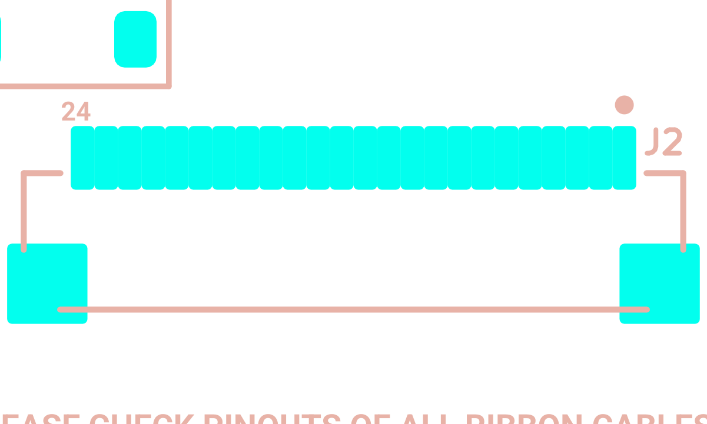

# ERC/DRC triage, fab capability check and manufacturing-output consistency

*Final review 2026-09-19 — reviewer key `rules`, finding prefix `FAB-`.
Independent of all earlier audits; formed from the evidence pack, the KiCad files (scratch copy) and the fabs' published capability pages.*

## What this part of the board does

Nothing, electrically. This section is about the **rule checks** and the **paperwork**.

Three questions:

1. **Rule checks.** KiCad runs two automatic checkers. **ERC** (Electrical Rule Check) reads the schematic and
   complains about things like a pin that nothing drives, or two labels fighting over one wire. **DRC** (Design
   Rule Check) reads the board and complains about copper that is too close together, holes that are too small,
   silkscreen printed over a pad, and so on. Both produce a pile of warnings, most of which are noise. The job
   here is to separate the noise from the handful that will actually cost money.
2. **Fab capability.** Every PCB factory publishes a list of the smallest features it can make: thinnest track,
   narrowest gap, smallest drill, thinnest ring of copper around a hole, smallest readable lettering. If the
   board asks for something smaller, the order gets held for a "DFM query", gets an upcharge, or gets made badly.
   This section measures what the board *actually* asks for and compares it to **JLCPCB**, **NextPCB** and
   **PCBWay**'s published 2-layer numbers.
3. **Manufacturing outputs.** The factory never sees the KiCad files. It sees a **gerber** set (the copper
   artwork), a **BOM** (bill of materials: which part goes in which position), and a **centroid** or
   **pick-and-place** file (where each part sits and which way round it points). If any of those three disagrees
   with the actual board, parts land in the wrong place, backwards, or not at all. This section diffs every file
   in `production/`, `placement/` and `fabrication/` against the schematic and board.

Jargon used below, defined once:

| Term | Meaning |
|---|---|
| **PTH / NPTH** | Plated / non-plated through hole. A plated hole has copper on its inside wall and carries current between layers; a non-plated one is just a hole. |
| **Annular ring** | The width of the copper collar left around a drilled hole: `(pad diameter − drill diameter) / 2`. Too thin and the drill can wander off the pad ("breakout") and the connection is lost. |
| **Via** | A small plated hole used purely to move a track from one side of the board to the other. |
| **Solder-mask dam / bridge** | The sliver of green lacquer left between two neighbouring pads. It is what stops solder from flowing between them. Below roughly 0.1 mm the fab cannot print it reliably and the two openings merge into one. |
| **Thermal relief / spoke** | Where a pad joins a large copper pour, KiCad normally connects it with a few narrow "spokes" instead of solid copper, so the pad can be heated for soldering. |
| **Centroid / rotation convention** | The X/Y of a part's centre and the angle it is rotated. Different factories measure the angle from different zero points, so the numbers usually need translating. |
| **DNP** | Do Not Populate — a part drawn in the schematic and given a footprint on the board, but deliberately left unfitted. |
| **Fiducial** | A small bare-copper dot the pick-and-place machine's camera uses to work out exactly where the board is sitting. |

---

## Circuit walk-through

Not applicable — this section owns no schematic block. The equivalent table is the **rule-check inventory**:
every ERC and DRC item on the board, grouped by type, with a verdict.

### ERC — 39 active items (0 errors, 39 warnings)

`evidence/sch/erc.json`, `kicad-cli sch erc --severity-all`, KiCad 9.0.6.
Re-running with all user exclusions cleared gives 46 (the 7 extra are the Q1 / FS8205A items the owner already
dismissed). No item is an error; the severities that matter (`pin_not_driven`, `power_pin_not_driven`,
`label_dangling`, `wire_dangling`, `unannotated`, `duplicate_reference`) are all configured as **error** and
produced **zero** hits.

| Type | n | Where | Verdict |
|---|---|---|---|
| `pin_to_pin` | 22 | CR1/CR2/CR3 (TSD05CDYFR TVS), U10 (TPS923610), J6 (12-pin header), J1 | **Benign.** Every one is "Unspecified vs Passive/Power/Bidirectional". The third-party symbols declare their pins as *Unspecified* electrical type; KiCad warns on principle. No wiring is wrong. |
| `lib_symbol_mismatch` | 8 | CR1, CR2, CR3, J3, J4, J5, U10, D8 | **Benign but worth knowing.** The symbol cached in the schematic differs from the copy now in the library. Nothing is broken; it means those libraries were edited after the symbols were placed. |
| `footprint_link_issues` | 4 | F1, CR1, CR2, CR3 | **Benign.** The assigned footprint does not match the symbol's footprint *filter* string (e.g. F1 uses a `Fuse_0805…` footprint while the Polyfuse symbol filters for `*polyfuse*`). Cosmetic metadata. |
| `single_global_label` | 2 | `EINK_SW`, `TPS_SW_NODE` | **Benign, verified.** A global label that appears only once is usually a typo that orphans a net. Both nets are real and fully populated: `EINK_SW` has 4 nodes (C11.2, D5.2, L1.1, Q4.3) and `TPS_SW_NODE` has 2 (L2.2, U10.6) — exactly right for a boost switch node. Confirmed in `evidence/sch/connectivity_by_net.txt` lines 167 and 652. |
| `four_way_junction` | 2 | sheet @(429.26, 184.15) and @(519.43, 105.41) mm | **Benign.** Four wires meeting at one dot. Legal, just harder to read. |
| `multiple_net_names` | 1 | `TP_RST` vs `PIN_3` on J4 pin 3 | **Real but harmless** — see FAB-13. |

### DRC — 94 items (12 live errors, 82 warnings; 7 marked excluded by the owner)

`evidence/pcb/drc.json`, `kicad-cli pcb drc --severity-all --schematic-parity --all-track-errors`.
**Unconnected items: 0. Schematic-parity errors: 0.** Those are the two that would be showstoppers, and both are clean.

| Type | n | Severity | Verdict |
|---|---|---|---|
| `silk_edge_clearance` | 32 | warning | **Benign** — see FAB-09 |
| `starved_thermal` | 25 | warning | **Mostly benign, 2 need a look** — see FAB-06 |
| `clearance` | 15 (12 live + 3 excluded) | error | **All inside connector footprints** — see FAB-04, FAB-05 |
| `silk_over_copper` | 12 | warning | **Cosmetic** — see FAB-09 |
| `silk_overlap` | 5 | warning | **Cosmetic** — see FAB-09 |
| `track_dangling` | 4 | warning (all excluded) | **Needs a look** — see FAB-07 |
| `mirrored_text_on_front_layer` | 1 | warning | **Benign** — an *empty* text box on F.Silkscreen. Nothing prints. |

### Rule checks the project has switched OFF

From `evidence/pcb/board_extract.json` → `drc_rule_severities`, nine checks are set to `ignore`:

```
footprint_filters_mismatch   footprint_type_mismatch   lib_footprint_mismatch
missing_courtyard            npth_inside_courtyard     pth_inside_courtyard
solder_mask_bridge           text_height               text_thickness
```

I re-ran DRC on the scratch copy with all nine promoted back to `warning`
(`scratchpad/agents/rules/drc_unignored.json`): **366 violations instead of 94.** What the nine were hiding:

| Ignored check | Hidden count | Is it real? |
|---|---|---|
| `text_height` | 185 | **Yes — FAB-02.** Silkscreen text below the board's own 0.75 mm minimum, and below every fab's 1.0 mm minimum. |
| `solder_mask_bridge` | 32 | **Yes — FAB-03.** No mask dam at all between the 0.5 mm-pitch FPC pads. |
| `text_thickness` | 28 | **Yes, same root cause as FAB-02** (TrueType strokes too thin to print). |
| `lib_footprint_mismatch` | 25 | **No, but see FAB-12.** 25 footprints differ from their library copy. Deliberate local edits. |
| `missing_courtyard` | 4 | **No.** All four are the `G***` logo graphics. Logos need no courtyard. |
| `footprint_filters_mismatch` | (5, reported as parity) | **No.** Same metadata noise as the ERC `footprint_link_issues`: CR1, CR2, CR3, F1, Q1. |
| `footprint_type_mismatch` | 0 | Nothing hidden. |
| `pth_inside_courtyard` | 0 | Nothing hidden. |
| `npth_inside_courtyard` | 0 | Nothing hidden. |

`courtyards_overlap` is **not** in the ignore list and reported **zero** hits — so the KiCAD-MCP server's
"415 courtyard overlaps / 22 boundary violations" in `evidence/mcp/mcp_static_checks.txt` is bounding-box noise,
exactly as the evidence README warns. KiCad's own polygon-accurate courtyard check is authoritative and it is clean.

### KiCAD-MCP schematic static checks

| Check | Result | Verdict |
|---|---|---|
| `list_floating_labels` | "No floating labels found." | Clean |
| `find_orphaned_wires` | "No orphaned wires found." | Clean |
| `find_wires_crossing_symbols` | 2 wires cross D2 (`Device:LED`) at y=83.82 mm | Cosmetic; the net list is unaffected (ERC found no `pin_to_pin` or dangling issue there) |
| `find_overlapping_elements` | 34 symbol overlaps, almost all `#PWRnn` power flags sitting on top of a part | Cosmetic drafting noise |
| `check_courtyard_overlaps` | 415 | Bounding-box artefact — superseded by KiCad DRC's 0 |
| `check_placement_clearance` | 311 (293 of them *text* overlaps) | Bounding-box artefact; the 293 text overlaps overlap with the real FAB-09 silk findings |

---

## Where it is on the board & layout notes

Board: 2 copper layers, 1.6 mm FR-4, outline bounding box **(44.212, 36.975) to (104.262, 148.275) mm**,
i.e. **60.05 x 111.30 mm**. 183 footprints, **175 of them on the bottom side, 0 fitted parts on the top side**
(the 8 top-side items are the 4 `G***` logos, 2 test-point pads and the mounting-hole top pads).

Everything worth looking at in this section clusters in three places:

* **J1, the USB-C receptacle @ (96.8, 104.0)** — the source of all 12 live DRC clearance errors and of the
  tightest holes on the board.
* **J2 / J3 / J4, the 0.5 mm-pitch FPC connectors @ (73.9, 125.6) / (54.2, 124.6) / (…)** — the source of the
  hidden mask-bridge items.
* **The button row along the bottom edge, y ≈ 145–146 mm** — the four excluded dangling top-layer tracks and
  two of the starved thermals.

---

## Calculations

### Actual minimum features on this board

Measured with `scratchpad/agents/rules/fab_minimums.py` directly from `silkscreen_pcb.kicad_pcb` via `pcbnew`
(log: `scratchpad/agents/rules/fab_minimums.log`).

**Track width** (segment count by width):

```
0.20 mm : 1202      0.25 mm : 330      0.40 mm : 116      0.50 mm : 3      0.80 mm : 28
```

→ **minimum track = 0.200 mm**.

**Vias** — all 188 vias on the board are identical:

```
diameter 0.600 mm / drill 0.300 mm   =>  annular ring = (0.600 - 0.300) / 2 = 0.150 mm
```

**Drilled holes** (dx, dy, plating) : count [refs]

```
(0.20, 0.20, PTH)  18   U11, U4          <- thermal vias inside the footprints
(0.40, 0.40, PTH)  16   J1               <- USB-C signal pins
(0.60, 1.40, PTH)   2   J1  (slot)       <- USB-C shell
(0.60, 2.10, PTH)   2   J1  (slot)       <- USB-C shell
(0.75, 0.75, PTH)   2   J5               <- JST PH battery
(1.00, 1.00, PTH)  23   SW1..SW11, TP3-5
(1.016,1.016,PTH)  12   J6               <- 2x6 0.1" dev header
(1.30, 1.30, PTH)  22   SW1..SW11
(2.20, 2.20, PTH)   5   H1..H5           <- M2 mounting holes
(1.05, 1.50, NPTH)  1   J7  (slot)       <- microSD shell
(2.25, 1.50, NPTH)  1   J7  (slot)       <- microSD shell
```

→ **min PTH drill 0.200 mm**, **min plated slot width 0.600 mm**, **min non-plated slot width 1.050 mm**.

**Smallest annular rings** `(pad − drill)/2`:

```
0.150 mm   J1  pad S1   0.9 x 2.4 pad, 0.6 x 2.1 drill
0.150 mm   J1  pad A1   0.7 x 0.7 pad, 0.4 x 0.4 drill     (and the other 15 USB-C signal pins)
0.150 mm   J1  pad S1   0.9 x 1.7 pad, 0.6 x 1.4 drill
0.150 mm   U11 pad 9    0.5 x 0.5 pad, 0.2 x 0.2 drill     (thermal via in the ESOP-8 pad)
0.150 mm   every via    0.6 dia, 0.3 drill
0.200 mm   U4  pad 41   0.6 x 0.6 pad, 0.2 x 0.2 drill
0.200 mm   H1..H5       2.6 x 2.6 pad, 2.2 x 2.2 drill
0.225 mm   J5  pad 1    1.2 x 1.75 pad, 0.75 drill
0.250 mm   SW1..SW11    1.5 x 1.5 pad, 1.0 drill
```

→ **minimum annular ring on the board = 0.150 mm.**

**Hole-to-hole** (wall to wall, not centre to centre):

```
0.450 mm   J1  <-> J1    x14   (different nets)
0.450 mm   via <-> via   x2
0.550 mm   via <-> via   x1
0.560 mm   via <-> via   x1
```

→ **minimum pad-hole-to-pad-hole = 0.450 mm** (all inside J1); **minimum via-to-via = 0.450 mm**.

**Copper to board edge**: board-setup constraint 0.475 mm; `copper_edge_clearance` DRC produced **zero** hits.

**Silkscreen** (height / width / stroke, count):

```
B.Silkscreen  0.5 / 0.5 / 0.100   x174     <- essentially every reference designator
B.Silkscreen  0.4 / 0.4 / 0.100   x4
B.Silkscreen  0.3 / 0.3 / 0.060   x1
B.Silkscreen  1.0 and 1.5          x3
F.Silkscreen  0.9 .. 1.5           x39
Silk graphic line widths: 0.0 x117, 0.10 x47, 0.12 x456, 0.127 x15, 0.152 x7, 0.20 x74, 0.508 x2
```

→ **186 texts are below 0.8 mm high or below 0.12 mm stroke**; the dominant case is **0.50 mm high with a
0.100 mm stroke**.

**Solder-mask dams between neighbouring pads** (copper gap, mask expansion each side, resulting mask web):

```
J2  FH34SRJ-24S-0.5SH   pads 1-2: gap 0.200, exp 0.102+0.102 -> web -0.004 mm   (pad 0.30 x 1.15)
J3  FH34SRJ-6S-0.5SH    pads 1-2: gap 0.200, exp 0.102+0.102 -> web -0.004 mm
J4  FH34SRJ-6S-0.5SH    pads 1-2: gap 0.200, exp 0.102+0.102 -> web -0.004 mm
U11 SOIC-8-1EP          pad-to-EP: gap 0.190, exp 0+0        -> web  0.190 mm
U2  SOT-583-8           pads 1-2: gap 0.200, exp 0+0         -> web  0.200 mm
U3  SOT-23-5_HS         pads 1-2: gap 0.300                  -> web  0.300 mm
Q1  SOT-23-6_HS         pads 1-2: gap 0.300                  -> web  0.300 mm
U10 SOT-563 (DRL0006A)  pads 1-2: gap 0.271                  -> web  0.271 mm
J7  microSD             pads 1-2: gap 0.400                  -> web  0.400 mm
U4  ESP32-S3-WROOM-1    pads 32-33: gap 0.370                -> web  0.370 mm
J1  USB-C               pads A1-A4: gap 0.150                -> web  0.150 mm
```

Board-level mask expansion is 0.000 mm and mask minimum width is 0.000 mm, so **only the three Hirose FPC
footprints carry their own +0.102 mm expansion**, and that is what wipes out their dams:
`0.200 − 2 × 0.102 = −0.004 mm`.

### Comparison against published 2-layer capabilities

Green = the board has margin. **Bold** = the board asks for something the fab does not promise.

| Feature | **This board** | JLCPCB 2-layer | NextPCB 2-layer | PCBWay 2-layer | Verdict |
|---|---|---|---|---|---|
| Min track width | 0.200 mm | 0.10 mm | 0.08 mm (3 mil) | 0.10 mm | 2x margin everywhere |
| Min clearance (rule) | 0.150 mm | 0.10 mm | 0.08 mm | 0.10 mm | OK |
| Min via drill / dia | 0.300 / 0.600 mm | 0.15 / 0.25 mm; preferred min hole 0.20 mm; holes 0.20–0.25 mm with via dia <0.45 mm **cost more** | drill range 0.15–6.5 mm | drill 0.15–6.0 mm | **No upcharge** — 0.3/0.6 is JLC's own default via |
| Via annular ring | 0.150 mm | see below | 0.09 mm (3.5 mil) | 0.15 mm | OK at NextPCB/PCBWay |
| Min PTH drill (component) | 0.200 mm (U4, U11 in-pad thermal vias) | 0.15 mm | ≥0.20 mm | 0.15 mm, but *"0.2 mm: maximum board thickness 1.6 mm"* | **Exactly at PCBWay's aspect-ratio limit** (1.6 / 0.2 = 8:1) |
| Component PTH annular ring | **0.150 mm** (J1 x16 pins + 2 shell slots, U11 pad 9) | 1 oz 2-layer: recommended ≥0.25 mm, **absolute minimum 0.18 mm** | 0.09 mm | 0.15 mm | **Below JLC's absolute minimum** — FAB-01 |
| Min plated slot width | 0.600 mm (J1 shell) | 0.50 mm | 0.50 mm | 0.50 mm | OK |
| Min non-plated slot width | 1.050 mm (J7 shell) | 1.00 mm | 0.50 mm | 0.80 mm | OK — but only 0.05 mm of margin at JLC |
| Pad hole-to-hole (wall to wall) | 0.450 mm (inside J1) | **0.45 mm** | ≥0.30 mm (different nets) | not published | **Exactly at JLC's limit** — FAB-01 |
| Via hole-to-hole | 0.450 mm | 0.20 mm | 0.30 mm | not published | Comfortable |
| Copper to routed edge | 0.475 mm | ≥0.20 mm | ≥0.20 mm | not published | Comfortable |
| Solder-mask bridge | **−0.004 mm at J2 / J3 / J4** | **0.10 mm** (green), 0.13 mm (black/white) | **0.089 mm** (3.5 mil, green) | not published | **Fails at both** — FAB-03 |
| Silk min text height | **0.40–0.50 mm** | **1.00 mm** (40 mil) — *"characters below this unidentifiable"* | **0.76 mm** (30 mil) | **0.80 mm** | **Fails at all three** — FAB-02 |
| Silk min line width | **0.060–0.100 mm** | **≥0.15 mm** | **≥0.12 mm** (5 mil) | **0.15 mm** | **Fails at all three** — FAB-02 |
| Pad-to-silkscreen | violated in 12 places | 0.15 mm | — | — | Cosmetic — FAB-09 |
| Board thickness | 1.6 mm | 0.4–4.5 mm, ±10% | 1.6 mm stock, ±10% | 1.6 mm stock, ±10% | Standard stock at all three |
| Board size | 60.05 x 111.30 mm | inside all limits | inside all limits | inside all limits | OK |

Sources: JLCPCB <https://jlcpcb.com/capabilities/pcb-capabilities>, NextPCB
<https://www.nextpcb.com/pcb-capabilities>, PCBWay <https://www.pcbway.com/capabilities.html>, all fetched
2026-09-19/20.

**Short version:** copper geometry is comfortable at every fab. Three things are outside the published
envelope — the **0.15 mm annular ring** (JLC only), the **missing solder-mask dams on the FPC connectors**
(JLC and NextPCB), and the **silkscreen lettering** (all three).

### Arithmetic behind the mask-dam number

```
FPC pad width            0.300 mm
FPC pitch                0.500 mm
copper gap               0.500 - 0.300                = 0.200 mm
local mask expansion     +0.102 mm per pad, both pads
remaining mask web       0.200 - (0.102 + 0.102)      = -0.004 mm      -> no dam at all
```

Setting the local expansion on J2/J3/J4 to 0.000 mm gives `0.200 - 0 = 0.200 mm` of dam, which is 2x JLC's
0.10 mm minimum and 2.2x NextPCB's 0.089 mm.



*J2's solder-mask layer. The 24 openings (cyan) run together into one continuous slot — there is no green web
between neighbouring pins. Compare the two large shell pads, which are separate.*


*The bottom edge, x 44–105 mm / y 138–149 mm (both-copper X-ray). The four excluded dangling top-layer stubs
of FAB-07 sit in this strip, around the SW2 / SW3 / SW8 / SW9 button holes.*

---

## Findings

| ID | Severity | Finding | Evidence | Recommendation |
|---|---|---|---|---|
| FAB-01 | MEDIUM | Smallest annular ring on the board is 0.150 mm — below JLCPCB's stated absolute minimum of 0.18 mm; J1's pad hole-to-hole is exactly at JLC's 0.45 mm limit | `fab_minimums.log`; J1 pads A1–B12 (0.70 mm pad / 0.40 mm drill), J1 shell S1 (0.90/0.60), U11 pad 9 (0.50/0.20); JLC capabilities page | Accept knowingly for a PCBWay or NextPCB order (0.15 mm meets PCBWay exactly, NextPCB wants only 0.09 mm). For JLCPCB, expect a DFM query on J1 and be ready to approve as-is | High on the numbers, medium on JLC's practical enforcement |
| FAB-02 | MEDIUM | Silkscreen lettering is roughly half the minimum legible size at every fab, and the two DRC checks that would have caught it are switched off | 174 texts at 0.50 mm height / 0.100 mm stroke, 4 at 0.40, 1 at 0.30/0.060; `text_height` + `text_thickness` set to `ignore`, hiding 185 + 28 items (`drc_unignored.json`); JLC 1.0/0.15, NextPCB 0.76/0.12, PCBWay 0.8/0.15 | Raise reference designators to ≥0.8 mm height / ≥0.15 mm stroke, or accept that the printed legend is decorative and rely on `assembly_drawing_bottom.pdf` + InteractiveHtmlBom for rework. Either way re-enable the two checks | High |
| FAB-03 | MEDIUM | No solder-mask dam at all between the 0.5 mm-pitch FPC pads of J2, J3 and J4; the `solder_mask_bridge` check is switched off, hiding 32 items | `0.200 − 2 × 0.102 = −0.004 mm` web (`fab_minimums.log`); 32 hidden `solder_mask_bridge` items; image `rules_j2_fpc_maskdam.png` shows the merged openings; JLC 0.10 mm, NextPCB 0.089 mm | Set the local solder-mask expansion on J2/J3/J4 to 0.000 mm — that restores a 0.200 mm dam — then re-enable `solder_mask_bridge` and re-run DRC | High |
| FAB-14 | MEDIUM | The repo's centroid files use two opposite bottom-side rotation conventions and nothing in the files says which is which; 175 of 183 footprints are on the bottom | Measured over all 162 placed parts: Toolkit `positions.csv` = `(180 − KiCad_rot + correction) mod 360`; NextPCB/PCBWay files = `KiCad_rot mod 360`, 0° difference from raw `kicad-cli pcb export pos` for all 162. For a part at 0° the two files say 180° and 0° | Put one line at the top of each centroid file stating the convention, and require the assembler to confirm against `assembly_drawing_bottom.pdf` and the online placement preview before the run | High that they differ; **low** on which one NextPCB/PCBWay actually want |
| FAB-21 | MEDIUM | The JLC rotation-correction database does not cover four of the orientation-critical packages on this board, so they ship with an uncorrected angle | `transformations.csv` has no regex matching `SOT-583-8` (U2, TPS2116), `U_DRL0006A_6L_TEX-M` (U10, SOT-563), `SOT-323_SC-70` (D8), or any of `D_SOD-123` / `D_SOD-323` / `D_SMA` / `D_SMF` / `LED_1206` | Before confirming a JLC order, open "confirm parts placement" and check pin 1 of U2, U10, U11, U13, D8, D2, D3, CR1, CR2, CR3 and D4–D6 against the datasheets. Free, and catches every rotation error at once | High that the gap exists; medium that any given part is actually wrong |
| FAB-06 | MEDIUM | 25 starved thermal reliefs; two of them connect only to an **isolated** island of the ground pour | `drc.json`: 23 x "zone min spoke count 2; actual 1" (incl. U11 pad 1, J7 pads 6 and 9, U2 pad 1, U3 pad 2, J2 pad 17, J6 pad 4); plus SW4 pad 1 on F.Cu and SW9 pad 1 on B.Cu "connected to isolated island". `unconnected_items: 0`, so no net is broken | Add a stitching via beside U11 pad 1, J7 pads 6/9, U2 pad 1 and the two buttons, or set those pads to solid zone connection | High |
| FAB-10 | MEDIUM | `bom_JLC_upload_v3.csv` is offered to the user as a live alternative but still carries the duplicate-part-number defect that v4 was created to fix | The root README lists v3 as the "brand-conservative (28 Extended types)" option next to v4. But `NEXTPCB_REV0_NOTES.md` §2 records that duplicate LCSC lines made JLC leave C24, C31 and C20 unmatched, and says "`bom_JLC_upload_v3.csv` still has the same duplicates" — confirmed: v3 lists C14663 on two lines and C28323 on two lines. The two files also differ in 19 part numbers (C9/C11/C13–C17, D3–D6, CR2/CR3, U13, F1, Q2/Q3/Q7/Q8) | Either fix v3's duplicate lines the same way v4 was fixed, or retire it. A documented alternative that is known to mis-match three capacitors is worse than no alternative | High |
| FAB-22 | MEDIUM | `production/bom.csv` — the file the README names first for the JLC upload — still splits two LCSC codes across two lines each, which is exactly the fault that left parts unmatched at JLC before | `bom.csv` lists C14663 on two lines (`C24, C31` as "100n" and `C30, C33, C36, C7` as "0.1u") and C28323 on two lines (`C18, C19` as "1u" and `C20` as "1u/50V"). The Toolkit groups by Value+footprint+LCSC, so the same part written two ways splits. `pcbway_bom.csv` and `nextpcb_bom.csv` split the same two parts by MPN. Only `v4_optimized.csv` merges them | Make the Value strings consistent in the schematic (C24/C31 → "0.1u", C20 → "1u") so every generated BOM merges them automatically, or upload v4 | High |
| FAB-23 | MEDIUM | Four interior routed slots are **0.516 mm** wide — below JLCPCB's and PCBWay's minimum non-plated slot width, and only 3 % above NextPCB's | **Corrected by verification.** Polygon *vertex* geometry read straight from `silkscreen_pcb.kicad_pcb`: four `Edge.Cuts` polygons at y 61.59–62.12 mm, x 86.62–101.12 mm, each **0.5159 mm** across and 1.325 / 1.825 / 1.825 / 2.525 mm long. The original 0.716 / 1.525 / 2.025 / 2.725 figures came from a *bounding box*, which adds the 0.2 mm `Edge.Cuts` stroke width (0.1 mm each side); the fab cuts the line centreline, so the vertex geometry is the slot. JLC min non-plated slot 1.00 mm, PCBWay 0.80 mm, NextPCB 0.50 mm. (The fifth polygon is **47.039 x 1.300 mm**, not 47.24 x 1.500 — still fine everywhere.) | Widen the four slots to ≥1.0 mm if the snap-off feature must survive a JLC order; otherwise expect them to be ignored, silently widened, or raised as a DFM query. NextPCB accepts them but with only 0.016 mm of margin | High on the measurement (re-derived twice, two different methods) |
| FAB-16 | MEDIUM | No fiducials anywhere on the board, on either side | Searched all 183 footprints in `board_extract.json` for a fiducial footprint or a `FID*` reference: none. The board carries three 0.5 mm-pitch FPC connectors plus SOT-563 and SOT-583 parts | Add two or three 1 mm copper / 2 mm mask-opening fiducials on B.Cu, diagonally opposite, in the clear space near H1/H3 — or explicitly order breakaway rails with fiducials | High |
| FAB-15 | LOW | `production/positions.csv` and the NextPCB/PCBWay centroids disagree about where the 13 through-hole parts are, by up to 6.5 mm | The Toolkit uses the **pad bounding-box centre for through-hole footprints and the footprint anchor for SMD footprints** — a clean rule, verified on all 162 parts. Deltas vs the board anchor: J6 6.476, J1 3.841, SW1–SW11 2.847, J5 1.000 mm. The SMD parts with large anchor offsets (J4 0.730, J7 5.961, U4 3.620 mm) correctly keep the anchor. The NextPCB/PCBWay files use the anchor for everything, i.e. pin 1 for these parts. No `FT Origin` / `FT Rotation Offset` / `FT Position Offset` field exists on any footprint (grep of the board: 0 hits), so this is the plugin's default behaviour | Neither file is wrong — they answer different questions, and `NEXTPCB_REV0_NOTES.md` §3 records that NextPCB's tool wants pin 1 at the centroid, which is what it gets. Just do not mix a JLC CPL with a NextPCB BOM. No change needed | High |
| FAB-04 | LOW | 12 live DRC clearance **errors**, all of them inside J1's own footprint | `drc.json`: pad-to-pad 0.150 mm vs the `Power` netclass's 0.200 mm, on J1 pads A1/A4/A5/A8/A9/A12 and B1/B4/B5/B8/B9/B12. This is the GCT USB4085 land pattern's own geometry; 0.15 mm is ample for 5 V | Exclude them individually or add a custom rule scoped to J1, so the DRC report reaches zero errors and a genuinely new error cannot hide in the pile | High |
| FAB-05 | LOW | 3 excluded clearance errors on J3 come from the `SW` netclass imposing 0.250 mm on a connector whose pads are inherently 0.200 mm apart | `drc.json` (excluded): J3 pads 1–2, 4–5, 5–6. The netclass pattern `SW → LED_SW` puts the frontlight boost switching node on J3 pins 1 and 5, next to C- (pin 2) and W- (pin 6) | Keep the exclusions, but prefer a netclass exception scoped to connector pads over a blanket per-item exclusion. Flagged to the frontlight reviewer as a signal-integrity question, not a fab one | High |
| FAB-07 | LOW | Four dangling top-layer track stubs at the bottom button row | `drc.json` (all excluded): `Net-(R18-Pad1)` 1.71 mm @(75.711, 145.511), `Net-(R19-Pad1)` 1.19 mm @(62.711, 144.989), `Net-(R20-Pad1)` 1.50 mm @(50.700, 145.500), `Net-(R60-Pad1)` 1.21 mm @(87.711, 145.111). Each ends 1.8–2.2 mm short of the nearest SW2/SW3/SW8/SW9 pad; `unconnected_items: 0` so no net is broken | Delete the four stubs and clear the exclusions, unless they are a deliberate alternate-footprint option | High |
| FAB-08 | LOW | One empty, mirrored text box on the front silkscreen | `drc.json`: `mirrored_text_on_front_layer` on `PCB Text Box ''`. Nothing prints | Delete the empty object | High |
| FAB-09 | LOW | 49 silkscreen DRC items: 32 clipped by the board edge, 12 printed over exposed copper, 5 overlapping each other | `drc.json`. Worst cases: both F.Silkscreen instruction text boxes (dev-header pinout legend and supporters list) are clipped by the edge *and* by solder mask; the reference designators of R8, R27, R77 and R78 print onto their own pads; R77 overlaps C21; SW1–SW11, U4, J1, J6 and J7 silk runs off the board edge | Nudge the four reference designators off their pads and pull the two F.Silkscreen text boxes inside the outline. The rest is cosmetic | High |
| FAB-11 | LOW | `production/bom.csv` contains a BOM line with no part number | Line 57: `"TP1, TP2",TestPoint_Pad_1.0x1.0mm,2,TestPoint,` — empty LCSC field. TP1/TP2 are bare copper test pads flagged `exclude_from_pos` in the schematic but **not** `exclude_from_bom`, so the Toolkit emitted them. 164 refs in `bom.csv` vs 162 fitted parts, and the two extras are exactly TP1 and TP2 | Tick "Exclude from bill of materials" on TP1 and TP2 in the schematic and re-export | High |
| FAB-17 | LOW | Both hand-made JLC BOMs list the 10 DNP parts as rows with an empty JLCPCB part number | `bom_JLC_upload_v3.csv` and `v4_optimized.csv` lines 64–73: `0  DNP (standard build)` etc. for R43, R45, R58, R66, R72, R74, SW6, TP3, TP4, TP5. JLC's uploader will show 10 unmatched lines to be marked by hand. The Toolkit's own `bom.csv` handles this correctly via `"EXCLUDE DNP": true`. Also inconsistent: TP3/TP4/TP5's Footprint cell holds a full library path while every other row holds a bare package name | Either drop the DNP rows or keep them and budget for the manual step; make the footprint column consistent | High |
| FAB-12 | LOW | 25 footprints differ from their library copy, and the check that reports this is switched off | `lib_footprint_mismatch` (ignored) hides 25 items: J1–J6, U4, U11, C32, Q1, SW1–SW11, SW6, H1–H4. These look like deliberate local edits (hand-solder pad growth, added in-pad thermal vias) | No change needed for this spin. Write it down so nobody runs "Update Footprints from Library" before ordering — it would silently revert the edits | High |
| FAB-13 | LOW | One wire carries two names | ERC `multiple_net_names`: J4 pin 3 has both a local label `PIN_3` and the global `TP_RST`; KiCad picks `TP_RST`. The net (J4.3, U4.19/IO11, U7.3) is correct | Delete the redundant `PIN_3` label | High |
| FAB-18 | LOW | `placement/silkscreen_pcb-top-pos.csv` is a header-only file with zero rows, and the whole `placement/` folder is untracked in git | `wc -l` = 1 line (header only); `git status` shows `placement/` as untracked. Correct that nothing is fitted on top, but an empty position file invites a fab query and untracked ordering files are not reproducible | Delete the top-side file or add a `# no top-side parts` note; decide whether `placement/` belongs in git or in `.gitignore` | High |
| FAB-19 | LOW | PCBWay's BOM and PCBWay's placement file do not cover the same parts | `pcbway_bom.csv` has 162 lines including 13 through-hole parts; `placement_bottom_kicad.csv` has 149 SMD rows. `make_fab_files.py`'s docstring says this is deliberate (THT documented by `assembly_drawing_bottom.pdf`), and NextPCB gets matched pairs because "NextPCB rejects a PnP file whose designators differ from the BOM's" | Say it explicitly in the PCBWay order notes so the quote does not stall on a missing-placement query | High |
| FAB-V01 | LOW | 18 unfilled via-in-pad holes sit inside the exposed thermal pads of U4 and U11, and no ordering document asks for them to be plugged | *Added by verification.* Read from `silkscreen_pcb.kicad_pcb`: U4 pad 41 is 12 × `thru_hole` 0.6 mm pad / 0.200 mm drill on layers `*.Cu B.Mask`; U11 pad 9 is 6 × 0.5 mm pad / 0.200 mm drill on layers `*.Cu` only. Both have **no `F.Mask` aperture**, so they are mask-tented on the far side — solder cannot run out the top. But the barrels open directly into the exposed-pad solder joint on B.Cu, so reflow paste can wick into 18 holes and starve the thermal joint. Nothing in `fabrication-toolkit-options.json` or the ordering docs requests epoxy-filled/capped vias (a paid option at all three fabs) | Accept for a prototype — the far-side tenting is the usual mitigation and both parts (ESP32-S3 module, TP4056 charger) tolerate an imperfect EP joint at these currents. Add a line to the order notes recording the decision, and inspect U11's EP with the X-ray/AOI images if the fab supplies them | High on the geometry; medium on how much solder is actually lost |
| FAB-20 | LOW | The board's own minimum-track-width constraint is set to 0.000 mm, so KiCad never checks track width | `board_extract.json` → `min_track_mm: 0.0`. Actual minimum on the board is 0.200 mm, so nothing is wrong today — but a stray hair-thin track would never be reported | Set minimum track width to 0.15 mm in Board Setup so the check does something | High |

### The ones that need a paragraph

**FAB-01 — the 0.15 mm annular ring.** An annular ring is the collar of copper left around a drilled hole. Drills
wander a little, so if the collar is thinner than the wander, the drill can break out of the pad and the
connection is lost. The thinnest collar on this board is 0.150 mm and it appears in three places: all sixteen
USB-C signal pins of J1 (0.70 mm pad, 0.40 mm drill), both USB-C shell slots (0.90 mm pad, 0.60 mm slot), and the
thermal via inside U11's exposed pad (0.50 mm pad, 0.20 mm drill). Every via on the board is also 0.150 mm, but
that is a 0.6 mm / 0.3 mm via, which is JLCPCB's own house default and is not at issue. The issue is the
component holes. **PCBWay publishes 0.15 mm as its minimum, so the board exactly meets it. NextPCB publishes
0.09 mm, so there is 60 % of margin. JLCPCB publishes "recommended 0.25 mm or above; absolute minimum 0.18 mm"
for 1 oz 2-layer — the board is 17 % under that.** Separately, J1's holes are 0.450 mm apart wall-to-wall in
fourteen places, and JLC's published pad hole-to-hole minimum is exactly 0.45 mm. Neither number can be improved
without redrawing the connector footprint: growing the pads to reach a 0.18 mm ring would shrink the pad-to-pad
copper gap from 0.15 mm to 0.09 mm, trading one marginal number for a worse one. The honest answer is to accept
it, and to prefer PCBWay or NextPCB for the bare board if a clean DFM pass matters.

**FAB-02 — the silkscreen is too small to print.** 174 of the board's texts — essentially every reference
designator — are 0.50 mm tall with a 0.100 mm stroke. JLCPCB's minimum is 1.00 mm tall with a 0.15 mm line and
their page says characters below that are "unidentifiable". NextPCB wants 0.76 mm / 0.12 mm; PCBWay wants
0.80 mm / 0.15 mm. The board is under all three on both numbers, by about a factor of two. What actually happens
is that the fab prints them anyway and they come out as smudges, or the DFM step drops them. On a board where
**162 parts are crammed onto one side**, losing the reference designators makes hand rework and fault-finding
substantially harder. The reason this was never noticed is that the `text_height` and `text_thickness` DRC checks
are both set to `ignore` in the project; re-enabling them produces 185 and 28 hits respectively. There is a real
trade-off here — enlarging 174 designators on a board this dense will create new silk-over-pad problems — so the
legitimate alternatives are (a) enlarge them and accept some overlap, or (b) leave them and treat the assembly
drawing and an InteractiveHtmlBom as the real reference. What is *not* reasonable is leaving the checks off and
assuming the legend is fine.

**FAB-03 — the FPC connectors have no solder-mask dams.** J2 (24-pin), J3 and J4 (6-pin each) are Hirose
FH34SRJ 0.5 mm-pitch flex connectors. Their pads are 0.30 mm wide on a 0.50 mm pitch, so there is 0.200 mm of
bare laminate between neighbours — plenty for a mask dam. But the Hirose-derived footprints carry a local
solder-mask expansion of +0.102 mm on every pad, which eats 0.204 mm of that 0.200 mm gap and leaves −0.004 mm.
The result, visible in the image above, is that all 24 of J2's mask openings merge into one continuous slot with
no green between the pins. Because the *paste* stencil is still pad-defined, machine reflow will usually still
come out right; the cost is borne during hand soldering and rework of the display connector, where there is
nothing to stop solder wicking from pin to pin, and in service, where the mask is no longer protecting a 24-pin
display bus from debris. The fix is one field: set J2/J3/J4's local mask expansion to 0.000 mm, which restores
the full 0.200 mm dam — twice JLC's minimum. The board-level mask expansion is already 0.000 mm, so only these
three footprints need touching. Note the `solder_mask_bridge` DRC check is currently ignored, which is why this
never surfaced.

**FAB-14 — two rotation conventions in one repo.** Every centroid file says where a part sits and which way it
points. The angle is easy; the hard part is what "which way" means for a part on the **bottom** of the board,
because you can measure the angle looking down through the board or looking up at it, and those differ by a
mirror. I measured both families against the board:

```
Fabrication Toolkit  production/positions.csv          rot = (180 - KiCad_rot + correction) mod 360
NextPCB / PCBWay     nextpcb_centroid.csv, split/*,    rot =  KiCad_rot mod 360
                     placement_bottom_kicad.csv
```

The Toolkit formula was confirmed by hand on twenty parts spanning corrections of 0°, 180° and 270° (C1, C2, R1,
R56, U4, U2, U10, U11, U13, Q2, U3, J5, J7, J1, SW1, SW2, D3, D4, J2, L1, D2) and fits all 162. The
NextPCB/PCBWay files differ from a raw `kicad-cli pcb export pos` by **exactly 0° on all 162 parts** — no mirror,
no correction, nothing. For a part sitting at 0° in KiCad, one file says 180° and the other says 0°. With **175
of 183 footprints on the bottom side**, if NextPCB or PCBWay turn out to want the mirrored convention then every
polarised part on the board is reversed.

This is very probably fine: `make_fab_files.py`'s own docstring says the omission is deliberate — *"The
placement file is the raw KiCad export. It is NOT production/positions.csv: the Fabrication Toolkit rewrites
bottom-side rotations and per-part offsets for JLCPCB's library, which other assemblers do not share"* — and the
repo ships `other_fabs/assembly_drawing_bottom.pdf` precisely so the assembler can check. I flag it MEDIUM anyway
because **nothing in the CSV files themselves records which convention they use**, and a 180° whole-board error is
the single most expensive mistake available at this stage. One header comment per file removes the risk.

**FAB-21 — the rotation-correction database has holes.** The Fabrication Toolkit fixes JLC rotations by matching
the footprint *name* against regexes in the plugin's `transformations.csv`. On this board that catches Q1–Q9,
U1, U3, U5–U9 and U12 (`^SOT-23`, +180°), J5 (`^JST_PH_S`, +180°) and U11, U13 (`^SOIC-`, +270°) — 20 parts. It
misses, because no regex matches their footprint names:

* **U2** — `SOT-583-8`. The file has `^SOT-23`, `^SOT-143`, `^SOT-223`, `^SOT-353`, `^SOT-363`, `^SOT-89`; none
  matches `SOT-583`. U2 is the TPS2116 power mux, 8 pins, and it decides whether the board runs from USB or battery.
* **U10** — `U_DRL0006A_6L_TEX-M`. TI's own SOT-563 footprint name begins with `U_`, so no package regex can
  ever match it. U10 is the frontlight LED driver.
* **D8** — `SOT-323_SC-70_Handsoldering`. `^SOT-353` and `^SOT-363` do not match `SOT-323`.
* **All the diodes and the LED** — `D_SOD-123` (D4–D6), `D_SOD-323` (CR2, CR3), `D_SMA` (D3), `D_SMF` (CR1),
  `LED_1206` (D2).

A miss is not automatically an error — the database only lists packages where KiCad's pin-1 convention is known
to differ from LCSC's, and for many of these it does not. But U2 and U10 are exactly the small, hard-to-inspect
packages where a 90° or 180° error is both plausible and fatal. The mitigation costs nothing: JLC's "confirm
parts placement" preview renders every part with its pin 1 marked, and five minutes there settles all of them.

**FAB-06 — starved thermals, and two that touch an island.** Where a pad meets the big ground pour, KiCad
normally joins it with narrow spokes so the pad can still be heated for soldering. This board's ground zone uses
0.5 mm spokes and asks for at least two per pad; 23 pads get only one, which roughly doubles that pad's
resistance and inductance to ground. For 0603 decoupling capacitors that is a shrug. It matters more for **U11
pad 1** (the TP4056 charger's ground, which carries the full 1 A charge current return), **J7 pads 6 and 9**
(microSD ground), **U2 pad 1** (power-mux ground) and **U3 pad 2** (LDO ground). Two entries are different in
kind: SW4 pad 1 on F.Cu and SW9 pad 1 on B.Cu are reported as *"connected to isolated island"*, meaning the only
pour that pad touches is a fragment the zone does not itself connect onward. Connectivity is still complete
(`unconnected_items: 0`), so those buttons work — the ground return just runs through a track rather than the
pour. A stitching via beside each of the named pads fixes the whole class.

---

## Checked and found OK

Everything in this list was actively verified, not assumed.

**Rule checks**

1. **Zero unconnected items** and **zero schematic-parity errors** in DRC — the two results that would have been
   showstoppers. Every net on the board matches the schematic and every ratsnest line is satisfied.
2. **Zero ERC errors.** The severities that matter are all configured as *error* and all produced nothing:
   `pin_not_driven`, `power_pin_not_driven`, `label_dangling`, `wire_dangling`, `unannotated`,
   `duplicate_reference`, `missing_power_pin`, `hier_label_mismatch`.
3. All 22 `pin_to_pin` ERC warnings traced to third-party symbols declaring *Unspecified* pin types (CR1/CR2/CR3,
   U10, J6, J1). No wiring error behind any of them.
4. Both `single_global_label` warnings are false alarms: `EINK_SW` has 4 nodes (C11.2, D5.2, L1.1, Q4.3) and
   `TPS_SW_NODE` has 2 (L2.2, U10.6) — verified in `connectivity_by_net.txt` lines 167 and 652.
5. `courtyards_overlap` is **enabled** and reports **zero**. The KiCAD-MCP server's "415 courtyard overlaps /
   22 boundary violations" is bounding-box arithmetic and is superseded by KiCad's polygon-accurate check.
   (`board_extract.json`'s `courtyard_wh` field reads `[0,0]` for every footprint — that is an extraction bug in
   the evidence script, not missing courtyards: `missing_courtyard` finds only the 4 logos.)
6. MCP schematic checks clean: **no floating labels, no orphaned wires.** The 2 "wires crossing D2" and 34
   "overlapping symbols" (mostly `#PWRnn` flags sitting on parts) are drafting cosmetics.
7. Of the nine ignored DRC checks, five were hiding nothing at all (`footprint_type_mismatch`,
   `pth_inside_courtyard`, `npth_inside_courtyard` → 0 items; `missing_courtyard` → only the 4 logos;
   `footprint_filters_mismatch` → the same 5 metadata items ERC already reports).

**Fab capability**

8. **Copper-to-edge**: 0.475 mm constraint, zero `copper_edge_clearance` violations. All three fabs want ≥0.2 mm.
9. **Minimum track 0.200 mm** and **minimum clearance 0.150 mm** — 2x margin at JLC and PCBWay (0.10 mm), nearly
   3x at NextPCB (0.08 mm).
10. **Vias**: one single geometry across all 188 — 0.600 mm diameter / 0.300 mm drill. This is JLCPCB's own
    default and sits clear of their small-hole surcharge, which starts below a 0.20 mm hole or a 0.45 mm via
    diameter.
11. **Slots**: plated 0.600 mm ≥ 0.50 mm at all three; non-plated 1.050 mm ≥ JLC 1.00, PCBWay 0.80, NextPCB 0.50.
12. **Via-to-via hole spacing** 0.450 mm against JLC's 0.20 mm — a factor of two in hand.
13. **Board 60.05 x 111.30 x 1.6 mm** — standard stock thickness and well inside every size limit.
14. **No pad and no copper anywhere outside the board outline.** I checked every pad of all 183 footprints
    against the outline bounding box. The apparent "overhangs" of U4, J1, J6 and SW1–SW10 in the footprint
    bounding boxes are silkscreen and fab-layer drawings only.
15. **The gerber zip is current.** `evidence/gerber_fresh/COMPARISON.txt` shows a fresh export matches
    `production/Silkscreen_Reader_PCB_1.0.zip` layer for layer (silk identical once `--subtract-soldermask` is
    used; drill files identical in tools and hits, differing only in G85-vs-routed slot syntax). No stale-artwork
    risk. Not re-verified here, cited as instructed.

**Assembly readiness**

16. **Bottom-side-only assembly.** Zero fitted parts on the top side: the 8 top-side entries are 4 `G***` logos,
    H5's top mounting pad and the three DNP test points TP3–TP5. That means one reflow pass and the cheapest
    assembly tier at every fab.
17. **Tooling holes exist** — H1–H5 are 2.2 mm plated M2 holes with 2.6 mm pads (0.200 mm ring), usable for
    panel location even though they are not labelled as tooling holes.
18. **DNP handling in the Toolkit outputs is correct.** `fabrication-toolkit-options.json` sets
    `"EXCLUDE DNP": true`, and `bom.csv` / `positions.csv` correctly omit all 10 DNP refs and H1–H5.

**Manufacturing outputs**

19. **`designators.csv`**: all 180 references present, none missing, none extra (the only repeat is `G***` x4,
    the logos).
20. **`netlist.ipc`**: 769 records, 130 net names, 180 references. Every board reference appears, and every pad on
    the board appears in the IPC netlist — nothing missing in either direction.
21. **NextPCB files are internally consistent**: `nextpcb_bom.csv` and `nextpcb_centroid.csv` both cover exactly
    the 162 fitted parts, and the split pair is 149 SMD + 13 THT on both the BOM and the centroid side. The 13
    THT parts are exactly J1, J5, J6, SW1–SW5 and SW7–SW11.
22. **NextPCB and PCBWay centroids match the board exactly** — every X, Y and rotation equals
    `kicad-cli pcb export pos` for all 162 parts (X = board X, Y = −board Y, rotation = board rotation mod 360).
    Only the Toolkit file deviates, and only for the reasons in FAB-14 and FAB-15.
23. **`pcbway_bom.csv`** covers exactly the 162 fitted parts and carries a `Type` column that correctly marks
    the 13 through-hole parts as THT.
24. **`placement/silkscreen_pcb-bottom-pos.csv`** contains exactly the 162 fitted parts (the 7 DNP refs R43, R45,
    R58, R66, R72, R74, SW6 are correctly dropped) with rotations matching `kicad-cli`.
25. **BOM values and footprints agree with the schematic** everywhere. The only differences are four cosmetic
    re-spellings of the same part with the same LCSC code: C24/C31 written "0.1u" where the schematic says
    "100n", C20 written "1u" where the schematic says "1u/50V", L1 written "47u" where the schematic says "47uH".
26. **The v4 BOM's "optimization" is real and harmless** — it merges lines that share an LCSC code (C7, C24, C30,
    C31, C33, C36 all become one C14663 line; C18, C19, C20 one C28323 line), which is what reduces JLC's
    per-unique-part feeder charge. No reference is lost and no part number changes.
27. **The NextPCB substitutions are gender- and function-correct** where I could check them. `nextpcb_substitutes.csv`
    swaps J6 from Sullins PPPC062LJBN-RC to CJT A2541HWR-2x6P; LCSC's page for C5333437 confirms that part is a
    **female** 2x6, 2.54 mm, through-hole socket — not a male pin header, which is the failure mode that swap
    invites.
28. **`apply_part_fields.py` is safe to re-run**: it touches only MPN / Manufacturer / LCSC and the DNP flag, it
    refuses to run while KiCad holds the schematic lock file, and it leaves Value, Footprint and Datasheet alone.
29. **`make_fab_files.py` never writes to the project** — it reads the board through `kicad-cli` and writes only
    into `production/other_fabs/`, and it is deterministic so re-running on an unchanged board leaves git clean.
30. **No per-footprint Fabrication-Toolkit overrides exist.** `grep -c "FT Rotation Offset\|FT Position
    Offset\|FT Origin" silkscreen_pcb.kicad_pcb` returns **0**, confirming `fabrication/README.md`'s claim and
    meaning every rotation difference in `positions.csv` comes from the plugin's own `transformations.csv` and
    nothing is hiding in a footprint field.
31. **The Toolkit's centroid-origin rule is consistent**, even though it differs from KiCad's: pad
    bounding-box centre for through-hole footprints, footprint anchor for SMD footprints. Verified on all 162
    placed parts — no part uses the "wrong" one for its type.
32. **Board outline geometry is sane apart from FAB-23**: 23 `Edge.Cuts` objects (12 lines, 6 arcs, 5 polygons),
    no zero-length segments, no stray fragments, and the one large interior slot (**47.039 x 1.300 mm** — corrected
    during verification) clears every fab's minimum.
33. **The population set in the documentation matches the board exactly** — 179 references = 162 fitted + 10 DNP
    + 7 bare-copper (H1–H5, TP1, TP2), as stated in both `fabrication/README.md` and `fabrication/BOM.md`.

**FAB-22 and FAB-10 — the same duplicate-line fault, twice.** JLCPCB matches a BOM line by its LCSC code. If the
same code appears on two lines, its matcher can leave one of them unmatched — and `NEXTPCB_REV0_NOTES.md` §2
records that this is not hypothetical: it happened, and C24, C31 and C20 came back unmatched. The fix was applied
to `bom_JLC_upload_v4_optimized.csv`, which now merges them. But the same split is still present in **two** other
uploadable files. `production/bom.csv` — the file the root README names first in its upload table — lists C14663
twice (`C24, C31` labelled "100n", `C30, C33, C36, C7` labelled "0.1u") and C28323 twice (`C18, C19` labelled
"1u", `C20` labelled "1u/50V"). The Fabrication Toolkit groups by Value + footprint + LCSC, so a part whose Value
string is written two ways gets two lines even though it is one part. `bom_JLC_upload_v3.csv` has the identical
defect, and the root README presents v3 as a live "brand-conservative" alternative without mentioning it. The
root cause is in the schematic, not the scripts: C24 and C31 carry the Value "100n" while C7, C30, C33 and C36
carry "0.1u" for the same Yageo CC0603KRX7R9BB104, and C20 carries "1u/50V" while C18 and C19 carry "1u" for the
same CL21B105KBFNNNE. Making those Value strings consistent fixes every generated BOM at once.

**FAB-23 — the perforation slots are narrower than two of the three fabs will cut.** *(Numbers corrected during
verification — see the Verification log.)* There are five polygons on `Edge.Cuts`. One is a **47.039 x 1.300 mm**
slot near the bottom edge, which is comfortably above every fab's minimum. The other four sit in a row at
y 61.59–62.12 mm, x from 86.62 to 101.12 mm, and are each **0.5159 mm** across (1.325, 1.825, 1.825 and 2.525 mm
long). A slot with no plating is cut with a router bit, so the slot width is the bit diameter: **JLCPCB's
published minimum is 1.00 mm and PCBWay's is 0.80 mm, so neither can cut 0.516 mm. NextPCB's is 0.50 mm, so
NextPCB can — but with only 0.016 mm of margin, not the comfortable margin first reported.** The earlier 0.716 mm
figure was a *bounding-box* measurement, which silently adds the 0.2 mm `Edge.Cuts` stroke width (0.1 mm on each
side of the drawn line); a fab cuts the centreline of that line, so the polygon's vertex geometry is the real
slot. That also means `fabrication/README.md` and the root README, which call these "0.5 mm" polygons, are
**right** — they were wrongly flagged as a documentation error in the first pass. What actually happens at JLC is
one of: the DFM step queries it, the slot is quietly cut
with a 1.0 mm bit (making it wider than drawn), or it is dropped. The README says earlier orders were accepted
with them, so this is a DFM-query risk rather than a board-breaker — but if the snap-off feature these slots
create is meant to work, widening them to 1.0 mm removes the uncertainty.

## Documentation cross-check

Done **after** every finding above was already written, against `fabrication/README.md`, `fabrication/BOM.md`,
`fabrication/NEXTPCB_REV0_NOTES.md` and the root `README.md` ordering sections. (`DESIGN_REVIEW.md` and the
`docs/audit-*` folders were deliberately not opened — this review is blind to them.)

The documentation is unusually good. Most of what I found independently is already written down somewhere, often
with more context than I could reconstruct. Below is only where the prose and the design disagree, or where the
prose makes a claim I could not confirm.

| # | Doc | Claim | Reality |
|---|---|---|---|
| D1 | root `README.md` §2, `fabrication/README.md` assembly checklist | "the four narrow perforation slots. Those **0.5 mm** `Edge.Cuts` polygons are below JLC's 1.0 mm routed-slot minimum" | ~~The four polygons are 0.716 mm wide, not 0.5 mm~~ — **refuted by verification.** Re-measured from the polygon vertices: **0.5159 mm** across (1.325, 1.825, 1.825 and 2.525 mm long, y 61.59–62.12 mm). The docs' "0.5 mm" is correct; the 0.716 mm figure was a bounding box inflated by the 0.2 mm `Edge.Cuts` stroke width. The docs' *conclusion* is also correct, and understated: the slots are below **PCBWay's 0.80 mm** too, which the docs do not mention. See FAB-23 |
| D2 | `fabrication/README.md` release table | "`production/bom.csv` … **61 codes over 162 placements**" | `bom.csv` has **65 lines, 62 unique LCSC codes and 164 designators**. The two extra designators are TP1 and TP2 on a line with a blank part number; two codes (C14663, C28323) occupy two lines each. See FAB-11 and FAB-22 |
| D3 | `fabrication/README.md` release table | "The **2026-09-18 12:22** zip was verified geometrically identical to the saved PCB" | The zip now in the repo is `production/Silkscreen_Reader_PCB_1.0.zip` dated **2026-09-19 18:42**. The *claim* is still true — `evidence/gerber_fresh/COMPARISON.txt` shows a fresh export of the current board matches it layer for layer — but the timestamp in the sentence no longer points at the file it describes |
| D4 | root `README.md` §1 upload table | "`bom_JLC_upload_v3.csv` … The same, brand-conservative variant (28 Extended types). Slightly dearer, more name-brand parts" | Presented as a live alternative with no caveat, but `NEXTPCB_REV0_NOTES.md` §2 records that v3 "still has the same duplicates" that caused JLC to leave C24, C31 and C20 unmatched, and I confirmed both duplicate pairs are still there. The two files also differ in **19** LCSC codes, which the README does not quantify. See FAB-10 |
| D5 | root `README.md` §5, `fabrication/README.md` assembly checklist | Both list the parts to check in JLC's placement preview: "U2, U5, D8, D2 … and J4, and the origin offsets on U4 and J7" | The list is missing **U10** (TPS923610, SOT-563). U10's footprint is TI's `U_DRL0006A_6L_TEX-M`, whose name begins with `U_`, so **no regex in the Toolkit's `transformations.csv` can ever match it** and it receives no rotation correction — exactly the same situation as U2, which the list does include. Conversely **U5** *is* corrected (its `SOT-23-6_Handsoldering` footprint matches `^SOT-23`, +180°), so it is the least likely of the named parts to be wrong. See FAB-21 |
| D6 | root `README.md`, `fabrication/README.md`, `NEXTPCB_REV0_NOTES.md` | Describe the NextPCB and PCBWay centroid files thoroughly, including the column format and the `mm` suffix | **Nowhere does any document state which bottom-side rotation convention those files use**, even though 175 of 183 footprints are on the bottom and the two centroid families in `production/` differ by a mirror. `make_fab_files.py`'s docstring is the only place that even alludes to it. See FAB-14 |
| D7 | `fabrication/README.md`, root `README.md`, `NEXTPCB_REV0_NOTES.md` | Discuss silkscreen, mask and DFM at length | **No document mentions** that nine DRC checks are set to `ignore`, or that re-enabling them produces 366 violations instead of 94 — including 185 undersized texts, 32 missing mask dams on the FPC connectors and 28 too-thin strokes. See FAB-02, FAB-03, FAB-12 |
| D8 | all four docs | — | **No document mentions fiducials**, and the board has none. The root README does tell you to leave JLC's "Tooling holes: Added by JLCPCB" on, which is adjacent but not the same thing. See FAB-16 |
| D9 | `fabrication/README.md` assembly checklist | "No `FT Rotation Offset` / `FT Position Offset` fields are set on any footprint" | **Confirmed.** `grep -c "FT Rotation Offset\|FT Position Offset\|FT Origin" silkscreen_pcb.kicad_pcb` returns 0 |
| D10 | `fabrication/README.md` line 10, `fabrication/BOM.md` line 11 | "179 references = 162 fitted + 10 DNP + 7 bare-copper (H1–H5, TP1, TP2)" | **Confirmed exactly** against the board: 179 refs (+4 logos), 162 fitted, DNP = R43 R45 R58 R66 R72 R74 SW6 TP3 TP4 TP5, bare-copper = H1–H5 TP1 TP2 |
| D11 | `fabrication/README.md` release table, root `README.md` §1 | "`positions.csv` … 162 rows, all on the bottom side, rotations already corrected by the Toolkit" | **Confirmed.** 162 rows, every one `bottom`, and the Toolkit's rotation corrections are present and measurable (18 parts at +180°, 2 at +270°) |
| D12 | `fabrication/README.md` "Population and origin" | "Centroid uses the KiCad page origin (same as the gerbers); Y is negative" | **Confirmed.** The board's auxiliary origin is (0, 0), so the export uses absolute page coordinates, and every centroid file negates Y |
| D13 | `NEXTPCB_REV0_NOTES.md` §1 | "A `.pos` exported from KiCad's menu was numerically identical to `nextpcb_centroid.csv` for all 162 fitted parts" | **Confirmed independently.** X, Y and rotation match `kicad-cli pcb export pos` for all 162 parts, with a rotation difference of exactly 0° |
| D14 | `NEXTPCB_REV0_NOTES.md` §4, DFA error 2 | "Pad edge clearance under 0.15 mm — the only real pad pairs under 0.2 mm are `J1`'s USB-C pins, 0.15 mm apart … **Confirm**" | **Confirmed, and this closes the open item.** KiCad DRC finds exactly 12 pad-pairs at 0.150 mm and all 12 are inside J1. The only other sub-0.25 mm pairs are J3's three at 0.200 mm. Nothing else on the board is under 0.2 mm. See FAB-04 and FAB-05 |
| D15 | root `README.md` §4 | "The raw `bom.csv` also lists the bare UART pads **`TP1, TP2`** with no part number … Leave that line unselected" | **Confirmed and correctly documented.** FAB-11 stands only as a "fix it at the source rather than warn about it" suggestion, not as an undocumented trap |
| D16 | root `README.md` §4 | "the two `bom_JLC_upload_v*` files list all ten [DNP refs] as lines with a **blank part number**, tagged 'DNP (standard build)'. JLC shows them as unmatched; leave them unselected" | **Confirmed exactly** (lines 64–73 of both files). FAB-17 is likewise a documented, deliberate choice rather than a defect |
| D17 | root `README.md` PCBWay/NextPCB table | "`placement_bottom_kicad.csv` — PCBWay — KiCad's own position export, **SMD only**" | **Confirmed**, and the BOM/placement count mismatch (162 vs 149) is therefore deliberate and documented. FAB-19 downgrades to "say it in the order notes so the quote does not stall" |
| D18 | root `README.md` §1 upload table | v4 = "26 Extended part types", v3 = "28 Extended types" | **Could not verify.** Whether an LCSC code is a JLC Basic or Extended part is not derivable from the design files and JLC does not publish a bulk lookup. Stated here as unconfirmed, not as wrong |
| D19 | `fabrication/README.md` part-fields section | "`J7` is the one deliberate mismatch: prime = GCT MEM2075, LCSC = SHOU HAN TF PUSH, on the dual-source footprint" | **Not in my scope to verify** (part equivalence belongs to the microSD reviewer). I confirmed only that the footprint is the dual-source `microSD_PushPush_TFPUSH-MEM2075` and that J7's two NPTH slots are 1.05 and 1.50 mm wide |
| D20 | `NEXTPCB_REV0_NOTES.md` §3 | "`J7` and `U10` have no body because they are not in NextPCB's DFA library" | Consistent with what I see, and it compounds FAB-21: **U10 is the one part that neither the rotation database nor NextPCB's preview can check for you.** It is the only part on the board with no automated orientation check at all |

## Open questions for the designer

1. **Which rotation convention do NextPCB and PCBWay actually want for bottom-side parts?** The files hand them
   the top-view angle. This is the one question worth an email before money is spent (FAB-14).
2. **Is the +0.102 mm solder-mask expansion on J2/J3/J4 deliberate?** It is the only local mask expansion on the
   board and it is what removes the dams. If it was copied from a Hirose recommended land pattern, was the
   original intended for a fab with a finer mask process? (FAB-03)
3. **Are the four dangling top-layer stubs at the bottom button row leftovers, or part of an intended
   alternate-footprint option** for the front-mounted buttons? (FAB-07)
4. **Which JLC BOM is live?** If v4 is the answer, v3 should not be sitting next to it with 19 different part
   numbers (FAB-10).
5. **Which fab is this going to?** The answer changes FAB-01 from "accept knowingly" (PCBWay, NextPCB) to "expect
   a DFM query" (JLCPCB).
6. **Do you want the reference designators legible?** FAB-02 is a genuine trade-off, not a defect to fix blindly.
7. I could **not** verify whether NextPCB or PCBWay surcharge the 0.200 mm drills on a 1.6 mm board. PCBWay's
   table notes *"0.2 mm: maximum board thickness 1.6 mm"*, so this board is exactly at their stated aspect-ratio
   limit; NextPCB's page gives a 0.15–6.5 mm range with no thickness caveat.
8. **Are the four 0.516 mm slots at y ≈ 61.6 mm load-bearing?** If the snap-off feature they create must work,
   they need widening to 1.0 mm for a JLC order. If they are decorative, say so and let the fab do what it likes
   (FAB-23). Note the corrected width: 0.516 mm, not the 0.716 mm first reported — which means even NextPCB has
   only 0.016 mm of margin on its 0.50 mm minimum.
9. **Several Edge.Cuts arcs have radii of 0.40–0.48 mm** (e.g. the 0.800 x 0.800 mm arc at (44.21, 67.47) and the
   1.550 x 1.570 mm arc at (44.27, 146.70)). Where those are *internal* corners they cannot be cut sharper than
   the router bit, so they will come out with a larger radius than drawn. I could not tell convex from concave
   from the extract alone — worth a look if any of them mates with an enclosure feature.
10. I did **not** attempt to verify each individual LCSC part number against its datasheet — that is the
    component reviewers' scope. I only checked that the numbers in the BOMs match the numbers in the schematic,
    plus the one J6 substitution above.
11. I could **not** verify the root README's "26 Extended part types" (v4) vs "28 Extended types" (v3) claim —
    JLC's Basic/Extended classification is not derivable from the design files.

## Sources

**Evidence pack** (all under `docs/final-review-2026-09-19/evidence/`)

* `sch/erc.json` — 39 active ERC items, triaged individually above
* `pcb/drc.json` — 94 DRC items, triaged individually above; `unconnected_items: 0`, `schematic_parity: 0`
* `pcb/board_extract.json` — design rules, `drc_rule_severities`, netclasses, zones, all 183 footprints and pads
* `pcb/positions_all.csv` — `kicad-cli pcb export pos`, used as the neutral reference for every centroid comparison
* `sch/bom_ungrouped.csv`, `sch/connectivity_by_net.txt`, `sch/connectivity_by_component.txt`
* `mcp/mcp_static_checks.txt` — KiCAD-MCP read-only schematic and placement checks
* `gerber_fresh/COMPARISON.txt` — cited, not re-derived: the committed gerber zip matches the current board

**My own scripts and logs** (under `scratchpad/agents/rules/`)

* `fab_minimums.py` / `.log` — track, via, hole, annular-ring, hole-to-hole, silkscreen and mask-dam minimums
  measured directly from `silkscreen_pcb.kicad_pcb` through `pcbnew`
* `check_outputs.py` / `.log` — every BOM and centroid file diffed against the board and schematic
* `drc_unignored.json` — DRC re-run with all nine ignored checks promoted to `warning` (366 items vs 94)
* `erc_noexcl.json` — ERC re-run with all user exclusions cleared (46 items vs 39)
* `z_dangling.png`, `z_j1_mask.png`, `z_j2_mask.png` — `zoom.py` crops (copied into `sections/img/` as
  `rules_bottom_edge_dangling.png`, `rules_j1_usbc_pads.png`, `rules_j2_fpc_maskdam.png`)

**Fab capability pages** (fetched 2026-09-19/20, quoted as data)

* JLCPCB, *PCB Manufacturing Capabilities* — <https://jlcpcb.com/capabilities/pcb-capabilities>
* NextPCB, *PCB Capabilities* — <https://www.nextpcb.com/pcb-capabilities>
* PCBWay, *PCB Capabilities* — <https://www.pcbway.com/capabilities.html>
* LCSC, part page for C5333437 (CJT A2541HWR-2x6P) — <https://www.lcsc.com/product-detail/C5333437.html>

**Tooling**

* KiCad 9.0.6 `kicad-cli` and bundled `pcbnew`, run only on the scratch copy of the project
* `com_github_bennymeg_JLC-Plugin-for-KiCad/transformations.csv` — the rotation-correction database the
  Fabrication Toolkit applies (51 regexes; read to determine which packages on this board it covers)
* `fabrication-toolkit-options.json`, `fabrication/make_fab_files.py`, `fabrication/apply_part_fields.py`

## Verification log

A second reviewer re-derived every BLOCKER/HIGH/MEDIUM finding in this section from the design data, independently
of the first pass: polygon and pad geometry was re-read straight out of `silkscreen_pcb.kicad_pcb` with a
text parser (not `pcbnew` bounding boxes), DRC/ERC counts were recomputed from the JSON, the BOM and centroid
files were re-diffed, the JLC plugin's `transformations.csv` was read in full, and the JLCPCB and PCBWay
capability pages were re-fetched. LOW / CERT-LATER / DOC items got a plausibility read only.

**One finding changed materially: FAB-23.** The slot width is **0.516 mm, not 0.716 mm** (and the large interior
slot is 1.300 mm, not 1.500 mm). The first pass measured bounding boxes, which add the 0.2 mm `Edge.Cuts` stroke
width. The finding survives and gets slightly worse at NextPCB; its associated documentation complaint (D1) is
withdrawn, because the READMEs' "0.5 mm" was right all along.

| ID | Verdict | What was independently checked |
|---|---|---|
| FAB-01 | confirmed | Re-computed `(pad − drill)/2` for all 104 drilled pads by parsing the board file directly: minimum PTH ring **0.150 mm** at J1 pads A1/A4–A9/A12 (0.70 mm pad, 0.40 mm drill) and U11 pad 9 (0.50/0.20); next is 0.200 mm. JLC page re-fetched: *"Recommended 0.25 mm or above; absolute minimum 0.18 mm"*, *"Pad Hole-to-Hole Spacing: 0.45 mm"*. PCBWay page re-fetched: minimum PTH annular ring **0.15 mm** — the recommendation's premise holds exactly |
| FAB-02 | confirmed | Re-counted from `drc_unignored.json`: **185** `text_height` + **28** `text_thickness` items, total 366 vs 94. JLC page re-fetched: silkscreen *"line width ≥0.15 mm"*, *"text height 40 mil (1.0 mm)"*. PCBWay re-fetched: 0.8 mm character height, 0.15 mm line width. Board's 0.50 mm / 0.100 mm is under both |
| FAB-03 | confirmed | Re-derived from the raw footprint definitions, not from a log: J2/J3/J4 pads are **0.30 × 1.15 mm on a 0.5000 mm pitch → 0.2000 mm copper gap**, and every one of their 42 pads (24+2, 6+2, 6+2) carries `(solder_mask_margin 0.102)` at *pad* level. `0.2000 − 2 × 0.102 = −0.004 mm`. A `grep` of the whole board finds exactly 42 `solder_mask_margin` entries, confirming these three connectors are the only parts with a local expansion. `drc_unignored.json` has **32** `solder_mask_bridge` items, first one J2 pad 1 ↔ pad 2. JLC page re-fetched: *"Min. pad spacing: 0.10 mm"*. Crop `rules_j2_fpc_maskdam.png` re-examined — J2's 24 openings touch |
| FAB-06 | confirmed | Re-counted `drc.json` by type: **25** `starved_thermal`, and `unconnected_items: 0` / `schematic_parity: 0` independently re-read from the same file |
| FAB-10 | confirmed | Re-diffed v3 against v4 by designator: **exactly 19** differing part numbers, and the refs match the reported list (C9/C11/C13–C17, CR2/CR3, D3, D4–D6, F1, Q2/Q3/Q7/Q8, U13). `grep` confirms v3 still lists C14663 on lines 2–3 and C28323 on lines 7–8; v4 merges both |
| FAB-14 | confirmed | Re-derived the transform from the files themselves on 13 spot parts. `(180 − NextPCB_rot + correction) mod 360` reproduces `positions.csv` every time: C1 0→180, J2 180→0, U10 180→0, D2 270→270 (correction 0); U11 90→0 and Q2 270→90 and U5 0→0 and J5 90→270 (corrections 270/180/180/180). The two files genuinely carry opposite bottom-side conventions and neither states it |
| FAB-16 | confirmed | `grep -c -i fiducial` on the board file returns **0**; a search of all 183 footprints in `board_extract.json` for a fiducial footprint or `FID*` reference returns nothing |
| FAB-21 | confirmed | Read the plugin's `transformations.csv` in full (51 rules) at `Documents/KiCad/9.0/3rdparty/plugins/com_github_bennymeg_JLC-Plugin-for-KiCad/`. It has `^SOT-143`, `^SOT-223`, `^SOT-23`, `^SOT-353`, `^SOT-363`, `^SOT-89`, `^D_SOT-23` — and **nothing** matching `SOT-583-8` (U2), `SOT-323_SC-70` (D8) or `U_DRL0006A_6L_TEX-M` (U10, whose name begins `U_` so no package regex can reach it), and no `D_SOD-*`, `D_SMA`, `D_SMF` or `LED_*` rule. Cross-checked against the measured corrections: U2 and U10 do indeed come out with correction 0, U5/Q2 with +180, U11 with +270 |
| FAB-22 | confirmed | `grep` of `bom.csv`: C14663 on lines 10 and 11, C28323 on lines 5 and 7, with the Value strings "100n"/"0.1u" and "1u"/"1u-50V" exactly as reported. `wc -l` gives 66 lines (65 data rows). v4 merges both codes onto one line each |
| FAB-23 | **confirmed-with-corrections** | Re-measured from the polygon vertices in `silkscreen_pcb.kicad_pcb`: **0.5159 mm** wide, lengths 1.325 / 1.825 / 1.825 / 2.525 mm, at y 61.59–62.12 mm; the fifth polygon is 47.039 × 1.300 mm. All five carry `(stroke (width 0.2))`, which is exactly the 0.2 mm discrepancy in both axes — the original numbers were bounding boxes. Thresholds re-fetched and unchanged (JLC 1.00 mm non-plated slot, PCBWay ≥0.8 mm). Severity stays MEDIUM; NextPCB margin shrinks from 0.216 mm to 0.016 mm |
| D1 (doc) | **refuted** | The READMEs' "0.5 mm" description of the perforation slots is correct (0.516 mm). Withdrawn |
| D2–D8 (doc) | confirmed (plausibility) | `bom.csv`'s 65 lines / 164 designators and the TP1+TP2 blank-part-number line were re-confirmed by `grep`; the rest were not re-opened, per the light-verification budget |
| FAB-04, 05, 07, 08, 09, 11, 12, 13, 15, 17, 18, 19, 20 | confirmed (plausibility) | Every count was re-read from `drc.json` in one pass and all match: 12 live + 3 excluded `clearance`, 4 excluded `track_dangling`, 1 `mirrored_text_on_front_layer`, 32 `silk_edge_clearance` + 12 `silk_over_copper` + 5 `silk_overlap`, 25 `lib_footprint_mismatch` and 4 `missing_courtyard` in the un-ignored re-run. FAB-15's centroid deltas were spot-checked and reproduce (J1 3.841 mm, SW1 2.847 mm, J5 1.000 mm). `min_track_mm: 0.0` re-read from `board_extract.json` |
| FAB-V01 | new | Added during verification — see the Findings table |

**Completeness gaps noticed but not investigated** (light-verification mode): the section does not put a number on
part-body-to-board-edge clearance for conveyor rails (scope item 4 asks for it, and the USB-C and the eleven
buttons are the parts at risk); it does not check whether any fab surcharges the 0.200 mm drills; and it does not
examine `production/other_fabs/split/` file-by-file beyond the designator counts. None of these looked likely to
hide a BLOCKER. One methodology note for whoever reads the rest of this review: any dimension in this repo
measured through a *bounding box* is inflated by the object's stroke width, as FAB-23 was.
