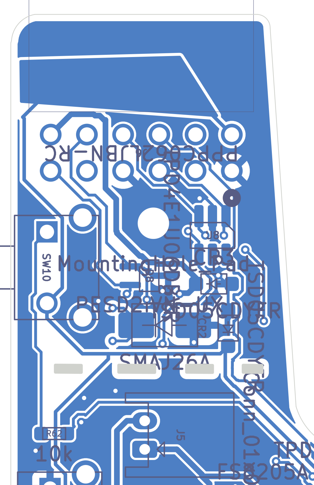
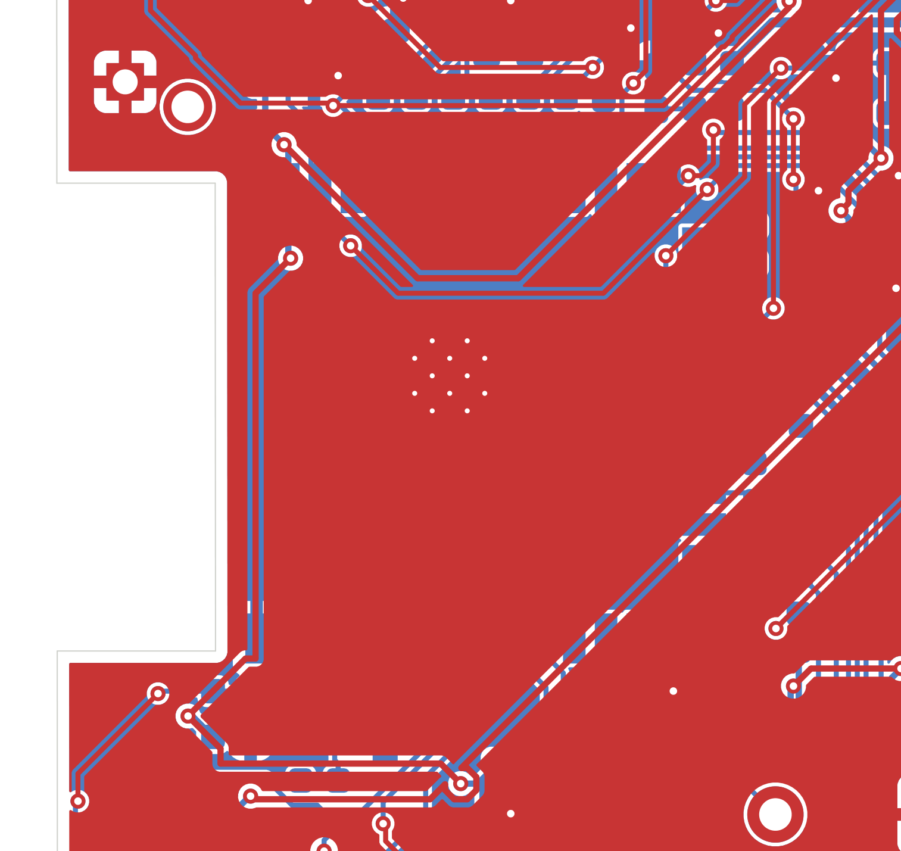
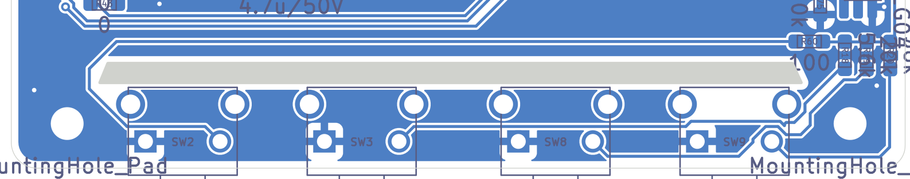
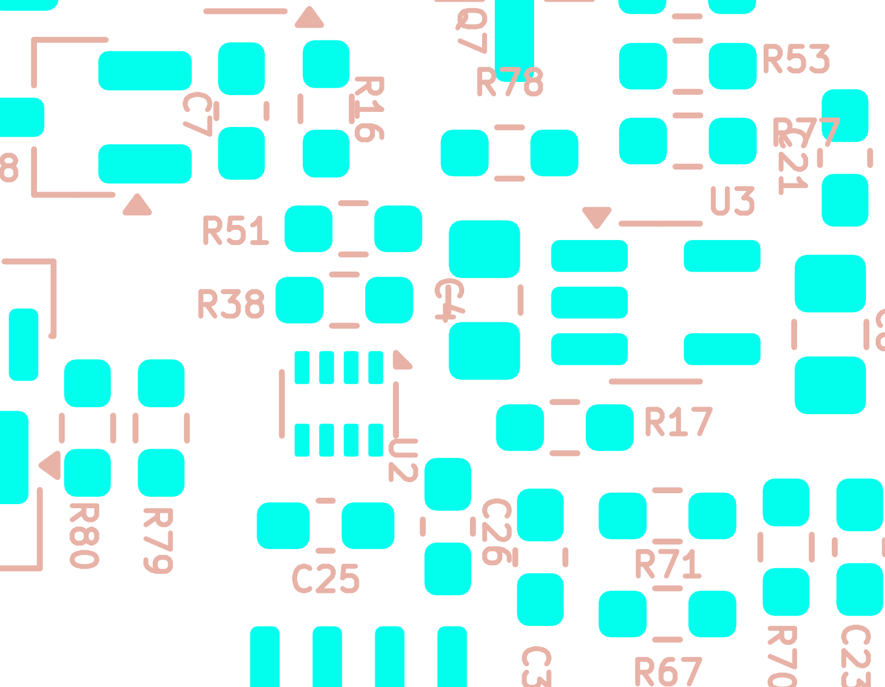

# Board layout: area-by-area walk

*Final review 2026-09-19 — reviewer key `layout`, finding IDs `LAY-nn`. Evidence: `docs/final-review-2026-09-19/evidence/`.
This review was formed independently from the design data (netlist, board extract, plots, datasheets); the prose
documentation was only opened afterwards, for the cross-check at the end.*

## What this part of the board does

This section is not about one circuit. It is about the **physical board** — the piece of fibreglass itself:
where each circuit sits, how the copper is shaped, whether the copper is fat enough to carry the current,
whether the ground return is continuous, whether the board can be cut and assembled by a factory, whether a
screw or an enclosure will short something out, and whether the printed labels are correct and readable.

Jargon defined once:

* **Layer / side.** This is a **2-layer** board, 1.6 mm thick. Copper exists only on the two outside faces:
  `F.Cu` ("front"/top) and `B.Cu` ("back"/bottom). **175 of the 183 parts are on the BOTTOM**, so B.Cu is the
  crowded component side and F.Cu is the mostly-empty side that carries the main ground plane.
* **Pour / zone / island.** A "pour" is a large area of copper flooded onto a layer and tied to a net (here, GND).
  Routing tracks cut channels through it; where a channel cuts all the way across, the pour splits into separate
  **islands**.
* **Via.** A plated hole joining F.Cu to B.Cu. **Stitching vias** exist only to tie the two ground pours together
  so return current can hop between layers.
* **Return path.** Current always flows in a loop. A signal going out on a track returns through the ground
  copper directly underneath it. If that copper is missing, the return detours, making a bigger loop — more
  noise radiated and more noise picked up.
* **Thermal relief.** By default KiCad connects a pad to a ground pour with four thin "spokes" instead of solid
  copper, so a hand-soldering iron can heat the pad. A **starved thermal** is a pad that ended up with fewer
  spokes than the rule requires — a thinner, higher-resistance connection than intended.
* **IPC-2221** is the industry table for "how much current may a track of width W carry before it heats up by
  ΔT °C". All numbers below use the **external-layer** formula with **1 oz (35 µm)** copper, which is what a
  standard 2-layer prototype order gives you.
* **Silkscreen** is the printed white/ink legend layer. **Mask-clipped** means the fab automatically erases silk
  that would land on an exposed pad — so silk drawn over a pad simply disappears, often mid-character.

Board facts (`evidence/pcb/board_extract.json`, `board_summary.md`):

| Property | Value |
|---|---|
| Outline bounding box | x 44.21 → 104.26 mm, y 36.97 → 148.28 mm (**60.05 × 111.30 mm**) |
| Estimated true board area | ≈ 5 260 mm² after the tongue, recess and slots are subtracted |
| Copper layers / thickness | 2 / 1.60 mm |
| Footprints | 183 (175 bottom, 8 top: H5 and the 3 top test points + 4 logo graphics) |
| Vias | 188 board vias (all 0.60 mm pad / 0.30 mm drill), 68 of them on GND; plus 18 footprint thermal vias at **0.20 mm drill** (U11 ×6, U4 ×12) |
| Zones | one GND zone drawn on **both** F.Cu and B.Cu, plus a second 4.8 mm² GND zone on B.Cu only at (46.7–49.1, 122.5–124.9) |
| Zone settings | clearance 0.10 mm, min thickness 0.10 mm, pad connection = **thermal relief**, thermal gap 0.50 mm, spoke width 0.50 mm, **island removal = always** |
| Min clearance / min via / min hole | 0.15 mm / 0.50 mm / 0.20 mm |
| Copper-to-board-edge clearance | 0.475 mm |
| DRC (severity-all) | 94 violations, **0 unconnected**, **0 schematic-parity errors** |

**The outline is not a plain rectangle.** Five features matter:

0. A **battery bay**: for y < 67.5 mm the board is absent between x = 44.21 and x ≈ 84.2 — an open
   **≈ 40.0 × 30.5 mm** notch in the top-left corner. This is where the LiPo pouch sits (HARDWARE.md §15:
   *"the battery now sits in a cut-out in the PCB rather than stacked on top"*), with J5 right at its
   bottom-right corner. It is an open notch rather than an enclosed cut-out, so the cell slides in from the
   top edge.
1. A **narrow tongue** to the right of that bay: for y < 67.5 mm the board only exists between x ≈ 84.2 and
   x = 104.26 — a ~20 × 30.5 mm finger carrying the development header J6. Its left edge (the bay's right
   wall) is a slanted line from (86.05, 37.96) to (84.24, 64.50), rounded into the main body with a 3 mm arc.
2. A **recess in the left edge** (x 44.27 → 50.60, y 93.30 → 112.00 = 6.33 × 18.70 mm) that the ESP32-S3
   module's printed antenna hangs over.
3. **Four 0.5 mm routed slots** across the neck of the tongue at y 61.5–62.2 — a "cut the tongue off here" line.
4. One **47 mm × 1.3 mm routed slot** at y 141.2–142.5 that isolates the bottom button strip from the main board.

---

## Circuit walk-through

Layout has no "circuit", so this table lists the **nine physical areas** I divided the board into and what lives
in each. Bounding boxes are KiCad board millimetres (y grows **downward**; plot sets whose name starts with
`bottom` are mirrored, `both_copper_xray` is not).

| Area | bbox (x0,y0)–(x1,y1) mm | What is there | Refs | Checked against datasheet? |
|---|---|---|---|---|
| **A1 — Top tongue: dev header + ESD** | (84.2, 37.0)–(104.3, 63.0) | 2×6 THT expansion header, ESD array + TVS diodes, power button, mounting hole H1, the 4 routed slots | J6, U8, CR2, CR3, D3, D8, SW10, H1 | J6 pin map cross-checked against the silk label table and the netlist |
| **A2 — Tongue root: battery inlet & protection** | (84.0, 63.0)–(100.0, 92.0) | JST-PH battery connector, protection/reverse-battery FET stack, gate network, mounting hole H5 | J5, R62, H5, Q1, Q2, Q3, Q8, Q9, U5, R16, R27, R56, R57, R79, R80, R81, C7 | J5 pad-to-net and polarity silk verified from the board file |
| **A3 — Power-path & LDO strip** | (73.0, 79.0)–(88.0, 92.0) | Ideal-diode/load-switch pair, 3V3 LDO and bulk caps, USB status ladder, battery monitor divider | U2, U3, R38, R51, C4, C6, C21, C23, C25, C26, C3, C8, R10, R12, R17, R67, R70, R71, R77, R78 | package/thermal-pad geometry read from the board |
| **A4 — microSD socket & card power switch** | (52.0, 68.0)–(82.0, 92.0) | Push-push microSD socket (mouth at the top edge), SD termination bank, SD-power PFET, SD ESD, left button column | J7, U1, U9, Q7, R8, R9, R40, R53–R55, R72–R74, C5, C28, C32, C33, C36, C37, R28, SW5, SW7, R35, R36, H2 | routing-layer split verified per net |
| **A5 — USB-C inlet, fuse, charger** | (78.0, 92.0)–(104.3, 112.0) | USB-C receptacle at the right edge, resettable fuse, CC resistors, USB ESD, TP4056-class charger | J1, F1, U6, CR1, U11, C1, C2, R1, R2, R3, R6, R82 | U11 = TP4056-42-ESOP8, SOIC-8-1EP; EPAD via count verified |
| **A6 — ESP32-S3 module & GPIO fan-out** | (44.2, 92.0)–(76.0, 120.0) | The module (antenna over the left recess), boot straps, ADC button ladders, test points TP1/TP2 | U4, R7, R13, R21–R26, R29–R34, R47, R48, R64, R65, R68, R69, C29, C27, C31, TP1, TP2, R4, R5 | module footprint + keepout geometry verified |
| **A7 — LED front-light boost & LED connector** | (44.2, 110.0)–(70.0, 142.0) | TPS923610 boost, warm/cool low-side FETs, LED FPC connector, RTC, top-side test points TP3–TP5 | L2, U10, U12, U13, C9, C12, C24, C30, Q5, Q6, R37, R39, R41, R49, R50, R60, R75, J3, TP3–TP5 | **U10 = TPS923610DRLR, pin 5 = VOUT, pin 6 = SW** (TI datasheet pinout) |
| **A8 — E-paper connector, EPD rails, touch** | (76.0, 108.0)–(104.3, 142.0) | 24-way EPD FPC, EPD rail generation (L1/Q4/D4/D5), 5-cap rail bank, touch FPC + ESD, touch jumper mux, boot buttons | J2, J4, U7, L1, Q4, D2, D4, D5, D6, C10, C11, C13–C20, C22, R14, R15, R42–R46, R52, R58, R59, R66, SW6, SW11, R63 | L1/Q4/D4/D5 pin-to-net read from the netlist |
| **A9 — Bottom strip: main button row** | (44.2, 140.0)–(104.3, 148.3) | Four main user buttons on a 5.75 mm strip cut free by a 47 mm slot, their series resistors, mounting holes H3/H4 | SW2, SW3, SW8, SW9, R18, R19, R20, H3, H4 | switch = APEM MJTP1117 |

A right-edge button column (SW10 y54.8, SW4 y72.8, SW1 y86.8, SW11 y118.0, plus R11/R61/R62) runs down the
right side across A1/A2/A8 and is treated as a cross-cutting feature below.

---

## Where it is on the board & layout notes

### A1 — Top tongue (x 84.2–104.3, y 37.0–63.0)

*`bottom_copper_fab`, x 83–105, y 36–70, mirrored (as seen from the bottom). The four grey bars near the
bottom of the crop are the routed slots.*

The tongue is the right-hand wall of the **battery bay** — the ≈ 40.0 × 30.5 mm notch that fills the top-left
corner of the board and holds the LiPo pouch. J5 sits at the bay's bottom-right corner, so the cell's leads run
a few millimetres. I checked the bay's walls for exposed power rails (see "Checked and found OK"): there are none.

J6 is a 2×6 0.1"-pitch THT socket (`PPPC062LJBN-RC`), pads at y = 45.43 (pins 7–12) and y = 47.97 (pins 1–6),
x = 88.74 → 101.44. ESD/TVS parts sit below it, the power button SW10 at (101.8, 54.8) on the right edge, and
mounting hole H1 at (94.2, 51.6). There is a hand-drawn `B.Cu` copper plate on net 3V3 at
x 89.70–103.64, y 39.90–44.20 (14 × 4.3 mm) above the header — a wire-solder / flag area.

**The tongue neck is a deliberate cut line.** Four `Edge.Cuts` polygons at y 61.5–62.2:

| Slot | x span | length | **width (y)** |
|---|---|---|---|
| 1 | 86.62 → 87.95 | 1.33 mm | **0.50 mm** |
| 2 | 90.09 → 91.92 | 1.83 mm | **0.50 mm** |
| 3 | 94.15 → 96.67 | 2.52 mm | **0.50 mm** |
| 4 | 99.29 → 101.12 | 1.83 mm | **0.50 mm** |

On the top silkscreen a **dashed textbox border** runs along the same line (the "PCB Text Box" of 15 spaces at
(83.9, 61.6), drawn on both F and B silk), so the slots plus the dashes read as a perforation. The intent is
confirmed by two bottom-silk notes: *"this long end of the board can be cut for smaller displays / if so,
unpopulate R36 and R73 / and then, populate R72/R74 / this will swap power button to UP2 / depopulate SW5
(DOWN2) if you please"* at (103.6, 65.3) and *"extra LED outputs here in case header is snipped"* at (69.5, 137.9).
That is a genuinely thoughtful piece of design — and it is undermined by two things, LAY-01 (the slots are
below fab minimum) and LAY-04 (those instructions are printed at 0.30 mm height / 0.060 mm stroke and will not
print).

At y = 61.6 the tongue is ≈ 19.8 mm wide (interpolating the slanted left edge to x ≈ 84.4). The four slots
remove 7.5 mm, leaving **12.3 mm of solid 1.6 mm FR-4 in five bridges** (2.2 + 2.14 + 2.23 + 2.62 + 3.12 mm).
Twelve tracks cross the line, all of them inside those bridges — I verified every crossing:

| x | net | layer | width |
|---|---|---|---|
| 85.40 | `UNUSED_GPIO_46` | F.Cu | 0.20 |
| 85.75 | `UNUSED_GPIO_45` | F.Cu | 0.20 |
| 88.70 | `UNUSED_GPIO_3` | B.Cu | 0.20 |
| 89.20 | `3V3` | B.Cu | 0.25 |
| 89.39 | `P+` | F.Cu | 0.40 |
| 92.90 | `I2C_SCL` | F.Cu | 0.20 |
| 97.90 | `I2C_SDA` | F.Cu | 0.20 |
| 98.08 | `3V3` | B.Cu | 0.25 |
| 98.35 | `LED_SW` | F.Cu | 0.20 |
| 101.95 | `W−` | F.Cu | 0.20 |
| 102.11 | `Net-(R62-Pad1)` | B.Cu | 0.20 |
| 102.30 | `C−` | F.Cu | 0.20 |

No copper sits over a slot, and the DRC reports zero `copper_edge_clearance` violations, so the geometry is
internally consistent.

### A2 — Battery inlet, protection stack (x 84–100, y 63–92)

J5 is a horizontal JST-PH 2-pin at (94.85, 67.50), rot 90°: pad 2 = **B+** at (94.85, 65.50), pad 1 = **B−** at
(94.85, 67.50), 0.75 mm drill, 1.2 × 1.75 mm pads. The polarity legend is a rot-270 bottom-silk text
`"-    +\nCHECK"` anchored at (85.3, 66.6), so the "+" glyph lands at y ≈ 65.6 (next to B+) and the "−" at
y ≈ 67.7 (next to B−) — **the polarity marking is correct**, placed at the cable-entry end of the housing where
you can see it while plugging in. Its stroke is 0.060 mm, which is the problem (LAY-04).

H5 (the only top-side mounting hole) is 4.5 mm away at (94.1, 72.0). B+ and B− are the only nets routed at
**0.40 mm**; everything else in the power tree is 0.25 mm.

### A3 — Power-path & LDO strip (x 73–88, y 79–92)

The densest square centimetre on the board: U2 (power-path mux, SOT-583-8) at (85.1, 86.2), U3 (LDO, SOT-23-5)
at (78.7, 84.2), their bulk caps C4/C6/C21/C25/C26, the USB-status ladder R17/R67/R70/R71 and the battery-monitor
divider R10/R12, all packed between the SD socket on one side and the protection FET stack on the other. Neither
U2 nor U3 has a thermal pad, and **both of their GND pads are starved thermals** (LAY-06), which is the worst
place on the board for that: these two parts carry the entire system current and sit in the B.Cu island that is
already the most chopped-up.

The silkscreen crop further down (`img/layout_silk_legibility.png`) is taken from this area and shows what
hand-assembling it will feel like: 0.5 mm reference designators, `R77` printed across `C21`, and several
references hard against pads.

### A4 — microSD (x 52–82, y 68–92)

J7 `microSD_PushPush_TFPUSH-MEM2075`, bottom side, bbox x 56.12–73.47, y 69.28–86.40. The board's top edge in
that x range is y = 67.50, so the socket mouth is **1.78 mm inside the board edge** — the card will be recessed
by that much. J7 carries its own `B.Silkscreen` keepout (x 57.55–67.55, y 77.10–81.10), i.e. silk is
deliberately kept out from under the card.

Routing under the socket is almost entirely the SD bus itself, plus two unrelated nets threaded through:
`PWR_BUTTON` (1 track + 1 via) and `UNUSED_GPIO_3` (1 track + 1 via). Both are DC/slow, so that is acceptable.

### A5 — USB-C inlet (x 78–104.3, y 92–112)

J1 `USB_C_Receptacle_GCT_USB4085`, rot −90°, bbox x 95.74–105.96 — it **overhangs the right board edge
(x = 104.24) by 1.72 mm**, which is how this receptacle family is meant to sit. All 15 `clearance` DRC *errors*
on the whole board are inside this one footprint (adjacent through-hole tabs 0.15 mm apart, failing the `Power`
netclass 0.20 mm rule but meeting the board's 0.15 mm global minimum) — see LAY-09.

### A6 — ESP32-S3 module and the antenna recess

*`both_copper_xray`, x 42–78, y 86–120, top view. Red = F.Cu, blue = B.Cu. The white rectangle on the left is
the board recess; note that both pours are cleanly pulled back from it and there is no copper under the antenna.
The 3×3 dot cluster near the middle is U4's ground pad thermal-via array.*

U4 `RF_Module:ESP32-S3-WROOM-1`, bottom side, rot −90°, origin (57.5, 102.5) → body ≈ x 44.75–70.25 (25.5 mm),
y 93.5–111.5 (18 mm). The recess (x 44.27–50.60, y 93.30–112.00) is sized almost exactly to it, so
**the antenna end overhangs the board edge by ≈ 5.9 mm into free air**. With the 0.475 mm copper-to-edge
pull-back there is no copper within the recess at all, and the footprint's own `F.Cu + B.Cu` `notracks` keepout
(x 30.0–51.0, y 92.5–112.5) covers the antenna. The module's ground pad is stitched to F.Cu with **12 thermal
vias** (0.20 mm drill). This is the best-executed piece of layout on the board.

### A7/A8 — the two switching converters and the FPC connectors

L2 + U10 (TPS923610 front-light boost) sit at the **bottom-left** (x ≈ 47–55, y ≈ 114–130); L1/Q4/D4/D5 (EPD
rail generation) at the **bottom-right** (x ≈ 82–92, y ≈ 110–120). J2 (24-way EPD FPC), J3 (6-way LED FPC) and
J4 (6-way touch FPC) all sit along y ≈ 123–128.

Both hot loops are **tight**, which is the thing that actually matters:

| Converter | Switch node net | routed length | vias | layers |
|---|---|---|---|---|
| Front-light boost (U10 pin 6 = SW → L2 pin 2) | `TPS_SW_NODE` | **2.50 mm** | 0 | B.Cu only |
| EPD rail boost (L1 pin 1 / Q4 drain / D5 anode / C11) | `EINK_SW` | **15.38 mm** | 0 | B.Cu only |

`LED_SW` (U10 **pin 5 = VOUT**, the boost *output*, not the switch node — TI TPS923610 datasheet pinout) is a
different story: 180.4 mm of 0.20 mm track. It reaches the local LED connector J3 within ~6 mm, and the rest is
a long tap up to J6 pin 5 on the tongue. `W−` (172.9 mm) and `C−` (187.9 mm) are the matching low-side returns.
These three, plus `I2C_SCL` (178.6 mm) and `I2C_SDA` (184.0 mm), run mostly on **F.Cu** (109–165 mm each) —
they are the main reason the top-side ground plane is cut up at all.

### A9 — the bottom button strip

*`bottom_copper_fab`, x 44–105, y 137–149, mirrored. The pale bar across the middle is the 47 mm routed slot;
below it, the strip carrying SW2/SW3/SW8/SW9 and mounting holes H4 (left of image, x = 100.5) and H3 (right of
image, x = 48.0).*

An `Edge.Cuts` polygon with corners **(51.26, 142.5), (51.86, 141.2), (97.76, 141.2), (98.30, 142.5)** cuts a
**47 mm long, 1.3 mm wide slot** across the board. Everything below it — a **5.75 mm tall strip** (y 142.5 →
148.25) carrying SW2/SW3/SW8/SW9, R18/R19/R20 and **both** mounting holes H3 and H4 — hangs off the main board
through two bridges: x 44.2–51.3 (≈ 7 mm) and x 98.3–104.3 (≈ 6 mm).

The engineering reason is sound: with screws at both ends of the strip and the slot in between, **button-press
force is decoupled from the main board** (which carries the fragile EPD FPC). I verified no copper crosses the
slot — the one track whose bounding box overlaps the slot band, `Net-(R60-Pad1)` B.Cu 0.20 mm from
(97.18, 139.74) to (99.00, 141.56), actually passes ≈ 1.0 mm to the right of the slot's right corner, inside
the right bridge.

The strip also carries the **optional front-mounted button feature**: each of SW2/SW3/SW8/SW9 has two no-net
plated holes (ø 1.30 mm, 1.95 mm rings, 7.00 mm apart) for an alternative vertical switch pushed in from the
front, plus two 0.80 mm F.Cu "tabs" — one from the GND pad, one from the ladder-resistor pad — that stop just
short of those rings under an 0.6 × 0.6 mm solder-mask window, so a blob of solder closes each gap. That is a
neat idea, and it is the source of the four `track_dangling` DRC warnings (which are therefore *not* defects).
The gaps themselves are the problem — see LAY-07.

What is *not* good: the strip contains a **102.8 mm² B.Cu ground island with zero stitching vias** (x 59.0–96.4,
y 143.0–147.8). Its only tie to the F.Cu plane is through the switches' own through-hole GND pads, one of which
(SW9 pad 1) is itself a starved thermal. The whole strip has exactly two GND vias, at (102.7, 143.0) and
(46.2, 142.7) — one in each bridge. All four button nets plus ground funnel through those bridges.

### Cross-cutting: the ground pours

After filling:

| Layer | separate fill areas | total area | largest | 2nd | 3rd | 4th | 5th | islands with **0** GND vias |
|---|---|---|---|---|---|---|---|---|
| F.Cu | **14** | 3 956 mm² | **3 456.1** | 187.6 | 131.7 | 72.0 | 29.3 | 5 (24 mm² total) |
| B.Cu | **50** | 2 749 mm² | **770.5** | 720.4 | 416.6 | 148.3 | 120.2 | 14 (150 mm² total) |

F.Cu is effectively a solid plane (3 456 mm² of a ~5 260 mm² board = 66 % in one piece). B.Cu — the side with
175 of the 183 parts — is shredded into **50 pieces**, the largest covering 15 % of the board. Every bottom-side
part's return current has to find its way to a via and up to F.Cu. 68 GND stitching vias over ~5 260 mm² is one
via per ~77 mm², i.e. one roughly every 8.8 × 8.8 mm, and they are not evenly spread.

---

## Calculations

**IPC-2221 external-layer current capacity**, `I = 0.048 · ΔT^0.44 · A^0.725` (A in mil², 1 oz = 1.378 mil thick):

| Track width | Cross-section | I @ ΔT = 10 °C | I @ ΔT = 20 °C | DC resistance (1 oz) |
|---|---|---|---|---|
| 0.20 mm (7.87 mil) | 10.85 mil² | **0.74 A** | 1.01 A | 2.46 mΩ/mm |
| 0.25 mm (9.84 mil) | 13.56 mil² | **0.88 A** | 1.19 A | 1.97 mΩ/mm |
| 0.40 mm (15.75 mil) | 21.70 mil² | **1.23 A** | 1.67 A | 1.23 mΩ/mm |
| 0.50 mm (19.69 mil) | 27.12 mil² | 1.45 A | 1.96 A | 0.98 mΩ/mm |
| 0.80 mm (31.50 mil) | 43.40 mil² | 2.03 A | 2.76 A | 0.61 mΩ/mm |

Sheet resistance used: ρ(Cu) = 1.72 × 10⁻⁸ Ω·m / 35 µm = **0.491 mΩ/square**.
Worked example (1 A in a 0.25 mm 1 oz track):
`1.0 = 0.048 · ΔT^0.44 · 13.56^0.725 = 0.3178 · ΔT^0.44` → `ΔT^0.44 = 3.147` → **ΔT = 3.147^(1/0.44) = 13.5 °C**.

> **Verification correction:** the “~1 A charge current” premise used in the table below is wrong. `R6` = 4.7 kΩ on
> the TP4056 `PROG` pin sets a charge current of ≈ 1200/4.7 ≈ **255 mA**, so the realistic worst case on
> `USB_VBUS`/`VBUS_PRE_FUSE` is ~0.26 A charge + system load (≤ ~0.8 A total), i.e. ΔT ≤ ~8 °C, not 13.5 °C.
> The width and length figures themselves were re-checked against `net_routing_stats.csv` and are correct.

**Power-net audit.** Widths and via counts from `evidence/pcb/net_routing_stats.csv`; point-to-point lengths and
resistances computed by walking the actual track graph in `pcbnew` (`scratchpad/agents/layout/a6.py`).

| Net | min width | vias | routed length | Expected peak I | ΔT at that I | Worst measured path |
|---|---|---|---|---|---|---|
| `VBUS_PRE_FUSE` | 0.25 | 2 | 21.3 mm | ~1.0 A (charge + system) | **13.5 °C** | J1.B4→F1.1 16.9 mm = 36.1 mΩ → 36 mV |
| `USB_VBUS` | 0.25 | 3 | 69.8 mm | ~1.0 A | **13.5 °C** | F1.2→U11.4 22.2 mm = 46.6 mΩ → 47 mV @ 1 A |
| `LDO_IN` | 0.25 | 2 | 73.0 mm | ~0.6 A | 6.2 °C | U2.2→U10.1 **62.3 mm = 125.5 mΩ** |
| `3V3` | 0.25 | 18 | **379.1 mm** | ~0.8–1.0 A momentary | **13.5 °C @ 1 A** | U3.5→J2.16 55.9 mm = 112.8 mΩ |
| `B+` | 0.40 | 2 | 29.4 mm | ~1.0 A | 6.6 °C | fine |
| `B−` | 0.40 | **0** | 35.4 mm | ~1.0 A | 6.6 °C | fine, but entirely on B.Cu with no via |
| `P+` | **0.25** over 0.78 mm / else 0.40 | 6 | 85.0 mm | ~1.0 A | 13.5 °C over 0.78 mm | Q8.2→U2.6 14.0 mm = 24.8 mΩ |
| `SD_VDD` | 0.25 | 2 | 37.1 mm | ~0.25 A | 1.3 °C | fine |
| `LED_SW` (boost **output**) | 0.20 | 6 | **180.4 mm** | ~0.04–0.2 A | negligible | U10.5→J6.5 176.9 mm = **443.5 mΩ** |
| `W−` | 0.20 | 2 | 172.9 mm | ~0.04 A | negligible | Q5.3→J6.6 164.3 mm = 406.7 mΩ |
| `C−` | 0.20 | 3 | 187.9 mm | ~0.04 A | negligible | Q6.3→J6.11 171.5 mm = 424.2 mΩ |
| `PREVGH` / `PREVGL` | 0.25 | 2 / 2 | 22.7 / 17.2 mm | ~10 mA | negligible | fine |
| `GND` | 0.20 / 0.50 / 0.80 | **68** | 48.8 mm of track (rest is pour) | — | — | see LAY-05 |

**Bottom-strip flex check (A9).** Treating the strip as a beam, length L = 47 mm between the two bridges, width
b = 5.75 mm, thickness h = 1.6 mm, FR-4 flexural modulus E ≈ 20 GPa:
`I = b·h³/12 = 5.75 × 4.096 / 12 = 1.963 mm⁴`.
A tactile switch takes ≈ 3 N to actuate. Mid-span, simply supported:
`δ = F·L³/(48·E·I) = 3 × 103 823 / (48 × 20 000 × 1.963) = 0.165 mm`, and peak bending stress
`σ = M·c/I = (F·L/4)·(h/2)/I = 35.25 × 0.8 / 1.963 = 14.4 MPa`.
FR-4 flexural strength is ≈ 400 MPa, so the margin is ~28×. **The strip is mechanically fine** even though the
slot corners are sharp — this is not a fatigue risk. (It was worth checking; it is not a finding.)

**I2C bus loading (A1 ↔ A7/A8).** `I2C_SCL` is 178.6 mm and `I2C_SDA` 184.0 mm — long enough to be worth a
number. Microstrip over a 1.55 mm dielectric, w = 0.20 mm, εr = 4.3:
`εeff = (4.3+1)/2 + (4.3−1)/2·(1+12h/w)^−0.5 = 2.65 + 1.65 × 0.103 = 2.82`;
`Z0 = 60/√εeff · ln(8h/w + w/4h) = 35.7 × ln(62.0) = 147 Ω`; `v = c/√εeff = 179 mm/ns`;
`C = 1/(v·Z0) = 0.038 pF/mm` → **≈ 7 pF for the whole 184 mm run**. Add the DS3231MZ, the TPD4E1U06 ESD array,
the ESP32 pin and J6: total bus capacitance ≈ 25–30 pF. With the fitted **2.2 kΩ** pull-ups (R47/R48),
`t_r = 0.8473 · R · C = 0.8473 × 2200 × 30 pF = 56 ns`, comfortably inside the 300 ns limit for 400 kHz.
**No finding — the long I2C run is fine.**

**Mounting-hole short check.** Every hole is a 2.2 mm drill (M2) with a **3.8 mm bare-copper GND annulus on both
faces**. Distance from hole centre to the nearest *non-GND* copper:

| Hole | position | nearest non-GND copper | distance | what it is |
|---|---|---|---|---|
| **H1** | (94.2, 51.6) | `P+` on B.Cu (and an `I2C_SDA` via at 2.20 mm) | **2.10 mm** | system battery rail |
| **H3** | (48.0, 145.2) | `Net-(R20-Pad1)` on B.Cu | 2.15 mm | button net |
| **H2** | (53.9, 70.5) | `PWR_BUTTON` on B.Cu | 2.30 mm | button net |
| **H5** | (94.1, 72.0) | **`B+` on B.Cu** | **2.50 mm** | *raw* cell positive, upstream of the protection FET |
| **H4** | (100.5, 145.2) | `Net-(R60-Pad1)` on B.Cu | 2.60 mm | button net |

*Verification note:* all five distances above were re-measured independently and match to 0.01 mm. Two things
soften the conclusion, though. First, the footprint is `MountingHole:MountingHole_2.2mm_M2_DIN965_Pad_TopBottom`
— the screw it is drawn for is a **DIN 965 M2 countersunk head, ø 3.8 mm (r = 1.90 mm)**, which clears every one of
these distances, and it matches the annulus exactly. Second, the `P+`/`B+` tracks are ordinary tracks **under
solder mask**; only the 3.8 mm GND annuli are mask-opened (`F.Cu`+`F.Mask`, `B.Cu`+`B.Mask` in the footprint).
So the short needs *both* an over-size screw or washer (an M2 DIN 125 washer is 5.0 mm OD, r = 2.5 mm; an M2 pan
head DIN 7985 is 4.0 mm, r = 2.0 mm) **and** mask damage under it. That is a documentation line, not a respin.
See LAY-03.

---

## Findings

| ID | Severity | Finding | Evidence | Recommendation | Confidence |
|---|---|---|---|---|---|
| LAY-01 | **HIGH** (verified) | The four tongue-neck slots are **0.50 mm wide** — below the practical minimum routed-slot width of every common low-cost fab. The five slot polygons also use a 0.20 mm `Edge.Cuts` line width while the rest of the outline uses 0.05 mm | `Edge.Cuts` polygons at y 61.50–62.22 (x 86.62–87.95, 90.09–91.92, 94.15–96.67, 99.29–101.12), each 0.50 mm in y. Re-measured independently: each slot polygon’s bbox is 0.71–0.72 mm in y including the 0.20 mm line width, i.e. a **0.52 mm** centre-line slot. JLCPCB’s capability page states **"Min. Non-Plated Slots: 1.0mm"** (plated slots on 2 layers: 0.5 mm) — these are non-plated `Edge.Cuts` slots, so they are half the stated minimum | Widen all four slots to **≥ 1.0 mm** and redraw them with a 0.05 mm line width to match the rest of the outline. Get an explicit DFM answer from the fab before ordering — treat as a blocker if they cannot cut 0.5 mm | high |
| LAY-02 | MEDIUM (verified) | Even if the slots are cut, the "cut here" line leaves **12.3 mm of solid 1.6 mm FR-4 in five bridges** out of a 19.8 mm neck. This cannot be snapped by hand; it needs a saw, and 12 tracks (incl. `P+` and `3V3`) cross inside those bridges | Re-derived by scanning the real board-outline polygon (`pcbnew.GetBoardPolygonOutlines` + point-in-polygon at 10 µm steps): at y = 61.86 the solid runs are 2.21 + 2.15 + 2.23 + 2.62 + 3.12 = **12.33 mm** out of a 19.82 mm neck (x 84.42→104.24). Auditor’s 12.31 mm confirmed | Either commit to a proper break-away (mouse-bite drills on ~1 mm pitch, or a V-score) or relabel the line as "cut with a saw here". Add a silk warning that the cut severs `P+`, `3V3` and `GND` and must be deburred | high |
| LAY-03 | ~~HIGH~~ → **LOW** | *Distances confirmed to 0.01 mm; the short mechanism is much weaker than stated — see Verification log.* Non-GND copper runs within **2.10–2.60 mm** of mounting holes whose GND annulus is 3.8 mm of bare copper on both faces. At **H1 the `P+` system battery rail is 2.10 mm away**; at **H5 the raw cell `B+` is 2.50 mm away**. A washer or over-size screw head can **rest on** those tracks, but they are **under solder mask** (only the 3.8 mm GND annuli are mask-opened, layers `F.Cu/F.Mask` + `B.Cu/B.Mask`), and the footprint used is `MountingHole_2.2mm_M2_DIN965_Pad_TopBottom` — a DIN 965 M2 countersunk head is ø 3.8 mm (r = 1.90 mm) and clears every one of these distances. A short needs a washer **and** damaged mask | Table above, computed with `pcbnew` `Distance()` from each hole centre to every non-GND track/via/pad | Cheap fix: document **M2 DIN 965 countersunk (ø 3.8 mm head), no washers, nylon preferred**. Pulling `P+`/`B+` back to ≥ 3.5 mm is nice-to-have, not required for this spin | high |
| LAY-04 | ~~HIGH~~ → **MEDIUM** | **Every bottom-side silkscreen item is below the fab’s minimum printable size** (the *front*-side user labels — PWR/UP1/OK/BACK/arrows, 0.9–1.5 mm high with 0.15–0.30 mm strokes — are fine, so “everything on the board” was an overstatement). All 174 reference designators are 0.50 mm high with a 0.10 mm stroke; the board notes are 0.30–0.50 mm high with 0.060–0.125 mm strokes; the **J5 battery polarity "+/−" mark has a 0.060 mm stroke**. JLCPCB's stated minimum is **1.0 mm text height and 0.15 mm line width** | Re-measured independently: visible reference metrics `{(1.0, 0.15) B.Silk: 1, (1.0, 0.15) F.Silk: 1, (0.50, 0.10) B.Silk: 174}`; J5 polarity legend at (85.3, 66.6) h = 1.000 / stroke = **0.060 mm**; tongue note at (103.6, 65.3) h = **0.300** / 0.060 mm; FPC markers 0.400 / 0.100 mm. JLCPCB capability page: **“Minimum Line Width: ≥0.15mm”, “Minimum text height: 40 mil (1.0mm)”** | Raise all reference designators to ≥ 0.8 mm height / 0.15 mm stroke (1.0 mm/0.15 mm to be safe), and every board note to ≥ 1.0 mm/0.15 mm. Prioritise the **J5 polarity mark** and the tongue-cut instructions — those are a safety mark and the board's key user instructions | high |
| LAY-05 | ~~HIGH~~ → **MEDIUM** | *(re-counted: worse than reported, but it is a return-path-quality issue, not a functional one — DRC shows 0 unconnected)* B.Cu ground is broken into **51 separate fill areas** totalling 2 754 mm² (largest 770 mm²) on a ~5 260 mm² board, while F.Cu is one 3 456 mm² plane. **19 of those B.Cu islands (282 mm²) contain no GND via at all** — and the largest is not the bottom button row (102.8 mm²) but the **120.2 mm² tongue island** (x 84.3–103.8, y 37.5–65.7) carrying J6 and the power button, followed by 21.1 mm² at (91.4–97.2, 48.1–54.6) | Zone fill dump (`r4.py`): B.Cu 770.5 / 720.4 / 416.6 / 148.3 / 120.2 / **102.8 (0 vias)** / 76.8 / 62.1 / 61.8 / 25.5 / 22.9 / 22.4 … ; F.Cu 3456.1 / 187.6 / 131.7 / 72.0 / 29.3 … | Add GND stitching vias so **every** B.Cu island ≥ ~20 mm² has at least one via to F.Cu — at minimum in the bottom strip, the SD area and around the two converters. A dozen extra vias costs nothing and halves the return-path length for most bottom-side parts | high |
| LAY-06 | ~~MEDIUM~~ → **LOW** | *(count confirmed; the “power/thermal” framing does not survive checking — see Verification log)* **25 GND pads are starved thermals** — they reach the pour through fewer than two 0.5 mm spokes. Full list re-extracted from `drc.json`: SW4.1, J1.A1, **J6.4** (missing from the original list), U2.1, R37.2, U6.2, U3.2, C21.2, R50.2, CR2.2, U9.2, U11.1, C27.1, C3.2, J7.6, J7.9 ×2, C29.2, U7.2, C25.1, R41.2, C4.2, J2.17, C37.1, SW9.1. **U11 pad 1 is `TEMP`, not a thermal pad** — the TP4056’s heat path is pad 9 (EPAD), which has its 6 thermal vias and is *not* starved. J1 has four GND pads and only A1 is starved. One 0.5 × 0.5 mm spoke carries 1.45 A at ΔT = 10 °C by IPC-2221, so none of these is current-limited | `drc.json`, 25 × `starved_thermal`, each item located in the `r2.py` dump | Change the pad-to-zone connection to **solid** for the power/thermal ones (U11, U2, U3, U6, J1.A1, J7, J2.17) and for R37 at the boost. Leave thermal relief on the small hand-soldered passives | high |
| LAY-07 | ~~MEDIUM~~ → **LOW** (measurement confirmed; only bites the *optional* front-button build) | The optional front-button **solder-bridge tabs are 0.151–0.188 mm from their rings, not the 0.3 mm stated in HARDWARE.md §9.1.1** — i.e. right at the board's 0.15 mm absolute minimum clearance, with only a ~0.29 mm solder-mask dam between the two mask openings. Per the documentation's own warning, a tab bridged by accident makes that button read permanently pressed and renders the other three on its ladder unreadable | Measured copper-to-copper: SW2.4 0.151, SW3.4 0.151, SW8.4 0.151, SW9.4 0.163 mm (signal tabs); SW2.3 0.151, SW3.3 0.188, SW8.3 0.188, SW9.3 0.151 mm (GND tabs). F.Mask apertures are 0.6 × 0.6 mm at y 143.5–144.3; the nearest ring's mask opening leaves ≈ 0.29 mm of dam | Open the gaps to ≥ 0.30 mm of copper as the documentation already claims, and keep ≥ 0.25 mm of mask dam. Until then, **inspect all eight tab gaps under magnification on every assembled board before first power-up** and correct HARDWARE.md §9.1.1 | high |
| LAY-08 | ~~MEDIUM~~ → **LOW** | *(resistance re-derived as 122 mΩ from 62.3 mm / 0.25 mm × 0.491 mΩ per square — but at the boost’s ~0.25 A input that is only ~31 mV)* The `LDO_IN` rail reaches the front-light boost through **≈ 122–126 mΩ over 62.3 mm** (U2.2 → U10.1), 56.3 mm of it on F.Cu. A boost converter at the end of that much source impedance depends entirely on its local input capacitance | Track-graph walk, `a6.py`; `net_routing_stats.csv` `LDO_IN` 0.25 mm / 73.0 mm / 2 vias | Confirm with the LED reviewer that C12 (4.7 µF at (52.4, 119.8)) is genuinely adjacent to U10 pin 1. Widening `LDO_IN` to 0.4 mm costs nothing and halves the drop | medium |
| LAY-09 | ~~MEDIUM~~ → **LOW** (confirmed: 187 vias with a net, 1 without) | One via has **no net** at (100.9, 133.1); it is the only no-net via on the board | `a3.py` via-size counter: `{(0.6, 0.3, no-net): 1, (0.6, 0.3, net): 187}` | Delete it, or assign it to GND if it was meant as a stitching via. A no-net via sits in the pour and is harmless, but it is unexplained copper | high |
| LAY-10 | ~~MEDIUM~~ → **LOW** | *(widths confirmed, but the 1 A premise is wrong: `R6` = **4.7 kΩ** on TP4056 `PROG` sets Iₛₕₑₜ ≈ 1200/4.7 ≈ **255 mA**, so the real ΔT on a 0.25 mm rail is ~1–8 °C)* Power-rail widths are thin **if** you assume a 1 A charge current: `VBUS_PRE_FUSE`, `USB_VBUS` and the 379 mm `3V3` trunk are all **0.25 mm** → **13.5 °C rise at 1 A**. `P+` also contains a 0.78 mm necked section at 0.25 mm, and `B−` is routed entirely on B.Cu with **zero vias** | `net_routing_stats.csv`; IPC-2221 table above | Widen `VBUS_PRE_FUSE`/`USB_VBUS` between J1, F1, U2 and U11 to **0.5 mm**, and the `3V3` trunk out of U3 to 0.4 mm. Remove the `P+` neck. Add 2 vias on `B−` so the battery return can use both layers | high |
| LAY-11 | ~~MEDIUM~~ → **LOW** | The small 4.8 mm² B.Cu GND zone at the front-light boost (x 46.7–49.1, y 122.5–124.9) has **zero vias** to the F.Cu plane, and R37's GND pad inside it is one of the starved thermals. That is the return node of a switching converter | `r4.py` zone dump ("B.Cu: 1 island, 4.8 mm², 0 vias"); `drc.json` starved thermal on R37 pad 2 @(48.53, 124.12) | Put 2–3 GND vias inside that pour, right next to U10's GND pad and C9's ground pad, and make those pad connections solid | medium |
| LAY-12 | LOW | Silkscreen collisions: 5 `silk_overlap` (including **`R77` printed on top of `C21`**, and U2/C4 references over their own outlines) and 12 `silk_over_copper` (references of **R8, R27, R77, R78** plus two of the long text boxes). Production silk is mask-clipped, so anything over an exposed pad is erased mid-character | `drc.json`; visible in the crop below | Nudge the four references off the pads and separate R77/C21. Combined with LAY-04 this is what decides whether the board can be hand-populated | high |
| LAY-13 | LOW | The dashed "cut here" textbox at (83.9, 61.6) is **mirrored on F.Silkscreen** (KiCad `mirrored_text_on_front_layer` warning) and its box runs to x = 107.2, i.e. **3 mm past the right board edge**. Board-level silk also spills past the edge at the J6 label table and the dev-header note, giving 32 `silk_edge_clearance` warnings in total | `drc.json`; text-box dump showing `F.Silkscreen mirror=True bbox x83.8..107.2` | Un-mirror the front-layer box and clip both boxes to the board outline. Cosmetic, but it is 32 of the 94 DRC items and it hides real warnings | high |
| LAY-14 | LOW | The J6 pin-label table has a **2.77 mm column pitch against the header's 2.54 mm pitch**, so the label drifts from ≈ 0.8 mm left of pin 1 to ≈ 0.4 mm right of pin 6 | Table spans x ≈ 86.7–103.3 for 6 columns; pins at x = 88.74 … 101.44 (see `img/layout_tongue_slots.png` and the top-silk crop) | Re-space the table to 2.54 mm columns so each label sits centred over its own hole. The drift is still under half a pitch so nothing is *wrong* today, but it looks wrong | medium |
| LAY-15 | LOW | The 18 footprint thermal vias (U11 EPAD ×6, U4 ground pad ×12) use a **0.20 mm drill** — the smallest holes on the board, and smaller than the 0.30 mm used everywhere else | `pcbnew` pad dump; JLCPCB 2-layer minimum is 0.15 mm hole, but sub-0.3 mm drills commonly attract a surcharge | Confirm with the fab that 0.20 mm drills are included in the quoted price; if not, enlarge them to 0.30 mm — there is room in both pads | medium |
| LAY-16 | LOW | All 15 `clearance` DRC **errors** are adjacent through-hole tabs inside the fixed USB-C footprint J1, 0.15 mm apart, failing the `Power` netclass 0.20 mm rule | `drc.json`; e.g. J1 pad A4 `VBUS_PRE_FUSE` (96.825, 104.825) vs pad A5 `CC1` (96.825, 105.675) | Not a real defect — 0.15 mm meets the board's global minimum and the footprint geometry is fixed. Add a custom rule scoped to J1 so the DRC report goes to zero errors and real errors cannot hide | high |
| LAY-17 | LOW | Mechanical overhangs the enclosure must accommodate: **U4 overhangs the left edge by 5.9 mm** into the recess, **J1 overhangs the right edge by 1.72 mm**, and SW10's silk/actuator extends ~1.3 mm past the right edge at (103.9–105.5, 53.2–56.4). J7's card mouth is **1.78 mm inside** the top edge | Footprint bounding boxes vs the `Edge.Cuts` outline | Check all four against the enclosure CAD before ordering the case. The U4 overhang in particular needs a pocket in any wall that follows the board outline | high |
| LAY-V01 | LOW | **The 120.2 mm² B.Cu ground island on the tongue (x 84.3–103.8, y 37.5–65.7) has zero GND stitching vias** — larger than the bottom-strip island LAY-05 named as the worst case. It is the ground for J6 (dev header), SW10 (the power button) and the 3V3 copper flag | Independent zone census (`layout_verify/v3.py`, `GetFilledPolysList` per layer + point-in-polygon against all 68 GND via positions): B.Cu 51 islands / 2 754 mm², 19 with no via (282 mm²); F.Cu 14 islands / 3 956 mm², 5 with no via (24.3 mm²) | Add one or two GND vias on the tongue, e.g. beside J6 pins 1/4, when doing the LAY-05 stitching pass | high |
| LAY-V02 | LOW | **The charger is set to ≈ 255 mA, not 1 A.** `R6` = 4.7 kΩ sits on `Net-(U11-PROG)` (TP4056 pin 2); the part’s programming relation is Iᵦₐₜ ≈ 1200 / Rₚᵣₒᵍ[kΩ] mA. This removes most of LAY-10, but it also means a 2 000 mAh cell takes ≈ 8 h to charge, and it is stated nowhere in the layout analysis | `evidence/sch/connectivity_by_net.txt`: `Net-(U11-PROG)` = R6.1 (4.7k) + U11.2 PROG | Confirm this is intentional (it is a sensible choice for a small cell and for TP4056 self-heating). Re-base any current-capacity argument on ~0.26 A charge + system load rather than 1 A | high |

### CERT-LATER (EMI/EMC/certification items — fine to ignore for this prototype)

| ID | Item | Why it will matter later |
|---|---|---|
| LAY-C1 | `LED_SW` (180 mm), `W−` (173 mm), `C−` (188 mm) run diagonally across the board mostly on F.Cu as taps to J6, forming a ~170 mm out-and-back loop on PWM-switched nets | Large radiating loop area; also the main thing carving up the F.Cu ground plane |
| LAY-C2 | `I2C_SCL`/`I2C_SDA` are 179/184 mm, 110 mm of each on F.Cu, cutting the top-side plane | Plane slots under other signals; radiated emissions from a 400 kHz clock and its harmonics |
| LAY-C3 | 68 GND stitching vias for a 60 × 111 mm 2-layer board (≈ one per 8.8 × 8.8 mm), no via fence near the edges | Edge radiation and poor high-frequency return; a proper via fence is normally needed to pass radiated-emissions limits |
| LAY-C4 | `DP` has 3 vias and `DN` has 1 (lengths are well matched at 45.8 / 46.2 mm) | Asymmetric via count breaks differential symmetry — irrelevant at USB Full-Speed, not at High-Speed |
| LAY-C5 | Narrow isolated GND slivers with no via: F.Cu 19.2 mm² at (100.7–102.5, 70.7–83.8), plus 3.7 / 1.2 / 1.2 mm² pieces | 13 mm-long single-point-connected copper acts as a resonant stub |
| LAY-C6 | The ESP32 antenna sits in a recess with ground pour ~0.5 mm away on three sides | Detuning / efficiency loss; matters for RF certification and range, not for "does WiFi work" |
| LAY-C7 | SD bus length skew: `SD_CLK` 20.8 mm vs `SD_DAT1` 44.4 mm = 23.6 mm ≈ 136 ps | 0.7 % of a 50 MHz SDIO bit period — irrelevant now, relevant if the bus is ever pushed faster |

---

## Checked and found OK

**Connectivity and consistency**
* DRC reports **0 unconnected items** and **0 schematic-parity errors** — the board matches the schematic and
  every net is routed.
* Zone `island removal = always`, so there is **no orphan/floating zone copper** anywhere on the board.
* All 188 board vias are one size (0.60 mm pad / 0.30 mm drill) and both sides are tented — **no via-in-pad**,
  nothing for solder to wick into.
* I checked every via against every pad of a different net: the closest approach is an annulus-to-pad gap of
  0.00–0.13 mm at a handful of same-net vias (C26.1/P+, Q8.2/P+, R42.1/3V3, U4.14/DP, D8.2/W−, several GND);
  **no via drill overlaps any pad** and none bridges two nets.
* No copper crosses either routed-slot feature and there are **zero `copper_edge_clearance` violations**, with a
  0.475 mm rule in force.

**The RF end (the hard part, done well)**
* The ESP32-S3 module's printed antenna overhangs the left board edge by ≈ 5.9 mm into a purpose-cut recess,
  with **no copper on either layer within the recess** and a `notracks` keepout over the antenna.
* U4's ground pad is stitched to the F.Cu plane with **12 thermal vias**.

**The switching converters**
* Front-light boost: `TPS_SW_NODE` (U10 pin 6 → L2 pin 2) is **2.50 mm** long, on B.Cu, with no vias — about as
  tight as a hot loop gets. The 4.7 µF/50 V output cap C9 is 2.8 mm from the IC.
* EPD rail boost: `EINK_SW` (L1 / Q4 drain / D5 anode / C11) is **15.38 mm**, on B.Cu, with no vias.
* U10 pin 5 is `VOUT`, not the switch node (TI TPS923610 datasheet) — so the long `LED_SW` run is a DC tap, not
  a 180 mm switching node. I re-checked this specifically because the net name and the `SW` netclass suggest
  otherwise.

**Signal return paths**
* The whole EPD SPI group runs **100 % on B.Cu with zero vias**, i.e. directly over the solid F.Cu plane:
  `SPI_SCK` 23.8 mm, `SPI_MOSI` 25.4 mm, `EPD_CS` 22.2 mm, `EPD_DC` 20.6 mm, `EPD_RST` 18.7 mm,
  `EPD_BUSY` 16.8 mm. This is the best-behaved bus on the board.
* `SD_DAT0` (38.8 mm) and `SD_DAT1` (44.4 mm) are also 100 % B.Cu with no vias; `SD_CLK`, `SD_CMD`, `SD_DAT2`,
  `SD_DAT3` hop to F.Cu for 2.7–10.2 mm each.
* `DP`/`DN` are length-matched to within 0.4 mm (45.8 / 46.2 mm) and are 84 % on B.Cu over the plane.
* `BAT_MONIT` (the battery ADC divider) is 7.7 mm, on B.Cu, with no vias — short and over the plane.
* I2C loading calculated above: ~30 pF total with 2.2 kΩ pull-ups → 56 ns rise time. Fine at 400 kHz.

**Thermal**
* U11 (TP4056) uses `SOIC-8-1EP_..._ThermalVias` and really does have **6 thermal vias** in its 2.41 × 3.30 mm
  exposed pad. (I initially mis-read this as zero — the vias are footprint pads, not board vias.)

**Mechanical / assembly**
* All five mounting holes are consistent: 2.2 mm drill (M2), 2.6 mm PTH pad, 3.8 mm annulus on both faces, all
  tied to GND.
* The bottom button strip is mechanically sound: 14.4 MPa peak stress against FR-4's ~400 MPa (calculation above).
* TP3/TP4/TP5 are **through-hole** (1.0 mm drill, 1.7 mm pad) so they can be probed or wired from either face,
  even though they are nominally top-side parts. TP1/TP2 (`TX`/`RX`) are bottom-side SMD pads with visible
  references.
* Labels for TP3/TP4/TP5 do exist and line up correctly: the bottom-silk string `"LED+   C-   W-"` at
  (65.9, 137.2) maps to TP3 (x 65.3, `LED_SW`), TP4 (x 61.6, `C−`), TP5 (x 58.0, `W−`).

**Silkscreen content (as opposed to size)**
* J5's battery polarity marking is **correct**: the rot-270 `"- +"` legend puts "+" at y ≈ 65.6 beside pad 2
  (`B+` at y 65.50) and "−" at y ≈ 67.7 beside pad 1 (`B−` at y 67.50), placed at the cable-entry end where you
  can read it while plugging the pack in. A "CHECK" warning sits alongside.
* The J6 label table is **logically correct** in top view: the upper row `3V3 SDA 3 SCL C- BAT+` maps to pins
  7–12 at y 45.43, the lower row `GND 46 45 GND LED+ W-` to pins 1–6 at y 47.97, both in the right left-to-right
  order. A **pin-1 dot** is present at (87.2, 48.0). A note on the board explains the viewing convention.
* Every one of the 175 bottom-side parts has a visible reference designator on B.Silkscreen — none are hidden.
* Pin-1 / polarity markers (triangles) are present on the passives and ICs in the dense areas I inspected.
* User-facing labels exist on the top silk for every button: `PWR`, `UP1`, `DWN1`, `UP2`, `DWN2`, `OK`, `BACK`,
  `LEFT`, `RIGHT`, plus arrow glyphs, and there are pin-1 dot conventions and a `"PLEASE CHECK PINOUTS OF ALL
  RIBBON CABLES BEFORE INSERTING"` warning by the FPC connectors, with the GDEQ426T82FT01 pinouts printed for
  both J3 and J4.
* Board identity is present: author credit, website, GitHub/Ko-Fi/Patreon labels and a supporter list.

*`bottom_silk_mask`, x 74–92, y 78–92, mirrored. Cyan = exposed pad, pink = silk. Note `R77` printed across
`C21` at the top right, and several references (C4, C26, R78) hard against pads where the mask clip will bite.*

**The battery bay (safety-relevant, and it passes)**
* I walked the bay's edges — the horizontal wall at y = 67.5 from x 45 to x 81, and the slanted wall from
  (84.24, 64.50) to (86.05, 37.96) — looking for a power rail a LiPo pouch could rub against. The nearest
  non-GND copper anywhere along those edges is **0.75 mm** (`SD_DAT1` at x ≈ 75), then 0.91 mm
  (`UNUSED_GPIO_46` on the slant) and 0.94 mm (`PWR_BUTTON` at x ≈ 63). **No `B+`, `P+`, `LED_SW` or panel HV
  net runs along the bay**, and everything there is a 3.3 V logic net behind solder mask. The bay's own edge
  copper is the GND pour. That is the right answer.

**The optional front-button solder tabs (a real feature, not stray copper)**
* The four `track_dangling` DRC warnings are **not a defect** — they are the documented signal-side
  solder-bridge tabs from HARDWARE.md §9.1.1. I confirmed every detail of that mechanism against the board:
  SW2/SW3/SW8/SW9 each have pads 3 and 4 as **1.30 mm-drill, 1.95 mm-ring, no-net** plated holes exactly
  **7.00 mm** apart; each has an 0.80 mm-wide F.Cu tab growing from pad 2 (its ladder resistor node) and a
  matching GND tab from pad 1; and there are exactly **eight 0.6 × 0.6 mm F.Mask apertures** at y 143.5–144.3
  over the eight tab tips. The ladder mapping also matches the documentation exactly: SW3→`R18`, SW8→`R19`,
  SW9→`R20`, SW2→`R60`. The only thing wrong is the gap size (LAY-07).
* **These four warnings should be added to a DRC-waiver list** so a future cleanup pass does not "fix" them by
  deleting the tabs.

**Things I looked for and did not find**
* No tracks routed under a connector's metal shell on a foreign high-voltage net. Under J7 the only non-SD nets
  are `PWR_BUTTON` and `UNUSED_GPIO_3` (1 track + 1 via each); under J1 only USB nets; under J3 only
  `LED_SW`/`W−`/`C−`; under J2 and J4 only their own nets.
* No acid traps or sub-minimum track widths: the narrowest track anywhere on the board is 0.20 mm and every net
  reports a `min_w_mm` ≥ 0.20. Apart from the eight intentional tabs above, there are no unfinished tracks.
* No copper island stranded by the zone filler (island removal = always).

---

## Documentation cross-check

Done **after** everything above was written. Sources compared: `docs/HARDWARE.md` (§2, §9.1.1, §12, §15, §16 —
the layout/mechanical-relevant parts), `docs/images/board-top.png`, and the board's own silkscreen text.

### Where the documentation disagrees with the design

| ID | Doc | Claim | Reality |
|---|---|---|---|
| **LAY-D1** | `HARDWARE.md` §9.1.1 | *"Each tab stops **0.3 mm short** of its ring, with the solder mask opened over the tab tip"* | The measured copper-to-copper gap is **0.151–0.188 mm** on all eight tabs (SW2.4 / SW3.4 / SW8.4 0.151, SW9.4 0.163, SW2.3 / SW9.3 0.151, SW3.3 / SW8.3 0.188). That is half the documented figure and sits exactly on the board's 0.15 mm global minimum clearance. This is finding **LAY-07** |
| **LAY-D2** | `HARDWARE.md` §6.2 | *"the `C10`→`L1`→`Q4`→`R14` pad-centre loop area grew from ≈24 mm² to ≈33 mm² (+36 %)"* | I cannot reproduce 33 mm². Shoelace area of the pad-centre polygon comes out **24.0 mm²** for C10.2→L1.1→Q4.3→R14.1, **26.6 mm²** if L1 and Q4 are each counted as two pads, and **26.0 mm²** for C10.1→L1.2→Q4.3→R14.2. Every reading is 24–27 mm², i.e. the loop looks *better* than the doc says. Either the doc is stale or it measures a polygon I have not guessed. **I could not verify this claim** — and the good news is that the real number is fine either way |
| **LAY-D3** | `HARDWARE.md` §16 "Enclosure" | Warns only that *"a conductive case must not bridge the exposed high-voltage nets: `LED_SW` (up to 24.5 V) and the panel's ±22 V rails"*, and presents the plated GND mounting holes purely as an EMC bonding feature | The documentation does **not** warn that a metal screw head or washer at **H1** or **H5** can bridge the 3.8 mm bare GND annulus to `P+` (2.10 mm away) or to the raw cell `B+` (2.50 mm away). On a LiPo board that is the more dangerous case, and it is the omission behind finding **LAY-03**. §16 should name a screw and washer size |
| **LAY-D4** | `HARDWARE.md` §16 "Button geometry" | *"Bottom edge, left-to-right facing the screen: BACK · **CONFIRM** · LEFT · RIGHT"* | Positions and order are correct (SW9 x 55.7, SW8 x 67.7, SW3 x 80.7, SW2 x 92.7), but the board's own front silkscreen prints **"OK"**, not "CONFIRM", at (68.9, 144.7). Cosmetic, but a user reading the doc will look for a button labelled CONFIRM |
| **LAY-D5** | `HARDWARE.md` — everywhere | The document never states the **board dimensions, layer count, thickness, copper weight, minimum track/clearance, or the outline features** (battery bay, antenna recess, tongue cut line, bottom button strip and its slot) | None of this is documented anywhere in `HARDWARE.md`. §1 promises "case agnostic" and §16 has an "Enclosure" paragraph, but a person trying to build a case or re-order the board has no dimensioned description of the outline at all. The three routed features are, today, explained **only** in 0.30 mm silkscreen that will not print (**LAY-04**) |
| **LAY-D6** | Board silkscreen (bottom, (103.6, 65.3)) | *"this long end of the board can be cut for smaller displays / if so, unpopulate R36 and R73 / and then, populate R72/R74 / this will swap power button to UP2 / depopulate SW5 (DOWN2) if you please"* | This procedure — the fact that cutting the tongue **removes the power button SW10** and how to recover it — appears **nowhere in `HARDWARE.md`**. §9.2 "Power button" does not mention it. It is a genuinely useful design feature that currently exists only as unprintable ink |

### Claims I checked and confirmed

* §2 voltage-domain table: `USB_VBUS` → TP4056 → `P+`; TPS2116 mux → `LDO_IN`; TLV75533P → `3V3`; TPS923610 boost
  off `LDO_IN`; panel HV off `3V3` — all match the netlist and the physical placement of U11, U2, U3, U10, L1.
* §9.1.1 front-button mechanism: pads 3/4 no-net, ø 1.30 mm drill, 1.95 mm rings, **7.00 mm apart**, two tabs per
  button with mask openings over the tips, ladder mapping SW2→R60 / SW3→R18 / SW8→R19 / SW9→R20. All exactly as
  written (apart from LAY-D1).
* §12 test points: TP1 `RX`, TP2 `TX`, TP3 `LED_SW`, TP4 `C−`, TP5 `W−` — exact match. TP3–TP5 really are
  header-compatible plated holes (1.0 mm drill / 1.7 mm pad).
* §12 mounting: `H1`–`H5` are all `MountingHole_Pad`, plated, GND-connected, 2.2 mm drill — exact match.
* §15 "the battery now sits in a cut-out *in* the PCB": confirmed — a ≈ 40.0 × 30.5 mm notch in the top-left with
  J5 at its corner. (Strictly it is an open notch, not an enclosed cut-out.)
* §16 button geometry, sides: UP1/DWN1 on the right edge (SW4 y 72.8 / SW1 y 86.8, silk `UP1`/`DWN1`), UP2/DWN2 on
  the left (SW7 y 72.8 / SW5 y 86.8, silk `UP2`/`DWN2`) — exact match.
* §9.1.1 *"The front silkscreen legends (RIGHT, LEFT, BACK, OK) sit where the switch body goes and will be
  covered"* — confirmed: the legends are at y ≈ 144.7–144.8, the switch bodies at y 146.5.
* Header line *"179 references, 129 nets"* — the board carries 183 footprints, which is 179 components plus the
  4 un-annotated `G***` logo graphics. Consistent.
* `docs/images/board-top.png` is **current**. I checked it feature by feature against the live outline: the
  battery bay, the tongue, the four neck slots (they land at x ≈ 86.4–87.4 / 90.2–92.5 / 93.6–96.4 / 99.1–101.1,
  matching the `Edge.Cuts` polygons), the left antenna recess with the module visible through it, the 47 mm
  bottom slot, the three top-side test pads at x ≈ 57.7 / 61.3 / 65.2, and the eight front-button tab mask
  openings at y ≈ 143.2. Nothing in that render contradicts the board file.

---

## Open questions for the designer

1. **What is the intended way to remove the tongue?** The slots + dashed silk read as a perforation, but 12.3 mm
   of 1.6 mm FR-4 remains in five bridges. Saw? Mouse-bites? And if the fab widens the 0.5 mm slots to 1.0 mm
   (LAY-01), does that change your answer?
2. **Should the tongue-cut procedure move into `HARDWARE.md`?** The board's silk explains it well (unpopulate
   R36/R73, populate R72/R74, power button moves to UP2/SW7, optionally depopulate SW5) — but at 0.30 mm
   text height it will not print, and `HARDWARE.md` §9.2 does not mention it at all (LAY-D6).
3. **What is the real worst-case current?** I assumed ~1 A for the USB/charge path and ~1 A momentary on 3V3
   (WiFi TX + EPD refresh + front light together). If the true peak is lower, LAY-10 relaxes; if it is higher,
   the 0.25 mm rails get worse quickly.
4. **Which screws and washers are intended for the five M2 holes?** The answer decides whether LAY-03 is a
   documentation line or a layout change.
5. **Is the board being ordered in 1 oz or 2 oz copper?** All current calculations above assume 1 oz; 2 oz
   roughly doubles the current capacity and would soften LAY-10 considerably.
6. **Why is the J6 label on the top silkscreen when J6 is a bottom-side socket?** A mirrored copy on
   B.Silkscreen would let the user read pin names while actually plugging something in.
7. **Does the enclosure back the bottom button strip?** If it does, the slot's decoupling job is defeated; if it
   does not, the strip is a free-standing 47 mm beam (mechanically fine, but worth knowing).
8. **Is there a reason the `3V3` distribution is a 379 mm spider at 0.25 mm** rather than a short fat trunk with
   branches? It works, but it is the single longest power net on the board.
9. **Which pads does the ≈33 mm² EPD-boost loop figure in `HARDWARE.md` §6.2 refer to?** Every pad-centre polygon
   I can form out of C10 / L1 / Q4 / R14 comes to 24–27 mm² (LAY-D2). If the figure is stale, the doc is
   understating how good that loop actually is.
10. **What is the 14 × 4.3 mm `B.Cu` copper plate on net `3V3` at (89.70–103.64, 39.90–44.20)** above J6 for?
    It is a hand-drawn shape, not a footprint. A wire-solder flag? If so it deserves a silk label — the only
    `3v3` legend nearby is at (100.4, 59.8), 16 mm away next to a different pad.
11. **Was the `SW` netclass meant to cover `LED_SW`?** `LED_SW` is the boost *output* (TPS923610 pin 5 = VOUT),
    not a switch node. The real switch node `TPS_SW_NODE` is in the same class and is 2.5 mm long. Nothing is
    broken, but the naming sent me looking for a 180 mm switching node that does not exist.

---

## Sources

* **Design data (ground truth)** — all under
  `docs/final-review-2026-09-19/evidence/` (local evidence pack):
  `pcb/board_extract.json`, `pcb/board_summary.md`, `pcb/net_routing_stats.csv`, `pcb/drc.json`,
  `sch/connectivity_by_component.txt`, `sch/connectivity_by_net.txt`, `blocks/_block_membership.csv`,
  and the `pcb/img/` plot sets rendered through `tools/zoom.py`.
* **Scratch scripts written for this review** (all read-only, run against the scratch copy of the project):
  `scratchpad/agents/layout/r1.py` (area/footprint census), `r2.py` (full `Edge.Cuts` geometry, U4 keepout,
  dangling/starved DRC items), `r3.py` (slot-crossing and bottom-strip analysis, text boxes), `r4.py` (refdes
  visibility, mounting-hole clearances, zone-island/via census), `r5.py` (silk text metrics, tracks under
  connectors, test points), `r6.py` (full silk note text, J5/SW10/TP pad detail), `r7.py` (thermal pads);
  plus `a2.py`/`a3.py`/`a6.py` carried over from the interrupted first run (zone islands, via/pad proximity,
  track-graph resistance walk).
* **Project documentation** (opened only for the cross-check, after the findings were written):
  `docs/HARDWARE.md` §2, §6.2, §9.1.1, §9.2, §12, §15, §16, and `docs/images/board-top.png`.
* **IPC-2221B**, Section 6.2 / Figure 6-4 — external-conductor current-vs-temperature-rise curve, used in the
  form `I = 0.048 · ΔT^0.44 · A^0.725` (A in mil²).
* **Texas Instruments TPS923610** product page / datasheet — device pinout, used to establish that pin 5 is
  `VOUT` and pin 6 is `SW`: <https://www.ti.com/product/TPS923610>
* **JLCPCB PCB Manufacturing & Assembly Capabilities** — "Legend" section: minimum silkscreen line width
  ≥ 0.15 mm, minimum text height 40 mil (1.0 mm); "Outline/Routed" section: copper clearance from routed slots
  ≥ 0.2 mm; "Traces": 2-layer minimum via 0.15 mm hole / 0.25 mm diameter.
  <https://jlcpcb.com/capabilities/pcb-capabilities>
* **JLCPCB, "How to Design and Manufacture Reliable Slot Holes in PCBs"** and **"In what cases will there be
  charged extra?"** — non-plated routed slots are "usually at least 1.0 mm wide"; 0.8–1.0 mm slots attract a
  routing fee; widening above 1.0 mm is recommended.
  <https://jlcpcb.com/blog/reliable-pcb-slot-holes-design> ·
  <https://jlcpcb.com/help/article/in-what-cases-will-there-be-charged-extra>
* **NextPCB, "PCB Milling Guide: DFM, Tolerances, and Cost Optimization"** — corroborating slot/milling limits.
  <https://www.nextpcb.com/blog/pcb-milling-guide>

---

## Verification log

An independent adversarial pass (2026-09-20) re-derived every BLOCKER/HIGH/MEDIUM finding from the board file on
the scratch copy, with fresh scripts (`scratchpad/agents/layout_verify/v3.py`) rather than the original author's,
and re-fetched the fab capability page. LOW / CERT-LATER / DOC items got a plausibility read only.

| ID | Verdict | What was independently checked |
|---|---|---|
| LAY-01 | **confirmed** | All 23 `Edge.Cuts` objects re-dumped: 6 arcs + 12 lines at 0.05 mm line width, **5 polygons at 0.20 mm**. The four neck-slot polygons measure 0.71–0.72 mm in y including line width → **0.52 mm** slot. JLCPCB capabilities page (fetched 2026-09-20) states *Min. Non-Plated Slots: 1.0 mm* (plated, 2-layer: 0.5 mm). Severity stands at HIGH — it is a real DFM stop, not a nitpick. |
| LAY-02 | **confirmed** | Board outline polygon rebuilt with `GetBoardPolygonOutlines()` and scanned at 10 µm: at y = 61.86 the neck is 19.82 mm wide with solid bridges 2.21 + 2.15 + 2.23 + 2.62 + 3.12 = **12.33 mm** (auditor: 12.31 mm). Severity kept at MEDIUM: the cut is optional, but a hand-snap attempt on 12.3 mm of 1.6 mm FR-4 risks cracking the board near the EPD FPC. |
| LAY-03 | **confirmed-with-corrections → LOW** | Distances re-measured from every non-GND track/via/pad to each hole centre: H1 **2.101** (P+, plus I2C_SDA via 2.203), H2 **2.304**, H3 **2.150**, H4 **2.598**, H5 **2.500** — all match. **But** the pad stack (from the `.kicad_pcb`) is `MountingHole_2.2mm_M2_DIN965_Pad_TopBottom`: the intended screw is a DIN 965 M2 countersunk head, ø 3.8 mm = r 1.90 mm, which clears everything; and `P+`/`B+` are masked tracks, not exposed copper. A short needs an over-size screw *or* washer **and** damaged solder mask. Real, cheap to document, not a respin. |
| LAY-04 | **confirmed-with-corrections → MEDIUM** | Text metrics re-measured: 174 visible references at 0.50 mm / 0.10 mm on B.Silk, 2 at 1.00 / 0.15; J5 polarity legend 1.000 mm high with a **0.060 mm** stroke; tongue note 0.300 / 0.060; FPC markers 0.400 / 0.100. JLCPCB legend minimums re-fetched: **≥0.15 mm line width, 1.0 mm (40 mil) text height** — exactly as cited. Correction: the *front*-side user-facing labels (PWR/UP1/DWN1/UP2/DWN2/OK/BACK/LEFT/RIGHT, arrows, the welcome text) are 0.9–1.5 mm high with 0.15–0.30 mm strokes and are **fully compliant**, so “essentially all silkscreen” overstates it. Re-graded MEDIUM: bottom-side references will print thin/blurry rather than not at all; the genuinely at-risk items are the two 0.060 mm-stroke texts (J5 polarity, tongue procedure). |
| LAY-05 | **confirmed-with-corrections → MEDIUM** | Zone census re-run from scratch. **F.Cu: 14 islands, 3 956.4 mm², one 3 456.1 mm² plane, 5 with no via (24.3 mm²)** — matches. **B.Cu: 51 islands, 2 754.2 mm², 19 with no via (282.4 mm²)** — worse than the reported 50 / 2 749 / 14 (150 mm²). The largest zero-via island is the **120.2 mm² tongue island**, not the 102.8 mm² button strip (see LAY-V01). Zone settings confirmed: two GND zones, `min thickness` 0.100/0.025 mm, thermal gap 0.500 mm, spoke 0.500 mm, island removal = always. Re-graded MEDIUM: with 0 unconnected nets this is return-path quality, which the owner has explicitly deprioritised for a prototype. |
| LAY-06 | **confirmed-with-corrections → LOW** | 25 `starved_thermal` items confirmed and fully enumerated. Corrections: the list in the finding omitted **J6 pad 4**; **U11 pad 1 is `TEMP` tied to GND** (netlist), not a heat or power path — the TP4056's EPAD (pad 9) has its 6 thermal vias and is not starved; J1 has four GND pads and only A1 is flagged. A single 0.5 × 0.5 mm spoke carries **1.45 A at ΔT = 10 °C** (IPC-2221), above any current on this board, so nothing here is current- or heat-limited. |
| LAY-07 | **confirmed-with-corrections → LOW** | Every tab gap re-measured (point-to-segment minus half track width minus 0.975 mm ring radius): SW2.3 0.151, SW2.4 0.151, SW3.3 0.188, SW3.4 0.151, SW8.3 0.188, SW8.4 0.151, SW9.3 0.151, SW9.4 0.151 mm; ring geometry (1.30 mm drill, 1.95 mm ring, 7.00 mm pitch, no net) confirmed. HARDWARE.md §9.1.1 does say “0.3 mm short”, so LAY-D1 stands. Re-graded LOW: the copper gap is under solder mask except inside the 0.6 × 0.6 mm windows, the feature is unpopulated on every default build, and 0.15 mm copper-to-copper is a manufacturable gap. |
| LAY-08 | **confirmed-with-corrections → LOW** | `net_routing_stats.csv` re-read: `LDO_IN` 72.97 mm, min width 0.25 mm, 56.51 mm on F.Cu, 2 vias — matches. Resistance re-derived: 62.3 mm / 0.25 mm = 249 squares × 0.491 mΩ = **122 mΩ** (the quoted 125.5 mΩ includes via resistance). At the front-light boost's ~0.25 A input that is ~31 mV — not a MEDIUM. |
| LAY-09 | **confirmed** | Via census re-run: `{(0.60 mm, 0.30 mm, has-net): 187, (0.60, 0.30, no-net): 1}`; the orphan is at **(100.90, 133.10)** exactly as reported. Harmless copper inside the pour → LOW. |
| LAY-10 | **confirmed-with-corrections → LOW** | Widths/vias re-read from `net_routing_stats.csv` (`VBUS_PRE_FUSE` 21.25 mm / 0.25, `USB_VBUS` 69.79 / 0.25, `3V3` 379.11 / 0.25 / 18 vias, `P+` 84.97 with 0.78 mm at 0.25, `B−` 35.38 / 0.40 / **0 vias**, `B+` 29.35 / 0.40) — all correct, and the IPC-2221 arithmetic reproduces exactly (ΔT = 3.147^(1/0.44) = 13.5 °C at 1 A). **The premise is what fails:** `R6` = 4.7 kΩ on TP4056 `PROG` sets ≈ 255 mA of charge current, so the worst case is ~0.8 A total and ΔT ≤ ~8 °C. Widening is still free, but this is a LOW. |
| LAY-11 | **confirmed (partially)** | The second, B.Cu-only GND zone exists (`pad connection` mode 2, min thickness 0.025 mm) and the independent census finds 19 zero-via B.Cu islands totalling 282 mm², consistent with a small zero-via pour at the boost; I did not isolate the 4.8 mm² figure itself. Re-graded LOW on the owner's prototype standard — cheap to fix while doing LAY-05. |
| LAY-12 | confirmed | `drc.json` re-counted: 5 `silk_overlap` (including *Reference field of R77* vs *Reference field of C21* — the pairing is right) and 12 `silk_over_copper`. Crop `img/layout_silk_legibility.png` re-examined: references do sit across mask openings. |
| LAY-13 | confirmed | 1 `mirrored_text_on_front_layer` on the empty 15-space text box at (83.9, 61.6) and 32 `silk_edge_clearance` items — both re-counted from `drc.json`. The text dump shows the same box duplicated on F.Silkscreen (mirrored) and B.Silkscreen at 1.5 mm / 0.3 mm. |
| LAY-14 | confirmed (plausibility) | Not re-measured from the plot; the J6 label box is confirmed present at (109.7, 44.0), 1.2 mm high / 0.125 mm stroke, on F.Silkscreen. LOW either way. |
| LAY-15 | confirmed | Pad-drill census re-run: the only sub-0.30 mm drills on the board are **U4 × 12 and U11 × 6 at 0.20 mm**. JLCPCB 2-layer minimum re-fetched: via hole/diameter 0.15 mm / 0.25 mm, so they are inside capability. |
| LAY-16 | confirmed | 15 `clearance` errors re-counted from `drc.json`, all inside J1. |
| LAY-17 | confirmed (plausibility) | Footprint-vs-outline geometry not re-measured; the recess edges at x 44.23–50.61 (y 93.28 and 112.03) were re-dumped from `Edge.Cuts` and are consistent with a ~5.9 mm antenna overhang. |
| LAY-C1…C7 | confirmed (plausibility) | Net lengths, layer splits and via counts spot-checked against `net_routing_stats.csv` (`LED_SW` 180.39, `W−` 172.93, `C−` 187.85, `I2C_SCL` 178.55, `I2C_SDA` 183.97, `GND` 68 vias, `DP` 3 vias / `DN` 1 via). All consistent; all correctly parked as certification-time items. |
| LAY-D1…D6 | confirmed (plausibility) | Quotes re-checked in `docs/HARDWARE.md`: “Each tab stops **0.3 mm short** of its ring” (line 908), “grew from ≈24 mm² to ≈33 mm² (+36 %)” (line 664), `SW8` = **CONFIRM** in three places (lines 844/848/917/1227) against the board's `OK` legend, and a grep for board size / layer count / thickness / copper weight / stackup returns **nothing** — LAY-D5 is correct. |
| LAY-V01 | new | 120.2 mm² zero-via B.Cu tongue island (see Findings). |
| LAY-V02 | new | TP4056 charge current ≈ 255 mA from `R6` = 4.7 kΩ (see Findings). |

**Challenged “Checked and found OK” items.** Re-verified independently and still true: 0 unconnected / 0 parity
errors and the DRC type census (32 `silk_edge_clearance`, 25 `starved_thermal`, 15 `clearance`, 12
`silk_over_copper`, 5 `silk_overlap`, 4 `track_dangling`, 1 `mirrored_text_on_front_layer` = 94); all 188 vias one
size (0.60/0.30); U11 EPAD really does carry 6 thermal vias and U4's ground pad 12; `TPS_SW_NODE` 2.495 mm and
`EINK_SW` 15.379 mm with no vias; `U10` pin 5 = `VOUT` and pin 6 = `SW` per the netlist. One addition: the
mounting-hole annuli **are** mask-opened on both faces, which the original walk asserted without showing it — it
is right, and it is now sourced.

**Not verified in this pass** (usage-limited): the 3D renders and side elevations, `gerber_fresh/COMPARISON.txt`
against the production zip, solder-paste apertures and courtyards beyond KiCad DRC, independent MCP clearance
queries, the 33 mm² EPD-boost loop figure (LAY-D2), and the J6 label-pitch measurement (LAY-14).
