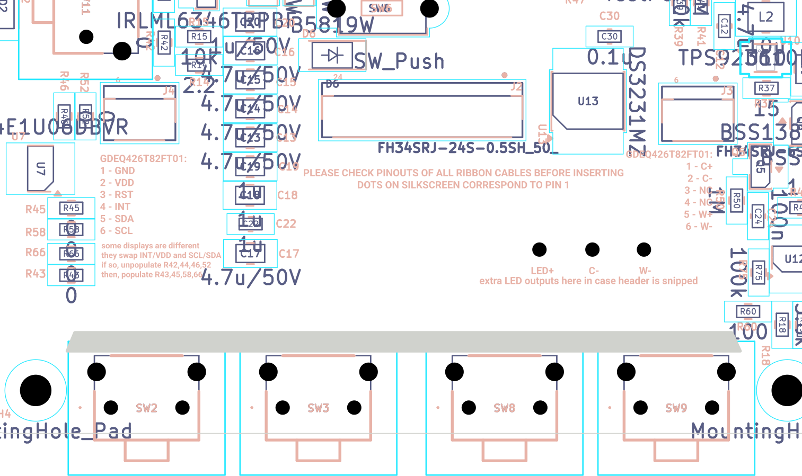
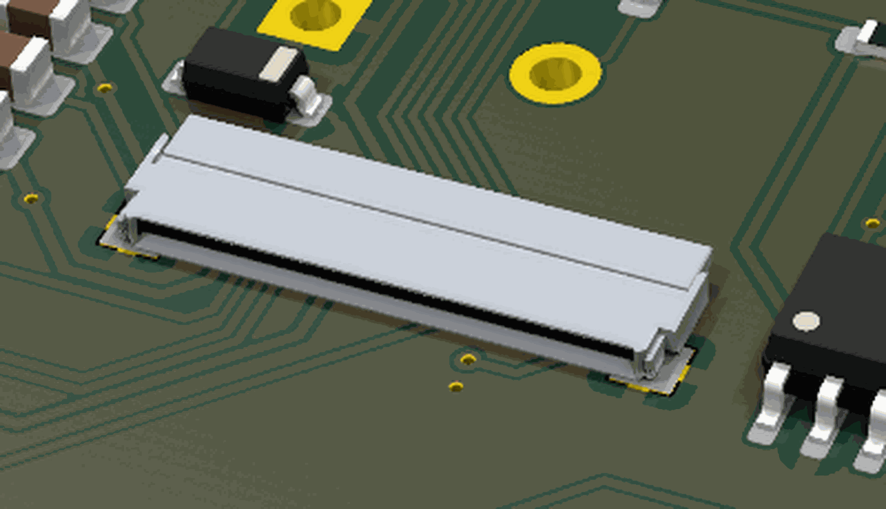
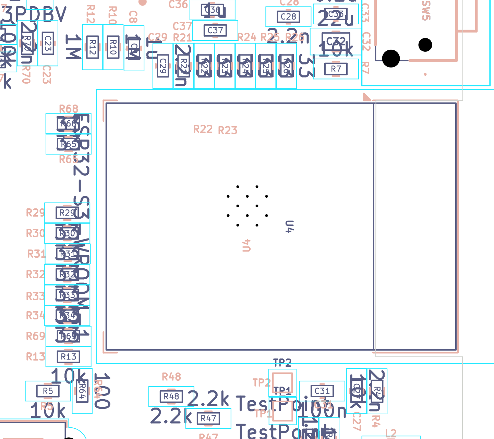
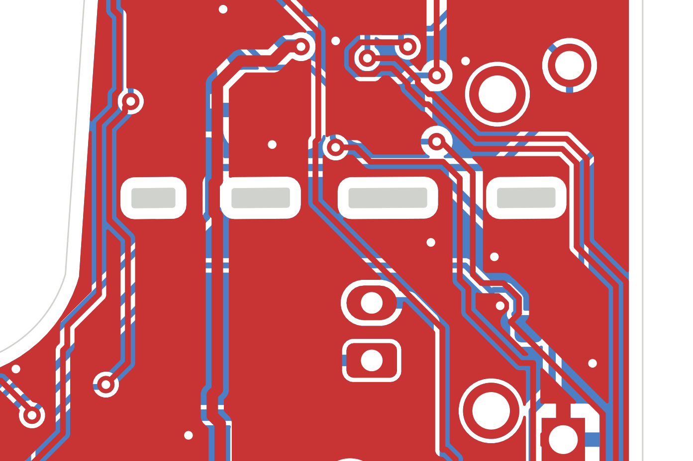

# Physical layout, enclosure design constraints, cable/wire routing and assembly

*Final review 2026-09-19 — reviewer key `mech`, finding IDs `MEC-nn`.
Every dimension here comes from `silkscreen_pcb.kicad_pcb` (read with `pcbnew`) or from
`evidence/pcb/board_extract.json`, or from a manufacturer datasheet cited at the end. Nothing is measured off
an image. Board coordinates are KiCad mm with **Y growing downward**. To keep the numbers readable I also use
**board-local coordinates** `X = x − 44.2375`, `Y = y − 37.000`, so the board occupies X 0 … 60.00 mm,
Y 0 … 111.25 mm.*

---

## What this part of the board does

This is not a schematic block — it is the *product* view. If you hold the finished thing in your hand: where
is everything, what sticks out, what has to be plugged in, and what does the person designing the plastic
case have to work around?

The physical concept, reconstructed from the board geometry and then confirmed against the board's own
silkscreen notes and the project docs:

* The PCB is **60.00 × 111.25 mm, 1.6 mm thick, 2 layers**, and **175 of its 183 footprints are on the
  BOTTOM side**. The top face is almost bare and carries artwork.
* A **4.26 inch e-paper panel (GDEQ0426T82-FT01C, 105.33 × 62.37 × 1.98 mm)** lies flat on the **TOP** face.
  It is *wider than the PCB* (62.37 vs 60.00 mm), so it is retained by the case, not by the board.
* The panel's three flat flexible cables ("flexes"/FPCs — thin printed-plastic ribbons) drop through a
  **47.04 × 1.30 mm routed slot** near the bottom edge, fold back under the board, and plug into
  **J2 / J3 / J4 on the BOTTOM face**.
* The board is not a rectangle. It has (1) a **narrow tab** up the right-hand side carrying the expansion
  header, power button and battery connector, which leaves (2) a **large open pocket** beside it — and
  `docs/HARDWARE.md` §15 confirms that pocket is the battery bay ("the battery now sits in a cut-out *in*
  the PCB rather than stacked on top") — and (3) a **rectangular bite out of the left edge** which is the
  ESP32 antenna keep-out.
* User input is **ten side-actuated tactile switches** whose plungers poke out past the board edge: four
  along the bottom edge (the row under the screen), two on the left edge, three on the right edge, plus a
  recessed reset.

Jargon, once:
* **FPC / flex** — flat flexible printed cable, the ribbon that comes off an e-paper panel.
* **Courtyard** — KiCad's "keep other parts out of here" outline. Usually bigger than the part.
* **B.Fab** — KiCad's mechanical drawing of the part body on the bottom side. I use it as the in-file
  estimate of real body extent and I say so each time; where a datasheet lets me correct it, I do.
* **THT** — through-hole; **SMD** — surface mount; **DNP** — "do not populate".

---

## Circuit walk-through — the mechanical bill of materials

Only parts with a mechanical consequence. "Checked against datasheet?" refers to *height / outline /
actuation*, not electrical behaviour (other reviewers own that).

| Ref | Part / value | Role | Checked against datasheet? |
|---|---|---|---|
| J1 | GCT **USB4085** USB-C receptacle, THT/SMD hybrid, top-mount | Charge + flash, right edge | Yes — profile height 3.46 mm |
| J2 | Hirose **FH34SRJ-24S-0.5SH** | 24-pin panel flex, 0.5 mm pitch | Yes — 1.00 mm high, back-flip lock |
| J3 | Hirose **FH34SRJ-6S-0.5SH** | 6-pin **front-light** flex (silk C+/C−/NC/NC/W+/W−) | Yes |
| J4 | Hirose **FH34SRJ-6S-0.5SH** | 6-pin **touch** flex (silk GND/VDD/RST/INT/SDA/SCL) | Yes |
| J5 | JST **S2B-PH-K-S**, 2-pos 2.00 mm, **side entry** | LiPo battery | Partly — mouth direction resolved from the KiCad footprint + 3D render; JST PDF would not parse |
| J6 | Sullins **PPPC062LJBN-RC**, 2×6 0.1 in, **right-angle** socket | Expansion / "Development Header" | Partly — orientation confirmed from the 3D model; body height not verified |
| J7 | **TF-PUSH / MEM2075** microSD push-push | SD card | No — dual-source footprint, see MEC-15 |
| U4 | Espressif **ESP32-S3-WROOM-1** | MCU module, 18.0 × 25.5 × 3.1 mm | Yes |
| SW1, SW4, SW10 | APEM **MJTP1117** right-angle tactile | Right edge: DWN1, UP1, PWR | **Yes — full drawing** |
| SW5, SW7 | APEM **MJTP1117** | Left edge: DWN2, UP2 | Yes |
| SW2, SW3, SW8, SW9 | APEM **MJTP1117** (alt land: MJTP1243) | Bottom edge: RIGHT, LEFT, OK, BACK | Yes |
| SW11 | APEM **MJTP1117** | **RESET** (ESP32_EN via R63) — recessed, see MEC-09 | Yes |
| SW6 | APEM **MJTP1243** 6 × 3.5 × H4.3, vertical | **BOOT** (ESP32_IO0 via R64) — **`dnp`** | Yes |
| H1–H5 | M2 holes, 2.2 mm drill, 2.6 mm pad, 3.8 mm annulus, GND-plated | Screw bosses | n/a — geometry from file |
| D2 | 1206 LED (LTST-C150KRKT) | USB-present indicator, 0.59 mm from the right edge | n/a |
| L1 | APV **ANR5040** shielded inductor, 5.0 × 4.0 mm | EPD boost | No — height not verified |
| TP3/TP4/TP5 | 2.54 mm pin-header land, **TOP side, `dnp`** | Spare front-light outputs `LED+`/`C−`/`W−` *under the panel* | n/a |

---

## Where it is on the board & layout notes

### The outline, feature by feature

All coordinates are `Edge.Cuts` **centrelines** straight out of the board file.

| Feature | KiCad mm | Board-local (X, Y) | Size |
|---|---|---|---|
| Top edge | y = 37.000, x 86.96 → 102.56 | Y = 0, X 42.73 → 58.32 | only 15.6 mm long |
| Right edge | x = 104.2375, y 39.0 → 146.5 | X = 60.00, full height | 107.5 mm |
| Bottom edge | y = 148.25, x 45.80 → 102.49 | Y = 111.25 | 56.7 mm |
| Left edge (upper) | x = 44.2375, y 68.5 → 93.3 | X = 0, Y 31.5 → 56.3 | 24.8 mm |
| Left edge (lower) | x = 44.28, y 112.0 → 146.73 | X ≈ 0.04, Y 75.0 → 109.7 | 34.7 mm |
| **Antenna notch** | x 44.2375 → 50.59, y 93.30 → 112.00 | X 0 → 6.35, Y 56.3 → 75.0 | **6.35 deep × 18.70 tall** |
| Main-body top edge | y = 67.5, x 44.99 → 81.24 | Y = 30.5, X 0.75 → 37.0 | 36.25 mm |
| Diagonal (pocket wall) | (84.2375, 64.5) → (86.0546, 37.957) | (40.00, 27.50) → (41.82, 0.96) | 26.6 mm, ~3.9° off vertical |
| Fillet, body → diagonal | arc r = 4.43, centre (79.99, 63.25) | — | generous, good |
| Corner radii | TR 2.01 · BR 1.75 · BL 1.50 · TL 0.75 mm | — | inconsistent, MEC-18 |
| **Flex slot** | x 51.26 → 98.30, y 141.20 → 142.50 | X 7.02 → 54.06, Y 104.2 → 105.5 | **47.04 × 1.30 mm** |
| **Cut-line slots ×4** | y 61.60 → 62.12; x 86.62–87.95, 90.09–91.92, 94.15–96.67, 99.29–101.12 | Y 24.6 → 25.1 | each **0.516 mm** wide |

In plain terms the board is **a 60 × 80.75 mm rectangle (Y 30.5 … 111.25)** with

1. a **19–20 mm wide tab** running up the right side to the top (Y 0 … 30.5),
2. a **~38.8 × 30.5 mm open pocket** left of that tab — no PCB at all — which is the battery bay,
3. a **6.35 × 18.70 mm bite** out of the left edge at the ESP32 antenna, and
4. a **47 mm slot** 5.75 mm up from the bottom edge for the display flexes.

### ASCII map — viewed from the TOP (the display side); all parts are on the far side

```
  X=0                     20                    40                 60 (mm)
  +------------------------------------------------------------------+
Y=0                              :  BATTERY BAY   :  +--------------+   <- top edge only 15.6 mm long
  :          (NO PCB HERE)                           |  J6 2x6      |  J6 body overhangs the top
  :        38.75 x 30.50 mm usable                   |  RIGHT-ANGLE |  edge by 1.69 mm; mouth
  :                                                  |  mouth -> -Y |  faces OUT of the top edge
 10                                                  +--------------+
  :                                                  | H1 M2        |
  :                                 diagonal wall -> \  SW10 PWR  ]=>  +1.01 mm past right edge
 20                                                   \ U8 D8 CR3   |
  :                                                    \ D3 CR2     |
  :   . . . . . . . . . . . . . . . . . . . . . . . . . - -  - -  - |  <- CUT LINE, 4 slots, Y 24.6-25.1
 25                                                      \          |     12 live nets thread the webs
  :                                                       \ J5 <==] |  JST-PH: MOUTH FACES +X (right!)
 30 +--------------------------------------------------------+-----+   <- main body top edge Y=30.5
  : | H2                                         H5(TOP) SW4 UP1 ]=>|   +0.99 mm
  : |                                                              |
 40 | [ SW7 UP2                     microSD J7                     |
  :<=]  +0.99 mm      (card exits to the LEFT)  ^^^^^^^^           |
  : |                                                   SW1 DWN1]=>|   +0.95 mm
 50 | [ SW5 DWN2                                                   |
  :<=]                                                             |
  : +------+  <- ANTENNA NOTCH  X 0..6.35, Y 56.3..75.0            |
 60 |      |      ESP32-S3-WROOM-1; antenna end cantilevered here  |
  : |      |      module body X 0.46..26.06, Y 56.45..74.55        |
 70 |      |                                             J1 USB-C  |
  : +------+                                             [====] -> |   mating face +1.25 mm past edge
 75 |                                                              |
  : |                                      SW11 RESET ]   D2 LED   |   SW11 stops 3.54 mm SHORT
 80 |   TP1 TP2      L1 boost    SW6 BOOT (dnp, internal)          |   D2 is 0.59 mm from the edge
  : |                                                              |
 90 |  TP3 TP4 TP5 (TOP side, dnp)    4x LOGO / QR (TOP side)      |
  : |                                                              |
100 |   J3 front-light      J2 panel 24p           J4 touch        |   <- all three mouths face +Y,
  : |   [======]          [==============]       [======]          |      i.e. toward the slot. Good.
105 |  ==========================================================  |   <- FLEX SLOT  Y 104.2..105.5
  : |  H3 o                                                 o H4   |
110 |  [SW9 BACK]   [SW8 OK]    [SW3 LEFT]    [SW2 RIGHT]           |
  +------v-----------v------------v-------------v-----------------+
         plungers protrude 1.95 mm BELOW the bottom edge
```


*Bottom-side assembly view, x 47 … 103, y 118 … 152 mm (mirrored, i.e. as seen looking at the back of the
board). The long horizontal gap is the 47.04 × 1.30 mm flex slot; J3, J2 and J4 sit above it, the four
bottom buttons below it.*

### Overhang table — everything that sticks out past the board outline

MJTP1117 numbers are corrected using the APEM drawing: the real part is **7.40 mm** along the actuation axis
and **7.30 mm** across, against a `B.Fab` of 7.45 × 7.40, so the plunger tip is **0.025 mm inside `B.Fab`**.
(Cross-checking the drawing's lead positions against the footprint's pads leaves a residual ±0.20 mm, so
treat these as ±0.2 mm.)

| Ref | Edge | Plunger / mating face past the edge | Courtyard past the edge |
|---|---|---|---|
| SW2, SW3, SW8, SW9 | bottom (y 148.25) | **+1.95 mm** | +2.97 mm |
| SW10 (PWR) | right (x 104.2375) | **+1.21 mm** | +2.24 mm |
| SW4 (UP1) | right | **+0.99 mm** | +2.02 mm |
| SW1 (DWN1) | right | **+0.95 mm** | +1.97 mm |
| SW5, SW7 (DWN2, UP2) | left (x 44.2375) | **+1.00 mm** | +2.02 mm |
| **SW11 (RESET)** | right | **−3.54 mm — recessed** | −2.51 mm |
| J1 USB-C | right | **+1.25 mm** (`B.Fab` to x 105.485) | +1.72 mm |
| J6 | **top** (y 37.000) | **−1.69 mm, i.e. body overhangs above the edge** | −2.01 mm |
| J7 microSD | left | 0 (socket mouth at x 56.125; the card itself overhangs) | 0 |

The ten MJTP1117s **do not protrude by the same amount**: bottom row +1.95 mm, side buttons +0.95 … +1.21 mm.
That is a 1.0 mm spread across groups (**MEC-08**).

### The display stack-up and the flex path

The panel is 105.33 mm long. Align its glass bottom edge with the **far edge of the flex slot (y = 142.50)**
and its top edge lands at 142.50 − 105.33 = **37.17 mm**, i.e. **0.17 mm inside the board's top edge at
y = 37.000**. Agreement to under two tenths of a millimetre is not coincidence — the board length was
dimensioned for this panel with the slot as the datum. Consequences:

* the panel covers the **entire** top face from Y 0.17 to Y 105.5, and
* the strip below the slot, **Y 105.5 → 111.25 = 5.75 mm**, is the visible bezel carrying the four bottom
  buttons and their `LEFT / OK / BACK / RIGHT` silkscreen. That works.

The panel is **62.37 mm wide against a 60.00 mm board** — it overhangs **1.185 mm on each side**.

Flex geometry, from the FT01C drawing and the board file:

| Flex | Approx. width | Tail centre on the panel (from its left datum) | Board connector | Pad-row centre |
|---|---|---|---|---|
| Front light (6 pin) | ~4 mm | 11.76 mm | **J3** | x 54.24 |
| Panel (24 pin) | ~12.5 mm | 31.11 mm | **J2** | x 73.49 |
| Touch (6 pin) | ~4 mm | 49.33 mm | **J4** | x 92.50 |

Panel tail pitch **FL→MAIN 19.35 mm**, **MAIN→CTP 18.22 mm**.
Board connector pitch **J3→J2 19.25 mm**, **J2→J4 19.74 mm**.
Front-light spacing matches to **0.10 mm** (excellent); the touch spacing is **1.51 mm wider on the board
than on the panel** (**MEC-05**). The three tails span ~43 mm and the slot is 47.04 mm wide (X 7.02 … 54.06),
centred at x 74.78 against a board centre of 74.2375 — 0.54 mm off-centre, biased the helpful way.

**Mouth direction — checked and correct.** All three connectors are `rot 180`, and the FH34SRJ is a
back-flip-lock type: the flip lever and the contact solder tails are at the *back*, the FPC enters at the
*front*, over the two metal hold-down tabs. On this board the contact pads are at y = 124.3 (back) and the
hold-down pads at y = 127.0 (front), so **all three mouths face +Y, toward the slot**. I confirmed this in
the ray-traced 3D model: the open mouth and the end tabs are on the +Y long face.


*J2 in the 3D render. In this view image-right is board −x and image-down is board +y (established from H1 vs
H5 and U8 vs H1). The dark open mouth and both end tabs are on the lower-left long face = board +Y = the
slot side.*

Slot-to-connector run on the bottom face:

| | J3 (front light) | J2 (panel) | J4 (touch) |
|---|---|---|---|
| Connector far edge (`B.Fab` max y) | 127.864 | 127.614 | 127.820 |
| Slot near edge (y) | 141.200 | 141.200 | 141.200 |
| **Free run** | **13.34 mm** | **13.59 mm** | **13.38 mm** |

### Where the battery goes, and the problem with J5

There is no PCB at all in **x 44.24 … 82.99, y 37.00 … 67.50** — bounded right by the diagonal wall, below by
the main-body top edge. Usable rectangle **38.75 × 30.50 mm**, open through the full depth of the case.
`docs/HARDWARE.md` §15 names this as the battery location.

**But J5 faces the wrong way.** I resolved its orientation two independent ways:

1. *From the footprint.* KiCad's `JST_PH_S2B-PH-K_1x02_P2.00mm_Horizontal` draws its `F.Fab` body over local
   x −1.95 … 3.95, y −1.35 … 6.25, with a 4.5 × 1.6 mm recess (the shroud mouth) in the **local −y** face.
   On this board J5 is at (94.850, 67.500) `rot 90`, flipped, with pad 1 (B−) at y 67.5 and pad 2 (B+) at
   y 65.5. That fixes the transform as local +x → board −y and **local +y → board −x** (a reflection, as it
   must be for a bottom-side part), which puts the mouth recess at **board x 94.60 … 96.20, opening toward
   +x** — toward the right board edge.
2. *From the 3D render.* The shroud's open face and its two contacts point toward board +x; the closed body
   bulk sits on the −x side, at x 88.6 … 94.6.

So the mating PHR-2 plug is inserted from the right-hand side and **the battery leads leave J5 heading +x,
directly away from the battery bay, which is ~12 mm away on the −x side.** The wires then have to turn back
through roughly 180° and run about 18 mm across the tab (over R62, past SW4's body) before they can reach the
cell. See **MEC-04**.

One consolation: this wire path stays at y ≈ 63 … 68, i.e. **below the cut line** (y 61.6 … 62.1) and nowhere
near the ESP32 antenna (opposite corner, ~60 mm away), L1 (y 112.3) or L2 (y 119.1). So the two hazards I was
specifically asked to look for — battery wires over the antenna or over the boost converters — **do not
occur**.

### The antenna notch

`U4` (ESP32-S3-WROOM-1) is at (57.500, 102.500) `rot −90`, `B.Fab` x 44.700 … 70.300, y 93.450 … 111.550 — the
module's 25.5 mm axis along x with the **antenna end at low x**. Its castellated pads only begin at
x = 52.240. The board is cut away under x 44.2375 … 50.59, y 93.3 … 112.0, so the antenna end of the module
(x 44.70 … 52.24, ~7.5 mm) is **cantilevered over open air**, exactly as Espressif's module layout guidance
asks. The notch is 18.70 mm tall against the module's 18.0 mm width — 0.35 mm of margin each side. Done right.


*Bottom-side assembly, x 42 … 78, y 86 … 118 mm (mirrored). The rectangular bite in the board edge sits under
the module's antenna end; no copper, part or hole intrudes.*

### The "cut here for a smaller display" line

Four `Edge.Cuts` slots at y 61.60 … 62.12, each **0.516 mm wide**. The board's own bottom silkscreen at
(103.60, 65.30) explains them:

> `this long end of the board can be cut for smaller displays / if so, unpopulate R36 and R73 / and then,
> populate R72/R74 / this will swap power button to UP2 / depopulate SW5 (DOWN2) if you please`

At y = 61.85 the tab is **19.82 mm wide** (x 84.42 … 104.2375). The slots remove 7.50 mm; **12.32 mm of solid
FR4 remains** in five webs of 2.20 / 2.14 / 2.23 / 2.62 / 3.12 mm. **Twelve live nets thread those webs.** I
enumerated every track crossing the band and they are exactly J6's twelve signals — `3V3, I2C_SDA,
UNUSED_GPIO_3, I2C_SCL, C−, P+ (BAT+), GND, UNUSED_GPIO_46, UNUSED_GPIO_45, GND, LED_SW, W−` — plus the GND
pour on both layers. That is internally consistent (cutting here is meant to remove J6, SW10/PWR and the
expansion ESD cluster), but see **MEC-02** and **MEC-03**.


*X-ray of both copper layers, x 82 … 106, y 55 … 71 mm (top view). The four black slots are the cut line; the
tracks visibly thread the gaps between them. `P+` — raw battery positive — is one of them.*

---

## Calculations

**1. Panel length vs board length.**
Board Y-extent 37.000 → 148.250 = 111.250 mm; slot far edge y = 142.500.
Panel 105.33 mm ⇒ top edge at 142.500 − 105.33 = **37.17 mm**, 0.17 mm inside the board's top edge.
Bezel below the slot = 148.250 − 142.500 = **5.75 mm**.

**2. Panel width vs board width.**
Board 104.2375 − 44.2375 = 60.000 mm; panel 62.37 mm ⇒ overhang **(62.37 − 60.00)/2 = 1.185 mm per side**.

**3. Do the panel edges clear the side-button plungers?**
Panel x-extent if centred: 74.2375 ± 31.185 = **43.05 … 105.42 mm**.
Right-most plunger tip (SW10) = 105.450 ⇒ **0.03 mm inside the panel edge.**
SW4 = 105.232 (0.19 inside), SW1 = 105.187 (0.23 inside).
Left-most plunger tip (SW5/SW7) = 43.242 ⇒ **0.19 mm inside the panel edge.**
So in plan view the plungers and the panel edges coincide to within ±0.25 mm. They are at different heights
(panel above the board, buttons below it) so nothing collides, but a single case wall cannot both retain the
panel edge and clear the buttons. **MEC-07.**

**4. Flex tail budget (24-pin panel flex → J2).**
The FT01C drawing puts the tail end **23.86 mm** below the glass edge (main) and **24.18 mm** (FL/CTP).
Required path, panel edge to seated in J2:
```
  vertical drop through the 1.6 mm board ..............  1.60 mm
  run along the bottom face to J2's far edge ..........  13.59 mm
  insertion depth into an FH34SRJ ..................... ~3.0 mm
  two ~90 deg bends at radius r ....................... 2 x (pi/2) x r
                                                         = 1.57 mm at r = 0.5 mm
                                                         = 3.14 mm at r = 1.0 mm
  ---------------------------------------------------------------
  total at r = 0.5 mm ................................. 19.76 mm   -> slack 4.10 mm
  total at r = 1.0 mm ................................. 21.33 mm   -> slack 2.53 mm
```
Long enough, but the slack is small enough that **the panel must sit with its glass edge at the slot**, not
2–3 mm short. The 6-pin tails are 0.32 mm longer with 0.25 mm less run, so they have slightly more slack.
Confidence: medium — the 23.86 mm is scaled from the vector geometry of the manufacturer drawing, not a
printed dimension (**MEC-17**).

**⚠ MEC-23 eats most of this.** If the panel has to stand off the board by 1.5 mm to clear the through-hole
lead ends, add 1.5 mm to the vertical drop: the totals become 21.26 mm (r = 0.5) and 22.83 mm (r = 1.0),
leaving **2.60 mm and 1.03 mm of slack**. At a 1 mm bend radius with a 1.5 mm standoff the tail is
essentially exactly long enough and nothing is left for tolerance. Resolving MEC-23 by clipping the leads
flush rather than by standing the panel off is therefore the better answer.

**5. Bend radius vs slot width.**
Slot 1.30 mm wide, board 1.60 mm thick, panel FPC **0.30 mm thick** ("FPC+PI thickness 0.3mm" on the FT01C
drawing). The flex must enter from the top, turn down, pass through, and turn again to lie on the bottom.
Because the slot is *narrower than the board is thick*, the flex cannot lie diagonally in it: it must go
through near-vertically and be creased over the bottom lip. Common static-bend guidance for polyimide flex is
≥ 6 × thickness = **1.8 mm radius**; the slot offers a routed FR4 lip, i.e. effectively a crease. **MEC-01,
MEC-06.**

**6. Slot margins and the bezel bridge.**
Slot X 7.02 … 54.06, so 7.02 mm of FR4 outside its left end and 5.94 mm outside its right end. The strip
between the slot and the bottom edge is a **5.75 mm wide, 47 mm long bridge carrying four THT buttons**,
joined to the rest of the board only at those two ends. **MEC-10.**

**7. Mounting-hole geometry.** Five M2 holes, all 2.2 mm drill / 2.6 mm pad / 3.8 mm copper annulus, all on
GND (so a metal standoff bonds the case to signal ground — `HARDWARE.md` §16 flags this deliberately).

| Ref | (x, y) | (X, Y) | Pad side | Nearest edges |
|---|---|---|---|---|
| H1 | 94.241, 51.646 | 50.00, 14.65 | bottom | right 9.996 mm |
| H2 | 53.900, 70.500 | 9.66, 33.50 | bottom | left 9.663, top 3.000 mm |
| H3 | 47.987, 145.250 | 3.75, 108.25 | bottom | bottom 3.000, left 3.72 mm |
| H4 | 100.487, 145.250 | 56.25, 108.25 | bottom | bottom 3.000, right 3.75 mm |
| H5 | 94.100, 72.000 | 49.86, 35.00 | **top** | right 10.138 mm |

H3/H4 are symmetric about the board centre x = 74.2375 to **0.000 mm**. H2 and H5 are 1.500 mm apart in y, so
the upper pair is not level (**MEC-20**).

**8. Bottom-row button symmetry — the documented claim, verified.**
`HARDWARE.md` §9.1 says the bottom switches are "spaced 12 / 13 / 12 mm with a common actuator offset that
preserves mirror symmetry". Plunger (= `B.Fab`) centres:

| Button | plunger centre x | gap to next |
|---|---|---|
| SW9 BACK | 55.737 | 12.000 |
| SW8 OK | 67.737 | 13.000 |
| SW3 LEFT | 80.737 | 12.000 |
| SW2 RIGHT | 92.737 | — |

Row centre = (55.737 + 92.737)/2 = **74.237 = the board centre, to 0.000 mm.** The claim is exactly right.
(The *pad* positions look asymmetric because each switch's pads are offset from its own plunger; the
plungers are not.)

**9. Board flex under a button press.** Distances from each bottom plunger to the nearest screw: SW9→H3
7.75 mm, SW8→H3 19.75 mm, SW3→H4 19.75 mm, SW2→H4 7.75 mm. But these are *side*-actuated switches with
0.25 mm of travel and 1.77 N of force acting **in the plane of the board**, so the bending case is mild. The
real unsupported span is the right edge: SW4 (Y 33.25), SW1 (Y 47.25), SW11 (Y 78.5), J1 (Y 67.0) and D2
(Y 81.3) all sit between H5 (Y 35.00) and H4 (Y 108.25) — **73.25 mm with no support**. **MEC-14.**

**10. Battery-bay volume.** Plan 38.75 × 30.50 mm. Less ~1 mm of wall and clearance all round →
about **36.7 × 28.5 mm** of usable cell footprint. Depth is set by the back cavity (below). With a ~7 mm
cavity a **5 × 30 × 35 mm (503035, ≈500 mAh)** cell fits comfortably and a 6 mm cell still fits;
**anything 40 mm long will not.** No screw head and no tall part is inside the bay — H2 is 3.00 mm clear of
its lower boundary. Allow ~10 % of cell thickness (≈0.5 mm on a 5 mm cell) for swelling.

**11. MJTP1117 geometry, from the APEM drawing** (this is the number that sizes the whole back cavity):

| Property | Value |
|---|---|
| Body | 6.0 × 3.5 mm |
| Plan footprint | **7.40 mm** (actuation axis) × **7.30 mm** (lead axis) |
| **Body height above the PCB** | **6.80 mm** |
| **Plunger axis above the PCB** | **4.30 mm** |
| Plunger proud of the body face | **1.40 mm** |
| Plunger size | ≈1.5 mm |
| Lead spacing / ground-tab offset | 5.00 mm / 2.50 mm |
| Lead length below the board | 2.50 mm |
| **Travel** | **0.25 mm** (+0.20 / −0.10) |
| **Operating force** | **180 gf ± 50 gf = 1.77 N ± 0.49 N** |
| Life | 100 000 cycles |

0.25 mm of travel and ~1.8 N of force is a **short, stiff** button. A case flexure or cap must not consume
any of that 0.25 mm as lost motion, and must not preload the plunger. Design the cap so it bottoms on the
case, not on the switch.

---

## Height table and minimum enclosure cavity

"Above its own face" = away from the board. The bottom side is the back of the finished device.

| Ref | Part | Side | Height | Source |
|---|---|---|---|---|
| — | GDEQ0426T82-FT01C panel | TOP | **1.98 mm** | Good Display (1.41 mm for the non-front-light T01C) |
| H5 | M2 pad, no body | TOP | 0 | screw head lives here |
| TP3/4/5 | 2.54 mm header, **dnp** | TOP | 0 as shipped (~11.5 mm if ever fitted) | MEC-16 |
| **SW1–SW5, SW7–SW11** | **MJTP1117** | bottom | **6.80 mm — tallest part on the board** | APEM drawing |
| J6 | PPPC062LJBN-RC, right-angle 2×6 | bottom | ~5–6 mm *(not verified)* | see Open questions |
| J5 | JST S2B-PH-K | bottom | ~5.8 mm body *(not verified)*; more with the plug + wires | see Open questions |
| SW6 | MJTP1243, **dnp** | bottom | 4.3 mm (not fitted) | APEM |
| J1 | GCT USB4085 | bottom | **3.46 mm** | GCT |
| U4 | ESP32-S3-WROOM-1 | bottom | **3.10 mm** | Espressif |
| L1 | APV ANR5040 | bottom | ~3.0 mm *(not verified)* | — |
| D3 | SMAJ26A, DO-214AC | bottom | ~2.3 mm | — |
| J7 | microSD push-push | bottom | ~1.85 mm | — |
| J2/J3/J4 | FH34SRJ | bottom | **1.00 mm** + the flex on top | Hirose |
| 0805 MLCC | various | bottom | ≤ 1.45 mm | — |

**Minimum internal cavity, PCB top face as datum:**

* **Above the top face: 1.98 mm** of panel, plus the bezel lip. Allow **2.5 mm**.
* **Below the bottom face: 6.80 mm** — set by the ten MJTP1117s, not by any connector. Allow **7.5 mm** so
  the J5 plug and the battery leads have somewhere to go.
* **Total minimum internal stack: 1.98 + 1.60 + 6.80 = 10.38 mm.** With walls, a realistic closed case is
  **13–14 mm thick**.

If the optional **front-mounted MJTP1243** bottom buttons are used instead, add **4.3 mm of cavity above the
top face** in the bezel strip — see MEC-11.

---

## Findings

| ID | Severity | Finding | Evidence | Recommendation |
|---|---|---|---|---|
| MEC-01 | **HIGH** | The **1.30 mm** flex slot is the only path for three flexes and is narrower than the board is thick | `Edge.Cuts` polygon x 51.261…98.300, y 141.200…142.500; board 1.60 mm; panel FPC 0.30 mm | Widen to **≥ 2.5 mm** (3 mm preferred) and radius/chamfer the lips. A 3 mm slot still leaves 4.05 mm of the 5.75 mm bezel |
| MEC-02 | **HIGH** | The "cut for smaller displays" line severs **BAT+ (`P+`) with GND pour 0.15–0.20 mm away on both layers**; sawing with a cell connected can short the LiPo | `P+` on F.Cu at x 89.39, 0.40 mm wide, crossing y 61.59…62.11; GND zone on both layers; J5 is 5 mm away | Add a bold silk warning **"DISCONNECT BATTERY BEFORE CUTTING"**; better, add a 2 mm copper keep-out band centred on y = 61.86 or route `P+` to J6 away from the cut line |
| MEC-03 | **MEDIUM** | The cut line will not snap: **12.32 mm of solid FR4 in 5 webs across a 19.82 mm tab (62 %)**, 11 live nets and two pours crossing; 0.516 mm slots are below common fab minimums | slot widths 1.325 / 1.825 / 2.525 / 1.825 mm; webs 2.20 / 2.14 / 2.23 / 2.62 / 3.12 mm; 11 nets enumerated — 10 of J6's, **plus `Net-(R62-Pad1)`, which is the PWR button SW10 and *not* a J6 net (MEC-V02)** | Commit to "saw and file" and say so on the silk, or add a true V-score / mouse-bite line. The fab-minimum half is already flagged in `README.md`; the mechanical half is not |
| MEC-04 | **MEDIUM** | **J5's mouth faces +x, away from the battery bay.** The leads leave the plug heading toward the right board edge and must U-turn ~180° and run ~18 mm back across the tab to reach the cell | Footprint fab recess maps to board x 94.60…96.20 opening +x (derivation above), confirmed in the 3D render; bay is at x 44.24…82.99 | Rotate J5 by 180° so the mouth faces −x. If that cannot be done this spin, the case must provide a wire channel that carries the loop around SW4 and a strain-relief post, and the assembly doc must show it |
| MEC-05 | **MEDIUM** | Touch-flex spacing mismatch: J2→J4 is **19.74 mm** but the panel's MAIN→CTP tails are **18.22 mm** apart — 1.51 mm of permanent side-load on the touch tail | pad-row centres x 73.4875 / **93.2300** (J4's footprint *origin* reads 92.500 — it is 0.730 mm off its own pads, see **MEC-V01**); FT01C drawing tail centres 31.11 / 49.33 mm | Measure a real panel; if confirmed, shift J4 ~1.5 mm toward J2 — there is room (J4's courtyard ends at x 96.005, R52 is at x 97.00) |
| MEC-06 | **MEDIUM** | Flex bend radius at the slot lips is effectively zero against a ≥1.8 mm guideline for 0.3 mm polyimide | calculation 5 | Radius the slot lips, and/or mould a "flex saddle" into the case that the tails wrap over |
| MEC-07 | **MEDIUM** | Only **±0.25 mm** of plan-view daylight between the panel's side edges and the side-button plungers | panel x 43.05…105.42; plunger tips 43.242 and 105.450 | Use a two-part case: a front bezel lapping over the panel from above, and a back shell whose side walls sit *outside* the plunger tips with the button slots in them. Do not try to share one wall |
| MEC-08 | **LOW** | Plunger protrusion is inconsistent between button groups: bottom row **+1.95 mm**, side buttons **+0.95 / +0.99 / +1.21 mm** | overhang table | Re-centre the bottom row ~0.95 mm inboard so all ten MJTP1117s protrude equally; otherwise the case needs two or three different plunger depths |
| MEC-09 | **MEDIUM** | **SW11 (RESET) stops 3.54 mm short of the board edge, and D2 sits 1.23 mm beyond the plunger tip on the plunger's own axis** — there is no straight path from outside to the reset | SW11 `B.Fab` x 93.275…100.725, body centreline y 118.02; D2 `B.Fab` x 101.950…103.650, y 116.694…119.994; right edge 104.2375 | Move SW11 out to x ≈ 101.4 like SW1/SW4 and relocate D2, or accept it as internal-only and say so in the docs. A case plunger cannot pass over D2 |
| MEC-10 | **LOW** | The bottom bezel is a **5.75 mm wide, 47 mm long bridge** carrying four THT buttons, joined to the board only at its two ends | slot y 141.2…142.5 vs bottom edge 148.25; SW2/3/8/9 mounting pegs at y 143.95 | H3/H4 help and should stay. Warn the builder not to flex this strip during assembly; consider two 3–4 mm tie-bars across the slot (they also help MEC-01's saddle) |
| MEC-11 | **LOW** | The optional **front-mounted MJTP1243** buttons sit at y = 143.95 with a 3.5 mm body → **y 142.20…145.70, overlapping the panel's footprint (bottom edge y = 142.50) by 0.30 mm**, and needing 4.3 mm of front cavity | `HARDWARE.md` §9.1.1; pads 3/4 at y 143.950; MJTP1243 body 6 × 3.5 × 4.3 mm | Document the 0.30 mm interference and the 4.3 mm front cavity in §9.1.1; a 0.5 mm relief in the panel's bottom bezel edge, or moving the panel 0.5 mm up, clears it. (Also: SW9's alternate 3D-model offset is (−0.75, 3.00, −1.50) where SW2/SW3/SW8 use (−0.75, 2.50, −1.00) — preview-only, but it suggests the alternate land was not reviewed uniformly) |
| MEC-12 | **LOW** | **J6 is a right-angle socket** whose mouth faces out of the board's **top edge** and whose body overhangs that edge by **1.69 mm** (courtyard 2.01 mm) — 1.86 mm beyond the panel's top edge | `B.Fab` y 35.308…50.510, `B.Courtyard` y 34.990…49.062 vs top edge y 37.000; orientation confirmed in the 3D model | The case needs an aperture in its **top** wall for the expansion port, or the port is unusable when closed. Neither `HARDWARE.md` §11 nor §16 mentions the orientation or the overhang |
| MEC-13 | **LOW** | A closed unit has **no mechanical bootloader entry and no reachable reset**: SW6 (BOOT) is `dnp` and fully internal, SW11 (RESET) is recessed (MEC-09) | `connectivity_by_component.txt`: SW6 `flags=dnp`, pin 2 → `Net-(R64-Pad1)` → `ESP32_IO0`; SW6 at (79.479, 118.533), no board edge within 25 mm | The BOOT half is already documented in `README.md` ("USB-Serial-JTAG makes it unnecessary"). Add the same sentence for RESET, or fix MEC-09 |
| MEC-14 | **LOW** | The right edge is **unsupported for 73.25 mm** between H5 (Y 35.0) and H4 (Y 108.25) while carrying SW4, SW1, SW11, J1 and D2 | hole and part coordinates | Add a sixth M2 hole near (x 101, y 96–100) if a spot exists, or have the case press a rib on the board's top face there |
| MEC-15 | **LOW** | microSD card ejects toward the **left** wall from a mouth at x = 56.125 — 11.89 mm inside the edge — so the card overhangs the board when handled; the socket's own mechanical fit is already an unresolved item | J7 courtyard x 56.125…73.475; `HARDWARE.md` §"Socket footprint — an open mechanical item" | Resolve the TF-PUSH vs MEM2075 peg question first, then dimension the case slot and a finger relief at x = 44.24, y ≈ 84.6 from the chosen part |
| MEC-16 | **LOW** | TP3/TP4/TP5 are the **spare front-light outputs** (`LED+` / `C−` / `W−`, bottom silk: *"extra LED outputs here in case header is snipped"*) — but they are 2.54 mm plated through-holes at y = 135.4, **directly under the panel**. Using them as intended means soldering wires that must then escape between the panel and the board | board extract: side `top`, `dnp=True`, `PinHeader_1x01_P2.54mm_Vertical` at x 58.0 / 61.6 / 65.3, y 135.4; B.Silk label at (65.90, 137.20) and note at (69.50, 137.90); panel covers y 37.17…142.50 | Move these three pads into the 5.75 mm bezel strip (y > 142.5) or onto the back face next spin. For this build, document that a wire soldered here needs the MEC-23 standoff and a routed exit |
| MEC-17 | **LOW** | Tail-length slack is only **2.5–4.1 mm** and the panel tail length is not a printed dimension I could verify | calculation 4 | Measure a real panel before the case's slot position is frozen |
| MEC-18 | **LOW** | Four different corner radii (2.01 / 1.75 / 1.50 / 0.75 mm) | `Edge.Cuts` arcs | Harmonise; the 0.75 mm top-left corner is sharp for a hand-held product |
| MEC-19 | **LOW** | D2 (USB-present LED) is a 1206 on the **back** face, 0.59 mm from the right edge — it lights the inside of the case and will glow through the seam | D2 `B.Fab` x 101.950…103.650 vs right edge 104.2375 | Light pipe or window at (102.80, 118.34) on the back wall, plus a light-block skirt. Note this competes with MEC-09's plunger |
| MEC-20 | **LOW** | H2 (Y 33.50) and H5 (Y 35.00) are 1.500 mm out of level, so the upper boss pair is skewed | hole coordinates | Level them next spin; costs nothing and simplifies a moulded or printed boss pattern |
| MEC-21 | **DOC** | The **Enclosure** section of `docs/HARDWARE.md` §16 is 8 lines covering only GND-bonded standoffs and HV-vs-metalwork. It gives **no** cavity depth, no flex-slot dimension, no battery-bay size, no button protrusion, no panel-vs-board overhang, no port positions | `HARDWARE.md` lines 1215–1222 | Paste the cheat-sheet below into §16. A "case agnostic" board needs published dimensions more than a fixed one does |
| MEC-23 | **HIGH** | **The top face is not flat.** 58 soldered through-hole leads fall inside the panel's footprint, so their lead ends and solder fillets stand proud of the face the panel lies on — ~0.9 mm of lead plus fillet for the six side switches | Counted from the board file: J1 20 holes (ø 0.4 / 0.6), J6 12 (ø 1.02), SW1/SW4/SW5/SW7/SW10/SW11 4 each = 24 (ø 1.0 / 1.3), J5 2 (ø 0.75), all inside x 43.05…105.42, y 37.17…142.50. **Verification re-count: 78 plated holes lie inside the panel footprint.** The 58 are the solderable *component leads*, which is the right number for this finding; the other 20 are 18 × ø 0.2 mm via-in-pad inside U4 (12) and U11 (6), which can also wick solder to the top face, plus J7's 2 NPTH mechanical holes (no solder). APEM MJTP1117 lead length below the seating plane 2.50 mm − 1.60 mm board = **0.90 mm** + fillet. (SW2/SW3/SW8/SW9's 16 holes are *outside* the panel footprint — those are fine) | The case must hold the panel on a **≥ 1.5 mm standoff** above the board, or every lead must be clipped and filed flush. Whichever you choose, say so in the docs — and note it costs 1.5 mm of the 2.5–4.1 mm of flex-tail slack in calculation 4 |
| MEC-22 | **DOC** | Almost all front silkscreen is **under the panel** and unreadable: the welcome text, the four QR/logo graphics, the credits, `UP1/DWN1/UP2/DWN2/PWR`, `Development Header`. The J6 pinout textbox is **also 5.46 mm off the board** (bbox to x 109.70 vs edge 104.2375) and is clipped at both ends | F.Silk item positions y 44…137 vs panel covering y 37.17…142.50; KiCad DRC `silk_edge_clearance` at (104.24, 39.0) | Move anything meant to be read to the back face or into the 5.75 mm bezel. Pull the J6 pinout label fully on-board and put it on `B.Silkscreen`. (`HARDWARE.md` §9.1.1 already admits the bottom-button legends get covered by the front-mount option — the same problem applies board-wide) |
| MEC-V01 | **MEDIUM** | **J4's footprint origin sits 0.730 mm away from its own pad centroid**, so every position-derived document mislocates J4 — including this section's first draft | `J4` `GetPosition()` = (92.500, 126.000) but its 8 pads span x 90.730…95.730 (centre **93.2300**) and its `B.Fab` spans x 90.666…95.793 (centre 93.2295). J3, the identical `HRS_FH34SRJ-6S-0.5SH` footprint, is anchored correctly: position x 54.237 vs pad centre 54.2375. So J4's footprint *instance* has been displaced +0.730 mm in x (and −0.044 mm in y) relative to its anchor. DRC is clean because the copper is self-consistent | Re-anchor J4 next spin. Before then: **do not generate a pick-and-place file for an assembly house without checking J4** — KiCad exports the footprint origin, and a 0.73 mm error on a 0.5 mm-pitch FPC connector is more than one pitch. (I could not check this directly: `evidence/pcb/positions_all.csv` is missing from the evidence pack.) Hand-soldering to the pads is unaffected |
| MEC-V02 | **MEDIUM** | **Cutting the board on the "cut for smaller displays" line also amputates the PWR button (SW10)**, not just the expansion header — and nothing says so | `Net-(R62-Pad1)` crosses the cut midline at x = 102.112 on B.Cu (0.200 mm wide), running from R62 (101.20, 66.40, below the line) up to SW10 (101.705, 52.250, on the tab). `connectivity_by_component.txt`: SW10 pin 1 → `Net-(R62-Pad1)`, pin 2 → `3V3`. SW10 is the button the front silk labels `PWR` | Say on the silkscreen and in `README.md` that the cut removes **J6 *and* the PWR button**. After the cut the resistor ladder is left with a dangling branch at R62, so the firmware's button map also changes |

### Notes on the non-trivial findings

**MEC-01 — the flex slot.** This is the one I would not order without changing. Three flexes, one of them
12.5–13 mm wide, all pass through a single 1.30 mm gap in a 1.60 mm board and then turn 90° to lie flat.
Because the slot is narrower than the board is thick, the flex cannot sit diagonally: it goes through
vertically and is creased over the bottom lip. Laterally there is plenty of room (20.5 mm of flex in a 47 mm
slot) — it is purely the 1.30 mm dimension. Widening to 2.5–3.0 mm costs nothing and turns a crease into a
fold.

**MEC-02 — cutting the board with a LiPo attached.** The silkscreen invites the owner to saw the top off the
board. The saw line passes through a 0.40 mm `P+` track — raw battery positive, 3.0–4.2 V, behind which sits a
cell that can deliver amps — flanked by GND pour on both layers at the 0.15–0.20 mm design clearance. Sawing
and filing FR4 smears copper. A LiPo shorted through a copper smear at the cut face is a fire, not an
inconvenience. The fix is cheap: a 2 mm copper keep-out band on the cut line, or a different route for `P+`,
plus a printed warning. Note that `README.md` already warns that these slots are below JLC's minimum slot
width — so the slots have been thought about, just not from the battery-safety angle.

**MEC-04 — the battery connector faces the wrong way.** I want to be precise about confidence here, because
it is the kind of claim that is easy to get backwards. The KiCad footprint's fab outline has an unambiguous
4.5 × 1.6 mm recess — the shroud mouth — in its local −y face. Pad 1 at board (94.850, 67.500) and pad 2 at
(94.850, 65.500) pin the transform completely: local +x must map to board −y, and the fab bbox then forces
local +y → board −x (a reflection, correct for a bottom-side part, and it reproduces the observed
`B.Fab` x 88.550…96.250 exactly, where the other handedness would give 93.5…101.1). That puts the mouth at
board x 94.60…96.20 opening toward +x. The 3D render agrees: the open face and contacts point toward board
+x, the solid body bulk sits at x 88.6…94.6. **Confidence: high.**
The consequence is not fatal — the wires can be looped — but it is exactly the sort of thing that makes a
first assembly frustrating, and it puts a loop of battery wire next to SW4, the UP1 button. It also means the
`− + CHECK` polarity silk at (85.30, 66.60), which *is* correctly ordered (`−` at y ≈ 68 next to pad 1 `B−`
at 67.5, `+` at y ≈ 65 next to pad 2 `B+` at 65.5), sits on the blind side of the connector rather than where
you look while plugging in.

**MEC-07 — the panel/button wall conflict.** The panel is wider than the board, and the buttons stick out
past the board — and they land within a quarter of a millimetre of each other in plan view. They are at
different heights so nothing collides, but one naive case wall cannot both retain the panel edge and clear
the plungers. A two-part case solves it.

**MEC-09 — the reset button.** SW11 is a side-actuated switch aimed at the right edge that stops 3.54 mm
short of it, and D2 sits in the remaining gap on the same centreline. Combined with MEC-13 (BOOT not fitted),
a closed unit has no mechanical reset and no mechanical bootloader entry. For an ESP32-S3 that is
survivable — the USB-Serial-JTAG peripheral can force download mode, and `README.md` says exactly that about
BOOT — but the same reasoning has not been written down for RESET, and the placement looks accidental rather
than chosen.

---

## Assembly sequence for a hobbyist

1. **Solder/reflow the bottom side first**, THT parts and buttons last. The board is deliberately
   single-sided-assembly — a good, cost-driven call that also keeps the top face flat for the panel.
2. **Flash and smoke-test with USB only, before any plastic.** This is the last moment when everything is
   reachable, and the last easy chance to use SW6's land if you decide you want a BOOT button.
3. **Fit the three flexes to J2/J3/J4 with the board out of the case and the panel loose.** The FH34SRJ ships
   with its lever already open, so do not force anything. These levers are the most breakable thing on the
   board and there is no home rework for a broken one. Follow the board's own note:
   *"PLEASE CHECK PINOUTS OF ALL RIBBON CABLES BEFORE INSERTING / DOTS ON SILKSCREEN CORRESPOND TO PIN 1"*.
4. **Feed the tails through the slot before seating the panel.** Once the panel is down on the top face you
   cannot get a finger to them. Feed the 24-pin tail first — it is the widest and the least forgiving.
4b. **Clip and file every through-hole lead on the panel side flush** before the panel goes anywhere near the
   board — the six side switches, J5, J6 and J1 all come through inside the panel's footprint (MEC-23). Run a
   straightedge or a steel rule across the top face; if it rocks, keep filing. Skipping this is the single
   easiest way to crack a panel or to find out later that the tails are 1 mm too short.
5. **Seat the panel with its glass edge right at the slot** (calculation 4 — there is only 2.5–4 mm of slack,
   and less if the panel ends up standing off the board).
6. **Plug the battery last, always last.** Route the loop deliberately (MEC-04) before the shell closes.
7. **Screws last of all.** H3/H4 clamp the 5.75 mm bezel bridge that carries the four bottom buttons; do them
   up gently and evenly.

What will bite you:
* Creasing a tail at the slot lip (MEC-01 / MEC-06). The panel is the expensive part.
* Breaking an FH34SRJ lever. Buy a spare board or spare connectors before you start.
* Pinching the battery leads between the board and the back shell as it closes — made likelier by MEC-04.
* Trying to press RESET with the case shut (MEC-09).

### Cable and wire guidance the enclosure should provide

| Feature | Where | Why |
|---|---|---|
| **Radiused flex saddle** | along the slot, Y 104.2 … 105.5, full 47 mm | turns MEC-01/MEC-06's crease into a fold |
| **Three shallow flex channels** on the back face | slot → J3 (x ≈ 54), J2 (x ≈ 73), J4 (x ≈ 92) | keeps the tails from wandering sideways or crossing each other |
| **Battery pocket** | x 44.24 … 82.99, y 37.00 … 67.50 — 38.75 × 30.50 mm | the reason the board is this shape |
| **Wire channel + 180° loop relief** | from (96.2 … 101, 66.5) around the plug, then −x along y ≈ 65 to the pocket | J5 opens the wrong way (MEC-04) |
| **Strain-relief post or clip** | near (84, 65), just inside the diagonal edge | J5 is a friction-fit 2 mm connector with no lock; a tug on the cell unseats it |
| **Chamfer over the diagonal board edge** | (84.24, 64.5) → (86.05, 37.96) | the leads otherwise rest on a square routed FR4 edge under clamping load |
| **Light block + pipe** | (102.80, 118.34), back wall | D2, MEC-19 |
| **Card slot + finger relief** | left wall at y ≈ 84.6 | microSD, MEC-15 |
| **Top-wall aperture** | x 87.2 … 103.0 at the top edge | J6 expansion port, MEC-12 |
| **Nothing conductive** | within ~10 mm of x 44.2 … 50.6, y 93.3 … 112.0 | the antenna notch |

---

## Enclosure designer's cheat-sheet

| Dimension | Value | Source |
|---|---|---|
| PCB outline | **60.00 × 111.25 mm**, 1.6 mm FR4, 2 layers | `Edge.Cuts` centrelines |
| PCB bbox incl. line width | 60.05 × 111.30 mm | `board_extract.json` |
| Display panel | 105.33 × 62.37 × 1.98 mm | Good Display GDEQ0426T82-FT01C |
| Panel position on the board | y 37.17 … 142.50; x 43.05 … 105.42 (centred) | calculations 1–2 |
| Panel overhang per side | **1.185 mm beyond the PCB** | calculation 2 |
| Visible bezel below the panel | **5.75 mm** | calculation 1 |
| Cavity above the top face | **≥ 2.5 mm** panel-only; **≥ 4.0 mm** if the panel is stood off 1.5 mm to clear the through-hole leads (MEC-23); **≥ 6.8 mm** if front-mounted buttons are used | height table, MEC-11, MEC-23 |
| Panel seating plane | flush on the top face **only if every THT lead is clipped and filed flush**; otherwise 1.5 mm proud | MEC-23 |
| Cavity below the bottom face | **≥ 7.5 mm** (6.80 mm of switch + plug/wire room) | height table |
| Total internal stack | **≥ 10.38 mm** | height table |
| Inner wall, right | **≥ x 105.6** (plunger tip 105.450) | `B.Fab` + APEM |
| Inner wall, left | **≤ x 43.1** (plunger tip 43.242) | `B.Fab` + APEM |
| Inner wall, bottom | **≥ y 150.4** (plunger tip 150.195) | `B.Fab` + APEM |
| Button plunger axis height | **4.30 mm below the board's bottom face**; travel 0.25 mm; force 1.77 N | APEM drawing |
| Button plunger size | ≈1.5 mm; 1.40 mm proud of the body | APEM drawing |
| Bottom-button plunger centres | x = 55.737 / 67.737 / 80.737 / 92.737 (12 / 13 / 12 mm, centred on the board) | calculation 8 |
| Side-button plunger centres | left y = 75.25, 89.25; right y = 70.25, 84.25, 52.25 (PWR) | pad geometry |
| USB-C mating face | x = 105.485, centred on y = 103.975; aperture ≥ 9.3 × 3.6 mm | `B.Fab` + GCT 3.46 mm |
| microSD slot | left wall, centred y = 84.6, aperture ≥ 12 × 2.2 mm | J7 |
| Expansion-port aperture | top wall, x 87.2 … 103.0, ~6 mm tall | J6 |
| Battery bay | **38.75 × 30.50 mm** at x 44.24 … 82.99, y 37.00 … 67.50 | outline |
| Battery lead exit | J5 mouth at x 96.20, y 63.5 … 69.5, opening **+x** | MEC-04 |
| Flex slot | 47.04 × 1.30 mm at x 51.26 … 98.30, y 141.20 … 142.50 | `Edge.Cuts` |
| Antenna keep-out | x 44.24 … 50.60, y 93.30 … 112.00, plus ~10 mm of air | outline + U4 |
| Mounting bosses | M2 × 5: (94.241, 51.646) (53.900, 70.500) (47.987, 145.250) (100.487, 145.250) (94.100, 72.000) | H1–H5 |
| Boss diameter | ≤ 3.8 mm copper annulus → keep bosses ≤ 4.2 mm; **all five are GND-plated** | H1–H5 pad stack |
| Status-LED window | (102.80, 118.34), back face | D2 |
| Cut line (optional shortening) | y = 61.86, x 84.42 … 104.24 | `Edge.Cuts` + board silk |

---

## Checked and found OK

* **All three FPC mouths face the flex slot (+Y).** Checked from the FH34SRJ's back-flip-lock construction,
  the contact-vs-hold-down pad positions (y 124.3 vs y 127.0) and the 3D model. J2, J3 and J4 are all `rot
  180`, consistently.
* **The panel length matches the board to 0.17 mm** and the flex slot is the datum that makes it work.
* **The 6-pin front-light flex spacing matches the panel to 0.10 mm** (J3→J2 19.25 mm vs FL→MAIN 19.35 mm).
* **Antenna keep-out is done properly.** The board is cut away under the WROOM-1's antenna end; the notch is
  18.70 mm against the module's 18.0 mm; no copper, part, hole or track intrudes. The battery leads, the two
  boost inductors L1/L2 and every connector are on the far side of the board from it.
* **No component, pad, hole or track falls inside the flex slot or the four cut-line slots.** I checked every
  footprint bounding box against both, and every track crossing the cut-line band threads a web — nearest
  approaches are `P+` at x 89.39 to the slot edge at 90.091 (0.70 mm) and `W−` at 101.95 to 101.117
  (0.83 mm). KiCad DRC reports **zero `copper_edge_clearance` violations** anywhere on the board.
* **The cut line is internally consistent with its purpose.** ~~All twelve nets crossing it are exactly J6's~~ — **refuted by verification: 11 distinct nets cross the line, and one of them (`Net-(R62-Pad1)`) is the PWR button SW10, not J6. See MEC-V02.** The remainder are J6's
  twelve signals — nothing else is severed by the cut.
* **Bottom-row button symmetry is exactly as documented**: plunger centres 55.737 / 67.737 / 80.737 /
  92.737 mm, gaps 12.000 / 13.000 / 12.000 mm, row centre 74.237 mm = the board centre to 0.000 mm.
* **H3/H4 are symmetric about the board centreline to 0.000 mm.**
* **The MJTP1243 alternate land matches the documentation**: pads 3/4 are ø 1.30 mm drills with 1.95 mm rings
  exactly 7.000 mm apart, netless, as `HARDWARE.md` §9.1.1 describes.
* **J6's pinout matches `HARDWARE.md` §11 pin for pin** — row 1 (y 47.97) GND / IO46 / IO45 / GND / LED_SW /
  W−, row 2 (y 45.43) 3V3 / SDA / IO3 / SCL / C− / P+.
* **Button naming matches everywhere I could check it.** `HARDWARE.md` §16 says "Bottom edge, left-to-right
  facing the screen: BACK · CONFIRM · LEFT · RIGHT" — on the top face x increases to the right, and the
  plungers are BACK 55.737, OK 67.737, LEFT 80.737, RIGHT 92.737. Side buttons: UP1 (SW4, y 70.25) above
  DWN1 (SW1, y 84.25) on the right; UP2 (SW7, y 75.25) above DWN2 (SW5, y 89.25) on the left. All match the
  front silkscreen legends.
* **J5's polarity silk is correct**: `−` at y ≈ 68 beside pad 1 (`B−`, y 67.5), `+` at y ≈ 65 beside pad 2
  (`B+`, y 65.5).
* **Only 8 footprints are on the TOP side and none is a real component** — four `G***` LOGO graphics
  (x 51.4 / 72.2 / 82.2 / 92.2, y ≈ 136.1), the H5 mounting hole (94.100, 72.000), and the three `dnp`
  spare front-light output lands TP3/TP4/TP5 (x 58.0 / 61.6 / 65.3, y 135.4). No *body* sits on the top face,
  which matches the board's own note *"All components will be on the back of this board"* — but note that the
  face is still not flat, because 58 through-hole leads come through it (**MEC-23**).
* **The battery bay contains no tall part and no screw head.** H2 is 3.00 mm clear of its lower boundary.
* **Assembly-critical silkscreen exists and is on the correct (component) face**: the J3 and J4 pinout
  tables, the "check pinouts before inserting / dots = pin 1" warning, the J5 polarity marker, the
  display-variant rework notes (R42/44/46/52 vs R43/45/58/66) and the board-shortening note. This is
  unusually good documentation-on-copper for a hobby board.
* **No mechanical DRC class is violated**: zero courtyard overlaps, zero hole-to-hole, zero copper-edge, zero
  unconnected, zero schematic-parity. The 94 violations break down as 32 silk-edge-clearance, 25
  starved-thermal, 15 clearance, 12 silk-over-copper, 5 silk-overlap, 4 dangling-track and 1 mirrored-text.
  Only the silk ones are mine, and they are cosmetic (see MEC-22).

---

## Documentation cross-check

*Done after the findings above were written. Sources: `README.md` and `docs/HARDWARE.md` at the reviewed
commit. `../silkscreen-case` was not consulted and does not exist under this repo root.*

| # | Doc | Claim | Reality | Verdict |
|---|---|---|---|---|
| 1 | `HARDWARE.md` §16 "Enclosure" | The only two enclosure implications given are (a) the five mounting holes are GND-plated so a conductive case bonds to ground, and (b) a conductive case must not bridge `LED_SW` / the ±22 V rails | Both are true and verified (all five H-pads are on GND). But the section gives **no** cavity depth, flex-slot size, battery-bay size, button protrusion, panel-vs-board overhang, port positions or antenna keep-out | **MEC-21** — accurate but severely incomplete for a board marketed as "case agnostic" |
| 2 | `HARDWARE.md` §15 changelog | "The battery now sits in a cut-out *in* the PCB rather than stacked on top" | True — the 38.75 × 30.50 mm pocket at x 44.24…82.99, y 37.00…67.50. But no dimensions are given anywhere, and the doc does not mention that **J5 opens away from it** | **MEC-04, MEC-21** |
| 3 | `HARDWARE.md` §9.1 | "The bottom-switch anchors are spaced 12 / 13 / 12 mm with a common actuator offset that preserves mirror symmetry (no placement asymmetry remains)" | **Verified exactly**: 12.000 / 13.000 / 12.000 mm between plunger centres, row centre = board centre to 0.000 mm | ✅ correct |
| 4 | `HARDWARE.md` §9.1.1 | MJTP1243 is "the same vertical 6 × 3.5 × 4.3 mm two-pin part as the BOOT button"; pads 3/4 are "ø 1.3 mm, 1.95 mm rings, 7.0 mm apart"; legs are 6.5 mm apart so each sits 0.25 mm inside its hole | Pad geometry verified exactly. The part data matches the APEM catalogue | ✅ correct |
| 5 | `HARDWARE.md` §9.1.1 | "The front silkscreen legends (RIGHT, LEFT, BACK, OK) sit where the switch body goes and will be covered" | True for that option. The doc does **not** say that the *same* problem hides the entire front silkscreen under the panel in the standard build, nor that the front-mounted body overlaps the panel footprint by 0.30 mm | **MEC-11, MEC-22** |
| 6 | `HARDWARE.md` §11 | J6 pinout table, both rows | **Verified pin for pin** against the netlist | ✅ correct |
| 7 | `HARDWARE.md` §11 | Describes J6 only as "a 2×6, 0.1″-pitch female header" | It is a **right-angle** socket whose mouth faces out of the board's **top edge** and whose body overhangs that edge by 1.69 mm. Nothing in §11 or §16 says so, and a case designer cannot infer it | **MEC-12** |
| 8 | `HARDWARE.md` §"Case agnostic" | "no fixed button positions — buttons reach the outside world through connectors and a resistor-ladder scheme" | Overstated. The ten switches are at fixed, edge-referenced positions; what is flexible is that you may wire *remote* switches to the same pads (which is what the board's own front silkscreen says, more accurately) | **MEC-21** (wording) |
| 9 | `HARDWARE.md` §10 SD | "the mechanical fit is not yet resolved ... Confirm the ..." | Consistent with what I see: the dual-source land has a slot + round hole compromise. My separate point is the *card's* exit clearance at the left wall, which is not discussed | ✅ honestly flagged; MEC-15 adds to it |
| 10 | `README.md` "Board" | "2-layer, 60 × 111 mm, 1 oz Cu; 179 references = 162 fitted + 10 DNP + 7 bare-copper (holes H1–H5, test pads TP1/TP2)" | Outline measures 60.00 × 111.25 mm ✅. 183 footprints − 4 `G***` LOGO graphics = **179 references** ✅. Bare copper H1–H5 + TP1/TP2 = 7 ✅ | ✅ correct |
| 11 | `README.md` fab checklist | "the four narrow perforation slots. Those 0.5 mm `Edge.Cuts` polygons are below JLC's 1.0 mm routed-slot minimum; earlier orders were accepted with them" | Measured 0.516 mm ✅, and the concern is real. But nothing anywhere warns that **cutting along that line severs raw `P+` next to GND pour with a cell attached** | ✅ on manufacturability; **MEC-02** on safety |
| 12 | `README.md` "Input" | "a BOOT button footprint (`SW6`) is left unpopulated because USB-Serial-JTAG makes it unnecessary" | True and a reasonable decision ✅. The same reasoning is never applied to **RESET**, which is physically unreachable in a closed case | ✅ / **MEC-09, MEC-13** |
| 13 | `README.md` "Input" / `HARDWARE.md` §16 | Bottom buttons are called **CONFIRM** in the docs and in the schematic annotation, but the board's front silkscreen says **OK** | Cosmetic inconsistency only | minor, folded into MEC-22 |
| 14 | board silk (front textbox) | "All components will be on the back of this board, maximizing cost and simplicity for DIY" | True for component *bodies* — I verified that the only top-side footprints are four logos, H5 and three `dnp` lands. It is **not** true for through-hole *leads*: 58 soldered component leads fall inside the panel's footprint (J1 20, J6 12, six side switches 24, J5 2 — 78 plated holes in all, counting via-in-pad under U4/U11), so the face the panel lies on has lead ends and fillets on it | **MEC-23** — the claim is read by a builder as "the top is flat", and it is not |
| 15 | `README.md` | "`SW6` (boot button) and `TP3`-`TP5` are DNP in every standard build"; separately "the bare UART pads **`TP1, TP2`**" | Correct — TP1/TP2 are the 1.0 × 1.0 mm SMD UART pads at (57.4, 113.9) / (57.38, 116.0). TP3–TP5 are a different thing: the spare front-light outputs `LED+`/`C−`/`W−` at y 135.4, per the board's own bottom silk. Neither `README.md` nor `HARDWARE.md` §16 explains what TP3–TP5 are for or that they sit under the panel | **MEC-16** |
| 16 | `HARDWARE.md` §7 / board silk | "This board mainly supports the GDEQ426T82-FT01C display variant, but it can be repurposed for most other SPI e-paper displays" | Mechanically this is much narrower than it sounds: the board length, the slot position and the 5.75 mm bezel are all cut for the 105.33 mm FT01C. A different panel needs a different slot position or a cut board | **MEC-21** — worth a sentence in §16 |

**Claims I could not confirm:** the reference 3D-printed enclosure (`HARDWARE.md` §16) is not in this repo, so
I could not check any of my dimensions against a real case design.

---

## Open questions for the designer

1. **Is the panel really meant to sit with its glass edge at y = 142.50?** Everything in my analysis hangs on
   that. If the panel is instead intended to sit 2–3 mm higher, the tail slack in calculation 4 goes negative.
2. **What is the measured tail length of the panel you actually have?** The 23.86 / 24.18 mm figures are
   scaled off the vector geometry of the FT01C drawing, not printed dimensions.
3. **J5's orientation** — was the +x mouth direction deliberate (e.g. you intend to run the leads around the
   right-hand side), or is it an oversight? It is a two-minute fix if it is the latter.
4. **J6 body height and the mating accessory's envelope.** I could not get a Sullins drawing for
   PPPC062LJBN-RC. It is the one part where an unverified height could still change the back-cavity number,
   although the MJTP1117's 6.80 mm currently dominates.
5. **J5 header body height and the PHR-2 plug envelope.** JST's `ePH.pdf` would not parse. The plug's corner
   comes within roughly half a millimetre of SW4's body (J5 `B.Fab` ends at y 69.500, SW4 `B.Fab` starts at
   y 69.050, with a 1.56 mm x-gap) — worth a physical check on the first board.
6. **Did the Rev0 fab actually accept the 0.516 mm slots**, and what did they look like on the delivered
   panel? That determines whether MEC-03 is a real risk or a solved one.
7. **Is SW11's recessed position deliberate** (internal-only reset, pressed with the case open) or accidental?
8. **How do you intend the panel to sit?** Flush on clipped leads, or on a standoff / foam gasket? MEC-23
   and calculation 4 pull in opposite directions and the answer decides both the case stack-up and whether
   the flex tails are long enough. This is the single question I would most like answered.
9. **What did I not get to:** the APV ANR5040 inductor height, the microSD socket height and the exact card
   overhang, and a STEP export / true 3D interference check of the assembled stack (panel + board + battery +
   plug + case). I also did not model the front-mounted MJTP1243 option in 3D — the 0.30 mm panel overlap in
   MEC-11 is computed from the pad positions and the catalogue body size, not from a solid model.

---

## Sources

* **APEM MJTP / PHAP33 series, 6 mm square tact switches, through hole** — MJTP1117 dimensioned drawing
  (page 2 of 7) and mechanical specifications (page 1): body 6.0 × 3.5 mm, overall 7.30 × 7.40 mm in plan,
  6.80 mm above the PCB, plunger axis 4.30 mm above the PCB, plunger 1.40 mm proud, leads 5.00 mm apart with
  the ground tabs offset 2.50 mm, 2.50 mm of lead below the board, plunger travel 0.25 +0.20 / −0.10 mm,
  actuation force 180 gf ± 50 gf, 100 000 cycles.
  <https://mm.digikey.com/Volume0/opasdata/d220001/medias/docus/7171/MJTP1117.pdf>
  (also confirmed "Rectangular Button, Side Actuated / Through Hole, Right Angle" at
  <https://www.digikey.com/en/products/detail/apem-inc/MJTP1117/1795496>)
* **Good Display GDEQ0426T82-FT01C**, 4.26 in front-lit touch e-paper — outline 105.33 × 62.37 × 1.98 mm,
  24-pin 0.5 mm display FPC plus 6-pin front-light and 6-pin touch FPCs, "FPC+PI thickness 0.3mm", touch IC
  FT6336U, front-light pinout NC / LED W+ / LED C+ / LED C− / LED W− / NC, touch pinout INT / SCL / SDA /
  GND / RST / VDD3.3V. Product drawing `GDEQ0426T82-FT01C.pdf` reached via
  <https://www.good-display.com/companyfile/1997.html> ; product pages
  <https://www.good-display.com/product/938.html> and <https://buy-lcd.com/products/gdey0426t82-ft01c>.
  Series specification (mechanical section) <https://www.laskakit.cz/user/related_files/gdeq0426t82.pdf>.
* **Hirose FH34SRJ-24S-0.5SH / FH34SRJ-6S-0.5SH** — FH34 series, 0.5 mm pitch, **1.0 mm height**, top and
  bottom contact, **back flip lock**: the rotating actuator opens from the back, the FPC inserts from the
  front over entry chamfers, and the part ships with the actuator already open.
  <https://www.hirose.com/en/product/series/FH34SRJ> and the FH34 catalogue
  <https://www.hirose.com/en/product/document?series=FH34SRJ&documenttype=Catalog&lang=en&documentid=en_FH34_CAT>
* **GCT USB4085** — USB 2.0 Type-C receptacle, DIP type, PCB top mount; **3.46 mm profile height** above the
  PCB. <https://gct.co/connector/usb4085> (page itself returned 403 to the fetcher; figure taken from GCT's
  product listing as indexed, and cross-checked against the KiCad official footprint's fab outline of
  9.27 × 9.05 mm).
* **Sullins PPPC062LJBN-RC** — 12-position (2 × 6), 0.100 in (2.54 mm) pitch, through-hole, **right angle**,
  gold. Orientation independently confirmed from the STEP model in the board's 3D render. Insulator height
  not obtained. <https://octopart.com/pppc062ljbn-rc-sullins-270463>
* **JST PH series / S2B-PH-K-S** — <https://www.jst-mfg.com/product/pdf/eng/ePH.pdf> (the PDF would not
  parse; mouth direction was instead derived from KiCad's official
  `Connector_JST:JST_PH_S2B-PH-K_1x02_P2.00mm_Horizontal` footprint, whose `descr` cites that same document,
  and confirmed against the 3D render).
* **Espressif ESP32-S3-WROOM-1** — 18.0 × 25.5 × 3.1 mm; antenna end to be left clear of ground plane and
  ideally overhanging the carrier board.
* **Board data** — `docs/final-review-2026-09-19/evidence/pcb/board_extract.json`,
  `evidence/pcb/drc.json`, `evidence/sch/connectivity_by_component.txt`, and direct `pcbnew` reads of the
  scratch copy of `silkscreen_pcb.kicad_pcb`.
* **Project documentation** (cross-check step only) — `README.md`, `docs/HARDWARE.md`.


---

## Verification log

An independent adversarial verifier re-derived every BLOCKER / HIGH / MEDIUM finding from the board file
(`pcbnew` on the scratch copy), the KiCad footprint sources and the APEM drawing, without reading the first
draft's working notes. Numbers that changed are corrected in place above; two findings the first pass missed
are added to the table as **MEC-V01** and **MEC-V02**.

| ID | Verdict | What was independently checked |
|---|---|---|
| MEC-01 | confirmed, **re-graded BLOCKER → HIGH** | Slot polygon re-read from `Edge.Cuts`: pts (51.2614, 142.5) (51.8614, 141.2) (97.7625, 141.2) (98.3, 142.5) = **47.0386 × 1.3000 mm**, exactly as reported; board thickness 1.6000 mm from the design settings. The slot really is narrower than the board is thick. **Correction to the reasoning:** "a flex cannot lie diagonally in it" is not the binding constraint — a 0.30 mm tail passes a 1.30 mm slot with 1 mm to spare, and the three tails (12.5 + 4 + 4 mm) fit across 47 mm. The hazard is the fold radius at the lips, which is MEC-06. Because the board *can* be built and populated as released, and because the fold can be tamed with a moulded saddle without a respin, this is HIGH, not BLOCKER. Widening the slot is still the right fix |
| MEC-23 | confirmed-with-corrections, HIGH | Re-counted every plated hole inside x 43.05…105.43, y 37.17…142.50: **78**, not 58. The 58 is correct for *solderable component leads* (J1 20, J6 12, SW1/4/5/7/10/11 24, J5 2); the remaining 20 are 18 × ø 0.2 mm via-in-pad inside U4 (12) and U11 (6) plus J7's 2 NPTH mechanical holes. The via-in-pad can wick solder to the top face too, so the conclusion is stronger, not weaker. **Datasheet re-checked myself** (APEM MJTP/PHAP33 series drawing, MJTP1117 right-angle view): lead below seating plane **2.50 mm**, body height **6.80 mm**, plunger axis 4.30 mm above the board, plunger 1.40 mm + body 6.00 mm = **7.40 mm** overall. 2.50 − 1.60 = **0.90 mm** proud — arithmetic confirmed |
| MEC-02 | confirmed | Re-ran the crossing scan at the cut midline y = 61.855: `P+` is present as an **F.Cu track 0.400 mm wide crossing at x = 89.390** (segment (89.390, 61.866)–(89.390, 61.615)). Raw-cell positive really does cross the line the silkscreen invites the owner to saw. Severity HIGH stands — this is the LiPo-safety item |
| MEC-03 | confirmed-with-corrections, **re-graded HIGH → MEDIUM** | Slot widths re-read: 1.3252 / 1.8252 / 2.5252 / 1.8252 mm, each **0.5159 mm** wide — all four confirmed. Tab width re-derived from the board outline polygon at y = 61.855: crossings at x 84.4185 and 104.2375 = **19.8190 mm** — confirmed. **Arithmetic corrected:** the slots remove 7.5008 mm, not 8.51, leaving **12.3179 mm (62.2 %)**, not 11.31 mm (57 %). The first draft's own web list (2.205 / 2.143 / 2.230 / 2.620 / 3.120) sums to 12.318, so the total was a transcription slip. The conclusion is unchanged — 62 % solid FR4 plus a ground pour still will not snap. Re-graded to MEDIUM because it governs an optional user modification, not the board as ordered, and `README.md` already flags the fab-minimum half |
| MEC-04 | confirmed | Re-derived the mouth direction from the KiCad footprint source `Connector_JST.pretty/JST_PH_S2B-PH-K_1x02_P2.00mm_Horizontal.kicad_mod` rather than from a render. Its `F.Fab` outline is a rectangle −1.95…3.95 × −1.35…6.25 with a step cut into the **local −y face** spanning x −1.25…3.25 (4.5 mm) and y −1.35…0.25 (1.6 mm) — the shroud mouth, straddling the pin row as a side-entry PH does. The instance's `B.Fab` bbox on the board is x 88.550…96.250, and pad 1 is at x 94.850, which forces local +y → board −x (the other handedness would put the body at 93.5…101.1). So the mouth is at board x ≈ 96.2 **opening toward +x**, 8.0 mm from the right edge and facing away from the battery bay. Confirmed |
| MEC-05 | confirmed-with-corrections, MEDIUM | **The board-side number was wrong.** J4's pad-row centre is **x 93.2300** (8 pads spanning 90.730…95.730), not 92.500 — the first pass used the footprint *origin*, which on J4 is displaced 0.730 mm (that is MEC-V01). So J2→J4 = 93.2300 − 73.4875 = **19.7425 mm** and the mismatch against the panel's 18.22 mm is **1.51 mm**, roughly double what was reported. J3→J2 = 19.250 mm is confirmed. The *panel-side* figures are still scaled from the vector geometry of the FT01C drawing, not from printed dimensions, so the size of the mismatch stays uncertain — but a mismatch of some kind is now more likely, not less |
| MEC-06 | confirmed, MEDIUM | Same geometry as MEC-01; this is where the real risk lives. 1.30 mm slot in a 1.60 mm board gives an inner fold radius of about 0.65 mm for a 180° turn, against the usual 6×-thickness static guidance of 1.8 mm for 0.30 mm polyimide. Worth saying that folded e-paper tails at sub-millimetre radii are normal in production e-readers — what those have and this does not is a moulded saddle and a broken edge |
| MEC-07 | confirmed-with-corrections, MEDIUM | Board width re-derived: 104.2375 − 44.2375 = **60.0000 mm**; panel 62.37 mm → 1.185 mm overhang per side, confirmed. Plunger tips re-derived from `B.Fab` minus the 0.025 mm fab-to-datasheet correction: SW5/SW7 43.242, SW10 105.450. One sign slip: SW10's tip at 105.450 is 0.028 mm **outside** the panel edge (105.4225), not 0.03 mm inside. Immaterial — the conclusion (one wall cannot both lap the panel and clear the plungers) stands |
| MEC-08 | confirmed, **re-graded MEDIUM → LOW** | Every protrusion re-derived from `B.Fab`: SW1 105.212, SW4 105.257, SW10 105.475, SW5/SW7 43.217, bottom row 150.220; against edges at 104.2375 / 44.2375 / 148.250 those give **+0.95 / +1.00 / +1.21 / +1.00 / +1.95 mm** after the 0.025 correction — all confirmed, and the 0.95 mm group difference is real. The 7.40 mm plan dimension is confirmed from the APEM drawing (1.40 plunger + 6.00 body) against a 7.450 mm `B.Fab`. Re-graded LOW: it cannot damage anything and a case designer simply reads the number off the table; it is a cheap tidy-up, not a risk |
| MEC-09 | confirmed, MEDIUM | SW11 `B.Fab` x 93.275…100.725 → tip 100.700, **3.5375 mm** short of the right edge. D2 `B.Fab` x 101.950…103.650, y 116.694…119.994; SW11's body centreline is y = 118.023, and D2's pad centroid is y = 118.344 — D2 straddles the plunger axis and starts 1.250 mm beyond the tip. Both numbers confirmed |
| MEC-10 | confirmed, **re-graded MEDIUM → LOW** | Strip width 148.250 − 142.500 = **5.750 mm**; slot length 47.0386 mm; FR4 outside the slot ends 7.024 mm (left) and 5.938 mm (right). The slot is a genuine interior hole (the board polygon has 5 holes: this one plus the four cut-line slots), so the strip is braced at both ends — confirmed. Small correction: the switch pegs at y 143.950 are **1.450 mm** from the slot edge (0.800 mm hole-edge to slot), not 1.3 mm. Re-graded LOW because all four bottom switches are actuated *in the plane of the strip*, so pressing them does not bend it |
| MEC-11 | confirmed, **re-graded MEDIUM → LOW** | Alternate land re-checked: SW9 pads 3/4 at (52.237, 143.950) and (59.237, 143.950), ø 1.30 mm drill, 1.95 mm ring, **7.000 mm** apart, no net — confirmed. MJTP1243 body 6.0 × 3.5 × 4.3 mm confirmed independently from SW6's own footprint id `SW_PUSH_1P1T_6x3.5mm_H4.3_APEM_MJTP1243`, whose `B.Fab` is 6.100 × 3.600 mm and whose pads are centred on the leads — so the body does span y 142.20…145.70 and **does overlap the panel footprint by 0.30 mm**. One extra thing I checked and the first pass did not: SW6's MJTP1243 pads are **6.500 mm** apart while this alternate land is **7.000 mm** apart. It still fits — each lead sits 0.250 mm off-centre in a ø 1.30 mm hole, against about 0.45 mm of radial clearance — so this is not a finding, but it is worth knowing before drilling. Re-graded LOW: a documented optional variant with a 0.3 mm interference |
| MEC-16 | confirmed, **re-graded MEDIUM → LOW** | TP3/TP4/TP5 re-read: side `top`, `dnp`, `PinHeader_1x01_P2.54mm_Vertical`, ø 1.00 mm plated, at (58.000 / 61.600 / 65.300, 135.400), nets `W−` / `C−` / `LED_SW` — all inside the panel footprint, confirmed. Note the bottom silk reads `LED+` for the pad whose net is actually `LED_SW`. Re-graded LOW: three DNP rework pads that nothing in a standard build touches |
| MEC-12, MEC-13, MEC-14, MEC-15, MEC-17, MEC-19, MEC-20 | confirmed (plausibility read) | Spot-checked against the board data where it was free: J6 `B.Fab` y 35.308…50.510 vs top edge 37.000 (1.692 mm overhang); SW6 `dnp` with pin 2 → `Net-(R64-Pad1)`; H5 (94.100, 72.000) to H4 (100.487, 145.250) = 73.250 mm unsupported; J7 courtyard mouth x 56.125; D2 `B.Fab` right edge 103.650 vs 104.2375 = 0.5875 mm; H2 y 70.500 vs H5 y 72.000 = 1.500 mm, H1 x 94.241 vs H5 x 94.100 = 0.141 mm. All confirmed. Not independently re-derived at LOW severity: the flex tail-length budget in MEC-17 |
| MEC-18 | confirmed-with-corrections, LOW | `Edge.Cuts` actually carries **six** arcs, not four: r = 2.0082 (top-right, 102.558/37.000), 1.7500 (bottom-right), 1.4999 (bottom-left), 0.9454 (86.055/37.957, the top edge beside the header), 0.7500 (44.237/68.250) and 4.4300 (84.237/64.500, the fillet into the battery bay). The 0.750 mm radius is **not** the board's outer top-left corner — it is the inner corner where the battery cut-out meets the left edge, which is a less alarming place for a sharp radius. The "harmonise the radii" advice still holds |
| MEC-21, MEC-22 | confirmed (plausibility read) | Both are documentation findings and both read as sound. I did not re-derive the F.Silkscreen bounding boxes or re-open `HARDWARE.md` §16 line by line, so the 5.46 mm off-board figure for the J6 pinout textbox is reported as received |
| MEC-V01 | new | See the Findings table |
| MEC-V02 | new | See the Findings table |

### What the verification did **not** cover

* **Flex handedness.** The single most valuable remaining check. The board is seen from the *back*, the panel
  from the *front*, so the three tails may present in mirror order. If the panel's front-to-back order is
  FL / MAIN / CTP left-to-right, then viewed from the back it is CTP / MAIN / FL — and the board's J3 / J2 / J4
  would have the outer two tails **crossing each other**. The first pass matched J3→J2 to the panel's
  FL→MAIN spacing to 0.10 mm, which implies no crossing, but that match was made against tail centres scaled
  from a vector drawing, and the corrected J2→J4 number (19.74 mm) no longer fits either panel spacing well.
  Lay a real panel on a printout of the bottom copper before committing to anything.
* Heights of the Sullins PPPC062LJBN-RC, the JST S2B-PH-K and the microSD socket — still unverified, as the
  first pass said. The MJTP1117's 6.80 mm (now datasheet-confirmed) dominates the back cavity regardless.
* No STEP export or 3D interference check of the assembled stack was run by either pass.
