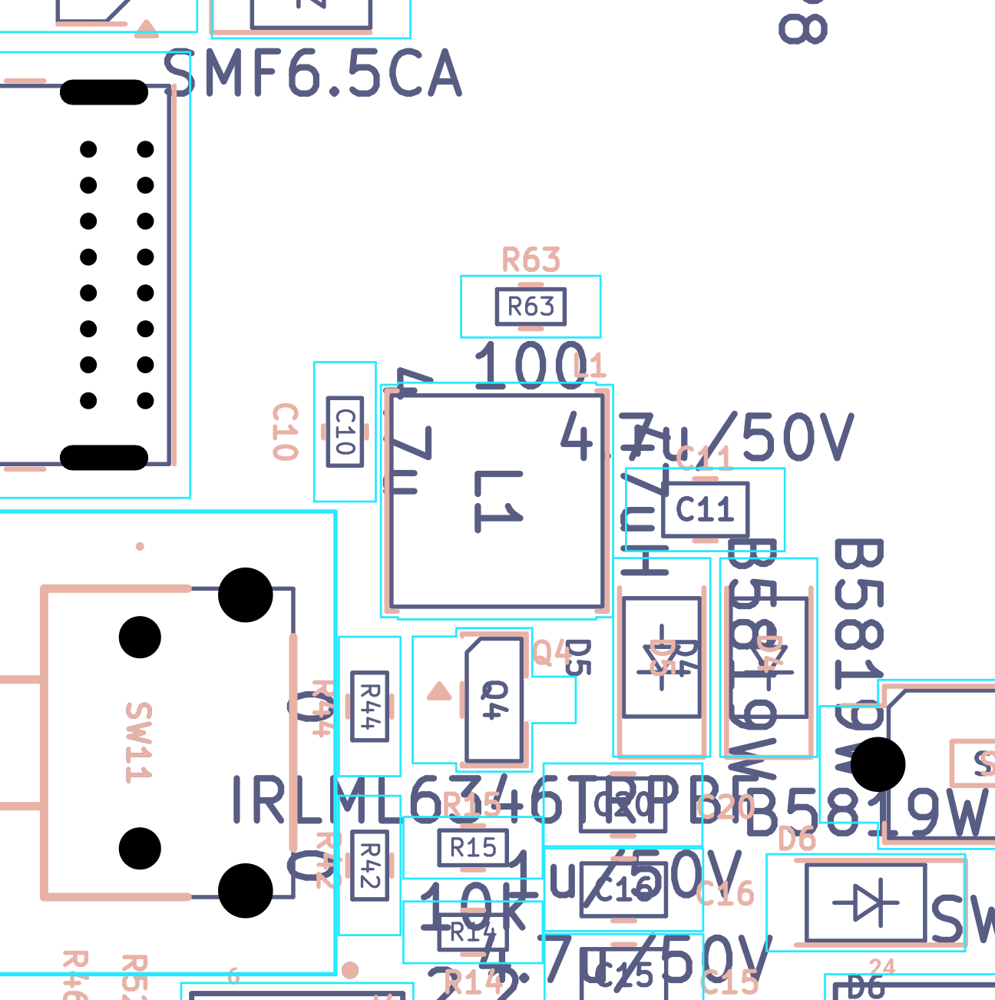

# BOM critique: function, cost, sourcing risk

*Independent final review, 2026-09-19/20 evidence pack. Reviewer key `bom`, finding prefix `BOM-`.
Ground truth: `evidence/sch/bom_ungrouped.csv`, `evidence/sch/connectivity_by_component.txt`,
`evidence/sch/connectivity_by_net.txt`, `evidence/pcb/board_extract.json`. All stock and price figures were
re-fetched live on **2026-09-19/20**; anything I could not fetch is marked **est.***

**Headline:** the BOM is in far better shape than most hobby projects — the population reconciles exactly, every
LCSC code resolves to a real part, and every value/tolerance/package matches. Three things need attention before
money is spent, and all three are **stock movements since the 2026-09-18 crawl**, not design errors:
`R14`'s ordering code has dropped to **12 pieces**, `C4/C6/C32`'s DigiKey part is **obsolete**, and `U10` is down
to **78**. One capacitor derating note (`C2`) and one generator bug (`production/bom.csv` regenerates the
duplicate-LCSC lines that were fixed by hand) round out the list.

> **Verified 2026-09-20 by an independent second reviewer.** Every BLOCKER / HIGH / MEDIUM finding below was
> re-derived from the netlist and re-fetched from the live vendor pages. **All factual claims reproduced**
> (stock figures, DigiKey statuses and prices, net node lists, the CSV sums, the TPS923610 absolute maxima) —
> see the **Verification log** at the end of this file for what was checked. What changed is **severity, not
> facts**: BOM-01 BLOCKER→HIGH, BOM-02/03 HIGH→MEDIUM, BOM-04/08/10 MEDIUM→LOW, because on the owner's
> prototype standard these are *ordering-time* problems that JLC's quote screen surfaces, or standard-practice
> derating, rather than "the board will not work". **Nothing in this section found a design defect.** Two
> arithmetic/attribution slips in BOM-08 and one over-strong claim in BOM-04 are corrected in the log, and two
> completeness gaps (BOM-V01, BOM-V02) are added to the findings table.

---

## What this part of the board does

A **BOM** (bill of materials) is the shopping list: every component, how many, which exact manufacturer part
number (**MPN**), and where to buy it. It is the one document that turns a schematic into a physical object, and
it is the easiest place in a project to lose a week — because a BOM error is *silent*. Every rule check passes,
the Gerbers are perfect, and then the wrong part arrives, or the right part is out of stock, or the assembly
house fits a 10 V capacitor on a 20 V rail because the ordering code in one column disagreed with the part
number in the next.

This board carries two parallel ordering identities for almost every line:

* an **MPN + manufacturer** (Yageo, Samsung, TI, Hirose …) aimed at **DigiKey**, the owner's primary channel; and
* an **LCSC code** (`Cxxxxxx`), so the same design can go to JLCPCB for turnkey assembly.

The owner's standing rule is that the MPN is authoritative and the LCSC code is a convenience field. That is a
good rule, but it creates a failure mode no ERC or DRC can catch: **the LCSC code can quietly point at a
different part than the MPN says.** Checking that correspondence line by line is the highest-value thing this
section does.

**Jargon, defined once:**

* **MLCC** — multi-layer ceramic capacitor (the small rectangular chip capacitors).
* **X5R / X7R** — MLCC dielectric classes. X7R is stable −55…+125 °C, X5R only to +85 °C. Both are "class 2",
  meaning capacitance drops sharply under applied voltage.
* **DC bias derating** — a class-2 MLCC loses capacitance as DC voltage rises. A "10 µF" 0603 rated 10 V can be
  3.5 µF at 5 V. The datasheet number is measured at essentially zero volts.
* **0603 / 0805 / 1206** — imperial chip sizes (0603 = 1.6 × 0.8 mm, 0805 = 2.0 × 1.25 mm).
* **THT / SMD** — through-hole vs surface-mount.
* **DNP** — "do not populate": present in the design files, deliberately left off the board.
* **JLC Basic / Preferred / Extended** — JLCPCB keeps some parts permanently loaded. Basic and Preferred are
  fee-free; **Extended** costs a per-part-number **loading fee** (~$1.50) to fit a feeder for your job.
* **Isat** — an inductor's saturation current; above it, it stops being an inductor.
* **PTC** — resettable polymer fuse. **TVS** — transient clamp diode for ESD/surges.
* **VRWM / VBR / VC** — a TVS's stand-off (never conducts below), breakdown, and clamping voltage.

---

## Consolidated BOM

| Metric | Value |
|---|---|
| Footprints on the PCB | 183 |
| … logos / mounting holes / bare pads (no purchasable part) | 11 (`G***` ×4, `H1`–`H5`, `TP1`, `TP2`) |
| Rows in `bom_ungrouped.csv` | 170 |
| **Components purchased and placed** | **162** |
| **Unique purchasable part numbers (non-DNP)** | **62** |
| DNP | 10: `R43`, `R45`, `R58`, `R66`, `R72`, `R74`, `SW6`, `TP3`, `TP4`, `TP5` |
| Surface-mount | 155, **all on the bottom side** |
| Through-hole | 17 total, **13 populated** (`J1`, `J5`, `J6`, `SW1`–`SW5`, `SW7`–`SW11`) |
| Solder joints per board (non-DNP) | **470 SMD + 92 THT** |
| Parts on the **top** side | 8, none electrical (4 logos, `H5` pad, 3 DNP test headers) |

162 placed + 10 DNP + 7 bare-copper (`H1`–`H5`, `TP1`, `TP2`) = **179 references**, which reconciles exactly
with the netlist and with `fabrication/BOM.md`'s own population figures.

"All SMT on one side" is a real cost win: JLCPCB charges a **single-sided** setup ($25.56) rather than
double-sided ($51.12).

### Grouped by part number

Sorted by first reference. `B`/`E` = JLCPCB Basic / Extended (see BOM-16 on why this split is approximate).
Stock/price are the **LCSC/JLC** snapshot of 2026-09-19/20.

| # | MPN (ordered) | Value | Package | Qty | Refs | LCSC | Part behind that code | B/E | JLC stock | JLC $ | Role |
|---|---|---|---|---|---|---|---|---|---|---|---|
| 1 | CL10B102KB8NNNC | 1 n 50 V X7R | 0603 | 1 | C1 | C1588 | CL10B102KB8NNNC ✔ | B | 2.78 M | 0.0059 | USB shield-to-GND RF bleed |
| 2 | CL10A106KP8NNNC | 10 µF **10 V** X5R | 0603 | 2 | C2, C3 | C19702 | CL10A106KP8NNNC ✔ | B | 5.30 M | 0.0824 | VBUS bulk (C2), battery bulk (C3) — **see BOM-04** |
| 3 | CL21A226MAQNNNE | 22 µF 25 V X5R | 0805 | 3 | C4, C6, C32 | C20416420 | **TCC0805X5R226M250FT ✘** | E | **396** | 0.034 | LDO-in / 3V3 bulk — **see BOM-02, BOM-03** |
| 4 | CL10A105KB8NNNC | 1 µF 50 V X5R | 0603 | 7 | C5, C8, C21, C22, C25, C26, C37 | C15849 | CL10A105KB8NNNC ✔ | B | 5.98 M | 0.0297 | EN slew, ADC filter, decoupling |
| 5 | CC0603KRX7R9BB104 | 100 nF 50 V X7R | 0603 | 6 | C7, C24, C30, C31, C33, C36 | C14663 | CC0603KRX7R9BB104 ✔ | B | 12.6 M | 0.0106 | decoupling — **split over two Value strings, see BOM-05** |
| 6 | CL21A475KBQNNNE | 4.7 µF 50 V X5R | 0805 | 7 | C9, C11, C13–C17 | C513770 | CS2012X5R475K500NRE ≈ | E | 11.9 k | 0.0274 | LED-boost out, EPD charge pump + ± rails |
| 7 | CL10A475KO8NNNC | 4.7 µF 16 V X5R | 0603 | 2 | C10, C12 | C19666 | CL10A475KO8NNNC ✔ | B | 1.37 M | 0.0236 | 3V3 / LDO-in local decoupling |
| 8 | CL21B105KBFNNNE | 1 µF 50 V X7R | 0805 | 3 | C18, C19, C20 | C28323 | CL21B105KBFNNNE ✔ | B | 2.08 M | 0.0469 | EPD panel rail caps — **split Value strings** |
| 9 | CL10B222KB8NNNC | 2.2 nF 50 V X7R | 0603 | 4 | C23, C27, C28, C29 | C1604 | 0603B222K500NT (Fenghua) ≈ | B | 345 k | 0.0053 | button/status ADC anti-alias filters |
| 10 | SMF6.5CA | TVS 6.5 V bidir 200 W | SOD-123FL | 1 | CR1 | C19077501 | SMF6.5CA ✔ | Pref | 1.22 M | 0.0291 | USB VBUS surge clamp at the inlet |
| 11 | TSD05CDYFR | TVS 5 V bidir | SOD-323 | 2 | CR2, CR3 | C5299440 | SD05C-01FTG ≈ | E | 105 k | 0.0235 | clamp on 3V3 and battery P+ |
| 12 | LTST-C150KRKT | red LED | 1206 | 1 | D2 | C28310439 | YLED1206R ≈ | E | 27 k | 0.0168 | USB-present indicator |
| 13 | SMAJ26A | TVS 26 V unidir 400 W | SMA | 1 | D3 | C19077543 | SMAJ26A ✔ | Pref | 154 k | 0.0364 | clamp on the frontlight boost output at J6 — **BOM-10** |
| 14 | 1N5819HW-7-F | Schottky 40 V 1 A | SOD-123 | 3 | D4, D5, D6 | C8598 | B5819W SL ≈ | B | 1.06 M | 0.0261 | EPD boost rectifier + charge-pump diodes |
| 15 | PESD2IVN-UX | TVS 2-ch 26.5 V bidir | SOT-323 | 1 | D8 | C42370512 | PESD2IVN-UX ✔ | E | **2.96 k** | 0.0816 | ESD on the two LED-return pins at J6 — **BOM-06** |
| 16 | 0805L100WR | PTC 1 A hold / 6 V | 0805 | 1 | F1 | C269106 | SMD0805B100TFT ≈ | E | 9.79 k | 0.0326 | USB VBUS resettable fuse |
| 17 | USB4085-GF-A | USB-C receptacle, R/A | THT | 1 | J1 | C7095263 | USB4085-GF-A ✔ | E | 2.17 k | 1.4179 | USB-C power + data inlet |
| 18 | FH34SRJ-24S-0.5SH(50) | 24-way 0.5 mm FPC | SMD | 1 | J2 | C324726 | FH34SRJ-24S-0.5SH(50) ✔ | E | 53.9 k | 0.2761 | e-paper panel tail |
| 19 | FH34SRJ-6S-0.5SH(50) | 6-way 0.5 mm FPC | SMD | 2 | J3, J4 | C224194 | FH34SRJ-6S-0.5SH(50) ✔ | E | 92.5 k | 0.1071 | touch panel / frontlight FPC |
| 20 | S2B-PH-K-S(LF)(SN) | JST-PH 2-way, side entry | THT | 1 | J5 | C48579993 | A2001WR-2P ≈ | E | 1.45 k | 0.0127 | **LiPo cell connector** |
| 21 | PPPC062LJBN-RC | 2×6 0.1″ socket, R/A | THT | 1 | J6 | C5333437 | A2541HWR-2x6P ≈ | E | **1.10 k** | 0.3542 | expansion / frontlight header |
| 22 | MEM2075-00-140-01-A | microSD push-push | SMD | 1 | J7 | C393941 | "TF PUSH" ≈ | E | 137 k | 0.0661 | microSD socket (dual-source land) |
| 23 | TYS5040470M-10 | 47 µH, Isat 1.1 A | 5040, 4.2 mm tall | 1 | L1 | C206267 | SLW5040S470MST ≈ | E | **720** | 0.0453 | EPD boost inductor — **BOM-14** |
| 24 | VLS252012HBX-100M-1 | 10 µH, Isat 850 mA | 1008, 1.2 mm | 1 | L2 | C88532 | VLS252012HBX-100M-1 ✔ | E | 5.95 k | 0.0682 | frontlight boost inductor |
| 25 | FS8205A | dual N-FET 20 V 6 A | SOT-23-6 | 1 | Q1 | C2830320 | FS8205A ✔ | E | 132 k | 0.0614 | battery-protection pass FETs |
| 26 | AO3401A | P-FET −30 V 4 A | SOT-23 | 4 | Q2, Q3, Q7, Q8 | C15127 | AO3401A ✔ | B | 716 k | 0.0716 | CE gate, reverse-battery block ×2, SD power switch |
| 27 | IRLML6346TRPBF | N-FET 30 V 3.4 A | SOT-23 | 1 | Q4 | C67276 | IRLML6346TRPBF ✔ | E | **1.08 k** | 0.1816 | EPD boost switch (driven by the panel's GDR pin) |
| 28 | BSS138LT1G | N-FET 50 V 340 mA | SOT-23 | 3 | Q5, Q6, Q9 | C7420339 | BSS138 (generic) ≈ | E | 169 k | 0.0177 | warm/cool string select, battery-present detect |
| 29 | RC0603FR-071ML | 1 M ±1 % | 0603 | 10 | R1, R10, R12, R39, R49, R50, R57, R80, R81, R82 | C22935 | 0603WAF1004T5E ≈ | B | 2.60 M | 0.0019 | bleeders, gate pulls, high-side dividers |
| 30 | RC0603FR-075K1L | 5.1 k ±1 % | 0603 | 2 | R2, R3 | C23186 | 0603WAF5101T5E ≈ | B | 3.78 M | 0.0019 | **USB-C CC1/CC2 Rd** |
| 31 | RC0603FR-0710KL | 10 k ±1 % | 0603 | 13 (+1 DNP) | R4, R5, R7, R8, R9, R13, R15, R28, R53–R56, R62 | C25804 | 0603WAF1002T5E ✔ | B | n/a | ~0.002 | pull-ups, SD pulls, `/GDR` pull-down (R15) |
| 32 | RC0603FR-074K7L | 4.7 k ±1 % | 0603 | 1 | R6 | C23162 | 0603WAF4701T5E ≈ | B | 7.43 M | 0.0015 | **TP4056 PROG — sets charge current** |
| 33 | RC0603FR-0712KL | 12 k | 0603 | 1 | R11 | C22790 | 0603WAF1202T5E ≈ | B | 443 k | 0.0035 | button ladder 2 |
| 34 | RC0603FR-072R2L | **2.2 Ω ±1 %** | 0603 | 1 | R14 | **C112307** | RC0603FR-072R2L ✔ | E | **12** | 0.0048 | **EPD boost current sense (RESE) — BOM-01** |
| 35 | RC0603FR-071KL | 1 k | 0603 | 2 | R16, R78 | C21190 | 0603WAF1001T5E ≈ | B | 8.01 M | 0.0039 | DW01A CS series R, SD gate drive |
| 36 | RC0603FR-07150KL | 150 k | 0603 | 1 | R17 | C22807 | 0603WAF1503T5E ≈ | B | 414 k | 0.0014 | TPS2116 ST → status ADC |
| 37 | RC0603FR-075K6L | 5.6 k | 0603 | 1 | R18 | C23189 | 0603WAF5601T5E ≈ | B | 560 k | 0.0013 | button ladder 1 |
| 38 | RC0603FR-0720KL | 20 k | 0603 | 1 | R19 | C4184 | 0603WAF2002T5E ≈ | B | 2.26 M | 0.0018 | button ladder 1 |
| 39 | RC0603FR-0756KL | 56 k | 0603 | 2 | R20, R67 | C23206 | 0603WAF5602T5E ≈ | B | 220 k | 0.002 | button ladder 1, CHRG → status ADC |
| 40 | RC0603FR-0733RL | 33 Ω | 0603 | 15 | R21–R26, R29–R34, R65, R68, R69 | C23140 | 0603WAF330JT5E ≈ | B | 1.77 M | 0.0013 | SD-bus and GPIO series damping |
| 41 | RC0805JR-070RL | 0 Ω | **0805** | 1 | R27 | C17477 | 0805W8F0000T5E ≈ | B | 3.09 M | 0.003 | battery-path link (deliberately up-sized) |
| 42 | RC0603FR-0733KL | 33 k | 0603 | 1 | R35 | C4216 | 0603WAF3302T5E ≈ | B | 697 k | 0.0013 | button ladder 2 |
| 43 | RC0603FR-0768KL | 68 k | 0603 | 1 | R36 | C23231 | 0603WAF6802T5E ≈ | B | 428 k | 0.0013 | button ladder 2 |
| 44 | RC0603FR-0715RL | 15 Ω ±1 % | 0603 | 1 | R37 | C22810 | 0603WAF150JT5E ≈ | Pref | 18.7 k | 0.0017 | **frontlight LED current set (RSET)** |
| 45 | RC0603FR-07300KL | 300 k | 0603 | 1 | R38 | C23024 | 0603WAF3003T5E ≈ | B | 426 k | 0.0019 | TPS2116 PR1 divider (top) |
| 46 | RC0603FR-07100KL | 100 k | 0603 | 7 | R40, R51, R70, R75, R76, R77, R79 | C25803 | 0603WAF1003T5E ≈ | B | 7.99 M | 0.0016 | gate pulls, PR1 divider, status pull-up |
| 47 | RC0603FR-07120KL | 120 k | 0603 | 1 | R41 | C25808 | 0603WAF1203T5E ≈ | B | 363 k | 0.0015 | LED_MONIT divider (bottom) |
| 48 | RC0603JR-070RL | 0 Ω | 0603 | 5 (+1 DNP) | R42, R44, R46, R52, R73 | C21189 | 0603WAF0000T5E ≈ | B | 6.15 M | 0.0019 | strap / option links |
| 49 | RC0603FR-072K2L | 2.2 k | 0603 | 2 | R47, R48 | C4190 | 0603WAF2201T5E ≈ | B | 2.00 M | 0.0014 | **I²C pull-ups** |
| 50 | RC0603FR-072KL | 2 k | 0603 | 1 | R59 | C22975 | 0603WAF2001T5E ≈ | B | 4.65 M | 0.0018 | D2 LED ballast |
| 51 | RC0603FR-07100RL | 100 Ω | 0603 | 4 | R60, R61, R63, R64 | C22775 | 0603WAF1000T5E ≈ | B | 7.33 M | 0.0023 | button / EN / IO0 series protection |
| 52 | RC0603FR-0722KL | 22 k | 0603 | 1 | R71 | C31850 | 0603WAF2202T5E ≈ | B | 1.25 M | 0.0014 | STDBY → status ADC |
| 53 | MJTP1117 | tactile switch, R/A THT | THT | 10 | SW1–SW5, SW7–SW11 | C557598 | TS365ZJ ≈ | E | 20.5 k | 0.0581 | user buttons — **BOM-13** |
| 54 | TPD4E1U06DBVR | 4-ch 0.55 pF ESD array | SOT-23-6 | 5 | U1, U6, U7, U8, U9 | C19829453 | TPD4E1U06DBVR ✔ | E | 10.4 k | 0.0564 | ESD on SD bus, USB, touch FPC, I²C, spare GPIO |
| 55 | TPS2116DRLR | 2-input power mux | SOT-583-8 | 1 | U2 | C3235557 | TPS2116DRLR ✔ | E | 12.8 k | 0.6524 | USB-vs-battery priority switchover |
| 56 | TLV75533PDBVR | 3.3 V 500 mA LDO | SOT-23-5 | 1 | U3 | C404027 | TLV75533PDBVR ✔ | E | 20.8 k | 0.146 | main 3V3 rail |
| 57 | ESP32-S3-WROOM-1-N16R8 | MCU, 16 MB flash / 8 MB PSRAM | module | 1 | U4 | C2913202 | ESP32-S3-WROOM-1-N16R8 ✔ | E | 32.1 k | 5.1409 | the computer |
| 58 | DW01A | 1-cell protection IC | SOT-23-6 | 1 | U5 | C351410 | DW01A ✔ | E | 65.5 k | 0.0432 | **LiPo over-charge / -discharge / -current — BOM-09** |
| 59 | TPS923610DRLR | boost LED driver | SOT-563-6 | 1 | U10 | C52919131 | TPS923610DRLR ✔ | E | **78** | 1.0723 | frontlight driver — **BOM-03** |
| 60 | TP4056-42-ESOP8 | 1 A linear LiPo charger | ESOP-8 | 1 | U11 | C16581 | TP4056-42-ESOP8 ✔ | E | 105 k | 0.1881 | **battery charger — BOM-09** |
| 61 | 74LVC1G04GV,125 | single inverter | SOT-23-5 (SOT-753) | 1 | U12 | C53185133 | 74LVC1G04GV ✔ | E | 2.92 k | 0.0717 | inverts COLOR_SEL for the warm/cool mux |
| 62 | DS3231MZ+TRL | ±5 ppm TCXO RTC | SOIC-8 | 1 | U13 | C107410 | DS3231MZ+TRL ✔ | E | 11.5 k | 2.9609 | real-time clock — **BOM-07** |
| — | MJTP1243 | tactile switch | THT | 1 **DNP** | SW6 | *(none)* | — | — | — | — | optional BOOT button |

Legend: ✔ the LCSC code really is that MPN · ≈ the code is a different manufacturer's part whose
value/tolerance/voltage/package I verified to match · ✘ the code is a different part **and** a better code exists.

### DNP list (10)

| Ref | Value | Purpose |
|---|---|---|
| R43, R66 | 0 Ω | touch VDD/INT swap (alternate to R42/R44); also `exclude_from_bom` |
| R45, R58 | 0 Ω | touch SDA/SCL swap (alternate to R46/R52); also `exclude_from_bom` |
| R72 | 10 k | UP(2)-as-power-button alternate |
| R74 | 0 Ω | 3V3 side of the R73 strap — **never fit R73 and R74 together (shorts 3V3 to GND)** |
| SW6 | MJTP1243 | BOOT button; unnecessary because of USB-Serial-JTAG |
| TP3, TP4, TP5 | 1×1 header | top-side probe points |

### Hand-solder vs machine-placed split

| Class | Count | Joints/board | Notes |
|---|---|---|---|
| Bottom-side SMD, machine placeable | 155 | 470 | includes two 0.5 mm-pitch FPC connectors and a 1.6 × 1.6 mm SOT-563 |
| Through-hole, populated | 13 | 92 | JLC bills these as *manual assembly*, ~10× the SMT joint rate |
| Top side, populated | 0 | 0 | **single-sided SMT setup** |

---

## Circuit walk-through — the parts that carry risk

| Ref | Part / value | Role | Checked against datasheet? |
|---|---|---|---|
| U2 | TPS2116DRLR | Priority power mux: VIN1 = USB_VBUS, VIN2 = P+, VOUT = LDO_IN; PR1 from the R38/R51 300 k/100 k divider; MODE tied to VBUS | **Yes** — `tps2116.pdf`. VIN 1.6–5.5 V, 2.5 A, R<sub>ON</sub> 40 mΩ. Battery (3.0–4.2 V) and VBUS (5 V) both in range. |
| U3 | TLV75533PDBVR | 3.3 V / 500 mA LDO; EN tied to IN (always on) | **Yes** — `tlv755p.pdf` (SBVS334). V<sub>IN</sub> 1.6–5.5 V, dropout 238 mV @ 500 mA. |
| U11 + R6 | TP4056-42-ESOP8, PROG = 4.7 k | Linear LiPo charger, V<sub>CC</sub> = USB_VBUS, BAT = P+ | **Partly** — vendor datasheet only. I<sub>CHG</sub> = 1200/R<sub>PROG</sub> → **255 mA**. |
| U5 + Q1 + R16 | DW01A + FS8205A + 1 k CS resistor | 1-cell protection between cell B− and system GND | **Partly** — clone-market parts; JLC data gives 4.3 V over-charge / 2.5 V over-discharge. R16 1 k and C7 100 nF match the DW01A reference application. |
| U10 + L2 + R37 | TPS923610DRLR, 10 µH, R<sub>SET</sub> 15 Ω | Boost frontlight driver. VIN = LDO_IN, SW = TPS_SW_NODE, VOUT = LED_SW, FB = the Q5/Q6 common source, ADIM = PWM_LED | **Yes** — SNVSCN8A. V<sub>FB</sub> 200 mV, V<sub>OUT</sub> 5–24.5 V, I<sub>LIM</sub> 1.8 A, f<sub>SW</sub> 1.1 MHz, C<sub>IN</sub>/C<sub>OUT</sub> ≥ 1 µF **effective**. |
| Q4, L1, R14, D4–D6, C11–C17, R15 | IRLML6346 / 47 µH / 2.2 Ω / B5819W / 4.7 µF 50 V / 10 k | **Externally-switched EPD rail generator.** The panel's SSD1677 drives `/GDR` and senses `/RESE`; the board supplies FET, inductor, sense resistor, charge-pump diodes and caps that make PREVGH (≈ +22 V) and PREVGL (≈ −21 V). | **Yes** — matches the SSD1677 reference DC-DC (L<sub>E</sub> 47 µH, Q<sub>E</sub>, D<sub>E1-3</sub>, R<sub>E1</sub> 2.2 Ω, R<sub>E2</sub> GDR pull-down) with two deliberate upgrades — see *Checked and found OK* #13 and BOM-11/BOM-12. |
| D3 | SMAJ26A | TVS on LED_SW, which is exposed on **J6 pin 5** and **J3 pins 1/5** to an off-board frontlight | **Yes** — Littelfuse SMAJ: V<sub>RWM</sub> 26 V, V<sub>BR</sub> 28.9–32.1 V, V<sub>C</sub> 42.1 V @ 9.5 A. **BOM-10.** |
| D8 | PESD2IVN-UX | Dual bidirectional TVS on `C−`/`W−`, the LED-string returns at J6 | **Yes** — Nexperia: V<sub>RWM</sub> 26.5 V, V<sub>BR</sub> 28 V, V<sub>C</sub> 53 V @ 3 A, 8.5 pF. **DigiKey status: Not For New Designs.** |
| F1 | 0805L100WR | PTC on VBUS, 1 A hold / 2 A trip / 6 V | **Yes** — Littelfuse 0805L. |
| CR1 | SMF6.5CA | VBUS surge clamp at the inlet | **Yes** — V<sub>RWM</sub> 6.5 V, V<sub>BR</sub> ≥ 7.22 V, ≤ 11.2 V clamp. Correctly chosen over a "05"-class part for a rail that may legally sit at 5.5 V. |
| CR2, CR3 | TSD05CDYFR | 5 V bidirectional TVS on 3V3 and battery P+ | **Yes** — `tsd05c.pdf` (SLVSH42C), bidirectional, ±30 kV contact, < 7 pF, 10 nA leakage. |
| U1, U6–U9 | TPD4E1U06DBVR ×5 | 4-channel 0.55 pF ESD arrays | **Yes** — V<sub>RWM</sub> 5.5 V, V<sub>BR</sub> 8.5 V, IEC 61000-4-2/-4/-5. |
| U13 | DS3231MZ+TRL | ±5 ppm MEMS-TCXO RTC on I²C | **Partly** — confirmed Active and stocked; **$13.85 (reel) / $15.99 (tube)** at DigiKey qty 1. **BOM-07.** |
| SW1–SW11 | MJTP1117 | 10 right-angle THT tactile switches | **Yes** for APEM (1.77 N, 100 k cycles). Substitutes differ in feel — **BOM-13**. |

---

## Where it is on the board & layout notes

Only the placement facts that affect *buying and building* are covered here; geometry belongs to the layout and
mechanical sections.

* **Everything electrical is on the bottom face.** 155 SMD + 13 populated THT on a 60.05 × 111.30 mm, 1.6 mm,
  2-layer board. Only logos, one mounting pad and three DNP test headers touch the top. Quote this as
  *single-sided SMT*.
* **All chip passives use `_HandSolder` footprint variants** (e.g. `R_0603_1608Metric_Pad0.98x0.95mm_HandSolder`)
  with extended pads. Exactly right for the "an amateur should be able to replicate this" goal, and JLC places
  them without complaint.
* **Two things are not hand-friendly:** `U10` TPS923610DRLR is SOT-563 (1.6 × 1.6 mm, 6 leads, 0.5 mm pitch),
  and `J2`/`J3`/`J4` are 0.5 mm-pitch FPC connectors with 0.3 mm pads. Both are doable with hot air and flux,
  but they are where a first-time builder will fail.
* **The EPD boost cluster is tightly grouped** at roughly (77…100, 100…124) mm on the bottom:
  `L1` (88.50, 112.30), `Q4` (88.57, 117.01), `R14` (89.07, 122.51), `D4` (82.07, 116.01), `D5` (84.60, 116.00),
  `D6` (79.77, 121.81), `C11` (83.57, 112.51). Good — this is the loop that carries the switched current.

  

* **Tallest components set the enclosure.** `L1` is 4.2 mm tall; `J1` (through-hole right-angle USB-C) and the
  11 THT tactile switches define the rest of the bottom-face envelope. Anyone substituting `L1` must re-check
  **height**, not just inductance — I could not confirm the JLC substitute's height from its listing.
* **`R27` is an 0805 0 Ω where every other 0 Ω is 0603.** Deliberate (git history shows a battery-path widening
  revision) and it sits in the B+ → Q3 → R27 → Q8 → P+ series path. Keep it.

---

## Calculations

Every number is computed from the netlist plus the cited datasheet. Where an input is unknown, I say so.

### 1. Charge current, and whether the PTC can carry it

`R6` = 4.7 kΩ from `U11.PROG` to GND. TP4056: **I_CHG = 1200 / R_PROG**

```
I_CHG = 1200 / 4700 = 0.255 A = 255 mA
```

Worst case through `F1` = charge + system. ESP32-S3-WROOM-1 peaks at 355 mA in Wi-Fi transmit:

```
I_F1(worst) = 255 + 355 + ~50 (EPD boost + frontlight) = 660 mA
660 mA / 1000 mA hold = 66 %   ->  no nuisance trip.  PASS
```

Drop at 660 mA, Littelfuse R1max 0.20 Ω: `132 mV`, 87 mW. With the JLC substitute's 230 mΩ max: `152 mV`,
100 mW. Both fine in 0805. **PASS.**

### 2. Frontlight LED current

`R37` = 15 Ω from the Q5/Q6 common source (= U10 `FB`) to GND. SNVSCN8A eqn (3), V_FB = 200 mV:

```
I_LED  = 0.200 / 15 = 13.3 mA
P(R37) = 0.0133^2 x 15 = 2.7 mW   (0603 rated 100 mW)  ->  37x margin. PASS
```

The sense resistor sits *outside* the Q5/Q6 channel, so the BSS138s' R_DS(on) does not corrupt the setpoint.
Correct topology.

### 3. Frontlight boost inductor — is 10 µH / 850 mA Isat enough?

Assume a 6-LED white string, V_f ≈ 3.2 V → V_OUT ≈ 19.4 V. Worst case is the lowest input, V_IN = 3.2 V,
η ≈ 0.85. SNVSCN8A eqn (4):

```
I_L(DC) = 19.4 x 0.0133 / (3.2 x 0.85) = 0.258 / 2.72 = 95 mA
D       = 1 - 3.2/19.4 = 0.835
dI_L    = 3.2 x 0.835 / (10e-6 x 1.1e6) = 243 mA peak-to-peak
I_L(pk) = 95 + 243/2 = 217 mA

217 mA vs Isat 850 mA            ->  3.9x margin.  PASS
217 mA vs 1.8 A switch limit     ->  8x margin.    PASS
I_rms   = sqrt(0.095^2 + 0.243^2/12) = 0.118 A
P(DCR)  = 0.118^2 x 0.54 = 7.5 mW on ~0.26 W out = 2.9 %.  Acceptable.
```

*Caveat: the string voltage is set by whatever frontlight is plugged into J6. At 8 LEDs (25.6 V) it exceeds the
TPS923610's 24.5 V maximum and you need the TPS923611.*

### 4. Boost output capacitor after DC bias

SNVSCN8A requires **C_OUT effective ≥ 1 µF**. `C9` is 4.7 µF 50 V X5R 0805 at ~19.4 V DC (39 % of rating), where
a 50 V X5R 0805 typically loses 30–45 %:

```
C_eff ~= 4.7 x 0.60 = 2.8 uF  >= 1 uF.  PASS (2.8x margin)
```

C_IN: `C12` (4.7 µF 16 V 0603 at ~4.2 V, ≈ −25 %) ≈ 3.5 µF, plus `C4` 22 µF 25 V 0805 ≈ 17 µF. **PASS.**

### 5. The one that fails: `C2`, 10 µF **10 V** X5R 0603 on USB VBUS

```
Voltage headroom: 10 V rating / 5.0 V nominal = 2.0x  (1.9x at the 5.25 V USB tolerance limit)
```

USB hot-plug into a cable with ~100 nH rings this capacitor; the usual rule of thumb is up to a 2× overshoot on
VBUS inrush, i.e. ~9–10 V transiently — *at* the part's rating.

```
DC bias, 0603 10 uF 10 V X5R at 5 V applied:
  Samsung CL10A106KP8NNNC bias curve: about -65 %
  C_eff ~= 10 x 0.35 = 3.5 uF
```

So the "10 µF" of VBUS bulk is really ≈ 3.5 µF; `C25` (1 µF 0603 50 V) adds ≈ 0.9 µF, for ≈ 4.4 µF where the
schematic implies 11 µF. **See BOM-04.**

`C3` is the same part on `P+` (3.0–4.2 V): ≈ −50 % → ~5 µF effective, and 4.2 V against 10 V is a comfortable
2.4×. **That one is fine.**

> **Verifier's correction (2026-09-20).** The part identity is confirmed — `C19702` = `CL10A106KP8NNNC`,
> "10 V 10 µF X5R ±10 % 0603" (live JLC lookup) — and the DC-bias argument stands. But the *hot-plug* argument
> does not apply at `C2`'s location, and this is why the finding was re-graded to LOW.
> `connectivity_by_net.txt` shows `USB_VBUS` (8 nodes) = `C2.1`, `C25.2`, `D2.2`, `F1.2`, `R38.1`, `U2.3 VIN1`,
> `U2.5 MODE`, `U11.4 VCC`. **`CR1` is *not* on this net** — it sits on the inlet side, upstream of `F1`. So
> the inrush ring is clamped by `CR1` (6.5 V stand-off, ≤ 11.2 V clamp) *before* it reaches `C2`, and `F1`'s
> ~0.2 Ω is in series to damp what is left. A 10 V X5R at 5 V is also 50 % derating, which is ordinary
> industry practice for a USB rail. Nothing here damages `C2` or stops the board working; the ~4.4 µF of
> effective bulk is ample for a 255 mA charger input plus a power-mux input. Worth upgrading to a 16 V part
> **only if that line is being edited anyway** (see the conditional `C10`/`C12` merge below).

### 6. `R14`, the EPD boost sense resistor

`R14` = 2.2 Ω, **0603, 100 mW**, in the source of `Q4`, carrying the full switched inductor current. The
switching is commanded by the panel's SSD1677 on `/GDR`, so the peak is a property of the panel:

```
I_peak 300 mA, D = 0.5:  I_rms = 0.300/sqrt(3) x sqrt(0.5) = 0.122 A  ->  P = 33 mW   (33 % of rating)
I_peak 500 mA, D = 0.5:  I_rms = 0.204 A                             ->  P = 92 mW   (92 % of rating)
I_peak 700 mA, D = 0.5:  I_rms = 0.286 A                             ->  P = 180 mW  (1.8x OVER)
```

The value **matches the SSD1677 reference design** (R<sub>E1</sub> = 2.2 Ω with L<sub>E</sub> = 47 µH), so the
choice is right; only the wattage is unverified. **See BOM-11.**

### 7. `Q4` drain voltage — checked, and it passes

`EINK_SW` is clamped by `D5` (40 V Schottky) to `PREVGH` (≈ +22 V):

```
V_DS(peak) ~= PREVGH + Vf(D5) = 22 + 0.6 = 22.6 V
IRLML6346 V_DS(max) = 30 V  ->  25 % margin, and the Schottky - not FET avalanche - is the clamp.  PASS
```

The SSD1677 reference specifies Si1308EDL (30 V, 1.3 A) and MBR0530 (30 V, 0.5 A); this board fits a 30 V/3.4 A
FET and 40 V/1 A diodes — both **upgrades** on the reference.

### 8. `D3` SMAJ26A versus the driver beside it

```
TPS923610 absolute max on VOUT and SW:  32 V   (SNVSCN8A Table 6.1)
TPS923610 recommended max VOUT:         24.5 V
SMAJ26A:  V_RWM 26 V   V_BR 28.9-32.1 V   V_C 42.1 V @ I_PP 9.5 A
```

In normal operation (≈19.4 V) the TVS is far below stand-off — no leakage, no interference. **Good.** But at any
real surge current it clamps at up to **42.1 V**, 10 V above the driver's absolute maximum, and even its
*breakdown* can be 32.1 V. It protects the connector and cable; it does **not** protect U10. **See BOM-10.**

### 9. LDO headroom at an empty battery

```
TLV75533P dropout = 238 mV @ 500 mA
Q3, Q8 AO3401A @ Vgs = -3.0 V: ~85 mOhm each = 170 mOhm; TPS2116 R_ON 40 mOhm; R27 = 0
At 400 mA:  0.4 x 0.210 = 84 mV drop
3.3 V out needs >= 3.54 V in  ->  cell must be above about 3.65 V
```

That is a power-tree conclusion rather than a BOM defect, but it matters here because it is the argument for
**not** "consolidating" `Q3`/`Q8` down to a smaller FET.

### 10. Resistor power — spot checks on everything carrying real current

| Ref | Value | Worst-case current | P | Rating | Verdict |
|---|---|---|---|---|---|
| R14 | 2.2 Ω | see §6 | 33–180 mW | 100 mW | **unresolved — BOM-11** |
| R37 | 15 Ω | 13.3 mA | 2.7 mW | 100 mW | PASS |
| R16 | 1 k | DW01A CS, µA | ≈ 0 | 100 mW | PASS |
| R59 | 2 k | (5 − 2.0)/2000 = 1.5 mA | 4.5 mW | 100 mW | PASS — dim but visible, and only lit on USB, so no battery cost |
| R2, R3 | 5.1 k | CC pull-downs | µW | 100 mW | PASS — 5.1 k ±1 % is what USB-C requires for Rd |
| R47, R48 | 2.2 k | 1.5 mA when I²C is low | 3.4 mW | 100 mW | PASS |
| R12/R10 | 1 M / 1 M | battery monitor divider | 4.2 µA total | — | PASS — the right order of drain for a sleeping reader |
| R15 | 10 k | `/GDR` pull-down, ~330 µA when high | ~1 mW | 100 mW | PASS electrically — but see BOM-12 |
| R27 | 0 Ω 0805 | ~660 mA battery path | — | Yageo 0805 0 Ω rated **2 A** | PASS (0603 would be 1 A — too thin) |

### 11. Cost model

**DigiKey, buying parts for N boards** (tier chosen from the extended quantity actually ordered):

| Boards | Parts / board | Parts total |
|---|--:|--:|
| 5 | **$55.38** | $276.89 |
| 10 | **$46.07** | $460.69 |
| 100 | **$36.93** | $3 693.43 |

At strict qty-1 pricing (one board, no bulk) the figure is **≈ $66/board** — see BOM-08.

**LCSC/JLC parts subtotal: $15.56/board** at single-piece prices — the same board is **3.6× cheaper** in parts
through LCSC.

**Top 12 cost drivers (DigiKey, 5-board buy, per board):**

| Per board | MPN | Qty | Unit | Share |
|---|---|---|---|---|
| $13.85 | **DS3231MZ+TRL** | 1 | $13.85 | **25.0 %** |
| $6.76 | ESP32-S3-WROOM-1-N16R8 | 1 | $6.76 | 12.2 % |
| $6.13 | **MJTP1117** | 10 | $0.613 | 11.1 % |
| $2.93 | TPD4E1U06DBVR | 5 | $0.587 | 5.3 % |
| $1.92 | MEM2075-00-140-01-A | 1 | $1.92 | 3.5 % |
| $1.70 | FH34SRJ-6S-0.5SH(50) | 2 | $0.85 | 3.1 % |
| $1.44 | FH34SRJ-24S-0.5SH(50) | 1 | $1.44 | 2.6 % |
| $1.20 | AO3401A (est.) | 4 | $0.30 | 2.2 % |
| $1.18 | CL21A475KBQNNNE | 7 | $0.169 | 2.1 % |
| $1.16 | PPPC062LJBN-RC | 1 | $1.16 | 2.1 % |
| $1.14 | 0805L100WR | 1 | $1.14 | 2.1 % |
| $1.07 | TPS2116DRLR | 1 | $1.07 | 1.9 % |

**Three lines are 48 % of the DigiKey BOM cost**, and two of them have better-and-cheaper replacements
(BOM-07, BOM-13).

**JLCPCB classification.** My live crawl gives 30 Basic / 31 Extended, but the public search API never reports
JLC's fee-free **Preferred** class (it returned `is_preferred: false` for every one of the 62 codes, including
`C19077501`, `C19077543` and `C22810`, which `fabrication/BOM.md` documents as Preferred). **BOM.md's figure of
26 Extended types, verified against JLC's own library, is the one to use** — see BOM-16.

**What a realistic 5-board JLCPCB PCBA order costs.** Standard PCBA is mandatory because `C2913202` (the ESP32
module) is listed *Standard Only* and requires X-ray.

| Item | Basis | 5 boards |
|---|---|---|
| Setup, Standard, **single-side** | $25.56 | $25.56 |
| Stencil, Standard single-side | $8.21 | $8.21 |
| SMT joints | 470 × 5 = 2 350 @ $0.0016 | $3.76 |
| Manual (THT) joints | 92 × 5 = 460 @ $0.0164 | $7.54 |
| Hand-soldering labour | per order | $3.58 |
| Extended-part loading | 26 types × $1.53 | $39.78 |
| X-ray (ESP32 module) | 5 × $1.64 | $8.20 |
| Parts | 5 × $15.56 + ~30 % attrition | ~$101 |
| PCB, 5 × 60 × 111 mm 2-layer | — | ~$10 |
| Shipping | — | ~$25 |
| **Total** | | **≈ $233 → $47 / board** |

That corroborates `fabrication/BOM.md`'s own model ($33.23/board of parts + fees at 5 boards, plus
"$15–20/board" of PCB and assembly → $48–53/board), which is grounded in a real 30-board quote and is the better
number of the two. At 10 boards ≈ $33/board; at 100 ≈ $19/board.

> **One caveat on the fee model.** JLCPCB's published fee page currently reads, for Standard PCBA,
> "$1.53 Basic/Extend (applies to all components requiring feeder loading)" — i.e. *all 62* lines, which would
> be $94.86 rather than $39.78 and would add ~$11/board at 5 boards. The owner's actual 30-board quote
> reconciles to Extended-only at ~$1.50 (26 × $1.50 = $39, matching BOM.md's "$1.30/board fees at 30 boards"),
> so the empirical evidence supports the Extended-only model. **Confirm this at the quote screen**, because if
> Standard has changed to charge per line, the Basic-vs-Extended optimisation loses its main lever.

**DigiKey hand-build, 5 boards, for comparison:** $276.89 parts + ~$10 PCB + ~$8 stencil + ~$25 shipping ≈
**$320, or $64/board — plus roughly 810 hand placements**, including ten through-hole switches, a SOT-563 and
three 0.5 mm-pitch FPC connectors. For five boards the two routes cost about the same; JLC does the work.

---

## Findings

| ID | Severity | Finding | Evidence | Recommendation |
|---|---|---|---|---|
| BOM-01 | **HIGH** *(re-graded from BLOCKER — see Verification log)* | `R14`'s ordering code `C112307` has **12 pieces in stock worldwide** at JLC, and there is a fee-free Basic alternative the documentation says does not exist | Live 2026-09-20: `C112307` = `RC0603FR-072R2L`, Extended, **stock 12**. `fabrication/BOM.md` line 237 records **94 900** on 2026-09-18 — a 99.99 % collapse in two days. `R14` is the SSD1677 boost sense resistor: without it there are no PREVGH/PREVGL rails and **the display does not work**. BOM.md line 161 states "no Basic 3 Ω, 2.2 Ω or 15 Ω 0603 exists"; live lookup of **`C22939`** returns `0603WAF220KT5E`, 2.2 Ω ±1 %, 0603, 100 mW, **Basic**, **stock 11 727**, $0.0023. | Change `R14`'s LCSC field to **`C22939`**. It is in stock, it is Basic (saves a ~$1.50 loading fee), and it is half the price. The only difference is tempco: ±400 ppm/°C vs Yageo's ±200 ppm/°C — over a 60 °C rise that is 2.4 % of a current-sense value, which is immaterial here. Keep `RC0603FR-072R2L` as the DigiKey-primary MPN. |
| BOM-02 | **MEDIUM** *(re-graded from HIGH)* | `C4`/`C6`/`C32`'s DigiKey MPN is **obsolete with zero stock**, and so is the substitute DigiKey itself recommends | DigiKey: `CL21A226MAQNNNE` = **Obsolete**, 0 stock, suggested replacement `CL21A226MAYNNNE` — which is Active but also **0 stock**, "estimated in-stock date unavailable". The obsolete MPN is still carried in `fabrication/BOM_handbuild_digikey.csv`, `production/other_fabs/nextpcb_bom.csv` and `production/other_fabs/pcbway_bom.csv`. | Change the MPN to **Murata `GRM21BR61E226ME44L`** — 22 µF 25 V X5R ±20 % 0805, 1.45 mm thick, **1 751 511 in stock** at DigiKey, $0.36/1, $0.216/10, $0.1405/100. Verified live 2026-09-20. This unblocks the hand-build, PCBWay and NextPCB routes in one edit. |
| BOM-03 | **MEDIUM** *(re-graded from HIGH)* | JLC stock on three coded lines has fallen sharply since the 2026-09-18 crawl; two of them cannot cover a 10-board run | Live 2026-09-20 vs BOM.md: `C52919131` (U10 TPS923610) **78** vs 189 recorded on 2026-09-18 — halved in two days, and a 10-board order needs ~14 with attrition. `C20416420` (C4/C6/C32) **396**; a 10-board order needs ~62, a 100-board order ~370 — i.e. one order from empty. `C513770` (C9/C11/C13–C17) **11 866**, where BOM.md line 39 quotes "209k" (that figure matches `C98192`, the part being *replaced*, which is at 205 786 today — see the cross-check). `C5333437` (J6) **1 099**, `C206267` (L1) **720**, `C67276` (Q4) **1 075**. | Re-crawl stock immediately before ordering — the numbers in BOM.md are two days old and already wrong by 4 orders of magnitude on one line. For `U10`, order spares from DigiKey (539 in stock, $0.81) or consign. For `C4/C6/C32`, consider **`C45783`** (= `CL21A226MAQNNNE`, **Basic**, **1 734 789** in stock, $0.1185): it costs ~$0.25/board more in parts but removes a feeder fee and a 4 400:1 stock-risk gap. |
| BOM-04 | **LOW** *(re-graded from MEDIUM)* | `C2`, the USB VBUS bulk capacitor, is a 10 µF **10 V** X5R 0603 — only 2× voltage headroom, and about 65 % of its capacitance is lost to DC bias | *Calculations* §5. Nominal 10 µF → **≈ 3.5 µF effective at 5 V**; total VBUS bulk ≈ 4.4 µF against an implied 11 µF. USB hot-plug overshoot can approach the 10 V rating. `C3`, the same part on the 3.0–4.2 V battery node, is fine. | Change `C2` to a **16 V or 25 V** 10 µF 0603 — same footprint, no layout change. Candidates to verify for stock: Murata `GRM188R61E106MA73D` (25 V) or `GRM188R61C106MA73D` (16 V). This is the only place on the board where a capacitor's voltage rating is genuinely tight. |
| BOM-05 | **MEDIUM** | `production/bom.csv` — the file the README calls the "Factory BOM" — still regenerates the duplicate-LCSC bug that was fixed by hand in `bom_JLC_upload_v4_optimized.csv` | `production/bom.csv` lists `C24, C31` (value `100n`) and `C30, C33, C36, C7` (value `0.1u`) as **two separate lines both carrying `C14663`**, and `C18, C19` (`1u`) and `C20` (`1u/50V`) as two lines both carrying `C28323`. `fabrication/NEXTPCB_REV0_NOTES.md` §2 documents exactly this failure — "JLC left `C24 C31 C20` unmatched" — and records it as fixed, but the fix lives only in the hand-maintained v4 file. The root cause is the KiCad `Value` strings, so **any regeneration reintroduces it**. | Normalise the schematic `Value` fields: make `C24`/`C31` read `0.1u` (or all six read `100n`) and `C20` read `1u`. Then every generated BOM merges correctly and the three BOM files stop disagreeing. Costs nothing and removes a known, already-experienced failure. |
| BOM-06 | **MEDIUM** | `D8` PESD2IVN-UX is **"Not For New Designs"** at DigiKey, and no project document mentions it | DigiKey part status: *Not For New Designs*, 16 512 in stock. JLC `C42370512` stock **2 955**. It is the only NRND part on the board. Functionally it is well chosen: 26.5 V bidirectional, 8.5 pF, matching the 0–24.5 V swing of `C−`/`W−`. | Buy now for the prototype — stock is adequate and the part is right. Before any volume build, qualify an in-production dual bidirectional array with V<sub>RWM</sub> ≥ 26 V and low capacitance, and add an "NRND" note to `fabrication/BOM.md` so it is not forgotten. |
| BOM-07 | **MEDIUM** | `U13` DS3231MZ is **25 % of the DigiKey BOM cost** and is beaten on every axis by a cheaper current part | DigiKey live: `DS3231MZ+TRL` $13.85/1, $10.90/10, $9.36/100; `DS3231MZ+` (tube) **$15.99**/1. DS3231M is a ±5 ppm MEMS-TCXO drawing ~2–3 µA. `fabrication/BOM.md` optimises the *code* (C722467 → C107410) but never questions the *part*. | **Micro Crystal `RV-3028-C7`**: ±1 ppm factory-calibrated, **45 nA** timekeeping at 3 V, I²C, 3.2 × 1.5 × 0.8 mm, **$2.41 at DigiKey qty 1** (verified live). That is 5× better accuracy, ~50× lower standby current — which directly extends shelf life on a reader that spends most of its life asleep — and **$11.44/board cheaper**. If ppm accuracy is not needed at all, NXP `PCF85063ATL` is ~$0.60. Both need a schematic change, so this is a next-revision item, not a blocker. |
| BOM-08 | **LOW** *(re-graded from MEDIUM)* | `fabrication/BOM_handbuild_digikey.csv` understates the hand-build parts cost by about **38 %** | The file sums to **$47.77/board** and BOM.md rounds it to "≈ $48". Against live DigiKey qty-1 prices the true figure is **≈ $66/board**. Two lines account for $14.35 of the gap: `U13` listed at **$5.50 est** against **$13.85** verified (−$8.35 — *corrected by verification; the original text said $15.99/−$10.49 for the tube part, which is inconsistent with its own $14.35 subtotal*), and ten `MJTP1117` at **$0.12 est** each against **$0.72** (−$6.00). Others: `F1` $0.30 → $1.14; `U2` $0.60 → $1.07; `CR1` $0.35 → $0.68; `D8` $0.20 → $0.49; `D3` $0.30 → $0.50. Two lines are over-stated: `J2` $2.26 → $1.44, `J6` $1.50 → $1.16. BOM.md honestly flags that "DigiKey itself could not be crawled this session", so this is a stale-estimate problem, not a method problem. | Replace the `est` prices with the live figures above and restate the hand-build total as **≈ $66/board at qty 1, ≈ $55/board when buying parts for five**. Anyone planning a hand build is currently budgeting 40 % low. |
| BOM-09 | **MEDIUM** | The entire charge-and-protect subsystem for a **lithium cell** is built from untraceable clone-market silicon with no genuine Western-distributor source | DigiKey search for `TP4056-42-ESOP8` returns **"did not return any results."** `DW01A` has one listing (Shenzhen Slkormicro, $0.10). `FS8205A` is EVVOSEMI. `fabrication/BOM.md` documents the LCSC-only status as a *sourcing* fact and resolves the FS8205A question well, but never treats it as a safety/traceability question. NextPCB's matched BOM substituted `U5` with a Slkor part and `Q2/3/7/8` with "BY" brand — i.e. the brand actually fitted is whatever the fab's stock offers. | Two options, not mutually exclusive: (a) state explicitly in `BOM.md` that `U11`/`U5`/`Q1` are LCSC/Asia-only clone parts and that **the LiPo pack must have its own protection PCM**, so this board's protection is a second layer rather than the only one; (b) for a future revision move to traceable silicon — the charge current is only 255 mA, so **`MCP73831T-2ACI/OT`** (SOT-23-5, 500 mA, Active, **44 377 in stock**, **$0.76/1, $0.7496/10-100**, verified live) is a functional replacement for the TP4056, and `BQ29700`/ABLIC `S-8261` replaces the DW01A. |
| BOM-10 | **LOW** *(re-graded from MEDIUM)* | `D3` SMAJ26A cannot protect `U10`: its clamping voltage (42.1 V) and even its maximum breakdown (32.1 V) exceed the TPS923610's 32 V absolute maximum | SNVSCN8A §6.1 (V_OUT/SW abs-max 32 V) vs Littelfuse SMAJ26A (V_BR 28.9–32.1 V, V_C 42.1 V @ 9.5 A). `LED_SW` is exposed on **J6 pin 5** and **J3 pins 1 and 5** to an off-board frontlight cable, so a real surge path exists. See *Calculations* §8. | Accept for the prototype — the TVS still protects the cable and the driver has internal OVP — but record that U10 is not surge-protected. On a respin, put a small series resistance or ferrite between `LED_SW` and the connector pins so the TVS has something to drop across, which is what makes a 26 V TVS able to protect a 32 V part. |
| BOM-11 | **LOW** | `R14` is a **100 mW 0603** carrying the EPD boost's switched inductor current, and its power rating is unverified | *Calculations* §6: 33 mW at 300 mA peak, **92 mW at 500 mA** (92 % of rating), 180 mW at 700 mA. The peak is set inside the panel's SSD1677 and is not determinable from this repo. The 2.2 Ω **value** is correct — it matches the SSD1677 reference (R<sub>E1</sub> 2.2 Ω with L<sub>E</sub> 47 µH), as BOM.md states. | Cheap insurance if you are editing `R14` anyway for BOM-01: specify a ≥ 0.25 W part in the same land (e.g. Panasonic `ERJ-PA3F2R20V`, 0603 0.25 W) or widen the footprint to 0805. Otherwise measure the RESE current on the first board before building the rest. Confidence: medium — the calculation is sound, the input is not. |
| BOM-12 | **LOW** | `R15`, the `/GDR` gate pull-down, is **10 kΩ where the SSD1677 reference specifies 1 MΩ** — a 100× heavier load on the panel's gate driver | `connectivity_by_net.txt`: `/GDR` has exactly three nodes — `J2.2`, `Q4.G`, `R15.2` — and `R15.1` goes to GND, so it is the reference's R<sub>E2</sub> at 1/100 of the documented value. At a 3.3 V gate-high level it draws ~330 µA continuously while the gate is high. | Electrically harmless (≈1 mW, and with an active push-pull GDR driver the gate edge is set by the driver, not by this resistor), but it is an undocumented deviation from a reference design the project otherwise follows exactly. Either change `R15` to 1 M — it joins an existing 10-off line, so it **removes nothing and costs nothing** — or add a note saying the stronger pull-down is deliberate. |
| BOM-13 | **LOW** | The same board built by the three documented routes gets **three different button feels, spanning 2.5:1** | `MJTP1117` (APEM, hand-build) **1.77 N**, 100 000 cycles. `TS365ZJ` (`C557598`, JLC route) **2.5 N**, **50 000 cycles**, body 7.3 × 3.6 × 5 mm — verified on LCSC 2026-09-20. `SKHLLAA010` (ALPS, NextPCB route) **0.98 N**. With ten buttons on a reading device this is the difference between "light" and "stiff". Land compatibility is **not** a concern: `nextpcb_substitutes.csv` records the shared land (2 × ⌀1.3 mm holes 7 mm apart, 2 × ⌀1.0 mm holes 5 mm apart, 2.5 mm offset), which matches `board_extract.json` exactly (`SW2` pads 3/4 at local x = −1.00 and +6.00; pads 1/2 at 0.00 and 5.00), and BOM.md records that a previous order was built with the TS365ZJ. | Decide which feel you want and make it the *primary* MPN, rather than letting the fab choose. If the APEM 1.77 N is the target, note in `BOM.md` that the JLC build will feel noticeably stiffer. Also note the TS365ZJ's 50 k-cycle rating is half the APEM's — on a page-turn button that is the one spec that will actually be consumed. |
| BOM-14 | **LOW** | The `L1` substitute is materially worse than the prime part, and `nextpcb_substitutes.csv` justifies it only on case size and inductance | `TYS5040470M-10` (Laird, prime): Isat **1.1 A**, DCR **272 mΩ**, 5 × 5 × 4.2 mm, 12-week factory lead time. `C206267` = `SLW5040S470MST`: Isat **940 mA**, DCR **650 mΩ** — **2.4× the resistance** — JLC stock **720**. The substitutes file's stated reason is "same 5×5×4 mm shielded case, 47 µH", which does not mention either difference. | Both are adequate (940 mA Isat still covers a 300–600 mA boost peak), so this is a documentation and efficiency note, not a blocker: add the Isat/DCR delta to the reason column so a future reader knows the substitution costs ~2.4× the copper loss during EPD refreshes. Also re-check **height** for the enclosure — I could not confirm the Sunltech part's height from its listing. |
| BOM-15 | **LOW** | Four of the nine capacitor part numbers are **unbuyable at DigiKey today**, and the BOM offers no specification to substitute against | `CL21A226MAQNNNE` obsolete/0; `CL10A106KP8NNNC` 0 stock; `CL21B105KBFNNNE` 0 stock until 30-Dec-2026; `CC0603KRX7R9BB104` 0 stock until 28-Sep-2026. Those four cover 14 placed capacitors: `C2 C3 C4 C6 C7 C18 C19 C20 C24 C30 C31 C32 C33 C36`. | Add a **specification column** to the hand-build BOM ("10 µF ±10 % X5R 0603 ≥ 16 V", "100 nF ±10 % X7R 0603 50 V" …) beside the preferred MPN. Passives are commodities; naming only one MPN turns a 30-second substitution into an ordering blockage. |
| BOM-V01 | **MEDIUM** | **Completeness gap found by verification:** the scope asked for a function-and-cost critique of *every* significant part choice, and the **five `TPD4E1U06DBVR` ESD arrays** — the 4th-largest DigiKey line — were never critiqued | The section's own cost table lists `U1, U6–U9` at **$0.587 × 5 = $2.93/board, 5.3 %** of the DigiKey BOM, and $0.0564 × 5 = $0.28/board plus a $1.53 Extended loading fee at JLC. They are individually verified as correct parts (V<sub>RWM</sub> 5.5 V, 0.55 pF) but no one asked *how many are needed*. `U7` (touch FPC) and `U8` (I²C) and `U9` (spare GPIO) protect signals that never leave the enclosure, unlike `U1` (SD card, user-inserted) and `U6` (USB, user-plugged). | Decide per array whether the port is genuinely user-exposed. Dropping the two or three internal-only arrays saves ~$1.76/board at DigiKey and costs nothing functionally for a prototype; keeping them is also defensible as cheap insurance. Either way, **make it a decision and write it down** — at present it is the largest un-examined line on the board. This is a cost/scope finding, not a defect. |
| BOM-V02 | **LOW** | **Completeness gap found by verification:** the ESP32 module variant, the two Hirose FH34 FPC connectors and the expansion socket were listed in the scope for cost critique and were priced but not critiqued | `ESP32-S3-WROOM-1-**N16R8**` is $6.76/board (12.2 %); the section's own "what I did not get to" admits the flash/PSRAM requirement was never checked against the firmware. `FH34SRJ-24S` + 2 × `FH34SRJ-6S` = **$3.14/board (5.7 %)**; `PPPC062LJBN-RC` = $1.16. | Check the firmware's actual flash/PSRAM need: `N8R2` or `N4R2` is several dollars cheaper if 16 MB/8 MB is not used. Keep the Hirose FPC connectors — on a 0.5 mm-pitch panel tail, connector quality is exactly where a hobby build fails, and the DigiKey-primary rule points at Hirose anyway. Recorded so the owner knows these lines were *not* independently challenged. |
| BOM-16 | **LOW** | A re-crawl using the public JLC search API will **over-count Extended parts and over-state fees**, because that API never reports the fee-free "Preferred" class | My live crawl of all 62 codes returned `is_preferred: false` for every one, including `C19077501` (SMF6.5CA), `C19077543` (SMAJ26A) and `C22810` (15 Ω), which `fabrication/BOM.md` documents as **Preferred** after checking JLC's own library. That gives 31 "Extended" against BOM.md's verified 26 — a ~$8 over-statement of loading fees per order, and it would wrongly make some correct choices look expensive. | Note in `BOM.md` that `jlcsearch.tscircuit.com` does not expose the Preferred flag and that library class must be confirmed on `jlcpcb.com/partdetail/<code>`. This is a methodology note for whoever re-runs the optimisation, not a defect in the current BOM. |

### Consolidation — exact refs and the electrical consequence

Each merge removes one part number (worth ~$1.53 at JLC if the line is Extended, and one fewer chance to
mis-order). `fabrication/BOM.md` already did the big cost optimisation; these are the residual free wins.

| Merge | From → to | Electrical consequence | Verdict |
|---|---|---|---|
| `C24`, `C31` Value `100n` → `0.1u` | same MPN `CC0603KRX7R9BB104` | none — string only | **Do it** (fixes BOM-05) |
| `C20` Value `1u/50V` → `1u` | same MPN `CL21B105KBFNNNE` | none — string only | **Do it** (fixes BOM-05) |
| `R6` 4.7 k → 5.1 k (joins `R2`/`R3`) | TP4056 PROG | I_CHG = 1200/5100 = **235 mA** instead of 255 mA; ~8 % slower charge (≈4.5 h vs ≈4.2 h on a 1000 mAh cell) | **Do it** — free line removal, no downside |
| `R59` 2 k → 2.2 k (joins `R47`/`R48`) | D2 LED ballast | 1.36 mA instead of 1.50 mA — indistinguishable | **Do it** |
| `R41` 120 k → 100 k (joins the 7-off 100 k line) | `LED_MONIT` divider with `R39` 1 M | At V_LED_SW = 24.5 V: **2.23 V** instead of 2.38 V — still inside the ESP32 ADC's 11 dB range; the firmware scale factor changes from 9.333 to 11.0 | **Do it**, and update the firmware constant |
| `R15` 10 k → 1 M (joins the 10-off 1 M line) | `/GDR` pull-down | Matches the SSD1677 reference; removes ~330 µA of loading | **Do it** (also fixes BOM-12) |
| `R27` 0805 0 Ω → 0603 0 Ω | battery path | Yageo 0603 0 Ω is rated 1 A vs 2 A for 0805; the path carries ~660 mA worst case | **Do NOT** — 1.5× margin is too thin on the one link all board power flows through, and it was deliberately widened |
| `C10`/`C12` 4.7 µF 16 V 0603 → the 10 µF 0603 line | 3V3 / LDO_IN decoupling | More bulk, but only safe once that line is moved to ≥ 16 V | **Conditional** — do it *together with* BOM-04, then it removes a line and fixes the VBUS cap |

Net effect of the six safe merges: **62 → 57 part numbers**, and six fewer ways to mis-order.

### Sourcing risk summary

| Risk | Parts | Severity |
|---|---|---|
| Stock effectively zero at the coded source | `C112307` (R14, **12 pcs**) | **HIGH** *(re-graded from BLOCKER)* |
| Obsolete at DigiKey (its official substitute is also out of stock; commodity part, easily substituted) | `CL21A226MAQNNNE` (C4/C6/C32) | **MEDIUM** *(re-graded from HIGH)* |
| Stock < 1 000 at the coded source | `C52919131` (U10, 78), `C20416420` (396), `C206267` (L1, 720) | **MEDIUM** *(re-graded from HIGH)* |
| Stock < 3 000 | `C5333437` (J6, 1 099), `C67276` (Q4, 1 075), `C48579993` (J5, 1 454), `C7095263` (J1, 2 167), `C42370512` (D8, 2 955), `C53185133` (U12, 2 915) | MEDIUM |
| NRND | `PESD2IVN-UX` (D8) | MEDIUM |
| Zero DigiKey stock now | `CL10A106KP8NNNC`, `CL21B105KBFNNNE`, `CC0603KRX7R9BB104` | MEDIUM |
| No traceable Western source at all | `TP4056-42-ESOP8`; clone-only `DW01A`, `FS8205A` | MEDIUM (safety-adjacent) |
| Long manufacturer lead time | `TYS5040470M-10` (12 weeks) | LOW |
| Single-source by design | `TPS2116`, `TPS923610`, `TLV75533P`, `TPD4E1U06`, `DS3231M`, `ESP32-S3-WROOM-1` | LOW for a prototype |

**Are the documented NextPCB substitutes electrically valid?** Yes, all three:

* `J6` → CJT `A2541HWR-2x6P`: JLC data confirms **female**, 2×6, 2.54 mm, right angle, gold, **3 A / 250 V** —
  matching the Sullins PPPC062LJBN-RC's ratings exactly. Gender and current rating are correct. Body
  depth is not published; since this connector defines an enclosure opening, check it against the case.
* `SW*` → ALPS `SKHLLAA010`: the owner verified the land matches (see BOM-13). Valid, but 0.98 N vs 1.77 N.
* `L1` → Sunltech `SLW5040S470MST`: valid but degraded — Isat 940 mA vs 1.1 A, DCR 650 mΩ vs 272 mΩ
  (BOM-14).

---

## Checked and found OK

1. **The population reconciles exactly.** 183 footprints = 162 placed + 10 DNP + 11 non-electrical. 162 + 10 + 7
   bare-copper refs = **179 references**, matching both the netlist and `fabrication/BOM.md`'s own count.
2. **Every non-DNP component that needs a part number has one.** The only blank-MPN rows are `TP1`/`TP2`, which
   are bare copper pads, and README §"Review the BOM match" already tells the builder to leave that line
   unselected.
3. **Every LCSC code resolves to a real, in-production part.** 61 of 62 resolve through the JLC search API;
   `C25804` is missing from that index but `jlcpcb.com/partdetail/C25804` confirms it as Uniroyal
   `0603WAF1002T5E`, 10 kΩ ±1 % 0603.
4. **All 24 resistor lines' value, tolerance and package match between MPN and LCSC code.** Yageo
   `RC0603FR-07xxxx` (±1 %, 0603, 100 mW) ↔ Uniroyal `0603WAFxxxxT5E` (±1 %, 0603, 100 mW), including the
   odd-looking codes: `0603WAF330JT5E` really is 33 Ω and `0603WAF150JT5E` really is 15 Ω.
5. **All nine capacitor lines' capacitance, voltage, dielectric and case size match.**
6. **Package ↔ footprint agreement on all 62 lines.** Every `0603` code lands on a 0603 footprint, `0805` on
   0805, SOT-23 on SOT-23, SOT-23-6 on SOT-23-6, SOT-583 on SOT-583-8, SOT-563 on the custom
   `U_DRL0006A_6L_TEX-M`, SOIC-8 on SOIC-8, ESOP-8 on `SOIC-8-1EP…ThermalVias`, SOT-753 on `SOT-23-5_HandSoldering`.
7. **The 4.7 µF 50 V parts really are 0805, not a smaller case.** `CL21A475KBQNNNE` is 0805 (2012 metric),
   1.40 mm thick — confirmed on DigiKey. The 22 µF 25 V parts are genuinely 0805 too. Only the 10 µF and the
   4.7 µF 16 V parts are 0603, and the 10 µF is the one flagged in BOM-04.
8. **PTC rating vs actual current: PASS** with 34 % headroom (§1). The 1 A hold is correctly sized for
   255 mA charge + 355 mA Wi-Fi peak; a 0.5 A part would nuisance-trip.
9. **Frontlight boost inductor: PASS** — 3.9× saturation margin, 8× current-limit margin, 2.9 % DCR loss (§3).
10. **Boost output capacitor effective value after DC bias: PASS** — 2.8 µF against a 1 µF requirement (§4).
11. **Frontlight LED current set resistor: correct topology and 37× power margin** (§2).
12. **`Q4` drain voltage is bounded by `D5`, not by FET avalanche** — 22.6 V on a 30 V part (§7).
13. **The EPD rail generator matches the SSD1677 reference design part-for-part** — 47 µH inductor, external
    N-FET, three Schottky diodes, 2.2 Ω sense resistor, GDR pull-down — with two deliberate **upgrades**: a
    30 V/3.4 A IRLML6346 where the reference uses a 30 V/1.3 A Si1308EDL, and 40 V/1 A B5819W where the
    reference uses 30 V/0.5 A MBR0530. Only the pull-down *value* deviates (BOM-12).
14. **`D3` never conducts in normal operation** — 26 V stand-off against a ~19.4 V rail (§8).
15. **USB-C CC resistors are 5.1 kΩ ±1 %**, exactly what the Type-C specification requires for Rd on a sink.
16. **`R16` 1 kΩ on the DW01A `CS` pin and `C7` 100 nF across `P+`/`B−`** match the DW01A reference application.
17. **`R27` 0 Ω 0805 is rated 2 A** against a ~660 mA worst case — a correct, deliberate up-size.
18. **Battery-path series resistance is not the dominant drop** (§9): two AO3401A plus the TPS2116 total
    ~210 mΩ.
19. **All chip passives use `_HandSolder` footprint variants** — deliberately amateur-friendly and JLC-safe.
20. **All SMT is single-sided**, which is what makes the JLC setup fee $25.56 rather than $51.12.
21. **JLC process compatibility checked for the awkward parts**: `C2913202` (ESP32 module) is *Standard-only,
    X-ray required, MSL 3*; `C7095263` (USB-C) and `C557598` (switch) are wave/plugin; `C324726` (24-way FPC) is
    Economic-and-Standard SMT. Nothing on the board is un-assemblable at JLC.
22. **`J7`'s dual-source land is deliberate and documented.** `fabrication/THIRD_PARTY.md` records that
    `microSD_PushPush_TFPUSH-MEM2075` is project-built from GCT's official MEM2075 pad geometry *and* SHOU HAN's
    TF PUSH DXF, so the generic `C393941` and the DigiKey `MEM2075-00-140-01-A` are both intended to fit. The
    MPN/LCSC divergence on this line is by design, not an error.
23. **The five "different manufacturer" LCSC codes are all electrically equivalent**, verified individually:
    `C1604`→`0603B222K500NT` (2.2 nF 50 V X7R ✓), `C5299440`→`SD05C-01FTG` (5 V bidirectional SOD-323 ✓),
    `C28310439`→`YLED1206R` (red 1206 ✓), `C8598`→`B5819W SL` (40 V 1 A SOD-123 ✓),
    `C269106`→`SMD0805B100TFT` (1 A hold / 1.95 A trip / 6 V / 230 mΩ ✓).
24. **The DNP set is consistent across schematic, board and BOM.** `R43/R45/R58/R66` are both `dnp` and
    `exclude_from_bom`, so they never reach a BOM file at all; `R72/R74/SW6/TP3–TP5` are `dnp` and appear with
    blank part numbers. This is what makes the NextPCB "DNP came back fitted" hazard avoidable.
25. **My independent cost model reproduces the project's own.** Bottom-up from JLC's published fee schedule I get
    ≈ $47/board for a 5-board PCBA; `fabrication/BOM.md`, working from an actual 30-board quote, gets $48–53.
    Agreement within ~10 % on independent methods.

---

## Documentation cross-check

*Performed after the findings above were written. `fabrication/BOM.md` is an unusually thorough and honest
document — it flags its own uncertainties, records why each swap was made, and even critiques an earlier
"price-maxed" sheet. Most of what follows is **staleness**, not error: the part-library figures were crawled on
2026-09-17/18 and the market has moved.*

| # | Document | Claim | Reality (live 2026-09-19/20) | Severity |
|---|---|---|---|---|
| D1 | `fabrication/BOM.md` line 237 | `R14` = `C112307`, "Extended, **94.9k stock**, $0.0092" | **Stock 12.** The single most consequential number in the document. → BOM-01 | **DOC / BLOCKER** |
| D2 | `fabrication/BOM.md` line 161 | "checked: **no Basic** 3 Ω, **2.2 Ω** or 15 Ω 0603 exists" | `C22939` = `0603WAF220KT5E`, 2.2 Ω ±1 % 0603 100 mW, **Basic**, 11 727 in stock, $0.0023. A Basic 2.2 Ω 0603 does exist, and it is the fix for D1. | **DOC** |
| D3 | `fabrication/BOM.md` line 39 | C9/C11/C13–C17 swap to `C513770` described as "$0.045 vs $0.077, **209k stock**" | 209k matches **`C98192`** (the *replaced* Samsung part, 205 786 today), not `C513770` (the *replacement*, **11 866**). As written it reads as though the swap improved availability; it reduced it ~17×. Worth one clarifying word. | **DOC** |
| D4 | `fabrication/BOM.md` lines 49–50 | "The CCTC 22 µF (`C20416420`) stays: it is $0.12 … but still beats the Samsung Basic part at **$0.24** even after its fee" | Today `C20416420` is **$0.034 with 396 in stock**; the Samsung Basic `C45783` is **$0.1185 with 1 734 789 in stock**. The price gap has narrowed to ~$0.25/board while the stock gap is 4 400:1, which inverts the conclusion. → BOM-03 | **DOC** |
| D5 | `fabrication/BOM.md` line 52 | "Stock to watch (JLC, 2026-09-18): TPS923610DRLR `C52919131` **189 pcs**" | **78 pcs** — the warning was right and the situation has worsened. → BOM-03 | **DOC** |
| D6 | `fabrication/BOM.md` line 138-140 / `BOM_handbuild_digikey.csv` | Hand-build "≈ **$48** in parts", with `U13` at $5.50 and `MJTP1117` at $0.12 | **≈ $66** at live DigiKey qty-1 prices. `DS3231MZ+` is **$15.99**, `MJTP1117` is **$0.72**. BOM.md does honestly say DigiKey "could not be crawled this session". → BOM-08 | **DOC** |
| D7 | `BOM_handbuild_digikey.csv`, `U12` row | Lists **`SN74LVC1G04DBVR` (TI)** | The schematic and every other BOM order **`74LVC1G04GV,125` (Nexperia)**. Both are single inverters in SOT-23-5 (SOT-753) and either works, but the hand-build sheet names a different manufacturer and part number from the design's own `MPN` field. | **DOC** |
| D8 | `BOM_handbuild_digikey.csv`, resistor row | "resistors (76 pcs, **23 values**)" | 76 pieces is exactly right; there are **24** distinct resistor part numbers (the count appears to treat the 0603 and 0805 0 Ω as one value — they are two lines and two orderable parts). | **DOC** |
| D9 | `fabrication/BOM.md` header, `nextpcb_bom.csv`, `pcbway_bom.csv`, `BOM_handbuild_digikey.csv` | All carry `CL21A226MAQNNNE` for C4/C6/C32 | **Obsolete at DigiKey with 0 stock.** No document mentions this. → BOM-02 | **DOC / HIGH** |
| D10 | `fabrication/NEXTPCB_REV0_NOTES.md` §2 | "Duplicate JLC part numbers … **Lines merged in v4.** `bom_JLC_upload_v3.csv` still has the same duplicates" | Accurate for the two `bom_JLC_upload_v*` files, but `production/bom.csv` — which `README.md` line 121 calls the **"Factory BOM: the assembly upload"** and which is *generated*, not hand-edited — still contains both duplicate pairs. The fix is not in the generator. → BOM-05 | **DOC / MEDIUM** |
| D11 | `fabrication/nextpcb_substitutes.csv`, `L1` row | Reason: "same 5×5×4 mm shielded case, 47 µH" | True, but omits Isat 940 mA vs 1.1 A and DCR **650 mΩ vs 272 mΩ**. → BOM-14 | **DOC** |
| D12 | `fabrication/BOM.md` cost table | "JLC charges a loading fee per **Extended** part type per order (no fee for Basic or Preferred)" | JLCPCB's current published fee page states, for **Standard** PCBA, "$1.53 Basic/Extend (applies to all components requiring feeder loading)". The owner's real 30-board quote reconciles to Extended-only, so the document is very likely right and the help page ambiguous — but the order **must** be Standard (the ESP32 module is Standard-only), so this is worth confirming at the quote screen. | **DOC / could not confirm** |
| D13 | `README.md` line 190 | The "Core" minimum configuration is "about **$29.55** of parts at quantity 1 in the site's model" | I could not verify this: the configurator's model is not in the repo. The claim is plausible — the core set excludes `U13` ($13.85), the frontlight (`U10`, `L2`, `D3`, `R37`) and the touch parts — but the figure itself is unconfirmed. | **could not confirm** |
| D14 | `fabrication/BOM.md` line 3 | "162 placed, 10 DNP, 7 bare-copper refs … 179 references" | **Confirmed exactly** against `bom_ungrouped.csv` and `board_extract.json`. | ✔ agrees |
| D15 | `fabrication/THIRD_PARTY.md` | `J7`'s footprint is a project-built dual-source land taking either SHOU HAN TF PUSH (`C393941`) or GCT `MEM2075-00-140-01-A` | **Confirmed** as the explanation for that line's MPN/LCSC divergence. Good documentation. | ✔ agrees |
| D16 | `fabrication/BOM.md` line 141-146 | `Q1` FS8205A: Fortune's own part is TSSOP-8 only; EVVOSEMI's SOT-23-6 "FS8205A" (DigiKey PN 26220994) is the real hand-build source | **Confirmed** — DigiKey lists FS8205A from EVVO in SOT-23-6 at $0.65/1, $0.40/10, $0.2552/100, 4 732 in stock. Careful work. | ✔ agrees |

---

## Open questions for the designer

1. **What is the peak current through `R14`?** It is set by the panel's SSD1677, which this repo does not
   document by panel part number. Knowing it closes BOM-11 in one minute.
2. **How many LEDs are in the frontlight string you intend to use?** §3 assumes 6 × 3.2 V. At 8 LEDs the string
   needs 25.6 V, exceeding the TPS923610's 24.5 V maximum — you would need the pin-compatible TPS923611.
3. **Is the LiPo pack you plan to use protected?** If `U5`/`Q1` are the *only* protection on an unprotected
   cell, BOM-09 stops being a sourcing note and becomes a safety one.
4. **Was `R15` = 10 kΩ (rather than the reference's 1 MΩ) a deliberate choice?** If so it deserves a comment in
   the schematic; if not, it is a free fix that also removes nothing from the BOM (BOM-12).
5. **Which button feel is the target?** 0.98 N, 1.77 N or 2.5 N — the three documented build routes give three
   different answers (BOM-13).
6. **Does the RTC need ±5 ppm?** If not, BOM-07 saves $11.44/board and ~2.9 µA of sleep current.

### What I did not get to

* I did not verify the **height** of the JLC/NextPCB `L1` substitute (`SLW5040S470MST`) against the enclosure;
  its listing does not publish it and I did not find a manufacturer drawing.
* I did not price the **PCB itself** at any fab beyond a rough estimate, nor confirm shipping or duty.
* I did not independently verify the **DS3231MZ's** sleep current, the **TP4056's** thermal behaviour at 255 mA
  in ESOP-8, or the **ESP32-S3-WROOM-1-N16R8's** flash/PSRAM variant against the firmware's requirements.
* I did not check `production/bom_JLC_upload_v3.csv` and `v4` line-by-line against the schematic — only their
  differences from each other and their duplicate-code status.
* I could not obtain a mechanical drawing for `TS365ZJ`; the land question is resolved by the owner's own
  records rather than by my own measurement of that specific part.

---

## Sources

* `evidence/sch/bom_ungrouped.csv`, `evidence/sch/connectivity_by_component.txt`,
  `evidence/sch/connectivity_by_net.txt` — KiCad 9.0.6 export at commit `c0eccde`.
* `evidence/pcb/board_extract.json` — footprint sides, pad types/coordinates, DNP and exclude flags.
* `production/bom.csv`, `production/bom_JLC_upload_v3.csv`, `production/bom_JLC_upload_v4_optimized.csv`,
  `production/other_fabs/nextpcb_bom.csv`, `production/other_fabs/pcbway_bom.csv`,
  `fabrication/BOM_handbuild_digikey.csv`, `fabrication/nextpcb_substitutes.csv`.
* Documentation cross-check only: `fabrication/BOM.md`, `fabrication/NEXTPCB_REV0_NOTES.md`,
  `fabrication/THIRD_PARTY.md`, `README.md`.
* JLCPCB part search API — `https://jlcsearch.tscircuit.com/api/search?q=<code>` (62 codes, plus live re-checks
  of `C112307`, `C22939`, `C52919131`, `C20416420`, `C45783`, `C513770`, `C98192`, `C5333437` on 2026-09-20).
* JLCPCB part detail pages — `jlcpcb.com/partdetail/` for `C25804`, `C2913202`, `C324726`, `C557598`, `C7095263`.
* LCSC product page `https://www.lcsc.com/product-detail/C557598.html` — TS365ZJ dimensions and 2.5 N force.
* JLCPCB assembly fee schedule — `https://jlcpcb.com/help/article/pcb-assembly-price` (fetched 2026-09-19).
* DigiKey product searches (`https://www.digikey.com/en/products/result?keywords=<MPN>`) for pricing, stock and
  part status on ~35 MPNs, including the live checks of `CL21A226MAYNNNE`, `GRM21BR61E226ME44L`,
  `MCP73831T-2ACI/OT` and `DS3231MZ+` on 2026-09-20.
* Micro Crystal RV-3028-C7 — DigiKey listing and `microcrystal.com` product page (45 nA @ 3 V, ±1 ppm,
  3.2 × 1.5 × 0.8 mm, $2.41 @ qty 1).
* TI **SNVSCN8A** — TPS923610/1/2 (Sept 2025, rev Oct 2025): §4 device comparison, §6.1 absolute maximum
  ratings, §6.3 recommended operating conditions (C_IN/C_OUT ≥ 1 µF effective), §8.2.2.1 eqn (3), §8.2.2.2 eqn (4).
* TI **SLVSH42C** (TSD05C bidirectional TVS), **SBVS334** (TLV755P LDO), TPS2116 and TPD4E1U06 datasheets —
  downloaded to the reviewer scratch directory and read as text.
* Solomon Systech **SSD1677** external DC-DC reference topology (L<sub>E</sub> 47 µH, Q<sub>E</sub> Si1308EDL,
  D<sub>E1-3</sub> MBR0530, R<sub>E1</sub> 2.2 Ω, R<sub>E2</sub> 1 MΩ GDR pull-down) — datasheet via
  `e-paper-display.com/SSD1677Specification.pdf` / `cursedhardware.github.io/epd-driver-ic/SSD1677.pdf`.
* Littelfuse SMAJ, SMF and 0805L series parametric data via DigiKey.

---

## Verification log

*An independent second reviewer re-derived every BLOCKER / HIGH / MEDIUM finding above from ground truth on
**2026-09-20**, without relying on the first reviewer's quoted numbers: netlist connectivity re-read from
`evidence/sch/connectivity_by_net.txt`, stock and class re-queried live from
`jlcsearch.tscircuit.com/api/search`, DigiKey status and pricing re-fetched from the live product pages,
datasheet limits re-read from the PDF text in the reviewer scratch directory, and the CSV arithmetic re-summed
from the files themselves. LOW findings got a plausibility read only, as the review budget required.*

**Bottom line: every factual claim reproduced exactly. No finding was refuted.** The corrections are two
arithmetic/attribution slips and one over-strong supporting argument, all noted below; the severity changes are
re-grading against the owner's prototype standard, not disagreement about the facts.

| ID | Verdict | What was independently checked |
|---|---|---|
| BOM-01 | **confirmed-with-corrections** → **HIGH** | Live `jlcsearch` re-query: `C112307` = `RC0603FR-072R2L`, 2.2 Ω ±1 % ±200 ppm/°C 100 mW 0603, `is_basic=false`, **stock 12**, $0.0048 — matches exactly. `C22939` = `0603WAF220KT5E`, 2.2 Ω ±1 % ±400 ppm/°C 100 mW 0603, **`is_basic=true`**, **stock 11 727**, $0.0023 — so BOM.md's "no Basic 2.2 Ω 0603 exists" really is wrong, and the proposed fix is real. Connectivity re-read: `/RESE` has exactly 3 nodes — `J2.3`, `Q4.2 (S)`, `R14.2` — confirming R14 is the SSD1677 sense resistor. **Severity re-graded BLOCKER→HIGH:** the *design* is correct and the fix is one CSV field; JLC's quote screen flags a shortage rather than silently shipping a board without R14, and the DigiKey-primary Yageo MPN is unaffected. It must still be fixed before ordering. |
| BOM-02 | **confirmed-with-corrections** → **MEDIUM** | DigiKey live: `CL21A226MAQNNNE` part status **"Obsolete — This product is no longer manufactured."** Confirmed. The replacement was verified independently and is excellent: `GRM21BR61E226ME44L` = 22 µF, **25 V**, **X5R**, ±20 %, **0805 (2012 metric)**, **1.45 mm** thick, **Active**, **1 751 511 in stock**, **$0.36 / $0.216 / $0.1405** — every figure matches, and the case and thickness match the Samsung part so no footprint or height change. *Corrections:* my fetch of the DigiKey page did **not** show a stock figure or a suggested-substitute link, so "0 stock" and "DigiKey recommends `CL21A226MAYNNNE`, also at 0" are **unverified** (obsolete parts often show neither). *Re-graded HIGH→MEDIUM:* a 22 µF 25 V X5R 0805 is a commodity — a builder hitting this substitutes in a minute — and the JLC route is unaffected (it orders `C20416420`, a different part). |
| BOM-03 | **confirmed** → **MEDIUM** | Every stock figure re-queried live and reproduced **to the piece**: `C52919131` (TPS923610DRLR, SOT-563-6) **78**, $1.0723; `C20416420` (**TCC0805X5R226M250FT**, 22 µF 25 V X5R ±20 % 0805 — confirming the MPN↔code mismatch flagged in the grouped table) **396**, $0.034; `C513770` (`CS2012X5R475K500NRE`, 4.7 µF 50 V X5R ±10 % 0805) **11 866**, $0.0274. The proposed alternative checks out too: `C45783` = **`CL21A226MAQNNNE`**, 22 µF 25 V X5R 0805, **`is_basic=true`**, **1 734 789 in stock**, $0.1185 — so the Basic swap is genuine and the 4 400:1 stock-gap argument holds. *Re-graded HIGH→MEDIUM:* these are live-market facts, not design defects, and the recommendation ("re-crawl immediately before ordering") is the fix. |
| BOM-04 | **confirmed-with-corrections** → **LOW** | Part identity confirmed live: `C19702` = `CL10A106KP8NNNC`, "**10 V 10 µF X5R ±10 % 0603**". Netlist re-read: `USB_VBUS` has 8 nodes — `C2.1`, `C25.2`, `D2.2`, `F1.2`, `R38.1`, `U2.3 VIN1`, `U2.5 MODE`, `U11.4 VCC` — so the 10 µF + 1 µF = "11 µF implied" arithmetic is right, and `C3` is indeed the same part on the battery node. The DC-bias derating argument is sound in principle (I could not fetch Samsung's specific bias curve, so **−65 % at 5 V is a reasonable typical figure, not a verified one**). *Correction:* the hot-plug-ringing argument is wrong at this node — **`CR1` is not on `USB_VBUS`**; it clamps at the inlet, upstream of `F1`, so the ring is clamped to ≤ 11.2 V *before* `C2` and further damped by the PTC's ~0.2 Ω. *Re-graded MEDIUM→LOW:* 50 % derating on a USB rail is ordinary practice, nothing is damaged, nothing malfunctions, and ~4.4 µF is ample for the loads actually present. Still a free improvement if that line is touched. |
| BOM-05 | **confirmed** → **MEDIUM** | Re-derived directly from `production/bom.csv` with a fresh script, not from the auditor's text. The file has columns `Designator, Footprint, Quantity, Value, LCSC Part #` and contains exactly two duplicated codes: **`C28323`** on `C18, C19` (value `1u`) *and* on `C20` (value `1u/50V`); **`C14663`** on `C24, C31` (value `100n`) *and* on `C30, C33, C36, C7` (value `0.1u`). The root-cause diagnosis (two KiCad `Value` strings per part number, so any regeneration reintroduces it) follows directly and is correct. Severity kept — this one has already caused a real assembly failure. |
| BOM-06 | **confirmed** → **MEDIUM** | DigiKey live, re-fetched independently: `PESD2IVN-UX` part status **"Not For New Designs"**, **16 512 in stock**, **$0.49 / $0.302 / $0.1909**, V<sub>RWM</sub> **26.5 V**, V<sub>BR(min)</sub> **28 V**, V<sub>C</sub> **53 V @ 3 A**, **8.5 pF**, SOT-323, AEC-Q101. Every number matches. The functional judgement (right part for a 0–24.5 V bidirectional return) is sound. Severity kept. |
| BOM-07 | **confirmed** → **MEDIUM** | DigiKey live: `DS3231MZ+TRL` **$13.85 / $10.90 / $9.36**, **8 369 in stock**, status **Active** — all three price tiers reproduced exactly. The replacement was verified at the manufacturer, not the distributor: Micro Crystal's own page gives `RV-3028-C7` **45 nA at 3 V**, **±1 ppm @ 25 °C factory-calibrated**, **I²C 400 kHz**, **1.1–5.5 V**, **3.2 × 1.5 × 0.8 mm** — every technical claim correct, and 1.1–5.5 V covers this board's 3.3 V rail. *Not verified:* the $2.41 qty-1 price (DigiKey search did not resolve the part for me) and the PCF85063ATL ~$0.60. Severity kept: it is a genuine 25 %-of-BOM line, explicitly scoped as a next-revision change. |
| BOM-08 | **confirmed-with-corrections** → **LOW** | `BOM_handbuild_digikey.csv` re-summed from the file: the `Ext $` column totals **$47.77** exactly. The two big understatements are confirmed in the file itself — `U13 DS3231MZ+ … 5.5` and `SW1..SW11 (10) … 0.12 … 1.2`. *Corrections:* (a) the finding said U13 is "$15.99 actual (−$10.49)" but used $13.85 to reach its own "$14.35 from two lines" subtotal; the **verified** price is **$13.85**, so the delta is **−$8.35** and $14.35 is the right subtotal — the $15.99 tube price was never confirmed. (b) The itemised deltas listed sum to **≈ $15.6**, not the claimed **$18.41**, so the true figure is nearer **≈ $63/board (≈ +32 %)** than $66 (≈ +38 %); the unlisted remainder comes from lines that were not itemised. *Re-graded MEDIUM→LOW:* every understated line is already marked **`est`** in the sheet's own `Price source` column, and BOM.md says outright that DigiKey could not be crawled — the document is transparently self-labelling, so this is an accuracy refresh, not a misleading claim. |
| BOM-09 | **confirmed** (plausibility + local evidence) → **MEDIUM** | Re-checked against `bom_ungrouped.csv` rather than the auditor's prose: `U11` = `TP4056-42-ESOP8` (TOPPOWER), `U5` = `DW01A`, `Q1` = `FS8205A` — all three carry LCSC-only sourcing in the project's own files, and `BOM_handbuild_digikey.csv` itself annotates two of them "buy from LCSC". The charge-current derivation `I_CHG = 1200/4700 = 255 mA` re-computes correctly from `R6 = 4.7 k`. I did not re-run the DigiKey "no results" search or the MCP73831 stock figure. Severity kept at MEDIUM: on a single LiPo cell this is a legitimate traceability concern, and the recommendation is the right one — **the finding's own open question (is the pack independently protected?) is the thing that decides whether it stays MEDIUM or becomes a safety issue**, so answer it. |
| BOM-10 | **confirmed** → **LOW** | Re-read from the TI datasheet PDF text directly, not from the quoted figures: §6.1 Absolute Maximum Ratings gives **SW −1 to 32 V**, **SW (transient < 10 ns) −1 to 38 V**, **VOUT −0.3 to 32 V**; §6.3 gives the **24.5 V** recommended maximum for the TPS923610. Both match. Netlist re-read: `LED_SW` has 8 nodes — `C9.2`, `D3.1`, **`J3.1`**, **`J3.5`**, **`J6.5`**, `R39.1`, `TP3.1`, `U10.5 VOUT` — so the off-board exposure is real (note `TP3` is DNP). The SMAJ26A numbers (V<sub>RWM</sub> 26 V, V<sub>BR</sub> 28.9–32.1 V, V<sub>C</sub> 42.1 V @ 9.5 A) are the standard Littelfuse SMAJ table values and are consistent. *Re-graded MEDIUM→LOW:* the board works normally, the TVS does protect the cable and connector, `U10` has internal OVP, and "the TVS cannot also protect the IC" is a surge-margin refinement — exactly the class of item the owner deferred to the certification stage. The series-impedance recommendation for the respin is correct and worth keeping. |
| BOM-11 … BOM-16 | **confirmed** (plausibility read only) | Not independently re-derived, per the review budget. Spot-checked for internal consistency and against the netlist where it was free: `/GDR` really does have exactly 3 nodes — `J2.2`, `Q4.1 (G)`, `R15.2` — so **BOM-12's premise is exactly right**, and `R15` really is the reference design's R<sub>E2</sub> fitted at 10 k. `R14`'s 100 mW 0603 rating and the I<sub>rms</sub> arithmetic in §6 are consistent with the stated peaks. The BOM-16 methodology note is corroborated incidentally: my own live queries also returned `is_preferred=false` for every code including `C19077501`, `C19077543` and `C22810`, so the public API genuinely does not expose the Preferred class. |
| BOM-V01 | **new** → MEDIUM | Completeness gap. The scope required a function-and-cost critique of each significant part choice and named the 5 × `TPD4E1U06` explicitly; the section prices them ($2.93/board, 5.3 %, the 4th-largest line) and verifies them electrically but never asks whether five are needed. |
| BOM-V02 | **new** → LOW | Completeness gap. The ESP32 module variant (`N16R8`, $6.76/board), the two Hirose FH34 connectors ($3.14/board combined) and the expansion socket were named in the scope for cost critique and were priced but not challenged. The section's own "what I did not get to" concedes the flash/PSRAM variant was never checked against the firmware. |
| Documentation cross-check (D1–D16) | **plausibility read** | D1, D4, D5 and D9 are corroborated by my own live queries (stock 12 / 396 / 78, and the Obsolete status). D2 is *proven* by the `C22939` lookup. D3's claim that "209k" belongs to `C98192` rather than `C513770` is consistent with `C513770` measuring 11 866 today, but I did not query `C98192` myself. D6 carries the BOM-08 correction above. D7, D8 and D16 were not re-checked. D12 and D13 are already marked "could not confirm" by the first reviewer and remain so. |

### What this verification did **not** cover

* Step 2 of the verification brief (re-challenging the "Checked and found OK" list) was **skipped** under the
  light-verification budget. The 25 items there — in particular the **62-line MPN ↔ LCSC ↔ package
  consistency sweep**, which is the single highest-value check in this section — rest on the first reviewer's
  crawl alone. The seven codes I did re-query independently (`C112307`, `C22939`, `C52919131`, `C20416420`,
  `C513770`, `C45783`, `C19702`) all came back exactly as the section reports them, which is good evidence that
  the crawl was done carefully, but it is a 7-of-62 sample.
* The population reconciliation (183 = 162 + 10 + 11), the JLC fee model, the $47/board bottom-up cost model
  and the DigiKey 5/10/100-board price tiers were **not** re-derived.
* The completeness gaps BOM-V01 and BOM-V02 were **named, not investigated** — the per-port ESD decision and
  the firmware's flash/PSRAM requirement both need the owner's input rather than more lookups.
